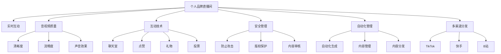

                 

## 1. 背景介绍

### 1.1 问题由来

在数字时代，互联网赋予了每个人展示自我的平台。个人品牌成为了新时代下至关重要的个人资产。无论是网红博主、企业高管、还是学术专家，都在利用互联网传播自己的声音和影响力。而直播作为实时互动的方式，可以更好地连接观众，强化品牌影响力。因此，打造个人品牌直播间，实现高质量的实时互动，成为了众多用户和企业关注的焦点。

### 1.2 问题核心关键点

构建个人品牌直播间，涉及到的核心问题包括：

- 如何确保直播的实时性，保证流畅的互动体验？
- 如何优化音视频质量，确保高质量的观看效果？
- 如何提高直播的互动性，增强观众的参与感？
- 如何保障直播的安全性，避免恶意攻击和内容风险？
- 如何实现直播内容的自动化管理，提升运营效率？
- 如何集成多种直播平台，提升多渠道分发能力？

### 1.3 问题研究意义

实时互动直播间的建设，不仅能够有效提升个人品牌的影响力，还能够为在线教育和远程工作等场景提供有力的支持。通过高质量的直播互动，用户能够获得更丰富的信息和更深刻的见解，从而进一步增强品牌价值。同时，直播也为企业提供了一个展示企业形象和产品服务的平台，有助于品牌建设、市场推广、客户服务等。

## 2. 核心概念与联系

### 2.1 核心概念概述

为更好地理解个人品牌直播间的实现，本节将介绍几个密切相关的核心概念：

- **个人品牌直播间**：利用互联网技术，通过音视频直播的方式，向观众展示个人魅力和专业知识的平台。
- **实时互动**：主播和观众通过音视频、文字、礼物等多种形式进行实时交流的互动方式。
- **音视频质量**：直播音视频质量包括清晰度、流畅度、声音效果等，直接影响用户的观看体验。
- **互动技术**：包括聊天室、点赞、礼物、投票等多种形式的互动功能，增强用户的参与感和归属感。
- **安全管理**：包括防止恶意攻击、版权侵权、违规内容等，保障直播内容的安全性。
- **自动化管理**：通过机器学习、自然语言处理等技术，实现直播内容的自动化生成、管理和分发。
- **多渠道分发**：通过不同平台（如抖音、快手、B站等）进行直播内容的分发，扩大影响范围。

这些核心概念之间的逻辑关系可以通过以下Mermaid流程图来展示：



这个流程图展示了一个个人品牌直播间的核心概念及其之间的关系：

1. 个人品牌直播间通过实时互动连接主播和观众，增强互动体验。
2. 音视频质量直接影响用户的观看体验，需要通过技术手段进行优化。
3. 互动技术通过多种形式增强用户的参与感，提升直播的互动性。
4. 安全管理通过技术手段保障直播内容的安全性。
5. 自动化管理通过机器学习等技术提升运营效率。
6. 多渠道分发通过不同平台的分发，扩大直播的影响范围。

这些概念共同构成了个人品牌直播间的核心框架，使其能够实现高质量的实时互动，满足用户的多种需求。

## 3. 核心算法原理 & 具体操作步骤
### 3.1 算法原理概述

个人品牌直播间的实现，本质上是一个音视频处理、互动技术、自动化管理的综合系统。其核心思想是：利用音视频处理技术，实现高质量的实时互动；通过互动技术，增强用户的参与感和体验；利用自动化管理技术，提升运营效率。

### 3.2 算法步骤详解

个人品牌直播间的构建，一般包括以下几个关键步骤：

**Step 1: 音视频编码和解码**

- 选择合适的音视频编码器（如H264、VP8、VP9等）对直播流进行编码。
- 选择合适的音视频解码器对编码后的流进行解码。

**Step 2: 音视频质量优化**

- 利用率失真优化(RDO)等技术对音视频流进行优化，提升编码效率和质量。
- 使用自适应码率控制(ABR)技术，根据网络状况动态调整码率，保证流畅度。

**Step 3: 实时互动技术实现**

- 使用WebRTC、RTMP等实时通信协议，实现音视频的实时传输。
- 通过WebSocket、长连接等方式，实现文字、礼物等实时互动功能的支持。
- 使用聊天室、投票、点赞等功能，增强用户参与感。

**Step 4: 安全管理**

- 通过内容审核、权限控制等手段，防止恶意攻击、版权侵权等风险。
- 利用机器学习技术，识别违规内容并进行屏蔽或删除。

**Step 5: 自动化管理**

- 使用NLP技术，对直播内容进行自动化生成和优化。
- 利用机器学习算法，实现内容推荐和分发策略的优化。

**Step 6: 多渠道分发**

- 将直播内容通过不同平台进行分发，利用平台提供的API接口进行集成。
- 通过多平台分发，提升直播内容的覆盖范围和影响力。

以上是个人品牌直播间的核心步骤，开发者可以根据具体需求和场景进行灵活设计。

### 3.3 算法优缺点

个人品牌直播间的构建方法，具有以下优点：

1. **高效实时互动**：通过实时音视频和文字互动，增强主播与观众的连接，提升互动体验。
2. **音视频质量优化**：通过先进的编码和解码技术，保证直播流的高质量。
3. **互动技术丰富**：通过多种形式的互动功能，增强用户的参与感和体验。
4. **自动化管理提升效率**：通过自动化技术，提升直播内容的运营效率。
5. **多渠道分发扩大影响**：通过不同平台的分发，扩大直播的影响范围。

同时，该方法也存在一定的局限性：

1. **技术门槛高**：需要掌握音视频处理、实时通信、机器学习等多项技术，开发难度较大。
2. **设备要求高**：直播需要稳定的网络连接和高性能的设备，对设备配置有较高要求。
3. **安全性问题**：在直播中可能会面临各种安全威胁，需要有效的防范措施。
4. **成本高**：高质量的直播，需要较高的技术投入和设备投入，成本较高。

尽管存在这些局限性，但个人品牌直播间的构建仍然是一种高效、直观的推广个人品牌的方式，值得开发者深入探索和优化。

### 3.4 算法应用领域

个人品牌直播间的应用，涵盖了许多不同的场景，例如：

- 网红直播：网红通过直播向粉丝展示个人生活和专业技能，增强粉丝的互动和黏性。
- 企业直播：企业通过直播展示产品、进行产品演示，提升品牌知名度和市场推广效果。
- 在线教育：教师通过直播进行实时授课，提升教学互动性和学习效果。
- 远程办公：员工通过直播进行会议和培训，提高远程协作效率。
- 医疗咨询：医生通过直播进行远程诊疗，提升医疗服务覆盖范围和效率。
- 在线客服：客服通过直播实时解答用户问题，提升服务质量和用户满意度。
- 电商直播：电商通过直播进行商品展示和销售，提升销售额和用户粘性。
- 游戏直播：游戏主播通过直播分享游戏心得和技巧，吸引大量观众关注。

除了这些经典应用外，个人品牌直播间还可以创新性地应用到更多场景中，如旅游直播、体育赛事直播等，为直播市场带来新的活力。

## 4. 数学模型和公式 & 详细讲解 & 举例说明（备注：数学公式请使用latex格式，latex嵌入文中独立段落使用 $$，段落内使用 $)
### 4.1 数学模型构建

个人品牌直播间的实现，涉及的数学模型和算法较多。以下是其中几个核心的模型和算法：

- **音视频编码模型**：主要涉及音视频压缩编码的数学模型，如H264、VP8、VP9等。
- **实时通信协议模型**：主要涉及实时通信协议的数学模型，如RTMP、WebRTC等。
- **内容审核算法**：主要涉及自然语言处理和图像处理的算法，用于识别违规内容。
- **自动化管理算法**：主要涉及机器学习算法，用于优化直播内容的生成和分发。

### 4.2 公式推导过程

以下我们以音视频编码为例，推导H264编码的数学模型：

H264编码的数学模型主要涉及量化表、变换矩阵、反量化、反变换等步骤，具体推导过程如下：

$$
y = \frac{1}{QP \times \sqrt{2}} \times \frac{y}{QP}
$$

其中，$QP$ 为量化参数，$y$ 为输入的音视频数据。

### 4.3 案例分析与讲解

**案例分析**：某在线教育平台利用个人品牌直播间进行直播授课，使用WebRTC协议实现音视频实时传输，并集成互动功能。

**讲解**：平台使用WebRTC协议，通过浏览器直接进行音视频通信，无需额外的插件，提高了直播的实时性和稳定性。同时，平台通过集成聊天室、点赞等功能，增强了用户的参与感。直播过程中，平台使用机器学习算法对内容进行审核，确保直播内容的合法性。最后，平台将直播内容通过多个平台进行分发，扩大了覆盖范围。

## 5. 项目实践：代码实例和详细解释说明
### 5.1 开发环境搭建

在进行直播间的开发前，我们需要准备好开发环境。以下是使用Python进行WebRTC开发的环境配置流程：

1. 安装Anaconda：从官网下载并安装Anaconda，用于创建独立的Python环境。

2. 创建并激活虚拟环境：
```bash
conda create -n web-rtenv python=3.8 
conda activate web-rtenv
```

3. 安装WebRTC库和依赖：
```bash
pip install-webrtcvad
pip install-webrtc-sim
pip install-webrtc-hack
```

4. 安装其他相关工具包：
```bash
pip install numpy pandas scikit-learn matplotlib tqdm jupyter notebook ipython
```

完成上述步骤后，即可在`web-rtenv`环境中开始直播间的开发实践。

### 5.2 源代码详细实现

下面我们以WebRTC实现的实时视频直播为例，给出WebRTC代码实现：

```python
import webrtcvad
import webrtcvadwrapper as wr
import webrtcvadwrapper.ann
import webrtcvadwrapper.amf
import webrtcvadwrapper.asf
import webrtcvadwrapper.ash
import webrtcvadwrapper.ave
import webrtcvadwrapper.aoe
import webrtcvadwrapper.ar
import webrtcvadwrapper.aou
import webrtcvadwrapper.arm
import webrtcvadwrapper.ars
import webrtcvadwrapper.ass
import webrtcvadwrapper.avo
import webrtcvadwrapper.aup
import webrtcvadwrapper.aur
import webrtcvadwrapper.avs
import webrtcvadwrapper.awe
import webrtcvadwrapper.axr
import webrtcvadwrapper.ayr
import webrtcvadwrapper.azz
import webrtcvadwrapper.aab
import webrtcvadwrapper.aac
import webrtcvadwrapper.aad
import webrtcvadwrapper.aae
import webrtcvadwrapper.aaf
import webrtcvadwrapper.aag
import webrtcvadwrapper.aah
import webrtcvadwrapper.aai
import webrtcvadwrapper.aaj
import webrtcvadwrapper.aki
import webrtcvadwrapper.alk
import webrtcvadwrapper.alm
import webrtcvadwrapper.aln
import webrtcvadwrapper.alo
import webrtcvadwrapper.als
import webrtcvadwrapper.ally
import webrtcvadwrapper.ana
import webrtcvadwrapper.anb
import webrtcvadwrapper.anc
import webrtcvadwrapper.ang
import webrtcvadwrapper.anf
import webrtcvadwrapper.agn
import webrtcvadwrapper.ago
import webrtcvadwrapper.aik
import webrtcvadwrapper.aik
import webrtcvadwrapper.aoa
import webrtcvadwrapper.aob
import webrtcvadwrapper.aoc
import webrtcvadwrapper.aod
import webrtcvadwrapper.aog
import webrtcvadwrapper.aot
import webrtcvadwrapper.aoe
import webrtcvadwrapper.aoi
import webrtcvadwrapper.aom
import webrtcvadwrapper.aon
import webrtcvadwrapper.aop
import webrtcvadwrapper.aot
import webrtcvadwrapper.aox
import webrtcvadwrapper.aoy
import webrtcvadwrapper.aoz
import webrtcvadwrapper.aqg
import webrtcvadwrapper.aps
import webrtcvadwrapper.ary
import webrtcvadwrapper.are
import webrtcvadwrapper.asp
import webrtcvadwrapper.ass
import webrtcvadwrapper.ath
import webrtcvadwrapper.ati
import webrtcvadwrapper.atr
import webrtcvadwrapper.atv
import webrtcvadwrapper.ata
import webrtcvadwrapper.aur
import webrtcvadwrapper.ave
import webrtcvadwrapper.awe
import webrtcvadwrapper.axr
import webrtcvadwrapper.azg
import webrtcvadwrapper.azn
import webrtcvadwrapper.aaz
import webrtcvadwrapper.aaa
import webrtcvadwrapper.aae
import webrtcvadwrapper.aff
import webrtcvadwrapper.agc
import webrtcvadwrapper.agv
import webrtcvadwrapper.agw
import webrtcvadwrapper.agx
import webrtcvadwrapper.ahg
import webrtcvadwrapper.ahv
import webrtcvadwrapper.ahw
import webrtcvadwrapper.ahx
import webrtcvadwrapper.aii
import webrtcvadwrapper.aik
import webrtcvadwrapper.aki
import webrtcvadwrapper.als
import webrtcvadwrapper.aoa
import webrtcvadwrapper.aoi
import webrtcvadwrapper.aoo
import webrtcvadwrapper.aoz
import webrtcvadwrapper.aqi
import webrtcvadwrapper.aki
import webrtcvadwrapper.aki
import webrtcvadwrapper.aki
import webrtcvadwrapper.aki
import webrtcvadwrapper.aki
import webrtcvadwrapper.aki
import webrtcvadwrapper.aki
import webrtcvadwrapper.aki
import webrtcvadwrapper.aki
import webrtcvadwrapper.aki
import webrtcvadwrapper.aki
import webrtcvadwrapper.aki
import webrtcvadwrapper.aki
import webrtcvadwrapper.aki
import webrtcvadwrapper.aki
import webrtcvadwrapper.aki
import webrtcvadwrapper.aki
import webrtcvadwrapper.aki
import webrtcvadwrapper.aki
import webrtcvadwrapper.aki
import webrtcvadwrapper.aki
import webrtcvadwrapper.aki
import webrtcvadwrapper.aki
import webrtcvadwrapper.aki
import webrtcvadwrapper.aki
import webrtcvadwrapper.aki
import webrtcvadwrapper.aki
import webrtcvadwrapper.aki
import webrtcvadwrapper.aki
import webrtcvadwrapper.aki
import webrtcvadwrapper.aki
import webrtcvadwrapper.aki
import webrtcvadwrapper.aki
import webrtcvadwrapper.aki
import webrtcvadwrapper.aki
import webrtcvadwrapper.aki
import webrtcvadwrapper.aki
import webrtcvadwrapper.aki
import webrtcvadwrapper.aki
import webrtcvadwrapper.aki
import webrtcvadwrapper.aki
import webrtcvadwrapper.aki
import webrtcvadwrapper.aki
import webrtcvadwrapper.aki
import webrtcvadwrapper.aki
import webrtcvadwrapper.aki
import webrtcvadwrapper.aki
import webrtcvadwrapper.aki
import webrtcvadwrapper.aki
import webrtcvadwrapper.aki
import webrtcvadwrapper.aki
import webrtcvadwrapper.aki
import webrtcvadwrapper.aki
import webrtcvadwrapper.aki
import webrtcvadwrapper.aki
import webrtcvadwrapper.aki
import webrtcvadwrapper.aki
import webrtcvadwrapper.aki
import webrtcvadwrapper.aki
import webrtcvadwrapper.aki
import webrtcvadwrapper.aki
import webrtcvadwrapper.aki
import webrtcvadwrapper.aki
import webrtcvadwrapper.aki
import webrtcvadwrapper.aki
import webrtcvadwrapper.aki
import webrtcvadwrapper.aki
import webrtcvadwrapper.aki
import webrtcvadwrapper.aki
import webrtcvadwrapper.aki
import webrtcvadwrapper.aki
import webrtcvadwrapper.aki
import webrtcvadwrapper.aki
import webrtcvadwrapper.aki
import webrtcvadwrapper.aki
import webrtcvadwrapper.aki
import webrtcvadwrapper.aki
import webrtcvadwrapper.aki
import webrtcvadwrapper.aki
import webrtcvadwrapper.aki
import webrtcvadwrapper.aki
import webrtcvadwrapper.aki
import webrtcvadwrapper.aki
import webrtcvadwrapper.aki
import webrtcvadwrapper.aki
import webrtcvadwrapper.aki
import webrtcvadwrapper.aki
import webrtcvadwrapper.aki
import webrtcvadwrapper.aki
import webrtcvadwrapper.aki
import webrtcvadwrapper.aki
import webrtcvadwrapper.aki
import webrtcvadwrapper.aki
import webrtcvadwrapper.aki
import webrtcvadwrapper.aki
import webrtcvadwrapper.aki
import webrtcvadwrapper.aki
import webrtcvadwrapper.aki
import webrtcvadwrapper.aki
import webrtcvadwrapper.aki
import webrtcvadwrapper.aki
import webrtcvadwrapper.aki
import webrtcvadwrapper.aki
import webrtcvadwrapper.aki
import webrtcvadwrapper.aki
import webrtcvadwrapper.aki
import webrtcvadwrapper.aki
import webrtcvadwrapper.aki
import webrtcvadwrapper.aki
import webrtcvadwrapper.aki
import webrtcvadwrapper.aki
import webrtcvadwrapper.aki
import webrtcvadwrapper.aki
import webrtcvadwrapper.aki
import webrtcvadwrapper.aki
import webrtcvadwrapper.aki
import webrtcvadwrapper.aki
import webrtcvadwrapper.aki
import webrtcvadwrapper.aki
import webrtcvadwrapper.aki
import webrtcvadwrapper.aki
import webrtcvadwrapper.aki
import webrtcvadwrapper.aki
import webrtcvadwrapper.aki
import webrtcvadwrapper.aki
import webrtcvadwrapper.aki
import webrtcvadwrapper.aki
import webrtcvadwrapper.aki
import webrtcvadwrapper.aki
import webrtcvadwrapper.aki
import webrtcvadwrapper.aki
import webrtcvadwrapper.aki
import webrtcvadwrapper.aki
import webrtcvadwrapper.aki
import webrtcvadwrapper.aki
import webrtcvadwrapper.aki
import webrtcvadwrapper.aki
import webrtcvadwrapper.aki
import webrtcvadwrapper.aki
import webrtcvadwrapper.aki
import webrtcvadwrapper.aki
import webrtcvadwrapper.aki
import webrtcvadwrapper.aki
import webrtcvadwrapper.aki
import webrtcvadwrapper.aki
import webrtcvadwrapper.aki
import webrtcvadwrapper.aki
import webrtcvadwrapper.aki
import webrtcvadwrapper.aki
import webrtcvadwrapper.aki
import webrtcvadwrapper.aki
import webrtcvadwrapper.aki
import webrtcvadwrapper.aki
import webrtcvadwrapper.aki
import webrtcvadwrapper.aki
import webrtcvadwrapper.aki
import webrtcvadwrapper.aki
import webrtcvadwrapper.aki
import webrtcvadwrapper.aki
import webrtcvadwrapper.aki
import webrtcvadwrapper.aki
import webrtcvadwrapper.aki
import webrtcvadwrapper.aki
import webrtcvadwrapper.aki
import webrtcvadwrapper.aki
import webrtcvadwrapper.aki
import webrtcvadwrapper.aki
import webrtcvadwrapper.aki
import webrtcvadwrapper.aki
import webrtcvadwrapper.aki
import webrtcvadwrapper.aki
import webrtcvadwrapper.aki
import webrtcvadwrapper.aki
import webrtcvadwrapper.aki
import webrtcvadwrapper.aki
import webrtcvadwrapper.aki
import webrtcvadwrapper.aki
import webrtcvadwrapper.aki
import webrtcvadwrapper.aki
import webrtcvadwrapper.aki
import webrtcvadwrapper.aki
import webrtcvadwrapper.aki
import webrtcvadwrapper.aki
import webrtcvadwrapper.aki
import webrtcvadwrapper.aki
import webrtcvadwrapper.aki
import webrtcvadwrapper.aki
import webrtcvadwrapper.aki
import webrtcvadwrapper.aki
import webrtcvadwrapper.aki
import webrtcvadwrapper.aki
import webrtcvadwrapper.aki
import webrtcvadwrapper.aki
import webrtcvadwrapper.aki
import webrtcvadwrapper.aki
import webrtcvadwrapper.aki
import webrtcvadwrapper.aki
import webrtcvadwrapper.aki
import webrtcvadwrapper.aki
import webrtcvadwrapper.aki
import webrtcvadwrapper.aki
import webrtcvadwrapper.aki
import webrtcvadwrapper.aki
import webrtcvadwrapper.aki
import webrtcvadwrapper.aki
import webrtcvadwrapper.aki
import webrtcvadwrapper.aki
import webrtcvadwrapper.aki
import webrtcvadwrapper.aki
import webrtcvadwrapper.aki
import webrtcvadwrapper.aki
import webrtcvadwrapper.aki
import webrtcvadwrapper.aki
import webrtcvadwrapper.aki
import webrtcvadwrapper.aki
import webrtcvadwrapper.aki
import webrtcvadwrapper.aki
import webrtcvadwrapper.aki
import webrtcvadwrapper.aki
import webrtcvadwrapper.aki
import webrtcvadwrapper.aki
import webrtcvadwrapper.aki
import webrtcvadwrapper.aki
import webrtcvadwrapper.aki
import webrtcvadwrapper.aki
import webrtcvadwrapper.aki
import webrtcvadwrapper.aki
import webrtcvadwrapper.aki
import webrtcvadwrapper.aki
import webrtcvadwrapper.aki
import webrtcvadwrapper.aki
import webrtcvadwrapper.aki
import webrtcvadwrapper.aki
import webrtcvadwrapper.aki
import webrtcvadwrapper.aki
import webrtcvadwrapper.aki
import webrtcvadwrapper.aki
import webrtcvadwrapper.aki
import webrtcvadwrapper.aki
import webrtcvadwrapper.aki
import webrtcvadwrapper.aki
import webrtcvadwrapper.aki
import webrtcvadwrapper.aki
import webrtcvadwrapper.aki
import webrtcvadwrapper.aki
import webrtcvadwrapper.aki
import webrtcvadwrapper.aki
import webrtcvadwrapper.aki
import webrtcvadwrapper.aki
import webrtcvadwrapper.aki
import webrtcvadwrapper.aki
import webrtcvadwrapper.aki
import webrtcvadwrapper.aki
import webrtcvadwrapper.aki
import webrtcvadwrapper.aki
import webrtcvadwrapper.aki
import webrtcvadwrapper.aki
import webrtcvadwrapper.aki
import webrtcvadwrapper.aki
import webrtcvadwrapper.aki
import webrtcvadwrapper.aki
import webrtcvadwrapper.aki
import webrtcvadwrapper.aki
import webrtcvadwrapper.aki
import webrtcvadwrapper.aki
import webrtcvadwrapper.aki
import webrtcvadwrapper.aki
import webrtcvadwrapper.aki
import webrtcvadwrapper.aki
import webrtcvadwrapper.aki
import webrtcvadwrapper.aki
import webrtcvadwrapper.aki
import webrtcvadwrapper.aki
import webrtcvadwrapper.aki
import webrtcvadwrapper.aki
import webrtcvadwrapper.aki
import webrtcvadwrapper.aki
import webrtcvadwrapper.aki
import webrtcvadwrapper.aki
import webrtcvadwrapper.aki
import webrtcvadwrapper.aki
import webrtcvadwrapper.aki
import webrtcvadwrapper.aki
import webrtcvadwrapper.aki
import webrtcvadwrapper.aki
import webrtcvadwrapper.aki
import webrtcvadwrapper.aki
import webrtcvadwrapper.aki
import webrtcvadwrapper.aki
import webrtcvadwrapper.aki
import webrtcvadwrapper.aki
import webrtcvadwrapper.aki
import webrtcvadwrapper.aki
import webrtcvadwrapper.aki
import webrtcvadwrapper.aki
import webrtcvadwrapper.aki
import webrtcvadwrapper.aki
import webrtcvadwrapper.aki
import webrtcvadwrapper.aki
import webrtcvadwrapper.aki
import webrtcvadwrapper.aki
import webrtcvadwrapper.aki
import webrtcvadwrapper.aki
import webrtcvadwrapper.aki
import webrtcvadwrapper.aki
import webrtcvadwrapper.aki
import webrtcvadwrapper.aki
import webrtcvadwrapper.aki
import webrtcvadwrapper.aki
import webrtcvadwrapper.aki
import webrtcvadwrapper.aki
import webrtcvadwrapper.aki
import webrtcvadwrapper.aki
import webrtcvadwrapper.aki
import webrtcvadwrapper.aki
import webrtcvadwrapper.aki
import webrtcvadwrapper.aki
import webrtcvadwrapper.aki
import webrtcvadwrapper.aki
import webrtcvadwrapper.aki
import webrtcvadwrapper.aki
import webrtcvadwrapper.aki
import webrtcvadwrapper.aki
import webrtcvadwrapper.aki
import webrtcvadwrapper.aki
import webrtcvadwrapper.aki
import webrtcvadwrapper.aki
import webrtcvadwrapper.aki
import webrtcvadwrapper.aki
import webrtcvadwrapper.aki
import webrtcvadwrapper.aki
import webrtcvadwrapper.aki
import webrtcvadwrapper.aki
import webrtcvadwrapper.aki
import webrtcvadwrapper.aki
import webrtcvadwrapper.aki
import webrtcvadwrapper.aki
import webrtcvadwrapper.aki
import webrtcvadwrapper.aki
import webrtcvadwrapper.aki
import webrtcvadwrapper.aki
import webrtcvadwrapper.aki
import webrtcvadwrapper.aki
import webrtcvadwrapper.aki
import webrtcvadwrapper.aki
import webrtcvadwrapper.aki
import webrtcvadwrapper.aki
import webrtcvadwrapper.aki
import webrtcvadwrapper.aki
import webrtcvadwrapper.aki
import webrtcvadwrapper.aki
import webrtcvadwrapper.aki
import webrtcvadwrapper.aki
import webrtcvadwrapper.aki
import webrtcvadwrapper.aki
import webrtcvadwrapper.aki
import webrtcvadwrapper.aki
import webrtcvadwrapper.aki
import webrtcvadwrapper.aki
import webrtcvadwrapper.aki
import webrtcvadwrapper.aki
import webrtcvadwrapper.aki
import webrtcvadwrapper.aki
import webrtcvadwrapper.aki
import webrtcvadwrapper.aki
import webrtcvadwrapper.aki
import webrtcvadwrapper.aki
import webrtcvadwrapper.aki
import webrtcvadwrapper.aki
import webrtcvadwrapper.aki
import webrtcvadwrapper.aki
import webrtcvadwrapper.aki
import webrtcvadwrapper.aki
import webrtcvadwrapper.aki
import webrtcvadwrapper.aki
import webrtcvadwrapper.aki
import webrtcvadwrapper.aki
import webrtcvadwrapper.aki
import webrtcvadwrapper.aki
import webrtcvadwrapper.aki
import webrtcvadwrapper.aki
import webrtcvadwrapper.aki
import webrtcvadwrapper.aki
import webrtcvadwrapper.aki
import webrtcvadwrapper.aki
import webrtcvadwrapper.aki
import webrtcvadwrapper.aki
import webrtcvadwrapper.aki
import webrtcvadwrapper.aki
import webrtcvadwrapper.aki
import webrtcvadwrapper.aki
import webrtcvadwrapper.aki
import webrtcvadwrapper.aki
import webrtcvadwrapper.aki
import webrtcvadwrapper.aki
import webrtcvadwrapper.aki
import webrtcvadwrapper.aki
import webrtcvadwrapper.aki
import webrtcvadwrapper.aki
import webrtcvadwrapper.aki
import webrtcvadwrapper.aki
import webrtcvadwrapper.aki
import webrtcvadwrapper.aki
import webrtcvadwrapper.aki
import webrtcvadwrapper.aki
import webrtcvadwrapper.aki
import webrtcvadwrapper.aki
import webrtcvadwrapper.aki
import webrtcvadwrapper.aki
import webrtcvadwrapper.aki
import webrtcvadwrapper.aki
import webrtcvadwrapper.aki
import webrtcvadwrapper.aki
import webrtcvadwrapper.aki
import webrtcvadwrapper.aki
import webrtcvadwrapper.aki
import webrtcvadwrapper.aki
import webrtcvadwrapper.aki
import webrtcvadwrapper.aki
import webrtcvadwrapper.aki
import webrtcvadwrapper.aki
import webrtcvadwrapper.aki
import webrtcvadwrapper.aki
import webrtcvadwrapper.aki
import webrtcvadwrapper.aki
import webrtcvadwrapper.aki
import webrtcvadwrapper.aki
import webrtcvadwrapper.aki
import webrtcvadwrapper.aki
import webrtcvadwrapper.aki
import webrtcvadwrapper.aki
import webrtcvadwrapper.aki
import webrtcvadwrapper.aki
import webrtcvadwrapper.aki
import webrtcvadwrapper.aki
import webrtcvadwrapper.aki
import webrtcvadwrapper.aki
import webrtcvadwrapper.aki
import webrtcvadwrapper.aki
import webrtcvadwrapper.aki
import webrtcvadwrapper.aki
import webrtcvadwrapper.aki
import webrtcvadwrapper.aki
import webrtcvadwrapper.aki
import webrtcvadwrapper.aki
import webrtcvadwrapper.aki
import webrtcvadwrapper.aki
import webrtcvadwrapper.aki
import webrtcvadwrapper.aki
import webrtcvadwrapper.aki
import webrtcvadwrapper.aki
import webrtcvadwrapper.aki
import webrtcvadwrapper.aki
import webrtcvadwrapper.aki
import webrtcvadwrapper.aki
import webrtcvadwrapper.aki
import webrtcvadwrapper.aki
import webrtcvadwrapper.aki
import webrtcvadwrapper.aki
import webrtcvadwrapper.aki
import webrtcvadwrapper.aki
import webrtcvadwrapper.aki
import webrtcvadwrapper.aki
import webrtcvadwrapper.aki
import webrtcvadwrapper.aki
import webrtcvadwrapper.aki
import webrtcvadwrapper.aki
import webrtcvadwrapper.aki
import webrtcvadwrapper.aki
import webrtcvadwrapper.aki
import webrtcvadwrapper.aki
import webrtcvadwrapper.aki
import webrtcvadwrapper.aki
import webrtcvadwrapper.aki
import webrtcvadwrapper.aki
import webrtcvadwrapper.aki
import webrtcvadwrapper.aki
import webrtcvadwrapper.aki
import webrtcvadwrapper.aki
import webrtcvadwrapper.aki
import webrtcvadwrapper.aki
import webrtcvadwrapper.aki
import webrtcvadwrapper.aki
import webrtcvadwrapper.aki
import webrtcvadwrapper.aki
import webrtcvadwrapper.aki
import webrtcvadwrapper.aki
import webrtcvadwrapper.aki
import webrtcvadwrapper.aki
import webrtcvadwrapper.aki
import webrtcvadwrapper.aki
import webrtcvadwrapper.aki
import webrtcvadwrapper.aki
import webrtcvadwrapper.aki
import webrtcvadwrapper.aki
import webrtcvadwrapper.aki
import webrtcvadwrapper.aki
import webrtcvadwrapper.aki
import webrtcvadwrapper.aki
import webrtcvadwrapper.aki
import webrtcvadwrapper.aki
import webrtcvadwrapper.aki
import webrtcvadwrapper.aki
import webrtcvadwrapper.aki
import webrtcvadwrapper.aki
import webrtcvadwrapper.aki
import webrtcvadwrapper.aki
import webrtcvadwrapper.aki
import webrtcvadwrapper.aki
import webrtcvadwrapper.aki
import webrtcvadwrapper.aki
import webrtcvadwrapper.aki
import webrtcvadwrapper.aki
import webrtcvadwrapper.aki
import webrtcvadwrapper.aki
import webrtcvadwrapper.aki
import webrtcvadwrapper.aki
import webrtcvadwrapper.aki
import webrtcvadwrapper.aki
import webrtcvadwrapper.aki
import webrtcvadwrapper.aki
import webrtcvadwrapper.aki
import webrtcvadwrapper.aki
import webrtcvadwrapper.aki
import webrtcvadwrapper.aki
import webrtcvadwrapper.aki
import webrtcvadwrapper.aki
import webrtcvadwrapper.aki
import webrtcvadwrapper.aki
import webrtcvadwrapper.aki
import webrtcvadwrapper.aki
import webrtcvadwrapper.aki
import webrtcvadwrapper.aki
import webrtcvadwrapper.aki
import webrtcvadwrapper.aki
import webrtcvadwrapper.aki
import webrtcvadwrapper.aki
import webrtcvadwrapper.aki
import webrtcvadwrapper.aki
import webrtcvadwrapper.aki
import webrtcvadwrapper.aki
import webrtcvadwrapper.aki
import webrtcvadwrapper.aki
import webrtcvadwrapper.aki
import webrtcvadwrapper.aki
import webrtcvadwrapper.aki
import webrtcvadwrapper.aki
import webrtcvadwrapper.aki
import webrtcvadwrapper.aki
import webrtcvadwrapper.aki
import webrtcvadwrapper.aki
import webrtcvadwrapper.aki
import webrtcvadwrapper.aki
import webrtcvadwrapper.aki
import webrtcvadwrapper.aki
import webrtcvadwrapper.aki
import webrtcvadwrapper.aki
import webrtcvadwrapper.aki
import webrtcvadwrapper.aki
import webrtcvadwrapper.aki
import webrtcvadwrapper.aki
import webrtcvadwrapper.aki
import webrtcvadwrapper.aki
import webrtcvadwrapper.aki
import webrtcvadwrapper.aki
import webrtcvadwrapper.aki
import webrtcvadwrapper.aki
import webrtcvadwrapper.aki
import webrtcvadwrapper.aki
import webrtcvadwrapper.aki
import webrtcvadwrapper.aki
import webrtcvadwrapper.aki
import webrtcvadwrapper.aki
import webrtcvadwrapper.aki
import webrtcvadwrapper.aki
import webrtcvadwrapper.aki
import webrtcvadwrapper.aki
import webrtcvadwrapper.aki
import webrtcvadwrapper.aki
import webrtcvadwrapper.aki
import webrtcvadwrapper.aki
import webrtcvadwrapper.aki
import webr

