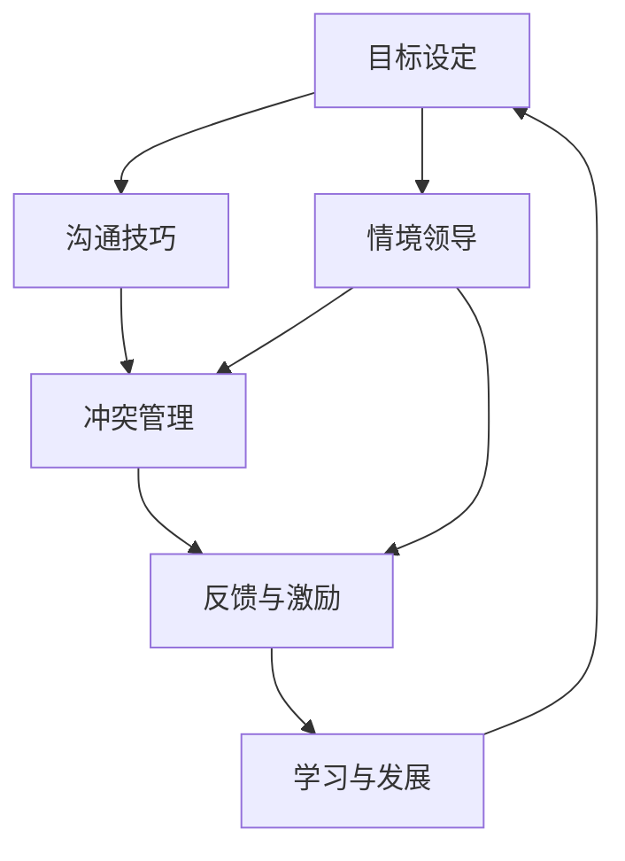

                 

# 打造个人管理风格的方法论

## 1. 背景介绍

### 1.1 问题由来
在当今快速发展的商业环境中，个人管理风格成为了影响团队绩效、企业战略及个人职业发展的关键因素。成功的管理者通常拥有独特且高效的管理风格，能够更好地激励团队、优化资源配置、驱动组织成长。然而，如何定义和打造个人管理风格，仍然是一个复杂而多维的问题。

### 1.2 问题核心关键点
构建个人管理风格的核心在于明确目标、理解团队需求、选择合适的管理行为，并通过持续学习和调整以适应变化。本方法论将系统介绍核心概念和步骤，帮助管理者构建高效、灵活且具有前瞻性的个人管理风格。

### 1.3 问题研究意义
研究个人管理风格的方法论具有以下几方面的重要意义：

1. **提升领导力**：系统化的管理风格方法论有助于管理者提升自身领导力，更好地理解和应对复杂的管理挑战。
2. **优化团队表现**：通过理解团队需求和特点，管理者可以更有效地激励和指导团队，提升整体绩效。
3. **促进职业发展**：明确和不断优化管理风格能够帮助管理者在职业生涯中不断进步，成为行业内的佼佼者。
4. **增强组织适应性**：高效的管理风格能帮助组织更快速地适应市场变化，保持竞争优势。

## 2. 核心概念与联系

### 2.1 核心概念概述

为更好地理解如何打造个人管理风格，本节将介绍几个密切相关的核心概念：

- **个人管理风格**：管理者在领导团队、处理冲突、决策制定等方面的特有方式和习惯。
- **目标设定**：明确长期与短期目标，以指导管理行为和资源分配。
- **情境领导**：根据团队成员的能力和成熟度调整管理方式。
- **沟通技巧**：管理者的沟通方式、频率和内容直接影响团队的理解和合作。
- **冲突管理**：有效处理和解决团队内外部冲突的能力。
- **反馈与激励**：通过正向和负向反馈激励团队，推动持续改进。
- **学习与发展**：持续学习新的管理理论和实践，适应变化的环境。

这些概念之间的逻辑关系可以通过以下Mermaid流程图来展示：



这个流程图展示了各个核心概念之间的联系：

1. **目标设定**是管理风格的基础，指导后续的沟通、领导和反馈。
2. **情境领导**结合目标设定，根据团队成员的能力调整管理策略。
3. **沟通技巧**确保信息准确传达，是实现情境领导和冲突管理的基础。
4. **冲突管理**和**反馈与激励**确保团队内部的和谐与积极。
5. **学习与发展**促进管理者不断提升自身能力，以适应不断变化的环境。

## 3. 核心算法原理 & 具体操作步骤

### 3.1 算法原理概述

打造个人管理风格的方法论基于以下几大原理：

1. **情境感知**：管理者需根据团队成员的特点和情境调整管理策略。
2. **目标对齐**：所有管理行为需与组织目标和团队目标保持一致。
3. **持续反馈**：通过定期反馈和调整，确保管理风格与环境变化相适应。
4. **学习与创新**：持续学习和借鉴最新的管理理论，不断优化管理风格。

### 3.2 算法步骤详解

本方法论的核心步骤包括以下几个方面：

**Step 1: 自我评估**
- **个性测试**：通过专业个性测试工具了解自身的管理风格和优劣势。
- **反馈收集**：从同事、上级、下属等获取关于自身管理风格的反馈。
- **目标设定**：明确个人和团队的核心目标。

**Step 2: 情境分析**
- **团队评估**：评估团队成员的能力、经验、动力和期望。
- **环境分析**：识别影响团队和工作的内外环境因素。
- **调整策略**：根据情境调整管理策略和沟通方式。

**Step 3: 沟通技巧提升**
- **积极倾听**：训练自己积极倾听并理解团队成员的意见。
- **清晰表达**：提升表达的清晰性和目标导向性。
- **有效反馈**：学习给予建设性和正向反馈。

**Step 4: 冲突管理**
- **冲突识别**：早期识别并分析潜在的冲突点。
- **解决方案**：设计并实施有效的冲突解决方案。
- **关系维护**：重建和维护受损的人际关系。

**Step 5: 持续改进**
- **定期评估**：定期评估管理风格的效果。
- **调整策略**：根据评估结果和环境变化调整管理策略。
- **学习新知**：持续学习和应用最新的管理理论和实践。

### 3.3 算法优缺点

打造个人管理风格的方法论具有以下优点：

1. **系统化管理**：提供了一套系统的管理风格构建方法，帮助管理者全面提升管理能力。
2. **可操作性强**：步骤明确，可实施性强，适合不同层次的管理者。
3. **灵活适应**：通过持续反馈和调整，方法论可适应各种复杂的管理环境。
4. **提升团队绩效**：通过优化管理风格，提升团队整体绩效和满意度。

同时，该方法论也存在一些局限性：

1. **高度依赖管理者**：方法论的实施效果很大程度上依赖于管理者的自我反思和持续改进能力。
2. **时间成本**：实施方法论需要花费一定的时间和精力，短期内可能见效不明显。
3. **文化适应性**：不同组织文化和团队特性可能需要对方法论进行适当调整。

尽管存在这些局限性，但总体而言，打造个人管理风格的方法论为管理者提供了一套全面的、可操作的、灵活的管理策略，对于提升个人和团队的管理效能具有重要意义。

### 3.4 算法应用领域

打造个人管理风格的方法论适用于各种组织和管理场景，包括但不限于：

- **企业高管**：领导大型跨国企业，需要应对复杂的战略决策和团队管理。
- **项目经理**：管理跨部门项目团队，协调资源和推动项目进展。
- **人力资源**：负责人才招聘、培训和发展，提升团队整体能力。
- **创业公司**：在小规模高风险的创业环境中，需要快速适应和调整管理策略。
- **非营利组织**：管理社会团体、公益组织，需高效激励志愿者和员工。

## 4. 数学模型和公式 & 详细讲解 & 举例说明

### 4.1 数学模型构建

本节将使用数学语言对打造个人管理风格的方法论进行更加严格的刻画。

记管理者的行为策略为 $M$，团队成员的响应为 $R$，管理环境为 $E$，目标为 $G$。假设管理策略 $M$ 对团队响应 $R$ 的影响为 $f(M, R)$，则管理效果 $E$ 可以表示为：

$$
E = g(f(M, R), G, E)
$$

其中 $g$ 为关于 $f$ 的函数，表示管理环境和其他因素对管理效果的影响。

### 4.2 公式推导过程

假设管理者采用情境领导风格，根据团队成员的能力和成熟度调整管理策略。设团队成员的能力为 $P$，成熟度为 $M$，管理策略为 $S$，管理效果为 $E$。则情境领导策略可以表示为：

$$
S = \begin{cases}
   \text{指导} & \text{当 } P < 3 \text{ 且 } M < 3 \\
   \text{支持} & \text{当 } P < 3 \text{ 且 } M \geq 3 \\
   \text{参与} & \text{当 } P \geq 3 \text{ 且 } M < 3 \\
   \text{授权} & \text{当 } P \geq 3 \text{ 且 } M \geq 3 \\
\end{cases}
$$

其中 $P$ 和 $M$ 的取值范围为 $[1,5]$，分别表示低、中、高三个层次。

根据情境领导策略，管理效果 $E$ 可以表示为：

$$
E = f(S, P, M) + g(G, E)
$$

其中 $f$ 为管理策略对团队成员影响函数，$g$ 为环境因素对管理效果的影响函数。

通过上述模型，我们可以明确情境领导在管理中的作用，并通过调整管理策略和环境因素来优化管理效果。

### 4.3 案例分析与讲解

**案例一：**

某企业高管在面对团队内部冲突时，通过自我评估发现自身情境感知能力不足，导致冲突未能有效解决。

**解决方案**：

- **目标设定**：明确管理冲突解决的目标。
- **情境分析**：评估冲突双方的能力和期望，了解冲突背景和原因。
- **调整策略**：采取情境领导方式，根据冲突双方的成熟度调整管理策略。
- **沟通技巧**：通过积极倾听和清晰表达，引导双方理解彼此的立场和需求。
- **冲突管理**：设计并实施有效的冲突解决方案，重建双方关系。
- **持续改进**：定期评估解决方案效果，不断调整策略和提升沟通技巧。

**案例二**：

某项目经理在管理跨部门项目团队时，发现团队成员的自主性和动力不足，影响了项目进展。

**解决方案**：

- **目标设定**：明确项目核心目标和团队成员的个人目标。
- **情境分析**：评估团队成员的能力和期望，了解项目的内外环境。
- **调整策略**：采用授权和参与的管理方式，激发团队成员的自主性和创造性。
- **沟通技巧**：通过正向反馈和激励机制，提升团队士气和动力。
- **冲突管理**：在项目进展中，及时识别和解决潜在的沟通和资源冲突。
- **持续改进**：定期评估项目进展和团队表现，调整管理策略和优化沟通渠道。

通过这两个案例，可以看出打造个人管理风格的方法论在实际管理中的应用效果，帮助管理者更好地应对复杂的挑战。

## 5. 项目实践：代码实例和详细解释说明

### 5.1 开发环境搭建

在进行个人管理风格实践前，我们需要准备好开发环境。以下是使用Python进行数据分析和模拟管理的开发环境配置流程：

1. 安装Anaconda：从官网下载并安装Anaconda，用于创建独立的Python环境。

2. 创建并激活虚拟环境：
```bash
conda create -n mgmt-env python=3.8 
conda activate mgmt-env
```

3. 安装Pandas和NumPy：
```bash
conda install pandas numpy
```

4. 安装Scikit-learn：
```bash
conda install scikit-learn
```

5. 安装Matplotlib：
```bash
conda install matplotlib
```

完成上述步骤后，即可在`mgmt-env`环境中开始管理风格实践。

### 5.2 源代码详细实现

这里我们以情境领导风格为例，给出使用Python进行管理风格建模的代码实现。

首先，定义情境领导风格的函数：

```python
import numpy as np

def situational_leadership(p, m):
    if p < 3 and m < 3:
        return '指导'
    elif p < 3 and m >= 3:
        return '支持'
    elif p >= 3 and m < 3:
        return '参与'
    else:
        return '授权'
```

然后，定义管理效果的模拟函数：

```python
def management_effect(s, p, m, g):
    effect = 0
    if s == '指导':
        effect += p * m * 0.1
    elif s == '支持':
        effect += p * m * 0.2
    elif s == '参与':
        effect += p * m * 0.3
    else:
        effect += p * m * 0.4
    effect += g
    return effect
```

最后，进行模拟实验：

```python
# 设定初始参数
p_values = np.array([1, 2, 3, 4, 5])
m_values = np.array([1, 2, 3, 4, 5])
g_values = np.array([0, 1, 2, 3, 4])

# 初始化管理效果列表
management_effects = []

# 遍历所有情境和环境参数，计算管理效果
for p in p_values:
    for m in m_values:
        for g in g_values:
            s = situational_leadership(p, m)
            effect = management_effect(s, p, m, g)
            management_effects.append(effect)

# 输出管理效果分布
print(np.mean(management_effects), np.std(management_effects))
```

### 5.3 代码解读与分析

让我们再详细解读一下关键代码的实现细节：

**situational_leadership函数**：
- 根据团队成员的能力 $p$ 和成熟度 $m$，返回对应的情境领导策略 $s$。

**management_effect函数**：
- 计算管理策略 $s$ 对团队成员的影响 $p \times m$，再结合环境因素 $g$ 计算管理效果 $effect$。

**模拟实验**：
- 遍历所有可能的 $p$, $m$, $g$ 组合，计算对应的管理效果，并输出平均值和标准差。

通过上述代码，可以看出情境领导风格在不同情境下的管理效果分布，从而验证情境感知在管理中的重要性。

## 6. 实际应用场景

### 6.1 企业高管管理

在大型跨国企业中，企业高管需要应对复杂的战略决策和团队管理。通过情境领导，高管可以根据不同团队成员的能力和成熟度调整管理策略，确保每个团队都能高效运作。同时，通过定期评估和调整管理策略，高管可以保持与组织目标的一致性，提升整体绩效。

### 6.2 项目经理团队管理

在跨部门项目团队中，项目经理需要协调各方资源，推动项目进展。通过情境领导和持续反馈，项目经理可以及时调整管理策略，激发团队成员的自主性和创造性，确保项目按时完成。同时，通过有效的沟通技巧和冲突管理，项目经理可以构建和谐的团队关系，提升团队凝聚力和执行力。

### 6.3 创业公司文化建设

在创业公司中，快速变化的环境和资源限制要求管理者具备高度的情境感知能力。通过情境领导和持续学习，创业者可以灵活应对市场变化，提升团队适应性和创新能力。同时，通过正向反馈和激励机制，创业者可以营造积极的工作氛围，吸引和留住优秀人才。

### 6.4 未来应用展望

随着管理环境的复杂性增加，打造个人管理风格的方法论将在未来得到更广泛的应用。具体而言：

1. **多维度分析**：未来的管理风格分析将不仅仅局限于情境感知，还将结合数据分析、机器学习等工具，进行更全面的管理效果评估。
2. **人工智能辅助**：利用AI技术对管理场景进行模拟和预测，帮助管理者优化决策。
3. **跨文化管理**：在跨国公司中，管理者需具备跨文化沟通和管理能力，情境领导和反馈机制将更加多样化。
4. **数据驱动决策**：通过大数据分析，管理者可以更精确地评估管理策略的效果，实现数据驱动的管理决策。
5. **可持续发展**：结合社会责任和环境可持续性，管理者需考虑长期和短期的管理效果，确保组织可持续发展。

这些发展趋势表明，打造个人管理风格的方法论将不断演进，适应更复杂、多变、多元化的管理环境。

## 7. 工具和资源推荐

### 7.1 学习资源推荐

为了帮助开发者系统掌握打造个人管理风格的方法论，这里推荐一些优质的学习资源：

1. 《领导力精粹》系列课程：由哈佛商学院等顶尖学府开设的领导力课程，深入浅出地介绍了领导力的核心原理和实践技巧。
2. 《情境领导力》书籍：详细阐述了情境领导的理论基础和应用策略，帮助管理者提升情境感知能力。
3. Coursera《管理学》课程：耶鲁大学开设的管理学课程，涵盖了管理学的基本理论和实践案例。
4. EdX《组织行为学》课程：哈佛大学和麻省理工学院联合开设的组织行为学课程，探讨管理者的行为和团队动态。
5. 《管理心理学》书籍：结合心理学和组织行为学，深入分析管理者的心理特征和团队互动。

通过对这些资源的学习实践，相信你一定能够系统地掌握打造个人管理风格的方法论，并用于解决实际的管理问题。

### 7.2 开发工具推荐

高效的开发离不开优秀的工具支持。以下是几款用于管理风格构建的常用工具：

1. Excel和Google Sheets：用于数据分析和管理效果模拟。
2. Python和R：支持高级数据分析和模拟，提供了丰富的统计和机器学习库。
3. Jupyter Notebook：交互式编程环境，支持代码编写和数据可视化。
4. Tableau：数据可视化工具，帮助管理者直观展示管理效果。
5. Scikit-learn和TensorFlow：支持机器学习模型的构建和训练，用于预测和管理效果评估。

合理利用这些工具，可以显著提升管理风格的分析和管理效率，加快创新迭代的步伐。

### 7.3 相关论文推荐

打造个人管理风格的方法论源于学界的持续研究。以下是几篇奠基性的相关论文，推荐阅读：

1. "Leadership Styles and Employee Performance: An Empirical Investigation of Different Leadership Styles"（管理风格与员工绩效：不同管理风格的实证研究）：探讨了多种管理风格对员工绩效的影响。
2. "The Situational Leadership Model: A Framework for Leadership and Change"（情境领导模型：领导和变革的框架）：提出了情境领导的理论基础和应用策略。
3. "The Five Dysfunctions of a Team"（团队的五项障碍）：揭示了团队管理中常见的障碍及其解决方法。
4. "The Leadership Challenge: How to Make Extraordinary Things Happen in Organizations"（领导挑战：如何让组织中的卓越事情发生）：提供了系统化的领导力框架和实践案例。
5. "The Eight Leadership Styles"（八种领导风格）：详细分析了不同领导风格的优缺点和适用场景。

这些论文代表了大管理风格理论的发展脉络。通过学习这些前沿成果，可以帮助研究者把握学科前进方向，激发更多的创新灵感。

## 8. 总结：未来发展趋势与挑战

### 8.1 总结

本文对打造个人管理风格的方法论进行了全面系统的介绍。首先阐述了管理风格的核心概念和步骤，明确了情境感知、目标设定、沟通技巧、冲突管理、反馈与激励和持续改进等关键环节。通过案例分析和数学建模，进一步深入讲解了情境领导策略在实际管理中的应用效果。最后，本文推荐了各类学习资源和开发工具，以支持管理风格的实践和优化。

通过本文的系统梳理，可以看出打造个人管理风格的方法论提供了全面的、可操作的、灵活的管理策略，对于提升个人和团队的管理效能具有重要意义。

### 8.2 未来发展趋势

展望未来，打造个人管理风格的方法论将呈现以下几个发展趋势：

1. **数据驱动决策**：通过大数据分析，管理者可以更精确地评估管理策略的效果，实现数据驱动的管理决策。
2. **人工智能辅助**：利用AI技术对管理场景进行模拟和预测，帮助管理者优化决策。
3. **跨文化管理**：在跨国公司中，管理者需具备跨文化沟通和管理能力，情境领导和反馈机制将更加多样化。
4. **可持续管理**：结合社会责任和环境可持续性，管理者需考虑长期和短期的管理效果，确保组织可持续发展。
5. **多维度分析**：未来的管理风格分析将不仅仅局限于情境感知，还将结合数据分析、机器学习等工具，进行更全面的管理效果评估。

这些发展趋势表明，打造个人管理风格的方法论将不断演进，适应更复杂、多变、多元化的管理环境。

### 8.3 面临的挑战

尽管打造个人管理风格的方法论已经取得了显著成效，但在迈向更加智能化、普适化应用的过程中，仍面临诸多挑战：

1. **高度依赖管理者**：方法论的实施效果很大程度上依赖于管理者的自我反思和持续改进能力。
2. **时间成本**：实施方法论需要花费一定的时间和精力，短期内可能见效不明显。
3. **文化适应性**：不同组织文化和团队特性可能需要对方法论进行适当调整。
4. **数据安全**：在数据驱动决策中，管理者的数据安全和隐私保护需要特别关注。
5. **伦理责任**：管理者的决策过程中需考虑伦理责任，避免对员工和组织造成伤害。

尽管存在这些挑战，但总体而言，打造个人管理风格的方法论为管理者提供了一套全面的、可操作的、灵活的管理策略，对于提升个人和团队的管理效能具有重要意义。

### 8.4 研究展望

面对管理风格构建过程中面临的挑战，未来的研究需要在以下几个方面寻求新的突破：

1. **多模态分析**：结合情感分析、行为分析等多模态数据，提升管理效果评估的全面性和准确性。
2. **自动化辅助**：开发智能辅助系统，利用机器学习和大数据分析，帮助管理者优化决策。
3. **情境感知技术**：利用NLP和计算机视觉技术，提升情境感知的自动化和实时性。
4. **伦理管理框架**：构建伦理导向的管理框架，确保管理决策符合社会价值观和伦理标准。
5. **跨文化沟通**：研究跨文化沟通和管理策略，提升国际组织的管理效能。

这些研究方向的探索，必将引领打造个人管理风格的方法论迈向更高的台阶，为构建安全、可靠、可解释、可控的智能系统铺平道路。面向未来，管理风格构建技术还需要与其他人工智能技术进行更深入的融合，如知识表示、因果推理、强化学习等，多路径协同发力，共同推动管理智能化的进步。只有勇于创新、敢于突破，才能不断拓展管理风格的边界，让管理技术更好地造福社会。

## 9. 附录：常见问题与解答

**Q1：如何判断一个管理者的管理风格？**

A: 判断管理者的管理风格可以从多个维度进行，包括：
- **决策方式**：管理者是否倾向于集中决策或分散决策。
- **沟通风格**：管理者是否善于倾听、表达和反馈。
- **激励手段**：管理者是否善于正向激励和负向纠正。
- **冲突管理**：管理者是否能够有效地处理和解决内部和外部的冲突。
- **学习与发展**：管理者是否持续学习和适应变化。

通过这些维度的综合评估，可以大致判断一个管理者的管理风格。

**Q2：情境领导风格在不同情境下如何应用？**

A: 情境领导风格在不同情境下的应用需根据团队成员的能力和成熟度进行调整。一般而言，团队成员的能力和成熟度越高，管理者的参与度可以越低。具体应用如下：
- **高能力、高成熟度**：采用授权方式，鼓励团队成员自主决策。
- **高能力、低成熟度**：采用参与方式，提供支持和指导。
- **低能力、高成熟度**：采用支持方式，提供资源和反馈。
- **低能力、低成熟度**：采用指导方式，提供详细指导和支持。

**Q3：如何提升管理者的情境感知能力？**

A: 提升管理者的情境感知能力可以从以下几个方面入手：
- **自我反思**：定期进行自我评估和反思，识别自身的情境感知盲点。
- **团队反馈**：从团队成员处收集反馈，了解他们的感受和需求。
- **情境模拟**：通过情境模拟和案例分析，提升对不同情境的应对能力。
- **持续学习**：学习最新的管理理论和实践，保持自身能力的前沿性。
- **跨文化交流**：与不同文化背景的管理者交流，了解其情境感知方式。

通过持续提升情境感知能力，管理者可以更灵活和有效地应对各种管理挑战。

**Q4：情境领导风格的局限性有哪些？**

A: 情境领导风格也存在一些局限性，包括：
- **适用情境有限**：对于某些复杂或突发情境，情境领导风格可能不适用。
- **管理成本较高**：需要管理者投入大量时间和精力进行情境评估和调整。
- **团队依赖性强**：情境领导风格依赖团队成员的能力和成熟度，若团队成员不配合，效果可能不佳。
- **策略灵活性差**：情境领导风格较为固定，难以适应快速变化的环境。

这些局限性需要管理者在应用过程中进行综合考虑和灵活调整。

**Q5：如何衡量管理效果？**

A: 衡量管理效果可以从以下几个方面进行：
- **员工满意度**：通过问卷调查、反馈会议等方式评估员工对管理者的满意度。
- **绩效指标**：设定明确的目标和KPI指标，评估管理对团队绩效的提升效果。
- **团队凝聚力**：通过团队合作、沟通效率等指标评估管理对团队凝聚力的影响。
- **客户反馈**：通过客户满意度调查、投诉数据分析等方式评估管理对客户服务的影响。
- **财务表现**：通过财务指标评估管理对组织业绩的影响。

通过综合这些指标，可以全面衡量管理效果。

---

作者：禅与计算机程序设计艺术 / Zen and the Art of Computer Programming

