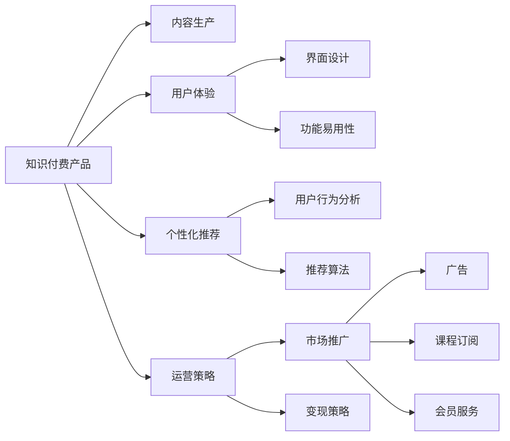

                 

## 1. 背景介绍

在信息爆炸的时代，知识和智慧成为了越来越宝贵的资产。知识的获取不再是传统的线性文本阅读，而是向着多维度、个性化、互动化的方向发展。知识付费产品的兴起，正是这种趋势的体现。

知识付费产品的核心在于提供高质量的课程、文章、音频等内容，让用户能够系统、高效地获取知识。这些产品的成功不仅依赖于内容的优质，更离不开高效的用户体验和精细化的运营策略。本文将深入探讨打造爆款知识付费产品的秘诀，涵盖从内容生产到用户运营的全过程。

## 2. 核心概念与联系

### 2.1 核心概念概述

- **知识付费产品**：以内容为核心，提供系统化、结构化的知识分享平台，如Coursera、Udacity、知乎live等。
- **内容生产**：高质量内容的产出，包括视频、文章、音频等多种形式。
- **用户体验**：用户在使用产品时的感受，包括界面设计、功能易用性等。
- **个性化推荐**：根据用户行为和偏好推荐内容，提升用户粘性。
- **运营策略**：包括市场推广、用户分析、变现策略等，是知识付费产品成功的关键。

### 2.2 核心概念原理和架构的 Mermaid 流程图



## 3. 核心算法原理 & 具体操作步骤

### 3.1 算法原理概述

知识付费产品的核心在于提供高质量、系统化的内容，以及良好的用户体验。这不仅依赖于内容生产，还需要通过算法和策略提升用户粘性，最终实现商业变现。

### 3.2 算法步骤详解

#### 3.2.1 内容生产

- **选题策划**：通过市场调研和用户需求分析，确定课程或文章的主题。
- **内容制作**：聘请专家或行业从业者制作高质量内容，确保信息的准确性和实用性。
- **多媒体融合**：将文字、图片、视频、音频等多种形式的内容有机结合，提升用户体验。

#### 3.2.2 个性化推荐

- **用户画像**：通过分析用户行为、搜索历史等数据，建立用户画像。
- **推荐算法**：使用协同过滤、基于内容的推荐等算法，根据用户画像推荐相关内容。
- **实时更新**：定期更新推荐算法，根据用户反馈调整推荐策略。

#### 3.2.3 运营策略

- **市场推广**：通过社交媒体、搜索引擎营销、付费广告等手段吸引用户。
- **用户分析**：利用数据分析工具，监控用户行为和满意度。
- **变现策略**：通过课程订阅、会员服务、广告等形式变现。

### 3.3 算法优缺点

#### 优点

- **高效内容产出**：通过算法推荐，提高内容的相关性和吸引力。
- **提升用户粘性**：个性化推荐和优质内容使用户更频繁地使用产品。
- **多渠道变现**：多样化变现策略增加收入来源。

#### 缺点

- **内容同质化**：算法推荐可能导致用户只接触同质化内容，缺乏多样性。
- **用户隐私问题**：大量收集用户数据可能引发隐私保护问题。
- **技术依赖性强**：算法和运营策略的成功实施对技术要求较高。

### 3.4 算法应用领域

知识付费产品涉及的内容生产和运营策略，广泛应用于在线教育、企业培训、科技资讯等多个领域。个性化推荐和用户运营策略更是广泛应用于电商、社交媒体、视频网站等多个行业。

## 4. 数学模型和公式 & 详细讲解

### 4.1 数学模型构建

知识付费产品的推荐系统可以建模为以下形式：

- **用户-内容矩阵**：$U \times C$ 的矩阵，$U$ 为用户数，$C$ 为内容数。
- **用户行为矩阵**：$U \times D$ 的矩阵，$D$ 为行为数，如观看时长、点赞数等。
- **内容评分矩阵**：$C \times R$ 的矩阵，$R$ 为评分维度，如评分、点击率等。

推荐系统的目标是最小化预测误差，常用的模型包括矩阵分解、基于内容的推荐、协同过滤等。

### 4.2 公式推导过程

以矩阵分解为例，假设用户行为矩阵为 $Y_{UC}$，用户-内容矩阵为 $X_{UC}$，内容评分矩阵为 $A_{CR}$，目标是最小化预测误差 $L$：

$$
L(Y_{UC},X_{UC},A_{CR})=\frac{1}{2}\|Y_{UC}-X_{UC}A_{CR}\|_F^2
$$

其中，$\| \cdot \|_F$ 表示矩阵的 Frobenius 范数。

最小化 $L$ 可以通过梯度下降等优化算法实现。常用的求解算法包括奇异值分解 (SVD)、基于梯度的优化等。

### 4.3 案例分析与讲解

- **案例1：Coursera的课程推荐系统**
  Coursera使用协同过滤和基于内容的推荐算法，根据用户的历史观看记录和课程特征，推荐相关课程。
  - **协同过滤**：通过用户-用户相似度计算，推荐热门课程。
  - **基于内容的推荐**：分析课程大纲、讲师信息等特征，推荐相关课程。
  
- **案例2：知乎live的推荐系统**
  知乎live利用自然语言处理技术，分析用户的问题和答案，推荐相关 live 直播。
  - **文本分析**：使用词向量模型（如Word2Vec）分析问题和答案，提取特征。
  - **内容相似度**：计算live和用户关注的问题之间的相似度，推荐相关live。

## 5. 项目实践：代码实例和详细解释说明

### 5.1 开发环境搭建

- **编程语言**：Python
- **框架**：TensorFlow、Scikit-learn、Keras
- **环境**：Jupyter Notebook、Anaconda

### 5.2 源代码详细实现

以下是基于TensorFlow和Scikit-learn实现的推荐系统代码：

```python
import numpy as np
from sklearn.decomposition import TruncatedSVD
from sklearn.metrics.pairwise import cosine_similarity
from sklearn.feature_extraction.text import TfidfVectorizer

# 用户行为矩阵
user_behavior = np.array([[1, 0, 1, 0], [1, 1, 0, 0], [0, 1, 1, 1]])

# 用户-内容矩阵
user_content = np.array([[1, 0, 0, 0], [1, 0, 1, 0], [0, 1, 1, 0]])

# 内容评分矩阵
content_score = np.array([[4, 3, 2, 1], [5, 5, 0, 0]])

# 协同过滤推荐
svd = TruncatedSVD(n_components=2)
user_content_svd = svd.fit_transform(user_content)

# 计算相似度
similarity = cosine_similarity(user_content_svd)

# 推荐新用户喜欢的课程
recommended_courses = user_content_svd.dot(similarity.dot(user_behavior))
```

### 5.3 代码解读与分析

- **协同过滤推荐**：通过奇异值分解(SVD)将用户-内容矩阵分解为低维空间，计算相似度，推荐相关内容。
- **文本分析推荐**：使用TF-IDF向量化用户问题和答案，计算相似度，推荐相关live直播。

## 6. 实际应用场景

### 6.1 在线教育

在线教育平台如Coursera、Udacity、edX等通过知识付费产品，提供系统化的课程和认证机制，帮助用户系统地获取知识。平台通过个性化推荐和优质内容，提升用户粘性和满意度。

### 6.2 企业培训

企业通过知识付费产品，提供定制化的培训课程，提升员工的技能水平。平台通过运营策略，如课程订阅、企业内训等形式，实现商业变现。

### 6.3 科技资讯

科技资讯平台如36kr、IT之家等通过知识付费产品，提供深度文章和视频课程，帮助用户获取最新的科技资讯和前沿技术。平台通过广告、会员服务等多种形式变现。

### 6.4 未来应用展望

- **内容多样化**：除了视频、文章、音频，还可以加入虚拟现实、增强现实等多种形式，提升用户体验。
- **多平台融合**：将知识付费产品与其他社交媒体、视频网站等平台进行整合，形成生态系统。
- **实时互动**：利用AI技术，实现实时互动、智能答疑等功能，提升用户参与度。

## 7. 工具和资源推荐

### 7.1 学习资源推荐

- **在线课程**：Coursera、edX、Udacity等平台的推荐系统课程。
- **论文集**：《推荐系统》、《知识图谱与推荐系统》等。
- **开源项目**：TensorFlow官方文档、Scikit-learn官方文档等。

### 7.2 开发工具推荐

- **编程语言**：Python、R
- **框架**：TensorFlow、Keras、PyTorch
- **环境**：Anaconda、Jupyter Notebook

### 7.3 相关论文推荐

- **《推荐系统》**：Wang et al. (2007) 介绍推荐系统的经典教材。
- **《知识图谱与推荐系统》**：Huang et al. (2013) 介绍知识图谱在推荐系统中的应用。

## 8. 总结：未来发展趋势与挑战

### 8.1 研究成果总结

本文介绍了知识付费产品的核心概念和实现步骤，探讨了内容生产、个性化推荐和运营策略的重要性。通过算法和策略的优化，知识付费产品能够提供高质量、系统化的知识分享，提升用户粘性和满意度，实现商业变现。

### 8.2 未来发展趋势

- **个性化推荐**：随着算法的进步，推荐系统的个性化程度将进一步提升，提供更加精准的内容推荐。
- **多平台融合**：知识付费产品将与其他平台进行深度整合，形成生态系统。
- **实时互动**：利用AI技术，实现实时互动、智能答疑等功能，提升用户参与度。

### 8.3 面临的挑战

- **内容同质化**：推荐系统可能导致用户只接触同质化内容，缺乏多样性。
- **用户隐私问题**：大量收集用户数据可能引发隐私保护问题。
- **技术依赖性强**：算法和运营策略的成功实施对技术要求较高。

### 8.4 研究展望

未来知识付费产品的发展，将更加注重内容的原创性和多样性，提升推荐系统的智能化和个性化程度。同时，注重用户隐私保护，降低对技术的依赖，探索更多商业变现模式，推动知识付费产品向更加智能、个性化和用户友好的方向发展。

## 9. 附录：常见问题与解答

### 常见问题 Q1：知识付费产品为什么能够成功？

**解答**：知识付费产品能够成功，主要是因为其提供了高质量、系统化的内容，以及良好的用户体验。内容生产团队通过精心策划选题和制作内容，确保信息的准确性和实用性。推荐系统通过算法和策略，提供个性化推荐，提升用户粘性。运营策略通过多渠道变现，增加收入来源。

### 常见问题 Q2：知识付费产品的市场推广策略有哪些？

**解答**：知识付费产品的市场推广策略包括社交媒体营销、搜索引擎营销、付费广告等。社交媒体营销可以通过微博、微信等平台，进行内容推广和用户互动。搜索引擎营销可以利用SEO优化，提高搜索引擎排名。付费广告可以通过Google AdWords、百度推广等平台，进行精准投放。

### 常见问题 Q3：如何提升知识付费产品的用户粘性？

**解答**：提升知识付费产品的用户粘性，主要通过个性化推荐和优质内容。个性化推荐可以通过协同过滤、基于内容的推荐等算法，根据用户行为和偏好推荐相关内容。优质内容需要定期更新，聘请专家制作高质量课程和文章，确保信息的准确性和实用性。

### 常见问题 Q4：知识付费产品的推荐系统有哪些算法？

**解答**：知识付费产品的推荐系统算法包括协同过滤、基于内容的推荐、基于用户的推荐等。协同过滤通过用户-用户相似度计算，推荐热门内容。基于内容的推荐分析内容特征，推荐相关内容。基于用户的推荐根据用户画像，推荐个性化内容。

### 常见问题 Q5：知识付费产品的变现策略有哪些？

**解答**：知识付费产品的变现策略包括课程订阅、会员服务、广告等。课程订阅通过订阅模式，提供系统化的课程学习。会员服务通过会员特权，提供额外内容和功能。广告通过展示广告和插入广告，增加收入来源。

---

作者：禅与计算机程序设计艺术 / Zen and the Art of Computer Programming

