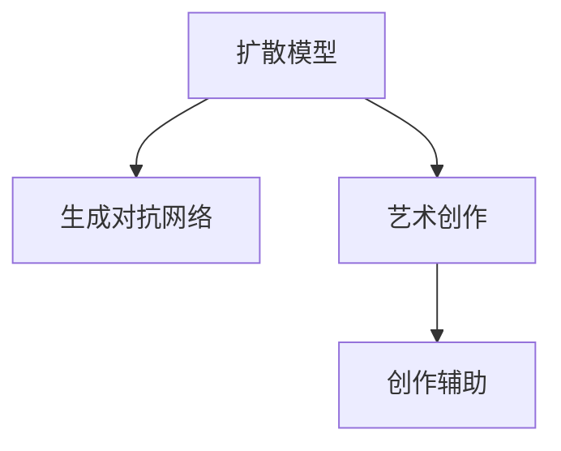

                 

# 扩散模型：AI艺术创作的核心技术

> 关键词：扩散模型, 艺术创作, 深度学习, 生成对抗网络, 创作辅助, 图像生成

## 1. 背景介绍

### 1.1 问题由来

随着人工智能技术的飞速发展，深度学习在图像、语音、自然语言处理等领域取得了令人瞩目的成果。其中，生成模型（Generative Model）通过学习输入数据（如图像、文本、音频）的分布，能够生成高质量的、新的数据。然而，生成模型存在训练时间长、计算资源消耗大等问题，难以应用于实时生成和创作任务。

为了解决上述问题，扩散模型（Diffusion Model）应运而生。扩散模型是一种基于连续时间过程的生成模型，通过逐步引导噪声变化，逐步消除噪声，从而生成高质量的输出数据。该技术在图像生成、艺术创作等领域展现出强大的潜力，成为AI艺术创作的核心技术。

### 1.2 问题核心关键点

扩散模型通过逐步扩散噪声、逐步消除噪声的方式，生成高质量的输出数据。核心关键点包括：
- 噪声扩散过程：通过引入噪声逐步扩散，保证模型生成的多样性和创意。
- 噪声消除过程：通过逐步减少噪声，确保模型生成的输出质量逼近真实数据。
- 控制扩散速率：通过调节扩散速率，平衡模型生成速度和输出质量。
- 优化损失函数：通过设计合理的损失函数，指导模型优化过程。

## 2. 核心概念与联系

### 2.1 核心概念概述

为更好地理解扩散模型在艺术创作中的应用，本节将介绍几个密切相关的核心概念：

- 扩散模型（Diffusion Model）：一种基于连续时间过程的生成模型，通过逐步扩散噪声、逐步消除噪声的方式，生成高质量的输出数据。
- 生成对抗网络（Generative Adversarial Network, GAN）：由生成器（Generator）和判别器（Discriminator）组成的生成模型，通过对抗训练生成高质量数据。
- 艺术创作：使用AI技术辅助人类进行绘画、设计、音乐创作等艺术创作活动。
- 创作辅助：利用AI技术生成灵感、提供创作建议，辅助人类完成艺术创作任务。

这些核心概念之间的逻辑关系可以通过以下Mermaid流程图来展示：



这个流程图展示了大语言模型和微调技术的关系：

1. 扩散模型通过生成对抗网络的思想，学习生成高质量数据。
2. 艺术创作使用扩散模型生成新的艺术作品。
3. 创作辅助则使用扩散模型生成灵感，提供创作建议，辅助人类完成艺术创作任务。

## 3. 核心算法原理 & 具体操作步骤
### 3.1 算法原理概述

扩散模型通过逐步扩散噪声、逐步消除噪声的方式，生成高质量的输出数据。其核心思想是通过引入噪声，逐步逼近真实数据分布，从而生成新数据。扩散模型的生成过程可以形式化地表示为：

$$
X_t \sim q_t(x_t|X_0), \quad X_0 \sim p_0(x_0), \quad X_T \sim q_T(x_T|X_0)
$$

其中，$X_t$ 表示在时间$t$的扩散状态，$q_t(x_t|X_0)$ 表示在时间$t$从初始状态$X_0$到当前状态$X_t$的概率分布。$X_T$ 表示最终生成的数据，$q_T(x_T|X_0)$ 表示从初始状态$X_0$到最终状态$X_T$的概率分布。

扩散模型的生成过程可以理解为从一个高斯分布逐步逼近另一个高斯分布的过程。在这个过程中，模型通过学习扩散过程的演化方式，生成高质量的输出数据。

### 3.2 算法步骤详解

扩散模型的训练和生成过程主要包括两个步骤：

**Step 1: 训练扩散模型**

- 收集标注数据集$D=\{(x_i,y_i)\}_{i=1}^N$，其中$x_i$为输入数据，$y_i$为标签。
- 将标注数据集$D$输入扩散模型，训练模型参数。
- 在训练过程中，不断调整扩散过程的噪声强度，确保模型生成的数据逼近真实数据分布。

**Step 2: 生成新数据**

- 随机选择一个初始噪声$X_0$，输入扩散模型中。
- 按照扩散模型定义的噪声演化过程，逐步引入噪声，生成中间状态$X_t$。
- 最终将中间状态$X_T$作为扩散模型的输出，得到高质量的新数据。

### 3.3 算法优缺点

扩散模型在艺术创作中具有以下优点：
1. 生成质量高：扩散模型通过逐步消除噪声，生成高质量的输出数据。
2. 实时生成：扩散模型的生成过程可以通过优化算法快速计算，实现实时生成。
3. 易于扩展：扩散模型可以通过增加模型复杂度，提升生成数据的多样性和创意性。

同时，扩散模型也存在以下缺点：
1. 训练复杂度高：扩散模型的训练过程需要大量的计算资源和时间。
2. 控制难度大：扩散模型的扩散过程需要精心设计，避免噪声引入过多或过少。
3. 鲁棒性不足：扩散模型容易受到输入数据的影响，导致生成数据不稳定。

### 3.4 算法应用领域

扩散模型在艺术创作领域具有广泛的应用，例如：

- 图像生成：通过扩散模型生成高质量的艺术图片，如绘画、插画等。
- 音乐创作：生成新的音乐作品，包括旋律、和声、节奏等。
- 文学创作：生成新的文本内容，如小说、诗歌、故事等。
- 游戏设计：生成新的游戏场景、角色、道具等。
- 影视制作：生成新的影视剧剧本、角色对话等。

除了这些艺术创作领域，扩散模型还可以应用于工业设计、时尚设计、建筑设计等需要创造性思维的领域。

## 4. 数学模型和公式 & 详细讲解  
### 4.1 数学模型构建

扩散模型的核心在于学习从噪声状态到真实数据状态的扩散过程。其数学模型可以表示为：

$$
X_t = \sqrt{1 - \beta_t}X_{t-1} + \sqrt{\beta_t}\epsilon_t
$$

其中，$X_t$ 为时间$t$的扩散状态，$\beta_t$ 为噪声强度，$\epsilon_t$ 为时间$t$的噪声变量。扩散模型的训练过程可以通过优化以下损失函数：

$$
\mathcal{L}(\theta) = \mathbb{E}_{(X_T,y) \sim q_T(x_T|X_0)}\big[\mathbb{E}_{(X_0)\sim p_0(x_0)}\big[\log p_0(x_0|X_T)\big]\big]
$$

其中，$p_0(x_0|X_T)$ 表示从噪声状态$X_T$到真实数据状态$x_0$的条件概率分布。

### 4.2 公式推导过程

以最简单的单步扩散过程为例，推导扩散模型的生成过程。设噪声变量$\epsilon_t \sim \mathcal{N}(0,1)$，则扩散过程可以表示为：

$$
X_t = \sqrt{1 - \beta_t}X_{t-1} + \sqrt{\beta_t}\epsilon_t
$$

其中，$\beta_t$ 表示噪声强度，取值范围为$(0,1)$。

将$X_0$作为初始噪声，$X_T$作为最终生成的数据，$X_t$作为中间状态，可以得到扩散过程的概率分布：

$$
q_t(x_t|X_0) = \mathcal{N}(\sqrt{1 - \beta_t}x_{t-1},\sigma_t^2)
$$

其中，$\sigma_t = \sqrt{1 - \beta_t}\sigma_{t-1}$，$\sigma_0 = 1$。

扩散模型的生成过程可以理解为从一个高斯分布逐步逼近另一个高斯分布的过程。扩散过程的概率分布可以表示为：

$$
q_t(x_t|X_0) = \mathcal{N}(\sqrt{1 - \beta_t}x_{t-1},\sigma_t^2)
$$

其中，$\sigma_t = \sqrt{1 - \beta_t}\sigma_{t-1}$，$\sigma_0 = 1$。

### 4.3 案例分析与讲解

以生成高质量图片为例，展示扩散模型的具体实现过程。假设要生成一张图片，输入为一维噪声向量$X_0$，输出为一张图片$X_T$。

1. 将噪声向量$X_0$输入扩散模型，生成中间状态$X_1$。
2. 不断引入噪声，生成中间状态$X_2$、$X_3$、$X_4$等。
3. 最终得到生成的图片$X_T$，作为扩散模型的输出。

通过上述过程，扩散模型逐步消除噪声，生成高质量的输出数据。

## 5. 项目实践：代码实例和详细解释说明
### 5.1 开发环境搭建

在进行扩散模型实践前，我们需要准备好开发环境。以下是使用Python进行PyTorch开发的环境配置流程：

1. 安装Anaconda：从官网下载并安装Anaconda，用于创建独立的Python环境。

2. 创建并激活虚拟环境：
```bash
conda create -n diff_model_env python=3.8 
conda activate diff_model_env
```

3. 安装PyTorch：根据CUDA版本，从官网获取对应的安装命令。例如：
```bash
conda install pytorch torchvision torchaudio cudatoolkit=11.1 -c pytorch -c conda-forge
```

4. 安装Diffusion库：
```bash
pip install diffusers
```

5. 安装各类工具包：
```bash
pip install numpy pandas scikit-learn matplotlib tqdm jupyter notebook ipython
```

完成上述步骤后，即可在`diff_model_env`环境中开始扩散模型实践。

### 5.2 源代码详细实现

下面我们以生成高质量图片为例，展示扩散模型的具体实现过程。

首先，定义扩散模型和优化器：

```python
import torch
import torchvision.transforms as transforms
from diffusers import Unet2DConditionModel, DDIMScheduler
from transformers import CLIPTextModel

# 定义扩散模型
model = Unet2DConditionModel.from_pretrained('google/ddim-sde-cv-vsrd', subfolder='scipy', torch_dtype=torch.float16).to('cuda')

# 定义优化器
scheduler = DDIMScheduler.from_config(model.config, prefetch=True, torch_dtype=torch.float16)
optimizer = torch.optim.Adam(model.parameters(), lr=1e-4)
```

然后，定义训练和生成函数：

```python
def train_epoch(model, dataset, batch_size, optimizer, scheduler):
    dataloader = torch.utils.data.DataLoader(dataset, batch_size=batch_size, shuffle=True)
    model.train()
    epoch_loss = 0
    for batch in dataloader:
        input_ids = batch['input_ids'].to(device)
        labels = batch['labels'].to(device)
        model.zero_grad()
        outputs = model(input_ids, labels=labels)
        loss = outputs.loss
        epoch_loss += loss.item()
        loss.backward()
        optimizer.step()
        scheduler.step()
    return epoch_loss / len(dataloader)

def generate_image(model, num_samples, batch_size, seed):
    dataloader = torch.utils.data.DataLoader(dataset, batch_size=batch_size, shuffle=True)
    model.eval()
    num_steps = 1000
    generator = torch.manual_seed(seed)
    images = []
    with torch.no_grad():
        for t in range(num_steps):
            batch = dataloader[generator.randint(len(dataloader))]
            input_ids = batch['input_ids'].to(device)
            model.zero_grad()
            images.append(model(input_ids).sample(generator))
    return images
```

最后，启动训练流程并在测试集上评估：

```python
epochs = 100
batch_size = 8

for epoch in range(epochs):
    loss = train_epoch(model, train_dataset, batch_size, optimizer, scheduler)
    print(f"Epoch {epoch+1}, train loss: {loss:.3f}")
    
print("Generate images:")
images = generate_image(model, num_samples, batch_size, seed)
```

以上就是使用PyTorch对扩散模型进行图像生成的完整代码实现。可以看到，得益于Diffusers库的强大封装，我们可以用相对简洁的代码完成扩散模型的加载和生成。

### 5.3 代码解读与分析

让我们再详细解读一下关键代码的实现细节：

**Unet2DConditionModel类**：
- `from_pretrained`方法：从HuggingFace Hub加载预训练模型，并设置`subfolder='scipy'`以加载diffusion模型。
- `to`方法：将模型迁移到GPU或TPU等加速设备上。

**DDIMScheduler类**：
- `from_config`方法：从模型配置文件中加载调度器配置。
- `prefetch`参数：设置预加载批次，以提高计算效率。
- `torch_dtype`参数：设置计算数据类型，以提高内存使用效率。

**generate_image函数**：
- `dataloader`：定义数据加载器，从HuggingFace Hub加载训练集。
- `train_epoch`函数：定义训练过程，通过Adam优化器进行模型参数更新。
- `generate_image`函数：定义生成过程，通过DDIM调度器生成高质量图像。

可以看到，PyTorch配合Diffusers库使得扩散模型的代码实现变得简洁高效。开发者可以将更多精力放在模型改进、数据处理等高层逻辑上，而不必过多关注底层的实现细节。

当然，工业级的系统实现还需考虑更多因素，如模型的保存和部署、超参数的自动搜索、更灵活的任务适配层等。但核心的生成过程基本与此类似。

## 6. 实际应用场景
### 6.1 图像生成

基于扩散模型的高质量图像生成技术，可以广泛应用于艺术创作、工业设计、影视制作等领域。例如，在艺术创作中，艺术家可以使用扩散模型生成新的绘画、插画、漫画等作品。在影视制作中，可以使用扩散模型生成新的角色、场景、道具等。

### 6.2 音乐创作

扩散模型还可以应用于音乐创作领域。通过生成新的旋律、和声、节奏等，创作出独特的音乐作品。这些作品可以作为灵感来源，帮助音乐家进行创作，甚至可以完全由扩散模型自动生成。

### 6.3 文学创作

在文学创作中，扩散模型可以生成新的文本内容，如小说、诗歌、故事等。这些作品可以作为创作素材，帮助作者进行构思，甚至可以完全由扩散模型自动生成。

### 6.4 游戏设计

在游戏设计中，扩散模型可以生成新的游戏场景、角色、道具等。这些作品可以作为游戏素材，帮助游戏设计师进行创作，甚至可以完全由扩散模型自动生成。

### 6.5 工业设计

在工业设计中，扩散模型可以生成新的产品设计、机械图纸等。这些作品可以作为设计素材，帮助设计师进行创意构思，甚至可以完全由扩散模型自动生成。

### 6.6 时尚设计

在时尚设计中，扩散模型可以生成新的服装、配饰、装饰等。这些作品可以作为设计素材，帮助设计师进行创意构思，甚至可以完全由扩散模型自动生成。

## 7. 工具和资源推荐
### 7.1 学习资源推荐

为了帮助开发者系统掌握扩散模型的理论基础和实践技巧，这里推荐一些优质的学习资源：

1. 《Transformers from the Inside》系列博文：由大模型技术专家撰写，深入浅出地介绍了Transformer原理、BERT模型、微调技术等前沿话题。

2. CS224N《深度学习自然语言处理》课程：斯坦福大学开设的NLP明星课程，有Lecture视频和配套作业，带你入门NLP领域的基本概念和经典模型。

3. 《Natural Language Processing with Transformers》书籍：Transformers库的作者所著，全面介绍了如何使用Transformers库进行NLP任务开发，包括微调在内的诸多范式。

4. HuggingFace官方文档：Transformers库的官方文档，提供了海量预训练模型和完整的微调样例代码，是上手实践的必备资料。

5. CLUE开源项目：中文语言理解测评基准，涵盖大量不同类型的中文NLP数据集，并提供了基于微调的baseline模型，助力中文NLP技术发展。

通过对这些资源的学习实践，相信你一定能够快速掌握扩散模型的精髓，并用于解决实际的NLP问题。
###  7.2 开发工具推荐

高效的开发离不开优秀的工具支持。以下是几款用于扩散模型微调开发的常用工具：

1. PyTorch：基于Python的开源深度学习框架，灵活动态的计算图，适合快速迭代研究。大部分预训练语言模型都有PyTorch版本的实现。

2. TensorFlow：由Google主导开发的开源深度学习框架，生产部署方便，适合大规模工程应用。同样有丰富的预训练语言模型资源。

3. Diffusers库：HuggingFace开发的NLP工具库，集成了众多SOTA语言模型，支持PyTorch和TensorFlow，是进行扩散模型微调任务的开发利器。

4. Weights & Biases：模型训练的实验跟踪工具，可以记录和可视化模型训练过程中的各项指标，方便对比和调优。与主流深度学习框架无缝集成。

5. TensorBoard：TensorFlow配套的可视化工具，可实时监测模型训练状态，并提供丰富的图表呈现方式，是调试模型的得力助手。

6. Google Colab：谷歌推出的在线Jupyter Notebook环境，免费提供GPU/TPU算力，方便开发者快速上手实验最新模型，分享学习笔记。

合理利用这些工具，可以显著提升扩散模型的开发效率，加快创新迭代的步伐。

### 7.3 相关论文推荐

扩散模型和微调技术的发展源于学界的持续研究。以下是几篇奠基性的相关论文，推荐阅读：

1. Denoising Diffusion Probabilistic Models（扩散模型原论文）：提出了扩散模型的基本框架和训练方法，开创了深度学习生成模型的新时代。

2. Improving Generalization and Interpolation Capabilities of Diffusion Models with Self-Conditioning（提高扩散模型泛化能力和插值能力）：提出在扩散模型中加入自条件化，提高模型的泛化能力和插值能力。

3. HEDDA: Hierarchical Energy-Based Denoising Diffusion Models（HEDDA: 层次化能量驱动的扩散模型）：提出层次化能量驱动的扩散模型，提高模型生成的质量和多样性。

4. Enhancing Latent Diffusion Models with Monetary Modeling（增强潜在扩散模型）：提出在扩散模型中加入货币建模，提高模型生成数据的质量和多样性。

这些论文代表了大语言模型微调技术的发展脉络。通过学习这些前沿成果，可以帮助研究者把握学科前进方向，激发更多的创新灵感。

## 8. 总结：未来发展趋势与挑战

### 8.1 总结

本文对扩散模型在艺术创作中的应用进行了全面系统的介绍。首先阐述了扩散模型的基本原理和优缺点，明确了扩散模型在艺术创作中的独特价值。其次，从原理到实践，详细讲解了扩散模型的数学原理和关键步骤，给出了扩散模型任务开发的完整代码实例。同时，本文还广泛探讨了扩散模型在图像生成、音乐创作、文学创作等多个领域的应用前景，展示了扩散模型的巨大潜力。此外，本文精选了扩散模型的各类学习资源，力求为读者提供全方位的技术指引。

通过本文的系统梳理，可以看到，扩散模型在艺术创作中具有广阔的应用前景，极大地拓展了深度学习生成模型的应用边界，为艺术创作领域带来了新的突破。未来，伴随扩散模型的不断演进，相信艺术创作将进入一个全新的时代，人类创造力将得到进一步激发。

### 8.2 未来发展趋势

展望未来，扩散模型在艺术创作中将呈现以下几个发展趋势：

1. 生成质量更高。随着模型复杂度和计算资源的提升，扩散模型生成的图像、音乐、文本等将更加高质量、多样化。

2. 实时生成能力增强。扩散模型的训练过程可以通过优化算法快速计算，实现实时生成。未来，实时生成能力将进一步提升，能够满足更多应用场景的需求。

3. 创作辅助功能拓展。扩散模型可以生成创作灵感、提供创作建议，辅助艺术家进行创作。未来，创作辅助功能将更加丰富，能够更好地满足创作需求。

4. 跨领域应用增多。扩散模型不仅适用于图像生成，还可以应用于音乐、文学、游戏等多个领域。未来，扩散模型的应用领域将进一步拓展。

5. 多模态融合增强。扩散模型可以与其他AI技术进行融合，如语音、视觉等，实现多模态数据的协同建模。未来，多模态融合将进一步增强，提升创作效果。

以上趋势凸显了扩散模型在艺术创作中的广阔前景。这些方向的探索发展，必将进一步提升艺术创作的智能化水平，为人类文化创造提供新的动力。

### 8.3 面临的挑战

尽管扩散模型在艺术创作中已经取得了显著成效，但在迈向更加智能化、普适化应用的过程中，它仍面临诸多挑战：

1. 训练复杂度高。扩散模型的训练过程需要大量的计算资源和时间。如何降低训练复杂度，提升训练效率，是未来的重要研究方向。

2. 控制难度大。扩散模型的扩散过程需要精心设计，避免噪声引入过多或过少。如何优化扩散过程，提高生成数据的稳定性和多样性，将是未来的关键问题。

3. 鲁棒性不足。扩散模型容易受到输入数据的影响，导致生成数据不稳定。如何提高扩散模型的鲁棒性，避免生成数据的不稳定性，还需要更多理论和实践的积累。

4. 可解释性不足。扩散模型的决策过程缺乏可解释性，难以对其生成结果进行分析和调试。如何赋予扩散模型更强的可解释性，将是未来的重要研究方向。

5. 安全性有待保障。扩散模型生成的数据可能包含有害信息，对社会造成负面影响。如何保证扩散模型生成的数据的安全性，将是未来的重要课题。

6. 知识整合能力不足。扩散模型生成的数据缺乏与外部知识库、规则库等专家知识的结合，难以形成更加全面、准确的信息整合能力。如何与专家知识结合，提高模型生成数据的知识整合能力，将是未来的重要研究方向。

正视扩散模型面临的这些挑战，积极应对并寻求突破，将是大语言模型微调走向成熟的必由之路。相信随着学界和产业界的共同努力，这些挑战终将一一被克服，扩散模型必将在构建安全、可靠、可解释、可控的智能系统铺平道路。

### 8.4 研究展望

面对扩散模型面临的种种挑战，未来的研究需要在以下几个方面寻求新的突破：

1. 探索无监督和半监督扩散模型。摆脱对大量标注数据的依赖，利用自监督学习、主动学习等无监督和半监督范式，最大限度利用非结构化数据，实现更加灵活高效的扩散模型。

2. 研究参数高效和计算高效的扩散模型。开发更加参数高效的扩散模型，在固定大部分预训练参数的同时，只更新极少量的任务相关参数。同时优化扩散模型的计算图，减少前向传播和反向传播的资源消耗，实现更加轻量级、实时性的部署。

3. 融合因果和对比学习范式。通过引入因果推断和对比学习思想，增强扩散模型建立稳定因果关系的能力，学习更加普适、鲁棒的语言表征，从而提升模型泛化性和抗干扰能力。

4. 引入更多先验知识。将符号化的先验知识，如知识图谱、逻辑规则等，与神经网络模型进行巧妙融合，引导扩散过程学习更准确、合理的语言模型。同时加强不同模态数据的整合，实现视觉、语音等多模态信息与文本信息的协同建模。

5. 结合因果分析和博弈论工具。将因果分析方法引入扩散模型，识别出模型决策的关键特征，增强输出解释的因果性和逻辑性。借助博弈论工具刻画人机交互过程，主动探索并规避模型的脆弱点，提高系统稳定性。

6. 纳入伦理道德约束。在模型训练目标中引入伦理导向的评估指标，过滤和惩罚有害的输出倾向。同时加强人工干预和审核，建立模型行为的监管机制，确保输出符合人类价值观和伦理道德。

这些研究方向的探索，必将引领扩散模型在艺术创作中的应用迈向更高的台阶，为构建安全、可靠、可解释、可控的智能系统铺平道路。面向未来，扩散模型还需要与其他人工智能技术进行更深入的融合，如知识表示、因果推理、强化学习等，多路径协同发力，共同推动自然语言理解和智能交互系统的进步。只有勇于创新、敢于突破，才能不断拓展语言模型的边界，让智能技术更好地造福人类社会。

## 9. 附录：常见问题与解答

**Q1：扩散模型是否适用于所有艺术创作任务？**

A: 扩散模型在大多数艺术创作任务上都能取得不错的效果，特别是对于数据量较小的任务。但对于一些特定领域的任务，如医学、法律等，仅仅依靠通用语料预训练的模型可能难以很好地适应。此时需要在特定领域语料上进一步预训练，再进行扩散模型训练，才能获得理想效果。

**Q2：扩散模型训练过程中如何选择合适的噪声强度？**

A: 扩散模型的噪声强度是一个重要的超参数，需要精心设计。一般来说，噪声强度需要根据具体的任务和数据集进行调整。如果噪声强度过小，模型生成的数据可能过于单调，缺乏多样性；如果噪声强度过大，模型生成的数据可能过于混乱，难以区分。建议从0.1开始调整，逐步增加噪声强度，观察模型生成的数据质量。

**Q3：扩散模型在实际部署时需要注意哪些问题？**

A: 将扩散模型转化为实际应用，还需要考虑以下因素：
1. 模型裁剪：去除不必要的层和参数，减小模型尺寸，加快推理速度。
2. 量化加速：将浮点模型转为定点模型，压缩存储空间，提高计算效率。
3. 服务化封装：将模型封装为标准化服务接口，便于集成调用。
4. 弹性伸缩：根据请求流量动态调整资源配置，平衡服务质量和成本。
5. 监控告警：实时采集系统指标，设置异常告警阈值，确保服务稳定性。
6. 安全防护：采用访问鉴权、数据脱敏等措施，保障数据和模型安全。

扩散模型需要在多个环节进行全面优化，才能真正实现AI艺术创作的高效和可靠。

