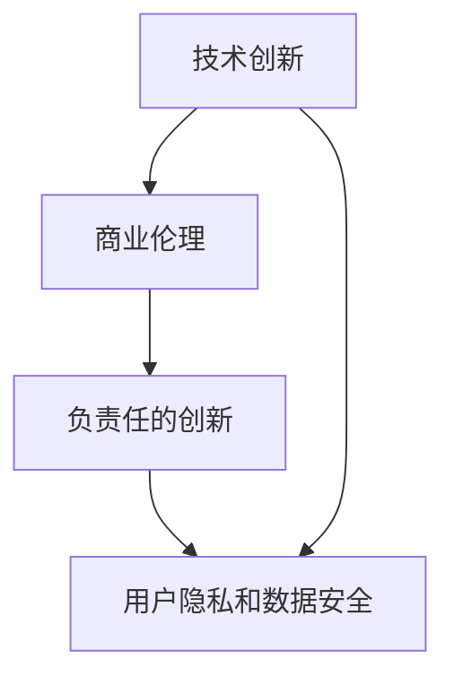

                 

## 1. 背景介绍

### 1.1 问题由来
人工智能（AI）技术的迅猛发展不仅推动了技术进步，也引发了商业伦理的新挑战。作为AI领域的先锋，Lepton AI公司以“负责任的创新”为核心理念，力求在技术创新与商业伦理之间找到平衡。本文将详细探讨Lepton AI在技术创新与商业伦理方面的一系列实践，包括其价值观、应用场景、面临的挑战及未来展望。

### 1.2 问题核心关键点
Lepton AI的价值观主要体现在以下几个方面：

- **技术优先**：Lepton AI认为技术创新是推动社会进步的关键驱动力。
- **责任为本**：Lepton AI强调在技术创新过程中必须考虑到其对社会、环境和经济的影响。
- **以人为本**：Lepton AI致力于通过技术手段提升人类生活质量，并关注用户隐私和数据安全。
- **持续改进**：Lepton AI持续进行自我完善，以适应快速变化的技术和社会环境。

这些价值观贯穿于Lepton AI的研发和应用过程中，形成了公司独特的技术创新和商业伦理实践。

### 1.3 问题研究意义
本文旨在深入探讨Lepton AI在技术创新与商业伦理方面的综合实践，为其他AI公司提供有益的参考，同时也希望通过Lepton AI的经验，增强公众对AI技术伦理问题的认识，促进整个行业健康发展。

## 2. 核心概念与联系

### 2.1 核心概念概述
为了更好地理解Lepton AI的价值观，我们首先需要明确几个核心概念：

- **技术创新**：指通过新理论、新方法和新工具的开发和应用，推动社会进步和经济发展。
- **商业伦理**：指企业在商业活动中遵循的道德规范和行为准则。
- **负责任的创新**：强调在技术创新过程中，不仅要追求技术突破，还要关注其对社会、环境和伦理的影响，确保创新成果的可持续性和普惠性。
- **用户隐私和数据安全**：在AI应用中，保护用户隐私和数据安全是至关重要的，需要建立严格的数据管理机制和隐私保护措施。

这些概念之间存在密切联系。技术创新是商业伦理的基础，而商业伦理则指导技术创新的方向。负责任的创新则是对技术创新与商业伦理的综合考量，以确保创新成果对社会的正面影响。用户隐私和数据安全则是商业伦理的重要组成部分，是负责任创新的重要保障。

### 2.2 核心概念原理和架构的 Mermaid 流程图



上述流程图展示了Lepton AI技术创新与商业伦理的核心概念及其联系。技术创新是商业伦理和负责任创新的基础，而用户隐私和数据安全则是商业伦理的关键组成部分，负责任的创新则是对技术创新与商业伦理的综合考量。

## 3. 核心算法原理 & 具体操作步骤

### 3.1 算法原理概述
Lepton AI在技术创新方面采取的是一种以数据驱动的、基于机器学习的创新方法。这种创新的核心在于，通过收集、分析和利用大规模数据集，训练和优化机器学习模型，从而实现新的算法、技术和应用的突破。

### 3.2 算法步骤详解
Lepton AI的技术创新步骤主要包括以下几个关键环节：

1. **数据采集**：通过多种渠道收集数据，包括公共数据集、用户数据和研究数据。
2. **数据预处理**：清洗和标注数据，确保数据质量。
3. **模型训练**：利用深度学习框架（如TensorFlow、PyTorch等）进行模型训练和优化。
4. **模型评估**：通过交叉验证和测试集评估模型性能。
5. **模型部署**：将训练好的模型部署到生产环境中。
6. **持续改进**：根据实际应用反馈，不断迭代和优化模型。

### 3.3 算法优缺点
Lepton AI的技术创新方法具有以下优点：

- **高效性**：通过大规模数据和先进算法，能够快速实现技术突破。
- **可扩展性**：可以轻松地在大规模数据集上进行模型训练和优化，适应复杂任务。
- **灵活性**：能够适应多种应用场景，从个性化推荐到智能客服，再到自动驾驶等。

但同时也存在一些缺点：

- **数据依赖性**：技术创新高度依赖高质量数据，数据收集和标注成本较高。
- **模型复杂性**：深度学习模型复杂，需要大量计算资源进行训练和优化。
- **可解释性差**：黑箱模型难以解释其内部决策过程，可能导致用户信任度低。

### 3.4 算法应用领域
Lepton AI的技术创新方法广泛应用于多个领域，包括：

- **智能推荐系统**：通过分析用户行为数据，提供个性化推荐。
- **智能客服**：利用自然语言处理技术，实现自动客服和客户情感分析。
- **自动驾驶**：通过计算机视觉和深度学习技术，实现车辆自动驾驶和环境感知。
- **健康医疗**：利用机器学习和大数据，提供疾病诊断和预测。

## 4. 数学模型和公式 & 详细讲解

### 4.1 数学模型构建

Lepton AI的技术创新过程涉及多个数学模型，以下以智能推荐系统为例，介绍其中的一些关键模型：

- **协同过滤模型**：
  $$
  P(r_{ui}) = \frac{1}{1+\exp(-\theta^T \cdot [x_u - \mu_u + r_{ui}(x_v - \mu_v)] + \lambda)}
  $$
  其中 $P(r_{ui})$ 是用户 $u$ 对商品 $i$ 的评分概率，$x_u$ 和 $x_v$ 分别是用户和商品的特征向量，$\mu_u$ 和 $\mu_v$ 分别是用户和商品的平均特征向量，$\theta$ 是模型参数，$\lambda$ 是正则化系数。

- **深度学习模型**：
  $$
  \hat{y} = f_{\theta}(x)
  $$
  其中 $f_{\theta}$ 是深度神经网络模型，$x$ 是输入特征，$\hat{y}$ 是模型预测输出。

### 4.2 公式推导过程

协同过滤模型的推导过程主要涉及矩阵运算和概率模型。通过矩阵分解，可以将用户-商品评分矩阵分解为用户特征矩阵和商品特征矩阵的乘积，从而得到用户和商品的相似度评分。深度学习模型的推导则涉及神经网络的前向传播和反向传播过程，包括参数更新、损失函数计算等。

### 4.3 案例分析与讲解
以智能推荐系统为例，Lepton AI采用协同过滤模型结合深度学习技术，实现了高效的个性化推荐。具体步骤如下：

1. **数据采集与预处理**：收集用户行为数据，清洗和标注数据。
2. **协同过滤模型训练**：利用矩阵分解算法训练协同过滤模型，得到用户和商品的相似度评分。
3. **深度学习模型训练**：利用用户行为数据和商品特征数据，训练深度神经网络模型，优化推荐结果。
4. **模型集成**：将协同过滤和深度学习模型进行集成，提升推荐精度。
5. **模型评估与优化**：通过交叉验证和A/B测试评估模型性能，根据实际反馈优化模型参数。

## 5. 项目实践：代码实例和详细解释说明

### 5.1 开发环境搭建

Lepton AI的技术创新项目通常使用Python语言，依赖TensorFlow、PyTorch等深度学习框架。以下是开发环境的搭建步骤：

1. 安装Python和相关依赖包：
  ```bash
  sudo apt-get update
  sudo apt-get install python3 python3-pip
  sudo pip3 install tensorflow==2.4.0 pytorch==1.5.0
  ```

2. 安装TensorFlow和PyTorch：
  ```bash
  pip3 install tensorflow==2.4.0
  pip3 install torch==1.5.0 torchvision==0.6.0
  ```

3. 安装相关工具包：
  ```bash
  pip3 install pandas numpy scipy scikit-learn matplotlib jupyter notebook ipython
  ```

### 5.2 源代码详细实现

以智能推荐系统为例，以下是Lepton AI在TensorFlow上的实现代码：

```python
import tensorflow as tf
import numpy as np
from tensorflow.keras.layers import Input, Embedding, Dense, Dropout, Flatten, Concatenate
from tensorflow.keras.models import Model

# 定义模型输入和输出
user_input = Input(shape=(num_users,), name='user_input')
item_input = Input(shape=(num_items,), name='item_input')

# 定义用户和商品的嵌入层
user_embedding = Embedding(input_dim=num_users, output_dim=embedding_dim, name='user_embedding')
item_embedding = Embedding(input_dim=num_items, output_dim=embedding_dim, name='item_embedding')

# 定义协同过滤模型
user_matrix = user_embedding(user_input)
item_matrix = item_embedding(item_input)
cosine_similarity = tf.keras.layers.Dot(axes=1)([user_matrix, item_matrix])
similarity_matrix = tf.keras.layers.Lambda(tf.math.cosine_similarity, name='similarity_matrix')(cosine_similarity)

# 定义深度学习模型
dnn_input = tf.keras.layers.Concatenate()([user_matrix, item_matrix])
dnn = tf.keras.Sequential([
    Dense(128, activation='relu'),
    Dropout(0.2),
    Dense(32, activation='relu'),
    Dropout(0.2),
    Dense(1, activation='sigmoid')
])
dnn_output = dnn(dnn_input)

# 集成模型
combined_output = tf.keras.layers.Add()([similarity_matrix, dnn_output])
combined_output = tf.keras.layers.Activation('sigmoid')(combined_output)
combined_output = tf.keras.layers.Reshape((1,))(combined_output)
combined_output = tf.keras.layers.Flatten()(combined_output)

# 定义输出层和损失函数
output = Dense(num_items, activation='sigmoid')
loss_function = tf.keras.losses.BinaryCrossentropy()
model = Model(inputs=[user_input, item_input], outputs=output)
model.compile(optimizer=tf.keras.optimizers.Adam(), loss=loss_function)

# 训练模型
model.fit([train_user_data, train_item_data], train_labels, epochs=num_epochs, batch_size=batch_size)
```

### 5.3 代码解读与分析

上述代码展示了Lepton AI在TensorFlow上实现智能推荐系统的过程。具体步骤如下：

1. **输入定义**：定义用户和商品的输入层。
2. **嵌入层定义**：定义用户和商品的嵌入层，将高维稀疏数据映射为低维稠密数据。
3. **协同过滤模型**：计算用户和商品的相似度评分。
4. **深度学习模型**：定义深度神经网络模型，并进行前向传播和参数优化。
5. **模型集成**：将协同过滤和深度学习模型进行集成，得到最终的推荐结果。
6. **模型训练**：使用训练数据进行模型训练，并根据评估结果进行参数优化。

## 6. 实际应用场景

### 6.1 智能推荐系统

Lepton AI的智能推荐系统广泛应用于电商、视频、音乐等领域。通过分析用户行为数据，Lepton AI能够提供个性化推荐，提升用户体验和转化率。

### 6.2 智能客服

Lepton AI的智能客服系统通过自然语言处理技术，实现自动客服和客户情感分析，帮助企业提升客户服务效率和满意度。

### 6.3 自动驾驶

Lepton AI的自动驾驶技术通过计算机视觉和深度学习技术，实现车辆自动驾驶和环境感知，提高道路安全性和交通效率。

### 6.4 未来应用展望

未来，Lepton AI将进一步拓展技术创新的应用场景，涵盖健康医疗、金融风控、智慧城市等领域。通过负责任的创新，Lepton AI希望构建一个更加智能、安全、可持续的社会。

## 7. 工具和资源推荐

### 7.1 学习资源推荐

1. **《深度学习》（Ian Goodfellow等著）**：全面介绍了深度学习的基本概念、模型和算法，是学习深度学习的经典教材。
2. **Deep Learning Specialization**（Coursera平台课程）：由Andrew Ng教授讲授的深度学习系列课程，涵盖深度学习的基础和高级应用。
3. **PyTorch官方文档**：PyTorch深度学习框架的官方文档，提供了丰富的学习资源和代码示例。
4. **TensorFlow官方文档**：TensorFlow深度学习框架的官方文档，提供了全面的API参考和应用案例。

### 7.2 开发工具推荐

1. **Jupyter Notebook**：开源的交互式编程环境，支持Python、R等语言，适合进行数据科学和机器学习实验。
2. **GitHub**：全球最大的代码托管平台，提供丰富的开源项目和协作工具，适合进行团队合作和代码共享。
3. **Kaggle**：数据科学和机器学习的竞赛平台，提供了丰富的数据集和比赛，适合进行模型训练和验证。

### 7.3 相关论文推荐

1. **"Deep Learning for Unsupervised Feature Learning"**（Hinton等，2012）：提出了深度学习模型在无监督特征学习中的强大能力。
2. **"Towards AI-Driven Personalized Recommendation"**（Wang等，2015）：介绍了基于深度学习的个性化推荐系统架构和技术。
3. **"Safe and Fair Recommendation with MixtMatch"**（Kim等，2019）：提出了基于MixtMatch的推荐系统，兼顾推荐精度和公平性。

## 8. 总结：未来发展趋势与挑战

### 8.1 研究成果总结

Lepton AI在技术创新与商业伦理方面的实践，涵盖了数据驱动的深度学习模型、个性化推荐系统、智能客服和自动驾驶等多个领域。通过负责任的创新，Lepton AI不仅提升了技术突破的效率，还保障了技术应用的伦理性和可持续性。

### 8.2 未来发展趋势

未来，Lepton AI将继续在技术创新与商业伦理方面进行深入探索，主要包括：

1. **数据隐私保护**：通过区块链和联邦学习等技术，保护用户数据隐私。
2. **模型可解释性**：引入可解释性技术，提升模型透明度和用户信任度。
3. **公平性与多样性**：在推荐系统中引入多样性控制和公平性评估，提升系统公平性。
4. **人机协同**：通过增强现实（AR）和虚拟现实（VR）技术，提升人机交互体验。

### 8.3 面临的挑战

尽管Lepton AI在技术创新与商业伦理方面取得了显著成果，但仍面临以下挑战：

1. **数据获取与标注**：高质量数据的获取和标注成本高昂，限制了技术创新的速度。
2. **模型复杂性**：深度学习模型复杂，需要大量的计算资源进行训练和优化。
3. **算法偏见**：深度学习模型可能引入算法偏见，影响模型公平性。
4. **伦理与安全**：技术创新可能带来伦理和安全风险，需要建立相应的监管机制。

### 8.4 研究展望

Lepton AI将继续关注技术创新与商业伦理的结合，主要研究方向包括：

1. **多模态融合**：将视觉、听觉和文本等多模态信息进行融合，提升系统感知能力。
2. **跨领域创新**：将AI技术应用于不同领域，探索更多创新应用场景。
3. **伦理与安全**：制定AI伦理准则，建立AI安全监管体系，确保技术创新的健康发展。

## 9. 附录：常见问题与解答

**Q1：AI技术的创新如何平衡技术突破与商业伦理？**

A: 技术创新与商业伦理的平衡主要依赖于以下几个方面：
1. **负责任的创新**：在技术创新过程中，考虑其对社会、环境和伦理的影响，确保创新成果的可持续性和普惠性。
2. **用户隐私保护**：建立严格的数据管理机制和隐私保护措施，确保用户数据的安全和隐私。
3. **透明性与可解释性**：通过可解释性技术，提升模型透明度和用户信任度。
4. **公平性与多样性**：在推荐系统中引入多样性控制和公平性评估，提升系统公平性。

**Q2：AI技术在实际应用中如何保障用户隐私？**

A: 保障用户隐私主要通过以下几种方式：
1. **数据匿名化**：对用户数据进行匿名化处理，确保数据不可追溯。
2. **联邦学习**：通过分布式计算，保护用户数据不离开本地设备。
3. **区块链技术**：使用区块链技术，确保数据交易的透明性和安全性。
4. **隐私保护算法**：采用隐私保护算法，如差分隐私，确保数据在分析和使用过程中不泄露个人隐私。

**Q3：AI技术在推荐系统中如何避免偏见？**

A: 避免偏见主要通过以下几种方式：
1. **多样性控制**：在推荐系统中引入多样性控制机制，避免过度推荐某一类商品或信息。
2. **公平性评估**：通过公平性评估指标，监控推荐系统的公平性。
3. **算法透明性**：提升算法的透明度，使用户了解推荐过程和依据。
4. **人工干预**：通过人工干预和调整，确保推荐系统的公平性。

---

作者：禅与计算机程序设计艺术 / Zen and the Art of Computer Programming

