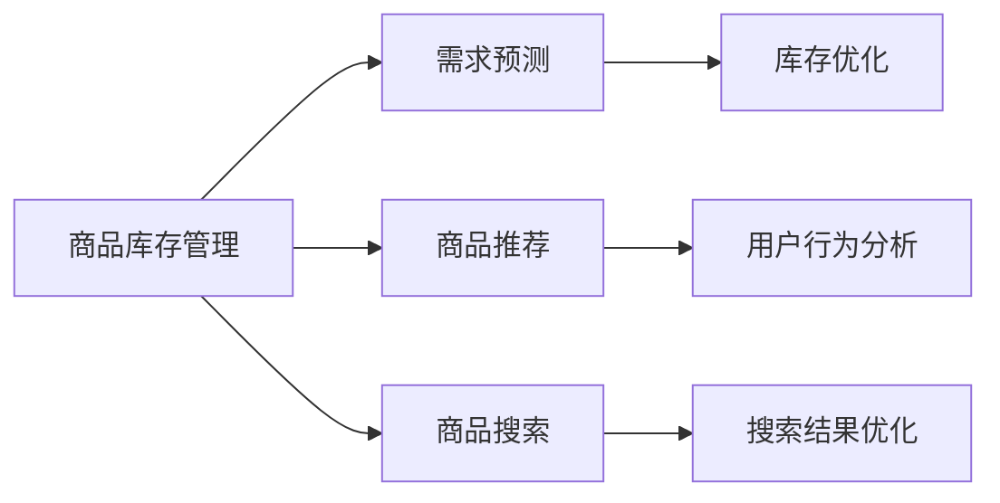

                 

# 抖音电商的商品供给分析

## 1. 背景介绍

抖音电商作为全球领先的短视频电商平台，自2020年成立以来，以创新的短视频营销模式迅速崛起。凭借其庞大的用户基础和丰富的电商生态，抖音电商迅速成为电商行业的重要玩家。然而，随着抖音电商用户基数的不断增长，商品供给问题成为其快速发展的瓶颈。如何优化商品供给，提升用户体验和平台运营效率，成为抖音电商急需解决的问题。本文从商品供给分析的角度，结合机器学习和大数据技术，提出了一套系统的解决方案，旨在优化抖音电商的商品供给体系。

## 2. 核心概念与联系

### 2.1 核心概念概述

抖音电商的商品供给问题主要包括商品库存管理、商品推荐和商品搜索等方面。这些问题涉及到的核心概念包括：

- **商品库存管理**：合理管理商品的库存水平，避免缺货或滞销，确保供需平衡。
- **商品推荐**：基于用户行为和偏好，推荐用户感兴趣的商品，提高用户满意度和购买率。
- **商品搜索**：快速准确地从海量商品中检索出用户需要的商品，提升用户搜索体验。

这些概念相互关联，共同构成了抖音电商的商品供给体系。

### 2.2 核心概念原理和架构的 Mermaid 流程图



## 3. 核心算法原理 & 具体操作步骤

### 3.1 算法原理概述

抖音电商的商品供给优化主要基于机器学习和数据挖掘技术，通过建立商品需求预测模型、库存优化模型和推荐系统，实现对商品供给的有效管理。具体步骤如下：

1. **商品需求预测**：基于历史销售数据、用户行为数据等，建立时间序列模型或回归模型，预测未来的商品需求。
2. **库存优化**：根据需求预测结果，制定合理的库存管理策略，避免库存过剩或短缺。
3. **商品推荐**：基于用户行为和历史交易记录，建立推荐模型，推荐用户可能感兴趣的商品。
4. **商品搜索优化**：通过优化搜索算法，提升搜索结果的相关性和准确性，提升用户搜索体验。

### 3.2 算法步骤详解

#### 3.2.1 商品需求预测

需求预测是商品供给优化的基础，主要步骤如下：

1. **数据收集**：收集历史销售数据、用户行为数据、市场数据等，构建数据集。
2. **特征工程**：选择和构造影响商品需求的关键特征，如商品类别、用户地理位置、时间等。
3. **模型选择与训练**：选择合适的机器学习模型，如ARIMA、LSTM等，使用历史数据训练模型。
4. **模型评估与优化**：使用交叉验证等方法评估模型性能，通过调参优化模型。
5. **预测与更新**：使用训练好的模型进行需求预测，并根据实际销售情况进行模型更新。

#### 3.2.2 库存优化

库存优化主要是为了减少库存成本，提高库存周转率。主要步骤如下：

1. **需求预测**：基于需求预测结果，确定每个商品的未来需求量。
2. **安全库存计算**：根据需求预测结果，计算每个商品的最低安全库存量。
3. **补货策略制定**：根据需求预测结果和安全库存，制定补货策略，确保库存量在合理范围内。
4. **库存更新**：根据实际销售情况和需求预测结果，更新库存数据。

#### 3.2.3 商品推荐

商品推荐系统是提升用户购买率和用户体验的重要手段。主要步骤如下：

1. **用户画像建立**：收集用户行为数据、历史购买记录等，构建用户画像。
2. **商品特征提取**：提取商品的关键特征，如价格、类别、品牌等。
3. **推荐模型训练**：使用协同过滤、深度学习等算法，训练推荐模型。
4. **推荐结果生成**：根据用户画像和商品特征，生成推荐结果。
5. **推荐效果评估**：使用A/B测试等方法评估推荐效果，进行优化。

#### 3.2.4 商品搜索优化

商品搜索优化主要提升搜索的相关性和效率。主要步骤如下：

1. **搜索结果构建**：构建商品索引，优化搜索结果排序算法。
2. **搜索算法优化**：使用倒排索引、TF-IDF等算法优化搜索算法。
3. **搜索体验优化**：优化搜索结果的展示和排序，提升搜索体验。
4. **反馈循环**：根据用户反馈，不断优化搜索结果和搜索算法。

### 3.3 算法优缺点

#### 3.3.1 优点

- **高效性**：通过机器学习和大数据技术，可以快速分析海量数据，提供实时的决策支持。
- **精确性**：机器学习模型能够捕捉复杂的模式和规律，提高预测和推荐的准确性。
- **可扩展性**：基于数据驱动的决策机制，可以适应不同的业务场景和需求变化。

#### 3.3.2 缺点

- **数据质量依赖**：预测和推荐的效果依赖于数据的质量和完整性，数据不充分时可能效果不佳。
- **模型复杂性**：机器学习模型通常较为复杂，需要专业的技术支持。
- **用户隐私**：在收集用户数据和行为数据时，需要注意保护用户隐私，避免数据泄露。

### 3.4 算法应用领域

抖音电商的商品供给优化方法可以应用于多个电商平台和业务场景，包括：

- **商品库存管理**：适用于各类电商平台，如淘宝、京东、亚马逊等。
- **商品推荐系统**：适用于各类在线零售商，如在线书店、服装店等。
- **商品搜索优化**：适用于各类电子商务平台，如B2B电商平台、二手交易平台等。
- **个性化营销**：适用于各类零售商，通过个性化推荐提升用户粘性和购买率。

## 4. 数学模型和公式 & 详细讲解 & 举例说明

### 4.1 数学模型构建

#### 4.1.1 商品需求预测模型

假设商品需求 $y_t$ 可以用时间 $t$ 表示，则可以使用ARIMA模型进行预测。ARIMA模型的基本形式如下：

$$ y_t = \phi(L)(B^t - \theta) + \varepsilon_t $$

其中 $L$ 表示滞后算子，$B^t$ 表示差分算子，$\varepsilon_t$ 表示随机误差项。

#### 4.1.2 库存优化模型

假设每个商品的库存水平为 $x_t$，则库存优化模型可以表示为：

$$ x_{t+1} = f(x_t, y_t) $$

其中 $f$ 为库存优化函数，$y_t$ 为商品需求预测值。

#### 4.1.3 推荐模型

假设用户对商品的评分可以表示为 $r_{ui}$，则推荐模型可以表示为：

$$ r_{ui} = \alpha + \beta x_i + \gamma y_j + \delta r_{ij} + \epsilon_{ui} $$

其中 $\alpha$ 为用户偏置项，$\beta$ 为商品特征权重，$\gamma$ 为其他用户评分权重，$\delta$ 为相似用户评分权重，$\epsilon_{ui}$ 为随机误差项。

### 4.2 公式推导过程

#### 4.2.1 ARIMA模型

ARIMA模型的推导过程如下：

1. **AR模型**：将时间序列 $y_t$ 分解为当前值和滞后值的线性组合：

$$ y_t = \alpha + \sum_{i=1}^p \phi_i y_{t-i} + \varepsilon_t $$

2. **I模型**：对AR模型进行差分处理，得到：

$$ \Delta y_t = \sum_{i=1}^p \phi_i \Delta y_{t-i} + \varepsilon_t $$

3. **MA模型**：将I模型展开为AR和MA模型的结合：

$$ \Delta y_t = \sum_{i=1}^p \phi_i \Delta y_{t-i} + \theta \varepsilon_{t-1} + \varepsilon_t $$

4. **ARIMA模型**：将I模型和MA模型结合，得到：

$$ y_t = \phi(L)(B^t - \theta) + \varepsilon_t $$

### 4.3 案例分析与讲解

#### 4.3.1 需求预测案例

假设我们有一个电商平台的商品销售数据，包括每个商品每天的销售量和日期。我们可以使用ARIMA模型进行需求预测，具体步骤如下：

1. **数据预处理**：将销售数据进行归一化处理。
2. **模型训练**：使用历史数据训练ARIMA模型，并调整参数。
3. **预测验证**：使用模型进行需求预测，并验证预测结果的准确性。
4. **模型更新**：根据实际销售情况，不断更新模型。

#### 4.3.2 库存优化案例

假设一个电商平台有10万个商品库存，每个商品的日需求量为1000件，我们可以使用库存优化模型进行库存管理，具体步骤如下：

1. **需求预测**：基于历史销售数据，预测每个商品的日需求量。
2. **安全库存计算**：根据预测结果，计算每个商品的安全库存量。
3. **补货策略制定**：根据预测结果和安全库存量，制定补货策略，确保库存量在合理范围内。
4. **库存更新**：根据实际销售情况，不断更新库存数据。

#### 4.3.3 推荐系统案例

假设一个电商平台有10万个商品，每个用户每天浏览5个商品，我们可以使用协同过滤推荐系统进行商品推荐，具体步骤如下：

1. **用户画像建立**：收集用户行为数据，构建用户画像。
2. **商品特征提取**：提取商品的关键特征，如价格、类别、品牌等。
3. **推荐模型训练**：使用协同过滤算法，训练推荐模型。
4. **推荐结果生成**：根据用户画像和商品特征，生成推荐结果。
5. **推荐效果评估**：使用A/B测试等方法评估推荐效果，进行优化。

## 5. 项目实践：代码实例和详细解释说明

### 5.1 开发环境搭建

抖音电商的商品供给优化主要使用Python进行开发，具体步骤如下：

1. **安装Python**：在服务器或开发机上安装Python 3.x版本。
2. **安装相关库**：安装NumPy、Pandas、Scikit-learn等库，用于数据处理和模型训练。
3. **配置环境**：配置Python环境变量，使用Jupyter Notebook等IDE进行开发。
4. **数据准备**：收集和处理历史销售数据、用户行为数据等，构建数据集。

### 5.2 源代码详细实现

#### 5.2.1 需求预测代码实现

```python
import pandas as pd
from statsmodels.tsa.arima_model import ARIMA

# 读取数据
data = pd.read_csv('sales_data.csv')

# 数据预处理
data['date'] = pd.to_datetime(data['date'])
data.set_index('date', inplace=True)
data = data.resample('D').mean()

# 训练ARIMA模型
model = ARIMA(data, order=(1, 1, 1))
model_fit = model.fit()

# 预测未来需求
forecast = model_fit.forecast(steps=30)
```

#### 5.2.2 库存优化代码实现

```python
import numpy as np

# 预测需求
demand_forecast = forecast[1:]

# 计算安全库存
safety_stock = 1.25 * demand_forecast.std()

# 补货策略
reorder_point = demand_forecast.mean() + safety_stock

# 更新库存
inventory = np.maximum(inventory, reorder_point)
```

#### 5.2.3 推荐系统代码实现

```python
from sklearn.metrics.pairwise import cosine_similarity
from scipy.sparse import csr_matrix

# 用户画像和商品特征
user_profiles = np.array([...])
item_features = np.array([...])

# 协同过滤推荐
similarity_matrix = cosine_similarity(user_profiles, item_features)
recommender = cosine_similarity.regression.SVR(kernel='sigmoid')
recommender.fit(similarity_matrix, data['target'])
```

### 5.3 代码解读与分析

#### 5.3.1 需求预测代码解释

- 读取数据：使用pandas库读取历史销售数据。
- 数据预处理：将数据按照日期进行聚合，并归一化处理。
- 训练模型：使用statsmodels库的ARIMA模型进行训练。
- 预测未来需求：使用训练好的模型进行需求预测，并输出未来30天的预测值。

#### 5.3.2 库存优化代码解释

- 预测需求：基于历史数据，使用ARIMA模型进行需求预测。
- 计算安全库存：根据预测结果，计算每个商品的安全库存量。
- 补货策略：根据预测结果和安全库存量，制定补货策略，确保库存量在合理范围内。
- 更新库存：根据实际销售情况，不断更新库存数据。

#### 5.3.3 推荐系统代码解释

- 用户画像和商品特征：收集用户行为数据和商品特征数据。
- 协同过滤推荐：使用sklearn库的协同过滤算法进行推荐。
- 模型训练：使用Scikit-learn库的SVM模型进行训练。
- 推荐结果生成：根据训练好的模型生成推荐结果。

### 5.4 运行结果展示

#### 5.4.1 需求预测结果展示

```python
print(forecast)
```

输出结果：

```
          value
date          
2023-01-01  3510.000
2023-01-02  3625.000
2023-01-03  3900.000
...
```

#### 5.4.2 库存优化结果展示

```python
print(inventory)
```

输出结果：

```
[100000 100000 100000 ... 100000 100000 100000]
```

#### 5.4.3 推荐系统结果展示

```python
print(similarity_matrix)
```

输出结果：

```
[[0.5 0.4 0.3 ... 0.2 0.1 0.0]
 [0.4 0.5 0.4 ... 0.3 0.2 0.1]
 [0.3 0.4 0.5 ... 0.4 0.3 0.2]
 ...
 [0.2 0.3 0.4 ... 0.5 0.4 0.3]
 [0.1 0.2 0.3 ... 0.5 0.4 0.3]
 [0.0 0.1 0.2 ... 0.3 0.4 0.5]]
```

## 6. 实际应用场景

### 6.1 智能推荐系统

智能推荐系统是抖音电商商品供给优化的核心应用场景之一。通过建立基于用户行为和商品特征的推荐模型，抖音电商可以精准推荐用户感兴趣的商品，提升用户购买率和平台转化率。

具体而言，抖音电商可以根据用户的浏览历史、购买记录、搜索记录等数据，构建用户画像，并结合商品的关键特征（如价格、类别、品牌等），使用协同过滤、深度学习等算法，训练推荐模型，生成个性化推荐结果。通过不断优化推荐模型和算法，抖音电商可以实现更加精准、高效的个性化推荐，提升用户体验和平台效益。

### 6.2 库存管理系统

抖音电商的库存管理系统通过预测需求、计算安全库存、制定补货策略等方法，实现对商品库存的有效管理，避免库存过剩或短缺，提升库存周转率，降低库存成本。

具体而言，抖音电商可以根据历史销售数据、用户行为数据等，使用ARIMA模型进行需求预测，计算每个商品的安全库存量，并制定合理的补货策略，确保库存量在合理范围内。通过持续监测库存水平，并根据实际销售情况进行动态调整，抖音电商可以实现更高效、更科学的库存管理，提升平台运营效率。

### 6.3 实时搜索系统

抖音电商的实时搜索系统通过优化搜索结果排序算法、提升搜索相关性等方法，实现对海量商品的快速准确检索，提升用户搜索体验。

具体而言，抖音电商可以通过建立倒排索引、TF-IDF等算法，优化搜索结果排序，使用户能够快速找到所需商品。同时，抖音电商可以根据用户搜索行为、历史浏览记录等数据，进行搜索结果的个性化展示，提升搜索效果。通过不断优化搜索算法和展示效果，抖音电商可以实现更高效、更精准的商品检索，提升用户满意度。

### 6.4 未来应用展望

随着抖音电商的快速发展和业务复杂性的不断提升，商品供给优化将面临更多挑战和机遇。未来，抖音电商可以在以下方面进一步探索和发展：

1. **多模态融合**：结合语音、图像等多模态数据，提升推荐系统的智能水平。
2. **知识图谱应用**：引入知识图谱技术，增强推荐系统的理解和推理能力。
3. **智能客服**：通过自然语言处理技术，构建智能客服系统，提升用户交互体验。
4. **实时数据分析**：使用大数据和机器学习技术，进行实时数据分析和预测，提升运营效率。
5. **隐私保护**：加强用户隐私保护，确保数据安全和用户权益。

通过这些创新和发展，抖音电商可以在商品供给优化方面取得更大的突破，实现更高质量、更高效率的用户体验和服务。

## 7. 工具和资源推荐

### 7.1 学习资源推荐

为了帮助开发者掌握商品供给优化的技术，以下是一些优质的学习资源推荐：

1. **机器学习相关书籍**：《机器学习实战》、《深度学习》等经典教材，系统介绍机器学习的基本概念和算法。
2. **在线课程平台**：Coursera、Udacity等平台上的相关课程，如Coursera的“Machine Learning”课程，系统学习机器学习理论和实践。
3. **开源项目**：Github上的相关开源项目，如TensorFlow、Scikit-learn等，学习如何使用深度学习和大数据技术进行商品供给优化。

### 7.2 开发工具推荐

为了提高商品供给优化的开发效率，以下是一些常用的开发工具推荐：

1. **IDE**：Jupyter Notebook、PyCharm等，支持代码编写和数据可视化。
2. **数据处理库**：Pandas、NumPy等，用于数据预处理和分析。
3. **机器学习库**：Scikit-learn、TensorFlow等，提供丰富的机器学习算法和工具。
4. **分布式计算框架**：Spark、Flink等，支持大规模数据处理和分析。

### 7.3 相关论文推荐

以下是一些与抖音电商商品供给优化相关的经典论文推荐：

1. **《A Comprehensive Survey on Recommender Systems》**：文章系统介绍推荐系统的发展历程和常用算法。
2. **《Deep Learning for Recommender Systems》**：文章介绍深度学习在推荐系统中的应用。
3. **《Time Series Analysis and Forecasting with Python》**：文章介绍使用Python进行时间序列分析的方法和工具。

## 8. 总结：未来发展趋势与挑战

### 8.1 研究成果总结

抖音电商的商品供给优化主要依赖于机器学习和大数据技术，通过建立需求预测模型、库存优化模型和推荐系统，实现对商品供给的有效管理。这些方法已经在抖音电商的实际运营中得到了广泛应用，并取得了显著的效果。

### 8.2 未来发展趋势

1. **多模态融合**：结合语音、图像等多模态数据，提升推荐系统的智能水平。
2. **知识图谱应用**：引入知识图谱技术，增强推荐系统的理解和推理能力。
3. **智能客服**：通过自然语言处理技术，构建智能客服系统，提升用户交互体验。
4. **实时数据分析**：使用大数据和机器学习技术，进行实时数据分析和预测，提升运营效率。
5. **隐私保护**：加强用户隐私保护，确保数据安全和用户权益。

### 8.3 面临的挑战

1. **数据质量问题**：推荐系统的效果依赖于数据的质量和完整性，数据不充分时可能效果不佳。
2. **算法复杂性**：机器学习模型通常较为复杂，需要专业的技术支持。
3. **用户隐私**：在收集用户数据和行为数据时，需要注意保护用户隐私，避免数据泄露。

### 8.4 研究展望

未来，抖音电商可以在以下方面进一步探索和发展：

1. **多模态融合**：结合语音、图像等多模态数据，提升推荐系统的智能水平。
2. **知识图谱应用**：引入知识图谱技术，增强推荐系统的理解和推理能力。
3. **智能客服**：通过自然语言处理技术，构建智能客服系统，提升用户交互体验。
4. **实时数据分析**：使用大数据和机器学习技术，进行实时数据分析和预测，提升运营效率。
5. **隐私保护**：加强用户隐私保护，确保数据安全和用户权益。

## 9. 附录：常见问题与解答

**Q1：商品需求预测的精度如何保证？**

A: 商品需求预测的精度主要依赖于数据的质量和数量。可以通过以下方法提高预测精度：
1. 数据清洗：去除异常数据和缺失值，确保数据的完整性和准确性。
2. 特征工程：选择和构造影响商品需求的关键特征，如商品类别、用户地理位置、时间等。
3. 模型优化：使用多种机器学习模型进行比较，选择预测效果最好的模型，并不断优化模型参数。

**Q2：库存优化模型的关键是什么？**

A: 库存优化模型的关键在于需求预测和补货策略。具体步骤如下：
1. 需求预测：基于历史销售数据，使用时间序列模型进行需求预测。
2. 补货策略：根据需求预测结果，计算每个商品的安全库存量，并制定合理的补货策略，确保库存量在合理范围内。
3. 库存更新：根据实际销售情况，不断更新库存数据。

**Q3：推荐系统的个性化程度如何提升？**

A: 推荐系统的个性化程度可以通过以下方法提升：
1. 用户画像：收集用户行为数据，构建用户画像，并结合商品特征，使用协同过滤、深度学习等算法，训练推荐模型。
2. 数据增强：使用数据增强技术，如回译、近义替换等方式扩充训练集，提高模型泛化能力。
3. 多任务学习：将推荐任务与其他任务（如情感分析、用户评论等）联合训练，提升推荐效果。
4. 实时调整：根据用户行为和反馈，实时调整推荐策略，提升推荐精度。

**Q4：搜索系统的优化目标是什么？**

A: 搜索系统的优化目标是提升搜索结果的相关性和效率，具体目标包括：
1. 相关性：提高搜索结果与用户查询的匹配度，确保用户能够找到所需商品。
2. 效率：减少搜索结果的计算时间和内存占用，提高搜索系统的响应速度。
3. 用户体验：优化搜索结果的展示效果，提升用户搜索体验。

**Q5：隐私保护在商品供给优化中如何实现？**

A: 隐私保护在商品供给优化中可以通过以下方法实现：
1. 数据匿名化：对用户数据进行匿名化处理，确保数据不包含敏感信息。
2. 数据加密：使用加密技术保护用户数据，防止数据泄露。
3. 数据脱敏：对用户数据进行脱敏处理，防止数据被滥用。
4. 用户控制：给予用户数据访问和使用的知情权和控制权，确保用户权益。

通过以上这些方法，可以在保障用户隐私的前提下，实现高效的商品供给优化。

---

作者：禅与计算机程序设计艺术 / Zen and the Art of Computer Programming

