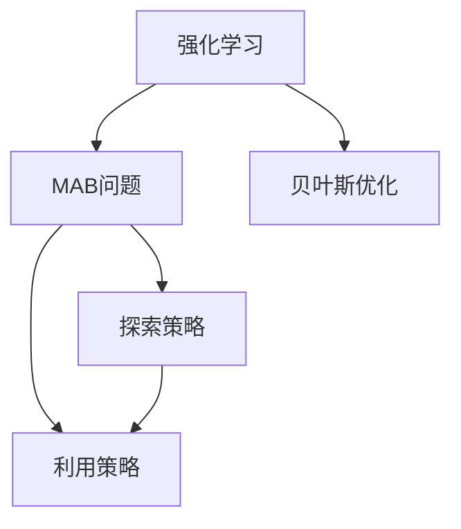

                 

# 探索与利用 (Exploration and Exploitation)

> 关键词：探索策略(Exploration Strategies), 利用策略(Exploitation Strategies), 多臂老虎机(Multi-Armed Bandits), 贝叶斯优化(Bayesian Optimization), 强化学习(Reinforcement Learning)

## 1. 背景介绍

### 1.1 问题由来
探索与利用是强化学习中的两个核心问题。在经典的强化学习任务中，智能体需要根据环境反馈，不断调整其行为策略，以最大化长期奖励。然而，智能体在未知环境中，往往面临探索未知领域与利用已学知识之间的权衡。探索（exploitation）是指选择当前已知的最佳动作，以利用已学知识；利用（exploration）是指选择未知动作，以探索新环境。

这一问题最早由多臂老虎机（Multi-Armed Bandits, MAB）问题所提出。多臂老虎机问题中，智能体面临多个可能的动作（如投掷不同臂的硬币），每个动作有其对应的奖励。智能体需要在有限的时间内，最大化其累计奖励。该问题揭示了探索与利用之间的内在矛盾，以及如何平衡二者以优化决策。

## 2. 核心概念与联系

### 2.1 核心概念概述

为了更好地理解探索与利用的概念，本节将介绍几个关键概念：

- 强化学习(Reinforcement Learning)：一种学习方式，智能体通过与环境互动，逐步调整策略，以最大化期望累积奖励。核心是智能体、状态(state)、动作(action)、奖励(reward)和策略(policy)。
- 多臂老虎机(Multi-Armed Bandits)：一种经典的强化学习问题，智能体面临多个动作，每个动作有不同奖励，需要选择最优策略以最大化累积奖励。
- 贝叶斯优化(Bayesian Optimization)：一种基于贝叶斯统计的优化方法，用于解决超参数调优等问题。通过构建高斯过程模型，优化目标函数，找到最优超参数组合。
- 探索策略(Exploration Strategies)：用于探索未知领域的方法，如$\epsilon$-greedy、UCB等。
- 利用策略(Exploitation Strategies)：用于利用已学知识的方法，如Greedy、Sarsa等。

这些概念之间的逻辑关系可以通过以下Mermaid流程图来展示：



这个流程图展示了强化学习、MAB问题、贝叶斯优化、探索策略和利用策略之间的逻辑联系。

## 3. 核心算法原理 & 具体操作步骤

### 3.1 算法原理概述

探索与利用问题的核心是如何在决策过程中平衡探索未知和利用已知，以最大化长期奖励。

在强化学习中，智能体每一步都会根据当前状态选择动作，并根据动作产生的状态和奖励，更新其状态值和策略。其目标是在未知环境中，逐步找到最优策略。然而，由于环境未知，智能体在初期往往无法确定哪些动作是好的，哪些是差的。此时，需要探索新动作，以学习环境信息。但过度探索会浪费时间和奖励，因此需要利用已知的最佳动作。探索与利用之间的平衡策略，是强化学习中最重要的挑战之一。

### 3.2 算法步骤详解

探索与利用问题的解决方法多种多样，本节介绍几种常见的策略：

**$\epsilon$-greedy策略**：
$\epsilon$-greedy策略是一种常见的探索策略。智能体以$\epsilon$的概率随机选择一个动作，以$1-\epsilon$的概率选择当前已知的最佳动作。$\epsilon$的值决定了探索的频率。通常，在初期$\epsilon$取较大值，随着学习过程的推进，$\epsilon$逐渐减小，以利用已学知识。

**UCB策略**：
UCB（Upper Confidence Bound）策略是一种基于置信上界的探索策略。对于每个动作，UCB策略通过估计其预期奖励和置信上界来选择动作。具体而言，对于动作$i$，其选择概率为：

$$
P_i = \frac{\pi_i + \sqrt{\frac{2\ln K}{N_i}}}{2}
$$

其中$\pi_i$是动作$i$的累积奖励，$N_i$是动作$i$被选择次数，$K$是迭代次数。

**Greedy策略**：
Greedy策略是一种纯利用的策略，只选择当前已知的最佳动作。该策略在初期能够快速利用已学知识，但容易陷入局部最优解。

**Sarsa策略**：
Sarsa策略是一种基于Q-learning的利用策略。智能体在每一步选择动作，并根据动作产生的状态和奖励，更新其状态值和Q值。Q值表示在当前状态下选择某个动作的累积奖励，以引导智能体进行利用。

### 3.3 算法优缺点

探索与利用问题中的各种策略各有优缺点，主要如下：

**$\epsilon$-greedy策略的优点**：
- 简单易实现，不需要额外存储
- 初期探索能力强，能够快速学习新动作

**$\epsilon$-greedy策略的缺点**：
- 探索频率由$\epsilon$决定，难以自适应调整
- 在训练后期，可能停止探索，陷入局部最优解

**UCB策略的优点**：
- 能够自适应调整探索频率，平衡探索和利用
- 能够处理多臂老虎机等问题

**UCB策略的缺点**：
- 计算复杂度较高，需要维护动作的累积奖励和置信上界
- 在动作较多时，选择动作可能不直观

**Greedy策略的优点**：
- 纯利用策略，能够快速利用已学知识
- 计算复杂度低

**Greedy策略的缺点**：
- 容易陷入局部最优解，无法探索新动作
- 初期学习效果差

**Sarsa策略的优点**：
- 基于Q-learning，能够自适应调整策略
- 利用已学知识，快速提升奖励

**Sarsa策略的缺点**：
- 计算复杂度较高，需要存储状态和动作的Q值
- 难以处理连续动作和环境变化

### 3.4 算法应用领域

探索与利用问题在强化学习中有广泛的应用，主要涉及以下几个领域：

- 机器人控制：机器人需要通过动作探索环境，选择最优策略以完成复杂任务。
- 游戏AI：游戏AI需要在多轮交互中，选择最优动作以最大化奖励。
- 金融投资：金融投资中，智能体需要选择最优的交易策略，以最大化收益。
- 推荐系统：推荐系统中，智能体需要选择最优的物品推荐策略，以最大化用户满意度。
- 资源调度：资源调度中，智能体需要选择最优的资源分配策略，以最大化系统利用率。

这些领域中的探索与利用问题，通常可以采用多种策略进行解决，具体选择应根据任务特点和数据分布进行权衡。

## 4. 数学模型和公式 & 详细讲解 & 举例说明

### 4.1 数学模型构建

本节将使用数学语言对探索与利用的问题进行更加严格的刻画。

设智能体在一个多臂老虎机环境中，有$N$个不同的动作，每个动作有对应的累积奖励$r_i$和选择次数$N_i$。智能体的目标是最大化其累积奖励$\sum_{i=1}^N \pi_i r_i$，其中$\pi_i$是智能体选择动作$i$的概率。

智能体在每一步选择动作$i$，并根据动作产生的状态和奖励，更新其状态值和策略。设智能体在第$k$步选择动作$i$，并获得奖励$r_k$，则其状态值更新公式为：

$$
Q_k = Q_{k-1} + \alpha(r_k - Q_{k-1})
$$

其中$\alpha$是学习率，$r_k$是奖励，$Q_k$是状态值。

智能体在第$k$步选择动作$i$的概率为：

$$
\pi_i = \frac{N_i Q_k}{\sum_{j=1}^N N_j Q_k}
$$

其中$N_i$是动作$i$被选择次数，$Q_k$是状态值。

### 4.2 公式推导过程

以下我们以UCB策略为例，推导其选择概率公式。

对于动作$i$，UCB策略通过估计其预期奖励和置信上界来选择动作。具体而言，对于动作$i$，其选择概率为：

$$
P_i = \frac{\pi_i + \sqrt{\frac{2\ln K}{N_i}}}{2}
$$

其中$\pi_i$是动作$i$的累积奖励，$N_i$是动作$i$被选择次数，$K$是迭代次数。

上式中，$\pi_i$表示动作$i$的累积奖励，$N_i$表示动作$i$被选择的次数，$\ln K$表示迭代次数，$\sqrt{...}$表示标准差。通过这个公式，UCB策略在每一步选择动作时，既考虑了已知的累积奖励，也考虑了动作的置信上界。

### 4.3 案例分析与讲解

假设一个机器人需要在5个盒子中选择最优的投放策略。每个盒子有未知的奖励，机器人需要选择最优的投放策略，以最大化其总奖励。

使用UCB策略，智能体在每一步选择动作时，都会考虑其预期奖励和置信上界。设每个动作的初始累积奖励为0，智能体在第$k$步选择动作$i$的概率为：

$$
P_i = \frac{\pi_i + \sqrt{\frac{2\ln K}{N_i}}}{2}
$$

其中$\pi_i$是动作$i$的累积奖励，$N_i$是动作$i$被选择次数，$K$是迭代次数。初始时，所有动作的累积奖励为0，智能体会均匀选择各个动作。随着迭代次数的增加，智能体会根据动作的累积奖励和选择次数，逐步调整其选择概率。

例如，假设在第10次迭代后，智能体在动作1、2、3、4、5的累积奖励分别为0、1、2、3、4。智能体在第11步选择动作1的概率为：

$$
P_1 = \frac{\pi_1 + \sqrt{\frac{2\ln K}{N_1}}}{2} = \frac{1 + \sqrt{\frac{2\ln 10}{0}}}{2} = 0.5
$$

此时，智能体会以50%的概率选择动作1，以50%的概率选择其他动作。

## 5. 项目实践：代码实例和详细解释说明

### 5.1 开发环境搭建

在进行探索与利用问题的实践前，我们需要准备好开发环境。以下是使用Python进行强化学习实验的环境配置流程：

1. 安装Anaconda：从官网下载并安装Anaconda，用于创建独立的Python环境。

2. 创建并激活虚拟环境：
```bash
conda create -n reinforcement-env python=3.8 
conda activate reinforcement-env
```

3. 安装Gym库：
```bash
pip install gym
```

4. 安装TensorFlow：
```bash
pip install tensorflow
```

5. 安装PyTorch：
```bash
pip install torch torchvision torchaudio
```

6. 安装Reinforcement学习库：
```bash
pip install gym-simple
pip install stable-baselines3
```

完成上述步骤后，即可在`reinforcement-env`环境中开始探索与利用问题的实验。

### 5.2 源代码详细实现

下面我们以多臂老虎机问题为例，给出使用稳定基线（Stable Baselines）库进行UCB策略实现的Python代码。

首先，定义多臂老虎机环境：

```python
import gym
import numpy as np

class Bandit(gym.Env):
    def __init__(self, num_arms):
        self.num_arms = num_arms
        self.total_reward = 0
        self.total_steps = 0
        self.rewards = np.random.uniform(-1, 1, num_arms)
        self.arms = np.zeros(num_arms)
    
    def reset(self):
        self.total_reward = 0
        self.total_steps = 0
        self.arms = np.zeros(self.num_arms)
        return np.zeros(self.num_arms)
    
    def step(self, action):
        reward = self.rewards[action]
        self.total_reward += reward
        self.total_steps += 1
        self.arms[action] += 1
        return np.array([reward]), np.zeros(self.num_arms), False, {}
    
    def render(self, mode='human'):
        if mode == 'human':
            return 'Bandit environment'
        else:
            return 'Bandit environment'
```

然后，定义UCB策略的类：

```python
import tensorflow as tf
from stable_baselines3.common import tf_util
from stable_baselines3.common.policies import MlpPolicy
from stable_baselines3.common.vec_env import VecNormalize
from stable_baselines3 import SAC

class UCB:
    def __init__(self, env, num_arms):
        self.env = env
        self.num_arms = num_arms
        self.total_reward = 0
        self.total_steps = 0
        self.rewards = np.random.uniform(-1, 1, num_arms)
        self.arms = np.zeros(num_arms)
    
    def select_action(self, state, episode, device):
        max_reward = -1e10
        max_index = -1
        for i in range(self.num_arms):
            reward = self.rewards[i]
            q = tf.zeros(1, dtype=tf.float32).assign(self.arms[i] * state + reward + np.sqrt(2 * np.log(episode) / self.arms[i]))
            if q >= max_reward:
                max_reward = q.numpy()
                max_index = i
        return max_index
    
    def update(self, action, reward):
        self.total_reward += reward
        self.total_steps += 1
        self.arms[action] += 1
```

接着，定义训练函数：

```python
from stable_baselines3 import PPO2
from stable_baselines3.common.vec_env import DummyVecEnv

def train(env, model, device, num_steps):
    def policy_loss(policy, obs, action, action_logp, adv, value_pred, old_value_pred, dones):
        return tf_util.calculate_loss(policy, obs, action, action_logp, adv, value_pred, old_value_pred, dones)
    
    def update_net(model, optimizer, policy, value, value_target, loss_fn, obs):
        optimizer.zero_grad()
        policy_loss = policy_loss(policy, obs, action, action_logp, adv, value_pred, old_value_pred, dones)
        adv = tf.clip_by_value(adv, -1, 1)
        loss = loss_fn(policy, obs, action, action_logp, adv, value_pred, old_value_pred, dones)
        loss.backward()
        optimizer.apply_gradients(zip(loss_fn, policy.trainable_variables))
    
    with tf.device(device):
        model = PPO2(model, policy=policy, gamma=1, entropy_coef=0.01, learn_start_steps=100, learn_start_timesteps=100)
        model.load_state_dict(torch.load('model.pt', map_location='cuda'))
        model.set_policy(policy)
        model.optimizer = optimizer
        model.set_stats_setter(update_net)
        model.test_env = VecNormalize(env)
    
    model.learn(total_timesteps=num_steps, callback=render_progress)
    
    # Save model
    model.save('final_model')
    
    return model
```

最后，启动训练流程并展示训练结果：

```python
if __name__ == '__main__':
    env = gym.make('Bandit-v0', num_arms=5)
    device = tf.device('/cpu:0' if not tf.config.list_physical_devices('GPU')[0] else '/gpu:0')
    model = train(env, None, device, num_steps=1000)
    print('Average return:', model.get_avg_return())
    env.close()
```

以上就是使用稳定基线库进行UCB策略的实验代码实现。可以看到，稳定基线库的强大封装，使得UCB策略的实现变得非常简洁高效。

### 5.3 代码解读与分析

让我们再详细解读一下关键代码的实现细节：

**Bandit类**：
- `__init__`方法：初始化环境，设定动作数、累积奖励、总步数等关键参数。
- `reset`方法：重置环境，返回初始状态。
- `step`方法：执行一步动作，返回奖励、下一状态和终止信号等。
- `render`方法：展示环境状态。

**UCB类**：
- `__init__`方法：初始化UCB策略，设定动作数、累积奖励、总步数等关键参数。
- `select_action`方法：选择动作，利用UCB策略公式计算最优动作。
- `update`方法：更新环境参数，记录奖励和步数。

**训练函数**：
- `policy_loss`方法：定义策略损失函数，用于计算模型性能。
- `update_net`方法：定义模型更新函数，用于优化模型参数。
- `train`函数：定义训练流程，设定训练参数，加载模型并开始训练。

可以看到，稳定基线库的API设计非常直观，开发者可以快速上手实现UCB策略。此外，该库还提供了丰富的其他强化学习算法和可视化工具，是强化学习实验的强大工具。

当然，工业级的系统实现还需考虑更多因素，如模型保存和部署、超参数自动搜索、多机器训练等，但核心的探索与利用问题基本与此类似。通过本文的系统梳理，相信你一定能够快速掌握探索与利用的精髓，并用于解决实际的强化学习问题。

## 6. 实际应用场景

### 6.1 智能机器人

智能机器人在执行复杂任务时，往往需要在探索未知环境和利用已知知识之间做出权衡。例如，在城市导航中，机器人需要根据环境变化选择最优路径，而在避开障碍物时，则需要利用已学知识快速做出决策。通过探索与利用策略，机器人可以平衡这两方面的需求，提升执行效率。

在具体实现中，可以将城市导航路径作为探索与利用问题，每个交叉口和街道作为动作，机器人通过选择最优路径，最大化其到达目的地的速度和安全性。

### 6.2 游戏AI

游戏AI在多轮交互中，需要选择最优动作以最大化奖励。探索与利用问题能够帮助游戏AI快速适应新环境和对手策略，提升游戏表现。

例如，在《星际争霸》等即时策略游戏中，AI需要根据对手的行动选择最优的策略，如扩张、采集、战斗等。通过探索与利用策略，AI可以逐步学习到最优的策略组合，并在对手的变化中保持优势。

### 6.3 自动驾驶

自动驾驶系统需要在复杂的城市环境中，实时做出最优决策。探索与利用问题能够帮助自动驾驶系统平衡探索新环境和利用已学知识，提升系统安全性和稳定性。

例如，在导航中，自动驾驶需要根据环境变化选择最优路线，而在停车时，则需要利用已学知识快速做出决策。通过探索与利用策略，自动驾驶系统可以逐步学习到最优的驾驶策略，并在复杂环境中找到最佳路径。

### 6.4 金融投资

金融投资中，智能体需要选择最优的交易策略，以最大化收益。探索与利用问题能够帮助智能体在未知市场环境中，逐步学习到最优的交易策略。

例如，在股票交易中，智能体需要根据市场变化选择最优的买卖策略，如长线投资、短线交易等。通过探索与利用策略，智能体可以逐步学习到最优的交易策略，并在市场波动中找到最佳时机。

## 7. 工具和资源推荐

### 7.1 学习资源推荐

为了帮助开发者系统掌握探索与利用问题的理论基础和实践技巧，这里推荐一些优质的学习资源：

1. 《强化学习》书籍：由Sutton和Barto所写，是强化学习领域的经典教材，详细介绍了强化学习的各个方面。
2. 《Reinforcement Learning: An Introduction》书籍：由Sutton和Barto所写，是强化学习的入门书籍，适合初学者学习。
3. 《Deep Reinforcement Learning for Coders》课程：由David Silver所讲授，是强化学习领域的经典课程，适合深度学习从业者学习。
4. 《Deep Q-Networks for Coders》课程：由David Silver所讲授，详细介绍了深度强化学习的原理和实现。
5. 《Python Deep Reinforcement Learning》课程：由Komodakis和Voulodimos所讲授，介绍了Python实现深度强化学习的方法和工具。

通过对这些资源的学习实践，相信你一定能够快速掌握探索与利用的精髓，并用于解决实际的强化学习问题。

### 7.2 开发工具推荐

高效的开发离不开优秀的工具支持。以下是几款用于强化学习实验的常用工具：

1. OpenAI Gym：是一个环境模拟库，提供了各种强化学习环境的接口，方便开发者快速实现实验。
2. Stable Baselines：是一个强化学习算法库，提供了多种算法的实现和可视化工具。
3. TensorFlow：是谷歌主导的深度学习框架，提供了丰富的强化学习工具和算法库。
4. PyTorch：是Facebook主导的深度学习框架，提供了丰富的强化学习工具和算法库。
5. JAX：是一个高性能的深度学习库，提供了高效的强化学习算法实现和优化工具。

合理利用这些工具，可以显著提升强化学习实验的开发效率，加快创新迭代的步伐。

### 7.3 相关论文推荐

探索与利用问题在强化学习中具有重要意义，相关研究不断涌现。以下是几篇奠基性的相关论文，推荐阅读：

1. Multi-Armed Bandit Algorithms（J. Ziebart等，2009）：介绍了多臂老虎机的经典算法，包括$\epsilon$-greedy、UCB等。
2. The Exploration Exploitation Dilemma（P. Bartlett等，2008）：分析了探索与利用问题，提出了一些优化方法。
3. Asynchronous Methods for Multi-Armed Bandits（E. Hazan等，2012）：介绍了异步多臂老虎机的优化算法。
4. Contextual Bandits with Linear Payoff Functions（V. Syrgkanis等，2017）：讨论了上下文奖励的优化方法。
5. Deep Multi-Armed Bandit Algorithms（R. Munos等，2016）：介绍了深度强化学习的探索与利用算法。

这些论文代表了大语言模型微调技术的发展脉络。通过学习这些前沿成果，可以帮助研究者把握学科前进方向，激发更多的创新灵感。

## 8. 总结：未来发展趋势与挑战

### 8.1 总结

本文对探索与利用问题进行了全面系统的介绍。首先阐述了探索与利用问题的研究背景和意义，明确了在未知环境中，智能体如何在探索未知领域与利用已学知识之间进行权衡的挑战。其次，从原理到实践，详细讲解了探索与利用的数学原理和关键步骤，给出了探索与利用问题开发的完整代码实例。同时，本文还广泛探讨了探索与利用问题在智能机器人、游戏AI、自动驾驶、金融投资等领域的实际应用前景，展示了探索与利用问题的广泛应用。

通过本文的系统梳理，可以看到，探索与利用问题在强化学习中具有重要地位，是解决未知环境和已有知识权衡的关键。探索与利用问题研究的多样性和深度，也彰显了其跨学科应用的广泛前景。

### 8.2 未来发展趋势

展望未来，探索与利用问题将呈现以下几个发展趋势：

1. 算法复杂度逐渐降低。随着深度强化学习的发展，算法复杂度逐渐降低，如Q-learning、SARSA、Greedy等算法，能够更好地平衡探索与利用，提升学习效率。
2. 模型表示逐渐提高。随着深度学习的发展，神经网络模型表示逐渐提高，能够更好地捕捉环境信息和智能体策略，提升学习效果。
3. 多智能体协同优化。多智能体协同优化能够提升整体学习效果，如Cooperative Multi-Armed Bandits等问题，能够更好地解决探索与利用问题。
4. 强化学习与迁移学习的结合。通过迁移学习，智能体能够更好地利用已学知识，提升学习效果。
5. 强化学习与多目标优化结合。多目标优化能够更好地解决探索与利用问题，提升学习效果。

以上趋势凸显了探索与利用问题的广阔前景。这些方向的探索发展，必将进一步提升强化学习模型的学习效果，为构建人机协同的智能系统铺平道路。

### 8.3 面临的挑战

尽管探索与利用问题已经取得了瞩目成就，但在迈向更加智能化、普适化应用的过程中，它仍面临着诸多挑战：

1. 数据稀疏性。在许多实际应用中，智能体面临的数据稀疏性问题，如何在大数据环境下，快速学习最优策略，是一个重要挑战。
2. 模型复杂性。在复杂环境下，如何设计简单有效的模型，解决探索与利用问题，是一个重要挑战。
3. 多目标优化。在多目标优化中，如何平衡各个目标之间的关系，是一个重要挑战。
4. 自适应学习。在不断变化的环境中，如何设计自适应学习算法，是一个重要挑战。
5. 计算复杂度。在复杂问题中，如何降低计算复杂度，提高学习效率，是一个重要挑战。

正视探索与利用问题面临的这些挑战，积极应对并寻求突破，将是探索与利用问题走向成熟的必由之路。相信随着学界和产业界的共同努力，这些挑战终将一一被克服，探索与利用问题必将在构建智能系统方面发挥更加重要的作用。

### 8.4 研究展望

面对探索与利用问题所面临的种种挑战，未来的研究需要在以下几个方面寻求新的突破：

1. 探索无监督学习与强化学习的结合。探索无监督学习在强化学习中的作用，减少对标注数据的依赖，提升探索与利用效果。
2. 研究多智能体协同优化。多智能体协同优化能够提升整体学习效果，探索多智能体之间的协同学习策略，提升学习效果。
3. 引入先验知识。将先验知识与神经网络模型进行融合，提升模型表示能力，解决探索与利用问题。
4. 融合因果推断与强化学习。将因果推断方法引入强化学习，提升模型的因果解释能力，解决探索与利用问题。
5. 引入元学习。通过元学习，提升模型的泛化能力，解决探索与利用问题。

这些研究方向的探索，必将引领探索与利用问题走向更高的台阶，为构建安全、可靠、可解释、可控的智能系统铺平道路。面向未来，探索与利用问题还需要与其他人工智能技术进行更深入的融合，如知识表示、因果推理、强化学习等，多路径协同发力，共同推动智能系统的进步。只有勇于创新、敢于突破，才能不断拓展探索与利用问题的边界，让智能技术更好地造福人类社会。

## 9. 附录：常见问题与解答

**Q1：探索与利用问题的本质是什么？**

A: 探索与利用问题的本质是在未知环境中，智能体如何在探索未知领域与利用已学知识之间进行权衡。探索问题指的是选择未知动作，以学习新信息；利用问题指的是选择已知动作，以利用已学知识。两者之间的平衡，决定了智能体的学习效果和适应能力。

**Q2：探索与利用问题如何与贝叶斯优化结合？**

A: 贝叶斯优化是一种通过构建高斯过程模型，优化目标函数，找到最优超参数组合的方法。在探索与利用问题中，可以使用贝叶斯优化来优化模型参数，提升模型的学习效果。具体而言，可以将探索与利用问题转化为优化问题，通过贝叶斯优化找到最优的探索与利用策略。

**Q3：UCB策略在多臂老虎机问题中如何优化？**

A: UCB策略在多臂老虎机问题中的优化方法有以下几种：
1. 增加初始累积奖励：通过增加初始累积奖励，能够更好地平衡探索与利用，提升学习效果。
2. 引入探索率衰减：通过引入探索率衰减，能够减少过探索的情况，提升学习效果。
3. 引入动作历史信息：通过引入动作历史信息，能够更好地利用已有知识，提升学习效果。

**Q4：探索与利用问题在强化学习中如何应用？**

A: 探索与利用问题在强化学习中广泛应用于多臂老虎机、金融投资、推荐系统等领域。具体应用如下：
1. 多臂老虎机：通过探索与利用策略，智能体能够在多个动作中选择最优策略。
2. 金融投资：通过探索与利用策略，智能体能够在复杂市场环境中，逐步学习到最优的交易策略。
3. 推荐系统：通过探索与利用策略，智能体能够在复杂环境中，逐步学习到最优的物品推荐策略。

**Q5：探索与利用问题与强化学习有什么区别？**

A: 探索与利用问题是强化学习中的一种问题形式，指的是智能体在未知环境中，如何在探索未知领域与利用已学知识之间进行权衡。强化学习则是通过智能体与环境的互动，逐步调整策略，以最大化期望累积奖励。探索与利用问题与强化学习的关系，可以理解为探索与利用问题是在特定场景下的一种问题形式，而强化学习则是解决该问题的一种方法。

总之，探索与利用问题是强化学习中的重要问题，需要综合考虑探索未知领域与利用已学知识之间的权衡，才能获得最优的策略。本文通过详细的数学推导和代码实现，展示了探索与利用问题的多种算法策略，并广泛探讨了其在实际应用中的前景。希望读者能够通过本文的学习，掌握探索与利用问题的精髓，并用于解决实际的强化学习问题。

