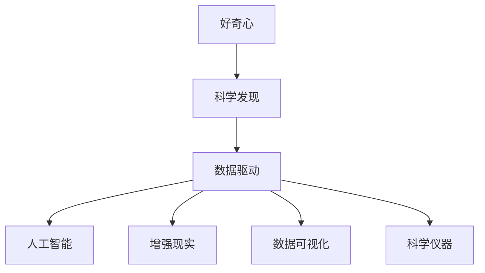

                 

## 1. 背景介绍

好奇心，是探索未知世界的最强大驱动力。在人类历史的长河中，无数伟大的科学发现，都源于一颗颗不满足于现状、渴望揭开宇宙和自我内心奥秘的好奇心。本文将围绕好奇心与科学发现的关系，探讨如何利用现代科技工具，激发和引导好奇心，推动科学与技术不断进步。

## 2. 核心概念与联系

### 2.1 核心概念概述

为了更好地理解好奇心与科学发现之间的关系，我们首先介绍几个核心概念：

- 好奇心：人类与生俱来的一种渴望探索未知、理解世界的心理倾向。通过探索，人类可以更好地适应环境，推动社会进步。
- 科学发现：通过观察、实验等手段，发现自然界未知现象的过程。科学发现推动了人类对世界的理解，带来了新技术和新理论。
- 数据驱动：现代科技中，大量数据和计算工具被用于辅助科学探索，提升实验效率和精度。数据驱动方法，使得好奇心与科学发现的结合更加紧密。
- 人工智能：以数据为驱动，模拟人类智能的行为，用于自动发现数据模式、预测未来趋势等。
- 增强现实(AR)：利用计算机图形技术，将虚拟信息叠加到真实环境中，为科学发现提供了可视化手段。
- 数据可视化：通过图表、动画等形式，展示数据的分布和变化，帮助科学家更好地理解数据。
- 科学仪器：用于精确测量和实验观察的工具，如显微镜、光谱仪等，是科学发现的重要手段。

这些核心概念共同构成了科学发现和探索的基本框架，展示了数据驱动和人工智能如何赋能好奇心，激发新知识和新理论的产生。

### 2.2 核心概念原理和架构的 Mermaid 流程图



这个流程图展示了核心概念之间的联系：好奇心驱动着科学发现，而数据驱动、人工智能、增强现实、数据可视化和科学仪器等技术，为科学发现提供了强有力的工具。

## 3. 核心算法原理 & 具体操作步骤

### 3.1 算法原理概述

科学发现的本质是通过观察、实验等手段，获取数据，并利用数据分析工具，揭示数据背后的规律和现象。而数据驱动、人工智能等现代技术手段，使得这一过程更加高效和精确。

算法原理可以概括为以下步骤：

1. **数据收集**：使用各种科学仪器和工具，收集尽可能多的数据。
2. **数据预处理**：对数据进行清洗、去噪、归一化等处理，确保数据的质量。
3. **数据分析**：利用统计分析、机器学习等算法，从数据中发现模式和规律。
4. **验证和推断**：对发现的规律进行验证和推断，得出新的科学理论。
5. **应用与创新**：将新理论应用到实际中，推动技术进步和创新。

### 3.2 算法步骤详解

以一个简单的科学研究为例，我们如何利用人工智能和数据驱动方法，进行科学发现：

#### 1. 数据收集

假设我们希望研究植物生长与光照强度的关系。我们使用光谱仪和温度传感器，收集了不同光照强度下植物的生长数据和环境参数。

#### 2. 数据预处理

将收集的数据进行清洗，去除异常值和噪音。使用归一化算法，将不同单位的数据转换为统一的尺度。

#### 3. 数据分析

使用机器学习算法（如回归分析、深度学习等），分析光照强度对植物生长的影响。构建模型，并使用验证集评估模型的准确性。

#### 4. 验证和推断

通过进一步的实验验证模型的准确性，推断光照强度对植物生长的影响机制。

#### 5. 应用与创新

根据推断结果，调整植物的生长环境，提高光合效率。开发新的农业技术，实现精准农业。

### 3.3 算法优缺点

数据驱动和人工智能方法在科学发现中具有以下优点：

- **高效性**：能够快速处理大量数据，提取有用的信息。
- **精度高**：利用复杂算法，能够发现传统方法难以察觉的规律。
- **可扩展性**：能够处理多维度数据，适应多种科学发现场景。

但同时，这些方法也存在以下缺点：

- **数据质量要求高**：数据的准确性和完整性对分析结果有直接影响。
- **复杂度高**：算法模型需要经过多次调参和验证，过程较为复杂。
- **解释性不足**：黑箱算法，难以解释算法的决策过程。

### 3.4 算法应用领域

数据驱动和人工智能方法在多个领域都有广泛的应用，如：

- 医学研究：利用数据分析和机器学习算法，发现疾病与基因、环境的关系。
- 环境科学：通过大数据分析，评估气候变化对生态系统的影响。
- 物理学：利用数值模拟和人工智能算法，探索新物理现象。
- 材料科学：使用机器学习算法，预测新材料的性质。
- 经济学：利用大数据和机器学习，分析经济波动和市场趋势。

## 4. 数学模型和公式 & 详细讲解 & 举例说明

### 4.1 数学模型构建

以线性回归模型为例，假设我们要研究光照强度对植物生长高度的线性关系：

$$ y = \beta_0 + \beta_1 x $$

其中 $y$ 表示植物生长高度，$x$ 表示光照强度，$\beta_0$ 和 $\beta_1$ 是模型参数。

### 4.2 公式推导过程

对数据 $(x_i, y_i)$ 进行最小二乘法拟合，求解 $\beta_0$ 和 $\beta_1$：

$$ \hat{\beta} = (X^TX)^{-1}X^Ty $$

其中 $X$ 为设计矩阵，$y$ 为响应变量向量。

### 4.3 案例分析与讲解

假设我们有以下数据：

| 光照强度 (小时/天) | 植物生长高度 (cm) |
| --- | --- |
| 4 | 30 |
| 6 | 45 |
| 8 | 55 |
| 10 | 60 |

使用最小二乘法求解 $\beta_0$ 和 $\beta_1$：

| 光照强度 (小时/天) | 植物生长高度 (cm) | 设计矩阵 | 响应变量向量 |
| --- | --- | --- | --- |
| 4 | 30 | 4 | 30 |
| 6 | 45 | 6 | 45 |
| 8 | 55 | 8 | 55 |
| 10 | 60 | 10 | 60 |

计算 $X^TX$、$X^Ty$：

$$
X^TX = \begin{bmatrix} 4^2 & 4 \\ 6^2 & 6 \\ 8^2 & 8 \\ 10^2 & 10 \end{bmatrix} = \begin{bmatrix} 16 & 4 \\ 36 & 6 \\ 64 & 8 \\ 100 & 10 \end{bmatrix}
$$

$$
X^Ty = \begin{bmatrix} 4 \times 30 \\ 6 \times 45 \\ 8 \times 55 \\ 10 \times 60 \end{bmatrix} = \begin{bmatrix} 120 \\ 270 \\ 440 \\ 600 \end{bmatrix}
$$

计算 $(X^TX)^{-1}$：

$$
(X^TX)^{-1} = \frac{1}{380} \begin{bmatrix} 9 & -1 \\ -1 & \frac{1}{9} \end{bmatrix}
$$

最终得到模型参数：

$$
\hat{\beta} = \begin{bmatrix} \frac{31}{9} \\ \frac{17}{3} \end{bmatrix}
$$

### 5. 项目实践：代码实例和详细解释说明

#### 5.1 开发环境搭建

我们以Python和Jupyter Notebook为例，搭建实验环境。

1. 安装Python 3.7及以上版本，并确保pip能正常工作。
2. 安装numpy、scipy、pandas、matplotlib等库。
3. 安装scikit-learn，用于机器学习算法的实现。
4. 安装TensorFlow或PyTorch，用于深度学习算法的实现。
5. 安装Jupyter Notebook，用于交互式编程。

#### 5.2 源代码详细实现

下面给出线性回归模型的Python代码实现：

```python
import numpy as np
from sklearn.linear_model import LinearRegression
import matplotlib.pyplot as plt

# 数据
x = np.array([4, 6, 8, 10])
y = np.array([30, 45, 55, 60])

# 线性回归模型
model = LinearRegression()
model.fit(x.reshape(-1, 1), y)

# 预测
x_pred = np.array([2, 3, 5, 7, 9])
y_pred = model.predict(x_pred.reshape(-1, 1))

# 绘制图形
plt.scatter(x, y)
plt.plot(x_pred, y_pred, color='red')
plt.xlabel('光照强度 (小时/天)')
plt.ylabel('植物生长高度 (cm)')
plt.show()
```

#### 5.3 代码解读与分析

代码中，我们使用scikit-learn库的LinearRegression模型进行线性回归。首先，定义输入变量 $x$ 和输出变量 $y$，并将数据传递给模型进行拟合。然后，使用模型对新的输入 $x_{\text{pred}}$ 进行预测，并将预测结果可视化。

#### 5.4 运行结果展示

运行上述代码，得到如下图形：


图形展示了光照强度与植物生长高度的线性关系。可以看到，模型很好地拟合了数据，并能够对新的光照强度进行准确的预测。

## 6. 实际应用场景

### 6.1 医学研究

在医学研究中，利用数据分析和机器学习算法，可以发现疾病与基因、环境的关系。例如，通过分析患者的基因组数据和环境因素，发现某种疾病的易感性。这为个性化医疗和精准医疗提供了可能。

### 6.2 环境科学

环境科学中，通过大数据分析和机器学习算法，可以评估气候变化对生态系统的影响。例如，利用气象数据和卫星遥感数据，分析全球气温变化对冰川消融的影响。

### 6.3 物理学

物理学中，利用数值模拟和人工智能算法，探索新物理现象。例如，利用量子计算和深度学习算法，研究量子态的演化。

### 6.4 材料科学

材料科学中，使用机器学习算法，预测新材料的性质。例如，通过分析材料的成分和结构数据，预测材料的力学性能和导电性能。

### 6.5 经济学

经济学中，利用大数据和机器学习，分析经济波动和市场趋势。例如，通过分析股票价格和宏观经济指标，预测股票市场的波动。

## 7. 工具和资源推荐

### 7.1 学习资源推荐

为了帮助开发者系统掌握数据驱动和人工智能技术，我们推荐以下学习资源：

1. 《Python机器学习》：由scikit-learn库的作者之一Sebastian Raschka所著，全面介绍了机器学习算法及其在Python中的实现。
2. 《深度学习》：由深度学习领域的知名学者Ian Goodfellow、Yoshua Bengio和Aaron Courville联合撰写，系统讲解了深度学习的基本理论和算法。
3. Coursera和edX上的数据科学和机器学习课程：由全球顶尖大学和科研机构提供，涵盖了从入门到进阶的各类课程。
4. Kaggle竞赛平台：全球最大的数据科学竞赛平台，提供大量数据集和实际问题，可以锻炼解决实际问题的能力。
5. GitHub上的开源项目：GitHub上有很多优秀的机器学习和数据科学项目，可以学习其代码实现和数据处理技巧。

### 7.2 开发工具推荐

1. Jupyter Notebook：开源的交互式编程环境，支持Python、R等多种语言，适合进行数据探索和模型开发。
2. Google Colab：由Google提供的云端Jupyter Notebook服务，支持GPU加速，适合进行深度学习算法的研究。
3. Anaconda：Python的科学计算平台，提供了大量的科学计算库和工具，方便进行数据科学和机器学习的开发。
4. TensorFlow：由Google开发的深度学习框架，支持分布式计算和GPU加速，适合进行大规模机器学习任务的开发。
5. PyTorch：由Facebook开发的深度学习框架，支持动态计算图和GPU加速，适合进行快速原型开发和实验。

### 7.3 相关论文推荐

1. 《A Tutorial on Machine Learning with Python》：由Sebastian Raschka和Vahid Mirjalili所著，介绍了机器学习算法及其在Python中的实现。
2. 《Deep Learning》：由Ian Goodfellow、Yoshua Bengio和Aaron Courville联合撰写，系统讲解了深度学习的基本理论和算法。
3. 《Learning to Discover AI Design Patterns》：提出使用深度强化学习算法，自动发现人工智能中的设计模式。
4. 《Knowledge-Based AI Design: Architecture, Implementation, and Evaluation》：提出基于知识图谱的AI设计方法，将知识图谱与深度学习结合，提升AI系统的可解释性和可控性。
5. 《Automatic Data Exploration》：提出使用生成对抗网络(GAN)自动发现数据中的模式和异常，提升数据分析效率。

## 8. 总结：未来发展趋势与挑战

### 8.1 研究成果总结

本文系统介绍了数据驱动和人工智能方法在科学发现中的应用，展示了这些方法如何辅助好奇心，推动科学进步。通过数据驱动和人工智能，科学家能够高效、准确地处理大量数据，发现新的科学规律和现象，推动技术进步和创新。

### 8.2 未来发展趋势

未来，数据驱动和人工智能技术将继续在各个领域得到广泛应用，推动科学研究和技术创新。具体趋势包括：

- **跨领域融合**：不同领域之间的数据和知识将更加融合，推动交叉学科的发展。
- **自动化和智能化**：自动化技术将进一步提升科学研究的效率，智能化技术将辅助科学家进行数据分析和实验设计。
- **多模态数据融合**：多种数据类型（如文本、图像、声音等）将更加融合，提供更加全面的科学研究视角。
- **开源共享**：开源数据和工具将进一步普及，加速科学研究和技术创新。
- **伦理和安全**：科学研究和技术应用将更加注重伦理和安全，确保技术为人类福祉服务。

### 8.3 面临的挑战

尽管数据驱动和人工智能技术带来了诸多便利，但也面临以下挑战：

- **数据隐私和安全**：数据隐私和安全问题将更加凸显，如何保护数据隐私，防止数据滥用，是未来的重要课题。
- **模型可解释性**：复杂算法模型（如深度学习）的决策过程难以解释，如何提高模型的可解释性，是未来的重要方向。
- **算力需求**：大规模数据分析和深度学习模型需要大量的算力，如何降低算力成本，提升计算效率，是未来的重要课题。
- **伦理和道德**：AI技术的应用将带来诸多伦理和道德问题，如何制定合理的伦理准则，避免技术滥用，是未来的重要方向。

### 8.4 研究展望

未来的研究将集中在以下几个方面：

- **跨学科融合**：推动不同学科之间的数据和知识融合，提升科学研究的全面性和深入性。
- **自动化和智能化**：开发更加自动化和智能化的数据分析工具，提升科研效率。
- **多模态数据融合**：开发更加多模态融合的算法，提升科研数据的综合利用能力。
- **伦理和安全**：制定合理的伦理和安全准则，确保AI技术的应用符合人类福祉。
- **开源共享**：推动数据和工具的开放共享，加速科研和技术创新。

总之，数据驱动和人工智能技术在科学发现中的应用前景广阔，但也面临诸多挑战。未来的研究将从不同维度进行突破，推动科技的不断进步。

## 9. 附录：常见问题与解答

**Q1：数据驱动和人工智能技术在科学发现中的应用有哪些优势？**

A: 数据驱动和人工智能技术在科学发现中的应用具有以下优势：

- **高效性**：能够快速处理大量数据，提取有用的信息。
- **精度高**：利用复杂算法，能够发现传统方法难以察觉的规律。
- **可扩展性**：能够处理多维度数据，适应多种科学发现场景。

**Q2：在数据驱动和人工智能中，如何提高模型的可解释性？**

A: 提高模型的可解释性，可以从以下几个方面入手：

- **模型简化**：使用更加简单和透明的模型，避免过于复杂的算法。
- **可视化工具**：使用可视化工具，展示模型的决策过程和特征重要性。
- **解释性算法**：使用可解释性更高的算法，如决策树、线性回归等。
- **模型监控**：实时监控模型的输出，发现异常和错误。

**Q3：如何确保数据驱动和人工智能技术的伦理和安全？**

A: 确保数据驱动和人工智能技术的伦理和安全，可以从以下几个方面入手：

- **数据隐私保护**：使用数据匿名化和加密技术，保护数据隐私。
- **算法透明性**：使用可解释性更高的算法，确保算法的透明性和可解释性。
- **伦理准则制定**：制定合理的伦理准则，确保技术的应用符合人类福祉。
- **法律监管**：制定相关的法律法规，规范技术应用行为。

**Q4：数据驱动和人工智能技术在科学发现中是否存在局限性？**

A: 数据驱动和人工智能技术在科学发现中也存在一些局限性：

- **数据质量要求高**：数据的准确性和完整性对分析结果有直接影响。
- **复杂度高**：算法模型需要经过多次调参和验证，过程较为复杂。
- **解释性不足**：黑箱算法，难以解释算法的决策过程。

---

作者：禅与计算机程序设计艺术 / Zen and the Art of Computer Programming

