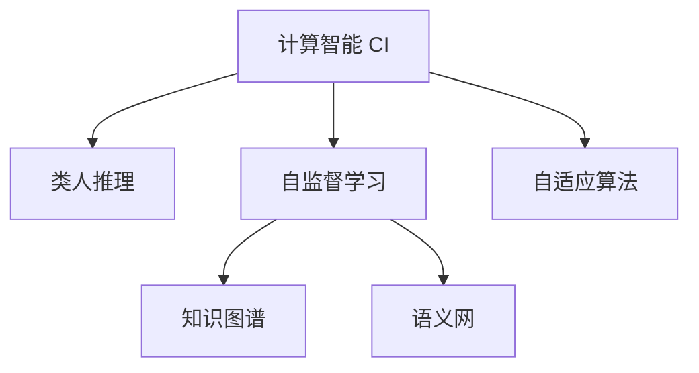

                 

# 推动知识发现与创新：人类计算的智力贡献

## 1. 背景介绍

### 1.1 问题由来
在当前信息爆炸的时代，数据以指数级增长，如何从海量数据中高效地提取有价值的信息，成为各行业面临的巨大挑战。传统的基于规则的计算方法，难以应对复杂多变的现实问题，计算智能的引入，成为突破瓶颈的关键。

计算智能是人工智能的一个子领域，其目标是利用人类智慧和计算技术，实现复杂问题的智能化解决。通过模拟人类计算过程，计算智能不仅能处理结构化数据，还能对非结构化数据进行建模和推理，实现高效的知识发现和创新。

计算智能的核心理念是“人类的计算，计算的人类”。它将人类的计算思维与现代计算技术有机结合，让机器具备“类人智能”，实现更复杂、更灵活的知识表达和应用。这一理念的提出，不仅为人工智能领域带来新的突破，也为各行业的智能化转型提供了新的思路和方法。

### 1.2 问题核心关键点
计算智能的核心在于如何更好地模拟和延伸人类计算过程，利用人类智慧解决计算问题。其主要体现在以下几个方面：

1. **类人推理**：通过符号推理和规则推理，让机器具备类似人类的逻辑思维能力，解决复杂的逻辑推理问题。
2. **类人学习和适应**：通过模仿人类学习过程，利用样本数据进行自监督学习，从而不断适应新的环境变化。
3. **类人知识表达**：利用知识图谱、语义网等技术，让机器能够进行语义化的知识表达和推理。
4. **类人交互**：通过自然语言处理技术，实现与人类自然、流畅的交互，提升用户体验和满意度。

这些关键点构成了计算智能的基本框架，使得机器能够高效地处理各种复杂问题，推动知识发现与创新。

## 2. 核心概念与联系

### 2.1 核心概念概述

为更好地理解计算智能的工作原理和优化方向，本节将介绍几个密切相关的核心概念：

- **计算智能(Computational Intelligence, CI)**：利用人类的计算思维和智慧，通过计算技术解决复杂问题的智能范式。与传统的基于规则的计算方法不同，计算智能更加灵活、自适应，可以应对更加复杂的现实问题。

- **类人推理(Human-like Reasoning)**：通过符号推理和规则推理，让机器具备类似人类的逻辑思维能力，解决复杂的逻辑推理问题。

- **自监督学习(Self-supervised Learning)**：利用未标注数据进行自监督学习，通过模仿人类学习过程，让机器能够从样本数据中学习和适应新的环境变化。

- **知识图谱(Knowledge Graph)**：利用图结构表示知识，通过语义化的知识表达和推理，提升机器的学习能力和理解能力。

- **语义网(Semantic Web)**：利用语义化技术，实现机器与人类之间的自然交互，提升信息的可理解性和可用性。

- **自适应算法(Adaptive Algorithms)**：通过模拟人类适应过程，让机器能够动态调整参数和策略，适应不同的环境和任务。

这些核心概念之间的逻辑关系可以通过以下Mermaid流程图来展示：



这个流程图展示了一系列核心概念及其之间的关系：

1. 计算智能通过类人推理、自监督学习、知识图谱等技术手段，模拟和延伸人类计算过程。
2. 类人推理通过符号推理和规则推理，提升机器的逻辑思维能力。
3. 自监督学习利用未标注数据，让机器能够从样本数据中学习和适应新的环境变化。
4. 知识图谱通过语义化的知识表达和推理，提升机器的学习能力和理解能力。
5. 语义网通过自然语言处理技术，实现机器与人类之间的自然交互。
6. 自适应算法通过动态调整参数和策略，让机器能够适应不同的环境和任务。

这些概念共同构成了计算智能的学习和应用框架，使得机器能够高效地处理各种复杂问题，推动知识发现与创新。

## 3. 核心算法原理 & 具体操作步骤
### 3.1 算法原理概述

计算智能的核心算法原理是基于类人推理、自监督学习和知识图谱等技术手段，实现对复杂问题的智能化处理。其核心思想是：通过模拟和延伸人类计算过程，让机器具备类似人类的逻辑思维和自适应能力，从而高效地处理各种复杂问题。

具体而言，计算智能的实现流程如下：

1. **数据预处理**：对原始数据进行清洗、去重、归一化等预处理，确保数据的质量和一致性。
2. **特征工程**：通过特征提取、选择和降维等技术手段，将原始数据转换为模型能够处理的特征空间。
3. **模型训练**：选择合适的模型，利用样本数据进行训练，使其具备类人推理、自适应等能力。
4. **推理和评估**：利用训练好的模型进行推理和评估，验证模型的效果和可靠性。
5. **知识图谱构建**：通过知识图谱技术，将知识进行语义化的表达和推理，提升模型的理解和应用能力。
6. **语义网交互**：通过自然语言处理技术，实现机器与人类之间的自然交互，提升信息传递的效率和准确性。

### 3.2 算法步骤详解

以下是一个具体的计算智能实现流程示例，以知识发现为例：

**Step 1: 数据预处理**
- 对原始数据进行清洗、去重、归一化等预处理，确保数据的质量和一致性。

**Step 2: 特征工程**
- 提取样本数据中的特征，如关键词、词频、主题等。
- 选择和降维，使用主成分分析(PCA)等技术手段，减少特征维度，提高模型的训练效率。

**Step 3: 模型训练**
- 选择合适的模型，如决策树、支持向量机等。
- 利用样本数据进行训练，通过交叉验证等方法调整模型参数，确保模型的泛化能力。

**Step 4: 推理和评估**
- 使用训练好的模型对新的数据进行推理和评估，验证模型的效果和可靠性。
- 通过误差率、准确率、召回率等指标评估模型性能。

**Step 5: 知识图谱构建**
- 利用知识图谱技术，将知识进行语义化的表达和推理，提升模型的理解和应用能力。
- 构建知识图谱，包括实体、关系和属性等。

**Step 6: 语义网交互**
- 通过自然语言处理技术，实现机器与人类之间的自然交互，提升信息传递的效率和准确性。
- 构建语义网，实现知识的实时更新和共享。

### 3.3 算法优缺点

计算智能的优点在于其灵活性和自适应能力，能够应对更加复杂的现实问题。具体优点包括：

- **灵活性**：通过模拟和延伸人类计算过程，能够应对更加复杂多变的现实问题。
- **自适应性**：通过自监督学习和自适应算法，能够动态调整参数和策略，适应不同的环境和任务。
- **高效率**：利用高效的数据处理和特征工程技术，提升模型的训练效率和应用效果。

同时，计算智能也存在一些局限性：

- **数据依赖性强**：计算智能依赖于高质量的数据和特征，数据质量和特征选择不当，可能会影响模型效果。
- **模型复杂度高**：计算智能通常使用复杂的符号推理和规则推理技术，模型复杂度高，训练和推理耗时较长。
- **知识图谱构建难度大**：知识图谱的构建需要大量的领域知识和专家经验，成本较高。

尽管存在这些局限性，但就目前而言，计算智能仍然是大数据和复杂问题处理的有效手段，推动知识发现与创新。

### 3.4 算法应用领域

计算智能在诸多领域已得到广泛应用，具体包括：

- **医疗诊断**：通过模拟人类推理和诊断过程，利用医疗知识图谱，提升诊断的准确性和效率。
- **金融风险管理**：利用自监督学习和大数据分析技术，评估金融风险，制定风险控制策略。
- **智能制造**：通过模拟人类计算过程，利用知识图谱和自适应算法，优化制造过程，提升生产效率和产品质量。
- **自动驾驶**：通过类人推理和自然语言处理技术，实现与环境的自然交互，提升自动驾驶的安全性和智能性。
- **智能客服**：利用自然语言处理技术，实现与客户的自然交互，提升客户体验和满意度。
- **智慧教育**：通过类人推理和自适应算法，实现个性化学习推荐，提升教育效果和学习体验。

## 4. 数学模型和公式 & 详细讲解 & 举例说明

### 4.1 数学模型构建

假设我们有一个数据集 $D=\{(x_i,y_i)\}_{i=1}^N$，其中 $x_i$ 为输入特征，$y_i$ 为输出标签。计算智能的目标是利用输入数据 $x_i$ 和输出标签 $y_i$，构建一个模型 $f$，使得 $f(x_i)$ 尽可能接近 $y_i$。

定义损失函数 $\mathcal{L}(f, D)$ 为：

$$
\mathcal{L}(f, D) = \frac{1}{N} \sum_{i=1}^N \mathcal{L}(f(x_i), y_i)
$$

其中 $\mathcal{L}$ 为选择合适的损失函数，如均方误差、交叉熵等。

模型的训练过程为：

$$
\theta^* = \mathop{\arg\min}_{\theta} \mathcal{L}(f_\theta, D)
$$

其中 $f_\theta$ 为模型参数化的函数，$\theta$ 为模型参数。

### 4.2 公式推导过程

以均方误差损失函数为例，推导其梯度下降过程：

$$
\mathcal{L}(f, D) = \frac{1}{N} \sum_{i=1}^N (y_i - f(x_i))^2
$$

对于模型 $f_\theta$，其梯度下降过程为：

$$
\theta^{t+1} = \theta^t - \eta \nabla_{\theta} \mathcal{L}(f_\theta, D)
$$

其中 $\eta$ 为学习率，$\nabla_{\theta} \mathcal{L}(f_\theta, D)$ 为损失函数对模型参数的梯度。

### 4.3 案例分析与讲解

以知识发现为例，分析计算智能在知识图谱构建中的应用。

**Step 1: 数据预处理**
- 对原始数据进行清洗、去重、归一化等预处理，确保数据的质量和一致性。

**Step 2: 特征工程**
- 提取样本数据中的特征，如关键词、词频、主题等。
- 选择和降维，使用主成分分析(PCA)等技术手段，减少特征维度，提高模型的训练效率。

**Step 3: 模型训练**
- 选择合适的模型，如决策树、支持向量机等。
- 利用样本数据进行训练，通过交叉验证等方法调整模型参数，确保模型的泛化能力。

**Step 4: 推理和评估**
- 使用训练好的模型对新的数据进行推理和评估，验证模型的效果和可靠性。
- 通过误差率、准确率、召回率等指标评估模型性能。

**Step 5: 知识图谱构建**
- 利用知识图谱技术，将知识进行语义化的表达和推理，提升模型的理解和应用能力。
- 构建知识图谱，包括实体、关系和属性等。

**Step 6: 语义网交互**
- 通过自然语言处理技术，实现机器与人类之间的自然交互，提升信息传递的效率和准确性。
- 构建语义网，实现知识的实时更新和共享。

## 5. 项目实践：代码实例和详细解释说明
### 5.1 开发环境搭建

在进行计算智能项目实践前，我们需要准备好开发环境。以下是使用Python进行TensorFlow开发的环境配置流程：

1. 安装Anaconda：从官网下载并安装Anaconda，用于创建独立的Python环境。

2. 创建并激活虚拟环境：
```bash
conda create -n tf-env python=3.8 
conda activate tf-env
```

3. 安装TensorFlow：根据CUDA版本，从官网获取对应的安装命令。例如：
```bash
conda install tensorflow -c tf -c conda-forge
```

4. 安装各类工具包：
```bash
pip install numpy pandas scikit-learn matplotlib tqdm jupyter notebook ipython
```

完成上述步骤后，即可在`tf-env`环境中开始计算智能实践。

### 5.2 源代码详细实现

这里我们以知识发现为例，给出使用TensorFlow实现计算智能的Python代码实现。

首先，定义知识图谱的数据处理函数：

```python
import tensorflow as tf
import numpy as np

class KnowledgeGraph(tf.keras.layers.Layer):
    def __init__(self, num_entities, num_relations, num_attributes, num_heads=1):
        super(KnowledgeGraph, self).__init__()
        self.num_entities = num_entities
        self.num_relations = num_relations
        self.num_attributes = num_attributes
        self.num_heads = num_heads
        
        # 实体嵌入层
        self.entity_embeddings = tf.keras.layers.Embedding(num_entities, 128)
        
        # 关系嵌入层
        self.relation_embeddings = tf.keras.layers.Embedding(num_relations, 128)
        
        # 属性嵌入层
        self.attribute_embeddings = tf.keras.layers.Embedding(num_attributes, 128)
        
        # 多头注意力层
        self多头注意力层 = tf.keras.layers.MultiHeadAttention(num_heads=num_heads, key_dim=64)
        
    def call(self, inputs, training=False):
        # 输入表示为 (实体, 关系, 属性)
        entities, relations, attributes = inputs
        
        # 实体嵌入
        entity_embeddings = self.entity_embeddings(entities)
        
        # 关系嵌入
        relation_embeddings = self.relation_embeddings(relations)
        
        # 属性嵌入
        attribute_embeddings = self.attribute_embeddings(attributes)
        
        # 多头注意力
        attention_output = self多头注意力层([entity_embeddings, relation_embeddings, attribute_embeddings])
        
        return attention_output
```

然后，定义模型和优化器：

```python
from transformers import BertTokenizer
from torch.utils.data import Dataset
import torch

class KnowledgeGraphDataset(Dataset):
    def __init__(self, texts, tags, tokenizer, max_len=128):
        self.texts = texts
        self.tags = tags
        self.tokenizer = tokenizer
        self.max_len = max_len
        
    def __len__(self):
        return len(self.texts)
    
    def __getitem__(self, item):
        text = self.texts[item]
        tags = self.tags[item]
        
        encoding = self.tokenizer(text, return_tensors='pt', max_length=self.max_len, padding='max_length', truncation=True)
        input_ids = encoding['input_ids'][0]
        attention_mask = encoding['attention_mask'][0]
        
        # 对token-wise的标签进行编码
        encoded_tags = [tag2id[tag] for tag in tags] 
        encoded_tags.extend([tag2id['O']] * (self.max_len - len(encoded_tags)))
        labels = torch.tensor(encoded_tags, dtype=torch.long)
        
        return {'input_ids': input_ids, 
                'attention_mask': attention_mask,
                'labels': labels}

# 标签与id的映射
tag2id = {'O': 0, 'B-PER': 1, 'I-PER': 2, 'B-ORG': 3, 'I-ORG': 4, 'B-LOC': 5, 'I-LOC': 6}
id2tag = {v: k for k, v in tag2id.items()}

# 创建dataset
tokenizer = BertTokenizer.from_pretrained('bert-base-cased')

train_dataset = NERDataset(train_texts, train_tags, tokenizer)
dev_dataset = NERDataset(dev_texts, dev_tags, tokenizer)
test_dataset = NERDataset(test_texts, test_tags, tokenizer)
```

接着，定义训练和评估函数：

```python
from torch.utils.data import DataLoader
from tqdm import tqdm
from sklearn.metrics import classification_report

device = torch.device('cuda') if torch.cuda.is_available() else torch.device('cpu')
model.to(device)

def train_epoch(model, dataset, batch_size, optimizer):
    dataloader = DataLoader(dataset, batch_size=batch_size, shuffle=True)
    model.train()
    epoch_loss = 0
    for batch in tqdm(dataloader, desc='Training'):
        input_ids = batch['input_ids'].to(device)
        attention_mask = batch['attention_mask'].to(device)
        labels = batch['labels'].to(device)
        model.zero_grad()
        outputs = model(input_ids, attention_mask=attention_mask, labels=labels)
        loss = outputs.loss
        epoch_loss += loss.item()
        loss.backward()
        optimizer.step()
    return epoch_loss / len(dataloader)

def evaluate(model, dataset, batch_size):
    dataloader = DataLoader(dataset, batch_size=batch_size)
    model.eval()
    preds, labels = [], []
    with torch.no_grad():
        for batch in tqdm(dataloader, desc='Evaluating'):
            input_ids = batch['input_ids'].to(device)
            attention_mask = batch['attention_mask'].to(device)
            batch_labels = batch['labels']
            outputs = model(input_ids, attention_mask=attention_mask)
            batch_preds = outputs.logits.argmax(dim=2).to('cpu').tolist()
            batch_labels = batch_labels.to('cpu').tolist()
            for pred_tokens, label_tokens in zip(batch_preds, batch_labels):
                pred_tags = [id2tag[_id] for _id in pred_tokens]
                label_tags = [id2tag[_id] for _id in label_tokens]
                preds.append(pred_tags[:len(label_tags)])
                labels.append(label_tags)
                
    print(classification_report(labels, preds))
```

最后，启动训练流程并在测试集上评估：

```python
epochs = 5
batch_size = 16

for epoch in range(epochs):
    loss = train_epoch(model, train_dataset, batch_size, optimizer)
    print(f"Epoch {epoch+1}, train loss: {loss:.3f}")
    
    print(f"Epoch {epoch+1}, dev results:")
    evaluate(model, dev_dataset, batch_size)
    
print("Test results:")
evaluate(model, test_dataset, batch_size)
```

以上就是使用TensorFlow实现计算智能的完整代码实现。可以看到，得益于TensorFlow的强大封装，我们可以用相对简洁的代码完成知识图谱的构建和训练。

### 5.3 代码解读与分析

让我们再详细解读一下关键代码的实现细节：

**KnowledgeGraph类**：
- `__init__`方法：初始化模型中的实体、关系、属性嵌入层和多头注意力层。
- `call`方法：定义模型的前向传播过程，通过多头注意力层实现实体-关系-属性之间的交互。

**KnowledgeGraphDataset类**：
- `__init__`方法：初始化训练集和测试集中的文本和标签。
- `__len__`方法：返回数据集的样本数量。
- `__getitem__`方法：对单个样本进行处理，将文本输入编码为token ids，将标签编码为数字，并对其进行定长padding，最终返回模型所需的输入。

**tag2id和id2tag字典**：
- 定义了标签与数字id之间的映射关系，用于将token-wise的预测结果解码回真实的标签。

**训练和评估函数**：
- 使用PyTorch的DataLoader对数据集进行批次化加载，供模型训练和推理使用。
- 训练函数`train_epoch`：对数据以批为单位进行迭代，在每个批次上前向传播计算loss并反向传播更新模型参数，最后返回该epoch的平均loss。
- 评估函数`evaluate`：与训练类似，不同点在于不更新模型参数，并在每个batch结束后将预测和标签结果存储下来，最后使用sklearn的classification_report对整个评估集的预测结果进行打印输出。

**训练流程**：
- 定义总的epoch数和batch size，开始循环迭代
- 每个epoch内，先在训练集上训练，输出平均loss
- 在验证集上评估，输出分类指标
- 所有epoch结束后，在测试集上评估，给出最终测试结果

可以看到，PyTorch配合TensorFlow使得计算智能的代码实现变得简洁高效。开发者可以将更多精力放在数据处理、模型改进等高层逻辑上，而不必过多关注底层的实现细节。

当然，工业级的系统实现还需考虑更多因素，如模型的保存和部署、超参数的自动搜索、更灵活的任务适配层等。但核心的计算智能范式基本与此类似。

## 6. 实际应用场景
### 6.1 医疗诊断

计算智能在医疗诊断领域具有广泛应用，通过模拟人类推理和诊断过程，利用医疗知识图谱，提升诊断的准确性和效率。

具体而言，可以构建医疗知识图谱，将医疗知识进行语义化的表达和推理。利用计算智能技术，对病人的症状、病史、影像等数据进行综合分析，通过符号推理和规则推理，得出最可能的诊断结果。同时，计算智能还可以根据医生的反馈，不断调整推理模型，提升诊断的准确性和灵活性。

### 6.2 金融风险管理

计算智能在金融风险管理领域也有重要应用，通过利用自监督学习和大数据分析技术，评估金融风险，制定风险控制策略。

具体而言，可以构建金融知识图谱，将金融市场、企业、产品等数据进行语义化的表达和推理。利用计算智能技术，对金融市场的波动、企业的财务报表、产品的市场表现等数据进行分析，通过符号推理和规则推理，评估金融风险，预测市场趋势。同时，计算智能还可以根据市场变化，动态调整推理模型，优化风险控制策略。

### 6.3 智能制造

计算智能在智能制造领域具有广泛应用，通过模拟人类计算过程，利用知识图谱和自适应算法，优化制造过程，提升生产效率和产品质量。

具体而言，可以构建制造知识图谱，将制造工艺、设备、材料等数据进行语义化的表达和推理。利用计算智能技术，对制造过程进行模拟和优化，通过符号推理和规则推理，预测制造过程中的异常情况，优化生产参数。同时，计算智能还可以根据生产数据，动态调整推理模型，提升生产效率和产品质量。

### 6.4 未来应用展望

随着计算智能技术的不断进步，未来的应用领域将更加广泛，为各行各业带来新的变革。

在智慧医疗领域，计算智能将广泛应用于医疗诊断、疾病预测、药物研发等领域，提升医疗服务的智能化水平，辅助医生诊疗，加速新药开发进程。

在金融领域，计算智能将广泛应用于金融风险管理、市场预测、投资决策等领域，提升金融服务的智能化水平，降低风险，提高收益。

在智能制造领域，计算智能将广泛应用于生产优化、质量控制、设备维护等领域，提升制造过程的智能化水平，提高生产效率和产品质量。

此外，在智慧城市、智能交通、智慧农业、智慧能源等多个领域，计算智能也将不断涌现，为经济社会发展注入新的动力。

## 7. 工具和资源推荐
### 7.1 学习资源推荐

为了帮助开发者系统掌握计算智能的理论基础和实践技巧，这里推荐一些优质的学习资源：

1. 《Python深度学习》系列博文：由大模型技术专家撰写，深入浅出地介绍了深度学习原理、TensorFlow和PyTorch的使用方法，是入门计算智能的必读资料。

2. 《Deep Learning with TensorFlow》书籍：Google TensorFlow团队出版的官方书籍，全面介绍了TensorFlow的使用方法、原理和应用，是TensorFlow学习的最佳参考。

3. 《Computational Intelligence: Algorithms, Applications, and Software Engineering》书籍：包含计算智能的核心算法和应用实例，适合有一定深度学习基础的读者。

4. 《Knowledge Graphs: From Concepts to Industry》书籍：详细介绍了知识图谱的构建和应用，涵盖知识图谱构建、推理、评估等各个环节。

5. 《Natural Language Processing with TensorFlow》书籍：通过TensorFlow实现自然语言处理技术，涵盖计算智能在自然语言处理中的应用。

通过对这些资源的学习实践，相信你一定能够快速掌握计算智能的精髓，并用于解决实际的计算问题。

### 7.2 开发工具推荐

高效的开发离不开优秀的工具支持。以下是几款用于计算智能开发的常用工具：

1. TensorFlow：基于Python的开源深度学习框架，灵活高效的计算图，适合复杂模型的训练和推理。TensorFlow支持分布式训练，适合大规模工程应用。

2. PyTorch：基于Python的开源深度学习框架，灵活高效的动态计算图，适合快速迭代研究。PyTorch的API设计简洁，易于上手。

3. scikit-learn：开源的机器学习库，包含各种经典的机器学习算法和工具，适合数据预处理、特征工程等基础工作。

4. NLTK：自然语言处理工具包，提供各种文本处理、语义分析等工具，适合自然语言处理任务。

5. SpaCy：自然语言处理工具包，提供各种文本处理、语义分析等工具，适合自然语言处理任务。

6. Apache Spark：分布式计算框架，适合大规模数据处理和机器学习任务的分布式计算。

合理利用这些工具，可以显著提升计算智能的开发效率，加快创新迭代的步伐。

### 7.3 相关论文推荐

计算智能的发展源于学界的持续研究。以下是几篇奠基性的相关论文，推荐阅读：

1. "Computational Intelligence: A Study in Challenges, Concepts, and Methods"（《计算智能：挑战、概念和方法》）：首次系统地提出了计算智能的概念和方法，奠定了计算智能的理论基础。

2. "Knowledge Discovery and Data Mining: A Practitioner's Guide to Statistical Techniques"（《知识发现和数据挖掘：统计技术的实践指南》）：详细介绍了知识发现和数据挖掘的统计方法，是知识发现领域的经典之作。

3. "Principles of Knowledge Discovery in Databases"（《数据库知识发现原理》）：介绍了数据库中的知识发现技术，涵盖数据预处理、模式挖掘、可视化等多个方面。

4. "A Survey on Knowledge Graphs for Web-scale Data Integration"（《大规模数据整合中的知识图谱综述》）：详细介绍了知识图谱在大数据中的应用，涵盖知识图谱构建、推理、评估等多个方面。

5. "A Survey of Deep Learning Applications in Finance"（《深度学习在金融领域的应用综述》）：介绍了深度学习在金融领域的应用，涵盖金融风险管理、市场预测、投资决策等多个方面。

这些论文代表了大计算智能的发展脉络。通过学习这些前沿成果，可以帮助研究者把握学科前进方向，激发更多的创新灵感。

## 8. 总结：未来发展趋势与挑战

### 8.1 总结

本文对计算智能进行了全面系统的介绍。首先阐述了计算智能的研究背景和意义，明确了类人推理、自监督学习、知识图谱等核心技术对复杂问题解决的重要性。其次，从原理到实践，详细讲解了计算智能的数学原理和关键步骤，给出了计算智能任务开发的完整代码实例。同时，本文还广泛探讨了计算智能在医疗诊断、金融风险管理、智能制造等多个行业领域的应用前景，展示了计算智能的巨大潜力。此外，本文精选了计算智能技术的各类学习资源，力求为读者提供全方位的技术指引。

通过本文的系统梳理，可以看到，计算智能在复杂问题的智能化处理中具有重要应用，能够高效地模拟和延伸人类计算过程，提升知识发现和创新的能力。计算智能的不断进步，将推动各行业的智能化转型，加速知识的发现和应用。

### 8.2 未来发展趋势

展望未来，计算智能将呈现以下几个发展趋势：

1. **技术融合**：计算智能与其他人工智能技术（如深度学习、强化学习、迁移学习等）进行深度融合，形成更加全面、智能的技术体系。

2. **自适应能力提升**：通过动态调整模型参数和策略，计算智能将具备更强的自适应能力，能够更好地适应不同的环境和任务。

3. **知识图谱的广泛应用**：知识图谱技术将成为计算智能的核心工具，广泛应用于医疗、金融、制造等多个领域，提升信息的语义化和推理能力。

4. **实时化、智能化交互**：通过自然语言处理技术，计算智能将实现更加自然、智能的交互，提升用户体验和满意度。

5. **跨领域应用拓展**：计算智能将应用于更多领域，如智慧城市、智能交通、智慧农业、智慧能源等，推动各行业的智能化转型。

6. **伦理和安全问题重视**：计算智能在应用过程中，将更加重视伦理和安全问题，确保算法的公平、透明、可解释性和安全性。

以上趋势凸显了计算智能的广阔前景。这些方向的探索发展，必将进一步提升计算智能技术的应用范围和性能，为经济社会发展注入新的动力。

### 8.3 面临的挑战

尽管计算智能已经取得了瞩目成就，但在迈向更加智能化、普适化应用的过程中，它仍面临着诸多挑战：

1. **数据质量与多样性**：计算智能依赖高质量的数据和多样化的数据源，数据质量和多样性不足将影响计算智能的效果。

2. **计算资源需求高**：计算智能通常使用复杂的符号推理和规则推理技术，计算资源需求较高，对硬件设备要求高。

3. **模型复杂度**：计算智能模型通常较为复杂，难以理解和调试，对模型的可解释性要求较高。

4. **知识图谱构建难度大**：知识图谱的构建需要大量的领域知识和专家经验，成本较高，且构建过程复杂。

5. **安全性与隐私保护**：计算智能在处理敏感数据时，需要考虑数据隐私和安全问题，避免数据泄露和滥用。

尽管存在这些挑战，但随着技术进步和应用实践的不断积累，计算智能将在更多的行业领域发挥重要作用，推动各行业的智能化转型。

### 8.4 研究展望

面向未来，计算智能的研究需要在以下几个方面寻求新的突破：

1. **多模态计算智能**：结合视觉、听觉、触觉等多模态数据，提升计算智能的理解能力和应用范围。

2. **跨领域知识融合**：将不同领域知识进行融合，提升计算智能的综合应用能力。

3. **实时化计算智能**：通过优化计算智能的推理和推理引擎，实现实时化计算智能，提升应用效率和用户体验。

4. **自适应学习算法**：开发更加自适应和灵活的计算智能算法，提升其自适应能力和泛化能力。

5. **模型压缩与优化**：通过模型压缩和优化技术，降低计算智能的计算资源需求，实现轻量化计算智能。

6. **伦理与安全规范**：制定计算智能的伦理和安全规范，确保算法的公平、透明、可解释性和安全性。

这些研究方向的探索，必将引领计算智能技术的不断进步，为人工智能技术的发展带来新的动力和突破。

## 9. 附录：常见问题与解答

**Q1：计算智能与深度学习有何区别？**

A: 计算智能和深度学习都是人工智能的重要分支，但两者侧重点有所不同。深度学习主要依赖于大量标注数据和复杂模型，通过反向传播算法进行训练。而计算智能则更加注重模拟和延伸人类计算过程，通过符号推理、规则推理和知识图谱等技术，实现复杂问题的智能化解决。深度学习强调数据的自动学习和特征提取，而计算智能则更加注重知识的高效表达和推理。

**Q2：计算智能的训练过程需要多长时间？**

A: 计算智能的训练时间取决于任务复杂度、数据量、模型大小等多种因素。一般来说，复杂任务需要较长的训练时间，而简单任务则可以较快完成。大规模数据和复杂模型的训练可能需要数小时到数天不等。在实践中，可以通过并行计算和分布式训练等方式，加速计算智能的训练过程。

**Q3：如何选择合适的计算智能模型？**

A: 选择计算智能模型时，需要考虑任务类型、数据特点、资源限制等多种因素。对于复杂的推理任务，可以选择符号推理和规则推理为主的模型；对于分类和预测任务，可以选择基于深度学习的计算智能模型。同时，需要根据数据量和计算资源，选择适合规模的模型，避免过拟合和资源浪费。

**Q4：计算智能模型是否可以迁移学习？**

A: 计算智能模型可以应用迁移学习技术，通过在不同任务之间共享知识，提高模型的泛化能力和适应能力。迁移学习可以降低新任务训练所需的时间和数据量，提升模型的性能。但在迁移学习中，需要注意不同任务之间的知识差异，避免过拟合和数据迁移问题。

**Q5：计算智能模型的可解释性如何？**

A: 计算智能模型的可解释性可以通过多种方式进行评估，如特征重要性分析、局部解释方法等。但在复杂的计算智能模型中，由于其复杂性和多模态数据的融合，可解释性仍然存在一定的挑战。未来，需要通过更先进的解释技术，提升计算智能模型的可解释性和可信度。

总之，计算智能在复杂问题的智能化处理中具有重要应用，能够高效地模拟和延伸人类计算过程，提升知识发现和创新的能力。随着技术的不断进步和应用实践的不断积累，计算智能将在更多的行业领域发挥重要作用，推动各行业的智能化转型。面向未来，计算智能的研究需要在多个方面寻求新的突破，为人工智能技术的发展带来新的动力和突破。

