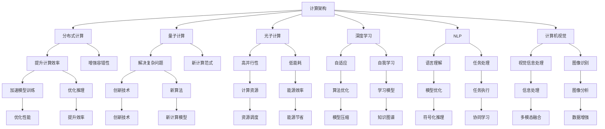

                 

# 推动科技进步的引擎：人类计算的创新力量

> 关键词：计算架构, 人工智能, 人类计算, 计算资源, 创新引擎

## 1. 背景介绍

### 1.1 问题由来

在现代科技的迅猛发展中，计算技术始终扮演着关键角色。从早期的机械计算到现代的电子计算机，每一次计算技术的突破都极大地推动了人类文明的进步。而今，随着人工智能（AI）技术的兴起，计算能力再次成为推动科技进步的重要引擎。

在AI领域，计算技术不仅应用于算法的优化和模型的训练，还通过大规模的数据处理和高效的数据存储，为深度学习、自然语言处理、计算机视觉等AI技术的创新提供了强大的支撑。尤其是近年来，随着计算技术的不断突破，AI技术在医疗、金融、教育、交通等多个领域的应用也日渐深入，极大地提升了工作效率和用户体验。

### 1.2 问题核心关键点

当前，AI技术的计算需求已经突破了传统计算架构的边界。无论是模型训练还是推理，都需要强大的计算资源支持，才能实现高效的性能和泛化能力。计算架构作为AI技术发展的核心基础，其设计和创新直接决定了AI技术的进步速度和应用广度。

为满足AI技术的计算需求，研究者们不断探索新的计算架构，如分布式计算、量子计算、光子计算等。这些前沿技术将为AI技术的持续创新注入新的活力。

## 2. 核心概念与联系

### 2.1 核心概念概述

为更好地理解计算架构如何推动AI技术创新，本节将介绍几个关键概念及其相互联系：

- **计算架构（Computational Architecture）**：计算架构是指计算机硬件和软件系统的设计原则和实现方式。它决定了计算机系统如何高效地进行数据处理和任务执行。
- **分布式计算（Distributed Computing）**：分布式计算是指将计算任务分解为多个子任务，分配给多台计算节点并行处理的技术。它极大地提高了计算效率和容错能力。
- **量子计算（Quantum Computing）**：量子计算利用量子力学的原理进行信息处理，能够处理传统计算难以解决的复杂问题，具有巨大的潜力。
- **光子计算（Photonics Computing）**：光子计算利用光子进行信息处理，具有高并行性和低能耗等优点，是下一代计算技术的重要方向。
- **深度学习（Deep Learning）**：深度学习是AI领域中的一种机器学习技术，通过多层次的神经网络模型进行数据处理和模式识别，具有自适应和自我学习的能力。
- **自然语言处理（NLP）**：自然语言处理是指计算机对人类语言进行处理和理解的技术，广泛应用于机器翻译、情感分析、问答系统等任务。
- **计算机视觉（Computer Vision）**：计算机视觉是指计算机对视觉信息进行处理和分析的技术，如物体识别、图像分割等。

这些概念之间通过计算架构紧密联系，共同构成了AI技术的核心框架。

### 2.2 核心概念原理和架构的 Mermaid 流程图(Mermaid 流程节点中不要有括号、逗号等特殊字符)



这个流程图展示了计算架构与AI技术的相互联系。

## 3. 核心算法原理 & 具体操作步骤

### 3.1 算法原理概述

在AI领域，计算架构对算法原理和具体操作步骤的影响主要体现在以下几个方面：

1. **计算资源分配**：计算架构通过合理分配计算资源，确保算法的高效执行。例如，分布式计算将任务分解为多个子任务，并行分配到多个计算节点上执行，从而显著提升计算效率。

2. **数据处理能力**：计算架构通过高效的数据存储和传输，提高数据处理速度。例如，分布式存储系统如Hadoop、Spark等，可以提供海量数据的快速访问和处理。

3. **模型优化**：计算架构通过硬件加速和优化算法，提升模型训练和推理的性能。例如，GPU、TPU等加速器可以显著提高深度学习模型的训练速度和推理效率。

4. **容错性和可扩展性**：计算架构通过分布式计算和容错机制，提高系统的可靠性和可扩展性。例如，分布式系统可以自动监控和调整计算资源，确保系统在高并发和故障情况下依然稳定运行。

### 3.2 算法步骤详解

在实际应用中，计算架构对AI算法的操作步骤有以下影响：

1. **数据预处理和加载**：在分布式计算架构中，数据预处理和加载可以通过分布式文件系统如Hadoop Distributed File System (HDFS)实现，使得数据并行加载和处理更加高效。

2. **模型训练**：在大规模深度学习模型训练中，计算架构可以通过分布式训练框架如TensorFlow、PyTorch等，实现模型的并行训练，从而加速模型收敛。

3. **模型推理**：在推理阶段，计算架构可以通过GPU、TPU等加速器进行并行计算，提升模型推理的速度和效率。

4. **模型优化和压缩**：计算架构通过硬件加速和软件优化，对模型进行量化、剪枝、压缩等操作，以降低模型大小和能耗，提升模型推理效率。

### 3.3 算法优缺点

计算架构对AI算法的影响既有优点也有缺点，具体如下：

**优点**：

- **计算效率提升**：分布式计算和硬件加速显著提升了计算效率，使得大规模数据处理和模型训练变得更加快速。
- **系统容错性增强**：通过分布式计算和冗余机制，系统能够自动应对计算节点的故障和数据丢失，增强了系统的鲁棒性和可靠性。
- **计算资源可扩展**：计算架构支持动态调整计算资源，可以轻松应对数据量和计算任务的变化，实现系统的灵活扩展。

**缺点**：

- **资源消耗高**：分布式计算和硬件加速需要大量计算资源，包括计算节点、存储设备、网络带宽等，带来了较高的资源消耗和成本。
- **系统复杂度高**：分布式计算和硬件加速的架构设计复杂，需要考虑数据分布、任务调度、故障恢复等问题，增加了系统的维护难度。
- **硬件依赖性强**：计算架构的性能依赖于硬件设备的性能，如CPU、GPU、TPU等，硬件更新换代频繁，增加了系统的维护成本和风险。

### 3.4 算法应用领域

计算架构在AI技术的多个领域中得到了广泛应用，具体如下：

- **深度学习**：分布式计算和硬件加速广泛应用于深度学习模型的训练和推理，如Google的TPU、Facebook的PyTorch Lightning等。
- **自然语言处理**：分布式计算和GPU加速被用于大规模NLP模型的训练和处理，如BERT、GPT等模型的分布式训练。
- **计算机视觉**：分布式计算和GPU加速被广泛应用于大规模图像处理和模型训练，如ImageNet大规模图像识别任务。
- **机器人技术**：分布式计算和实时处理能力被应用于机器人感知和决策，提升机器人的自主性和灵活性。
- **生物信息学**：分布式计算和GPU加速被用于大规模基因组分析和蛋白质折叠计算，加速科研进程。

## 4. 数学模型和公式 & 详细讲解 & 举例说明

### 4.1 数学模型构建

在AI领域，计算架构对数学模型构建的影响主要体现在以下几个方面：

1. **计算资源优化**：计算架构通过硬件加速和优化算法，提升计算效率和精度。例如，GPU加速器的并行计算能力使得深度学习模型在硬件上的计算速度大幅提升。

2. **分布式数据处理**：计算架构通过分布式数据处理框架，如Apache Spark、TensorFlow等，实现大规模数据的高效处理和分析。

3. **模型参数优化**：计算架构通过硬件加速和分布式训练，优化模型参数更新，加速模型收敛。

### 4.2 公式推导过程

在深度学习中，计算架构对公式推导过程的影响主要体现在以下几个方面：

1. **矩阵乘法加速**：GPU加速器利用矩阵乘法的高效硬件实现，加速深度学习模型中的矩阵乘法运算。例如，矩阵乘法公式：$C = AB$，通过并行计算加速，使得矩阵乘法运算速度大幅提升。

2. **分布式数据并行计算**：分布式计算框架通过数据并行计算，加速深度学习模型的训练过程。例如，分布式训练公式：$\frac{\partial \mathcal{L}}{\partial W} = \frac{1}{n}\sum_{i=1}^n \frac{\partial \mathcal{L}}{\partial \hat{y}_i} \frac{\partial \hat{y}_i}{\partial z} \frac{\partial z}{\partial W}$，其中 $W$ 为模型参数，$n$ 为数据批次大小，$\mathcal{L}$ 为损失函数，$\hat{y}_i$ 和 $z$ 为模型的预测值和中间变量。

3. **模型参数更新**：计算架构通过优化算法和硬件加速，更新模型参数。例如，SGD算法的公式：$\theta = \theta - \eta \nabla_{\theta}\mathcal{L}$，其中 $\eta$ 为学习率，$\nabla_{\theta}\mathcal{L}$ 为损失函数对模型参数的梯度。

### 4.3 案例分析与讲解

以TensorFlow为例，计算架构对深度学习模型的构建和训练过程的影响如下：

1. **模型构建**：TensorFlow提供了高效的分布式计算框架，使得深度学习模型的构建变得更加简单高效。例如，TensorFlow的分布式训练框架可以支持多台计算机并行计算，加速模型的训练过程。

2. **模型优化**：TensorFlow通过硬件加速和分布式训练，优化了深度学习模型的计算效率。例如，TensorFlow的分布式训练框架可以将模型分解为多个子模块，并行训练，显著提升模型训练速度。

3. **模型推理**：TensorFlow通过GPU加速器进行模型推理，大幅提升了推理速度和效率。例如，TensorFlow的推理框架可以在GPU上高效执行模型的前向传播，快速生成推理结果。

## 5. 项目实践：代码实例和详细解释说明

### 5.1 开发环境搭建

在进行AI项目实践前，我们需要准备好开发环境。以下是使用Python进行TensorFlow开发的环境配置流程：

1. 安装Anaconda：从官网下载并安装Anaconda，用于创建独立的Python环境。

2. 创建并激活虚拟环境：
```bash
conda create -n tf-env python=3.8 
conda activate tf-env
```

3. 安装TensorFlow：根据CUDA版本，从官网获取对应的安装命令。例如：
```bash
conda install tensorflow-gpu -c conda-forge
```

4. 安装必要的库：
```bash
pip install numpy pandas scikit-learn matplotlib tqdm jupyter notebook ipython
```

完成上述步骤后，即可在`tf-env`环境中开始AI项目开发。

### 5.2 源代码详细实现

下面我们以TensorFlow实现深度学习模型的项目为例，给出完整的代码实现。

```python
import tensorflow as tf
from tensorflow.keras import layers
from tensorflow.keras.datasets import mnist
from tensorflow.keras.utils import to_categorical

# 加载MNIST数据集
(x_train, y_train), (x_test, y_test) = mnist.load_data()

# 数据预处理
x_train = x_train / 255.0
x_test = x_test / 255.0
y_train = to_categorical(y_train)
y_test = to_categorical(y_test)

# 构建模型
model = tf.keras.Sequential([
    layers.Flatten(input_shape=(28, 28)),
    layers.Dense(128, activation='relu'),
    layers.Dense(10, activation='softmax')
])

# 编译模型
model.compile(optimizer='adam', loss='categorical_crossentropy', metrics=['accuracy'])

# 训练模型
model.fit(x_train, y_train, epochs=10, batch_size=32, validation_data=(x_test, y_test))

# 评估模型
model.evaluate(x_test, y_test)
```

### 5.3 代码解读与分析

让我们再详细解读一下关键代码的实现细节：

**数据预处理**：
```python
# 加载MNIST数据集
(x_train, y_train), (x_test, y_test) = mnist.load_data()

# 数据预处理
x_train = x_train / 255.0
x_test = x_test / 255.0
y_train = to_categorical(y_train)
y_test = to_categorical(y_test)
```

在TensorFlow中，数据预处理是构建深度学习模型的重要步骤。我们将数据集标准化，将像素值缩放到0到1之间，并将标签进行one-hot编码，使得模型能够处理和分类。

**模型构建**：
```python
# 构建模型
model = tf.keras.Sequential([
    layers.Flatten(input_shape=(28, 28)),
    layers.Dense(128, activation='relu'),
    layers.Dense(10, activation='softmax')
])
```

在TensorFlow中，我们可以使用Sequential模型构建深度学习模型。这个模型包括一个Flatten层，将二维的28x28图像展平成一维向量，接着是两个全连接层，第一个全连接层有128个神经元，使用ReLU激活函数，第二个全连接层有10个神经元，使用Softmax激活函数进行分类。

**模型编译和训练**：
```python
# 编译模型
model.compile(optimizer='adam', loss='categorical_crossentropy', metrics=['accuracy'])

# 训练模型
model.fit(x_train, y_train, epochs=10, batch_size=32, validation_data=(x_test, y_test))
```

在TensorFlow中，我们使用compile方法对模型进行编译，指定优化器、损失函数和评估指标。然后，我们使用fit方法对模型进行训练，指定训练集和验证集，以及训练轮数和批次大小。

**模型评估**：
```python
# 评估模型
model.evaluate(x_test, y_test)
```

在TensorFlow中，我们使用evaluate方法对模型进行评估，指定测试集。

## 6. 实际应用场景

### 6.1 医疗影像分析

在医疗领域，计算架构对影像分析的影响主要体现在以下几个方面：

1. **数据处理能力提升**：计算架构通过分布式计算和硬件加速，提升了医疗影像数据的处理速度和分析精度。例如，分布式计算框架可以处理大规模的影像数据集，提升影像处理的效率。

2. **模型训练加速**：计算架构通过分布式训练和硬件加速，加速了深度学习模型在医疗影像分类、分割等任务上的训练。例如，GPU加速器可以大幅提升深度学习模型的训练速度和精度。

3. **模型推理优化**：计算架构通过分布式推理和硬件加速，优化了医疗影像分析的推理过程。例如，GPU加速器可以提升模型的推理速度和准确性，支持实时的影像分析应用。

### 6.2 金融风险评估

在金融领域，计算架构对风险评估的影响主要体现在以下几个方面：

1. **数据处理能力提升**：计算架构通过分布式计算和硬件加速，提升了金融数据的处理速度和分析精度。例如，分布式计算框架可以处理大规模的金融数据集，提升风险评估的效率。

2. **模型训练加速**：计算架构通过分布式训练和硬件加速，加速了深度学习模型在金融风险预测、信用评估等任务上的训练。例如，GPU加速器可以大幅提升深度学习模型的训练速度和精度。

3. **模型推理优化**：计算架构通过分布式推理和硬件加速，优化了金融风险评估的推理过程。例如，GPU加速器可以提升模型的推理速度和准确性，支持实时的风险预测应用。

### 6.3 自动驾驶

在自动驾驶领域，计算架构对感知和决策的影响主要体现在以下几个方面：

1. **数据处理能力提升**：计算架构通过分布式计算和硬件加速，提升了传感器数据的处理速度和分析精度。例如，分布式计算框架可以处理大规模的传感器数据集，提升自动驾驶系统的感知能力。

2. **模型训练加速**：计算架构通过分布式训练和硬件加速，加速了深度学习模型在自动驾驶系统中的训练。例如，GPU加速器可以大幅提升深度学习模型的训练速度和精度。

3. **模型推理优化**：计算架构通过分布式推理和硬件加速，优化了自动驾驶系统的推理过程。例如，GPU加速器可以提升模型的推理速度和准确性，支持实时的自动驾驶决策。

## 7. 工具和资源推荐

### 7.1 学习资源推荐

为了帮助开发者系统掌握计算架构的理论基础和实践技巧，这里推荐一些优质的学习资源：

1. **《深入理解计算机系统》（第三版）**：详细介绍了计算机系统的底层原理和实现方式，是理解计算架构的重要参考资料。

2. **《深度学习入门：基于TensorFlow的理论与实现》**：通过实际案例讲解TensorFlow的使用方法和深度学习模型构建技巧。

3. **《分布式计算与大数据技术》**：讲解了分布式计算和数据处理的技术原理和实践方法，适合深度学习开发人员参考。

4. **Google TensorFlow官方文档**：提供了TensorFlow的详细使用说明和示例代码，是TensorFlow开发的必备资源。

5. **Apache Spark官方文档**：提供了Apache Spark的详细使用说明和示例代码，是分布式计算开发的重要参考资料。

通过这些资源的学习实践，相信你一定能够全面掌握计算架构的理论基础和实践技巧，为AI技术的开发和应用提供坚实的基础。

### 7.2 开发工具推荐

高效的开发离不开优秀的工具支持。以下是几款用于计算架构开发的常用工具：

1. **TensorFlow**：基于Python的开源深度学习框架，灵活动态的计算图，适合快速迭代研究。

2. **PyTorch**：基于Python的开源深度学习框架，灵活高效的动态图设计，适合科学研究和工业部署。

3. **Apache Spark**：分布式计算框架，支持大规模数据处理和分析，适合大数据应用的开发。

4. **Hadoop**：分布式文件系统和计算框架，支持海量数据的分布式存储和处理。

5. **Dask**：分布式任务调度框架，支持大数据和高性能计算任务的并行处理。

6. **Google Cloud Platform (GCP)**：提供强大的云服务支持，包括计算、存储、网络等资源，适合云环境下的大规模计算应用。

合理利用这些工具，可以显著提升计算架构的开发效率，加快创新迭代的步伐。

### 7.3 相关论文推荐

计算架构的不断发展得益于学界的持续研究。以下是几篇奠基性的相关论文，推荐阅读：

1. **《分布式计算：从概念到实践》**：介绍了分布式计算的概念、技术和实践方法，是分布式计算的重要参考资料。

2. **《深度学习中的GPU加速》**：探讨了深度学习模型在GPU加速器上的应用，提高了模型训练和推理的效率。

3. **《光子计算：原理与技术》**：介绍了光子计算的基本原理和实现技术，展示了光子计算的潜力。

4. **《量子计算与深度学习》**：探讨了量子计算在深度学习中的应用，展示了量子计算对AI技术的推动作用。

这些论文代表了大规模计算架构的发展脉络，通过学习这些前沿成果，可以帮助研究者把握计算架构的最新进展，激发更多的创新灵感。

## 8. 总结：未来发展趋势与挑战

### 8.1 总结

本文对计算架构如何推动AI技术创新进行了全面系统的介绍。首先阐述了计算架构在AI技术中的重要性，明确了计算架构与AI技术之间的紧密联系。其次，从原理到实践，详细讲解了计算架构对AI算法的影响和操作步骤，给出了计算架构应用的具体实例。同时，本文还广泛探讨了计算架构在医疗、金融、自动驾驶等领域的实际应用场景，展示了计算架构的广泛应用前景。此外，本文精选了计算架构的各种学习资源，力求为开发者提供全方位的技术指引。

通过本文的系统梳理，可以看到，计算架构作为AI技术发展的核心基础，在模型训练、数据处理、推理优化等方面发挥了关键作用。正是依托强大的计算架构，AI技术才能够在各个领域实现突破和创新。未来，伴随计算技术的不断进步，AI技术的发展速度和应用广度必将进一步提升。

### 8.2 未来发展趋势

展望未来，计算架构在AI技术的发展中将呈现以下几个趋势：

1. **计算资源持续提升**：计算架构将不断提升计算资源，支持更大规模的模型训练和推理。例如，未来的分布式计算系统将支持更大规模的数据集和更高效的数据处理。

2. **计算效率不断优化**：计算架构将不断优化计算效率，提升模型的训练和推理速度。例如，未来的硬件加速器将支持更高效的矩阵运算和神经网络计算。

3. **计算架构更加灵活**：计算架构将更加灵活，支持多种计算模型和应用场景。例如，未来的计算架构将支持分布式计算、联邦学习、边缘计算等多种计算模式。

4. **计算架构更具普适性**：计算架构将更加普适，支持不同类型的计算任务和应用场景。例如，未来的计算架构将支持跨平台、跨设备的计算应用。

5. **计算架构更加可控**：计算架构将更加可控，支持更高的可靠性和安全性。例如，未来的计算架构将支持容错机制、安全加密等技术。

以上趋势凸显了计算架构作为AI技术发展的重要引擎，将继续引领AI技术的创新和应用。这些方向的探索发展，必将进一步提升AI技术的性能和应用范围，为人类智能的进步注入新的动力。

### 8.3 面临的挑战

尽管计算架构在AI技术的发展中发挥了重要作用，但在迈向更加智能化、普适化应用的过程中，它仍面临诸多挑战：

1. **资源消耗问题**：计算架构需要大量的计算资源，带来了高昂的成本和能源消耗。如何提升计算效率和降低资源消耗，仍是一个重要的挑战。

2. **系统复杂性问题**：计算架构的设计和实现复杂，需要考虑数据分布、任务调度、故障恢复等多个方面，增加了系统的维护难度。如何简化计算架构的设计和实现，提高系统的可靠性，仍是一个重要的挑战。

3. **硬件兼容性问题**：计算架构的性能依赖于硬件设备的性能，如CPU、GPU、TPU等，硬件更新换代频繁，增加了系统的维护成本和风险。如何设计通用的计算架构，支持多种硬件设备，仍是一个重要的挑战。

4. **计算一致性问题**：不同计算架构之间的一致性问题，如数据格式、计算模型、结果一致性等，仍是一个重要的挑战。如何设计统一的标准和接口，提高计算架构的可扩展性和互操作性，仍是一个重要的挑战。

5. **计算架构的伦理问题**：计算架构的使用带来了数据隐私、安全、公平性等问题，需要设计伦理导向的计算架构，确保计算过程的透明性和公平性，仍是一个重要的挑战。

正视计算架构面临的这些挑战，积极应对并寻求突破，将是大规模计算架构走向成熟的必由之路。相信随着学界和产业界的共同努力，这些挑战终将一一被克服，计算架构必将在构建智能系统方面发挥更大的作用。

### 8.4 研究展望

面对计算架构面临的种种挑战，未来的研究需要在以下几个方面寻求新的突破：

1. **计算架构的通用性**：设计通用化的计算架构，支持多种计算设备和应用场景，提高计算架构的可扩展性和互操作性。

2. **计算架构的可控性**：提升计算架构的可靠性和安全性，支持容错机制、安全加密等技术，提高计算架构的可控性和可信度。

3. **计算架构的优化**：优化计算架构的设计和实现，提升计算效率和降低资源消耗，支持更大规模的模型训练和推理。

4. **计算架构的伦理导向**：设计伦理导向的计算架构，确保计算过程的透明性和公平性，保护用户数据隐私和安全。

这些研究方向的探索，必将引领计算架构技术迈向更高的台阶，为AI技术的持续创新和应用提供坚实的支撑。面向未来，计算架构需要与其他人工智能技术进行更深入的融合，如知识表示、因果推理、强化学习等，多路径协同发力，共同推动智能系统的发展。

## 9. 附录：常见问题与解答

**Q1：如何选择合适的计算架构？**

A: 选择合适的计算架构需要考虑多个因素，包括任务类型、数据规模、硬件资源等。例如，对于大规模数据处理和分布式计算任务，可以选择Apache Spark、Hadoop等分布式计算框架。对于高精度和实时计算任务，可以选择GPU、TPU等硬件加速器。对于小型数据处理和单机计算任务，可以选择TensorFlow、PyTorch等深度学习框架。

**Q2：计算架构对模型训练有什么影响？**

A: 计算架构对模型训练的影响主要体现在以下几个方面：

1. **训练速度提升**：分布式计算和硬件加速器可以显著提升模型训练速度，使得大规模深度学习模型的训练更加高效。

2. **模型精度提升**：分布式计算和硬件加速器可以提高模型的训练精度，使得模型在复杂的任务上表现更好。

3. **计算资源优化**：分布式计算和硬件加速器可以优化计算资源的利用，减少资源消耗，降低计算成本。

**Q3：计算架构对推理速度有什么影响？**

A: 计算架构对推理速度的影响主要体现在以下几个方面：

1. **推理速度提升**：硬件加速器可以显著提升模型推理速度，使得深度学习模型的推理更加高效。

2. **模型推理优化**：分布式推理和硬件加速器可以优化推理过程，减少推理时间，提高模型推理的实时性。

3. **计算资源优化**：分布式推理和硬件加速器可以优化计算资源的利用，减少资源消耗，降低推理成本。

综上所述，计算架构通过分布式计算和硬件加速，显著提升了模型训练和推理的速度和效率，推动了AI技术的持续创新和应用。

**Q4：如何优化计算架构的设计和实现？**

A: 优化计算架构的设计和实现可以从以下几个方面入手：

1. **数据并行化**：将数据并行化处理，提高数据处理效率。例如，使用分布式文件系统如HDFS、Apache Spark等，实现大规模数据的高效处理。

2. **任务调度优化**：优化任务调度和资源分配，提高系统的吞吐量和响应速度。例如，使用Spark的资源管理器YARN、Kubernetes等，实现任务的高效调度和管理。

3. **硬件加速器优化**：选择高效硬件加速器，提升计算效率和降低资源消耗。例如，使用GPU、TPU等硬件加速器，加速深度学习模型的训练和推理。

4. **系统可靠性设计**：设计可靠的系统架构，支持容错机制、故障恢复等技术，提高系统的稳定性和可用性。例如，使用分布式系统如Hadoop、Spark等，支持自动故障恢复和容错机制。

5. **系统安全性设计**：设计安全可靠的系统架构，保护数据隐私和安全。例如，使用安全加密技术、访问控制等手段，保护系统的安全性和隐私性。

**Q5：计算架构在实际应用中需要注意哪些问题？**

A: 计算架构在实际应用中需要注意以下几个问题：

1. **数据处理能力**：计算架构需要处理大规模数据，需要考虑数据格式、数据传输等问题，确保数据处理的高效性和可靠性。

2. **计算资源优化**：计算架构需要优化计算资源利用，减少资源消耗，提高系统的性能和效率。

3. **系统可靠性设计**：计算架构需要设计可靠的系统架构，支持容错机制、故障恢复等技术，提高系统的稳定性和可用性。

4. **系统安全性设计**：计算架构需要设计安全可靠的系统架构，保护数据隐私和安全。

5. **系统可扩展性设计**：计算架构需要设计可扩展的系统架构，支持大规模数据和任务的扩展，提高系统的可扩展性和灵活性。

总之，计算架构作为AI技术发展的核心基础，需要全面考虑数据处理、计算资源、系统可靠性、安全性等多个方面，才能满足AI技术的需求，推动AI技术的持续创新和应用。

---

作者：禅与计算机程序设计艺术 / Zen and the Art of Computer Programming

