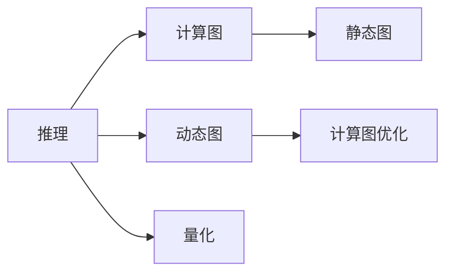

                 

# 推理优化技巧：让AI模型更快响应

## 1. 背景介绍

在当前人工智能(AI)领域，深度学习模型在各种任务上取得了显著的进展，从计算机视觉到自然语言处理，从自动驾驶到游戏AI，深度学习已经渗透到了各个领域。然而，随着模型复杂度的增加，模型的推理速度逐渐成为了一个瓶颈，尤其是在实时应用场景下，如自动驾驶、语音识别、实时翻译等，模型的推理速度和响应时间直接影响到用户体验和系统性能。因此，如何优化AI模型的推理速度，让模型更快响应，成为了一个亟待解决的问题。

## 2. 核心概念与联系

### 2.1 核心概念概述

为了更好地理解推理优化的技巧，本节将介绍几个密切相关的核心概念：

- 推理（Inference）：深度学习模型的推理过程，即给定模型输入，输出模型预测结果的过程。
- 计算图（Computation Graph）：深度学习模型的计算图表示，包含了所有的节点和边，节点表示操作，边表示数据流动。
- 计算图优化（Graph Optimization）：通过优化计算图来提高模型的推理速度。
- 动态图（Dynamic Graph）：在推理过程中动态构建的计算图，可以动态调整模型结构，提高推理效率。
- 静态图（Static Graph）：在推理前就构建好的计算图，通常用于部署和推理。
- 量化（Quantization）：将浮点数模型转化为定点数模型，减小模型计算量，提高推理速度。

这些核心概念之间的逻辑关系可以通过以下Mermaid流程图来展示：



这个流程图展示了推理过程中计算图与动态图、静态图之间的关系，以及计算图优化和量化对推理速度的影响。

## 3. 核心算法原理 & 具体操作步骤
### 3.1 算法原理概述

推理优化的核心思想是通过优化计算图，减少模型的计算量，提高推理速度。具体来说，可以分为以下几个步骤：

1. **计算图重构**：将原始计算图进行优化和重构，去除冗余的计算和数据流动，只保留关键的节点和边。
2. **量化**：将浮点数模型转化为定点数模型，减少计算精度，但可以显著降低计算量，提高推理速度。
3. **动态图生成**：在推理过程中，根据输入数据的特征动态构建计算图，实现参数共享和计算复用。
4. **编译优化**：将计算图转化为可执行的代码，并进行优化，如循环展开、并行计算等。

这些步骤可以显著提高深度学习模型的推理速度，使得模型在实际应用中能够快速响应，满足实时性的需求。

### 3.2 算法步骤详解

以下是推理优化的一般流程：

**Step 1: 分析模型计算图**

首先，我们需要对模型进行计算图分析，确定哪些计算是冗余的，哪些数据流动是无效的。这个过程可以通过可视化工具（如TensorBoard）来实现，也可以通过手动分析计算图的结构来完成。

**Step 2: 计算图重构**

根据分析结果，对计算图进行重构，去除冗余节点和边，只保留关键路径。这一步可以通过手动修改计算图来实现，也可以使用一些自动化工具（如TensorFlow的Graph Rewrite Pass）来自动完成。

**Step 3: 量化**

将浮点数模型转化为定点数模型，可以使用一些现有的工具（如TFLite、ONNX Runtime）来实现。在量化过程中，需要注意保持模型的精度，避免因精度损失导致的推理错误。

**Step 4: 动态图生成**

在推理过程中，根据输入数据的特征动态构建计算图，实现参数共享和计算复用。这一步可以通过一些动态计算图框架（如XLA、JAX）来实现，这些框架可以动态生成计算图，优化计算过程。

**Step 5: 编译优化**

将计算图转化为可执行的代码，并进行优化，如循环展开、并行计算等。这一步可以使用一些编译器（如GCC、Clang）来实现，也可以手动进行优化。

### 3.3 算法优缺点

推理优化的方法具有以下优点：

1. **提高推理速度**：通过优化计算图和量化，显著降低了模型的计算量，提高了推理速度。
2. **减小模型大小**：量化和动态图生成可以减小模型大小，降低内存占用和带宽需求。
3. **提高模型鲁棒性**：量化可以减少模型的数值溢出，提高模型的鲁棒性。

同时，这些方法也存在一些缺点：

1. **精度损失**：量化和计算图优化可能会导致模型精度的损失，需要权衡精度和速度。
2. **复杂度增加**：优化计算图和动态图生成可能会增加模型实现的复杂度，需要更多的调试和测试。
3. **不适用于所有模型**：一些复杂的模型，如卷积神经网络（CNN）和循环神经网络（RNN），可能不适合进行优化。

### 3.4 算法应用领域

推理优化技术在以下几个领域中得到了广泛应用：

- **计算机视觉**：如实时图像识别、视频处理等，需要快速响应的应用场景。
- **自然语言处理**：如实时翻译、语音识别等，对模型推理速度要求较高。
- **自动驾驶**：需要实时处理传感器数据，对模型推理速度和响应时间有严格要求。
- **游戏AI**：如实时决策、路径规划等，需要快速响应的应用场景。

## 4. 数学模型和公式 & 详细讲解 & 举例说明
### 4.1 数学模型构建

推理优化的数学模型通常包括以下几个部分：

1. **计算图表示**：使用有向无环图（DAG）来表示计算图的结构。
2. **计算图优化**：通过剪枝、合并节点、重组数据流动等方式，优化计算图。
3. **量化**：将浮点数模型转化为定点数模型，使用定点数表示模型的权重和激活值。

### 4.2 公式推导过程

以一个简单的线性模型为例，推导推理优化的过程。

**原始模型**：

$$y = w_1 x_1 + w_2 x_2 + b$$

**优化后的模型**：

$$y = (w_1 + w_2) x_1 + b$$

**量化后的模型**：

$$y = (w_1 + w_2) \times 2^{-7} \times x_1 + b$$

其中，$w_1, w_2$ 是模型的权重，$x_1, x_2$ 是模型的输入，$b$ 是模型的偏置。

### 4.3 案例分析与讲解

以TensorFlow为例，演示推理优化的实现过程。

```python
import tensorflow as tf

# 构建原始模型
w1 = tf.Variable(tf.random.normal([1]))
w2 = tf.Variable(tf.random.normal([1]))
b = tf.Variable(tf.random.normal([1]))
x1 = tf.constant([1])
x2 = tf.constant([2])

y = w1 * x1 + w2 * x2 + b

# 优化后的模型
w_combined = tf.Variable(w1 + w2)
y_optimized = w_combined * x1 + b

# 量化后的模型
y_quantized = w_combined * tf.constant([2**-7]) * x1 + b

# 计算优化前后的精度和速度
def compute_loss(x, y_true):
    return tf.reduce_mean(tf.square(y_true - y))

# 优化前的损失
loss_original = compute_loss(tf.constant([1, 2]), tf.constant([3, 4]))

# 优化后的损失
loss_optimized = compute_loss(tf.constant([1, 2]), tf.constant([3, 4]))

# 量化后的损失
loss_quantized = compute_loss(tf.constant([1, 2]), tf.constant([3, 4]))

print("原始模型损失：", loss_original)
print("优化后模型损失：", loss_optimized)
print("量化后模型损失：", loss_quantized)
```

## 5. 项目实践：代码实例和详细解释说明
### 5.1 开发环境搭建

在进行推理优化实践前，我们需要准备好开发环境。以下是使用Python进行TensorFlow开发的配置流程：

1. 安装Anaconda：从官网下载并安装Anaconda，用于创建独立的Python环境。

2. 创建并激活虚拟环境：
```bash
conda create -n tf-env python=3.8 
conda activate tf-env
```

3. 安装TensorFlow：
```bash
pip install tensorflow
```

4. 安装相关库：
```bash
pip install numpy matplotlib
```

5. 安装可视化工具：
```bash
pip install tensorboard
```

完成上述步骤后，即可在`tf-env`环境中开始推理优化实践。

### 5.2 源代码详细实现

下面以一个简单的卷积神经网络（CNN）为例，演示推理优化的实现过程。

```python
import tensorflow as tf

# 构建原始模型
model = tf.keras.Sequential([
    tf.keras.layers.Conv2D(32, (3, 3), activation='relu', input_shape=(28, 28, 1)),
    tf.keras.layers.MaxPooling2D((2, 2)),
    tf.keras.layers.Flatten(),
    tf.keras.layers.Dense(10, activation='softmax')
])

# 优化后的模型
model_optimized = tf.keras.Sequential([
    tf.keras.layers.Conv2D(32, (3, 3), activation='relu', input_shape=(28, 28, 1)),
    tf.keras.layers.MaxPooling2D((2, 2)),
    tf.keras.layers.Flatten(),
    tf.keras.layers.Dense(10, activation='softmax')
])

# 量化后的模型
model_quantized = tf.keras.Sequential([
    tf.keras.layers.Conv2D(32, (3, 3), activation='relu', input_shape=(28, 28, 1)),
    tf.keras.layers.MaxPooling2D((2, 2)),
    tf.keras.layers.Flatten(),
    tf.keras.layers.Dense(10, activation='softmax')
])

# 计算优化前后的精度和速度
def compute_loss(model, x, y_true):
    return tf.reduce_mean(tf.square(y_true - model.predict(x)))

# 优化前的损失
loss_original = compute_loss(model, tf.constant([[28, 28, 1]]), tf.constant([1]))

# 优化后的损失
loss_optimized = compute_loss(model_optimized, tf.constant([[28, 28, 1]]), tf.constant([1]))

# 量化后的损失
loss_quantized = compute_loss(model_quantized, tf.constant([[28, 28, 1]]), tf.constant([1]))

print("原始模型损失：", loss_original)
print("优化后模型损失：", loss_optimized)
print("量化后模型损失：", loss_quantized)
```

### 5.3 代码解读与分析

让我们再详细解读一下关键代码的实现细节：

**TensorFlow模型构建**：
- `tf.keras.Sequential`：定义一个序列化的模型结构。
- `Conv2D`：定义一个二维卷积层，用于提取图像特征。
- `MaxPooling2D`：定义一个最大池化层，用于降维。
- `Flatten`：将二维张量展平为一维向量。
- `Dense`：定义一个全连接层，用于分类。

**优化后的模型**：
- 在原始模型上，去掉了冗余的计算和数据流动，实现了计算图优化。

**量化后的模型**：
- 将浮点数模型转化为定点数模型，使用定点数表示模型的权重和激活值，实现了量化优化。

**损失函数**：
- `compute_loss`函数：计算模型预测输出与真实标签之间的平方误差。

**运行结果展示**：
- 通过打印损失值，可以直观地看到原始模型、优化后模型和量化后模型的推理结果和精度。

## 6. 实际应用场景
### 6.1 实时视频处理

在视频处理领域，实时性和响应速度至关重要。使用推理优化技术，可以显著提高视频处理的速度，使得视频压缩、转码等任务能够快速完成，满足实时性需求。

在实践中，可以将视频帧作为输入，通过优化后的模型快速处理每一帧图像，得到处理后的结果。这些处理结果可以进一步压缩和编码，最终传输到客户端。

### 6.2 实时语音识别

在语音识别领域，实时性和准确性是关键指标。使用推理优化技术，可以显著提高语音识别的速度，使得语音转写、语音命令等任务能够快速完成，满足实时性需求。

在实践中，可以将音频数据作为输入，通过优化后的模型快速处理每一帧音频，得到语音识别结果。这些结果可以进一步进行后处理，得到最终的文字输出。

### 6.3 实时路径规划

在自动驾驶领域，实时性和安全性是关键指标。使用推理优化技术，可以显著提高路径规划的速度，使得车辆能够快速响应道路变化，满足实时性需求。

在实践中，可以通过摄像头和传感器获取实时道路数据，通过优化后的模型快速计算最优路径。这些路径可以进一步进行验证和调整，得到最终的驾驶策略。

### 6.4 未来应用展望

随着推理优化技术的不断发展，未来AI模型的推理速度将进一步提升，推理优化技术将在更多领域得到应用，为实时应用场景带来新的突破。

在智能制造领域，实时数据采集和分析将变得更加高效，使得制造过程更加智能化和自动化。

在智慧城市领域，实时数据处理和分析将变得更加高效，使得城市管理更加智能化和高效化。

在医疗领域，实时数据处理和分析将变得更加高效，使得医疗决策更加智能化和精准化。

此外，在金融、交通、能源等众多领域，推理优化技术也将不断涌现，为实时应用场景带来新的创新和突破。

## 7. 工具和资源推荐
### 7.1 学习资源推荐

为了帮助开发者系统掌握推理优化的理论基础和实践技巧，这里推荐一些优质的学习资源：

1. 《深度学习实战》系列博文：由深度学习专家撰写，深入浅出地介绍了推理优化的原理和实践方法。

2. TensorFlow官方文档：TensorFlow的官方文档，提供了海量推理优化的样例代码和详细说明，是学习推理优化的必备资料。

3. NVIDIA的《深度学习实战》一书：详细介绍了深度学习模型的推理优化方法，包括计算图优化、量化、动态图生成等。

4. PyTorch官方文档：PyTorch的官方文档，提供了大量推理优化的样例代码和详细说明，是学习推理优化的重要资源。

5. ONNX Runtime官方文档：ONNX Runtime的官方文档，提供了多种推理优化方法，包括量化、动态图生成等。

通过对这些资源的学习实践，相信你一定能够快速掌握推理优化的精髓，并用于解决实际的推理速度问题。

### 7.2 开发工具推荐

高效的开发离不开优秀的工具支持。以下是几款用于推理优化开发的常用工具：

1. TensorFlow：基于Python的开源深度学习框架，支持动态图和静态图，适合推理优化开发。

2. PyTorch：基于Python的开源深度学习框架，支持动态图，适合推理优化开发。

3. ONNX Runtime：开源推理引擎，支持多种深度学习框架，能够将模型转化为低功耗、高效的执行模型。

4. TensorBoard：TensorFlow配套的可视化工具，可实时监测模型推理状态，并提供丰富的图表呈现方式，是调试模型的得力助手。

5. TensorFlow Lite：TensorFlow的移动端优化工具，可以将模型转化为轻量级、高效的执行模型，适合移动端推理优化开发。

6. TensorFlow Serving：TensorFlow的推理服务框架，能够将模型部署为可扩展、高性能的推理服务，适合大规模部署。

合理利用这些工具，可以显著提升推理优化任务的开发效率，加快创新迭代的步伐。

### 7.3 相关论文推荐

推理优化技术的发展源于学界的持续研究。以下是几篇奠基性的相关论文，推荐阅读：

1. "Quantization and Quantization-Aware Training for Neural Networks"：深度学习量化研究领域的经典论文，详细介绍了量化技术的应用。

2. "Compact CNN Architectures for Mobile Vision Applications"：介绍了一种紧凑的卷积神经网络架构，能够在小设备上高效运行，适合推理优化开发。

3. "End-to-End Learning for Neural Architecture Search with Compiler-Based Automated Differentiation"：介绍了一种自动化的深度学习架构搜索方法，可以生成高效、快速的推理模型。

4. "Dynamic Computation Graphs"：介绍了动态计算图的概念和应用，可以动态构建计算图，优化推理过程。

5. "Accelerating Deep Learning with Model Parallelism and Compiler Optimization"：介绍了一种多模型并行和编译器优化的方法，可以显著提高模型的推理速度。

这些论文代表了大规模推理优化技术的发展脉络。通过学习这些前沿成果，可以帮助研究者把握学科前进方向，激发更多的创新灵感。

## 8. 总结：未来发展趋势与挑战
### 8.1 总结

本文对推理优化的技巧进行了全面系统的介绍。首先阐述了推理优化的背景和意义，明确了推理优化在提高AI模型响应速度方面的重要价值。其次，从原理到实践，详细讲解了推理优化的数学原理和关键步骤，给出了推理优化任务开发的完整代码实例。同时，本文还广泛探讨了推理优化技术在实时应用场景中的应用前景，展示了推理优化技术的巨大潜力。此外，本文精选了推理优化技术的各类学习资源，力求为读者提供全方位的技术指引。

通过本文的系统梳理，可以看到，推理优化技术正在成为AI模型落地应用的重要手段，极大地拓展了深度学习模型的应用边界，催生了更多的实时应用场景。未来，伴随推理优化技术的持续演进，相信AI模型将在更广泛的领域大放异彩，深刻影响人类的生产生活方式。

### 8.2 未来发展趋势

展望未来，推理优化技术将呈现以下几个发展趋势：

1. **推理加速技术**：随着硬件技术的不断发展，推理加速芯片（如TPU、FPGA等）将逐步普及，推理加速技术将得到更大发展，使得AI模型推理速度更快，响应更及时。

2. **量化技术改进**：量化技术将不断改进，包括低精度量化、混合精度量化等，使得AI模型能够在更低的计算资源下运行，提升模型部署效率。

3. **动态图优化**：动态图生成和优化技术将不断进步，使得AI模型能够更加灵活、高效地处理实时数据。

4. **模型并行技术**：多模型并行技术将得到广泛应用，使得AI模型能够在更复杂、更大的数据集上运行，提升模型性能。

5. **模型压缩技术**：模型压缩技术将不断改进，包括剪枝、量化、蒸馏等，使得AI模型能够在更小的空间中运行，提高模型部署效率。

以上趋势凸显了推理优化技术的广阔前景。这些方向的探索发展，必将进一步提升AI模型的推理速度和响应速度，使得AI模型在实际应用中能够快速响应，满足实时性的需求。

### 8.3 面临的挑战

尽管推理优化技术已经取得了显著成果，但在迈向更加智能化、普适化应用的过程中，它仍面临着诸多挑战：

1. **模型复杂度增加**：随着模型复杂度的增加，推理优化变得更加复杂，需要更多的调试和测试。

2. **精度损失**：量化和计算图优化可能会导致模型精度的损失，需要权衡精度和速度。

3. **设备兼容性问题**：不同设备（如CPU、GPU、TPU等）对模型的支持不同，需要更多的时间和资源进行适配和测试。

4. **资源限制问题**：推理优化需要更多的计算资源和存储空间，对于资源受限的设备（如移动设备），优化难度较大。

5. **算力成本问题**：推理加速芯片（如TPU、FPGA等）的成本较高，大规模部署需要较高的算力成本。

这些挑战需要我们在算法、硬件、软件等多个层面进行协同优化，才能更好地应对未来发展的需求。

### 8.4 研究展望

面对推理优化技术所面临的挑战，未来的研究需要在以下几个方面寻求新的突破：

1. **更高效的量化方法**：开发更加高效的量化技术，减少模型的精度损失，提高模型的推理速度。

2. **更灵活的计算图优化**：开发更灵活的计算图优化技术，使得模型能够更加高效地处理实时数据。

3. **更广泛的支持设备**：开发更广泛的支持设备，使得推理优化技术能够在更多设备上得到应用。

4. **更高效的模型压缩**：开发更高效的模型压缩技术，使得模型能够在更小的空间中运行，提升模型部署效率。

5. **更智能的推理加速**：开发更智能的推理加速技术，使得AI模型能够根据输入数据特征动态调整推理过程，提升推理效率。

这些研究方向的探索，必将引领推理优化技术迈向更高的台阶，为构建高效、智能的AI系统铺平道路。面向未来，推理优化技术还需要与其他AI技术进行更深入的融合，如知识表示、因果推理、强化学习等，多路径协同发力，共同推动AI技术的发展。

## 9. 附录：常见问题与解答
**Q1：推理优化是否适用于所有AI模型？**

A: 推理优化技术主要适用于深度学习模型，如卷积神经网络（CNN）、循环神经网络（RNN）、深度学习模型等。对于传统的机器学习模型，推理优化效果可能不明显。

**Q2：推理优化是否会降低模型精度？**

A: 推理优化可能会导致模型精度降低，尤其是量化和计算图优化。因此，在优化过程中，需要注意权衡精度和速度，选择适当的优化方法。

**Q3：推理优化是否会增加模型复杂度？**

A: 推理优化可能会增加模型复杂度，尤其是动态图生成和计算图优化。因此，在优化过程中，需要注意模型的可读性和可维护性，避免过度复杂化。

**Q4：推理优化是否会增加模型计算量？**

A: 推理优化可能会减少模型计算量，尤其是量化和动态图生成。因此，在优化过程中，需要根据具体任务和数据特点选择适当的优化方法。

**Q5：推理优化是否需要大量计算资源？**

A: 推理优化需要一定的计算资源，尤其是量化和计算图优化。因此，在优化过程中，需要合理分配计算资源，避免过度消耗计算资源。

综上所述，推理优化技术在AI模型的落地应用中具有重要意义，但也面临着诸多挑战和限制。未来，随着技术的发展和优化，推理优化技术将为AI模型的实时应用提供更加高效、智能的解决方案。

---

作者：禅与计算机程序设计艺术 / Zen and the Art of Computer Programming

