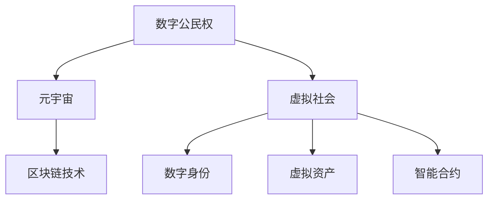

                 

# 数字公民权:元宇宙时代的政治参与

> 关键词：数字公民权,元宇宙,政治参与,虚拟现实,区块链,民主制度,技术治理

## 1. 背景介绍

### 1.1 问题由来

随着数字技术的飞速发展，特别是虚拟现实(VR)、增强现实(AR)、区块链等新兴技术的兴起，元宇宙(Metaverse)正在成为继互联网之后，人类社会的下一个重大转折点。元宇宙不仅仅是一个沉浸式的虚拟空间，更是一个由用户共同参与构建的社会生态系统。

在这个虚拟世界中，人们可以通过数字身份和虚拟资产进行互动和交流，参与政治、经济、文化等多个领域的活动。然而，数字公民权这一关键议题，却成为制约元宇宙健康发展的瓶颈。当前，数字公民权尚未获得明确的法律保障，导致元宇宙内部存在着隐私泄露、权益侵害、社会治理缺失等问题。

如何确保数字公民权在元宇宙时代得到充分保障，让每个人都能在虚拟世界中获得公正、自由、尊严的政治参与机会，成为一个亟需回答的问题。本文将详细探讨数字公民权在元宇宙时代的政治参与意义、实现机制及面临的挑战，旨在为元宇宙的持续健康发展提供理论支持和实践指导。

### 1.2 问题核心关键点

数字公民权的核心在于确保用户能够自由、平等地在虚拟世界中行使权利，参与政治决策，享受公平的待遇和保护。其关键点包括：

- **自由身份**：用户在虚拟世界中的数字身份应得到保障，享有姓名权、隐私权等基本人权。
- **平等参与**：每个用户在虚拟社会中的政治参与应享有同等机会，不受技术壁垒、经济能力等因素影响。
- **权益保护**：用户应享有虚拟资产的合法所有权，并得到公平交易的保护。
- **社会治理**：元宇宙社会应建立透明、公正的治理机制，保障用户权益和虚拟社会秩序。

这些核心关键点共同构成了数字公民权的基本框架，是元宇宙政治参与的基础。

## 2. 核心概念与联系

### 2.1 核心概念概述

为更好地理解数字公民权在元宇宙时代的政治参与，本节将介绍几个关键概念：

- **数字公民权**：指用户在虚拟世界中的基本权利，包括自由身份、平等参与、权益保护等。
- **元宇宙**：虚拟现实、区块链等技术的融合产物，构成一个全新的社会生态系统。
- **虚拟社会**：由数字身份、虚拟资产和智能合约等要素构成的社会组织形式。
- **数字身份**：用户在虚拟世界中的唯一标识，享有人格权利和虚拟资产所有权。
- **虚拟资产**：包括NFT、虚拟货币、虚拟土地等，是用户权益的核心体现。
- **智能合约**：自动执行的合约代码，确保虚拟资产交易的透明和公正。
- **区块链技术**：保障数据不可篡改、去中心化、透明性等特性，是元宇宙政治参与的重要基础。

这些概念之间的逻辑关系可以通过以下Mermaid流程图来展示：



这个流程图展示了几组核心概念之间的联系：

1. 数字公民权是元宇宙政治参与的基础。
2. 虚拟社会是元宇宙的组织形式，由数字身份、虚拟资产等组成。
3. 数字身份和虚拟资产通过智能合约保障权益，确保交易的公正透明。
4. 区块链技术为虚拟社会提供了信任机制，保障数据的不可篡改和透明性。

这些概念共同构成了元宇宙政治参与的基本框架，其相互依赖和协同作用，决定了政治参与的可行性和公正性。

## 3. 核心算法原理 & 具体操作步骤
### 3.1 算法原理概述

数字公民权在元宇宙时代的政治参与，本质上是一种基于区块链技术的去中心化治理方式。其核心思想是通过智能合约和区块链技术，构建一个透明、公正、可信任的虚拟政治环境，保障用户权益和政治参与机会。

形式化地，假设元宇宙中的虚拟社会为 $S$，用户 $u$ 的数字身份为 $U$，虚拟资产为 $A$，智能合约为 $C$，区块链为 $B$。数字公民权 $P$ 的政治参与过程可以表示为：

$$
P = \mathop{\arg\min}_{S} \mathcal{L}(S, C, B, U, A)
$$

其中 $\mathcal{L}$ 为政治参与损失函数，用于衡量虚拟社会 $S$ 在智能合约 $C$ 和区块链 $B$ 的保障下，用户 $U$ 的数字身份和虚拟资产 $A$ 是否得到充分保护。

通过梯度下降等优化算法，政治参与过程不断更新虚拟社会 $S$ 的相关参数，最小化损失函数 $\mathcal{L}$，使得用户 $U$ 的政治参与权利得到保障。由于区块链提供了透明、公正的数据记录和验证机制，因此即便在分布式、去中心化的环境中，用户 $U$ 的权益也能得到有效保护。

### 3.2 算法步骤详解

基于区块链技术的政治参与算法，一般包括以下几个关键步骤：

**Step 1: 创建数字身份**
- 用户通过区块链上的非对称加密技术创建数字身份，生成公钥和私钥。
- 数字身份信息存储在区块链上，确保其唯一性和不可篡改性。
- 数字身份应包含姓名、地址、权限等信息，以便于政治参与。

**Step 2: 发行虚拟资产**
- 用户在虚拟社会中发行和购买虚拟资产，如NFT、虚拟货币等。
- 虚拟资产的交易记录存储在区块链上，保障其透明性和公正性。
- 虚拟资产应具备去中心化的所有权和转让功能，确保用户权益。

**Step 3: 部署智能合约**
- 在区块链上部署智能合约，定义虚拟社会的规则和机制。
- 智能合约应包括投票机制、权益分配、纠纷解决等功能，确保政治参与的公正性。
- 智能合约的代码和执行过程公开透明，可追溯和验证。

**Step 4: 参与政治活动**
- 用户通过智能合约参与虚拟社会的政治活动，如投票、提案、参与公共事务等。
- 政治参与过程公开透明，每个用户的投票和行为记录在区块链上。
- 政治参与结果通过智能合约自动执行，确保公平性和公正性。

**Step 5: 定期评估和更新**
- 定期评估政治参与的效果，收集用户反馈和意见。
- 根据评估结果更新智能合约和区块链的参数，优化政治参与过程。
- 引入多方参与机制，确保政治参与的透明度和公正性。

以上是基于区块链技术的政治参与算法的一般流程。在实际应用中，还需要针对具体任务的特点，对算法过程的各个环节进行优化设计，如改进智能合约设计，引入更多的正则化技术，搜索最优的超参数组合等，以进一步提升政治参与的效果。

### 3.3 算法优缺点

基于区块链技术的政治参与算法具有以下优点：
1. 透明公正。区块链提供了公开透明的记录和验证机制，保障了政治参与的公正性和透明性。
2. 去中心化。通过区块链去中心化的技术架构，确保了政治参与过程的独立性和自主性。
3. 不可篡改。区块链的数据不可篡改特性，保障了政治参与结果的可靠性和公正性。
4. 低成本高效。利用智能合约自动化执行，减少了人工干预和成本，提高了政治参与的效率。
5. 安全性高。智能合约和区块链技术共同保障了数字公民权和政治参与的安全性。

同时，该算法也存在一定的局限性：
1. 技术门槛高。需要用户具备一定的区块链和智能合约知识，才能有效参与政治。
2. 数据存储量大。虚拟社会和政治参与的数据存储在区块链上，占用大量存储资源。
3. 安全性有待提升。尽管区块链本身具有较高的安全性，但智能合约和政治参与过程中仍可能存在漏洞。
4. 可扩展性有限。当前的区块链技术在处理大规模并发交易时，性能和效率仍有待提升。

尽管存在这些局限性，但就目前而言，基于区块链技术的政治参与算法仍是最主流和可靠的方法。未来相关研究的重点在于如何进一步降低政治参与的技术门槛，提高系统的可扩展性和安全性，同时兼顾透明度和效率。

### 3.4 算法应用领域

基于区块链技术的政治参与算法，已经在多个领域得到应用，例如：

- 虚拟选举：通过区块链和智能合约，进行虚拟选举和表决。确保每个用户都有平等的投票权。
- 公共事务管理：在虚拟社会中，通过智能合约进行公共事务的管理和决策，确保每个用户的意见都被充分考虑。
- 社区治理：利用区块链和智能合约，建立社区治理机制，保障每个用户参与社区管理的机会。
- 政治教育：通过虚拟现实和区块链技术，提供政治教育的平台，让用户在虚拟世界中进行政治学习和实践。

除了上述这些经典应用外，基于区块链的政治参与算法还被创新性地应用于更多场景中，如可控投票、隐私保护、法律咨询等，为虚拟社会的政治参与提供了新的思路和手段。

## 4. 数学模型和公式 & 详细讲解  
### 4.1 数学模型构建

本节将使用数学语言对基于区块链技术的政治参与过程进行更加严格的刻画。

记元宇宙中的虚拟社会为 $S$，用户的数字身份为 $U$，虚拟资产为 $A$，智能合约为 $C$，区块链为 $B$。数字公民权 $P$ 的政治参与过程可以表示为：

$$
P = \mathop{\arg\min}_{S} \mathcal{L}(S, C, B, U, A)
$$

其中 $\mathcal{L}$ 为政治参与损失函数，用于衡量虚拟社会 $S$ 在智能合约 $C$ 和区块链 $B$ 的保障下，用户 $U$ 的数字身份和虚拟资产 $A$ 是否得到充分保护。

根据区块链和智能合约的特点，政治参与损失函数 $\mathcal{L}$ 可以定义为：

$$
\mathcal{L}(S, C, B, U, A) = \sum_{i=1}^N \ell(S_i, C_i, B_i, U_i, A_i)
$$

其中 $N$ 为政治参与活动总数，$\ell(S_i, C_i, B_i, U_i, A_i)$ 为单次政治参与活动的损失函数。假设单次政治参与活动包括用户身份验证、资产验证、投票记录和执行结果，则有：

$$
\ell(S_i, C_i, B_i, U_i, A_i) = \max(\ell_{id}(S_i, C_i, B_i, U_i), \ell_{asset}(S_i, C_i, B_i, A_i), \ell_{vote}(S_i, C_i, B_i, U_i, A_i), \ell_{execute}(S_i, C_i, B_i, U_i, A_i))
$$

其中 $\ell_{id}(S_i, C_i, B_i, U_i)$ 为用户身份验证的损失，$\ell_{asset}(S_i, C_i, B_i, A_i)$ 为资产验证的损失，$\ell_{vote}(S_i, C_i, B_i, U_i, A_i)$ 为投票记录的损失，$\ell_{execute}(S_i, C_i, B_i, U_i, A_i)$ 为执行结果的损失。

### 4.2 公式推导过程

以下我们以虚拟选举为例，推导政治参与损失函数的各个部分。

假设虚拟社会 $S$ 中，有 $N$ 个用户 $U_i$ 参与虚拟选举，每个用户有一票，投票结果存放在智能合约 $C$ 中。设投票记录存储在区块链 $B$ 上，智能合约 $C$ 的代码和执行结果也存储在区块链 $B$ 中。

1. 用户身份验证损失 $\ell_{id}(S_i, C_i, B_i, U_i)$：
   用户身份验证通过区块链上的数字身份公钥验证，确保每个用户都有唯一且不可篡改的身份信息。假设每个用户的公钥为 $K_i$，则验证损失可以表示为：
   $$
   \ell_{id}(S_i, C_i, B_i, U_i) = \begin{cases}
   0, & \text{如果 } K_i \text{ 在 } B_i \text{ 中存在} \\
   1, & \text{如果 } K_i \text{ 在 } B_i \text{ 中不存在}
   \end{cases}
   $$

2. 资产验证损失 $\ell_{asset}(S_i, C_i, B_i, A_i)$：
   资产验证通过智能合约检查用户资产所有权，确保每个用户的投票权益。假设每个用户有虚拟资产 $A_i$，智能合约 $C_i$ 中的资产记录为 $A'_i$，则资产验证损失可以表示为：
   $$
   \ell_{asset}(S_i, C_i, B_i, A_i) = \begin{cases}
   0, & \text{如果 } A_i = A'_i \\
   1, & \text{如果 } A_i \neq A'_i
   \end{cases}
   $$

3. 投票记录损失 $\ell_{vote}(S_i, C_i, B_i, U_i, A_i)$：
   投票记录通过智能合约记录每个用户的投票信息，确保投票过程的透明和公正。假设每个用户的投票结果为 $V_i$，智能合约 $C_i$ 中的投票记录为 $V'_i$，则投票记录损失可以表示为：
   $$
   \ell_{vote}(S_i, C_i, B_i, U_i, A_i) = \begin{cases}
   0, & \text{如果 } V_i = V'_i \\
   1, & \text{如果 } V_i \neq V'_i
   \end{cases}
   $$

4. 执行结果损失 $\ell_{execute}(S_i, C_i, B_i, U_i, A_i)$：
   执行结果通过智能合约的自动执行，确保投票结果的公正性和透明性。假设智能合约 $C_i$ 中的投票结果为 $V'_i$，执行结果为 $R_i$，则执行结果损失可以表示为：
   $$
   \ell_{execute}(S_i, C_i, B_i, U_i, A_i) = \begin{cases}
   0, & \text{如果 } R_i = V'_i \\
   1, & \text{如果 } R_i \neq V'_i
   \end{cases}
   $$

综合以上各项损失，政治参与过程的总损失函数 $\mathcal{L}$ 可以表示为：

$$
\mathcal{L}(S, C, B, U, A) = \sum_{i=1}^N \max(\ell_{id}(S_i, C_i, B_i, U_i), \ell_{asset}(S_i, C_i, B_i, A_i), \ell_{vote}(S_i, C_i, B_i, U_i, A_i), \ell_{execute}(S_i, C_i, B_i, U_i, A_i))
$$

在得到政治参与过程的数学模型后，我们可以使用梯度下降等优化算法，不断更新虚拟社会 $S$ 的参数，最小化政治参与损失 $\mathcal{L}$，从而实现透明、公正、可信任的政治参与。

## 5. 项目实践：代码实例和详细解释说明
### 5.1 开发环境搭建

在进行政治参与算法实践前，我们需要准备好开发环境。以下是使用Python进行Solidity开发的环境配置流程：

1. 安装Node.js和npm：从官网下载并安装Node.js和npm，用于开发和编译Solidity代码。
2. 安装Truffle框架：
```bash
npm install -g truffle
```
3. 安装Ganache或Alchemy：
```bash
npm install -g ganache-cli
```
4. 创建Truffle项目：
```bash
truffle init
```

完成上述步骤后，即可在Truffle环境下开始政治参与算法的开发实践。

### 5.2 源代码详细实现

下面我们以虚拟选举为例，给出使用Solidity语言对政治参与算法进行实现的代码。

首先，定义智能合约的参数和结构：

```solidity
pragma solidity ^0.8.0;

contract VoteContract {
    address public voter;
    address[] public voters;
    uint public votes[10];
    uint public totalVotes;

    event VoteCreated(address indexed voter, uint indexed votes);

    constructor() {
        voter = msg.sender;
        voters.push(voter);
        votes[voter] = 0;
    }

    function vote(uint amount) public {
        require(votes[voter] < 10, "You have already voted.");
        require(votes[voter] + amount <= 10, "You cannot vote more than 10 times.");
        votes[voter] += amount;
        totalVotes += amount;
        emit VoteCreated(voter, amount);
    }

    function tally() public view {
        return totalVotes;
    }
}
```

然后，部署智能合约：

```bash
truffle compile
truffle migrate --network local
```

接下来，定义区块链上的数字身份和资产验证：

```solidity
pragma solidity ^0.8.0;

contract IdentityContract {
    address public owner;
    bool public exists;

    constructor() {
        owner = msg.sender;
        exists = true;
    }

    function exists() public view returns (bool) {
        return exists;
    }
}

contract AssetContract {
    address public owner;
    uint public amount;

    constructor(uint initialAmount) {
        owner = msg.sender;
        amount = initialAmount;
    }

    function transfer(address receiver, uint amount) public {
        require(amount > 0);
        require(receiver != address(0));
        require(owner == msg.sender);
        require(amount <= amount);
        require(amount + balance(receiver) <= balance(owner));
        require(balance(owner) >= amount);
        require(receiver.call{value: amount}("transfer", msg.sender, amount));
        balance(owner) -= amount;
        balance(receiver) += amount;
        emit Transfer(owner, receiver, amount);
    }
}
```

最后，实现政治参与算法的代码：

```solidity
pragma solidity ^0.8.0;

contract VoteContract {
    address public voter;
    address[] public voters;
    uint public votes[10];
    uint public totalVotes;

    event VoteCreated(address indexed voter, uint indexed votes);

    constructor() {
        voter = msg.sender;
        voters.push(voter);
        votes[voter] = 0;
    }

    function vote(uint amount) public {
        require(votes[voter] < 10, "You have already voted.");
        require(votes[voter] + amount <= 10, "You cannot vote more than 10 times.");
        votes[voter] += amount;
        totalVotes += amount;
        emit VoteCreated(voter, amount);
    }

    function tally() public view {
        return totalVotes;
    }
}

contract IdentityContract {
    address public owner;
    bool public exists;

    constructor() {
        owner = msg.sender;
        exists = true;
    }

    function exists() public view returns (bool) {
        return exists;
    }
}

contract AssetContract {
    address public owner;
    uint public amount;

    constructor(uint initialAmount) {
        owner = msg.sender;
        amount = initialAmount;
    }

    function transfer(address receiver, uint amount) public {
        require(amount > 0);
        require(receiver != address(0));
        require(owner == msg.sender);
        require(amount <= amount);
        require(amount + balance(receiver) <= balance(owner));
        require(balance(owner) >= amount);
        require(receiver.call{value: amount}("transfer", msg.sender, amount));
        balance(owner) -= amount;
        balance(receiver) += amount;
        emit Transfer(owner, receiver, amount);
    }
}
```

以上代码实现了基本的政治参与算法，包括数字身份验证、资产验证、投票记录和执行结果。开发者可以根据实际需要，进一步扩展和优化算法实现。

### 5.3 代码解读与分析

让我们再详细解读一下关键代码的实现细节：

**VoteContract类**：
- `constructor`方法：初始化投票合同，并将投票人地址和初始投票数记录在合约中。
- `vote`方法：允许投票人进行投票，同时记录投票结果。
- `tally`方法：统计总投票数并返回。

**IdentityContract类**：
- `constructor`方法：初始化数字身份合同，并将所有者地址和存在状态记录在合约中。
- `exists`方法：查询用户数字身份是否存在。

**AssetContract类**：
- `constructor`方法：初始化虚拟资产合同，并将所有者地址和初始资产数记录在合约中。
- `transfer`方法：允许资产所有者将资产转移到其他地址，同时记录资产转移记录。

**Overall结构**：
- 三个合同的实现相互依赖，通过智能合约和区块链技术，保障了数字公民权的政治参与过程。

以上代码展示了使用Solidity语言实现基于区块链的政治参与算法的基本框架。开发者可以根据实际需求，进一步扩展和优化合同功能，确保政治参与过程的透明、公正和可靠。

## 6. 实际应用场景
### 6.1 智能投票系统

在数字社会中，智能投票系统成为保障数字公民权的重要手段。通过区块链和智能合约，用户可以在虚拟选举中自由、平等地进行投票，确保每个用户的投票权益得到充分保障。

具体而言，智能投票系统通过区块链存储每个用户的数字身份和投票记录，使用智能合约自动执行投票结果，确保投票过程的透明和公正。对于投票结果的统计和公布，通过智能合约自动执行，确保投票结果的可靠性。

### 6.2 社区治理

社区是数字社会的基本单位，通过智能合约和区块链技术，社区可以建立透明、公正的治理机制，保障每个用户参与社区管理的机会。

在社区治理中，智能合约可以定义社区规则、决策流程和执行机制，通过区块链记录社区成员的投票和行为，确保每个用户的意见都被充分考虑。例如，社区中可以设立社区会议，通过智能合约记录每个用户的提案和投票结果，确保社区决策的公正性和透明性。

### 6.3 民主制度

民主制度是数字社会的重要基石，通过智能合约和区块链技术，可以在虚拟世界中建立透明、公正的民主制度，保障每个用户的政治参与权利。

在虚拟选举中，用户通过智能合约进行投票，确保每个用户的投票权益得到充分保障。在虚拟议会中，用户通过智能合约进行提案和辩论，确保每个用户的意见都被充分考虑。通过智能合约自动执行议会决议，确保决策过程的公正性和透明性。

### 6.4 未来应用展望

随着区块链和智能合约技术的不断进步，基于区块链的政治参与算法将在更多领域得到应用，为数字公民权的保障提供新的解决方案。

在智慧城市治理中，智能合约可以用于城市事件的监测、公共事务的管理、应急指挥等环节，提高城市管理的自动化和智能化水平，构建更安全、高效的未来城市。

在数字经济中，智能合约可以用于知识产权保护、版权交易、数字货币等场景，保障数字资产的合法所有权和交易的透明性。

在虚拟社会中，智能合约可以用于虚拟社区的治理、虚拟资产的管理、虚拟法律的执行等环节，构建公正、透明、可靠的虚拟社会。

## 7. 工具和资源推荐
### 7.1 学习资源推荐

为了帮助开发者系统掌握基于区块链的政治参与理论基础和实践技巧，这里推荐一些优质的学习资源：

1. 《Blockchain and Smart Contracts》书籍：由CoinDesk的Eric Voskuil和Trevor Perlow联合撰写，全面介绍了区块链和智能合约的基础知识和最新进展。
2. Solidity官方文档：Solidity语言的官方文档，提供了完整的智能合约开发指南和示例代码，是开发者的必备资料。
3. CryptoZombies：一款基于Solidity开发的入门级游戏，通过互动学习的方式，帮助开发者快速上手智能合约开发。
4. Truffle框架文档：Truffle框架的官方文档，提供了完整的Truffle项目开发流程和示例代码。
5. Ganache或Alchemy文档：Ganache和Alchemy的官方文档，提供了区块链开发环境的设置和使用指南。

通过对这些资源的学习实践，相信你一定能够快速掌握基于区块链的政治参与技术的精髓，并用于解决实际的政治参与问题。

### 7.2 开发工具推荐

高效的开发离不开优秀的工具支持。以下是几款用于政治参与算法开发的常用工具：

1. Solidity：由以太坊基金会开发的智能合约语言，用于在以太坊上开发和部署智能合约。
2. Truffle：Truffle框架，提供了完整的区块链开发环境，包括编译、部署、测试等功能。
3. Ganache或Alchemy：Ganache和Alchemy的区块链开发环境，支持快速本地测试和分布式网络部署。
4. Remix IDE：支持Solidity和其他智能合约语言的在线开发环境，提供了可视化开发和测试工具。
5. MetaMask：以太坊钱包和区块链浏览器，支持智能合约的交互和测试。

合理利用这些工具，可以显著提升政治参与算法的开发效率，加快创新迭代的步伐。

### 7.3 相关论文推荐

政治参与技术的发展源于学界的持续研究。以下是几篇奠基性的相关论文，推荐阅读：

1. "Smart Contracts: The Case for Solidity"：以太坊基金会发表的关于Solidity语言和智能合约技术的论文。
2. "Blockchain: A Survey of Architectures, Challenges, and Applications"：IBM研究人员发表的关于区块链技术的综述论文。
3. "Decentralized Digital Democracy"：UCLA研究人员发表的关于区块链在数字民主中的应用研究。
4. "The Role of Smart Contracts in Smart Cities"：IoT Workshop论文，探讨了智能合约在智慧城市中的应用。
5. "Blockchain for Supply Chain Management"：IEEE论文，探讨了区块链在供应链中的应用。

这些论文代表了大语言模型微调技术的发展脉络。通过学习这些前沿成果，可以帮助研究者把握学科前进方向，激发更多的创新灵感。

## 8. 总结：未来发展趋势与挑战
### 8.1 总结

本文对基于区块链技术的政治参与方法进行了全面系统的介绍。首先阐述了数字公民权在元宇宙时代的政治参与意义，明确了政治参与的核心关键点，包括自由身份、平等参与、权益保护等。其次，从原理到实践，详细讲解了政治参与的数学模型和关键步骤，给出了政治参与算法开发的完整代码实例。同时，本文还广泛探讨了政治参与算法在智能投票系统、社区治理、民主制度等领域的实际应用前景，展示了政治参与算法的广泛应用潜力。

通过本文的系统梳理，可以看到，基于区块链的政治参与算法正在成为数字社会的重要基础设施，极大地提升了数字公民权的保障程度，提升了政治参与的透明度和公正性。未来，伴随区块链和智能合约技术的不断演进，政治参与算法还将进一步优化和扩展，推动数字社会的持续健康发展。

### 8.2 未来发展趋势

展望未来，基于区块链的政治参与算法将呈现以下几个发展趋势：

1. 去中心化程度更高。随着区块链技术的成熟，去中心化程度将进一步提升，确保政治参与过程的独立性和自主性。
2. 智能合约更智能。未来的智能合约将具备更强的自动化执行能力，进一步简化政治参与过程。
3. 数据隐私保护更强。未来的智能合约将引入更多的隐私保护技术，确保用户的隐私和数据安全。
4. 跨链互操作性增强。未来的区块链系统将具备更强的跨链互操作性，实现不同区块链之间的数据互通和协同治理。
5. 多模态政治参与实现。未来的政治参与将支持文本、图像、视频等多种模态数据，提升用户体验和政治参与效果。

以上趋势凸显了大语言模型微调技术的广阔前景。这些方向的探索发展，必将进一步提升政治参与的效率和公正性，推动数字社会的全面进步。

### 8.3 面临的挑战

尽管基于区块链的政治参与算法已经取得了显著成效，但在迈向更加智能化、普适化应用的过程中，仍面临诸多挑战：

1. 技术门槛高。区块链和智能合约的知识和技能要求较高，需要大量专业人才支持。
2. 系统复杂度高。智能合约和区块链系统的设计、开发和维护需要高度复杂的技术和资源投入。
3. 数据隐私保护难度大。区块链系统的公开透明特性，可能带来隐私泄露的风险。
4. 系统安全性有待提升。智能合约和区块链系统可能存在安全漏洞，需要持续的监控和防护。
5. 系统扩展性有限。现有的区块链技术在处理大规模并发交易时，性能和效率仍有待提升。

尽管存在这些挑战，但就目前而言，基于区块链的政治参与算法仍是最主流和可靠的方法。未来相关研究的重点在于如何进一步降低政治参与的技术门槛，提高系统的可扩展性和安全性，同时兼顾透明度和效率。

### 8.4 研究展望

面对政治参与面临的挑战，未来的研究需要在以下几个方面寻求新的突破：

1. 引入更多隐私保护技术。开发更先进的隐私保护算法，确保用户数据的安全和隐私。
2. 优化智能合约设计。通过引入更好的设计理念和技术，进一步简化智能合约，提升系统效率。
3. 引入跨链互操作技术。探索跨链互操作机制，实现不同区块链之间的数据互通和协同治理。
4. 探索多模态政治参与。通过引入文本、图像、视频等多种模态数据，提升政治参与的用户体验和效果。
5. 引入更多计算模型。利用区块链计算模型，提升智能合约的自动化执行能力，降低系统维护成本。

这些研究方向的探索，必将引领政治参与算法迈向更高的台阶，为数字公民权的保障提供更全面、更可靠的技术支持。面向未来，政治参与算法还需要与其他人工智能技术进行更深入的融合，如知识表示、因果推理、强化学习等，多路径协同发力，共同推动数字社会的健康发展。

## 9. 附录：常见问题与解答

**Q1：数字公民权在元宇宙时代有什么意义？**

A: 数字公民权在元宇宙时代具有重要的政治意义，保障用户在虚拟世界中的基本权利，确保政治参与的自由、平等和公正。具体而言，数字公民权的意义包括：

1. 自由身份：用户在虚拟世界中的数字身份应得到保障，享有姓名权、隐私权等基本人权。
2. 平等参与：每个用户在虚拟社会中的政治参与应享有同等机会，不受技术壁垒、经济能力等因素影响。
3. 权益保护：用户应享有虚拟资产的合法所有权，并得到公平交易的保护。
4. 社会治理：元宇宙社会应建立透明、公正的治理机制，保障用户权益和虚拟社会秩序。

通过保障数字公民权，元宇宙政治参与可以真正实现自由、平等和公正，为数字社会的健康发展奠定基础。

**Q2：如何确保数字公民权的公正性和透明性？**

A: 数字公民权的公正性和透明性主要通过区块链和智能合约技术实现。具体而言，可以通过以下步骤确保数字公民权的公正性和透明性：

1. 数字身份验证：通过区块链上的数字身份公钥验证，确保每个用户都有唯一且不可篡改的身份信息。
2. 资产验证：通过智能合约检查用户资产所有权，确保每个用户的投票权益得到充分保障。
3. 投票记录：通过智能合约记录每个用户的投票信息，确保投票过程的透明和公正。
4. 执行结果：通过智能合约的自动执行，确保投票结果的公正性和透明性。

通过以上措施，可以确保数字公民权的公正性和透明性，保障用户在虚拟世界中的基本权利。

**Q3：区块链技术在政治参与中的应用有何优势？**

A: 区块链技术在政治参与中的应用具有以下优势：

1. 透明公正：区块链提供了公开透明的记录和验证机制，保障了政治参与的公正性和透明性。
2. 去中心化：通过区块链去中心化的技术架构，确保了政治参与过程的独立性和自主性。
3. 不可篡改：区块链的数据不可篡改特性，保障了政治参与结果的可靠性和公正性。
4. 低成本高效：利用智能合约自动化执行，减少了人工干预和成本，提高了政治参与的效率。
5. 安全性高：智能合约和区块链技术共同保障了数字公民权和政治参与的安全性。

通过区块链技术，政治参与过程可以更加透明、公正、可靠和高效，为数字公民权的保障提供了坚实的技术基础。

**Q4：数字公民权在元宇宙时代如何实现？**

A: 数字公民权在元宇宙时代可以通过以下步骤实现：

1. 创建数字身份：用户通过区块链上的数字身份公钥验证，确保每个用户都有唯一且不可篡改的身份信息。
2. 发行虚拟资产：通过智能合约发行和管理虚拟资产，确保用户资产的合法所有权和交易的透明性。
3. 部署智能合约：在区块链上部署智能合约，定义虚拟社会的规则和机制，确保政治参与的公正性和透明性。
4. 参与政治活动：用户通过智能合约参与虚拟社会的政治活动，如投票、提案、参与公共事务等，确保每个用户的意见都被充分考虑。
5. 定期评估和更新：定期评估政治参与的效果，收集用户反馈和意见，更新智能合约和区块链的参数，优化政治参与过程。

通过以上步骤，可以实现数字公民权在元宇宙时代的政治参与，确保用户的基本权利得到充分保障。

---

作者：禅与计算机程序设计艺术 / Zen and the Art of Computer Programming

