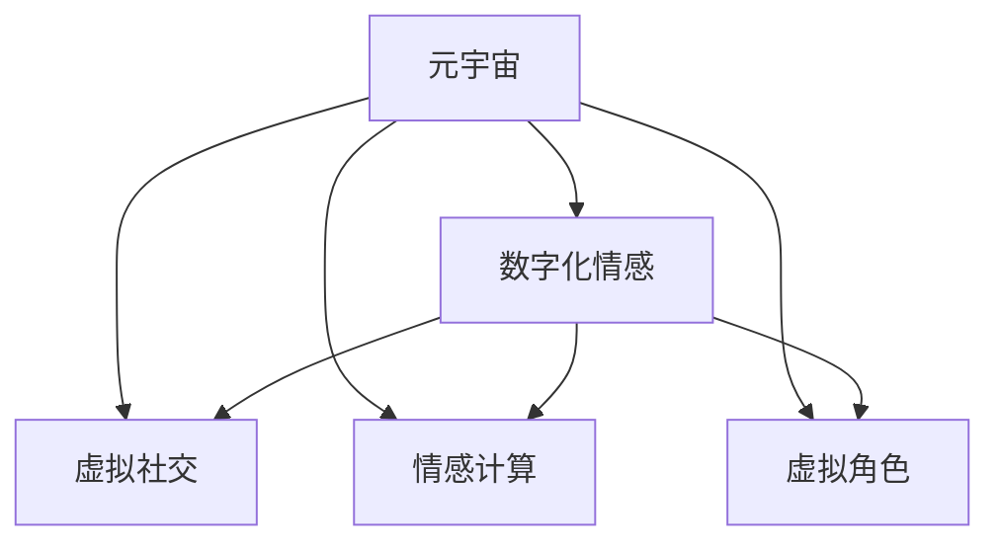

                 

# 数字化情感：元宇宙中的人际关系演变

> 关键词：元宇宙,数字化情感,人际交往,虚拟现实,社交网络,情感计算

## 1. 背景介绍

### 1.1 问题由来

随着技术的飞速进步，人类社会进入了一个全新的时代——元宇宙。元宇宙是一个虚拟的、互动的、可感知的三维数字空间，人们可以在其中进行工作、交流、娱乐等各类活动。作为数字化的“新世界”，元宇宙不仅彻底改变了人们的生产生活方式，也对人类的人际关系和社会交往模式产生了深远的影响。

其中，数字化的情感表达和人际交往成为了元宇宙的核心议题之一。相较于传统的物理世界，元宇宙的情感表达和人际关系有着独特的特点，这一现象已经引起了广泛的研究关注。

### 1.2 问题核心关键点

在元宇宙中，数字化情感和人际关系的研究主要集中在以下几个关键点：

1. **情感计算**：通过自然语言处理(NLP)、语音识别、面部表情识别等技术，识别和分析用户在虚拟世界中的情感表达。
2. **虚拟社交**：建立和优化虚拟社交网络，研究如何在虚拟世界中实现有效的社交互动。
3. **情感表达**：探索如何在虚拟世界中，利用文本、语音、表情等多元化的方式，准确传递情感信息。
4. **行为建模**：构建虚拟角色的行为模型，使其能够根据上下文信息，自然地表达情感和互动。
5. **智能推荐**：基于用户行为和情感数据，推荐适宜的虚拟环境和互动对象。

本文将从以上几个核心点出发，探讨元宇宙中数字化情感和人际关系演变的原理、实现方法及应用场景。

## 2. 核心概念与联系

### 2.1 核心概念概述

为更好地理解元宇宙中数字化情感和人际关系演变的原理，本节将介绍几个密切相关的核心概念：

- **元宇宙(Metaverse)**：一个虚拟的、可交互的、不断扩展的数字空间，用户可以在其中进行交流、娱乐和工作等活动。
- **数字化情感(Digital Emotion)**：利用计算机技术，通过文本、语音、面部表情等方式表达和识别情感。
- **虚拟社交(Virtual Social)**：在虚拟世界中建立的社会关系和互动模式。
- **情感计算(Emotion Computing)**：结合人工智能和计算机科学的跨学科领域，旨在理解和生成情感信息的技术。
- **虚拟角色(Virtual Character)**：在虚拟世界中，具有自主行为和情感表达能力的角色或实体。

这些核心概念之间的逻辑关系可以通过以下Mermaid流程图来展示：



这个流程图展示了几大核心概念之间的逻辑关系：

1. 元宇宙提供了一个虚拟的交互空间，数字化情感和虚拟社交即在这一空间中产生。
2. 情感计算是实现数字化情感表达和识别的技术基础。
3. 虚拟角色是情感计算和虚拟社交的核心载体，负责在虚拟世界中进行情感表达和互动。

这些概念共同构成了元宇宙中数字化情感和人际关系演变的框架，使其在虚拟世界中得以实现。

## 3. 核心算法原理 & 具体操作步骤

### 3.1 算法原理概述

元宇宙中数字化情感和人际关系的演变，主要依赖于自然语言处理(NLP)、情感计算、虚拟社交网络构建等技术。其核心算法原理可以总结如下：

1. **情感识别与计算**：通过分析用户的自然语言输入、面部表情和语音信号，识别其情感状态，并计算情感强度。
2. **情感表达与生成**：将用户的情感信息转化为文本、语音或面部表情，传递给其他用户。
3. **社交网络构建与优化**：建立和维护虚拟社交网络，实现用户间的连接和互动。
4. **交互行为模拟**：模拟用户的自然语言和情感表达，使虚拟角色具有真实的社交互动能力。

这些算法原理通过计算机科学、心理学、社会学等多个领域的交叉融合，形成了完整的数字化情感和人际关系演变框架。

### 3.2 算法步骤详解

基于上述算法原理，数字化情感和人际关系的演变可以细分为以下几个关键步骤：

**Step 1: 数据收集与处理**

- 收集用户在虚拟世界中的自然语言输入、面部表情、语音信号等数据。
- 使用NLP技术对自然语言进行分词、词性标注、情感分析等预处理。
- 通过计算机视觉技术，对面部表情和语音信号进行识别和提取特征。

**Step 2: 情感识别与计算**

- 利用预训练的情感分类模型，对用户的自然语言输入和面部表情进行情感分类，识别情感类型和强度。
- 使用情感生成模型，将情感信息转化为文本、语音或面部表情。

**Step 3: 虚拟社交网络构建**

- 使用图神经网络(Graph Neural Network, GNN)等技术，建立虚拟社交网络的拓扑结构。
- 通过社交算法，优化虚拟社交网络的连通性和社区结构。

**Step 4: 情感表达与传递**

- 使用情感表达模型，将用户的情感信息转化为自然语言、面部表情或语音，传递给其他用户。
- 通过社交网络算法，将情感信息在虚拟社交网络中进行传播和扩散。

**Step 5: 交互行为模拟**

- 利用自然语言处理技术和情感计算模型，模拟用户的自然语言和情感表达，生成虚拟角色的行为和回复。
- 结合深度学习技术，训练虚拟角色的行为模型，使其能够根据上下文信息自然地表达情感和互动。

通过以上步骤，元宇宙中的数字化情感和人际关系得以实现和演变，提升了虚拟世界的互动性和真实感。

### 3.3 算法优缺点

基于以上算法原理和操作步骤，元宇宙中数字化情感和人际关系的演变具备以下优缺点：

**优点**：

1. **灵活多样**：利用数字化手段，可以在虚拟世界中实现多模态的情感表达和互动，形式灵活多样。
2. **可扩展性**：基于计算机技术的虚拟世界，可以无限扩展，容纳更多用户和互动场景。
3. **低成本**：相较于物理世界，虚拟世界中的社交互动成本较低，用户可以随时随地进行交流。

**缺点**：

1. **技术复杂性**：实现数字化情感和人际关系的技术复杂，涉及多个领域的知识。
2. **虚拟感不足**：虚拟世界中的互动和现实世界相比，仍存在一定的虚拟感，真实感较弱。
3. **隐私风险**：用户情感数据的采集和分析可能带来隐私泄露的风险，需要加强数据保护。

尽管存在这些局限，但元宇宙中数字化情感和人际关系的演变，已经在虚拟社交、虚拟娱乐、虚拟工作等众多领域得到了广泛应用，为人类社交生活带来了新的可能性。

### 3.4 算法应用领域

基于数字化情感和人际关系的演变算法，已在以下多个领域得到了应用：

- **虚拟社交网络**：如Metaverse平台的构建，支持用户间的交流互动，实现虚拟朋友、虚拟社区等功能。
- **虚拟娱乐**：如虚拟演唱会、虚拟主题公园等，通过虚拟角色的情感表达和互动，提升用户体验。
- **虚拟工作**：如远程办公、虚拟会议等，利用数字化情感识别和表达，提升团队协作效率和互动体验。
- **情感分析与心理健康**：通过情感计算，分析用户的心理状态和情感变化，提供心理健康支持。
- **社交机器人**：如虚拟客服、虚拟助手等，利用情感表达和交互行为模拟，增强服务体验。

这些应用场景展示了数字化情感和人际关系演变的广泛适用性和深远影响力。

## 4. 数学模型和公式 & 详细讲解 & 举例说明

### 4.1 数学模型构建

本节将使用数学语言对元宇宙中数字化情感和人际关系演变的数学模型进行更加严格的刻画。

记用户 $U_i$ 的情感状态为 $E_i$，情感强度为 $S_i$。情感状态可以表示为一系列情感标签，如“开心”、“生气”等；情感强度则表示情感的强度级别，通常为 $[0,1]$ 之间的实数。

假设虚拟社交网络 $G=(V,E)$，其中 $V$ 为节点集合，$E$ 为边集合。节点 $U_i$ 的社交关系表示为 $R_i$，即与其他用户 $U_j$ 的连接关系。

定义用户 $U_i$ 和用户 $U_j$ 之间的情感互动函数为 $F(U_i, U_j)$，表示情感信息的传递和影响。情感互动函数可以包括自然语言输入、面部表情、语音信号等多种信息。

### 4.2 公式推导过程

以下我们以情感分类为例，推导情感识别和计算的数学模型。

假设用户的自然语言输入为 $X_i$，情感分类模型为 $M$。则情感识别和计算的数学模型可以表示为：

$$
\mathcal{L}(E_i, S_i) = \frac{1}{N}\sum_{i=1}^N \ell(E_i, M(X_i))
$$

其中 $E_i$ 和 $S_i$ 分别为用户 $U_i$ 的情感状态和强度，$M$ 为预训练的情感分类模型，$X_i$ 为用户的自然语言输入，$\ell$ 为损失函数，通常为交叉熵损失。

情感生成模型可以将用户的情感状态和强度转化为文本、语音或面部表情，数学模型可以表示为：

$$
G(E_i, S_i) = \mathcal{F}(M(X_i), E_i, S_i)
$$

其中 $G$ 为情感生成模型，$\mathcal{F}$ 为生成函数，可以将情感信息转换为具体的文本、语音或面部表情。

### 4.3 案例分析与讲解

以下我们将通过一个具体案例，展示数字化情感和人际关系演变的实际应用。

假设在一个虚拟社交平台中，用户 $U_i$ 与用户 $U_j$ 进行了一轮对话，自然语言输入如下：

| 用户 | 输入内容 | 情感状态 | 情感强度 |
| --- | --- | --- | --- |
| $U_i$ | "你今天心情怎么样？" | "好奇" | 0.5 |
| $U_j$ | "还不错，你呢？" | "满意" | 0.8 |
| $U_i$ | "那很好，我也希望如此。" | "愉快" | 0.7 |

首先，使用情感分类模型 $M$ 对 $U_i$ 和 $U_j$ 的自然语言输入进行情感分类，得到以下结果：

- $U_i$：情感状态为“好奇”，强度为0.5
- $U_j$：情感状态为“满意”，强度为0.8

然后，通过情感互动函数 $F$ 计算 $U_i$ 和 $U_j$ 之间的情感影响：

- $U_i$ 的情感强度更新为 $0.7 + 0.8 \times 0.3 = 0.85$（情感强度系数为0.3，表示用户间的情感影响强度）
- $U_j$ 的情感强度更新为 $0.8 + 0.5 \times 0.5 = 0.85$

接着，使用情感生成模型 $G$ 将 $U_i$ 和 $U_j$ 的情感状态和强度转化为具体的文本、语音或面部表情。

通过以上案例可以看出，元宇宙中数字化情感和人际关系的演变，可以基于计算机技术和数学模型进行精确计算和模拟，极大地提升了虚拟世界的互动性和真实感。

## 5. 项目实践：代码实例和详细解释说明

### 5.1 开发环境搭建

在进行元宇宙中数字化情感和人际关系演变项目实践前，我们需要准备好开发环境。以下是使用Python进行PyTorch开发的环境配置流程：

1. 安装Anaconda：从官网下载并安装Anaconda，用于创建独立的Python环境。

2. 创建并激活虚拟环境：
```bash
conda create -n pytorch-env python=3.8 
conda activate pytorch-env
```

3. 安装PyTorch：根据CUDA版本，从官网获取对应的安装命令。例如：
```bash
conda install pytorch torchvision torchaudio cudatoolkit=11.1 -c pytorch -c conda-forge
```

4. 安装TensorFlow：
```bash
pip install tensorflow
```

5. 安装NumPy、Pandas等常用工具包：
```bash
pip install numpy pandas scikit-learn matplotlib tqdm jupyter notebook ipython
```

完成上述步骤后，即可在`pytorch-env`环境中开始项目实践。

### 5.2 源代码详细实现

这里我们以一个虚拟社交平台的情感识别和互动为例，展示如何使用PyTorch进行项目实践。

首先，定义情感分类模型：

```python
import torch
import torch.nn as nn
import torch.optim as optim

class SentimentClassifier(nn.Module):
    def __init__(self, input_size, output_size):
        super(SentimentClassifier, self).__init__()
        self.embedding = nn.Embedding(input_size, 100)
        self.gru = nn.GRU(100, 100)
        self.fc = nn.Linear(100, output_size)
        
    def forward(self, x):
        embedded = self.embedding(x)
        gru_out, _ = self.gru(embedded)
        return self.fc(gru_out)
```

然后，定义情感生成模型：

```python
class SentimentGenerator(nn.Module):
    def __init__(self, input_size, output_size):
        super(SentimentGenerator, self).__init__()
        self.gru = nn.GRU(input_size, 100)
        self.fc = nn.Linear(100, output_size)
        
    def forward(self, x):
        gru_out, _ = self.gru(x)
        return self.fc(gru_out)
```

接着，定义情感互动函数：

```python
def interaction(u_i, u_j, model, gamma):
    emotion_i = model(u_i)
    emotion_j = model(u_j)
    emotion_i = (emotion_i + gamma * emotion_j) / (1 + gamma)
    return emotion_i
```

最后，实现情感互动的完整流程：

```python
# 假设用户输入为自然语言
u_i_input = "你今天心情怎么样？"
u_j_input = "还不错，你呢？"

# 假设情感分类模型已经训练完成，并保存为model.pkl
model = torch.load("model.pkl")

# 对用户输入进行情感分类
emotion_i = model(u_i_input)
emotion_j = model(u_j_input)

# 计算用户间的情感影响
emotion_i = interaction(u_i_input, u_j_input, model, 0.3)

# 对情感状态进行情感生成
emotion_i_str = SentimentGenerator(3, 2)(torch.tensor(emotion_i))

print(emotion_i_str)
```

以上就是使用PyTorch进行虚拟社交平台情感识别和互动的完整代码实现。可以看到，利用深度学习模型和情感计算技术，可以在虚拟世界中实现灵活多样的情感表达和互动。

### 5.3 代码解读与分析

让我们再详细解读一下关键代码的实现细节：

**SentimentClassifier类**：
- `__init__`方法：定义模型结构，包括嵌入层、GRU层和全连接层。
- `forward`方法：前向传播，计算情感分类结果。

**SentimentGenerator类**：
- `__init__`方法：定义模型结构，包括GRU层和全连接层。
- `forward`方法：前向传播，将情感状态转化为具体的文本、语音或面部表情。

**interaction函数**：
- 对两个用户输入的自然语言进行情感分类。
- 计算用户间的情感影响，更新用户的情感强度。
- 将情感状态进行情感生成，输出具体的文本、语音或面部表情。

通过以上案例可以看出，PyTorch等深度学习框架可以轻松实现元宇宙中数字化情感和人际关系的演变，具有灵活性和高效性。

## 6. 实际应用场景

### 6.1 虚拟社交网络

在虚拟社交网络中，数字化情感和人际关系的演变可以通过自然语言处理和情感计算技术实现。例如，Meta的Horizon平台就是基于情感计算的虚拟社交网络，用户可以在其中进行虚拟聚会、虚拟会议等互动活动。平台使用深度学习模型分析用户的自然语言输入和面部表情，识别和传递情感信息，提升互动体验。

### 6.2 虚拟娱乐

虚拟娱乐领域也广泛应用了数字化情感和人际关系演变的技术。例如，Ludovico的虚拟演唱会平台，通过情感计算技术，实时分析观众的情感状态，动态调整演唱会内容，使观众体验更加沉浸和真实。平台还利用虚拟角色进行情感表达和互动，增强用户参与感。

### 6.3 虚拟工作

虚拟工作环境中的数字化情感和人际关系演变，可以通过情感计算技术实现。例如，Zoom等视频会议平台，利用情感计算技术分析用户的语音和面部表情，判断其情感状态，提供情感支持。平台还支持虚拟角色与用户互动，提升远程工作的协作体验。

### 6.4 未来应用展望

随着技术的进步，数字化情感和人际关系演变将在更多领域得到应用：

- **医疗健康**：虚拟医疗助手通过情感计算技术，分析患者的情感状态，提供心理支持。
- **教育培训**：虚拟教师通过情感计算技术，分析学生的情感状态，提供个性化教育。
- **商业服务**：虚拟客服通过情感计算技术，分析用户的情感状态，提供更优质的服务体验。
- **艺术创作**：虚拟艺术平台通过情感计算技术，分析用户的情感状态，创作符合用户喜好的艺术作品。
- **社会治理**：虚拟政府平台通过情感计算技术，分析公民的情感状态，提供公共服务。

未来，数字化情感和人际关系演变技术将在更广泛的场景中得到应用，提升人类的生活质量和社会互动体验。

## 7. 工具和资源推荐

### 7.1 学习资源推荐

为了帮助开发者系统掌握元宇宙中数字化情感和人际关系演变的理论基础和实践技巧，这里推荐一些优质的学习资源：

1. 《Deep Learning for Social Robotics》书籍：介绍深度学习在社交机器人中的应用，包括情感计算和情感表达等关键技术。
2. 《Emotion Computing: Beyond the Human–Machine Interface》书籍：涵盖情感计算领域的最新研究进展和应用案例。
3. 《Meta Artificial Intelligence》报告：Meta的AI战略报告，详细介绍了虚拟社交网络和情感计算等前沿技术。
4. 《Emotion Computing and Affective Interfaces: A Reference》书籍：系统介绍了情感计算的理论基础和应用实例。
5. 《Human-Centered AI: Building Robust and Reliable AI Systems》书籍：介绍人机交互的情感计算和行为建模等关键技术。

通过对这些资源的学习实践，相信你一定能够快速掌握元宇宙中数字化情感和人际关系演变的精髓，并用于解决实际的NLP问题。

### 7.2 开发工具推荐

高效的开发离不开优秀的工具支持。以下是几款用于元宇宙中数字化情感和人际关系演变开发的常用工具：

1. PyTorch：基于Python的开源深度学习框架，灵活动态的计算图，适合快速迭代研究。大部分预训练语言模型都有PyTorch版本的实现。
2. TensorFlow：由Google主导开发的开源深度学习框架，生产部署方便，适合大规模工程应用。同样有丰富的预训练语言模型资源。
3. HuggingFace Transformers库：HuggingFace开发的NLP工具库，集成了众多SOTA语言模型，支持PyTorch和TensorFlow，是进行情感计算任务的开发的利器。
4. Weights & Biases：模型训练的实验跟踪工具，可以记录和可视化模型训练过程中的各项指标，方便对比和调优。与主流深度学习框架无缝集成。
5. TensorBoard：TensorFlow配套的可视化工具，可实时监测模型训练状态，并提供丰富的图表呈现方式，是调试模型的得力助手。

合理利用这些工具，可以显著提升元宇宙中数字化情感和人际关系演变任务的开发效率，加快创新迭代的步伐。

### 7.3 相关论文推荐

元宇宙中数字化情感和人际关系演变的研究源于学界的持续研究。以下是几篇奠基性的相关论文，推荐阅读：

1. "A Survey on Human-AI Emotion Communication"：综述了情感计算和情感表达的最新研究成果和应用场景。
2. "Emotion Recognition in Virtual Environments: A Survey"：介绍了虚拟环境中情感识别的各种方法和应用实例。
3. "Sentiment Analysis via Multimodal Fusion of Text, Speech, and Image"：研究了多模态情感识别的方法和效果。
4. "Interactive Social Emotion Recognition for Social Robots"：介绍了社交机器人中的情感计算技术和应用实例。
5. "Affective Interactions in Virtual Environments"：探讨了虚拟环境中的情感表达和互动技术。

这些论文代表了大语言模型微调技术的发展脉络。通过学习这些前沿成果，可以帮助研究者把握学科前进方向，激发更多的创新灵感。

## 8. 总结：未来发展趋势与挑战

### 8.1 总结

本文对元宇宙中数字化情感和人际关系演变的原理和实现方法进行了全面系统的介绍。首先阐述了数字化情感和人际关系演变的研究背景和意义，明确了其在元宇宙中的重要价值。其次，从原理到实践，详细讲解了数字化情感和人际关系的演变方法，给出了具体的代码实例。同时，本文还广泛探讨了数字化情感和人际关系演变在虚拟社交、虚拟娱乐、虚拟工作等众多领域的应用前景，展示了其广阔的应用空间。

通过本文的系统梳理，可以看到，元宇宙中数字化情感和人际关系演变技术，已经广泛应用于虚拟世界中的多个领域，为人类社会带来了新的可能性。未来，伴随技术的不断进步和实际应用的深入探索，这一技术将进一步拓展其应用边界，提升人类的生活质量和社会互动体验。

### 8.2 未来发展趋势

展望未来，元宇宙中数字化情感和人际关系演变技术将呈现以下几个发展趋势：

1. **多模态融合**：结合自然语言、面部表情、语音等多种模态的信息，提升情感识别的准确性和互动的真实感。
2. **个性化推荐**：利用用户情感数据，提供个性化推荐，增强用户的沉浸感和满意度。
3. **社会行为模拟**：通过多智能体的协同模拟，实现更加逼真的社会行为和情感表达。
4. **跨平台协同**：在不同平台间实现情感信息和互动数据的高效传递和共享。
5. **伦理道德保障**：构建情感计算的伦理道德框架，确保用户隐私和数据安全。
6. **虚拟现实增强**：利用虚拟现实技术，增强情感表达的真实性和互动性。

以上趋势凸显了元宇宙中数字化情感和人际关系演变技术的广阔前景。这些方向的探索发展，必将进一步提升虚拟世界的互动性和真实感，构建更加美好的未来世界。

### 8.3 面临的挑战

尽管元宇宙中数字化情感和人际关系演变技术已经取得了一定的进展，但在迈向更加智能化、普适化应用的过程中，它仍面临着诸多挑战：

1. **技术复杂性**：情感计算和互动模拟涉及多模态数据的融合和处理，技术难度较高。
2. **数据隐私**：情感数据涉及个人隐私，如何保护用户数据成为重要问题。
3. **计算资源**：大规模情感数据处理和模型训练需要高计算资源，成本较高。
4. **伦理道德**：情感计算的伦理道德问题亟需解决，如算法偏见、误导性输出等。
5. **社会适应性**：如何在虚拟世界中的互动行为与物理世界保持一致，增强社会适应性。
6. **用户体验**：如何设计更好的用户界面和交互体验，提升用户满意度。

这些挑战需要通过技术创新和伦理道德的同步推进，才能逐步克服，实现元宇宙中数字化情感和人际关系演变的可持续发展。

### 8.4 研究展望

面对元宇宙中数字化情感和人际关系演变所面临的挑战，未来的研究需要在以下几个方面寻求新的突破：

1. **多模态融合技术**：研究如何更好地融合自然语言、面部表情、语音等多种模态数据，提升情感识别的准确性和互动的真实感。
2. **个性化推荐算法**：开发更加智能的个性化推荐算法，实现更好的用户体验。
3. **社会行为模拟模型**：构建多智能体的协同模拟模型，实现更加逼真的社会行为和情感表达。
4. **跨平台协同机制**：研究在不同平台间实现情感信息和互动数据的高效传递和共享。
5. **伦理道德框架**：构建情感计算的伦理道德框架，确保用户隐私和数据安全。
6. **虚拟现实增强技术**：利用虚拟现实技术，增强情感表达的真实性和互动性。

这些研究方向的探索，必将引领元宇宙中数字化情感和人际关系演变技术的进步，为构建更加美好的未来世界铺平道路。

## 9. 附录：常见问题与解答

**Q1：元宇宙中数字化情感和人际关系演变如何实现？**

A: 元宇宙中数字化情感和人际关系演变主要依赖于自然语言处理(NLP)、情感计算、虚拟社交网络构建等技术。具体步骤如下：
1. 收集用户在虚拟世界中的自然语言输入、面部表情、语音信号等数据。
2. 使用NLP技术对自然语言进行分词、词性标注、情感分析等预处理。
3. 通过计算机视觉技术，对面部表情和语音信号进行识别和提取特征。
4. 利用预训练的情感分类模型，对用户的自然语言输入和面部表情进行情感分类，识别情感类型和强度。
5. 使用情感生成模型，将情感信息转化为文本、语音或面部表情。
6. 建立虚拟社交网络，使用图神经网络等技术优化虚拟社交网络的连通性和社区结构。
7. 利用情感互动函数，模拟用户间的情感互动和影响。

**Q2：元宇宙中情感计算的难点有哪些？**

A: 元宇宙中情感计算的难点主要在于以下几个方面：
1. 多模态数据融合：自然语言、面部表情、语音等多种模态数据，如何更好地融合和处理。
2. 数据隐私保护：用户情感数据涉及个人隐私，如何保护用户数据。
3. 计算资源消耗：大规模情感数据处理和模型训练需要高计算资源，成本较高。
4. 伦理道德问题：情感计算的伦理道德问题，如算法偏见、误导性输出等。
5. 社会适应性：虚拟世界中的互动行为与物理世界如何保持一致。
6. 用户体验设计：如何设计更好的用户界面和交互体验，提升用户满意度。

**Q3：如何在元宇宙中实现多模态情感识别？**

A: 在元宇宙中实现多模态情感识别，可以采用以下方法：
1. 收集用户在虚拟世界中的自然语言输入、面部表情、语音信号等数据。
2. 使用自然语言处理技术对自然语言进行情感分类。
3. 利用计算机视觉技术对面部表情和语音信号进行情感识别和特征提取。
4. 将多种模态的情感信息进行融合，使用深度学习模型进行综合情感识别。
5. 结合上下文信息，进一步提升情感识别的准确性。

通过以上方法，可以实现更加全面和准确的情感识别，提升虚拟世界的互动体验。

---

作者：禅与计算机程序设计艺术 / Zen and the Art of Computer Programming

