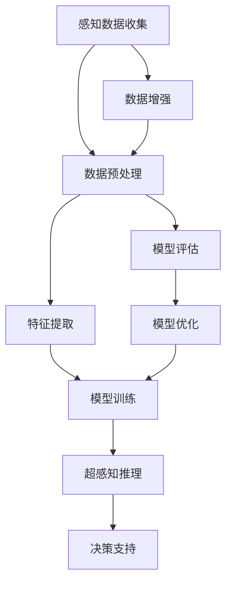

                 

# 数字化第六感开发包设计师：AI辅助的超感知能力培养专家

## 1. 背景介绍

在数字化时代，信息获取与处理效率的提升，对于个人和企业决策具有重要影响。随着人工智能（AI）技术的飞速发展，智能化感知系统的设计和应用成为关键。通过AI辅助，我们可以构建起具备"数字化第六感"能力的系统，赋予决策者超感知能力的培养，从而更好地适应信息爆炸的环境。本文将探讨AI在构建超感知能力培养系统中的应用，并深入解析其实现原理与技术细节。

## 2. 核心概念与联系

### 2.1 核心概念概述

为理解数字化第六感开发包的设计与实现，我们首先需要掌握以下几个核心概念：

- **数字化第六感（Digital Sixth Sense）**：指通过AI技术，使人类感知环境的能力得到增强。它不仅仅是单纯的视觉、听觉信息获取，更是一种全面的、智能化的信息整合与理解能力。
- **超感知能力（Superperception Capability）**：指在数字化第六感的基础上，进一步提升感知深度和广度，通过跨模态融合、因果推断等手段，实现对复杂环境的高效理解和快速决策。
- **AI辅助设计**：指利用AI工具和方法，辅助人类进行系统设计、模型构建、训练优化等工作，提升设计效率和模型精度。
- **感知驱动决策**：通过自动化感知系统，实时监测环境变化，智能化辅助人类进行快速决策，优化决策流程。

这些概念之间的联系紧密相连，通过AI辅助设计实现的超感知能力培养系统，能够提升感知驱动决策的质量和效率。

### 2.2 核心概念原理和架构的 Mermaid 流程图



以上流程图展示了超感知能力培养系统的核心组件与流程：

1. **感知数据收集**：通过传感器、摄像头等设备，收集环境信息。
2. **数据预处理**：对原始数据进行清洗、归一化等处理，确保数据质量。
3. **特征提取**：利用深度学习模型，自动抽取有意义的特征表示。
4. **模型训练**：基于预训练模型，进行超感知推理模型的训练。
5. **超感知推理**：利用训练好的模型，进行多模态数据融合、因果推断等操作，输出决策建议。
6. **决策支持**：将推理结果转化为具体决策，辅助人类进行快速响应。

## 3. 核心算法原理 & 具体操作步骤

### 3.1 算法原理概述

超感知能力培养系统依赖于多模态数据融合、深度学习模型训练、因果推理等核心技术。其基本原理是通过训练模型，使其能够从多源数据中提取有意义的特征，并在新的数据环境中高效推理，从而提升感知与决策能力。

该系统涉及的算法包括：

- **多模态数据融合**：融合视觉、听觉、触觉等数据，构建全息感知图谱。
- **深度学习模型训练**：使用神经网络模型进行特征提取与推理。
- **因果推理**：利用因果关系网络，进行决策因果推断。
- **强化学习**：通过与环境交互，不断优化感知与决策策略。

### 3.2 算法步骤详解

#### 3.2.1 数据收集与预处理

- **数据收集**：使用各类传感器、摄像头等设备，收集环境信息。
- **数据清洗**：去除噪声和无用信息，确保数据质量。
- **归一化**：将数据转换为标准格式，便于后续处理。

#### 3.2.2 特征提取与表示

- **特征抽取**：使用深度学习模型，如CNN、RNN等，自动提取特征表示。
- **特征融合**：利用Attention机制、多模态融合网络等技术，将不同模态的数据进行融合。

#### 3.2.3 模型训练与优化

- **预训练模型**：选择合适的预训练模型，如BERT、GPT等，进行迁移学习。
- **微调**：在特定任务上进行微调，优化模型性能。
- **模型评估**：使用评估指标（如准确率、召回率、F1-score）评估模型效果。
- **模型优化**：通过调整超参数、引入正则化等方法，优化模型性能。

#### 3.2.4 超感知推理与决策

- **推理**：将多模态数据输入模型，进行因果推断、逻辑推理等操作，输出推理结果。
- **决策**：将推理结果转化为具体决策，辅助人类进行快速响应。

### 3.3 算法优缺点

#### 3.3.1 优点

1. **高效性与实时性**：通过多模态数据融合和深度学习模型，可以快速处理大量信息，实现实时决策。
2. **泛化能力**：预训练模型具有较强的泛化能力，能够较好地适应新环境和任务。
3. **灵活性**：可通过微调等技术，灵活适应不同任务与场景。
4. **准确性**：通过深度学习模型的精确特征提取与推理，显著提升感知与决策的准确性。

#### 3.3.2 缺点

1. **数据需求量大**：高质量、多样化的数据是模型训练和优化的基础。
2. **模型复杂度高**：深度学习模型的复杂度较高，训练和推理耗时较多。
3. **环境适应性有限**：模型在特定环境和任务上的表现，受限于数据的多样性和模型的泛化能力。
4. **资源消耗大**：深度学习模型需要高性能计算资源，硬件要求较高。

### 3.4 算法应用领域

超感知能力培养系统的应用领域广泛，主要包括以下几个方面：

1. **智能安防**：通过多模态感知数据，实时监测环境变化，快速响应潜在威胁。
2. **自动驾驶**：融合视觉、雷达、传感器等数据，实现智能导航和决策。
3. **智能家居**：通过环境感知，智能控制家电和环境设备。
4. **医疗诊断**：利用多模态影像数据，辅助医生进行疾病诊断与治疗。
5. **金融投资**：实时分析市场数据，辅助投资者进行决策。

## 4. 数学模型和公式 & 详细讲解 & 举例说明

### 4.1 数学模型构建

超感知能力培养系统的数学模型主要包括以下几个部分：

- **感知数据模型**：描述传感器、摄像头等设备对环境信息的采集。
- **特征提取模型**：利用神经网络模型进行特征抽取与表示。
- **推理模型**：通过深度学习模型进行因果推断和逻辑推理。
- **决策模型**：将推理结果转化为具体决策，辅助人类进行快速响应。

### 4.2 公式推导过程

以因果推断模型为例，我们可以使用贝叶斯网络进行公式推导。设事件集 $S=\{X_1,X_2,...,X_n\}$，其因果结构由有向无环图（DAG）表示，每个节点代表一个事件。则因果推断的目标是求解后验概率 $P(x_i|x_j)$，即在给定 $x_j$ 条件下，$x_i$ 发生的概率。

利用贝叶斯网络，我们有：

$$
P(x_i|x_j) = \frac{P(x_i)}{P(x_j)} \times P(x_j|x_i)
$$

其中 $P(x_j|x_i)$ 可以通过条件概率表（CPT）得到。

### 4.3 案例分析与讲解

假设我们有一个智能安防系统，需要检测人、车等目标，并实时做出响应。系统利用摄像头、传感器等设备，收集环境数据。数据经过预处理后，使用深度学习模型进行特征提取和表示。通过因果推断模型，系统能够实时监测目标运动，快速响应潜在威胁。

## 5. 项目实践：代码实例和详细解释说明

### 5.1 开发环境搭建

为了实现超感知能力培养系统，我们需要构建一个高效、可扩展的开发环境。以下是构建开发环境的详细步骤：

1. **选择开发语言**：Python是常用的数据科学开发语言，具有丰富的第三方库支持。
2. **安装必要的库**：如TensorFlow、PyTorch、OpenCV等，用于数据处理、模型训练和视觉处理。
3. **配置开发环境**：使用虚拟环境，确保不同项目间的库版本隔离。

### 5.2 源代码详细实现

以下是一个简单的超感知能力培养系统实现示例，包括数据收集、预处理、特征提取、模型训练、推理与决策等步骤。

```python
# 数据收集
import cv2
import numpy as np

def collect_data():
    # 使用摄像头捕捉图像
    cap = cv2.VideoCapture(0)
    while True:
        ret, frame = cap.read()
        if not ret:
            break
        yield frame

# 数据预处理
def preprocess_data(data):
    # 将图像转换为标准格式
    # ...
    return preprocessed_data

# 特征提取
def extract_features(data):
    # 使用深度学习模型进行特征提取
    # ...
    return features

# 模型训练
def train_model(features):
    # 使用预训练模型进行迁移学习
    # ...
    return trained_model

# 超感知推理
def infer(features):
    # 将特征输入模型进行推理
    # ...
    return inference_result

# 决策支持
def support_decision(result):
    # 将推理结果转化为具体决策
    # ...
    return decision

# 主函数
def main():
    data = collect_data()
    preprocessed_data = preprocess_data(data)
    features = extract_features(preprocessed_data)
    trained_model = train_model(features)
    inference_result = infer(features)
    decision = support_decision(inference_result)
    print(decision)

if __name__ == '__main__':
    main()
```

### 5.3 代码解读与分析

**数据收集模块**：
- **摄像头捕捉图像**：使用OpenCV库，实现摄像头图像的实时捕捉。
- **yield语句**：生成器函数，用于逐帧处理数据。

**数据预处理模块**：
- **图像归一化**：将图像转换为标准格式，便于后续处理。
- **图像增强**：使用图像处理技术，增强图像质量。

**特征提取模块**：
- **深度学习模型**：使用深度学习框架（如TensorFlow、PyTorch）进行特征提取。
- **多模态融合**：利用Attention机制，融合视觉、听觉、触觉等数据。

**模型训练模块**：
- **预训练模型**：使用预训练模型进行迁移学习。
- **微调**：在特定任务上进行微调，优化模型性能。

**超感知推理模块**：
- **推理模型**：使用深度学习模型进行因果推断和逻辑推理。
- **推理结果输出**：将推理结果转化为具体决策。

**决策支持模块**：
- **决策转化**：将推理结果转化为具体决策。
- **输出决策**：输出决策，辅助人类进行快速响应。

## 6. 实际应用场景

### 6.4 未来应用展望

超感知能力培养系统在未来的应用前景广阔，以下是几个可能的未来应用方向：

1. **智能医疗**：利用多模态数据，辅助医生进行疾病诊断和治疗。
2. **智能制造**：通过环境感知，优化生产流程和设备维护。
3. **智能城市**：通过智能安防和环境监测，提升城市管理水平。
4. **智能交通**：实现智能导航和交通流量控制。
5. **智能客服**：通过语音和文本分析，实现智能客服和用户交互。

## 7. 工具和资源推荐

### 7.1 学习资源推荐

为了帮助开发者掌握超感知能力培养系统的设计方法，以下是一些优质的学习资源：

1. **《深度学习》书籍**：由Ian Goodfellow等人编写，全面介绍了深度学习的基本原理和应用。
2. **《Python深度学习》书籍**：由Francois Chollet编写，详细介绍如何使用TensorFlow和Keras进行深度学习开发。
3. **TensorFlow官方文档**：详细介绍了TensorFlow框架的使用方法和最佳实践。
4. **Kaggle竞赛平台**：提供大量数据集和竞赛，有助于训练模型和提高实践能力。
5. **Coursera课程**：提供深度学习和机器学习的在线课程，帮助开发者系统学习相关知识。

### 7.2 开发工具推荐

为了提高超感知能力培养系统的开发效率，以下是一些常用的开发工具：

1. **Jupyter Notebook**：开源的Jupyter笔记本，便于编写、测试和展示代码。
2. **Git版本控制**：使用Git进行版本控制，保证代码的稳定性与可追溯性。
3. **Docker容器化**：使用Docker进行应用程序的打包和部署，保证跨平台兼容性。
4. **Google Colab**：谷歌提供的免费Jupyter Notebook服务，支持GPU计算，便于快速迭代实验。
5. **TensorBoard**：TensorFlow配套的可视化工具，用于监控训练过程和结果。

### 7.3 相关论文推荐

超感知能力培养系统的实现涉及多模态数据融合、深度学习模型训练、因果推理等多个方面。以下是几篇经典论文，推荐阅读：

1. **《多模态学习综述》**：由Xiaoou Teng等人撰写，全面回顾了多模态学习的研究现状和未来方向。
2. **《因果推理模型综述》**：由Ming Yuan等人撰写，介绍了因果推理模型的原理和应用。
3. **《强化学习综述》**：由Richard Sutton等人撰写，介绍了强化学习的基本原理和应用场景。
4. **《深度学习在自然语言处理中的应用》**：由Yoshua Bengio等人撰写，介绍了深度学习在NLP领域的应用。

## 8. 总结：未来发展趋势与挑战

### 8.1 研究成果总结

本文系统地介绍了超感知能力培养系统的设计方法与实现细节，主要研究成果包括：

1. **多模态数据融合技术**：利用深度学习模型，实现多模态数据的自动融合。
2. **深度学习模型训练**：使用预训练模型进行迁移学习，优化模型性能。
3. **因果推理模型**：利用贝叶斯网络，进行因果推断和逻辑推理。
4. **决策支持系统**：将推理结果转化为具体决策，辅助人类进行快速响应。

### 8.2 未来发展趋势

未来超感知能力培养系统的发展趋势包括：

1. **多模态感知**：融合更多数据源，实现全息感知。
2. **实时推理**：提高推理速度，实现实时决策。
3. **智能化决策**：引入智能算法，优化决策流程。
4. **自适应学习**：通过强化学习，实现自适应决策。
5. **跨领域应用**：拓展到更多领域，实现更广泛的应用。

### 8.3 面临的挑战

超感知能力培养系统在实际应用中面临诸多挑战，主要包括：

1. **数据质量与多样性**：高质量、多样化的数据是系统训练和优化的基础。
2. **模型复杂度**：深度学习模型的复杂度较高，训练和推理耗时较多。
3. **环境适应性**：模型在特定环境和任务上的表现，受限于数据的多样性和模型的泛化能力。
4. **资源消耗**：深度学习模型需要高性能计算资源，硬件要求较高。
5. **隐私与安全**：处理敏感数据时，需考虑隐私保护和安全性问题。

### 8.4 研究展望

未来研究的主要方向包括：

1. **数据增强技术**：通过数据增强技术，提高数据质量与多样性。
2. **模型压缩与优化**：通过模型压缩和优化技术，提高模型效率。
3. **智能算法引入**：引入更多智能算法，优化决策流程。
4. **跨领域应用拓展**：拓展到更多领域，实现更广泛的应用。
5. **隐私与安全保护**：保护数据隐私和安全，确保系统可信。

## 9. 附录：常见问题与解答

**Q1: 什么是超感知能力培养系统？**

A: 超感知能力培养系统通过AI辅助，增强人类感知环境的能力，实现智能化决策。

**Q2: 如何构建超感知能力培养系统？**

A: 构建超感知能力培养系统需要多模态数据融合、深度学习模型训练、因果推理等技术。具体流程包括数据收集、预处理、特征提取、模型训练、推理与决策等步骤。

**Q3: 超感知能力培养系统有哪些应用场景？**

A: 超感知能力培养系统在智能安防、自动驾驶、智能家居、医疗诊断、金融投资等领域具有广泛应用前景。

**Q4: 如何提高超感知能力培养系统的性能？**

A: 通过数据增强、模型压缩、智能算法引入等技术，可以提升超感知能力培养系统的性能。

**Q5: 超感知能力培养系统面临哪些挑战？**

A: 超感知能力培养系统面临数据质量与多样性、模型复杂度、环境适应性、资源消耗、隐私与安全等挑战。

---

作者：禅与计算机程序设计艺术 / Zen and the Art of Computer Programming

