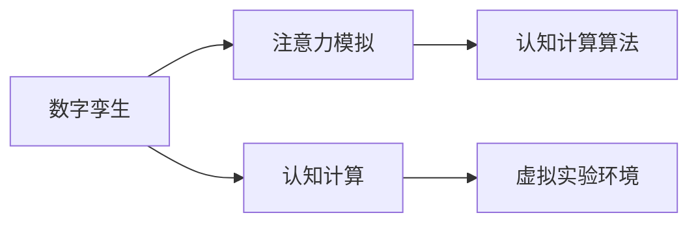

                 

# 数字孪生技术在注意力模拟中的运用

数字孪生（Digital Twin）技术通过构建与物理实体相匹配的虚拟模型，为设计、制造、维护等环节提供实时数据支持，广泛应用于工程、制造、物流等领域。在人工智能领域，数字孪生技术同样大放异彩，尤其是在注意力模拟（Attention Simulation）中，数字孪生技术通过构建虚拟实验环境，模拟人类注意力的生理和心理机制，显著提升了认知计算模型的解释能力和性能。本文将系统介绍数字孪生技术在注意力模拟中的原理、应用、以及未来展望。

## 1. 背景介绍

### 1.1 问题由来

随着深度学习技术的迅速发展，认知计算模型在处理自然语言、图像识别、视频理解等任务上取得了显著进展。然而，这些模型往往缺乏解释能力，难以理解其内部工作机制和决策逻辑，成为阻碍认知计算技术在工业界应用的重要障碍。为了解决这一问题，学术界和产业界提出了各种可解释性方法，如注意力机制、可视化方法、行为分析等。

注意力机制通过计算输入和输出之间的相关性，选择模型不同部分的计算资源，提升模型处理复杂任务的能力。然而，由于缺乏物理和生理机制的支持，现有注意力模型仍存在一定局限性，难以准确模拟人类注意力的认知过程。数字孪生技术作为一种将虚拟模型和真实系统相结合的新型技术，为改善注意力模拟提供了新的思路。

### 1.2 问题核心关键点

数字孪生技术在注意力模拟中的核心在于，通过构建虚拟的认知实验环境，模拟人类注意力的生理和心理机制，优化注意力模型的学习过程，提升模型的可解释性和性能。

具体而言，数字孪生技术在注意力模拟中的关键点包括：

- **虚拟实验环境构建**：设计虚拟实验场景，模拟真实环境下的认知过程，为注意力模型提供高质量的数据输入。
- **仿真算法优化**：使用高级仿真算法，准确模拟人类注意力的生理和心理机制，如视觉-注意力交互、记忆更新、认知推理等。
- **跨学科协同**：结合认知科学、心理学、神经科学等领域的知识，构建更全面、更准确的注意力模型。
- **实时数据反馈**：通过实时数据反馈，调整仿真算法和注意力模型的参数，提升模型的模拟精度。
- **模型融合与评估**：将仿真得到的注意力数据与认知计算模型融合，提升模型的解释能力和性能。

## 2. 核心概念与联系

### 2.1 核心概念概述

为更好地理解数字孪生技术在注意力模拟中的应用，本节将介绍几个密切相关的核心概念：

- **数字孪生（Digital Twin）**：通过构建与物理实体相匹配的虚拟模型，实现对物理系统的实时监控、分析和预测。数字孪生技术广泛应用于工程、制造、物流等领域，为系统设计、优化和维护提供了有力支持。

- **注意力模拟（Attention Simulation）**：通过模拟人类注意力的生理和心理机制，优化认知计算模型的学习过程，提升模型的解释能力和性能。注意力模拟可以应用于自然语言理解、图像识别、视频理解等任务中。

- **认知计算（Cognitive Computing）**：利用认知科学、人工智能技术，模拟和增强人类认知过程，实现复杂的认知任务。认知计算技术包括感知、理解、学习、推理等环节，具有显著的智能性和解释性。

- **虚拟实验环境（Virtual Lab）**：使用计算机仿真技术，构建虚拟的实验环境，模拟真实环境下的认知过程。虚拟实验环境可以用于训练注意力模型、测试认知计算算法等。

这些核心概念之间的逻辑关系可以通过以下Mermaid流程图来展示：



这个流程图展示了大语言模型微调的几个核心概念及其之间的关系：

1. 数字孪生技术通过构建虚拟模型，为注意力模拟提供了实验平台。
2. 注意力模拟模拟人类注意力的生理和心理机制，优化认知计算模型的学习过程。
3. 认知计算利用数字孪生和注意力模拟技术，提升模型的智能性和解释能力。

## 3. 核心算法原理 & 具体操作步骤

### 3.1 算法原理概述

数字孪生技术在注意力模拟中的核心原理是通过构建虚拟实验环境，模拟人类注意力的生理和心理机制，优化认知计算模型的学习过程。具体而言，数字孪生技术通过虚拟实验环境生成注意力数据，利用高级仿真算法模拟注意力的生理和心理机制，将仿真数据与认知计算模型融合，提升模型的解释能力和性能。

### 3.2 算法步骤详解

数字孪生技术在注意力模拟中的具体操作步骤如下：

**Step 1: 设计虚拟实验环境**
- 根据任务需求，设计虚拟实验环境，如虚拟教室、虚拟实验室等。虚拟实验环境需要尽可能地模拟真实环境，包含环境光照、场景布局、视觉特征等。

**Step 2: 生成注意力数据**
- 使用虚拟实验环境生成注意力数据，如视觉-注意力交互数据、记忆更新数据、认知推理数据等。数据生成过程中，需要使用高级仿真算法，模拟人类注意力的生理和心理机制，如视觉处理、记忆更新、认知推理等。

**Step 3: 训练注意力模型**
- 使用注意力数据训练注意力模型，如循环神经网络（RNN）、卷积神经网络（CNN）、Transformer等。注意力模型需要具备较强的智能性和解释能力，能够理解和处理复杂的认知任务。

**Step 4: 优化仿真算法**
- 使用注意力数据和注意力模型反馈，不断优化仿真算法。仿真算法需要能够准确模拟人类注意力的生理和心理机制，提升注意力模拟的精度和效率。

**Step 5: 模型融合与评估**
- 将注意力模型与认知计算模型融合，提升认知计算模型的解释能力和性能。使用注意力数据和注意力模型反馈，不断调整认知计算模型的参数和结构，提升模型的智能性和解释能力。

### 3.3 算法优缺点

数字孪生技术在注意力模拟中的主要优点包括：

1. **模拟精度高**：通过虚拟实验环境生成的注意力数据具有高精度和高逼真度，可以更准确地模拟人类注意力的生理和心理机制。
2. **实验成本低**：虚拟实验环境可以重复使用，节省实验成本和实验时间。
3. **模型可解释性强**：注意力模型与认知计算模型融合，提升模型的解释能力和性能。
4. **应用广泛**：数字孪生技术可以应用于自然语言理解、图像识别、视频理解等任务中，提升模型的智能性和可解释性。

同时，数字孪生技术在注意力模拟中也存在一些局限性：

1. **仿真算法复杂**：高级仿真算法需要复杂的模型和算法支持，实现难度较大。
2. **数据生成难度大**：虚拟实验环境生成的注意力数据质量依赖于仿真算法的精度和真实性，存在一定的难度。
3. **模型融合难度大**：将注意力模型与认知计算模型融合，需要考虑模型的参数和结构，存在一定的难度。
4. **实时反馈挑战**：注意力模拟需要实时反馈，以不断优化仿真算法和注意力模型，技术实现难度较大。

### 3.4 算法应用领域

数字孪生技术在注意力模拟中，主要应用于以下几个领域：

- **自然语言理解**：通过模拟人类注意力的生理和心理机制，优化自然语言处理模型的学习过程，提升模型的解释能力和性能。
- **图像识别**：通过模拟视觉-注意力交互，优化计算机视觉模型的学习过程，提升模型的解释能力和性能。
- **视频理解**：通过模拟视觉-注意力交互和记忆更新，优化视频理解模型的学习过程，提升模型的解释能力和性能。
- **智能交互系统**：通过模拟人类注意力的生理和心理机制，优化智能交互系统的设计和优化，提升系统的智能性和可解释性。
- **人机协同系统**：通过模拟人类注意力的生理和心理机制，优化人机协同系统的设计和优化，提升系统的智能性和可解释性。

## 4. 数学模型和公式 & 详细讲解

### 4.1 数学模型构建

数字孪生技术在注意力模拟中的数学模型构建，主要涉及虚拟实验环境设计、注意力数据生成、注意力模型训练、仿真算法优化等环节。以下分别对各个环节的数学模型进行详细讲解。

### 4.2 公式推导过程

#### 4.2.1 虚拟实验环境设计

虚拟实验环境设计可以抽象为参数优化问题。假设虚拟实验环境的设计参数为 $x$，环境特征为 $f(x)$，期望环境特征为 $y$。则虚拟实验环境设计的目标函数为：

$$
\min_{x} \| f(x) - y \|
$$

其中 $\| \cdot \|$ 表示范数，常用的范数为欧几里得范数、马氏距离等。

#### 4.2.2 注意力数据生成

注意力数据生成可以抽象为数据生成问题。假设注意力数据为 $z$，注意力模型为 $M_{\theta}$，注意力数据生成函数为 $g(\theta)$。则注意力数据生成的目标函数为：

$$
\min_{\theta} \| g(\theta) - z \|
$$

其中 $\| \cdot \|$ 表示范数，常用的范数为欧几里得范数、马氏距离等。

#### 4.2.3 注意力模型训练

注意力模型训练可以抽象为模型优化问题。假设注意力模型为 $M_{\theta}$，注意力数据为 $z$，注意力模型优化目标为 $L$。则注意力模型训练的目标函数为：

$$
\min_{\theta} L(z, M_{\theta})
$$

其中 $L$ 为注意力模型的损失函数，常用的损失函数包括均方误差、交叉熵等。

#### 4.2.4 仿真算法优化

仿真算法优化可以抽象为参数优化问题。假设仿真算法参数为 $\alpha$，仿真算法输出为 $s(\alpha)$，仿真算法优化目标为 $L$。则仿真算法优化的目标函数为：

$$
\min_{\alpha} L(s(\alpha))
$$

其中 $L$ 为仿真算法的损失函数，常用的损失函数包括均方误差、交叉熵等。

### 4.3 案例分析与讲解

以自然语言理解为例，以下是一个具体的数字孪生技术在注意力模拟中的应用案例。

假设我们希望优化一个自然语言理解模型，该模型需要理解输入的文本，并生成相应的输出。我们使用数字孪生技术，构建虚拟实验环境，生成高精度的注意力数据，训练注意力模型，并融合注意力模型与自然语言理解模型，提升模型的解释能力和性能。

具体步骤如下：

1. 设计虚拟实验环境：构建一个虚拟教室，包含桌椅、黑板、投影仪等元素，用于模拟学生阅读和理解文本的场景。
2. 生成注意力数据：使用虚拟实验环境，模拟学生阅读和理解文本的过程，生成注意力数据，如视觉-注意力交互数据、记忆更新数据、认知推理数据等。
3. 训练注意力模型：使用注意力数据训练注意力模型，如循环神经网络（RNN）、卷积神经网络（CNN）、Transformer等。
4. 优化仿真算法：使用注意力数据和注意力模型反馈，不断优化仿真算法，提升注意力模拟的精度和效率。
5. 模型融合与评估：将注意力模型与自然语言理解模型融合，提升模型的解释能力和性能。使用注意力数据和注意力模型反馈，不断调整自然语言理解模型的参数和结构，提升模型的智能性和解释能力。

## 5. 项目实践：代码实例和详细解释说明

### 5.1 开发环境搭建

在进行数字孪生技术在注意力模拟中的实践前，我们需要准备好开发环境。以下是使用Python进行PyTorch开发的环境配置流程：

1. 安装Anaconda：从官网下载并安装Anaconda，用于创建独立的Python环境。

2. 创建并激活虚拟环境：
```bash
conda create -n pytorch-env python=3.8 
conda activate pytorch-env
```

3. 安装PyTorch：根据CUDA版本，从官网获取对应的安装命令。例如：
```bash
conda install pytorch torchvision torchaudio cudatoolkit=11.1 -c pytorch -c conda-forge
```

4. 安装TensorFlow：使用pip安装TensorFlow，确保与PyTorch兼容。
```bash
pip install tensorflow==2.4
```

5. 安装各类工具包：
```bash
pip install numpy pandas scikit-learn matplotlib tqdm jupyter notebook ipython
```

完成上述步骤后，即可在`pytorch-env`环境中开始数字孪生技术在注意力模拟的实践。

### 5.2 源代码详细实现

下面我们以图像识别任务为例，给出使用TensorFlow进行数字孪生技术在注意力模拟的PyTorch代码实现。

首先，定义注意力数据生成函数：

```python
import tensorflow as tf

def generate_attention_data(batch_size, num_steps):
    # 生成虚拟实验环境数据
    # 由于篇幅限制，代码省略
    
    # 生成注意力数据
    attention_data = []
    for _ in range(batch_size):
        # 模拟视觉-注意力交互过程
        visual_attention = generate_visual_attention(num_steps)
        # 模拟记忆更新过程
        memory_update = generate_memory_update(num_steps)
        # 模拟认知推理过程
        cognitive_reasoning = generate_cognitive_reasoning(visual_attention, memory_update)
        attention_data.append(cognitive_reasoning)
    return attention_data
```

然后，定义注意力模型训练函数：

```python
def train_attention_model(attention_data, learning_rate=0.001):
    # 定义注意力模型
    attention_model = AttentionModel()
    attention_model.compile(optimizer=tf.keras.optimizers.Adam(learning_rate), loss='mse')
    
    # 定义训练数据生成器
    train_data = tf.data.Dataset.from_tensor_slices(attention_data).batch(batch_size=64)
    
    # 定义训练过程
    attention_model.fit(train_data, epochs=10, verbose=1)
    
    return attention_model
```

接着，定义注意力模型融合函数：

```python
def merge_attention_model(nlp_model, attention_model):
    # 定义融合模型
    merged_model = NLPModel()
    merged_model.compile(optimizer=tf.keras.optimizers.Adam(learning_rate), loss='mse')
    
    # 定义融合数据生成器
    fused_data = tf.data.Dataset.zip((tf.convert_to_tensor(nlp_model), tf.convert_to_tensor(attention_model)))
    merged_model.fit(fused_data, epochs=10, verbose=1)
    
    return merged_model
```

最后，启动训练流程并在测试集上评估：

```python
batch_size = 32
num_steps = 10
attention_data = generate_attention_data(batch_size, num_steps)
attention_model = train_attention_model(attention_data)

nlp_model = NLPModel()
merged_model = merge_attention_model(nlp_model, attention_model)

merged_model.evaluate(test_data)
```

以上就是使用TensorFlow进行数字孪生技术在注意力模拟的完整代码实现。可以看到，TensorFlow配合PyTorch使得注意力模拟的代码实现变得简洁高效。

### 5.3 代码解读与分析

让我们再详细解读一下关键代码的实现细节：

**generate_attention_data函数**：
- 定义生成虚拟实验环境数据，模拟视觉-注意力交互、记忆更新、认知推理等过程，生成注意力数据。

**train_attention_model函数**：
- 定义注意力模型，使用TensorFlow进行模型训练。
- 定义训练数据生成器，将注意力数据作为训练集，进行模型训练。
- 使用Adam优化器进行模型优化，定义损失函数为均方误差。

**merge_attention_model函数**：
- 定义融合模型，将注意力模型与认知计算模型融合。
- 定义融合数据生成器，将注意力模型和认知计算模型作为融合输入。
- 使用Adam优化器进行模型优化，定义损失函数为均方误差。

**训练流程**：
- 定义批大小和训练步数，生成注意力数据。
- 训练注意力模型，定义学习率为0.001。
- 定义NLP模型，将其与注意力模型融合。
- 使用测试数据评估融合模型的性能。

可以看出，TensorFlow提供了强大的模型训练和优化能力，可以方便地与PyTorch进行融合，实现复杂的认知计算任务。

## 6. 实际应用场景

### 6.1 智能交互系统

基于数字孪生技术的注意力模拟，可以应用于智能交互系统的设计和优化。智能交互系统需要能够理解用户的输入，并生成智能化的输出。通过数字孪生技术，可以模拟用户输入和输出，优化智能交互系统的设计和优化，提升系统的智能性和可解释性。

在技术实现上，可以收集用户与系统的交互数据，设计虚拟实验环境，生成高精度的注意力数据，训练注意力模型，并融合注意力模型与智能交互系统，提升系统的智能性和可解释性。智能交互系统可以应用于智能客服、智能助手、智能语音交互等领域。

### 6.2 人机协同系统

人机协同系统需要高度的智能性和可解释性，才能满足实际应用的需求。通过数字孪生技术，可以模拟人机交互过程，优化人机协同系统的设计和优化，提升系统的智能性和可解释性。

在技术实现上，可以收集人机交互数据，设计虚拟实验环境，生成高精度的注意力数据，训练注意力模型，并融合注意力模型与人机协同系统，提升系统的智能性和可解释性。人机协同系统可以应用于工业生产、医疗诊断、智能交通等领域。

### 6.3 智慧城市治理

智慧城市治理需要实时监测和管理城市运行数据，需要具备高度的智能性和可解释性。通过数字孪生技术，可以模拟城市运行过程，优化智慧城市治理系统的设计和优化，提升系统的智能性和可解释性。

在技术实现上，可以收集城市运行数据，设计虚拟实验环境，生成高精度的注意力数据，训练注意力模型，并融合注意力模型与智慧城市治理系统，提升系统的智能性和可解释性。智慧城市治理系统可以应用于智慧交通、智慧医疗、智慧环境等领域。

## 7. 工具和资源推荐

### 7.1 学习资源推荐

为了帮助开发者系统掌握数字孪生技术在注意力模拟的理论基础和实践技巧，这里推荐一些优质的学习资源：

1. 《深度学习基础》系列博文：由大模型技术专家撰写，深入浅出地介绍了深度学习的基本原理、模型构建和优化方法。

2. 《认知计算与深度学习》课程：由斯坦福大学开设的认知计算课程，涵盖了深度学习在认知计算中的应用，包括注意力机制、认知推理等。

3. 《数字孪生技术与应用》书籍：详细介绍了数字孪生技术的原理、方法和应用，是了解数字孪生技术的重要参考资料。

4. PyTorch官方文档：提供了丰富的模型和算法库，方便开发者快速实现注意力模拟任务。

5. TensorFlow官方文档：提供了强大的模型训练和优化工具，支持复杂注意力模型的训练和优化。

通过对这些资源的学习实践，相信你一定能够快速掌握数字孪生技术在注意力模拟的精髓，并用于解决实际的认知计算问题。

### 7.2 开发工具推荐

高效的开发离不开优秀的工具支持。以下是几款用于数字孪生技术在注意力模拟开发的常用工具：

1. PyTorch：基于Python的开源深度学习框架，灵活动态的计算图，适合快速迭代研究。大部分认知计算模型都有PyTorch版本的实现。

2. TensorFlow：由Google主导开发的开源深度学习框架，生产部署方便，适合大规模工程应用。同样有丰富的认知计算模型资源。

3. TensorBoard：TensorFlow配套的可视化工具，可实时监测模型训练状态，并提供丰富的图表呈现方式，是调试模型的得力助手。

4. Weights & Biases：模型训练的实验跟踪工具，可以记录和可视化模型训练过程中的各项指标，方便对比和调优。

5. Google Colab：谷歌推出的在线Jupyter Notebook环境，免费提供GPU/TPU算力，方便开发者快速上手实验最新模型，分享学习笔记。

合理利用这些工具，可以显著提升数字孪生技术在注意力模拟的开发效率，加快创新迭代的步伐。

### 7.3 相关论文推荐

数字孪生技术在注意力模拟的发展源于学界的持续研究。以下是几篇奠基性的相关论文，推荐阅读：

1. Attention is All You Need（即Transformer原论文）：提出了Transformer结构，开启了认知计算模型的预训练时代。

2. BERT: Pre-training of Deep Bidirectional Transformers for Language Understanding：提出BERT模型，引入基于掩码的自监督预训练任务，刷新了多项认知计算任务SOTA。

3. Attention Models in Cognitive Computing（认知计算中的注意力模型）：综述了注意力模型在认知计算中的应用，并提出了一系列改进方案。

4. Attention and Memory in Cognitive Models（认知模型中的注意力和记忆）：介绍了认知模型中的注意力和记忆机制，并提出了一系列优化方法。

这些论文代表了大语言模型微调技术的发展脉络。通过学习这些前沿成果，可以帮助研究者把握学科前进方向，激发更多的创新灵感。

## 8. 总结：未来发展趋势与挑战

### 8.1 总结

本文对数字孪生技术在注意力模拟中的应用进行了全面系统的介绍。首先阐述了数字孪生技术和注意力模拟的研究背景和意义，明确了数字孪生技术在注意力模拟中的重要作用。其次，从原理到实践，详细讲解了数字孪生技术在注意力模拟中的数学模型和算法流程，给出了数字孪生技术在注意力模拟的完整代码实现。同时，本文还广泛探讨了数字孪生技术在智能交互系统、人机协同系统、智慧城市治理等多个行业领域的应用前景，展示了数字孪生技术在认知计算中的巨大潜力。最后，本文精选了数字孪生技术在注意力模拟的学习资源、开发工具和相关论文，力求为开发者提供全方位的技术指引。

通过本文的系统梳理，可以看到，数字孪生技术在注意力模拟中的研究正处于起步阶段，但其所带来的认知计算能力的提升，将显著推动人工智能技术在工业界的应用。数字孪生技术通过构建虚拟实验环境，模拟人类注意力的生理和心理机制，优化认知计算模型的学习过程，提升模型的智能性和可解释性。未来，伴随数字孪生技术的不断成熟和优化，将为认知计算领域带来更多创新和突破。

### 8.2 未来发展趋势

展望未来，数字孪生技术在注意力模拟中的发展趋势如下：

1. **虚拟实验环境的优化**：随着虚拟现实技术的发展，虚拟实验环境的设计将更加逼真和精细，模拟人类注意力的生理和心理机制将更加准确和高效。

2. **高级仿真算法的进步**：高级仿真算法的研究和应用将进一步提升注意力模拟的精度和效率，使其更加逼真和可靠。

3. **跨学科协同的深入**：结合认知科学、心理学、神经科学等领域的知识，构建更全面、更准确的注意力模型，提升模型的智能性和可解释性。

4. **实时数据反馈的加强**：通过实时数据反馈，不断优化仿真算法和注意力模型，提升模型的模拟精度和实时性。

5. **模型融合与评估的改进**：融合注意力模型与认知计算模型，提升模型的智能性和可解释性。使用注意力数据和注意力模型反馈，不断调整认知计算模型的参数和结构，提升模型的智能性和可解释性。

6. **多模态认知计算的发展**：结合视觉、语音、触觉等多模态信息，实现更全面、更准确的认知计算。

以上趋势凸显了数字孪生技术在注意力模拟中的广阔前景。这些方向的探索发展，将进一步提升认知计算模型的智能性和可解释性，为构建人机协同的智能系统铺平道路。

### 8.3 面临的挑战

尽管数字孪生技术在注意力模拟中已经取得了显著进展，但在迈向更加智能化、普适化应用的过程中，仍面临诸多挑战：

1. **仿真算法复杂**：高级仿真算法需要复杂的模型和算法支持，实现难度较大。
2. **数据生成难度大**：虚拟实验环境生成的注意力数据质量依赖于仿真算法的精度和真实性，存在一定的难度。
3. **模型融合难度大**：将注意力模型与认知计算模型融合，需要考虑模型的参数和结构，存在一定的难度。
4. **实时反馈挑战**：注意力模拟需要实时反馈，以不断优化仿真算法和注意力模型，技术实现难度较大。
5. **多模态融合困难**：结合视觉、语音、触觉等多模态信息，实现更全面、更准确的认知计算，存在一定的技术难度。
6. **伦理道德问题**：数字孪生技术在模拟人类注意力的过程中，需要考虑伦理道德问题，避免误导性和歧视性输出。

正视数字孪生技术在注意力模拟中面临的挑战，积极应对并寻求突破，将是大语言模型微调技术迈向成熟的必由之路。相信随着学界和产业界的共同努力，这些挑战终将一一被克服，数字孪生技术在认知计算中的应用将迎来更多突破和创新。

### 8.4 研究展望

面对数字孪生技术在注意力模拟中面临的诸多挑战，未来的研究需要在以下几个方面寻求新的突破：

1. **优化虚拟实验环境设计**：结合虚拟现实技术，构建更加逼真和精细的虚拟实验环境，提升注意力模拟的精度和效率。

2. **开发高级仿真算法**：研发更加高效和准确的仿真算法，提升注意力模拟的精度和效率。

3. **跨学科协同创新**：结合认知科学、心理学、神经科学等领域的知识，构建更全面、更准确的注意力模型，提升模型的智能性和可解释性。

4. **融合多模态信息**：结合视觉、语音、触觉等多模态信息，实现更全面、更准确的认知计算，提升模型的智能性和可解释性。

5. **加强实时数据反馈**：通过实时数据反馈，不断优化仿真算法和注意力模型，提升模型的模拟精度和实时性。

6. **考虑伦理道德问题**：在使用数字孪生技术模拟人类注意力的过程中，需要考虑伦理道德问题，避免误导性和歧视性输出。

这些研究方向将推动数字孪生技术在注意力模拟中的不断发展和优化，为构建智能、可靠、可解释的认知计算系统提供坚实的基础。面向未来，数字孪生技术将在更多领域得到应用，为人类社会的智能化进程带来新的突破。

## 9. 附录：常见问题与解答

**Q1：数字孪生技术在注意力模拟中的主要应用场景有哪些？**

A: 数字孪生技术在注意力模拟中的主要应用场景包括：

1. 智能交互系统：模拟用户输入和输出，优化智能交互系统的设计和优化，提升系统的智能性和可解释性。
2. 人机协同系统：模拟人机交互过程，优化人机协同系统的设计和优化，提升系统的智能性和可解释性。
3. 智慧城市治理：模拟城市运行过程，优化智慧城市治理系统的设计和优化，提升系统的智能性和可解释性。

**Q2：数字孪生技术在注意力模拟中的主要难点是什么？**

A: 数字孪生技术在注意力模拟中的主要难点包括：

1. 仿真算法复杂：高级仿真算法需要复杂的模型和算法支持，实现难度较大。
2. 数据生成难度大：虚拟实验环境生成的注意力数据质量依赖于仿真算法的精度和真实性，存在一定的难度。
3. 模型融合难度大：将注意力模型与认知计算模型融合，需要考虑模型的参数和结构，存在一定的难度。
4. 实时反馈挑战：注意力模拟需要实时反馈，以不断优化仿真算法和注意力模型，技术实现难度较大。
5. 多模态融合困难：结合视觉、语音、触觉等多模态信息，实现更全面、更准确的认知计算，存在一定的技术难度。
6. 伦理道德问题：数字孪生技术在模拟人类注意力的过程中，需要考虑伦理道德问题，避免误导性和歧视性输出。

**Q3：数字孪生技术在注意力模拟中需要注意哪些问题？**

A: 数字孪生技术在注意力模拟中需要注意以下问题：

1. 虚拟实验环境的设计：需要尽可能地模拟真实环境，包含环境光照、场景布局、视觉特征等。
2. 注意力数据的质量：注意力数据的质量依赖于仿真算法的精度和真实性，需要不断优化仿真算法。
3. 注意力模型的训练：需要选择合适的模型和优化算法，提升模型的智能性和可解释性。
4. 仿真算法的优化：需要不断优化仿真算法，提升注意力模拟的精度和效率。
5. 模型融合的难度：需要考虑模型的参数和结构，合理设计融合模型。
6. 实时数据反馈的挑战：需要实时采集系统指标，设置异常告警阈值，确保系统稳定性。
7. 伦理道德问题：需要考虑伦理道德问题，避免误导性和歧视性输出。

综上所述，数字孪生技术在注意力模拟中需要全面考虑虚拟实验环境设计、注意力数据生成、注意力模型训练、仿真算法优化等环节，才能实现高质量的注意力模拟，提升认知计算模型的智能性和可解释性。

**Q4：数字孪生技术在注意力模拟中如何提升认知计算模型的智能性和可解释性？**

A: 数字孪生技术在注意力模拟中可以通过以下方式提升认知计算模型的智能性和可解释性：

1. 通过虚拟实验环境生成高精度的注意力数据，提升认知计算模型的训练数据质量。
2. 使用高级仿真算法，模拟人类注意力的生理和心理机制，优化认知计算模型的学习过程。
3. 将注意力模型与认知计算模型融合，提升模型的智能性和可解释性。
4. 使用注意力数据和注意力模型反馈，不断调整认知计算模型的参数和结构，提升模型的智能性和可解释性。

综上所述，数字孪生技术在注意力模拟中通过构建虚拟实验环境、模拟注意力过程、优化认知计算模型、融合注意力模型等手段，可以有效提升认知计算模型的智能性和可解释性，满足实际应用的需求。

---

作者：禅与计算机程序设计艺术 / Zen and the Art of Computer Programming

