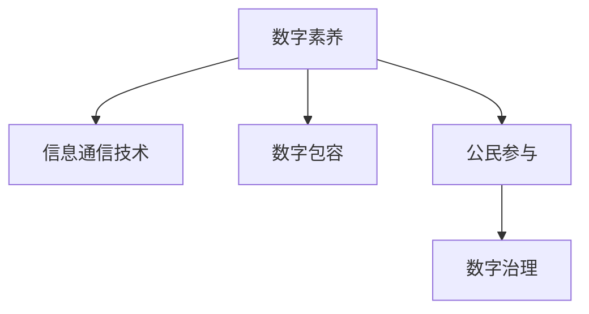

                 

# 数字素养：公民参与的基石

## 1. 背景介绍

### 1.1 问题由来
随着信息技术的迅猛发展，数字技术已经成为社会各个领域不可或缺的一部分。从经济、教育到医疗、娱乐，数字技术的应用渗透到了生活的方方面面。然而，数字素养的缺失，特别是公众对数字技术的基本了解和应用能力不足，已成为制约社会信息化、智能化发展的一大瓶颈。

### 1.2 问题核心关键点
数字素养不仅是指掌握数字技术的基本知识，更包括能够有效使用数字技术解决实际问题的能力。数字素养的提升，不仅能够提高公民的参与度和幸福感，更能推动社会整体的数字化转型和智能化发展。

### 1.3 问题研究意义
提升数字素养，是实现“人人享有信息通信技术”这一联合国可持续发展目标的重要手段。通过提升数字素养，可以增强公民的参与意识和能力，促进信息的公平获取，提高社会整体的数字包容性。此外，提升数字素养还能够激发创新潜力，促进数字经济的发展，加速数字治理的进程。

## 2. 核心概念与联系

### 2.1 核心概念概述

为更好地理解数字素养及其在公民参与中的作用，本节将介绍几个密切相关的核心概念：

- 数字素养(Digital Literacy)：指个体在数字化环境下，能够有效利用数字技术解决问题的能力，包括基本操作、信息获取、应用创新等。
- 信息通信技术(Information and Communication Technology, ICT)：涉及通信、计算机、互联网等技术，是数字素养的重要载体。
- 数字包容(Digital Inclusion)：指所有人群都能够公平、平等地接触和利用数字技术，减少数字鸿沟，实现数字社会的全面参与。
- 公民参与(Civic Engagement)：指公民通过数字技术参与社会治理、公共事务决策和监督的过程，是现代民主政治的重要组成部分。
- 数字治理(Digital Governance)：指政府和组织利用数字技术，提高治理效率、透明度和参与度的过程，是数字社会的核心议题。

这些核心概念之间的逻辑关系可以通过以下Mermaid流程图来展示：



这个流程图展示了大语言模型的核心概念及其之间的关系：

1. 数字素养是数字包容和公民参与的基础，通过提升数字素养，可以使更多人群接触到数字技术，公平地参与到社会事务中。
2. 数字包容通过降低数字鸿沟，使数字技术惠及更多人群，进而提升公民参与度。
3. 数字治理则通过高效利用数字技术，实现社会治理的智能化和透明化，推动公民参与更加深入和广泛。

## 3. 核心算法原理 & 具体操作步骤
### 3.1 算法原理概述

提升数字素养的过程，本质上是一个教育训练的过程。其核心思想是通过系统化的教育和培训，帮助个体掌握数字技术的基本知识和应用技能，从而提高其数字素养水平。

形式化地，假设数字素养的教育培训过程可以表示为函数 $f$，则目标是通过函数 $f$，将初始数字素养水平较低的个体，提升至理想的数字素养水平。即找到函数 $f$，使得：

$$
f(\text{Low Literacy}) = \text{High Literacy}
$$

这里，“Low Literacy”表示初始数字素养水平较低，“High Literacy”表示理想的数字素养水平。

### 3.2 算法步骤详解

数字素养的提升通常包括以下几个关键步骤：

**Step 1: 设定数字素养目标**
- 根据不同群体的特点，设定合适的数字素养目标。例如，基础操作技能、信息获取能力、应用创新能力等。

**Step 2: 设计教育培训方案**
- 选择合适的教育平台和工具，如在线课程、移动应用、互动游戏等。
- 设计科学的课程内容和教学方法，确保内容的趣味性和实用性。
- 结合个体差异，提供个性化的学习路径和辅导。

**Step 3: 实施教育培训**
- 使用在线平台、混合学习模式等灵活的方式，为个体提供多样化的学习机会。
- 通过互动和实践，提高学习效果，增强理解和记忆。
- 定期评估学习进度和效果，调整教学策略。

**Step 4: 效果评估与反馈**
- 使用标准化的评估工具和指标，对个体数字素养水平进行客观评估。
- 根据评估结果，提供个性化反馈和改进建议。
- 持续跟踪和监测学习效果，确保目标达成。

**Step 5: 持续改进与提升**
- 根据最新的数字技术发展，不断更新教育培训内容和方法。
- 结合社会需求和个人兴趣，不断丰富学习资源和活动。
- 建立持续学习机制，鼓励个体终身学习，保持数字素养的先进性。

### 3.3 算法优缺点

提升数字素养的系统化教育方法，具有以下优点：
1. 系统全面。通过系统的课程和培训，能够全面提升个体的数字素养水平，涵盖操作、应用、创新等多个方面。
2. 灵活多样。采用在线平台、互动游戏等多种形式，使教育培训更加灵活，适应不同群体的需求。
3. 效果显著。系统化的教育培训能够显著提高个体的数字素养水平，使他们能够更有效地利用数字技术。
4. 可扩展性强。通过标准化和模块化的课程设计，教育培训可以规模化复制和推广。

同时，该方法也存在一定的局限性：
1. 教育资源不足。高质量的数字素养教育资源较为稀缺，特别是针对特定群体的教育内容。
2. 学习动机不一。个体的学习动机和兴趣各异，如何激发学习热情，保持学习动力，是一个挑战。
3. 学习效果难以量化。个体的学习效果和数字素养提升难以通过简单的量化指标评估，评估方式较为复杂。
4. 技术门槛较高。系统化的教育培训需要较高的技术实现和运营成本，对资源和能力要求较高。

尽管存在这些局限性，但就目前而言，系统化的教育培训仍是提升数字素养的主流范式。未来相关研究的重点在于如何进一步降低教育成本，提高教育资源的普及性，同时兼顾个体的个性化需求和学习动力。

### 3.4 算法应用领域

提升数字素养的方法在多个领域得到了广泛应用，例如：

- 教育：通过在线课程、虚拟实验室等方式，提升学生的信息技术和数字素养。
- 公共服务：通过社区中心、图书馆等渠道，提供面向公众的数字素养培训，提高数字包容性。
- 企业培训：通过企业内部培训和外部合作，提升员工数字素养，提高工作效率和创新能力。
- 政府治理：通过数字素养培训，增强公务员的数字技能，提高数字治理水平和公民参与度。
- 社会组织：通过非政府组织和志愿者团队，为弱势群体提供数字素养培训，减少数字鸿沟。

这些领域的应用展示了数字素养提升的重要性和广泛性。通过提升数字素养，可以在不同层面推动社会的数字化进程，促进社会整体的信息化和智能化发展。

## 4. 数学模型和公式 & 详细讲解  
### 4.1 数学模型构建

本节将使用数学语言对提升数字素养的教育培训过程进行更加严格的刻画。

假设个体的初始数字素养水平为 $L_0$，通过教育培训提升后的数字素养水平为 $L_1$。则提升过程可以表示为以下数学模型：

$$
L_1 = f(L_0)
$$

其中，函数 $f$ 描述了个体数字素养提升的动态过程。通常，$f$ 可以分解为多个子函数，每个子函数代表一个具体的学习目标或技能提升路径。例如：

$$
f(L_0) = f_1(L_{0_1}) \times f_2(L_{0_2}) \times ... \times f_n(L_{0_n})
$$

其中，$f_1, f_2, ..., f_n$ 分别表示不同技能或目标的提升函数，$L_{0_1}, L_{0_2}, ..., L_{0_n}$ 分别表示初始技能或目标水平。

### 4.2 公式推导过程

以下我们以基础操作技能和信息获取能力为例，推导提升数字素养的基本数学模型。

假设个体初始数字素养水平为 $L_0$，通过教育培训提升后的数字素养水平为 $L_1$。设 $L_{0_1}$ 表示基础操作技能水平，$L_{0_2}$ 表示信息获取能力水平。则提升过程可以表示为：

$$
L_1 = f_1(L_{0_1}) \times f_2(L_{0_2})
$$

其中，$f_1$ 和 $f_2$ 分别表示基础操作技能和信息获取能力的提升函数。假设 $f_1$ 和 $f_2$ 均为线性函数，即：

$$
f_1(L_{0_1}) = k_1 L_{0_1} + b_1
$$

$$
f_2(L_{0_2}) = k_2 L_{0_2} + b_2
$$

将 $f_1$ 和 $f_2$ 代入总提升函数 $f$，得：

$$
f(L_0) = (k_1 L_{0_1} + b_1) \times (k_2 L_{0_2} + b_2)
$$

这个公式展示了数字素养提升的数学模型，其中的 $k_1, k_2, b_1, b_2$ 分别为基础操作技能和信息获取能力提升的系数和常数。实际应用中，这些参数需要通过实验和数据分析来确定。

### 4.3 案例分析与讲解

假设某社区针对老年群体开展数字素养培训，目标是提升他们的基础操作技能和信息获取能力。培训过程中，社区中心提供电脑操作课程、互联网使用培训和数字技能测试等活动。根据上述数学模型，老年群体数字素养的提升可以表示为：

$$
L_1 = f_1(L_{0_1}) \times f_2(L_{0_2})
$$

其中，$f_1$ 表示基础操作技能的提升函数，$f_2$ 表示信息获取能力的提升函数。根据实际培训效果，$f_1$ 和 $f_2$ 的参数可以通过数据分析得到。假设 $L_{0_1}$ 和 $L_{0_2}$ 的初始水平分别为 $L_{0_1} = 0.5$ 和 $L_{0_2} = 0.3$，则有：

$$
L_1 = (0.8 L_{0_1} + 0.2) \times (1.2 L_{0_2} + 0.5)
$$

将 $L_{0_1}$ 和 $L_{0_2}$ 代入公式，得：

$$
L_1 = (0.8 \times 0.5 + 0.2) \times (1.2 \times 0.3 + 0.5) = 0.88 \times 0.96 = 0.8544
$$

这个结果表示，在培训结束后，老年群体的数字素养水平提升至 $0.8544$，即约为 $85.44\%$。这一结果表明，通过系统化的教育培训，可以显著提高个体的数字素养水平。

## 5. 项目实践：代码实例和详细解释说明
### 5.1 开发环境搭建

在进行数字素养提升的实践前，我们需要准备好开发环境。以下是使用Python进行Flask框架开发的环境配置流程：

1. 安装Anaconda：从官网下载并安装Anaconda，用于创建独立的Python环境。

2. 创建并激活虚拟环境：
```bash
conda create -n py37 python=3.7 
conda activate py37
```

3. 安装Flask：
```bash
pip install flask
```

4. 安装各类工具包：
```bash
pip install numpy pandas scikit-learn flask-tensorflow flask-square flask-socketio
```

完成上述步骤后，即可在`py37`环境中开始数字素养提升系统的开发。

### 5.2 源代码详细实现

这里我们以在线课程平台为例，给出使用Flask框架搭建数字素养提升系统的PyTorch代码实现。

首先，定义课程类：

```python
from flask import Flask, render_template, request, jsonify
from flask_sqlalchemy import SQLAlchemy
from flask_login import LoginManager, UserMixin, login_user, logout_user, login_required
from transformers import BertTokenizer, BertForSequenceClassification

app = Flask(__name__)
app.config['SQLALCHEMY_DATABASE_URI'] = 'sqlite:////tmp/test.db'
db = SQLAlchemy(app)
login_manager = LoginManager()
login_manager.init_app(app)

class User(UserMixin, db.Model):
    id = db.Column(db.Integer, primary_key=True)
    username = db.Column(db.String(80))
    password = db.Column(db.String(120))
    courses = db.relationship('Course', backref='user', lazy=True)

@login_manager.user_loader
def load_user(user_id):
    return User.query.get(int(user_id))

@app.route('/')
def index():
    courses = Course.query.all()
    return render_template('index.html', courses=courses)
```

然后，定义课程信息类：

```python
class Course(db.Model):
    id = db.Column(db.Integer, primary_key=True)
    title = db.Column(db.String(120))
    content = db.Column(db.Text)
    exam = db.Column(db.Boolean, default=False)

    def __init__(self, title, content, exam=False):
        self.title = title
        self.content = content
        self.exam = exam
```

接着，定义登录和注册功能：

```python
@app.route('/login', methods=['GET', 'POST'])
def login():
    if request.method == 'POST':
        username = request.form['username']
        password = request.form['password']
        user = User.query.filter_by(username=username, password=password).first()
        if user:
            login_user(user)
            return redirect('/')
        else:
            return render_template('login.html', message='Invalid credentials')
    else:
        return render_template('login.html')

@app.route('/logout')
@login_required
def logout():
    logout_user()
    return redirect('/')
```

最后，启动服务：

```python
if __name__ == '__main__':
    app.run(debug=True)
```

以上就是使用Flask框架搭建数字素养提升系统的完整代码实现。可以看到，Flask框架提供了强大的Web开发功能，使得系统搭建变得相对简单快捷。

### 5.3 代码解读与分析

让我们再详细解读一下关键代码的实现细节：

**User类**：
- 定义了用户的基本信息，包括id、用户名、密码和已参与的课程。
- 通过flask_login库实现了用户认证和授权功能。

**Course类**：
- 定义了课程的基本信息，包括标题、内容、考试状态等。
- 通过Flask的ORM技术，方便与数据库进行交互。

**login和logout函数**：
- 实现了用户登录和注销功能，使用了flask_login库提供的装饰器和用户管理函数。

**index函数**：
- 展示了所有课程信息，通过模板渲染技术，将课程信息展示给用户。

通过以上代码，我们可以构建一个简单的在线课程平台，用于提升个体的数字素养水平。用户可以通过注册登录，参与到不同课程的学习中，逐步掌握基础操作技能和信息获取能力。

## 6. 实际应用场景
### 6.1 数字素养培训中心

数字素养培训中心是提升公民数字素养的重要场所。通过数字素养培训中心，可以为公众提供系统化的数字素养培训，帮助他们掌握数字技术的基本操作和应用技能。

在技术实现上，可以建立一个线上线下结合的数字素养培训平台，提供丰富的课程资源和互动活动。线上平台包括视频教程、在线测试、互动问答等，线下平台包括面对面辅导、技能实操等，充分满足不同群体的需求。通过这种方式，可以使更多人接触到数字素养培训，提升他们的数字素养水平。

### 6.2 数字素养社区

数字素养社区是提升数字素养的重要组织形式。通过社区建设，可以形成持续学习和交流的氛围，使数字素养提升成为一种常态化活动。

在技术实现上，可以建立一个以用户为中心的数字素养社区平台，提供课程分享、经验交流、技能展示等功能。用户可以在社区中发布学习笔记、参与讨论、分享心得，形成互助学习的生态圈。通过这种方式，可以使数字素养提升更具趣味性和互动性，提高学习效果。

### 6.3 数字素养竞赛

数字素养竞赛是提升数字素养的有效手段。通过举办数字素养竞赛，可以激发公众的学习热情和创新潜力，推动数字素养提升的持续发展。

在技术实现上，可以组织线上线下结合的数字素养竞赛活动，设计创意新颖、挑战性强的竞赛题目，吸引更多用户参与。竞赛结果可以作为个体数字素养的评估依据，鼓励用户持续学习和提升。

### 6.4 未来应用展望

随着数字素养的不断普及，未来的数字素养提升将呈现以下几个趋势：

1. 线上线下融合。未来的数字素养提升将更加注重线上线下结合，通过混合学习模式，提供更加灵活和多样化的培训方式。
2. 个性化学习。未来的数字素养提升将更加注重个性化需求，通过智能推荐和个性化学习路径，提升学习效果。
3. 持续学习机制。未来的数字素养提升将更加注重持续学习，通过终身学习平台，实现数字素养的长期提升。
4. 多语言支持。未来的数字素养提升将更加注重多语言支持，通过多语种课程资源，提升全球公民的数字素养水平。
5. 跨领域融合。未来的数字素养提升将更加注重跨领域融合，通过整合不同领域的知识和技能，提升数字素养的应用广度和深度。

这些趋势将进一步推动数字素养的普及和提升，为构建数字包容的社会奠定坚实基础。

## 7. 工具和资源推荐
### 7.1 学习资源推荐

为了帮助开发者系统掌握数字素养的提升方法，这里推荐一些优质的学习资源：

1. 《数字素养：全球视野》系列博文：由联合国教科文组织专家撰写，深入浅出地介绍了全球数字素养的现状和提升策略。

2. 《数字素养教育与培训》课程：由联合国教科文组织与世界银行联合开设的在线课程，提供系统化的数字素养教育培训资源。

3. 《数字素养提升手册》书籍：由国际电信联盟(ITU)编写，全面介绍了数字素养提升的方法和实践案例。

4. 《数字素养与未来教育》报告：由联合国教科文组织发布，探讨了数字素养在教育中的重要性和未来发展方向。

5. IEEE Xplore数据库：IEEE的学术资源库，收录了大量数字素养研究的论文和报告，是深入了解数字素养领域的宝贵资源。

通过对这些资源的学习实践，相信你一定能够全面掌握数字素养提升的精髓，并用于解决实际的数字素养问题。
###  7.2 开发工具推荐

高效的开发离不开优秀的工具支持。以下是几款用于数字素养提升开发的常用工具：

1. Flask：基于Python的开源Web框架，灵活的路由机制和模板渲染功能，适合搭建Web应用平台。
2. SQLAlchemy：Python的ORM框架，方便与数据库进行交互，支持多种数据库。
3. PyTorch：基于Python的深度学习框架，提供丰富的神经网络模型和优化算法。
4. TensorFlow：由Google主导开发的深度学习框架，支持分布式计算和模型优化。
5. HuggingFace Transformers：NLP领域最流行的模型库，集成了多种预训练模型，支持微调和模型推理。

合理利用这些工具，可以显著提升数字素养提升任务的开发效率，加快创新迭代的步伐。

### 7.3 相关论文推荐

数字素养提升的研究涉及多个领域，涵盖教育学、心理学、计算机科学等。以下是几篇奠基性的相关论文，推荐阅读：

1. 《数字素养教育：现状、挑战与未来》：探讨了数字素养教育的现状、挑战和未来发展方向。
2. 《数字素养提升的心理学基础》：研究了数字素养提升过程中的心理机制和影响因素。
3. 《数字素养与人工智能的融合》：探讨了数字素养在人工智能中的应用，以及AI技术对数字素养提升的影响。
4. 《数字素养与可持续发展目标》：研究了数字素养在实现联合国可持续发展目标中的重要作用。
5. 《数字素养与全球治理》：探讨了数字素养在全球治理中的角色和作用，提出了提升全球数字素养的新思路。

这些论文代表了大语言模型微调技术的发展脉络。通过学习这些前沿成果，可以帮助研究者把握学科前进方向，激发更多的创新灵感。

## 8. 总结：未来发展趋势与挑战
### 8.1 总结

本文对提升数字素养的过程进行了全面系统的介绍。首先阐述了数字素养在公民参与中的重要意义，明确了提升数字素养对于数字包容和数字治理的促进作用。其次，从原理到实践，详细讲解了数字素养提升的数学模型和关键步骤，给出了数字素养提升系统开发的完整代码实例。同时，本文还广泛探讨了数字素养提升方法在多个领域的应用前景，展示了数字素养提升的广阔前景。此外，本文精选了数字素养提升技术的各类学习资源，力求为读者提供全方位的技术指引。

通过本文的系统梳理，可以看到，提升数字素养不仅能够显著提高公民的参与度和幸福感，更能推动社会整体的数字化转型和智能化发展。未来，伴随数字素养的不断普及和提升，数字素养提升技术必将在更广泛的领域发挥作用，为构建数字包容的社会奠定坚实基础。

### 8.2 未来发展趋势

展望未来，数字素养提升技术将呈现以下几个发展趋势：

1. 数据驱动。未来的数字素养提升将更加依赖数据，通过大数据分析和机器学习技术，提供更加个性化和精准的数字素养培训。
2. 跨领域融合。未来的数字素养提升将更加注重跨领域融合，通过整合不同领域的知识和技能，提升数字素养的综合应用能力。
3. 国际合作。未来的数字素养提升将更加注重国际合作，通过跨国合作和资源共享，推动全球数字素养的普及。
4. 政策支持。未来的数字素养提升将更加注重政策支持，通过政府政策、企业投入和社会力量，推动数字素养的系统化和规范化。
5. 创新技术。未来的数字素养提升将更加注重创新技术，通过引入AI、VR、AR等新技术，提升数字素养提升的效果和体验。

这些趋势将进一步推动数字素养提升的普及和提升，为构建数字包容的社会奠定坚实基础。

### 8.3 面临的挑战

尽管数字素养提升技术已经取得了瞩目成就，但在迈向更加智能化、普适化应用的过程中，它仍面临着诸多挑战：

1. 教育资源不均。不同地区和群体的数字素养水平差异较大，如何提供公平、高质量的数字素养培训，是一个重要问题。
2. 学习动机不足。如何激发学习者的学习兴趣和动力，保持学习积极性，是一个挑战。
3. 技术门槛较高。数字素养提升的实现需要较高的技术能力和资源投入，如何降低技术门槛，提高普及性，是一个挑战。
4. 效果难以量化。如何评估和衡量数字素养提升的效果，是一个复杂的问题。
5. 跨领域融合难度较大。不同领域的知识体系和方法论差异较大，如何实现跨领域的有效融合，是一个挑战。

尽管存在这些挑战，但通过学界和产业界的共同努力，这些挑战终将一一被克服，数字素养提升必将在构建数字包容的社会中扮演越来越重要的角色。相信随着技术的日益成熟，数字素养提升技术将成为推动社会信息化、智能化发展的重要手段。

### 8.4 研究展望

面对数字素养提升面临的种种挑战，未来的研究需要在以下几个方面寻求新的突破：

1. 探索低成本、高效率的数字素养提升方法。通过技术创新和资源优化，降低数字素养提升的成本，提高普及性。
2. 研究如何通过跨领域融合，提升数字素养的综合应用能力。通过整合不同领域的知识和技能，提升数字素养的应用广度和深度。
3. 纳入伦理道德约束。在数字素养提升过程中，加强伦理道德教育，确保数字素养的正确应用和传播。
4. 引入机器学习和人工智能技术。通过机器学习和人工智能技术，提升数字素养提升的效果和个性化程度。
5. 建立持续学习机制。通过终身学习平台，实现数字素养的长期提升，使数字素养成为一种常态化活动。

这些研究方向将引领数字素养提升技术迈向更高的台阶，为构建数字包容的社会提供更加坚实的技术支撑。面向未来，数字素养提升技术还需要与其他人工智能技术进行更深入的融合，如知识表示、因果推理、强化学习等，多路径协同发力，共同推动数字素养提升的持续发展。只有勇于创新、敢于突破，才能不断拓展数字素养的边界，让数字素养成为推动社会信息化、智能化发展的重要力量。

## 9. 附录：常见问题与解答

**Q1：如何评估数字素养的提升效果？**

A: 评估数字素养的提升效果可以通过多种方式进行：
1. 标准化测试：设计标准化测试题目，评估个体在数字技术操作、信息获取等方面的能力提升。
2. 行为跟踪：通过用户行为数据分析，评估个体在使用数字技术时的行为变化。
3. 反馈问卷：设计反馈问卷，收集用户对数字素养提升的满意度和建议。
4. 专家评估：邀请数字素养领域的专家，对个体的数字素养提升进行综合评估。
5. 实际应用：通过实际应用中的表现，评估个体数字素养提升的效果。

**Q2：数字素养提升需要多长时间？**

A: 数字素养提升的时间因人而异，取决于个体的初始数字素养水平和学习动机。一般来说，通过系统化的教育培训，个体可以在数周到数月内获得显著的数字素养提升。但对于复杂技能或特定领域知识的掌握，可能需要更长时间的学习和实践。

**Q3：数字素养提升有哪些主要障碍？**

A: 数字素养提升面临的主要障碍包括：
1. 教育资源不足：高质量的数字素养教育资源较为稀缺，特别是在农村和偏远地区。
2. 学习动机不一：个体的学习动机和兴趣各异，如何激发学习热情，保持学习动力，是一个挑战。
3. 技术门槛较高：数字素养提升的实现需要较高的技术能力和资源投入，如何降低技术门槛，提高普及性，是一个挑战。
4. 效果难以量化：如何评估和衡量数字素养提升的效果，是一个复杂的问题。
5. 跨领域融合难度较大：不同领域的知识体系和方法论差异较大，如何实现跨领域的有效融合，是一个挑战。

尽管存在这些挑战，但通过学界和产业界的共同努力，这些挑战终将一一被克服，数字素养提升必将在构建数字包容的社会中扮演越来越重要的角色。

