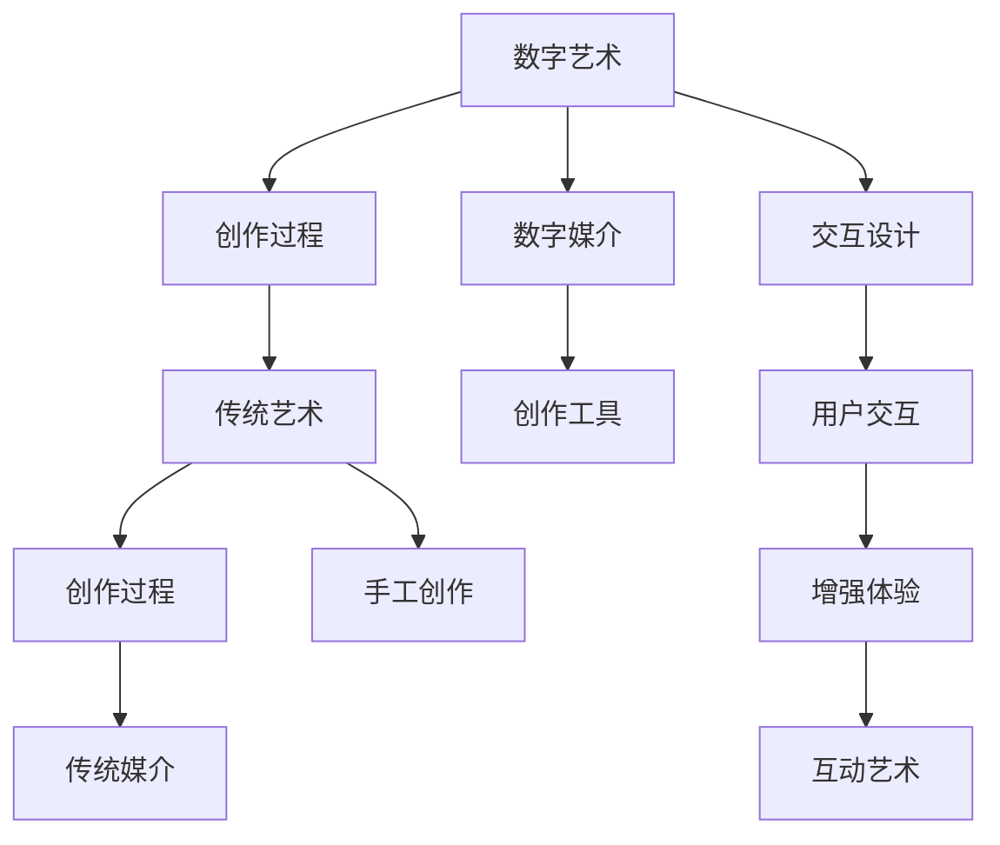

                 

# 数字艺术与传统艺术的碰撞

> 关键词：数字艺术,传统艺术,创作过程,交互设计,数字媒介

## 1. 背景介绍

### 1.1 问题由来
数字艺术（Digital Art）与传统艺术（Traditional Art）的碰撞与融合，是当今艺术界的一个重要议题。传统艺术以纸张、画布、颜料等传统媒介为载体，艺术家通过手工创作，直接反映内心感受和外界观察。而数字艺术则依托计算机技术和软件工具，以电子媒介为载体，通过算法和编程实现艺术创作。

随着数字技术的迅猛发展，数字艺术正逐步改变着传统艺术的创作方式和传播渠道。二者的结合不仅拓宽了艺术表达的边界，也带来了新的艺术形式和表达方式。然而，这种结合并非一帆风顺，传统艺术家对数字艺术的抵触和质疑，以及数字艺术家对传统艺术理念的继承和创新，都反映出二者的碰撞与融合过程中存在的诸多矛盾与挑战。

### 1.2 问题核心关键点
本研究旨在探讨数字艺术与传统艺术的碰撞，深入分析二者的创作过程、交互设计、数字媒介等方面的异同，并在此基础上提出二者的融合策略。主要关注点包括：

1. **创作过程**：比较数字艺术与传统艺术的创作方法，探讨二者的优劣。
2. **交互设计**：研究数字艺术中的交互设计理念，如何通过算法实现与用户的互动。
3. **数字媒介**：分析数字媒介的特性，及其在艺术创作中的应用与挑战。

### 1.3 问题研究意义
研究数字艺术与传统艺术的碰撞，对于理解当代艺术发展趋势，探索新的艺术表现形式，以及促进跨领域艺术创新具有重要意义。具体体现在：

1. **艺术创新**：通过结合传统艺术与数字技术，开拓新的艺术表现形式，推动艺术创新。
2. **教育实践**：为艺术教育提供新的教学方法和素材，提升学生的创作能力和技术素养。
3. **文化传承**：利用数字技术保存和传播传统艺术，促进文化传承与交流。

## 2. 核心概念与联系

### 2.1 核心概念概述

为更好地理解数字艺术与传统艺术的碰撞，本节将介绍几个关键概念：

- **数字艺术（Digital Art）**：以计算机技术为基础，通过算法和编程实现的艺术创作。包括计算机图形、数字绘画、互动艺术、虚拟现实等形式。
- **传统艺术（Traditional Art）**：以纸张、画布、颜料等传统媒介为载体，通过手工创作展现艺术家的思想和技巧。包括绘画、雕塑、版画等形式。
- **创作过程**：从构思到完成的过程，包括素材选择、技巧运用、作品呈现等环节。
- **交互设计**：通过算法和编程实现与用户的互动，增强用户体验和艺术表现力。
- **数字媒介**：计算机、互联网等数字技术为载体的媒介，为艺术创作提供新的可能性。

这些概念之间的逻辑关系可以通过以下Mermaid流程图来展示：



这个流程图展示了大艺术和传统艺术的创作过程及其联系：

1. 数字艺术通过创作过程和数字媒介实现创作，同时结合交互设计增强用户体验。
2. 传统艺术通过手工创作过程和传统媒介实现创作。
3. 数字艺术与传统艺术在创作过程中存在碰撞与融合，通过数字媒介和手工创作工具实现互动与创新。

## 3. 核心算法原理 & 具体操作步骤

### 3.1 算法原理概述

数字艺术与传统艺术的碰撞，不仅在创作过程和交互设计上有异同，在算法原理上也存在显著区别。数字艺术的创作过程通常依赖于算法和编程，而传统艺术则侧重于手工技巧和视觉表现。

### 3.2 算法步骤详解

**数字艺术创作算法步骤**：

1. **构思阶段**：艺术家通过构思，确定创作主题和表现形式。
2. **算法设计**：根据创作主题，设计算法流程，实现数字创作。
3. **编程实现**：将算法流程转化为具体的代码实现。
4. **数据处理**：处理输入数据，确保算法运行所需的环境和条件。
5. **输出与优化**：输出创作结果，并通过算法优化提升作品质量。

**传统艺术创作算法步骤**：

1. **构思阶段**：艺术家通过观察生活、内心感受等，确定创作主题和表现形式。
2. **技巧运用**：根据创作主题，选择相应的绘画、雕塑等技巧。
3. **手工创作**：通过手工技巧，在纸张、画布等传统媒介上实现创作。
4. **视觉表现**：根据创作意图，通过色彩、线条等视觉元素表达情感和思想。
5. **作品展示**：将作品呈现给观众，供其欣赏和评价。

### 3.3 算法优缺点

数字艺术创作算法具有以下优点：

1. **高效性**：通过算法可以快速实现创作过程，缩短创作时间。
2. **灵活性**：算法可以根据创作需求进行灵活调整和优化。
3. **交互性**：通过交互设计，增强与用户的互动，提升用户体验。

同时，数字艺术创作算法也存在以下缺点：

1. **技术依赖**：算法创作需要计算机技术和编程技能，门槛较高。
2. **效果依赖**：算法效果受输入数据和参数设置的影响较大。
3. **艺术性缺失**：算法创作可能缺乏情感和创意的深度，艺术性不足。

### 3.4 算法应用领域

数字艺术创作算法在多个领域得到了广泛应用，包括：

1. **计算机图形**：利用算法生成二维、三维图形，实现艺术创作。
2. **数字绘画**：通过算法实现数字油画、水彩画等效果。
3. **互动艺术**：结合传感器和算法，实现与用户的互动。
4. **虚拟现实**：利用算法生成虚拟环境，创作虚拟艺术作品。

传统艺术创作算法在多个领域也得到了广泛应用，包括：

1. **绘画**：通过手工技巧在纸张、画布上创作艺术作品。
2. **雕塑**：通过手工技巧在石头、木头等材料上雕刻艺术作品。
3. **版画**：通过手工技巧在印刷媒介上创作艺术作品。
4. **书法**：通过手写技巧在纸张上创作书法作品。

## 4. 数学模型和公式 & 详细讲解 & 举例说明

### 4.1 数学模型构建

本节将使用数学语言对数字艺术与传统艺术的创作过程进行更加严格的刻画。

假设数字艺术创作算法为 $f(x)$，其中 $x$ 为输入数据（如图片、声音等），$f(x)$ 输出为数字艺术作品。传统艺术创作算法为 $g(x)$，其中 $x$ 为输入数据（如色彩、形状等），$g(x)$ 输出为传统艺术作品。

定义创作过程的损失函数为 $L$，用于衡量创作效果与预期目标之间的差异。创作过程的优化目标是最小化损失函数 $L$，即找到最优参数：

$$
\theta^* = \mathop{\arg\min}_{\theta} L(f(x), g(x))
$$

其中 $\theta$ 为创作过程中的参数（如算法参数、技巧参数等）。

### 4.2 公式推导过程

以下我们以数字绘画为例，推导数字绘画创作算法的损失函数及其梯度计算公式。

假设数字绘画创作算法为 $f(x) = W^T(ax+b)$，其中 $W$ 为权重矩阵，$a$ 为输入数据 $x$，$b$ 为偏置向量。则创作过程的损失函数为：

$$
L(W,b) = \frac{1}{N}\sum_{i=1}^N \| f(x_i) - y_i \|^2
$$

其中 $y_i$ 为期望输出（即目标艺术作品），$N$ 为数据样本数量。

根据链式法则，损失函数对参数 $W$ 和 $b$ 的梯度为：

$$
\frac{\partial L(W,b)}{\partial W} = -\frac{2}{N}\sum_{i=1}^N (f(x_i) - y_i)ax_i^T
$$

$$
\frac{\partial L(W,b)}{\partial b} = -\frac{2}{N}\sum_{i=1}^N (f(x_i) - y_i)
$$

在得到损失函数的梯度后，即可带入参数更新公式，完成创作过程的迭代优化。重复上述过程直至收敛，最终得到适应创作目标的权重矩阵 $W$ 和偏置向量 $b$。

### 4.3 案例分析与讲解

以下以互动艺术为例，分析其创作过程和算法实现。

假设互动艺术创作算法为 $f(x,y,t) = a(x,t)y+b(x,t)$，其中 $x$ 为用户的输入数据（如鼠标移动轨迹），$y$ 为目标艺术作品，$t$ 为时间参数。则创作过程的损失函数为：

$$
L(a,b,t) = \frac{1}{N}\sum_{i=1}^N \| f(x_i,y_i,t_i) - y_i \|^2
$$

其中 $y_i$ 为目标艺术作品，$N$ 为数据样本数量。

根据链式法则，损失函数对参数 $a$、$b$ 和时间参数 $t$ 的梯度为：

$$
\frac{\partial L(a,b,t)}{\partial a} = -\frac{2}{N}\sum_{i=1}^N (f(x_i,y_i,t_i) - y_i)x_i
$$

$$
\frac{\partial L(a,b,t)}{\partial b} = -\frac{2}{N}\sum_{i=1}^N (f(x_i,y_i,t_i) - y_i)
$$

$$
\frac{\partial L(a,b,t)}{\partial t} = -\frac{2}{N}\sum_{i=1}^N (f(x_i,y_i,t_i) - y_i)\frac{\partial f(x_i,y_i,t_i)}{\partial t}
$$

在得到损失函数的梯度后，即可带入参数更新公式，完成创作过程的迭代优化。重复上述过程直至收敛，最终得到适应创作目标的参数 $a$、$b$ 和时间参数 $t$。

## 5. 项目实践：代码实例和详细解释说明

### 5.1 开发环境搭建

在进行数字艺术创作算法实践前，我们需要准备好开发环境。以下是使用Python进行TensorFlow开发的环境配置流程：

1. 安装Anaconda：从官网下载并安装Anaconda，用于创建独立的Python环境。

2. 创建并激活虚拟环境：
```bash
conda create -n tensorflow-env python=3.8 
conda activate tensorflow-env
```

3. 安装TensorFlow：从官网获取对应的安装命令。例如：
```bash
pip install tensorflow==2.4
```

4. 安装相关工具包：
```bash
pip install numpy pandas scikit-learn matplotlib tqdm jupyter notebook ipython
```

完成上述步骤后，即可在`tensorflow-env`环境中开始数字艺术创作算法的实践。

### 5.2 源代码详细实现

下面我以数字绘画创作算法为例，给出使用TensorFlow进行数字绘画创作算法的PyTorch代码实现。

首先，定义数字绘画创作算法的输入数据和输出结果：

```python
import tensorflow as tf

# 定义输入数据和输出结果的维度
input_dim = 2
output_dim = 2

# 定义输入数据和输出结果的占位符
x = tf.placeholder(tf.float32, [None, input_dim])
y = tf.placeholder(tf.float32, [None, output_dim])
```

然后，定义数字绘画创作算法的权重矩阵和偏置向量：

```python
# 定义权重矩阵和偏置向量
W = tf.Variable(tf.random_normal([input_dim, output_dim]))
b = tf.Variable(tf.random_normal([output_dim]))
```

接着，定义数字绘画创作算法的预测结果：

```python
# 定义预测结果
predicted_y = tf.matmul(x, W) + b
```

然后，定义数字绘画创作算法的损失函数：

```python
# 定义损失函数
loss = tf.reduce_mean(tf.square(predicted_y - y))
```

最后，定义数字绘画创作算法的优化器，并开始训练：

```python
# 定义优化器
optimizer = tf.train.AdamOptimizer(learning_rate=0.01)
train_op = optimizer.minimize(loss)

# 开始训练
with tf.Session() as sess:
    sess.run(tf.global_variables_initializer())
    
    for i in range(1000):
        # 从训练集中随机抽取一批数据
        batch_x, batch_y = ...
        # 训练模型
        _, loss_val = sess.run([train_op, loss], feed_dict={x: batch_x, y: batch_y})
        if i % 100 == 0:
            print("Epoch {}, Loss: {:.4f}".format(i, loss_val))
```

以上就是使用TensorFlow进行数字绘画创作算法的完整代码实现。可以看到，TensorFlow提供了丰富的工具和库，使得算法实现变得简洁高效。

### 5.3 代码解读与分析

让我们再详细解读一下关键代码的实现细节：

**TensorFlow代码解析**：
- `x` 和 `y` 分别表示输入数据和输出结果的占位符，用于在运行时指定具体的输入和输出。
- `W` 和 `b` 分别表示权重矩阵和偏置向量，用于定义创作算法的参数。
- `predicted_y` 表示创作算法的预测结果，即数字绘画作品。
- `loss` 表示创作过程的损失函数，用于衡量创作效果与预期目标之间的差异。
- `optimizer` 表示优化器，用于更新模型参数。
- `train_op` 表示训练操作，用于指定每次训练的具体操作。
- `sess.run` 表示运行操作，用于执行具体的计算图操作。

**训练过程解析**：
- 首先，使用 `tf.global_variables_initializer` 初始化所有变量。
- 然后，通过循环迭代训练模型。
- 每次迭代中，从训练集中随机抽取一批数据。
- 调用 `train_op` 操作，执行一次训练步骤。
- 通过 `sess.run` 操作，获取训练结果和损失值。
- 最后，根据损失值输出训练进度。

**代码优化解析**：
- 为提升训练效率，可以使用 `tf.learn` 模块，通过自动化构建模型，实现快速搭建和训练。
- 可以使用 `tf.data.Dataset` 模块，对数据进行批处理、数据增强等操作，提高数据利用率。
- 可以使用 `tf.summary` 模块，记录训练过程中的各种指标，便于可视化分析。

## 6. 实际应用场景

### 6.1 数字绘画艺术

数字绘画艺术是数字艺术与传统艺术的典型融合形式。通过计算机技术，艺术家可以借助算法和编程实现各种绘画效果，如水墨画、油画、卡通等。数字绘画不仅可以快速生成创作，还能通过算法优化，提升作品的细节和效果。

### 6.2 互动艺术装置

互动艺术装置利用计算机技术和传感器，实现与用户的互动，提升艺术作品的参与感和体验感。通过算法设计，艺术家可以创作出多种互动效果，如光影变化、声音控制、动作响应等。用户可以通过手势、语音、物体等与艺术作品互动，体验到独特的艺术享受。

### 6.3 虚拟现实艺术

虚拟现实艺术是数字技术与艺术的深度融合，通过计算机生成虚拟环境，创作出沉浸式的艺术作品。通过算法优化，艺术家可以生成各种虚拟场景，如虚拟空间、虚拟人物等。用户可以身临其境地体验艺术作品，感受不同的时空和情感。

### 6.4 未来应用展望

随着数字技术的不断发展，数字艺术与传统艺术的碰撞将更加深入和广泛。未来，数字艺术与传统艺术的融合将体现在更多领域，如教育、娱乐、商业等。数字艺术将为传统艺术带来新的创作方式和传播渠道，推动艺术形式的多样化和创新。

## 7. 工具和资源推荐

### 7.1 学习资源推荐

为了帮助开发者系统掌握数字艺术创作算法的理论基础和实践技巧，这里推荐一些优质的学习资源：

1. 《深度学习理论与实践》系列书籍：深入浅出地介绍了深度学习的基本原理和实践方法，包括神经网络、优化算法等。
2. 《计算机图形学》书籍：系统介绍了计算机图形学的基础知识和实现方法，涵盖图形渲染、算法设计等内容。
3. 《艺术与编程》课程：通过具体的编程实例，介绍数字艺术创作的基本方法和工具，适合初学者入门。
4. 《数字艺术创作手册》：系统介绍了数字艺术的创作方法和工具，涵盖数字绘画、互动艺术、虚拟现实等内容。
5. 《TensorFlow官方文档》：提供了TensorFlow的详细使用说明和代码示例，适合初学者快速上手。

通过对这些资源的学习实践，相信你一定能够快速掌握数字艺术创作算法的精髓，并用于解决实际的创作问题。

### 7.2 开发工具推荐

高效的开发离不开优秀的工具支持。以下是几款用于数字艺术创作算法开发的常用工具：

1. TensorFlow：由Google主导开发的深度学习框架，生产部署方便，适合大规模工程应用。
2. PyTorch：基于Python的开源深度学习框架，灵活动态的计算图，适合快速迭代研究。
3. Blender：开源的3D创作软件，支持多种动画和效果制作，适合数字绘画创作。
4. Unity3D：广泛使用的游戏引擎，支持虚拟现实和交互艺术创作，适合互动艺术装置开发。
5. Processing：开源的图形编程语言，支持创意编程和艺术创作，适合初学者入门。

合理利用这些工具，可以显著提升数字艺术创作算法的开发效率，加快创新迭代的步伐。

### 7.3 相关论文推荐

数字艺术创作算法的进步得益于学界的持续研究。以下是几篇奠基性的相关论文，推荐阅读：

1. NeurIPS 2018: Generative Adversarial Nets（GANs）：提出生成对抗网络，通过算法生成高质量的艺术作品。
2. CVPR 2020: Neural Style Transfer：提出神经风格迁移算法，将一张照片的风格迁移到另一张照片上。
3. ICCV 2019: Artistformer：提出艺术家Transformer模型，通过算法生成各种艺术风格的作品。
4. SIGGRAPH 2021: Neural PiPP：提出神经插值算法，通过算法生成连续的艺术风格变化。
5. TIP 2022: Genetic Art and Evolutionary Computing：提出遗传算法，通过算法生成多样化的艺术作品。

这些论文代表了大艺术创作算法的最新进展。通过学习这些前沿成果，可以帮助研究者把握学科前进方向，激发更多的创新灵感。

## 8. 总结：未来发展趋势与挑战

### 8.1 总结

本文对数字艺术与传统艺术的碰撞进行了全面系统的介绍。首先阐述了数字艺术与传统艺术的创作过程和交互设计，明确了二者的异同。其次，从原理到实践，详细讲解了数字艺术创作算法的数学模型和关键步骤，给出了创作算法的完整代码实例。同时，本文还探讨了数字艺术创作算法的实际应用场景，展示了其广阔的应用前景。最后，精选了创作算法的各类学习资源，力求为读者提供全方位的技术指引。

通过本文的系统梳理，可以看到，数字艺术创作算法在多个领域得到了广泛应用，为艺术创作提供了新的手段和工具。然而，数字艺术创作算法也面临着诸多挑战，如创作过程中的技术依赖、艺术性的缺失等问题。未来，需要在算法设计、创作过程、用户互动等多个方面进行深入研究，以实现数字艺术与传统艺术的深度融合。

### 8.2 未来发展趋势

展望未来，数字艺术创作算法将呈现以下几个发展趋势：

1. **创作过程的自动化**：通过算法优化和自动化工具，提升创作过程的效率和效果。
2. **创作过程的个性化**：利用人工智能和大数据技术，实现个性化的艺术创作。
3. **创作过程的互动化**：通过算法设计和用户交互，增强创作过程的互动性和参与感。
4. **创作过程的跨领域融合**：结合人工智能、物联网等技术，实现多领域、跨领域的艺术创作。
5. **创作过程的可解释性**：通过算法优化和可视化工具，提升创作过程的可解释性和透明度。

以上趋势凸显了大艺术创作算法的广阔前景。这些方向的探索发展，必将进一步提升艺术创作的效率和质量，促进艺术与科技的深度融合。

### 8.3 面临的挑战

尽管数字艺术创作算法已经取得了显著进展，但在迈向更加智能化、普适化应用的过程中，它仍面临诸多挑战：

1. **技术依赖**：算法创作需要计算机技术和编程技能，门槛较高。
2. **艺术性缺失**：算法创作可能缺乏情感和创意的深度，艺术性不足。
3. **创作过程的可解释性**：算法创作过程缺乏可解释性，难以理解创作过程的逻辑和机制。
4. **用户参与度**：算法创作可能缺乏用户参与，无法激发用户的创意和体验。

### 8.4 研究展望

面对大艺术创作算法所面临的种种挑战，未来的研究需要在以下几个方面寻求新的突破：

1. **创作过程的自动化与个性化**：通过算法优化和自动化工具，提升创作过程的效率和效果，同时实现个性化的艺术创作。
2. **创作过程的互动化与跨领域融合**：通过算法设计和用户交互，增强创作过程的互动性和参与感，结合人工智能、物联网等技术，实现多领域、跨领域的艺术创作。
3. **创作过程的可解释性与用户参与度**：通过算法优化和可视化工具，提升创作过程的可解释性和透明度，增强用户的参与度和体验感。

这些研究方向的探索，必将引领数字艺术创作算法迈向更高的台阶，为构建更加智能化、普适化的艺术创作系统铺平道路。面向未来，数字艺术创作算法还需要与其他人工智能技术进行更深入的融合，如知识表示、因果推理、强化学习等，多路径协同发力，共同推动艺术创作和艺术创新的进步。

## 9. 附录：常见问题与解答

**Q1：数字艺术创作算法是否适用于所有艺术形式？**

A: 数字艺术创作算法适用于多种艺术形式，如数字绘画、互动艺术、虚拟现实等。但对于一些特殊艺术形式，如雕塑、版画等，算法创作的难度较大，需要结合手工技巧进行辅助。

**Q2：数字艺术创作算法在创作过程中如何平衡技术性和艺术性？**

A: 数字艺术创作算法需要平衡技术性和艺术性，主要通过以下方法：
1. 选择合适的算法和工具，提升创作效率和效果。
2. 利用人工智能和大数据技术，实现个性化的艺术创作。
3. 结合手工技巧和艺术灵感，提升创作过程的艺术性和创意性。

**Q3：数字艺术创作算法在实际应用中是否存在技术瓶颈？**

A: 数字艺术创作算法在实际应用中可能面临技术瓶颈，主要包括以下问题：
1. 技术依赖：算法创作需要计算机技术和编程技能，门槛较高。
2. 艺术性缺失：算法创作可能缺乏情感和创意的深度，艺术性不足。
3. 创作过程的可解释性：算法创作过程缺乏可解释性，难以理解创作过程的逻辑和机制。
4. 用户参与度：算法创作可能缺乏用户参与，无法激发用户的创意和体验。

**Q4：数字艺术创作算法在创作过程中如何处理创作过程中的技术依赖问题？**

A: 数字艺术创作算法在创作过程中可以通过以下方法处理技术依赖问题：
1. 利用自动生成工具，快速生成创作初稿。
2. 结合手工技巧和艺术灵感，提升创作过程的艺术性和创意性。
3. 提供易用的创作界面和工具，降低技术门槛。

**Q5：数字艺术创作算法在创作过程中如何处理艺术性缺失问题？**

A: 数字艺术创作算法在创作过程中可以通过以下方法处理艺术性缺失问题：
1. 结合手工技巧和艺术灵感，提升创作过程的艺术性和创意性。
2. 利用人工智能和大数据技术，实现个性化的艺术创作。
3. 引入情感分析和用户反馈机制，提升创作过程的情感表达和用户体验。

---

作者：禅与计算机程序设计艺术 / Zen and the Art of Computer Programming

