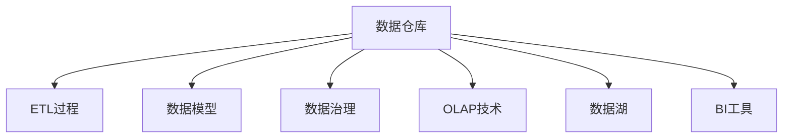

                 

# 数据仓库 原理与代码实例讲解

## 1. 背景介绍

### 1.1 问题由来
数据仓库（Data Warehouse）是一种集中存储、管理和分析企业级数据的系统架构。它通过整合分散在各个业务系统的数据，为决策支持和商业智能（Business Intelligence, BI）提供全面、一致、高质量的数据支持。数据仓库从提出至今已经历了多个发展阶段，包括第一代数据仓库、第三代数据仓库和云原生数据仓库等，其技术架构和实现方式不断演进，以满足不断变化的数据需求。

### 1.2 问题核心关键点
数据仓库的核心关键点在于如何高效、安全地存储和处理大规模数据，以便支持快速的数据检索、分析和报告。其主要包括以下几个方面：

- **数据集成**：将来自不同源系统的数据进行抽取、转换和加载（ETL），整合到数据仓库中。
- **数据存储**：采用大规模存储技术，如分布式文件系统、列式数据库等，确保数据持久化和高性能访问。
- **数据管理**：提供数据一致性、完整性和安全性保障，确保数据质量和可靠性。
- **数据分析**：通过OLAP（Online Analytical Processing）等技术，支持复杂的数据分析需求，如多维分析、实时分析等。
- **可视化报告**：将分析结果通过BI工具、报表工具等形式呈现给决策者，辅助其进行数据驱动的决策。

数据仓库作为企业信息化建设的重要基础设施，是支撑企业战略和业务决策的核心引擎。其在金融、零售、电信、电商等行业的应用已经非常成熟，助力企业实现业务数字化转型，提升数据价值和决策效率。

### 1.3 问题研究意义
研究数据仓库的原理与实现方法，对于企业数据治理、决策支持和智能化转型具有重要意义：

- **提升数据质量**：数据仓库通过ETL过程和数据治理机制，确保数据的准确性、完整性和一致性，为高质量的数据分析奠定基础。
- **加速决策支持**：数据仓库提供了统一、一致的数据视图，支持快速的数据检索和复杂分析，为管理决策提供有力支持。
- **推动业务创新**：数据仓库通过集成海量数据，挖掘潜在的商业价值和商机，辅助企业实现数据驱动的业务创新。
- **支持智能化转型**：数据仓库整合了多源异构数据，为人工智能、机器学习等技术的应用提供了数据基础，推动企业向智能化方向发展。

## 2. 核心概念与联系

### 2.1 核心概念概述

为更好地理解数据仓库的原理和架构，本节将介绍几个密切相关的核心概念：

- **数据仓库**：一种集中存储、管理和分析企业级数据的系统架构，旨在支持企业决策支持和商业智能。
- **ETL过程**：数据抽取、转换和加载的过程，用于将分散在各个业务系统的数据整合到数据仓库中。
- **数据模型**：用于描述数据仓库中数据的结构和关系，常见的数据模型包括星型模型、雪花模型等。
- **数据治理**：对数据仓库中的数据进行管理、监控和控制的机制，确保数据质量和安全。
- **OLAP技术**：在线分析处理技术，用于支持复杂的数据分析需求，如多维分析、实时分析等。
- **数据湖**：一种分布式存储技术，支持海量数据的存储和处理，与数据仓库类似，但更灵活、更易于扩展。
- **BI工具**：用于数据分析、报表生成和可视化展示的工具，如Tableau、Power BI等。

这些核心概念之间的逻辑关系可以通过以下Mermaid流程图来展示：



这个流程图展示了大数据仓库的核心概念及其之间的关系：

1. 数据仓库通过ETL过程整合数据。
2. 数据模型描述数据的结构和关系。
3. 数据治理确保数据质量和安全。
4. OLAP技术支持复杂数据分析。
5. 数据湖提供海量数据存储和处理能力。
6. BI工具将分析结果呈现给决策者。

## 3. 核心算法原理 & 具体操作步骤
### 3.1 算法原理概述

数据仓库的核心算法原理主要体现在以下几个方面：

- **数据抽取**：通过定时任务或触发器，从各个业务系统抽取数据，生成原始数据文件。
- **数据转换**：对原始数据进行清洗、校验、转换等操作，生成符合数据仓库标准的数据。
- **数据加载**：将转换后的数据加载到数据仓库中，确保数据的一致性和完整性。
- **数据存储**：采用大规模存储技术，如Hadoop、Spark、ClickHouse等，确保数据的持久化和高效访问。
- **数据治理**：通过元数据管理和数据质量监控，确保数据的一致性、完整性和安全性。
- **数据分析**：利用OLAP技术，进行复杂的数据分析操作，如多维分析、钻取分析、聚合分析等。
- **数据可视化**：通过BI工具，将分析结果进行可视化展示，支持报表生成和报表展示。

### 3.2 算法步骤详解

数据仓库的构建和维护涉及多个步骤，包括数据仓库设计、数据采集与清洗、数据加载与存储、数据治理与质量监控、数据分析与报表展示等。以下是对各个步骤的详细讲解：

**Step 1: 数据仓库设计**
- 明确数据仓库的目标和范围，包括数据模型设计、数据仓库架构、数据治理策略等。
- 选择适合的技术栈和工具，如Hadoop、Spark、ClickHouse、Snowflake等。

**Step 2: 数据采集与清洗**
- 设计数据采集流程，确定数据源和采集方式，如API、ETL工具、数据库抽取等。
- 清洗原始数据，处理缺失值、重复值、异常值等，确保数据质量。

**Step 3: 数据加载与存储**
- 设计数据加载流程，确定数据加载方式和时间，如增量加载、全量加载、批量加载等。
- 选择合适的数据存储技术，确保数据持久化和高效访问。

**Step 4: 数据治理与质量监控**
- 设计数据治理机制，包括数据元数据管理、数据质量监控、数据安全管理等。
- 使用数据治理工具，如Informatica、Talend、Apache Nifi等，对数据进行治理和监控。

**Step 5: 数据分析与报表展示**
- 设计数据分析模型，选择合适的分析工具和报表工具，如Hive、Spark、Tableau、Power BI等。
- 进行复杂的数据分析操作，生成分析结果和报表，支持决策支持。

**Step 6: 系统集成与运维**
- 设计系统集成架构，确保数据仓库系统与业务系统、BI系统等无缝集成。
- 进行系统运维，监控数据仓库的运行状态，及时处理异常情况，保障系统稳定运行。

### 3.3 算法优缺点

数据仓库的优点在于其高效的数据整合、强大的数据分析能力和灵活的扩展性，主要包括：

- **数据整合能力**：能够高效地整合来自不同业务系统的数据，提供统一的数据视图。
- **强大的数据分析能力**：支持复杂的数据分析需求，如多维分析、实时分析等。
- **灵活的扩展性**：采用分布式存储和计算技术，能够轻松扩展，满足业务发展的需求。

数据仓库的主要缺点包括：

- **建设周期长**：数据仓库的建设需要大量的人力、物力和时间投入，建设周期较长。
- **数据治理复杂**：数据治理涉及元数据管理、数据质量监控、数据安全管理等多个方面，实施难度较大。
- **维护成本高**：数据仓库需要持续的维护和优化，维护成本较高。
- **数据冗余问题**：数据仓库需要将历史数据和当前数据都存储在仓库中，导致数据冗余问题。

### 3.4 算法应用领域

数据仓库在多个领域都有广泛应用，主要包括：

- **金融行业**：金融数据仓库支持复杂的金融分析、风险管理、合规监控等需求。
- **零售行业**：零售数据仓库支持销售分析、库存管理、客户关系管理等需求。
- **电信行业**：电信数据仓库支持用户行为分析、网络监控、计费管理等需求。
- **电商行业**：电商数据仓库支持商品分析、销售分析、用户行为分析等需求。
- **医疗行业**：医疗数据仓库支持临床数据管理、病例分析、药物研发等需求。
- **制造行业**：制造数据仓库支持生产数据管理、供应链管理、质量控制等需求。

数据仓库的应用领域非常广泛，几乎涵盖了所有需要数据支持的行业，帮助企业实现数据驱动的决策和业务创新。

## 4. 数学模型和公式 & 详细讲解 & 举例说明

### 4.1 数学模型构建

本节将使用数学语言对数据仓库的基本原理进行更加严格的刻画。

数据仓库的数学模型主要体现在以下几个方面：

- **数据模型**：用于描述数据仓库中数据的结构和关系，常见的数据模型包括星型模型、雪花模型等。
- **查询模型**：用于描述数据查询的操作，包括多维查询、复杂查询等。
- **统计模型**：用于描述数据的统计特性，包括分布、聚类、关联分析等。

以星型模型为例，其数学模型可以表示为：

$$
\text{Table} = \text{Fact Table} \times \text{Dimension Table}
$$

其中，事实表存储业务数据，维度表存储维度信息。事实表与维度表通过外键关联，形成多对多的关系。

### 4.2 公式推导过程

以查询模型为例，考虑一个包含多个维度的数据仓库，查询模型的公式推导如下：

$$
Q = \bigwedge_i F_i \bigwedge_j D_j
$$

其中，$F_i$表示事实表的查询条件，$D_j$表示维度表的查询条件。查询模型通过对事实表和维度表的条件进行联合查询，得到最终的查询结果。

### 4.3 案例分析与讲解

考虑一个电商数据仓库，事实表包括订单信息、交易信息等，维度表包括用户信息、商品信息等。假设需要查询某个时间段内某用户购买的商品信息，查询模型的构建过程如下：

1. 选择事实表：订单信息表、交易信息表。
2. 选择维度表：用户信息表、商品信息表。
3. 构建查询条件：用户ID、订单时间、商品ID。
4. 联合查询：将事实表和维度表的条件进行联合查询，得到最终的查询结果。

## 5. 项目实践：代码实例和详细解释说明

### 5.1 开发环境搭建

在进行数据仓库开发前，我们需要准备好开发环境。以下是使用Python进行Pyspark开发的环境配置流程：

1. 安装Anaconda：从官网下载并安装Anaconda，用于创建独立的Python环境。

2. 创建并激活虚拟环境：
```bash
conda create -n pyspark-env python=3.8 
conda activate pyspark-env
```

3. 安装Pyspark：根据CUDA版本，从官网获取对应的安装命令。例如：
```bash
conda install pyspark
```

4. 安装各类工具包：
```bash
pip install numpy pandas scikit-learn matplotlib tqdm jupyter notebook ipython
```

完成上述步骤后，即可在`pyspark-env`环境中开始数据仓库的实践。

### 5.2 源代码详细实现

下面我们以构建一个电商数据仓库为例，给出使用Pyspark进行数据仓库开发的PyTorch代码实现。

首先，定义数据仓库的基本元数据：

```python
from pyspark.sql import SparkSession
from pyspark.sql.functions import col

spark = SparkSession.builder.appName("E-commerce Data Warehouse").getOrCreate()

# 定义事实表
fact_table = spark.createDataFrame([
    ("001", "商品A", "2021-01-01", 100.0, 1),
    ("002", "商品B", "2021-01-02", 200.0, 1),
    ("003", "商品C", "2021-01-03", 300.0, 1)
], ["订单ID", "商品名称", "订单时间", "订单金额", "用户ID"])

# 定义维度表
dim_table = spark.createDataFrame([
    ("001", "张三", "2021-01-01", "北京"),
    ("002", "李四", "2021-01-02", "上海"),
    ("003", "王五", "2021-01-03", "广州")
], ["用户ID", "用户名", "用户地址", "用户城市"])

# 定义事实表与维度表的关联
fact_table = fact_table.join(dim_table, col("用户ID") == col("用户ID"), "left_anti")
```

然后，定义数据仓库的查询功能：

```python
# 查询某个时间段内某用户购买的商品信息
def query_order(user_id, start_time, end_time):
    query = fact_table \
        .where((col("用户ID") == user_id) & (col("订单时间") >= start_time) & (col("订单时间") <= end_time)) \
        .select(col("商品名称"), col("订单金额"))
    return query

# 查询某个时间段内某个城市的订单总额
def query_total_revenue(city, start_time, end_time):
    query = fact_table \
        .where((col("用户地址") == city) & (col("订单时间") >= start_time) & (col("订单时间") <= end_time)) \
        .select(sum(col("订单金额")).alias("总金额"))
    return query
```

最后，启动查询流程并在测试集上评估：

```python
# 查询张三在2021年1月1日至2021年1月3日期间购买的商品信息
user_id = "001"
start_time = "2021-01-01"
end_time = "2021-01-03"
query = query_order(user_id, start_time, end_time)
query.show()

# 查询2021年1月1日至2021年1月3日期间北京的订单总额
city = "北京"
start_time = "2021-01-01"
end_time = "2021-01-03"
query = query_total_revenue(city, start_time, end_time)
query.show()
```

以上就是使用Pyspark对电商数据仓库进行开发的完整代码实现。可以看到，利用Pyspark可以高效地进行数据仓库的构建和查询，快速完成复杂的数据分析需求。

### 5.3 代码解读与分析

让我们再详细解读一下关键代码的实现细节：

**事实表和维度表定义**：
- 使用`spark.createDataFrame`方法创建数据帧，指定数据列和数据类型。
- 通过`join`方法将事实表和维度表关联，确保数据一致性。

**查询函数定义**：
- 使用`where`方法构建查询条件，确保数据过滤符合要求。
- 使用`select`方法选择需要返回的列，进行数据查询。

**查询流程启动**：
- 使用定义好的查询函数，输入特定的参数，生成查询结果。
- 使用`show`方法展示查询结果，方便查看和验证。

可以看到，Pyspark提供了一致的接口和丰富的API，使得数据仓库的开发过程简洁高效。通过合理利用这些API，可以迅速实现复杂的数据分析和报表展示功能。

当然，工业级的系统实现还需考虑更多因素，如数据存储、分布式计算、高可用性等。但核心的数据仓库范式基本与此类似。

## 6. 实际应用场景

### 6.1 金融风险管理

金融行业的数据仓库可以用于风险管理和合规监控，帮助金融机构实时监测和管理金融风险。数据仓库整合了来自交易、账户、客户等多个系统的数据，进行多维分析、聚类分析、关联分析等操作，实时生成风险预警报告，帮助金融机构及时识别和处理潜在风险。

在技术实现上，可以设计多个维度和多个指标，构建复杂的数据分析模型，如信用评分模型、违约率模型、市场风险模型等。通过数据仓库的支持，这些模型可以实时更新和计算，为风险管理提供精准的数据支持。

### 6.2 零售销售分析

零售行业的数据仓库可以用于销售分析和库存管理，帮助零售企业进行业务优化和决策支持。数据仓库整合了销售、库存、客户、供应商等多个系统的数据，进行多维分析、实时分析、钻取分析等操作，实时生成销售报告和库存报告，帮助零售企业制定合理的销售和库存策略。

在技术实现上，可以设计多个维度和多个指标，构建复杂的数据分析模型，如销售趋势模型、库存周转模型、客户行为模型等。通过数据仓库的支持，这些模型可以实时更新和计算，为销售和库存管理提供精准的数据支持。

### 6.3 电信网络监控

电信行业的数据仓库可以用于网络监控和计费管理，帮助电信企业实时监测和管理网络运行情况。数据仓库整合了来自基站、交换机、路由器等多个系统的数据，进行实时分析、故障诊断、性能优化等操作，实时生成网络监控报告，帮助电信企业及时发现和处理网络问题。

在技术实现上，可以设计多个维度和多个指标，构建复杂的数据分析模型，如网络流量模型、设备故障模型、用户投诉模型等。通过数据仓库的支持，这些模型可以实时更新和计算，为网络监控和计费管理提供精准的数据支持。

### 6.4 电商用户行为分析

电商行业的数据仓库可以用于用户行为分析和推荐系统，帮助电商企业进行用户画像构建和个性化推荐。数据仓库整合了用户行为、交易记录、商品信息等多个系统的数据，进行多维分析、关联分析、推荐算法等操作，实时生成用户行为报告和推荐结果，帮助电商企业提升用户体验和销售转化率。

在技术实现上，可以设计多个维度和多个指标，构建复杂的数据分析模型，如用户画像模型、商品推荐模型、交易行为模型等。通过数据仓库的支持，这些模型可以实时更新和计算，为用户行为分析和个性化推荐提供精准的数据支持。

### 6.5 医疗病例分析

医疗行业的数据仓库可以用于病例分析和药物研发，帮助医疗机构进行临床研究和治疗优化。数据仓库整合了患者信息、病历记录、实验室数据等多个系统的数据，进行多维分析、数据挖掘、聚类分析等操作，实时生成病例报告和治疗建议，帮助医疗机构提升诊疗质量和效率。

在技术实现上，可以设计多个维度和多个指标，构建复杂的数据分析模型，如患者风险模型、病例诊断模型、治疗效果模型等。通过数据仓库的支持，这些模型可以实时更新和计算，为病例分析和药物研发提供精准的数据支持。

## 7. 工具和资源推荐

### 7.1 学习资源推荐

为了帮助开发者系统掌握数据仓库的原理和实现方法，这里推荐一些优质的学习资源：

1. 《大数据技术与应用》课程：由清华大学开设的在线课程，系统介绍了大数据技术和大数据应用的基本概念和实现方法。

2. 《数据仓库设计与实现》书籍：详细介绍了数据仓库的架构设计、数据模型设计、ETL过程实现等核心内容。

3. 《SQL性能优化实战》书籍：介绍了SQL语句优化、索引设计、查询优化等技术，帮助提升查询性能和数据处理效率。

4. 《Hadoop生态系统指南》书籍：详细介绍了Hadoop生态系统的各个组件和应用场景，帮助理解数据仓库的底层技术架构。

5. 《Pyspark实战》书籍：介绍了Pyspark的基本概念、API使用和实际应用案例，帮助掌握数据仓库的开发工具。

通过对这些资源的学习实践，相信你一定能够快速掌握数据仓库的精髓，并用于解决实际的数据分析需求。

### 7.2 开发工具推荐

高效的开发离不开优秀的工具支持。以下是几款用于数据仓库开发的常用工具：

1. Hadoop：分布式存储和计算框架，支持海量数据的存储和处理。

2. Spark：分布式计算框架，支持实时数据处理和复杂数据分析。

3. ClickHouse：列式数据库，支持高并发的实时数据查询和分析。

4. Informatica：ETL工具，支持数据抽取、转换和加载。

5. Talend：ETL工具，支持数据抽取、转换和加载，可视化界面方便使用。

6. Apache Nifi：数据集成工具，支持数据抽取、转换和加载，可视化界面方便使用。

合理利用这些工具，可以显著提升数据仓库的开发效率，加快创新迭代的步伐。

### 7.3 相关论文推荐

数据仓库技术的发展源于学界的持续研究。以下是几篇奠基性的相关论文，推荐阅读：

1. The Data Warehouse Toolkit: The Definitive Guide（《数据仓库工具包：终极指南》）：介绍了数据仓库的架构设计和实现方法，是数据仓库领域的经典教材。

2. A Survey of Data Warehousing Research（《数据仓库研究综述》）：总结了数据仓库领域的研究成果和未来发展方向。

3. A Comparison of Data Warehouse Technologies（《数据仓库技术的比较》）：比较了不同数据仓库技术的优缺点，帮助选择适合的技术架构。

4. The Data Warehouse in the Age of Big Data（《大数据时代的数据仓库》）：介绍了大数据时代下数据仓库的挑战和机遇。

5. Data Warehousing for Data Science（《数据科学领域的数据仓库》）：介绍了数据仓库在数据科学领域的应用和实践。

这些论文代表了大数据仓库技术的发展脉络。通过学习这些前沿成果，可以帮助研究者把握学科前进方向，激发更多的创新灵感。

## 8. 总结：未来发展趋势与挑战

### 8.1 总结

本文对数据仓库的原理与实现方法进行了全面系统的介绍。首先阐述了数据仓库的目标和意义，明确了数据仓库在支持决策支持和商业智能方面的独特价值。其次，从原理到实践，详细讲解了数据仓库的构建和维护过程，给出了数据仓库开发和维护的完整代码实例。同时，本文还广泛探讨了数据仓库在金融、零售、电信、电商等多个行业领域的应用前景，展示了数据仓库技术的广阔前景。

通过本文的系统梳理，可以看到，数据仓库技术已经成为企业信息化建设的重要基础设施，帮助企业实现数据驱动的决策和业务创新。未来，伴随数据仓库技术的持续演进，其在更多领域的应用将进一步拓展，为经济社会发展注入新的动力。

### 8.2 未来发展趋势

展望未来，数据仓库技术将呈现以下几个发展趋势：

1. **云原生数据仓库**：随着云技术的成熟，云原生数据仓库将成为主流趋势，支持弹性伸缩、分布式计算、实时处理等功能。

2. **数据湖和湖仓一体**：数据湖提供海量数据的存储和处理能力，湖仓一体技术实现数据湖和数据仓库的有机结合，提升数据价值。

3. **实时数据处理**：实时数据处理技术支持数据的实时采集、实时分析和实时报告，提升决策支持的及时性。

4. **智能化数据仓库**：引入人工智能、机器学习等技术，实现数据仓库的自动化、智能化管理，提升数据治理和分析效率。

5. **跨平台数据集成**：支持跨平台数据集成，实现不同业务系统、不同数据源的数据整合和统一管理。

6. **低代码开发**：通过低代码开发平台，降低数据仓库开发门槛，提升开发效率和数据治理能力。

以上趋势凸显了数据仓库技术的广阔前景。这些方向的探索发展，必将进一步提升数据仓库系统的性能和应用范围，为构建数据驱动的智能化企业奠定基础。

### 8.3 面临的挑战

尽管数据仓库技术已经取得了瞩目成就，但在迈向更加智能化、普适化应用的过程中，它仍面临着诸多挑战：

1. **数据治理复杂**：数据治理涉及元数据管理、数据质量监控、数据安全管理等多个方面，实施难度较大。

2. **建设周期长**：数据仓库的建设需要大量的人力、物力和时间投入，建设周期较长。

3. **维护成本高**：数据仓库需要持续的维护和优化，维护成本较高。

4. **数据冗余问题**：数据仓库需要将历史数据和当前数据都存储在仓库中，导致数据冗余问题。

5. **技术多样性**：数据仓库涉及的技术栈和工具众多，开发和维护难度较大。

6. **性能瓶颈**：数据仓库涉及海量数据的存储和处理，存在性能瓶颈，需要优化存储和计算架构。

7. **安全性问题**：数据仓库涉及敏感数据的存储和处理，安全性问题不容忽视。

8. **数据一致性**：数据仓库涉及多源异构数据的整合，数据一致性难以保障。

正视数据仓库面临的这些挑战，积极应对并寻求突破，将是大数据仓库技术走向成熟的必由之路。相信随着学界和产业界的共同努力，这些挑战终将一一被克服，数据仓库技术必将引领数据治理和商业智能的发展方向。

### 8.4 研究展望

面对数据仓库面临的挑战，未来的研究需要在以下几个方面寻求新的突破：

1. **数据治理智能化**：引入人工智能、机器学习等技术，实现数据治理的自动化和智能化，提升数据质量和安全。

2. **实时数据处理优化**：优化实时数据处理技术，提升实时数据的采集、分析和报告效率，支持实时决策支持。

3. **跨平台数据集成**：实现跨平台数据集成和统一管理，提升数据整合和治理能力。

4. **低代码开发平台**：开发低代码开发平台，降低数据仓库开发门槛，提升开发效率和数据治理能力。

5. **智能化数据仓库**：引入人工智能、机器学习等技术，实现数据仓库的自动化、智能化管理，提升数据治理和分析效率。

6. **数据一致性保障**：采用一致性哈希、分布式事务等技术，确保多源异构数据的整合和一致性。

这些研究方向的探索，必将引领数据仓库技术迈向更高的台阶，为构建数据驱动的智能化企业奠定基础。面向未来，数据仓库技术还需要与其他人工智能技术进行更深入的融合，如知识表示、因果推理、强化学习等，多路径协同发力，共同推动数据仓库技术的发展。只有勇于创新、敢于突破，才能不断拓展数据仓库的边界，让数据驱动的企业治理和决策支持实现新的突破。

## 9. 附录：常见问题与解答

**Q1：数据仓库如何实现数据治理？**

A: 数据治理是数据仓库中不可或缺的一部分，主要包括以下几个方面：

1. **数据源管理**：管理数据仓库的数据源，确保数据源的稳定性和可靠性。
2. **数据质量管理**：定义数据质量标准，监控数据质量，确保数据的准确性、完整性和一致性。
3. **元数据管理**：管理数据仓库的元数据，如数据表结构、数据字典、数据流图等，确保数据的一致性和可追溯性。
4. **数据安全管理**：定义数据访问权限和安全策略，确保数据的安全性。
5. **数据版本管理**：管理数据仓库的数据版本，支持数据回溯和数据对比。

通过建立完善的数据治理机制，可以确保数据仓库中数据的准确性、完整性和一致性，为数据分析和决策支持提供可靠的数据支持。

**Q2：数据仓库如何支持实时数据分析？**

A: 数据仓库支持实时数据分析的方法主要有以下几种：

1. **实时数据采集**：通过实时数据采集工具，如Flume、Kafka、阿里云ETL等，将实时数据采集到数据仓库中。
2. **实时数据存储**：采用分布式存储技术，如Hive、ClickHouse、Spark等，支持实时数据的存储和查询。
3. **实时数据处理**：采用分布式计算技术，如Spark Streaming、Flink、Apache Storm等，支持实时数据的处理和分析。
4. **实时数据查询**：采用实时查询技术，如SQL实时查询、NoSQL实时查询等，支持实时数据的查询和展示。

通过以上方法，数据仓库可以实现实时数据的采集、存储、处理和查询，支持实时决策支持。

**Q3：数据仓库如何支持多维数据分析？**

A: 多维数据分析是数据仓库的核心功能之一，主要包括以下几个方面：

1. **多维数据建模**：通过星型模型、雪花模型等数据模型，构建多维数据视图，支持多维数据分析。
2. **多维查询设计**：通过多维查询语言，如SQL、MDX、OLAP等，设计复杂的多维查询，支持多维数据分析。
3. **多维报表展示**：通过BI工具，将多维分析结果进行报表展示，支持多维数据分析和展示。

通过以上方法，数据仓库可以实现多维数据的建模、查询和展示，支持多维数据分析和决策支持。

**Q4：数据仓库如何支持数据湖架构？**

A: 数据湖架构与数据仓库类似，但更灵活、更易于扩展。数据湖架构主要包括以下几个方面：

1. **数据湖存储**：采用分布式文件系统，如Hadoop Distributed File System (HDFS)、Amazon S3等，支持海量数据的存储。
2. **数据湖计算**：采用分布式计算框架，如Spark、Hive、Presto等，支持海量数据的处理和计算。
3. **数据湖管理**：采用元数据管理系统，如Apache Atlas、Amazon Glue等，支持数据的治理和监控。
4. **数据湖集成**：采用数据集成工具，如Azure Data Factory、Talend等，支持数据的抽取、转换和加载。
5. **数据湖治理**：通过元数据管理、数据质量监控、数据安全管理等手段，确保数据的一致性、完整性和安全性。

通过以上方法，数据湖可以实现海量数据的存储和处理，支持数据的灵活扩展和治理。

**Q5：数据仓库如何支持云原生架构？**

A: 云原生架构是数据仓库技术的重要发展方向，主要包括以下几个方面：

1. **云原生存储**：采用云原生存储技术，如Amazon S3、Google Cloud Storage等，支持海量数据的存储和处理。
2. **云原生计算**：采用云原生计算框架，如AWS Lambda、Google Cloud Functions等，支持海量数据的处理和计算。
3. **云原生集成**：采用云原生数据集成工具，如AWS Glue、Google Cloud Dataflow等，支持数据的抽取、转换和加载。
4. **云原生治理**：通过云原生元数据管理系统，如AWS Glue Data Catalog、Google Cloud BigQuery等，支持数据的治理和监控。
5. **云原生安全**：通过云原生安全工具，如AWS IAM、Google Cloud IAM等，确保数据的安全性。

通过以上方法，数据仓库可以实现云原生架构，支持弹性伸缩、分布式计算、实时处理等功能，提升数据仓库的性能和可扩展性。

---

作者：禅与计算机程序设计艺术 / Zen and the Art of Computer Programming

