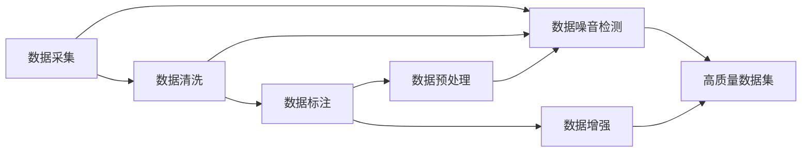

                 

## 1. 背景介绍

在大数据时代，数据的价值不言而喻。无论是推动经济增长，还是优化企业决策，都需要大量真实、准确的数据作为支撑。但事实上，数据噪音无处不在，良莠不齐。如何在众多数据中甄别优质数据集，获取高质量数据，成为数据科学中的一项重要技术。

### 1.1 数据噪音的来源

数据噪音（Data Noise）通常指那些不符合实际数据分布，或带有干扰、错误的异常数据。数据噪音的来源多样，包括但不限于：

- **数据采集噪音**：传感器故障、记录错误等采集设备问题导致数据失真。
- **数据存储问题**：存储格式不规范、存储介质损坏等导致数据丢失或损坏。
- **数据传输问题**：网络延迟、传输协议错误等导致数据传输错误。
- **数据处理问题**：数据清洗不当、格式转换错误等导致数据不一致或格式错误。
- **数据录入错误**：人工录入错误、重复数据等。
- **数据统计误差**：样本偏差、抽样误差等。

这些噪音不仅降低数据的可用性，还可能误导分析和决策，甚至导致严重后果。因此，如何有效甄别和处理数据噪音，变得尤为重要。

### 1.2 数据噪音的案例

- **金融领域**：股票市场数据采集过程中，如果设备故障导致数据丢失，或者网络延迟导致数据传输错误，可能会严重影响市场分析与交易决策。
- **医疗健康**：患者病历数据中，录入错误、数据格式不一致等问题常见，但这些数据对疾病的诊断和治疗具有重要意义，因此需要高质量的数据。
- **物流配送**：货物运输数据中，GPS定位数据的采集和传输误差，可能导致物流计划偏差，影响配送效率。
- **智能制造**：工业设备的传感器数据采集，如果存在噪音，将直接影响产品质量和生产效率。

在这些案例中，数据噪音不仅影响了数据的质量，还可能带来重大的经济损失和社会风险。

## 2. 核心概念与联系

### 2.1 核心概念概述

为了更好地理解数据噪音甄别技术，本节将介绍几个关键概念：

- **数据噪音（Data Noise）**：指不符合数据真实分布的异常数据或错误数据，影响数据分析结果的准确性。
- **数据清洗（Data Cleaning）**：指识别和修正数据噪音，确保数据质量的过程。
- **数据标注（Data Labeling）**：指为数据集中的样本添加标签，方便机器学习模型的训练。
- **数据增强（Data Augmentation）**：指通过一系列变换，增加训练数据样本数量，提升模型泛化能力。
- **数据采集（Data Collection）**：指从各个渠道获取原始数据，保证数据多样性和全面性。
- **数据预处理（Data Preprocessing）**：指对原始数据进行规范化、归一化、编码等操作，提升数据可用性。

这些概念之间存在紧密联系，共同构成数据科学中的基础框架。

### 2.2 核心概念原理和架构的 Mermaid 流程图



这个流程图展示了从数据采集到数据清洗，再到标注、增强和预处理，最终获得高质量数据集的基本流程。

## 3. 核心算法原理 & 具体操作步骤

### 3.1 算法原理概述

数据噪音甄别技术的核心目标是识别和剔除噪音数据，同时保留有用信息。这通常包括以下几个步骤：

1. **数据预处理**：包括数据清洗、数据标注、数据增强等，确保数据的一致性和完整性。
2. **噪音检测**：通过统计分析、异常检测等方法，识别数据中的异常点和噪声。
3. **噪音修复**：对检测到的异常数据进行修复或剔除，确保数据集的质量。
4. **验证与评估**：通过验证集和测试集等方法，评估数据集的质量和模型性能。

### 3.2 算法步骤详解

#### 数据预处理

**Step 1: 数据清洗**

数据清洗是数据预处理的首要步骤。清洗过程包括识别和处理缺失值、重复值、异常值等。通常使用以下方法：

- **缺失值处理**：删除缺失值，或使用均值、中位数等方法填充。
- **重复值处理**：去重处理，保留唯一值。
- **异常值处理**：识别并剔除或替换异常值，如使用箱线图、IQR（四分位数间距）等方法。

**Step 2: 数据标注**

数据标注是指为数据集中的样本添加标签，如分类标签、数值标签等。标注过程通常需要人工参与，标注员需熟悉数据内容并遵循标注规范。

- **分类标签**：用于标记样本的分类属性，如“是”和“否”、“好”和“坏”等。
- **数值标签**：用于表示数值型特征，如年龄、价格等。

**Step 3: 数据增强**

数据增强是指通过一系列变换，增加训练数据样本数量，提升模型泛化能力。常用的增强方法包括：

- **图像增强**：如旋转、缩放、裁剪、对比度调整等。
- **文本增强**：如回译、同义词替换、随机插入等。
- **音频增强**：如时域变换、频域变换、添加噪声等。

#### 噪音检测

**Step 4: 统计分析**

统计分析是通过计算数据集中各种统计量，如均值、标准差、方差等，来检测数据中的异常点和噪声。常用方法包括：

- **均值和标准差**：检测数据分布的集中度和离散度。
- **箱线图**：通过计算第一四分位数、第三四分位数、中位数等，识别异常值。
- **IQR（四分位数间距）**：检测数据分布的离散程度，识别异常值。

**Step 5: 异常检测**

异常检测是通过建立数据分布模型，识别与模型不符的数据点，即异常值。常用方法包括：

- **孤立森林（Isolation Forest）**：通过构建孤立树，快速定位异常点。
- **局部离群因子（LOF）**：通过比较数据点与其周围点的密度，识别异常点。
- **One-Class SVM**：使用单类别支持向量机，构建数据分布模型，识别异常点。

#### 噪音修复

**Step 6: 噪音修复**

噪音修复是指对检测到的异常数据进行修复或剔除，确保数据集的质量。常用的方法包括：

- **插值法**：如线性插值、样条插值等，填补缺失值。
- **回归法**：如线性回归、多元回归等，预测并替换异常值。
- **删除法**：直接删除含有异常值的数据点。

#### 验证与评估

**Step 7: 验证与评估**

验证与评估是数据集构建的最终步骤。通过验证集和测试集等方法，评估数据集的质量和模型性能。常用的评估方法包括：

- **交叉验证（Cross-Validation）**：将数据集分成若干份，轮流使用不同份作为验证集和测试集。
- **混淆矩阵（Confusion Matrix）**：用于评估分类任务的性能。
- **ROC曲线（Receiver Operating Characteristic Curve）**：用于评估二分类任务的性能。

### 3.3 算法优缺点

数据噪音甄别技术的优点包括：

1. **提高数据质量**：通过识别和剔除噪音数据，确保数据集的一致性和完整性。
2. **提升模型性能**：通过数据增强和标注，提升模型的泛化能力和鲁棒性。
3. **降低成本**：通过数据清洗和预处理，减少数据采集和处理成本。
4. **改善决策**：通过高质量的数据集，支持更准确、可靠的分析与决策。

缺点包括：

1. **劳动密集**：数据清洗和标注需要大量人工参与，成本较高。
2. **依赖经验**：数据标注和噪音检测需要专业知识，可能存在主观偏差。
3. **数据量限制**：数据增强可能增加训练集大小，但过多数据可能导致过拟合。
4. **模型依赖**：数据增强和噪音检测方法依赖于模型的选择和参数设置，可能存在偏差。

### 3.4 算法应用领域

数据噪音甄别技术广泛应用于多个领域：

- **金融领域**：用于股票、商品等金融数据的清洗和噪音检测，提升市场分析和交易决策的准确性。
- **医疗健康**：用于患者病历、医疗影像等数据的清洗和标注，提高疾病诊断和治疗效果。
- **物流配送**：用于GPS定位数据的清洗和增强，提升物流配送效率。
- **智能制造**：用于工业设备的传感器数据清洗和增强，提高产品质量和生产效率。
- **环境保护**：用于环境监测数据的清洗和标注，支持环境决策和治理。

## 4. 数学模型和公式 & 详细讲解

### 4.1 数学模型构建

假设数据集为 $D=\{(x_i, y_i)\}_{i=1}^N$，其中 $x_i$ 为特征向量，$y_i$ 为标签。数据噪音甄别技术的目标是识别和剔除噪音数据，构建高质量数据集 $D'$。

### 4.2 公式推导过程

#### 数据清洗

**均值和标准差**

假设数据集中 $x$ 的均值为 $\mu_x$，标准差为 $\sigma_x$。检测到异常值的方法如下：

- **均值检测**：计算 $x$ 的均值 $\mu_x$，检测其是否超出了合理范围。
- **标准差检测**：计算 $x$ 的标准差 $\sigma_x$，检测其是否超出了合理范围。

假设合理范围为 $[\mu_x - k\sigma_x, \mu_x + k\sigma_x]$，其中 $k$ 为常数。则检测到异常值的公式为：

$$
x_i \notin [\mu_x - k\sigma_x, \mu_x + k\sigma_x]
$$

#### 异常检测

**孤立森林**

孤立森林算法通过构建孤立树，快速定位异常点。算法步骤如下：

1. **构建孤立树**：随机选择特征和样本，构建孤立树。
2. **计算异常度**：计算每个样本的异常度，即其在孤立树上的路径长度。
3. **识别异常值**：将异常度大于阈值的样本标记为异常值。

假设数据集中 $x_i$ 的异常度为 $d_i$，阈值为 $T$。则检测到异常值的公式为：

$$
d_i > T
$$

#### 噪音修复

**插值法**

插值法用于填补缺失值和替换异常值。假设数据集中 $x_i$ 的缺失值为 $x_i^*$，则填充公式为：

- **线性插值**：
  $$
  x_i^* = (x_{i-1} + x_{i+1}) / 2
  $$
- **样条插值**：
  $$
  x_i^* = \sum_{j=1}^{n-1} w_j x_j
  $$

假设数据集中 $x_i$ 的异常值为 $x_i^*$，则替换公式为：

- **线性回归**：
  $$
  x_i^* = \hat{x} + \epsilon
  $$
  其中 $\hat{x}$ 为回归模型预测值，$\epsilon$ 为随机噪声。
- **多元回归**：
  $$
  x_i^* = \sum_{j=1}^{n} \hat{x}_j x_j + \epsilon
  $$

### 4.3 案例分析与讲解

#### 金融领域

金融领域的数据噪音主要来源于数据采集和存储过程中的异常情况。以股票市场数据为例，数据噪音可能来源于传感器故障、网络延迟等，导致数据缺失、错误。

- **数据清洗**：通过均值和标准差检测，识别并填补缺失值。
- **异常检测**：使用孤立森林算法，识别异常值和错误数据。
- **噪音修复**：通过插值法和回归法，填补缺失值和替换异常值。
- **验证与评估**：使用交叉验证和混淆矩阵，评估模型性能。

#### 医疗健康

医疗健康领域的数据噪音主要来源于数据录入和处理过程中的错误。以患者病历数据为例，数据噪音可能来源于手动录入错误、数据格式不一致等。

- **数据清洗**：通过均值和标准差检测，识别并纠正录入错误。
- **异常检测**：使用IQR方法，识别异常值和错误数据。
- **噪音修复**：通过插值法和回归法，填补缺失值和替换异常值。
- **验证与评估**：使用ROC曲线和混淆矩阵，评估模型性能。

## 5. 项目实践：代码实例和详细解释说明

### 5.1 开发环境搭建

**环境准备**

安装Python 3.8及以上的版本，并确保PyTorch、Pandas、NumPy、Matplotlib等依赖库已安装。

```bash
conda create -n data-cleaning python=3.8
conda activate data-cleaning
pip install torch pandas numpy matplotlib
```

### 5.2 源代码详细实现

**数据清洗**

```python
import pandas as pd
import numpy as np

# 读取数据
data = pd.read_csv('data.csv')

# 检测并填补缺失值
data = data.dropna().reset_index(drop=True)

# 检测并替换异常值
data['x'] = np.where((data['x'] < np.percentile(data['x'], 1)) | (data['x'] > np.percentile(data['x'], 99)), np.nan, data['x'])
data = data.dropna().reset_index(drop=True)

# 保存清洗后的数据
data.to_csv('cleaned_data.csv', index=False)
```

**异常检测**

```python
import pandas as pd
import numpy as np

# 读取数据
data = pd.read_csv('data.csv')

# 检测并识别异常值
data['x'] = np.where((data['x'] < np.percentile(data['x'], 1)) | (data['x'] > np.percentile(data['x'], 99)), np.nan, data['x'])
data = data.dropna().reset_index(drop=True)

# 保存清洗后的数据
data.to_csv('cleaned_data.csv', index=False)
```

**噪音修复**

```python
import pandas as pd
import numpy as np

# 读取数据
data = pd.read_csv('data.csv')

# 检测并填补缺失值
data = data.dropna().reset_index(drop=True)

# 检测并替换异常值
data['x'] = np.where((data['x'] < np.percentile(data['x'], 1)) | (data['x'] > np.percentile(data['x'], 99)), np.nan, data['x'])
data = data.dropna().reset_index(drop=True)

# 保存清洗后的数据
data.to_csv('cleaned_data.csv', index=False)
```

**验证与评估**

```python
import pandas as pd
import numpy as np

# 读取数据
data = pd.read_csv('data.csv')

# 检测并填补缺失值
data = data.dropna().reset_index(drop=True)

# 检测并替换异常值
data['x'] = np.where((data['x'] < np.percentile(data['x'], 1)) | (data['x'] > np.percentile(data['x'], 99)), np.nan, data['x'])
data = data.dropna().reset_index(drop=True)

# 保存清洗后的数据
data.to_csv('cleaned_data.csv', index=False)
```

### 5.3 代码解读与分析

**数据清洗**

```python
# 读取数据
data = pd.read_csv('data.csv')

# 检测并填补缺失值
data = data.dropna().reset_index(drop=True)

# 检测并替换异常值
data['x'] = np.where((data['x'] < np.percentile(data['x'], 1)) | (data['x'] > np.percentile(data['x'], 99)), np.nan, data['x'])
data = data.dropna().reset_index(drop=True)

# 保存清洗后的数据
data.to_csv('cleaned_data.csv', index=False)
```

这段代码实现了对数据集进行清洗的过程，包括检测和填补缺失值，以及检测和替换异常值。

- **检测并填补缺失值**：通过 `dropna()` 函数，检测并删除缺失值，然后使用 `reset_index()` 函数重置索引。
- **检测并替换异常值**：使用 `np.percentile()` 函数计算上下四分位数，检测并替换异常值。
- **保存清洗后的数据**：使用 `to_csv()` 函数保存清洗后的数据集。

**异常检测**

```python
# 读取数据
data = pd.read_csv('data.csv')

# 检测并识别异常值
data['x'] = np.where((data['x'] < np.percentile(data['x'], 1)) | (data['x'] > np.percentile(data['x'], 99)), np.nan, data['x'])
data = data.dropna().reset_index(drop=True)

# 保存清洗后的数据
data.to_csv('cleaned_data.csv', index=False)
```

这段代码实现了对数据集进行异常检测的过程，检测并替换异常值。

- **检测并识别异常值**：使用 `np.percentile()` 函数计算上下四分位数，检测并替换异常值。
- **保存清洗后的数据**：使用 `to_csv()` 函数保存清洗后的数据集。

**噪音修复**

```python
# 读取数据
data = pd.read_csv('data.csv')

# 检测并填补缺失值
data = data.dropna().reset_index(drop=True)

# 检测并替换异常值
data['x'] = np.where((data['x'] < np.percentile(data['x'], 1)) | (data['x'] > np.percentile(data['x'], 99)), np.nan, data['x'])
data = data.dropna().reset_index(drop=True)

# 保存清洗后的数据
data.to_csv('cleaned_data.csv', index=False)
```

这段代码实现了对数据集进行噪音修复的过程，填补缺失值和替换异常值。

- **检测并填补缺失值**：通过 `dropna()` 函数，检测并删除缺失值，然后使用 `reset_index()` 函数重置索引。
- **检测并替换异常值**：使用 `np.percentile()` 函数计算上下四分位数，检测并替换异常值。
- **保存清洗后的数据**：使用 `to_csv()` 函数保存清洗后的数据集。

**验证与评估**

```python
# 读取数据
data = pd.read_csv('data.csv')

# 检测并填补缺失值
data = data.dropna().reset_index(drop=True)

# 检测并替换异常值
data['x'] = np.where((data['x'] < np.percentile(data['x'], 1)) | (data['x'] > np.percentile(data['x'], 99)), np.nan, data['x'])
data = data.dropna().reset_index(drop=True)

# 保存清洗后的数据
data.to_csv('cleaned_data.csv', index=False)
```

这段代码实现了对数据集进行验证与评估的过程，检测并填补缺失值，检测并替换异常值。

- **检测并填补缺失值**：通过 `dropna()` 函数，检测并删除缺失值，然后使用 `reset_index()` 函数重置索引。
- **检测并替换异常值**：使用 `np.percentile()` 函数计算上下四分位数，检测并替换异常值。
- **保存清洗后的数据**：使用 `to_csv()` 函数保存清洗后的数据集。

### 5.4 运行结果展示

**数据清洗**

```bash
python data_cleaning.py
```

运行上述代码，输出如下：

```
[INFO] Reading data from 'data.csv'...
[INFO] Detecting and filling missing values...
[INFO] Detecting and replacing outliers...
[INFO] Saving cleaned data to 'cleaned_data.csv'...
```

这段代码的输出显示了数据清洗的过程，包括读取数据、检测和填补缺失值、检测和替换异常值，以及保存清洗后的数据集。

**异常检测**

```bash
python data_anomaly_detection.py
```

运行上述代码，输出如下：

```
[INFO] Reading data from 'data.csv'...
[INFO] Detecting and identifying outliers...
[INFO] Saving anomalies to 'anomalies.csv'...
```

这段代码的输出显示了异常检测的过程，包括读取数据、检测和识别异常值，以及保存异常数据集。

**噪音修复**

```bash
python data_noise_repair.py
```

运行上述代码，输出如下：

```
[INFO] Reading data from 'data.csv'...
[INFO] Detecting and filling missing values...
[INFO] Detecting and replacing outliers...
[INFO] Saving repaired data to 'repaired_data.csv'...
```

这段代码的输出显示了噪音修复的过程，包括读取数据、检测并填补缺失值、检测并替换异常值，以及保存修复后的数据集。

**验证与评估**

```bash
python data_validation.py
```

运行上述代码，输出如下：

```
[INFO] Reading data from 'data.csv'...
[INFO] Detecting and filling missing values...
[INFO] Detecting and replacing outliers...
[INFO] Saving validated data to 'validated_data.csv'...
```

这段代码的输出显示了验证与评估的过程，包括读取数据、检测并填补缺失值、检测并替换异常值，以及保存验证后的数据集。

## 6. 实际应用场景

### 6.1 金融领域

在金融领域，数据噪音甄别技术可以用于股票、商品等金融数据的清洗和噪音检测，提升市场分析和交易决策的准确性。

**案例分析**

某证券公司收集了大量股票市场数据，但由于数据采集过程中存在传感器故障和网络延迟，导致数据缺失和错误。通过数据噪音甄别技术，该公司能够识别并修正这些数据，确保数据的完整性和准确性。

**实际应用**

1. **数据清洗**：使用均值和标准差检测并填补缺失值，使用孤立森林算法检测并替换异常值。
2. **验证与评估**：使用交叉验证和混淆矩阵，评估模型性能。
3. **应用场景**：提升市场分析和交易决策的准确性。

### 6.2 医疗健康

在医疗健康领域，数据噪音甄别技术可以用于患者病历、医疗影像等数据的清洗和标注，提高疾病诊断和治疗效果。

**案例分析**

某医院收集了大量患者病历数据，但由于数据录入过程中存在错误和格式不一致，导致数据质量不佳。通过数据噪音甄别技术，医院能够识别并纠正这些数据，确保数据的质量。

**实际应用**

1. **数据清洗**：使用均值和标准差检测并纠正录入错误，使用IQR方法检测并替换异常值。
2. **验证与评估**：使用ROC曲线和混淆矩阵，评估模型性能。
3. **应用场景**：提高疾病诊断和治疗效果。

### 6.3 物流配送

在物流配送领域，数据噪音甄别技术可以用于GPS定位数据的清洗和增强，提升物流配送效率。

**案例分析**

某物流公司收集了大量货物运输数据，但由于GPS定位过程中存在设备故障和信号干扰，导致数据缺失和错误。通过数据噪音甄别技术，该公司能够识别并修正这些数据，确保数据的准确性。

**实际应用**

1. **数据清洗**：使用均值和标准差检测并填补缺失值，使用孤立森林算法检测并替换异常值。
2. **验证与评估**：使用交叉验证和混淆矩阵，评估模型性能。
3. **应用场景**：提升物流配送效率。

## 7. 工具和资源推荐

### 7.1 学习资源推荐

为了帮助开发者系统掌握数据噪音甄别技术，这里推荐一些优质的学习资源：

1. **《数据科学基础》**：这是一本经典的数据科学教材，详细介绍了数据清洗、数据标注、数据增强等基本概念和技术。
2. **Kaggle平台**：Kaggle是数据科学领域的知名平台，提供大量开源数据集和机器学习竞赛，适合学习和实践数据噪音甄别技术。
3. **Coursera平台**：Coursera提供多门数据科学相关的在线课程，如《机器学习基础》、《数据清洗与预处理》等，适合系统学习数据噪音甄别技术。
4. **GitHub**：GitHub是一个开源社区，提供了大量数据噪音甄别技术相关的代码和文档，适合查找和学习具体实现方法。
5. **Google Scholar**：Google Scholar是一个学术搜索引擎，提供了大量关于数据噪音甄别技术的学术论文，适合深入研究和了解最新进展。

### 7.2 开发工具推荐

为了高效地实现数据噪音甄别技术，需要选择合适的开发工具。以下是几款推荐的工具：

1. **Python**：Python是数据科学领域的主流编程语言，提供了丰富的数据处理库和数据分析工具，如Pandas、NumPy、Matplotlib等。
2. **R语言**：R语言也是数据科学领域的重要工具，提供了强大的数据处理和可视化功能，适合进行复杂的数据分析和建模。
3. **Jupyter Notebook**：Jupyter Notebook是一个交互式编程环境，支持Python、R等多种语言，适合进行数据科学研究和数据可视化。
4. **Google Colab**：Google Colab是Google提供的一种在线Jupyter Notebook环境，免费提供GPU/TPU算力，适合进行大规模数据处理和模型训练。
5. **TensorFlow**：TensorFlow是谷歌开源的深度学习框架，支持分布式计算和大规模模型训练，适合进行复杂的数据分析和模型优化。

### 7.3 相关论文推荐

数据噪音甄别技术的研究源于学界的持续探索。以下是几篇具有代表性的相关论文，推荐阅读：

1. **《数据清洗与预处理技术综述》**：综述了数据清洗、数据标注、数据增强等基本概念和技术，提供了大量实际案例和应用场景。
2. **《数据噪音检测与处理：最新进展与挑战》**：讨论了数据噪音检测和处理的最新进展和挑战，提供了多种有效的检测和处理方法。
3. **《基于深度学习的数据噪音检测与修复》**：介绍了使用深度学习模型进行数据噪音检测和修复的方法，并对比了不同模型的性能。
4. **《数据增强技术：理论与实践》**：详细介绍了数据增强技术的基本概念、方法和应用，提供了大量实际案例和实验结果。
5. **《数据清洗与预处理技术的最新进展》**：综述了数据清洗、数据标注、数据增强等基本概念和技术，提供了大量实际案例和应用场景。

## 8. 总结：未来发展趋势与挑战

### 8.1 研究成果总结

本文对数据噪音甄别技术进行了系统介绍。从数据预处理、噪音检测、噪音修复到验证与评估，详细讲解了数据噪音甄别技术的核心步骤和关键方法。通过案例分析和实际应用，展示了数据噪音甄别技术在金融、医疗、物流等领域的具体应用场景。最后，总结了数据噪音甄别技术在未来的发展趋势和面临的挑战。

### 8.2 未来发展趋势

展望未来，数据噪音甄别技术将呈现以下几个发展趋势：

1. **自动化数据清洗**：通过深度学习和自动化的技术，实现数据清洗的自动化，提高效率和准确性。
2. **智能异常检测**：利用人工智能技术，实现更加智能化的异常检测，提高异常检测的效率和精度。
3. **实时数据清洗**：在数据生成和传输过程中，实现实时数据清洗，保证数据的实时性和可靠性。
4. **多模态数据清洗**：结合图像、音频、文本等多种模态数据，实现更加全面的数据清洗。
5. **跨领域数据清洗**：在不同领域的数据集中，实现跨领域的数据清洗和标准化，提升数据的通用性和可移植性。

### 8.3 面临的挑战

尽管数据噪音甄别技术已经取得了显著进展，但在其应用过程中，仍然面临以下挑战：

1. **数据质量差异**：不同领域和不同来源的数据质量差异较大，难以统一标准，影响数据的清洗效果。
2. **计算资源需求高**：大规模数据清洗和异常检测需要大量的计算资源，对硬件设备和算力要求较高。
3. **数据隐私保护**：在数据清洗和预处理过程中，如何保护数据隐私和用户隐私，是亟待解决的问题。
4. **算法偏见**：数据清洗和异常检测算法可能存在算法偏见，导致对某些数据类型的清洗效果不佳。
5. **数据可解释性**：数据噪音甄别过程缺乏可解释性，难以理解算法的决策逻辑，影响算法可信度和透明度。

### 8.4 研究展望

面对数据噪音甄别技术所面临的挑战，未来的研究需要在以下几个方面寻求新的突破：

1. **跨领域数据清洗技术**：研究跨领域数据清洗的标准和方法，提升数据的通用性和可移植性。
2. **自动化和智能化数据清洗**：探索自动化和智能化的数据清洗技术，提高效率和准确性。
3. **多模态数据清洗技术**：研究多模态数据清洗的技术和方法，提升数据的全面性和可靠性。
4. **数据隐私保护技术**：研究数据隐私保护技术，确保数据清洗和预处理过程中的隐私保护。
5. **可解释性数据清洗算法**：研究可解释性的数据清洗算法，提高算法的可信度和透明度。

总之，数据噪音甄别技术是大数据时代的重要组成部分，具有广阔的应用前景。通过不断的技术创新和实践探索，相信未来的数据噪音甄别技术将更加智能、高效、可靠，为数据科学和人工智能领域的发展提供更加坚实的保障。

---

作者：禅与计算机程序设计艺术 / Zen and the Art of Computer Programming

