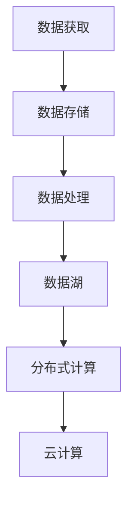

                 

# 数据获取成本越来越低，软件2.0的春天来了

> 关键词：数据获取，数据成本，软件2.0，人工智能，大数据，数据湖，分布式计算，云计算，数据存储

## 1. 背景介绍

### 1.1 问题由来

在过去的几十年里，数据获取和处理一直是企业数字化转型的重要障碍。随着互联网的普及和移动互联网的兴起，企业获取数据的成本越来越低，但同时数据量也变得前所未有的大。据国际数据公司IDC估计，全球数据量将在2025年达到175ZB（1ZB=10的12次方字节）。在这个数据时代，如何高效地存储、处理、分析这些海量数据，成为了每一个企业必须面对的挑战。

数据获取成本的降低，为软件2.0的到来提供了契机。软件2.0是指通过数据驱动的方式，让软件系统具备更高的智能、自动化和用户参与度。与传统以功能为中心的软件1.0不同，软件2.0强调以数据为中心，通过数据来优化产品设计、改进用户体验、增强决策支持，从而带来更强的竞争力。

### 1.2 问题核心关键点

数据获取成本的降低，让企业能够以更低的成本获取更多的数据，从而在以下几个方面带来了革命性的变化：

1. **海量数据的存储和处理**：随着存储成本的降低和计算能力的提升，企业能够存储和处理更多、更大规模的数据，为软件2.0的实现提供了基础。

2. **实时数据的处理和分析**：实时数据流技术的发展，使得企业可以实时获取和分析数据，及时做出响应。这对于市场动态分析、用户行为预测等方面具有重要意义。

3. **数据的共享和集成**：企业内部数据孤岛现象的减少，使得数据可以更高效地共享和集成，加速了跨部门、跨业务的数据融合。

4. **数据驱动的决策**：通过数据驱动的方式，企业能够更好地理解市场和用户需求，做出更加科学的决策。

5. **用户数据的个性化**：利用用户数据，企业可以为用户提供更加个性化的服务和产品，提升用户体验。

6. **AI和大数据技术的普及**：随着AI和大数据技术的普及，企业能够更轻松地从海量数据中提取有价值的信息，提升业务的智能化水平。

## 2. 核心概念与联系

### 2.1 核心概念概述

为更好地理解软件2.0的数据获取和处理技术，本节将介绍几个关键的概念：

- **数据获取**：指从外部或内部系统获取数据的过程，是软件2.0的基础。
- **数据存储**：指将数据存储在分布式文件系统、数据库等存储系统中的过程，是软件2.0的关键支撑。
- **数据处理**：指对数据进行清洗、转换、分析等处理过程，是软件2.0的核心技术之一。
- **数据湖**：指将企业所有的数据都存储在一个分布式文件系统中，支持各种数据类型和格式的存储。
- **分布式计算**：指将数据处理任务分散到多个计算节点上并行处理，以提高处理效率和可靠性。
- **云计算**：指将数据处理、存储等资源作为服务，通过互联网提供给用户使用，降低企业成本。

这些核心概念之间的逻辑关系可以通过以下Mermaid流程图来展示：



这个流程图展示了大数据技术栈的主要组件及其关系：

1. 数据获取是数据处理的起点。
2. 数据存储是数据处理的中间环节。
3. 数据处理是数据的核心价值来源。
4. 数据湖提供了一个全局数据管理平台。
5. 分布式计算提供了高效的数据处理能力。
6. 云计算提供了灵活的资源部署方式。

## 3. 核心算法原理 & 具体操作步骤
### 3.1 算法原理概述

软件2.0的数据获取和处理技术，本质上是基于分布式计算和云计算的数据存储和处理技术。其核心思想是：将数据存储在分布式文件系统中，通过分布式计算框架进行高效的数据处理，并利用云计算资源提供灵活的资源部署和计算能力。

具体而言，数据获取、存储、处理的过程大致可以分为以下几个步骤：

1. **数据获取**：从外部或内部系统获取数据，可以是结构化数据（如SQL数据库、Excel表格）或非结构化数据（如文本、图片、视频等）。

2. **数据存储**：将获取的数据存储在分布式文件系统（如HDFS、S3）或数据库（如MySQL、Hive）中。

3. **数据处理**：对存储的数据进行清洗、转换、分析等处理，可以采用ETL工具（如Apache Nifi、Talend）或编程语言（如Python、Java）进行。

4. **数据湖构建**：构建一个统一的数据湖平台，支持多种数据类型和格式的存储，提供数据共享和集成的能力。

5. **分布式计算**：使用分布式计算框架（如Apache Spark、Apache Flink）进行数据处理，提高计算效率和可靠性。

6. **云计算部署**：将数据处理、存储等资源作为服务，通过云计算平台（如AWS、阿里云、腾讯云）提供给用户使用，降低企业成本。

### 3.2 算法步骤详解

以下将详细介绍数据获取和处理的每个步骤的具体操作：

**Step 1: 数据获取**

- **外部数据获取**：通过API接口、爬虫等方式从外部系统获取数据，如社交媒体、电商平台、金融市场等。
- **内部数据获取**：从企业内部的各个系统（如ERP、CRM、HR等）获取数据，可以使用ETL工具进行抽取、转换和加载。

**Step 2: 数据存储**

- **选择数据存储方式**：根据数据类型和业务需求，选择合适的数据存储方式，如HDFS、S3、MySQL、Hive等。
- **数据存储设计**：设计数据存储架构，包括数据分区、复制、备份等，保证数据的可靠性和可用性。

**Step 3: 数据处理**

- **数据清洗**：去除重复、缺失、异常数据，进行数据格式转换。
- **数据转换**：将原始数据转换为适合分析的格式，如从JSON转换为SQL表。
- **数据分析**：使用统计分析、机器学习等方法对数据进行分析，提取有价值的信息。

**Step 4: 数据湖构建**

- **构建数据湖平台**：搭建一个统一的数据湖平台，支持多种数据类型和格式的存储，提供数据共享和集成的能力。
- **数据湖管理**：设计数据湖的元数据管理、数据治理机制，保证数据的质量和一致性。

**Step 5: 分布式计算**

- **选择计算框架**：选择合适的分布式计算框架，如Apache Spark、Apache Flink等。
- **数据分区**：根据数据特征，设计数据分区策略，提高数据处理效率。
- **并行计算**：使用分布式计算框架进行并行计算，提高数据处理能力。

**Step 6: 云计算部署**

- **选择云计算平台**：根据企业需求，选择合适的云计算平台，如AWS、阿里云、腾讯云等。
- **云资源部署**：在云计算平台上部署数据处理、存储等资源，提供弹性伸缩的能力。

### 3.3 算法优缺点

软件2.0的数据获取和处理技术具有以下优点：

1. **成本低廉**：利用云计算资源，企业可以按需使用，避免一次性投入大量硬件设施。
2. **计算高效**：分布式计算框架可以高效处理大规模数据，提高数据处理速度。
3. **数据可靠**：分布式存储和计算可以提高数据可靠性和可用性，避免单点故障。
4. **灵活可扩展**：云计算平台可以根据需求进行弹性伸缩，满足企业的业务需求。

但同时，该技术也存在一些缺点：

1. **数据隐私和安全**：数据存储在云端，可能面临数据泄露和隐私保护的问题。
2. **复杂度增加**：分布式计算和存储增加了系统的复杂度，对运维能力提出更高的要求。
3. **数据处理延迟**：分布式计算可能引入数据处理延迟，影响实时数据处理。
4. **数据质量控制**：分布式计算和存储增加了数据质量控制的难度，需要设计更多元数据管理机制。

## 4. 数学模型和公式 & 详细讲解 & 举例说明

### 4.1 数学模型构建

为更好地理解数据获取和处理技术的数学模型，本节将给出一些基本的数学公式和模型构建思路。

假设有一个企业需要处理海量用户数据，构建数据湖平台，并使用Apache Spark进行分布式计算。数据湖中存储的原始数据为$D$，数据处理后的结果为$R$。数据处理的流程可以表示为：

$$
R = f(D)
$$

其中$f$为数据处理函数，可以是ETL工具、编程语言等。

### 4.2 公式推导过程

以下将详细介绍数据获取和处理的数学模型：

**数据获取**

假设从外部系统获取的数据量为$D_{ext}$，从内部系统获取的数据量为$D_{int}$，则总数据量为：

$$
D = D_{ext} + D_{int}
$$

**数据存储**

假设使用HDFS进行数据存储，将数据划分为$k$个分片，每个分片大小为$\frac{D}{k}$，则数据存储的数学模型为：

$$
S = k \cdot \frac{D}{k} = D
$$

其中$S$为存储容量。

**数据处理**

假设使用Apache Spark进行数据处理，将数据分为$m$个分区，每个分区大小为$\frac{D}{m}$，则数据处理的数学模型为：

$$
R = f(D)
$$

其中$f$为数据处理函数，可以是ETL工具、编程语言等。

**数据湖构建**

假设数据湖平台支持$n$种数据类型，每种数据类型对应的存储容量为$C_i$，则数据湖的总体存储容量为：

$$
S_{lake} = \sum_{i=1}^n C_i
$$

**分布式计算**

假设使用Apache Spark进行分布式计算，将数据处理任务分为$p$个节点进行并行计算，每个节点的计算能力为$C_p$，则分布式计算的数学模型为：

$$
R = \frac{D}{p} \cdot C_p
$$

### 4.3 案例分析与讲解

以下将以一个实际的案例来讲解数据获取和处理的具体过程。

**案例背景**

某电商平台需要处理大量用户数据，包括用户行为数据、交易数据、评论数据等，以优化推荐算法和提高用户满意度。

**数据获取**

1. **外部数据获取**：通过API接口从社交媒体获取用户评论数据。
2. **内部数据获取**：从电商平台的交易系统获取用户交易数据，从用户数据库获取用户行为数据。

**数据存储**

1. **选择存储方式**：选择HDFS进行数据存储。
2. **数据分区**：根据用户ID进行数据分区，每个分区存储同一个用户的数据。

**数据处理**

1. **数据清洗**：去除重复、缺失、异常数据，进行数据格式转换。
2. **数据分析**：使用机器学习算法进行用户行为分析，提取有价值的信息。

**数据湖构建**

1. **构建数据湖平台**：搭建一个统一的数据湖平台，支持多种数据类型和格式的存储，提供数据共享和集成的能力。
2. **数据湖管理**：设计数据湖的元数据管理、数据治理机制，保证数据的质量和一致性。

**分布式计算**

1. **选择计算框架**：选择Apache Spark进行分布式计算。
2. **数据分区**：根据用户ID进行数据分区，每个分区存储同一个用户的数据。
3. **并行计算**：使用Apache Spark进行并行计算，提高数据处理速度。

**云计算部署**

1. **选择云计算平台**：选择阿里云进行数据处理、存储等资源的部署。
2. **云资源部署**：在阿里云上部署数据处理、存储等资源，提供弹性伸缩的能力。

## 5. 项目实践：代码实例和详细解释说明

### 5.1 开发环境搭建

在进行数据获取和处理项目实践前，我们需要准备好开发环境。以下是使用Python进行Apache Spark开发的环境配置流程：

1. 安装Anaconda：从官网下载并安装Anaconda，用于创建独立的Python环境。

2. 创建并激活虚拟环境：
```bash
conda create -n spark-env python=3.8 
conda activate spark-env
```

3. 安装Spark：根据CUDA版本，从官网获取对应的安装命令。例如：
```bash
conda install spark=3.1.1 python=3.8
```

4. 安装其他依赖包：
```bash
pip install pyspark pyspark.sql pyspark.sql.dataframe pyspark.sql.window pyspark.sql.functions
```

完成上述步骤后，即可在`spark-env`环境中开始数据获取和处理实践。

### 5.2 源代码详细实现

下面以一个实际的数据处理项目为例，给出使用Apache Spark进行数据获取和处理的Python代码实现。

首先，定义数据处理函数：

```python
from pyspark.sql import SparkSession
from pyspark.sql.functions import col, split, explode, select, array
from pyspark.sql.window import Window

def process_data(data):
    spark = SparkSession.builder.appName('data-processing').getOrCreate()

    # 定义数据表
    df = spark.read.json('data.json')

    # 数据清洗
    df = df.drop_duplicates()
    df = df.dropna()

    # 数据转换
    df = df.select('user_id', 'timestamp', 'value')
    df = df.withColumn('value', split(col('value'), ',').explode())

    # 数据聚合
    w = Window.partitionBy('user_id')
    df = df.withColumn('avg_value', col('value').mean().over(w))
    df = df.withColumn('sum_value', col('value').sum().over(w))

    # 数据保存
    df.write.json('processed_data.json')

    spark.stop()
```

然后，启动数据处理流程：

```python
if __name__ == '__main__':
    data = """
    {"user_id": "1", "timestamp": "2021-01-01", "value": "1,2,3"}
    {"user_id": "2", "timestamp": "2021-01-02", "value": "4,5,6"}
    {"user_id": "3", "timestamp": "2021-01-03", "value": "7,8,9"}
    """
    process_data(data)
```

在实际的数据处理项目中，通常需要处理更大规模的数据集，这时可以使用Spark的分布式计算能力，将数据并行处理。

### 5.3 代码解读与分析

让我们再详细解读一下关键代码的实现细节：

**process_data函数**：
- 使用SparkSession启动Spark计算环境。
- 定义数据表，读取JSON文件。
- 数据清洗，去除重复和缺失数据。
- 数据转换，将value字段按逗号拆分并展开。
- 数据聚合，使用窗口函数计算平均值和总和。
- 数据保存，将处理后的结果保存为JSON文件。
- 停止Spark计算环境。

**数据处理流程**：
- 使用SparkSession读取JSON文件，定义数据表。
- 对数据表进行清洗和转换，去除重复、缺失数据，将value字段按逗号拆分并展开。
- 对数据表进行聚合计算，使用窗口函数计算平均值和总和。
- 将处理后的结果保存为JSON文件，完成数据处理。

在实际的数据处理项目中，需要根据具体需求设计数据处理流程，包括数据清洗、转换、聚合、分析等环节。Spark提供了强大的分布式计算能力，可以高效处理大规模数据，是数据处理的重要工具。

## 6. 实际应用场景

### 6.1 智能推荐系统

智能推荐系统是数据获取和处理的重要应用场景之一。通过分析用户的历史行为数据和兴趣偏好，推荐系统可以为用户推荐个性化的商品和服务，提高用户满意度和转化率。

在技术实现上，可以收集用户浏览、点击、购买等行为数据，将其存储在数据湖平台中，并使用Spark进行数据处理和分析。通过机器学习算法，推荐系统可以学习用户的兴趣点，并生成推荐列表，提升用户体验。

### 6.2 实时数据分析

实时数据分析是数据获取和处理的核心应用场景之一。通过实时获取和处理数据，企业可以及时掌握市场动态和用户行为，做出科学决策。

在技术实现上，可以使用Spark Streaming等分布式计算框架，实时处理数据流。通过实时数据流技术，企业可以及时获取和分析数据，做出快速响应，提高决策效率。

### 6.3 金融风险管理

金融风险管理是数据获取和处理的重要应用场景之一。通过分析金融市场数据和交易数据，风险管理平台可以及时发现潜在的风险点，采取防范措施。

在技术实现上，可以收集金融市场数据和交易数据，将其存储在数据湖平台中，并使用Spark进行数据处理和分析。通过机器学习算法，风险管理平台可以学习市场的变化规律，预测潜在的风险，提升风险管理水平。

### 6.4 未来应用展望

随着数据获取和处理技术的不断发展，未来将会有更多的应用场景得到实现。

1. **智能客服系统**：通过分析用户的历史对话数据，智能客服系统可以理解用户的意图，提供个性化的服务。
2. **智能监控系统**：通过实时获取和分析监控数据，智能监控系统可以及时发现异常情况，提高系统安全性和可靠性。
3. **智能广告系统**：通过分析用户的历史行为数据和兴趣偏好，智能广告系统可以为用户推荐个性化的广告，提高广告效果。
4. **智能物流系统**：通过分析物流数据和用户需求，智能物流系统可以优化物流路线，提高物流效率和用户满意度。

## 7. 工具和资源推荐

### 7.1 学习资源推荐

为了帮助开发者系统掌握数据获取和处理技术的理论基础和实践技巧，这里推荐一些优质的学习资源：

1. 《大数据技术与应用》课程：由清华大学开设的大数据公开课，全面介绍了大数据技术的基础知识和应用场景。

2. 《Spark编程实战》书籍：Spark官方出版物，介绍了Spark的编程模型和实践案例，适合入门和进阶学习。

3. 《Python数据科学手册》书籍：介绍Python在数据处理和分析中的应用，涵盖Pandas、NumPy、Matplotlib等工具的使用。

4. Hadoop官方网站：Hadoop社区提供的大量学习资料，涵盖HDFS、MapReduce等核心组件的介绍和使用。

5. Apache Spark官方网站：Spark社区提供的大量学习资料，涵盖Spark的API、Spark Streaming、Spark SQL等组件的介绍和使用。

通过对这些资源的学习实践，相信你一定能够快速掌握数据获取和处理技术的精髓，并用于解决实际的数据处理问题。

### 7.2 开发工具推荐

高效的开发离不开优秀的工具支持。以下是几款用于数据获取和处理开发的常用工具：

1. Apache Spark：分布式计算框架，支持大规模数据处理和分析。

2. Apache Hadoop：分布式文件系统，支持海量数据的存储和处理。

3. Apache Hive：数据仓库，提供SQL接口和数据处理能力。

4. Apache Flink：分布式计算框架，支持实时数据流处理。

5. Python编程语言：数据处理和分析的首选语言，提供丰富的第三方库和框架。

6. Apache Kafka：分布式消息系统，支持高吞吐量、低延迟的数据传输。

合理利用这些工具，可以显著提升数据获取和处理任务的开发效率，加快创新迭代的步伐。

### 7.3 相关论文推荐

数据获取和处理技术的发展源于学界的持续研究。以下是几篇奠基性的相关论文，推荐阅读：

1. MapReduce: Simplified Data Processing on Large Clusters：介绍MapReduce分布式计算模型，奠定了大数据技术的基础。

2. Pigs: A Platform for Large-Scale Data Processing：介绍Pigs分布式计算平台，支持海量数据的处理和分析。

3. Spark: Cluster Computing with Fault Tolerance：介绍Spark分布式计算框架，支持大规模数据处理和分析。

4. Hadoop: A Distributed File System：介绍Hadoop分布式文件系统，支持海量数据的存储和处理。

5. Hive: Data Warehousing for Apache Hadoop：介绍Hive数据仓库，提供SQL接口和数据处理能力。

这些论文代表了大数据技术的发展脉络。通过学习这些前沿成果，可以帮助研究者把握学科前进方向，激发更多的创新灵感。

## 8. 总结：未来发展趋势与挑战

### 8.1 总结

本文对数据获取和处理技术进行了全面系统的介绍。首先阐述了数据获取和处理技术的研究背景和意义，明确了其在软件2.0中的核心地位。其次，从原理到实践，详细讲解了数据获取和处理的数学原理和关键步骤，给出了数据处理任务开发的完整代码实例。同时，本文还广泛探讨了数据获取和处理技术在多个行业领域的应用前景，展示了其广阔的发展潜力。

通过本文的系统梳理，可以看到，数据获取和处理技术是软件2.0的重要支撑，为智能应用提供了强大的数据基础。其发展离不开云计算、大数据、分布式计算等技术的进步，未来必将在更多领域得到广泛应用。

### 8.2 未来发展趋势

展望未来，数据获取和处理技术将呈现以下几个发展趋势：

1. **实时性进一步提升**：随着数据流技术和云计算平台的发展，数据获取和处理的实时性将进一步提升，满足更快速的数据处理需求。

2. **数据湖和数据仓库的集成**：数据湖和数据仓库的集成将带来更加强大的数据管理和分析能力，支持更复杂的数据处理任务。

3. **数据湖的智能化**：数据湖平台将引入更多智能化技术，如数据自动分类、数据治理等，提升数据管理的效率和质量。

4. **分布式计算框架的升级**：分布式计算框架将不断升级，支持更多新的计算模型和技术，提高数据处理的灵活性和可扩展性。

5. **人工智能和大数据的融合**：人工智能和大数据的融合将带来更多创新应用，如实时数据分析、智能推荐系统等。

6. **边缘计算的应用**：边缘计算将引入数据处理的离散化，提升数据处理的响应速度和效率。

以上趋势凸显了数据获取和处理技术的广阔前景。这些方向的探索发展，必将进一步提升数据处理的效率和质量，推动软件2.0技术的发展。

### 8.3 面临的挑战

尽管数据获取和处理技术已经取得了显著的进展，但在迈向更加智能化、普适化应用的过程中，它仍面临着诸多挑战：

1. **数据隐私和安全**：数据存储和处理过程中可能面临数据泄露和隐私保护的问题，需要设计更多数据保护机制。

2. **数据质量控制**：数据清洗和处理的复杂度增加，需要设计更多元数据管理机制，保证数据的质量和一致性。

3. **计算资源成本**：虽然云计算资源按需使用，但大规模数据处理仍需要较高的计算资源成本，需要进一步优化资源利用率。

4. **系统复杂度增加**：分布式计算和存储增加了系统的复杂度，对运维能力提出更高的要求，需要设计更多系统监控和治理机制。

5. **实时数据处理延迟**：数据流技术的发展仍存在处理延迟的问题，需要进一步优化数据处理流程和计算模型。

6. **数据标准化和互操作性**：不同数据源的数据格式和标准不一致，需要设计更多数据标准化和互操作性机制。

正视数据获取和处理面临的这些挑战，积极应对并寻求突破，将是大数据技术迈向成熟的必由之路。相信随着学界和产业界的共同努力，这些挑战终将一一被克服，数据获取和处理技术必将在构建智能应用中发挥更大的作用。

### 8.4 研究展望

面对数据获取和处理技术所面临的种种挑战，未来的研究需要在以下几个方面寻求新的突破：

1. **数据隐私保护技术**：研究更多数据隐私保护技术，如差分隐私、同态加密等，确保数据安全。

2. **数据质量控制技术**：研究更多数据清洗和处理技术，如数据去重、数据标注等，提高数据质量。

3. **计算资源优化技术**：研究更多计算资源优化技术，如资源分配策略、负载均衡等，降低计算成本。

4. **分布式计算框架的优化**：研究更多分布式计算框架的优化技术，如数据分区、任务调度等，提升计算效率。

5. **实时数据处理技术**：研究更多实时数据处理技术，如数据流计算、流处理系统等，提高实时数据处理能力。

6. **数据标准化和互操作性技术**：研究更多数据标准化和互操作性技术，如数据格式转换、API接口设计等，提高数据标准化水平。

这些研究方向的探索，必将引领数据获取和处理技术迈向更高的台阶，为构建安全、可靠、可控的智能系统铺平道路。面向未来，大数据技术还需要与其他人工智能技术进行更深入的融合，如知识表示、因果推理、强化学习等，多路径协同发力，共同推动智能系统的进步。

## 9. 附录：常见问题与解答

**Q1：如何提高数据获取的效率？**

A: 提高数据获取的效率可以从以下几个方面入手：
1. 使用API接口：通过API接口快速获取数据，避免手动爬虫等低效方式。
2. 数据缓存：将获取的数据缓存到本地或分布式缓存系统中，避免重复获取。
3. 数据增量更新：采用增量更新方式，只获取最新的数据，避免全量数据更新。
4. 数据压缩：对大规模数据进行压缩，减少传输和存储的资源消耗。

**Q2：如何保证数据存储的可靠性和一致性？**

A: 保证数据存储的可靠性和一致性可以从以下几个方面入手：
1. 多副本存储：将数据存储多份，保证数据备份和容灾。
2. 数据分区：根据数据特征进行分区存储，提高数据访问效率。
3. 数据同步：采用数据同步技术，确保数据一致性。
4. 数据备份和恢复：定期进行数据备份和恢复，防止数据丢失。

**Q3：如何选择适合的数据处理框架？**

A: 选择适合的数据处理框架可以从以下几个方面入手：
1. 数据类型和规模：根据数据类型和规模选择适合的数据处理框架，如Apache Spark、Apache Flink等。
2. 计算需求：根据计算需求选择适合的数据处理框架，如分布式计算、实时计算等。
3. 数据处理场景：根据数据处理场景选择适合的数据处理框架，如离线处理、实时处理等。
4. 社区和技术支持：选择社区活跃、技术支持良好的数据处理框架，便于学习和解决开发问题。

**Q4：如何优化分布式计算的性能？**

A: 优化分布式计算的性能可以从以下几个方面入手：
1. 数据分区：根据数据特征进行分区存储和计算，提高数据处理效率。
2. 任务调度：采用合理的任务调度策略，避免计算资源浪费。
3. 数据压缩：对大规模数据进行压缩，减少传输和存储的资源消耗。
4. 数据缓存：将数据缓存到本地或分布式缓存系统中，减少数据传输时间。

**Q5：如何在数据湖中高效管理数据？**

A: 在数据湖中高效管理数据可以从以下几个方面入手：
1. 数据标准化：设计统一的数据标准和规范，避免数据格式不一致。
2. 元数据管理：设计元数据管理机制，记录数据源、数据格式、数据处理流程等信息。
3. 数据治理：设计数据治理机制，确保数据的质量和一致性。
4. 数据生命周期管理：设计数据生命周期管理机制，确保数据的时效性和可靠性。

通过以上问题的解答，希望能为读者提供更加清晰的数据获取和处理技术的认识，帮助他们在实际开发中更好地应用这些技术。

---

作者：禅与计算机程序设计艺术 / Zen and the Art of Computer Programming

