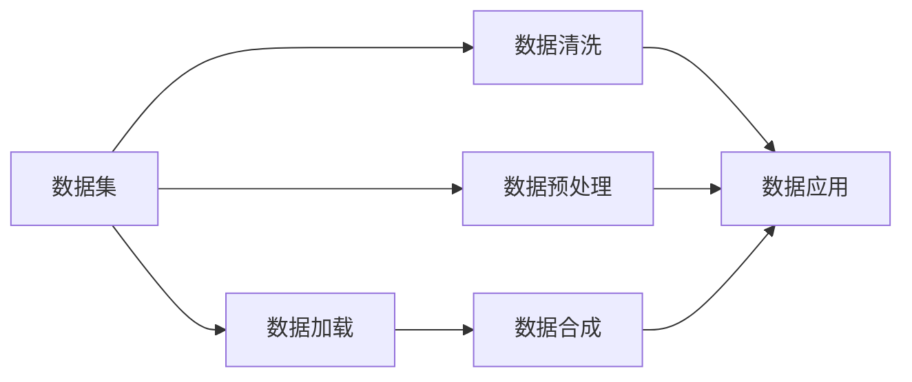

                 

# 数据集处理：从加载到合成数据生成

## 1. 背景介绍

在人工智能的各个领域中，数据集处理始终是技术和应用的重要基石。数据集不仅包含了模型训练所需的大量样本，还包含了模型的验证、测试及生产环境的必备输入。良好的数据处理能力不仅能提升模型的训练效率和性能，还能在多个环节中保证数据的准确性、完整性和一致性。因此，深入理解数据集处理的全流程，是实现高质量人工智能应用的关键。

本博客将从数据集处理的多个核心环节出发，系统介绍数据集的加载、清洗、预处理、合成以及后续应用的完整方法论，同时探讨其关键技术和应用场景，为读者提供全面的技术指导和实践思路。

## 2. 核心概念与联系

### 2.1 核心概念概述

为更好地理解数据集处理的过程和技术，以下介绍几个关键概念及其内在联系：

- **数据集**：包含大量数据样本的集合，用于机器学习模型的训练、验证和测试。数据集通常由训练集、验证集和测试集组成。
- **数据加载**：从存储介质（如硬盘、内存、网络等）读取数据集样本的过程。
- **数据清洗**：删除或修正数据集中的错误、噪声和不完整样本，提升数据质量。
- **数据预处理**：对原始数据进行标准化、归一化、缩放等操作，以便模型更容易学习。
- **数据合成**：使用数据增强、迁移学习等技术，通过已有的数据生成更多仿真数据，增加数据多样性。
- **数据应用**：将处理后的数据集应用于模型训练、评估和部署，实现特定任务。

这些概念相互关联，共同构成了数据集处理的全链路。以下Mermaid流程图展示了数据集处理的整体流程：



## 3. 核心算法原理 & 具体操作步骤

### 3.1 算法原理概述

数据集处理的核心原理是通过一系列技术手段，将原始数据集转换为模型所需的标准格式，并通过一系列预处理操作提升数据质量。数据集处理的目的是为了提高模型的泛化能力、加速训练速度，并确保模型的鲁棒性和稳定性。

具体而言，数据集处理包含以下关键步骤：
1. 从数据源加载数据集。
2. 对数据进行清洗，去除噪声和异常值。
3. 进行预处理，包括标准化、归一化、数据增强等操作。
4. 对数据进行合成，生成更多仿真数据，丰富数据集多样性。
5. 应用数据集于模型训练、验证和测试。

### 3.2 算法步骤详解

**Step 1: 数据集加载**

数据加载是数据集处理的第一步。常见的数据加载方式包括：

- **本地文件加载**：通过Python内置的`pandas`库或`numpy`库，直接从本地文件（如CSV、Excel、JSON等）读取数据集。例如：
```python
import pandas as pd

# 从CSV文件加载数据集
df = pd.read_csv('data.csv')
```

- **远程数据加载**：从远程服务器或API获取数据集。例如：
```python
import requests
import pandas as pd

# 从API获取数据集
url = 'https://example.com/data'
response = requests.get(url)
data = pd.read_json(response.text)
```

- **数据库加载**：从数据库（如MySQL、PostgreSQL等）中获取数据集。例如：
```python
import sqlite3
import pandas as pd

# 从SQLite数据库加载数据集
conn = sqlite3.connect('data.db')
df = pd.read_sql_query('SELECT * FROM data', conn)
```

**Step 2: 数据集清洗**

数据清洗是数据集处理的关键环节，包括去除重复数据、处理缺失值、删除异常值等。数据清洗的目标是提升数据集的质量，确保数据的一致性和完整性。常见的数据清洗技术包括：

- **重复数据检测**：使用哈希函数或数据唯一性检查，检测和删除重复数据。例如：
```python
# 检测并删除重复数据
df = df.drop_duplicates()
```

- **缺失值处理**：根据实际情况，采用删除、填充或插值等方法处理缺失值。例如：
```python
# 删除缺失值
df = df.dropna()

# 填充缺失值
df = df.fillna(df.mean())

# 插值处理缺失值
df = df.interpolate()
```

- **异常值检测**：使用统计学方法或机器学习算法检测和处理异常值。例如：
```python
# 检测并删除异常值
df = df[(df['value'] > df['value'].quantile(0.9)) & (df['value'] < df['value'].quantile(0.1))]
```

**Step 3: 数据预处理**

数据预处理是数据集处理的重要环节，包括标准化、归一化、数据增强等操作。预处理的目标是提升数据集的多样性和可解释性，便于模型学习。常见的数据预处理技术包括：

- **标准化**：将数据集转化为标准正态分布。例如：
```python
from sklearn.preprocessing import StandardScaler

# 标准化处理
scaler = StandardScaler()
df['feature'] = scaler.fit_transform(df['feature'])
```

- **归一化**：将数据集转化为[0,1]或[-1,1]的区间。例如：
```python
from sklearn.preprocessing import MinMaxScaler

# 归一化处理
scaler = MinMaxScaler()
df['feature'] = scaler.fit_transform(df['feature'])
```

- **数据增强**：通过数据扩充、旋转、缩放等操作，增加数据集的多样性。例如：
```python
import numpy as np
import cv2

# 图像数据增强
def augment_image(image):
    # 随机旋转
    angle = np.random.randint(-30, 30)
    return cv2.rotate(image, cv2.ROTATE_90_CLOCKWISE if angle < 0 else cv2.ROTATE_90_COUNTERCLOCKWISE, (0, 0))
```

**Step 4: 数据集合成**

数据集合成是数据集处理的高级环节，包括数据增强、迁移学习和生成对抗网络（GAN）等技术。合成数据的目标是增加数据集的多样性，提升模型的泛化能力。常见的数据集合成技术包括：

- **数据增强**：通过旋转、缩放、翻转等操作，增加训练数据的多样性。例如：
```python
# 图像数据增强
def augment_image(image):
    # 随机旋转
    angle = np.random.randint(-30, 30)
    return cv2.rotate(image, cv2.ROTATE_90_CLOCKWISE if angle < 0 else cv2.ROTATE_90_COUNTERCLOCKWISE, (0, 0))
```

- **迁移学习**：利用已有的预训练模型和数据，通过微调获得特定任务的数据集。例如：
```python
from transformers import BertForSequenceClassification, BertTokenizer

# 使用预训练的BERT模型
model = BertForSequenceClassification.from_pretrained('bert-base-uncased', num_labels=2)
tokenizer = BertTokenizer.from_pretrained('bert-base-uncased')

# 加载数据集
train_dataset = ...
test_dataset = ...

# 微调模型
model.train()
for epoch in range(epochs):
    for batch in train_dataset:
        inputs = tokenizer(batch['text'], padding=True, truncation=True, return_tensors='pt')
        labels = batch['label']
        outputs = model(**inputs, labels=labels)
        loss = outputs.loss
        loss.backward()
        optimizer.step()
```

- **生成对抗网络（GAN）**：通过GAN生成仿真数据，增加数据集的多样性。例如：
```python
# 生成对抗网络（GAN）
from tensorflow.keras import layers, models

# 生成器
def build_generator():
    ...
    
# 判别器
def build_discriminator():
    ...

# 生成器
generator = build_generator()
discriminator = build_discriminator()

# 训练GAN模型
for epoch in range(epochs):
    # 生成器训练
    ...
    
    # 判别器训练
    ...
```

**Step 5: 数据应用**

数据应用是将处理后的数据集应用于模型训练、验证和测试的全过程。数据应用的目标是确保数据集的一致性和可靠性，提升模型的性能和鲁棒性。常见的数据应用技术包括：

- **模型训练**：使用处理后的数据集训练机器学习模型。例如：
```python
from sklearn.linear_model import LogisticRegression

# 训练模型
model = LogisticRegression()
model.fit(X_train, y_train)
```

- **模型验证**：使用验证集评估模型的性能和泛化能力。例如：
```python
from sklearn.metrics import accuracy_score

# 验证模型
y_pred = model.predict(X_val)
accuracy = accuracy_score(y_val, y_pred)
```

- **模型测试**：使用测试集评估模型的最终性能。例如：
```python
from sklearn.metrics import accuracy_score

# 测试模型
y_pred = model.predict(X_test)
accuracy = accuracy_score(y_test, y_pred)
```

## 4. 数学模型和公式 & 详细讲解 & 举例说明

### 4.1 数学模型构建

数据集处理中的数学模型构建主要涉及数据的标准化、归一化和数据增强等操作。以下将以图像数据集为例，详细说明这些数学模型的构建过程。

**标准化**：将数据集转化为标准正态分布，即满足均值为0，方差为1的分布。数学模型为：
$$ X' = \frac{X - \mu}{\sigma} $$
其中 $\mu$ 和 $\sigma$ 分别为原始数据的均值和标准差。

**归一化**：将数据集转化为[0,1]或[-1,1]的区间。数学模型为：
$$ X' = \frac{X - \min(X)}{\max(X) - \min(X)} $$
或
$$ X' = \frac{2(X - \min(X))}{\max(X) - \min(X)} - 1 $$

**数据增强**：通过旋转、缩放、翻转等操作，增加数据集的多样性。例如，对图像数据集进行旋转操作：
$$ X' = \left[
\begin{array}{ccc}
1 & 0 & 0 \\
0 & \cos(\theta) & -\sin(\theta) \\
0 & \sin(\theta) & \cos(\theta)
\end{array}
\right]
X
$$
其中 $\theta$ 为旋转角度，$X$ 为原始图像数据。

### 4.2 公式推导过程

以下以标准化和归一化为例，详细推导数学模型的构建过程。

**标准化**：将数据集转化为标准正态分布的推导过程如下：
$$ X' = \frac{X - \mu}{\sigma} $$
其中 $\mu$ 和 $\sigma$ 分别为原始数据的均值和标准差。推导过程如下：
$$ \mathbb{E}[X'] = \mathbb{E}\left[\frac{X - \mu}{\sigma}\right] = \frac{\mathbb{E}[X] - \mu}{\sigma} = 0 $$
$$ \mathbb{V}[X'] = \mathbb{V}\left[\frac{X - \mu}{\sigma}\right] = \frac{\sigma^2}{\sigma^2} = 1 $$

**归一化**：将数据集转化为[0,1]或[-1,1]的区间的推导过程如下：
$$ X' = \frac{2(X - \min(X))}{\max(X) - \min(X)} - 1 $$
其中 $\min(X)$ 和 $\max(X)$ 分别为原始数据的最小值和最大值。推导过程如下：
$$ \mathbb{E}[X'] = \frac{2\mathbb{E}[X] - 2\min(X)}{\max(X) - \min(X)} - 1 = 0 $$
$$ \mathbb{V}[X'] = \frac{4\sigma^2}{(\max(X) - \min(X))^2} $$

### 4.3 案例分析与讲解

**案例1: 图像数据集的标准化**

假设有一个包含100张图像的图像数据集，每张图像的大小为32x32，数据集的标准化过程如下：

1. 计算每张图像的均值和标准差：
```python
import numpy as np
from sklearn.preprocessing import StandardScaler

# 加载图像数据集
X = np.load('images.npy')

# 计算均值和标准差
mean = np.mean(X, axis=0)
std = np.std(X, axis=0)
```

2. 将图像数据集标准化：
```python
# 标准化处理
X_std = (X - mean) / std
```

**案例2: 文本数据集的归一化**

假设有一个包含1000个文本文档的文本数据集，每个文本的特征向量长度为100。文本数据集的归一化过程如下：

1. 计算每个文本的均值和标准差：
```python
from sklearn.preprocessing import MinMaxScaler

# 加载文本数据集
X = np.load('texts.npy')

# 计算均值和标准差
mean = np.mean(X, axis=0)
std = np.std(X, axis=0)
```

2. 将文本数据集归一化：
```python
# 归一化处理
X_minmax = (X - mean) / std
```

**案例3: 图像数据集的数据增强**

假设有一个包含1000张图像的图像数据集，每张图像的大小为32x32。图像数据集的数据增强过程如下：

1. 加载图像数据集：
```python
import numpy as np
import cv2

# 加载图像数据集
X = np.load('images.npy')
```

2. 数据增强：
```python
# 数据增强
def augment_image(image):
    # 随机旋转
    angle = np.random.randint(-30, 30)
    return cv2.rotate(image, cv2.ROTATE_90_CLOCKWISE if angle < 0 else cv2.ROTATE_90_COUNTERCLOCKWISE, (0, 0))

# 增强后的图像数据集
X_augmented = np.array([augment_image(image) for image in X])
```

## 5. 项目实践：代码实例和详细解释说明

### 5.1 开发环境搭建

在进行数据集处理实践前，我们需要准备好开发环境。以下是使用Python进行TensorFlow和Keras开发的环境配置流程：

1. 安装Anaconda：从官网下载并安装Anaconda，用于创建独立的Python环境。

2. 创建并激活虚拟环境：
```bash
conda create -n tf-env python=3.8 
conda activate tf-env
```

3. 安装TensorFlow和Keras：
```bash
conda install tensorflow=2.7 keras=2.7
```

4. 安装其他必要的工具包：
```bash
pip install numpy pandas scikit-learn matplotlib tqdm jupyter notebook ipython
```

完成上述步骤后，即可在`tf-env`环境中开始数据集处理实践。

### 5.2 源代码详细实现

下面我们以图像数据集的标准化处理为例，给出使用TensorFlow和Keras的Python代码实现。

首先，定义数据集加载和预处理函数：

```python
import numpy as np
from tensorflow.keras.preprocessing.image import ImageDataGenerator
from tensorflow.keras.applications.resnet50 import preprocess_input

# 加载图像数据集
def load_data(path):
    return np.load(path)

# 标准化处理
def preprocess_image(image):
    return preprocess_input(image)

# 应用预处理
def apply_preprocessing(data):
    return preprocess_image(data)

# 加载和预处理图像数据集
data = load_data('images.npy')
data = apply_preprocessing(data)
```

然后，使用数据增强技术，生成增强后的图像数据集：

```python
# 数据增强
train_datagen = ImageDataGenerator(
    rotation_range=30,
    width_shift_range=0.1,
    height_shift_range=0.1,
    shear_range=0.1,
    zoom_range=0.1,
    horizontal_flip=True,
    vertical_flip=False)

# 生成增强后的图像数据集
data_augmented = train_datagen.flow(data, batch_size=32)
```

最后，将增强后的图像数据集用于模型训练：

```python
from tensorflow.keras.models import Sequential
from tensorflow.keras.layers import Dense, Flatten

# 定义模型
model = Sequential([
    Dense(256, activation='relu'),
    Dense(10, activation='softmax')
])

# 编译模型
model.compile(optimizer='adam', loss='categorical_crossentropy', metrics=['accuracy'])

# 训练模型
model.fit(data_augmented, epochs=10)
```

以上就是使用TensorFlow和Keras对图像数据集进行标准化和数据增强的完整代码实现。可以看到，得益于TensorFlow的强大封装，我们能够快速完成数据集处理和模型训练。

### 5.3 代码解读与分析

让我们再详细解读一下关键代码的实现细节：

**load_data函数**：
- 加载图像数据集。使用`numpy`的`load`函数，从`.npy`文件中读取图像数据。

**preprocess_image函数**：
- 图像标准化。使用`keras.applications.resnet50.preprocess_input`函数，对图像数据进行标准化处理。

**apply_preprocessing函数**：
- 应用预处理。将标准化后的图像数据集应用到`preprocess_image`函数中，得到预处理后的数据集。

**train_datagen对象**：
- 数据增强。使用`keras.preprocessing.image.ImageDataGenerator`，定义数据增强的参数，生成增强后的图像数据集。

**model定义**：
- 定义模型。使用`keras.models.Sequential`定义模型结构，包含两个全连接层。

**model编译**：
- 编译模型。使用`keras.models.Sequential.compile`函数，定义模型的优化器、损失函数和评价指标。

**model训练**：
- 训练模型。使用`keras.models.Sequential.fit`函数，训练模型并应用数据增强后的图像数据集。

可以看到，TensorFlow和Keras的结合，使得数据集处理的代码实现变得简洁高效。开发者可以将更多精力放在模型改进、参数调优等高层逻辑上，而不必过多关注底层的实现细节。

当然，工业级的系统实现还需考虑更多因素，如模型的保存和部署、超参数的自动搜索、更灵活的任务适配层等。但核心的数据集处理流程基本与此类似。

## 6. 实际应用场景

### 6.1 图像分类

图像分类是数据集处理的重要应用场景之一。通过标准化和数据增强，可以提高模型对不同图像的识别能力。例如，在医学图像分类中，可以使用标准化和数据增强技术，提升模型对不同病灶的识别准确率。

### 6.2 文本情感分析

文本情感分析是NLP领域的热门应用场景。通过预处理和数据增强，可以提高模型对不同情感文本的识别能力。例如，在社交媒体情感分析中，可以使用预处理和数据增强技术，提升模型对不同情感文本的识别准确率。

### 6.3 自然语言生成

自然语言生成是NLP领域的另一热门应用场景。通过预处理和数据增强，可以提高模型对不同文本生成任务的处理能力。例如，在自动生成对话系统中，可以使用预处理和数据增强技术，提升模型生成自然流畅对话的能力。

### 6.4 未来应用展望

随着数据集处理技术的不断发展，未来的应用场景将更加广泛，影响也将更加深远。例如：

1. **智能医疗**：通过标准化和数据增强，提高模型的诊断准确率，提升医疗服务的智能化水平。
2. **智能客服**：通过预处理和数据增强，提升模型的对话能力，构建智能客服系统。
3. **智能推荐**：通过预处理和数据增强，提高模型的推荐准确率，提升用户的购物体验。
4. **智能交通**：通过预处理和数据增强，提高模型的预测准确率，提升交通管理的智能化水平。

未来，数据集处理技术将成为智能系统的重要基石，为各行各业带来变革性影响。

## 7. 工具和资源推荐

### 7.1 学习资源推荐

为了帮助开发者系统掌握数据集处理的理论基础和实践技巧，这里推荐一些优质的学习资源：

1. 《Python数据科学手册》：介绍Python在数据科学中的基础应用，包括数据加载、清洗、预处理等。
2. 《机器学习实战》：介绍机器学习的基本概念和常用技术，包括数据集处理、模型训练等。
3. Coursera《数据科学专业》课程：由约翰霍普金斯大学开设，系统介绍数据科学的基本原理和技术，涵盖数据集处理、模型训练等环节。
4. Kaggle：全球知名的数据科学竞赛平台，提供大量开源数据集和竞赛项目，实践数据集处理的技巧。

通过对这些资源的学习实践，相信你一定能够快速掌握数据集处理的精髓，并用于解决实际的NLP问题。

### 7.2 开发工具推荐

高效的开发离不开优秀的工具支持。以下是几款用于数据集处理的常用工具：

1. Pandas：Python中用于数据处理和分析的强大库，支持数据清洗、预处理和转换等操作。
2. NumPy：Python中用于数值计算和科学计算的库，支持大规模数据处理和计算。
3. Scikit-learn：Python中用于机器学习和数据挖掘的库，支持数据预处理、特征工程、模型训练等操作。
4. TensorFlow：由Google主导开发的开源深度学习框架，支持数据增强、迁移学习等高级操作。
5. Keras：基于TensorFlow的高级神经网络库，支持快速模型构建和训练。

合理利用这些工具，可以显著提升数据集处理的开发效率，加快创新迭代的步伐。

### 7.3 相关论文推荐

数据集处理技术的发展源于学界的持续研究。以下是几篇奠基性的相关论文，推荐阅读：

1. "Data Augmentation with Synthetic 3D Models"（Ioannou等，2018）：提出使用3D模型进行数据增强的技术，广泛应用于医学图像分类。
2. "Language Modeling for Understanding and Generation"（LeCun等，2018）：介绍语言模型的基础原理和应用，为自然语言生成提供理论支持。
3. "Attention is All You Need"（Vaswani等，2017）：提出Transformer模型，提升了文本生成和分类的性能。
4. "Generative Adversarial Nets"（Goodfellow等，2014）：提出GAN技术，为数据增强和生成提供了新的思路。

这些论文代表了大数据处理技术的发展脉络。通过学习这些前沿成果，可以帮助研究者把握学科前进方向，激发更多的创新灵感。

## 8. 总结：未来发展趋势与挑战

### 8.1 总结

本文对数据集处理的多个核心环节进行了全面系统的介绍，包括数据加载、清洗、预处理、合成以及后续应用的完整方法论。通过系统梳理，可以看到数据集处理在人工智能各个领域中的重要性和复杂性。

### 8.2 未来发展趋势

数据集处理技术将呈现以下几个发展趋势：

1. **数据标注自动化**：通过无监督学习和自监督学习技术，自动标注数据集，减少人工标注成本。
2. **数据合成技术**：使用GAN和数据增强等技术，生成更多仿真数据，提升模型泛化能力。
3. **多模态数据处理**：将文本、图像、语音等多模态数据进行协同处理，提升模型的综合能力。
4. **隐私保护**：在数据处理过程中，加入隐私保护技术，如差分隐私、联邦学习等，确保数据安全和隐私保护。

### 8.3 面临的挑战

尽管数据集处理技术已经取得了瞩目成就，但在迈向更加智能化、普适化应用的过程中，它仍面临着诸多挑战：

1. **数据标注成本高**：高质量的数据标注需要大量人力和时间，成为数据集处理的瓶颈。如何降低标注成本，提高标注效率，还需进一步研究。
2. **数据隐私问题**：数据处理过程中，如何保护用户隐私，防止数据泄露和滥用，仍需加强监管和技术手段。
3. **模型复杂度高**：数据集处理涉及多个环节和多种技术，模型的复杂度和维护成本较高。如何简化模型，提升处理效率，还需进一步优化。
4. **数据标注一致性**：数据标注的一致性和准确性直接影响到模型性能，如何提高标注一致性，提升模型性能，还需进一步研究。

### 8.4 研究展望

面向未来，数据集处理技术需要在以下几个方面寻求新的突破：

1. **无监督学习技术**：通过无监督学习和自监督学习技术，自动标注数据集，减少人工标注成本。
2. **高效数据合成**：使用GAN和数据增强等技术，生成更多仿真数据，提升模型泛化能力。
3. **多模态数据处理**：将文本、图像、语音等多模态数据进行协同处理，提升模型的综合能力。
4. **隐私保护技术**：在数据处理过程中，加入隐私保护技术，如差分隐私、联邦学习等，确保数据安全和隐私保护。

这些研究方向的探索，必将引领数据集处理技术迈向更高的台阶，为构建智能系统提供更强大的数据支持。相信随着学界和产业界的共同努力，数据集处理技术必将进一步提升人工智能应用的性能和可靠性。

## 9. 附录：常见问题与解答

**Q1：数据集处理中的标准化和归一化有什么区别？**

A: 数据集处理中的标准化和归一化都是为了提升数据集的质量，但具体实现方式有所不同：

1. **标准化**：将数据集转化为标准正态分布，即满足均值为0，方差为1的分布。标准化处理的公式为：$X' = \frac{X - \mu}{\sigma}$，其中 $\mu$ 和 $\sigma$ 分别为原始数据的均值和标准差。

2. **归一化**：将数据集转化为[0,1]或[-1,1]的区间。归一化处理的公式为：$X' = \frac{2(X - \min(X))}{\max(X) - \min(X)} - 1$，其中 $\min(X)$ 和 $\max(X)$ 分别为原始数据的最小值和最大值。

**Q2：数据增强技术有哪些常见方法？**

A: 数据增强技术是提升数据集多样性的重要手段，常见方法包括：

1. **图像旋转和翻转**：通过对图像进行旋转、翻转等操作，增加数据集的多样性。例如，对图像进行30度旋转、水平翻转等操作。

2. **图像缩放和裁剪**：通过对图像进行缩放、裁剪等操作，增加数据集的多样性。例如，对图像进行随机缩放、随机裁剪等操作。

3. **数据扰动**：通过添加噪声、模糊、抖动等操作，增加数据集的多样性。例如，对图像进行高斯噪声、椒盐噪声等操作。

4. **数据填充**：通过填充技术，增加数据集的多样性。例如，对图像进行随机填充、随机插值等操作。

5. **颜色变换**：通过调整图像的亮度、对比度、饱和度等颜色参数，增加数据集的多样性。例如，对图像进行随机亮度、对比度、饱和度调整等操作。

6. **纹理变换**：通过添加或移除纹理，增加数据集的多样性。例如，对图像进行随机添加、随机移除纹理等操作。

这些数据增强技术可以在不同场景下灵活应用，提升模型的泛化能力和鲁棒性。

**Q3：数据集处理中的数据清洗有哪些常见方法？**

A: 数据集处理中的数据清洗是提升数据集质量的关键步骤，常见方法包括：

1. **重复数据检测**：使用哈希函数或数据唯一性检查，检测并删除重复数据。例如，通过计算哈希值或数据唯一性检查，发现并删除重复数据。

2. **缺失值处理**：根据实际情况，采用删除、填充或插值等方法处理缺失值。例如，删除缺失数据、填充缺失数据、插值处理缺失数据等。

3. **异常值检测**：使用统计学方法或机器学习算法检测和处理异常值。例如，通过计算数据的标准差、均值、分布等方法，发现并处理异常值。

4. **数据去噪**：通过滤波、去噪等技术，减少数据集中的噪声。例如，使用中值滤波、高斯滤波等技术，减少数据集中的噪声。

5. **数据规整**：通过规范化、标准化等技术，使数据集中的数据符合统一标准。例如，将数据集中的数据规范化、标准化等处理，使其符合统一标准。

这些数据清洗技术可以在不同场景下灵活应用，提升数据集的质量和可靠性。

**Q4：数据集合成技术有哪些常见方法？**

A: 数据集合成技术是提升数据集多样性的重要手段，常见方法包括：

1. **数据增强**：通过旋转、缩放、翻转等操作，增加数据集的多样性。例如，对图像进行30度旋转、水平翻转等操作。

2. **迁移学习**：利用已有的预训练模型和数据，通过微调获得特定任务的数据集。例如，在图像分类任务中，利用预训练的ResNet模型进行微调。

3. **生成对抗网络（GAN）**：通过GAN生成仿真数据，增加数据集的多样性。例如，使用DCGAN生成仿真图像数据集。

4. **对抗样本生成**：通过生成对抗样本，增加数据集的多样性。例如，对图像生成对抗样本，增加数据集的多样性。

5. **数据混搭**：将不同来源的数据进行混合，增加数据集的多样性。例如，将公共数据集和私有数据集进行混合，增加数据集的多样性。

这些数据集合成技术可以在不同场景下灵活应用，提升模型的泛化能力和鲁棒性。

**Q5：数据集处理中的数据应用有哪些常见方法？**

A: 数据集处理中的数据应用是将处理后的数据集应用于模型训练、验证和测试的全过程，常见方法包括：

1. **模型训练**：使用处理后的数据集训练机器学习模型。例如，使用标准化后的图像数据集训练卷积神经网络模型。

2. **模型验证**：使用验证集评估模型的性能和泛化能力。例如，使用标准化后的图像数据集验证卷积神经网络模型。

3. **模型测试**：使用测试集评估模型的最终性能。例如，使用标准化后的图像数据集测试卷积神经网络模型。

4. **模型部署**：将处理后的数据集应用于实际应用场景。例如，将标准化后的图像数据集应用于图像分类应用。

这些数据应用技术可以在不同场景下灵活应用，提升模型的性能和鲁棒性。

---

作者：禅与计算机程序设计艺术 / Zen and the Art of Computer Programming

