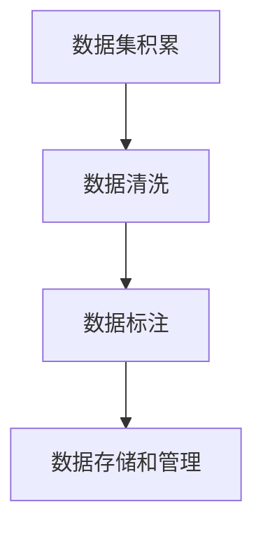

                 

# 数据集积累、清洗和标注：软件2.0工程师的日常

> 关键词：数据集积累, 数据清洗, 数据标注, 软件2.0, 机器学习, 深度学习, 人工智能

## 1. 背景介绍

### 1.1 问题由来

在当前的数字化转型浪潮中，数据驱动决策已成为企业和组织竞争的关键。无论是大数据分析、机器学习模型训练、还是深度学习模型优化，数据都是不可或缺的核心要素。然而，数据的质量和数量往往成为制约算法性能和模型准确性的重要瓶颈。

软件2.0工程师作为数据驱动决策的核心角色，其日常工作之一就是数据集积累、清洗和标注。这一工作不仅需要细致的工程能力，更需要深厚的专业知识和实践经验。本文将系统介绍这一系列关键工作流程，以及相关的技术工具和最佳实践，帮助软件2.0工程师在日常工作中提高效率，保障数据质量。

### 1.2 问题核心关键点

数据集积累、清洗和标注的工作流程主要包括以下几个环节：

1. **数据收集**：从多个渠道收集数据，并整理成可供分析或训练模型所需的格式。
2. **数据清洗**：去除噪声数据，处理缺失值，处理重复数据，进行数据转换和归一化等。
3. **数据标注**：对数据进行人工或自动化的标注，为后续机器学习或深度学习模型的训练提供有监督的信号。
4. **数据存储和管理**：选择合适的存储和管理工具，保障数据的安全性和可访问性。

这些关键点共同构成了软件2.0工程师日常工作的核心内容。

### 1.3 问题研究意义

数据集积累、清洗和标注工作对于数据驱动决策的实现至关重要。高质量的数据集是训练高效、准确模型的基础。通过系统的数据处理流程，可以显著提高模型性能，降低错误率，增强决策的可靠性和可解释性。同时，良好的数据管理实践也有助于数据安全和合规，避免数据泄露和滥用。

## 2. 核心概念与联系

### 2.1 核心概念概述

为更好地理解数据集积累、清洗和标注的工作流程，本节将介绍几个密切相关的核心概念：

- **数据集积累(Data Collection)**：从各种数据源收集数据，并进行初步处理，确保数据的一致性和可用性。
- **数据清洗(Data Cleaning)**：识别并去除数据集中的噪声和异常值，处理缺失值和重复数据，提升数据质量。
- **数据标注(Data Annotation)**：给数据集中的每个样本打上标签，为模型训练提供有监督信号，支持模型预测和分类。
- **数据存储(Data Storage)**：选择合适的存储方式，保障数据的安全性和可访问性，满足数据处理的性能需求。
- **数据管理(Data Management)**：建立数据管理的策略和流程，确保数据的完整性和合规性，避免数据泄露和滥用。

这些核心概念之间的逻辑关系可以通过以下Mermaid流程图来展示：



这个流程图展示了几大数据处理步骤的先后关系：

1. 首先通过数据积累获取初始数据集。
2. 然后对数据集进行清洗，去除噪声和异常值。
3. 接下来进行数据标注，为模型训练提供监督信号。
4. 最后，对标注后的数据进行存储和管理，确保其安全性和可访问性。

## 3. 核心算法原理 & 具体操作步骤
### 3.1 算法原理概述

数据集积累、清洗和标注的工作流程可以视作一系列数据处理算法的操作过程。其核心思想是：通过系统化的数据处理流程，将原始数据转换为高质量的、可供模型训练的数据集。

形式化地，假设原始数据集为 $D$，目标数据集为 $D'$。数据集积累、清洗和标注的过程可以表示为：

$$
D' = f(D)
$$

其中 $f$ 为一系列数据处理操作的集合，包括数据收集、清洗、标注等。

### 3.2 算法步骤详解

以下是数据集积累、清洗和标注的具体操作步骤：

**Step 1: 数据收集**

数据收集是数据处理的第一步。在实际工作中，数据来源多种多样，包括但不限于以下几种：

1. **公开数据集**：如Kaggle、UCI等平台提供的大规模公开数据集。
2. **内部数据**：企业内部的运营数据、客户数据、日志数据等。
3. **第三方API**：如天气API、新闻API等，获取实时数据。
4. **爬虫获取**：使用爬虫技术从互联网获取非结构化数据。

选择合适的数据源后，将数据整理成标准格式，如CSV、JSON等，以便后续处理。

**Step 2: 数据清洗**

数据清洗是数据处理中最重要的一环。主要目的是去除噪声和异常值，处理缺失值和重复数据，提升数据质量。常见的数据清洗操作包括：

1. **去除噪声**：通过可视化、统计分析等方法识别噪声数据，并将其去除。
2. **处理缺失值**：使用插值法、均值填补、中位数填补等方法处理缺失值。
3. **处理重复数据**：通过去重算法（如哈希法、排序去重法等）处理重复数据。
4. **数据转换和归一化**：对数据进行标准化、归一化等操作，使其符合模型训练的要求。

**Step 3: 数据标注**

数据标注是数据处理的另一个重要环节。通过对数据集中的每个样本打上标签，为模型训练提供有监督信号。常见的数据标注方式包括：

1. **人工标注**：由专业人员手动给数据集打上标签。适用于标注精度要求高、数据量小的场景。
2. **自动化标注**：使用标注工具或模型自动标注数据。适用于数据量大、标注成本高的场景。

**Step 4: 数据存储和管理**

数据存储和管理是数据处理的最后一步。选择合适的存储方式，保障数据的安全性和可访问性。常用的数据存储方式包括：

1. **关系型数据库**：如MySQL、PostgreSQL等，适用于结构化数据存储。
2. **非关系型数据库**：如MongoDB、Redis等，适用于非结构化数据存储。
3. **数据湖**：如Hadoop、AWS Lake等，适用于大规模数据的存储和管理。

选择合适的方式后，建立数据管理策略，确保数据的安全性和合规性。

### 3.3 算法优缺点

数据集积累、清洗和标注的工作流程具有以下优点：

1. **提升数据质量**：通过系统化的数据处理流程，可以显著提升数据集的质量，降低噪声和异常值的影响。
2. **支持多种数据源**：能够从多种数据源收集数据，满足不同业务需求。
3. **降低标注成本**：通过自动化标注工具和模型，减少人工标注的工作量。
4. **保障数据安全**：选择合适的数据存储和管理方式，确保数据的安全性和合规性。

同时，这一流程也存在一些局限性：

1. **数据处理成本高**：数据收集、清洗和标注需要大量的人力和时间投入。
2. **数据处理复杂**：数据处理流程复杂，需要熟练掌握多种工具和技术。
3. **数据质量依赖标注精度**：数据标注的准确性直接决定了最终数据集的质量。

尽管存在这些局限性，但就目前而言，数据集积累、清洗和标注仍然是大数据处理的核心流程之一。未来相关研究的方向是如何进一步提升数据处理效率，降低成本，同时提升数据标注的精度和自动化水平。

### 3.4 算法应用领域

数据集积累、清洗和标注技术广泛应用于数据驱动的各个领域，包括但不限于：

1. **金融风险评估**：通过对大量金融数据进行清洗和标注，构建风险评估模型。
2. **医疗诊断支持**：利用医疗数据进行清洗和标注，构建疾病诊断和预测模型。
3. **智能推荐系统**：对用户行为数据进行清洗和标注，构建推荐算法。
4. **自然语言处理**：对文本数据进行清洗和标注，构建自然语言理解和生成模型。
5. **计算机视觉**：对图像和视频数据进行清洗和标注，构建图像识别和生成模型。
6. **物联网数据处理**：对传感器数据进行清洗和标注，构建智能感知和决策模型。

这些应用场景展示了数据处理技术的广泛应用，也彰显了数据驱动决策的重要价值。

## 4. 数学模型和公式 & 详细讲解 & 举例说明

### 4.1 数学模型构建

数据集积累、清洗和标注的工作流程可以视作一系列数学模型的操作过程。其核心思想是：通过数学模型对数据进行处理，将原始数据转换为高质量的、可供模型训练的数据集。

假设原始数据集为 $D$，目标数据集为 $D'$。数据集积累、清洗和标注的过程可以表示为：

$$
D' = f(D)
$$

其中 $f$ 为一系列数学处理操作的集合，包括数据收集、清洗、标注等。

### 4.2 公式推导过程

以下是数据集积累、清洗和标注的数学模型推导过程：

**Step 1: 数据收集**

数据收集过程可以表示为：

$$
D' = \{d'_i\}_{i=1}^N
$$

其中 $d'_i$ 为经过清洗和标注的数据样本。

**Step 2: 数据清洗**

数据清洗过程可以表示为：

$$
d'_i = \text{Clean}(d_i)
$$

其中 $\text{Clean}$ 为数据清洗函数，包括去噪、填补缺失值、去重等操作。

**Step 3: 数据标注**

数据标注过程可以表示为：

$$
d'_i = \text{Annotate}(d_i, t_i)
$$

其中 $t_i$ 为数据样本 $d_i$ 的标签，$\text{Annotate}$ 为数据标注函数。

**Step 4: 数据存储和管理**

数据存储和管理过程可以表示为：

$$
D' = \{d'_i\}_{i=1}^N
$$

其中 $D'$ 为存储和管理后的数据集。

### 4.3 案例分析与讲解

以金融风险评估为例，分析数据集积累、清洗和标注的过程：

1. **数据收集**：从金融交易记录、客户信用报告等渠道收集数据。
2. **数据清洗**：识别并去除异常交易记录、处理缺失值、去重等。
3. **数据标注**：对每笔交易记录打上风险标签，如高风险、中等风险、低风险等。
4. **数据存储和管理**：将清洗和标注后的数据存储在数据库中，设置访问权限，确保数据安全。

## 5. 项目实践：代码实例和详细解释说明

### 5.1 开发环境搭建

在进行数据集积累、清洗和标注的实践前，我们需要准备好开发环境。以下是使用Python进行数据处理的环境配置流程：

1. 安装Anaconda：从官网下载并安装Anaconda，用于创建独立的Python环境。

2. 创建并激活虚拟环境：
```bash
conda create -n data-processing-env python=3.8 
conda activate data-processing-env
```

3. 安装相关库：
```bash
conda install pandas numpy matplotlib sklearn scikit-learn seaborn jupyter notebook ipython
```

完成上述步骤后，即可在`data-processing-env`环境中开始数据处理实践。

### 5.2 源代码详细实现

下面我们以金融风险评估任务为例，给出使用Python进行数据处理和标注的代码实现。

首先，导入必要的库：

```python
import pandas as pd
import numpy as np
import matplotlib.pyplot as plt
import seaborn as sns
from sklearn.preprocessing import StandardScaler
from sklearn.model_selection import train_test_split
```

然后，定义数据清洗函数：

```python
def clean_data(df):
    # 去除噪声数据
    df = df.dropna(subset=['value', 'date', 'amount'])
    # 处理缺失值
    df['value'].fillna(df['value'].mean(), inplace=True)
    # 去重
    df.drop_duplicates(inplace=True)
    return df
```

接着，定义数据标注函数：

```python
def annotate_data(df, labels):
    df['risk'] = labels
    return df
```

然后，加载数据并进行处理：

```python
# 加载数据
df = pd.read_csv('financial_data.csv')

# 清洗数据
df = clean_data(df)

# 标注数据
labels = np.random.choice(['high', 'medium', 'low'], size=len(df), replace=True)
df = annotate_data(df, labels)

# 分割数据集
train_df, test_df = train_test_split(df, test_size=0.2, random_state=42)

# 数据标准化
scaler = StandardScaler()
train_df['value'] = scaler.fit_transform(train_df[['value']])
test_df['value'] = scaler.transform(test_df[['value']])
```

最后，保存和可视化数据：

```python
# 保存数据
train_df.to_csv('train_data.csv', index=False)
test_df.to_csv('test_data.csv', index=False)

# 可视化数据
plt.figure(figsize=(10, 5))
sns.histplot(train_df['risk'], kde=True)
plt.xlabel('Risk Level')
plt.ylabel('Frequency')
plt.title('Risk Distribution')
plt.show()
```

以上就是使用Python进行金融风险评估数据处理和标注的完整代码实现。可以看到，通过简单的几行代码，我们就完成了数据清洗、标注和保存的工作。

### 5.3 代码解读与分析

让我们再详细解读一下关键代码的实现细节：

**clean_data函数**：
- 定义了数据清洗的基本操作，包括去除噪声数据、处理缺失值和去重。
- 通过`dropna`方法去除含有缺失值的记录。
- 使用`fillna`方法处理缺失值，以均值填补。
- 通过`drop_duplicates`方法去重。

**annotate_data函数**：
- 定义了数据标注的基本操作，将随机生成的风险标签添加到数据集中。
- 通过`np.random.choice`生成随机标签，标签为'high', 'medium', 'low'三种。
- 将标签添加到数据集中的新列'risk'。

**数据处理流程**：
- 首先使用`pd.read_csv`加载数据集。
- 接着调用`clean_data`函数进行数据清洗。
- 然后调用`annotate_data`函数进行数据标注。
- 最后使用`train_test_split`将数据集分割为训练集和测试集，并使用`StandardScaler`对特征进行标准化。
- 将处理后的数据集保存为CSV文件，并进行可视化展示。

可以看到，使用Python进行数据处理和标注的工作量并不大，但能够快速完成数据清洗和标注，为后续模型训练和验证奠定基础。

## 6. 实际应用场景

### 6.1 金融风险评估

金融风险评估是数据集积累、清洗和标注技术的重要应用场景之一。通过对大量金融交易数据进行清洗和标注，构建风险评估模型，可以有效识别和管理金融风险。

在实际应用中，可以收集金融交易记录、客户信用报告等数据，并进行数据清洗和标注。标注过程可以参考历史风险事件，如违约、欺诈等，为模型训练提供有监督信号。最终，通过模型训练和验证，得到风险评估模型，用于预测新交易的潜在风险。

### 6.2 医疗诊断支持

医疗诊断支持是数据集积累、清洗和标注技术的另一个重要应用场景。通过对病历数据进行清洗和标注，构建疾病诊断和预测模型，可以有效提升医疗诊断的准确性和效率。

在实际应用中，可以收集病人的病历数据，并进行数据清洗和标注。标注过程可以参考医生的诊断结果，如疾病类型、治疗方案等，为模型训练提供有监督信号。最终，通过模型训练和验证，得到疾病诊断模型，用于预测新病人的疾病类型和严重程度。

### 6.3 智能推荐系统

智能推荐系统是数据集积累、清洗和标注技术的典型应用之一。通过对用户行为数据进行清洗和标注，构建推荐算法，可以有效提升用户的推荐体验。

在实际应用中，可以收集用户的浏览、购买、评价等行为数据，并进行数据清洗和标注。标注过程可以参考用户的实际购买记录，为模型训练提供有监督信号。最终，通过模型训练和验证，得到推荐模型，用于预测用户的购买兴趣和偏好，并生成个性化的推荐列表。

## 7. 工具和资源推荐

### 7.1 学习资源推荐

为了帮助开发者系统掌握数据集积累、清洗和标注的理论基础和实践技巧，这里推荐一些优质的学习资源：

1. 《数据科学实战：Python语言》系列书籍：由知名数据科学家撰写，系统介绍了数据处理、分析、可视化等核心内容，适合初学者入门。
2. Coursera《数据科学》课程：由斯坦福大学开设的在线课程，系统讲解了数据科学的基础理论和实践技巧，涵盖数据清洗、标注等环节。
3. Kaggle：全球最大的数据科学竞赛平台，提供了大量的数据集和竞赛任务，适合练习和实践。
4. GitHub：开源代码托管平台，可以找到许多高质量的数据处理和标注工具和样例代码。
5. 《数据科学基础》书籍：由著名数据科学家撰写，全面介绍了数据科学的核心理论和实践技巧，适合进阶学习。

通过对这些资源的学习实践，相信你一定能够快速掌握数据集积累、清洗和标注的精髓，并用于解决实际的数据处理问题。

### 7.2 开发工具推荐

高效的开发离不开优秀的工具支持。以下是几款用于数据处理开发的常用工具：

1. Pandas：Python数据处理库，提供了高效的数据结构和数据操作功能，适合处理结构化数据。
2. NumPy：Python数值计算库，提供了高性能的数组操作和数学函数，适合处理数值型数据。
3. Matplotlib和Seaborn：数据可视化库，可以生成高质量的图表，支持数据探索和展示。
4. Scikit-learn：Python机器学习库，提供了丰富的机器学习算法和工具，适合数据建模和分析。
5. Jupyter Notebook：交互式笔记本环境，支持Python代码编写和数据可视化，方便实验和协作。

合理利用这些工具，可以显著提升数据处理任务的开发效率，加快创新迭代的步伐。

### 7.3 相关论文推荐

数据集积累、清洗和标注技术的发展源于学界的持续研究。以下是几篇奠基性的相关论文，推荐阅读：

1. "Data Cleaning Algorithms"（数据清洗算法）：论文详细介绍了数据清洗的基本操作和常用算法，适用于各种数据源和数据类型。
2. "Supervised Learning for Data Annotation"（数据标注的监督学习）：论文探讨了数据标注的监督学习方法，适用于不同任务和应用场景。
3. "Large Scale Data Management and Analysis"（大规模数据管理和分析）：论文综述了数据管理和分析的最新进展，适用于大数据处理。
4. "Robust Statistical Data Cleaning"（鲁棒统计数据清洗）：论文提出了一种鲁棒统计方法，可以有效处理噪声数据和缺失值。
5. "Machine Learning for Data Annotation"（机器学习用于数据标注）：论文探讨了使用机器学习算法进行数据标注的方法，适用于大规模标注任务。

这些论文代表了大数据处理技术的发展脉络。通过学习这些前沿成果，可以帮助研究者把握学科前进方向，激发更多的创新灵感。

## 8. 总结：未来发展趋势与挑战

### 8.1 总结

本文对数据集积累、清洗和标注的工作流程进行了全面系统的介绍。首先阐述了数据驱动决策的重要性，明确了数据处理在其中的核心地位。其次，从原理到实践，详细讲解了数据处理的具体步骤，给出了数据处理任务的完整代码实例。同时，本文还广泛探讨了数据处理技术在金融风险评估、医疗诊断、智能推荐等诸多领域的应用前景，展示了数据处理技术的广阔前景。

通过本文的系统梳理，可以看到，数据集积累、清洗和标注工作对于数据驱动决策的实现至关重要。高质量的数据集是训练高效、准确模型的基础。通过系统的数据处理流程，可以显著提高模型性能，降低错误率，增强决策的可靠性和可解释性。同时，良好的数据管理实践也有助于数据安全和合规，避免数据泄露和滥用。

### 8.2 未来发展趋势

展望未来，数据集积累、清洗和标注技术将呈现以下几个发展趋势：

1. **自动化程度提升**：通过自动化标注工具和机器学习模型，进一步降低人工标注的工作量。
2. **多源数据整合**：融合不同来源的数据，提升数据的全面性和多样性。
3. **数据隐私保护**：加强数据隐私保护措施，确保数据安全和合规。
4. **数据实时处理**：实现数据的实时清洗和标注，支持实时决策。
5. **数据质量监控**：建立数据质量监控机制，实时检测和修正数据质量问题。

这些趋势凸显了数据处理技术的广阔前景。这些方向的探索发展，必将进一步提升数据处理效率，降低成本，同时保障数据质量和安全。

### 8.3 面临的挑战

尽管数据集积累、清洗和标注技术已经取得了显著进展，但在迈向更加智能化、普适化应用的过程中，它仍面临着诸多挑战：

1. **数据质量和标注精度**：数据质量和标注精度的提升需要大量的资源投入，特别是在高精度的医疗和金融等领域，这一挑战尤为显著。
2. **数据处理成本**：数据处理工作需要大量的计算资源和时间，尤其是在处理大规模数据时，这一成本可能难以承受。
3. **数据隐私和安全**：数据隐私和安全问题始终是数据处理的核心挑战之一，如何在保障数据隐私和安全的同时，进行高效的数据处理，需要更多的技术创新和政策支持。
4. **数据处理速度**：在实时数据处理场景中，如何提升数据处理速度，满足实时性需求，需要更多的技术优化和工程实践。

尽管存在这些挑战，但通过技术创新和行业合作，相信数据集积累、清洗和标注技术将继续发展，为数据驱动决策提供更强大的支持。

### 8.4 研究展望

面对数据集积累、清洗和标注所面临的挑战，未来的研究需要在以下几个方面寻求新的突破：

1. **自动化标注技术**：开发更加高效、准确的自动化标注工具和模型，降低人工标注的依赖。
2. **数据隐私保护技术**：研究数据隐私保护的新方法和技术，保障数据的安全性和合规性。
3. **实时数据处理技术**：优化数据处理算法和架构，实现数据的实时清洗和标注，满足实时决策的需求。
4. **多源数据整合技术**：研究多源数据融合的技术和方法，提升数据的全局性和多样性。
5. **数据质量监控机制**：建立数据质量监控的策略和流程，实时检测和修正数据质量问题，确保数据的质量和可靠性。

这些研究方向将推动数据处理技术的持续进步，为数据驱动决策提供更强大的技术支撑。

## 9. 附录：常见问题与解答

**Q1：数据集积累、清洗和标注是否适用于所有数据驱动场景？**

A: 数据集积累、清洗和标注技术适用于大多数数据驱动场景，特别是在需要大量标注数据和处理大规模数据的情况下。但对于一些特殊场景，如无人监督、实时处理等，可能需要其他技术和方法。

**Q2：如何提升数据标注的精度？**

A: 提升数据标注精度需要结合多种方法，如自动化标注工具、众包标注平台、多标注者验证等。同时，需要对标注人员进行培训，提高其标注能力和一致性。

**Q3：数据清洗和标注的资源需求大吗？**

A: 数据清洗和标注的资源需求较大，特别是在大规模数据集和复杂数据结构的情况下。可以通过分布式计算和并行处理技术，提高数据处理的效率和成本效益。

**Q4：数据隐私和安全问题如何解决？**

A: 数据隐私和安全问题需要从多个层面进行综合治理，包括数据加密、匿名化、访问控制、合规审核等。建立完善的隐私保护策略和流程，确保数据的安全性和合规性。

**Q5：数据处理任务如何进行性能优化？**

A: 数据处理任务的性能优化可以从多个方面入手，如算法优化、硬件升级、并行处理等。通过合理设计数据处理流程，并结合高效的计算资源，可以显著提升数据处理的性能和效率。

---

作者：禅与计算机程序设计艺术 / Zen and the Art of Computer Programming

