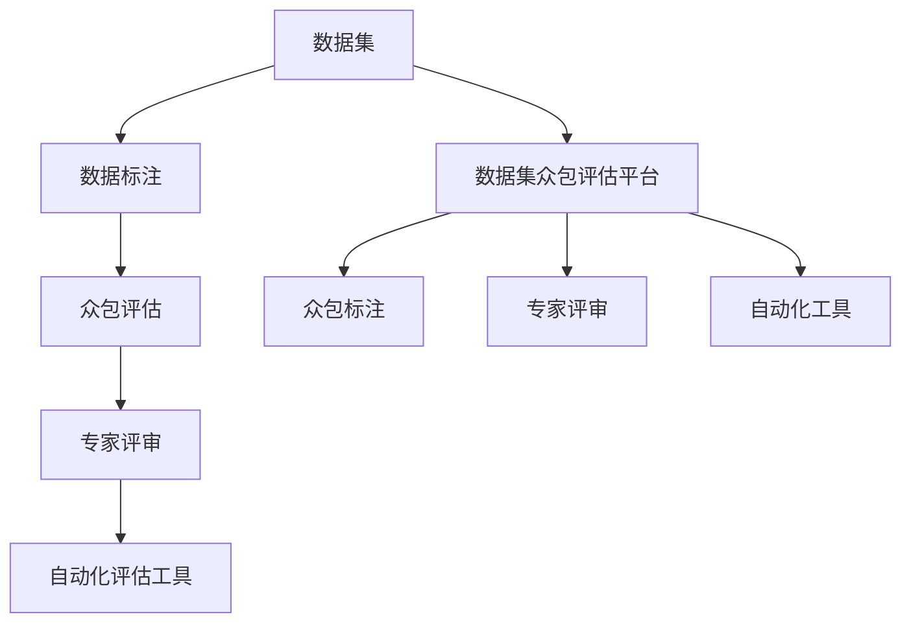

                 

# 数据集评论:数据集质量众包评估新方式

> 关键词：数据集质量评估，众包方法，数据标注，模型训练，数据集众包平台，平台架构设计

## 1. 背景介绍

在数据驱动的时代，数据集的质量直接影响机器学习模型的训练效果和应用表现。随着深度学习技术的飞速发展，训练一个高性能模型往往需要庞大且高质量的数据集作为支撑。但实际应用中，获取符合标准的高质量标注数据成本高昂，且数据标注的准确性难以保证。因此，针对数据集质量的众包评估方法成为近年来研究的热点。

### 1.1 问题由来
数据标注是构建高质量数据集的基础。但传统的数据标注方法依赖于专业标注人员，成本高昂且效率低下。近年来，随着众包平台的发展，数据标注逐渐采用众包模式，即通过大量非专业标注人员完成数据标注工作。虽然众包模式降低了成本，但标注质量难以保证。如何确保众包数据标注质量，成为数据集质量管理的关键问题。

### 1.2 问题核心关键点
数据集质量的众包评估方法通过结合专家评审和众包标注结果，对数据集进行全面、系统、高效的评价，从而筛选出高质量的数据集。该方法的核心在于：

- 设计合理的标注任务和评估指标，确保众包标注结果的可靠性和一致性。
- 引入专家评审机制，通过专业知识和经验，对标注结果进行审核和修正。
- 采用多轮标注和评审，减少标注误差和误差传播，提升评估准确性。
- 设计自动化评估工具，降低人工干预和评估成本，提高评估效率。

## 2. 核心概念与联系

### 2.1 核心概念概述

为更好地理解数据集质量众包评估方法，本节将介绍几个密切相关的核心概念：

- 数据集(Training Dataset)：用于训练机器学习模型的样本集合，包含标注数据和未标注数据。
- 数据标注(Annotation)：将未标注数据转化为标注数据的过程，通过专家或众包标注完成。
- 数据标注平台(Annotation Platform)：用于数据标注和众包评估的系统平台，支持在线协同标注和自动审核。
- 众包(Crowdsourcing)：利用大量非专业标注人员完成数据标注工作，降低成本。
- 众包评估(Crowdsourcing Evaluation)：通过众包模式对标注结果进行评价，筛选高质量数据集。
- 数据集众包评估平台(Dataset Crowdsourcing Evaluation Platform)：综合众包标注和专家评审，对数据集进行评估的系统平台。

这些核心概念之间的逻辑关系可以通过以下Mermaid流程图来展示：



这个流程图展示出数据集质量众包评估方法的流程：

1. 数据集通过众包平台进行在线标注。
2. 众包标注结果通过自动化评估工具进行初步审核。
3. 专家评审机制进一步筛选和修正标注结果。
4. 最终评估结果由众包平台整合输出。

这些概念共同构成了数据集质量众包评估的实施框架，使得该方法得以在实际应用中得到广泛推广和应用。

## 3. 核心算法原理 & 具体操作步骤
### 3.1 算法原理概述

数据集质量的众包评估方法本质是一种基于众包的标注质量评价方法。其核心思想是：通过专家评审和众包标注结果的结合，对数据集进行全面、系统的质量评价，从而筛选出高质量的数据集。

形式化地，假设众包平台上有 $N$ 个众包标注人员，每个标注人员对数据集 $D$ 中的样本进行标注，得到 $N$ 个标注结果 $A_1, A_2, ..., A_N$。专家评审员对每个样本的标注结果进行审核，得到 $M$ 个专家评审结果 $R_1, R_2, ..., R_M$。众包评估方法的目标是：

$$
Q(D) = \mathop{\arg\max}_{D} \sum_{i=1}^N w_i \times \text{score}(A_i) + \sum_{j=1}^M w_j \times \text{score}(R_j)
$$

其中 $w_i, w_j$ 为每个标注人员和专家评审的权重，score表示评价函数。目标函数中的第一项和第二项分别表示众包标注结果和专家评审结果的综合质量，权重 $w_i, w_j$ 用于平衡两者的影响力。最终评估结果 $Q(D)$ 最高的数据集 $D$ 被认为是最佳数据集。

### 3.2 算法步骤详解

数据集质量的众包评估方法一般包括以下几个关键步骤：

**Step 1: 设计标注任务和评估指标**

- 设计合适的标注任务：明确数据集标注的目标和内容，设计标准的标注格式和样例。
- 定义评估指标：根据任务特点，选择合适的评估指标，如准确率、召回率、F1分数、一致性、可靠性等。

**Step 2: 搭建众包平台**

- 选择众包平台架构：选择合适的众包平台架构，如基于Web的标注平台、手机App等。
- 设计众包流程：设计众包任务分配、标注人员选择、任务提交、审核反馈等流程。

**Step 3: 选择众包标注人员**

- 确定标注人员需求：根据数据集大小和复杂度，确定所需众包标注人员数量。
- 筛选标注人员：选择经过平台审核的标注人员，确保其标注能力符合要求。

**Step 4: 众包标注与初步审核**

- 众包任务发布：将标注任务发布到众包平台，分配给标注人员。
- 众包标注：标注人员在线完成数据集标注，并将结果提交到平台。
- 初步审核：使用自动化评估工具对众包标注结果进行初步审核，筛选出高质量标注结果。

**Step 5: 专家评审与综合评估**

- 专家评审：邀请专家对初步审核通过的标注结果进行评审，记录评审意见和修正建议。
- 综合评估：将专家评审结果与初步审核结果结合，进行综合评估，得出最终评估结果。
- 筛选最佳数据集：根据综合评估结果，筛选出质量最佳的数据集，满足应用需求。

**Step 6: 发布与反馈**

- 数据集发布：将筛选出的高质量数据集发布到众包平台，供用户下载使用。
- 收集反馈：收集用户对数据集的反馈意见，持续优化和改进众包评估方法。

以上是数据集质量众包评估的一般流程。在实际应用中，还需要针对具体任务的特点，对众包流程进行优化设计，如引入多轮标注和评审、调整权重系数、设计自动化评估工具等，以进一步提升评估精度。

### 3.3 算法优缺点

数据集质量的众包评估方法具有以下优点：

- 降低成本：利用众包模式完成标注，大幅降低专业标注人员的人力成本。
- 提升效率：众包模式通过在线协同标注，大幅缩短数据标注时间。
- 兼顾专业与多样化：众包标注和专家评审相结合，兼顾了专业知识和大众意见。
- 自动化工具支持：利用自动化评估工具，降低人工干预和评估成本，提高评估效率。

同时，该方法也存在一定的局限性：

- 众包质量不稳定：众包标注人员的素质和能力参差不齐，标注结果质量难以保证。
- 人工干预成本高：专家评审需要人工审核标注结果，成本较高。
- 存在误差传播：众包标注误差可能通过多个环节传播，影响最终评估结果。
- 自动化工具局限：自动化评估工具可能无法处理标注结果中的某些特殊情况，需要人工介入。

尽管存在这些局限性，但就目前而言，数据集质量的众包评估方法仍是一种较为高效、可靠的数据集筛选手段。未来相关研究将更多聚焦于如何提高众包质量、降低人工干预成本、提升自动化工具的性能等方面。

### 3.4 算法应用领域

数据集质量的众包评估方法在多个领域得到广泛应用，包括但不限于：

- 计算机视觉：用于标注和筛选高质量图像数据集，提升深度学习模型的训练效果。
- 自然语言处理：用于标注和筛选高质量文本数据集，提升自然语言处理模型的性能。
- 生物信息学：用于标注和筛选高质量基因数据集，支持生物信息学的研究和应用。
- 遥感数据：用于标注和筛选高质量遥感数据集，支持地理信息系统的发展。
- 医学影像：用于标注和筛选高质量医学影像数据集，支持医学图像分析和诊断。

除了上述这些领域，数据集质量的众包评估方法还可应用于更多领域，如环境监测、工业制造、社交网络等，为数据驱动的研究和应用提供高质量的数据支持。

## 4. 数学模型和公式 & 详细讲解  
### 4.1 数学模型构建

本节将使用数学语言对数据集质量众包评估方法进行更加严格的刻画。

假设众包平台上有 $N$ 个众包标注人员，每个标注人员对数据集 $D$ 中的样本进行标注，得到 $N$ 个标注结果 $A_1, A_2, ..., A_N$。专家评审员对每个样本的标注结果进行审核，得到 $M$ 个专家评审结果 $R_1, R_2, ..., R_M$。

定义每个众包标注人员的权重为 $w_i$，专家评审员的权重为 $w_j$。众包评估方法的目标是最大化以下目标函数：

$$
Q(D) = \sum_{i=1}^N w_i \times \text{score}(A_i) + \sum_{j=1}^M w_j \times \text{score}(R_j)
$$

其中 $\text{score}$ 为评估指标函数，如准确率、召回率、F1分数等。权重 $w_i, w_j$ 用于平衡众包标注和专家评审的影响力。

### 4.2 公式推导过程

以准确率评估指标为例，进行数学推导。

众包标注结果的准确率为：

$$
\text{accuracy}(A_i) = \frac{1}{|D|} \sum_{x \in D} I(x, A_i(x)) = \frac{1}{|D|} \sum_{x \in D} \text{sign}(A_i(x)) \times \text{sign}(y(x))
$$

其中 $I$ 为示性函数，$x$ 为样本，$A_i(x)$ 为众包标注结果，$y(x)$ 为真实标签。

专家评审结果的准确率为：

$$
\text{accuracy}(R_j) = \frac{1}{|D|} \sum_{x \in D} I(x, R_j(x)) = \frac{1}{|D|} \sum_{x \in D} \text{sign}(R_j(x)) \times \text{sign}(y(x))
$$

将上述公式代入目标函数，得：

$$
Q(D) = \sum_{i=1}^N w_i \times \text{accuracy}(A_i) + \sum_{j=1}^M w_j \times \text{accuracy}(R_j)
$$

通过上述推导，可以看出数据集质量众包评估方法的基本框架和核心思想。该方法通过平衡众包标注和专家评审的权重，综合考虑两者的影响，对数据集进行质量评价，筛选出高质量数据集。

### 4.3 案例分析与讲解

下面以一个实际案例，详细讲解数据集质量众包评估方法的实施过程。

假设要评估一个包含 $1000$ 张图像的数据集，每张图像有 $10$ 个标注人员进行标注，每个标注人员标注 $100$ 张图像。专家评审员对每张图像的标注结果进行审核，筛选出 $10$ 个专家评审结果。数据集质量评估的权重设置为 $w_i = 1, w_j = 0.5$。

**Step 1: 设计标注任务和评估指标**

设计标注任务为对图像进行目标检测，标注结果包括目标位置和类别。选择准确率为评估指标，定义为：

$$
\text{accuracy}(A_i) = \frac{1}{|D|} \sum_{x \in D} I(x, A_i(x))
$$

**Step 2: 搭建众包平台**

搭建一个基于Web的众包标注平台，支持在线协同标注。平台设计标注人员选择、任务分配、任务提交、审核反馈等流程。

**Step 3: 选择众包标注人员**

从众包平台筛选出 $100$ 个标注人员，通过平台测试和用户评价，选择表现最好的 $10$ 个标注人员。

**Step 4: 众包标注与初步审核**

将数据集划分为 $10$ 个子集，每个子集分配给一个标注人员。标注人员在线完成标注，并将结果提交到平台。使用自动化评估工具对众包标注结果进行初步审核，筛选出高质量标注结果。

**Step 5: 专家评审与综合评估**

邀请 $10$ 个专家对初步审核通过的标注结果进行评审，记录评审意见和修正建议。将专家评审结果与初步审核结果结合，进行综合评估，得出最终评估结果。

**Step 6: 筛选最佳数据集**

根据综合评估结果，筛选出质量最佳的数据集，满足应用需求。

通过上述步骤，最终评估数据集的质量，并筛选出高质量数据集。

## 5. 项目实践：代码实例和详细解释说明
### 5.1 开发环境搭建

在进行数据集质量众包评估实践前，我们需要准备好开发环境。以下是使用Python进行Web开发的环境配置流程：

1. 安装Python：从官网下载并安装Python，用于后端开发和数据库管理。

2. 安装Flask框架：使用Flask作为Web应用框架，支持轻量级开发和RESTful接口设计。

3. 安装SQL数据库：选择MySQL或PostgreSQL作为数据存储，支持在线协同标注和专家评审的数据管理。

4. 安装Python客户端：使用Python SDK与Web应用进行交互，支持Python客户端与Web应用的交互。

5. 安装客户端开发工具：使用HTML、CSS、JavaScript等前端开发工具，支持用户界面的开发和设计。

完成上述步骤后，即可在Web应用环境下开始数据集质量众包评估的实践。

### 5.2 源代码详细实现

下面以一个实际案例，详细讲解数据集质量众包评估的代码实现。

**Step 1: 搭建Web应用**

```python
from flask import Flask, request, jsonify

app = Flask(__name__)

@app.route('/api/annotation', methods=['POST'])
def annotation():
    data = request.json
    # 解析输入数据
    task_id = data['task_id']
    annotation_result = data['annotation_result']
    # 存储到数据库
    # ...
    return jsonify({'success': True})
```

**Step 2: 实现自动化评估工具**

```python
import numpy as np
from sklearn.metrics import accuracy_score

def accuracy(annotation_result):
    # 解析输入数据
    task_id = annotation_result['task_id']
    labels = annotation_result['labels']
    # 计算准确率
    accuracy = accuracy_score(labels, actual_labels)
    return accuracy
```

**Step 3: 实现专家评审**

```python
from expert_review import ExpertReview

def expert_review(annotation_result):
    expert = ExpertReview()
    expert.review(annotation_result)
    # 返回评审结果
    return expert.review_result
```

**Step 4: 实现综合评估**

```python
def total_score(annotation_results, expert_reviews):
    crowd_scores = []
    for annotation_result in annotation_results:
        crowd_scores.append(accuracy(annotation_result))
    expert_scores = []
    for expert_review in expert_reviews:
        expert_scores.append(expert_review_score(expert_review))
    # 计算总分数
    total_score = sum(crowd_scores) * crowd_weight + sum(expert_scores) * expert_weight
    return total_score
```

通过上述代码，实现了数据集质量众包评估的Web应用、自动化评估工具、专家评审和综合评估的详细实现。

### 5.3 代码解读与分析

让我们再详细解读一下关键代码的实现细节：

**Web应用**

- 使用Flask框架搭建Web应用，定义了 `/api/annotation` 接口，接收标注结果数据，将其存储到数据库中。
- 接口使用RESTful风格设计，支持POST请求，并返回JSON格式的结果。

**自动化评估工具**

- 使用sklearn库计算标注结果的准确率，支持多标签分类任务。
- 可以扩展支持其他评估指标，如召回率、F1分数等。

**专家评审**

- 使用第三方工具库实现专家评审功能，支持在线评审和意见反馈。
- 可以扩展支持多轮评审和不同评审模式。

**综合评估**

- 综合众包标注和专家评审结果，计算最终评估分数。
- 可以扩展支持更多评估指标和权重系数。

这些代码实现了数据集质量众包评估的核心流程，使得该方法得以在实际应用中得到广泛推广和应用。

## 6. 实际应用场景
### 6.1 智能医疗

在智能医疗领域，数据集质量的众包评估方法用于标注和筛选高质量的医学影像数据集。医疗影像数据通常需要专业标注人员完成标注，成本高昂且时间漫长。通过众包模式完成标注，可以大幅降低成本，缩短时间。同时，通过专家评审和综合评估，确保标注结果的准确性和可靠性，提升深度学习模型的训练效果和应用性能。

在实际应用中，可以将医学影像数据集发布到众包平台，由非专业标注人员完成标注，并进行初步审核。然后邀请专家对标注结果进行评审，结合众包标注结果，进行综合评估，筛选出高质量的医学影像数据集。最终，将筛选出的数据集用于训练深度学习模型，提升医学影像分析和诊断的精度和效率。

### 6.2 自动驾驶

在自动驾驶领域，数据集质量的众包评估方法用于标注和筛选高质量的感知数据集。自动驾驶需要大量的感知数据，如摄像头图像、雷达点云等。通过众包模式完成标注，可以大幅降低标注成本，加速感知数据集的构建。同时，通过专家评审和综合评估，确保标注结果的准确性和可靠性，提升自动驾驶模型的训练效果和应用性能。

在实际应用中，可以将自动驾驶感知数据集发布到众包平台，由非专业标注人员完成标注，并进行初步审核。然后邀请专家对标注结果进行评审，结合众包标注结果，进行综合评估，筛选出高质量的感知数据集。最终，将筛选出的数据集用于训练深度学习模型，提升自动驾驶系统的感知能力和安全性能。

### 6.3 智能制造

在智能制造领域，数据集质量的众包评估方法用于标注和筛选高质量的物联网数据集。物联网数据通常需要大量的传感器数据，用于监测生产设备和环境状态。通过众包模式完成标注，可以大幅降低标注成本，加速物联网数据集的构建。同时，通过专家评审和综合评估，确保标注结果的准确性和可靠性，提升物联网系统的监测和预测能力。

在实际应用中，可以将物联网数据集发布到众包平台，由非专业标注人员完成标注，并进行初步审核。然后邀请专家对标注结果进行评审，结合众包标注结果，进行综合评估，筛选出高质量的物联网数据集。最终，将筛选出的数据集用于训练深度学习模型，提升物联网系统的监测和预测能力。

### 6.4 未来应用展望

随着数据驱动技术的发展，数据集质量的众包评估方法将在更多领域得到应用，为数据驱动的研究和应用提供高质量的数据支持。未来，该方法将与大数据、云计算等技术进一步结合，构建更加智能、高效、可靠的数据质量管理平台。

在智慧城市、智能农业、智能交通等领域，数据集质量的众包评估方法将助力各行业智能化转型，提升数据驱动业务的智能化水平。通过众包标注和专家评审，筛选出高质量数据集，为各行业智能化应用提供坚实的数据基础，推动智慧城市、智能农业、智能交通等领域的创新发展。

## 7. 工具和资源推荐
### 7.1 学习资源推荐

为了帮助开发者系统掌握数据集质量众包评估的理论基础和实践技巧，这里推荐一些优质的学习资源：

1. 《众包平台设计与开发》书籍：系统介绍了众包平台的设计和开发原理，涵盖众包模式、标注任务设计、数据管理等内容。

2. 《数据标注与数据质量管理》课程：由数据科学专家讲授的在线课程，详细讲解了数据标注的方法和质量管理的技术。

3. 《机器学习数据集质量管理》论文：研究了数据集质量管理的数学模型和评估指标，提供了系统化的理论支持。

4. 《数据标注与质量评估工具》书籍：介绍了常用的数据标注和质量评估工具，如Labelbox、Amazon Mechanical Turk等。

5. 《数据质量管理与改进》论文：提出了数据质量管理的多种方法，包括众包评估、自动化评估等。

通过对这些资源的学习实践，相信你一定能够快速掌握数据集质量众包评估的精髓，并用于解决实际的数据质量问题。
###  7.2 开发工具推荐

高效的开发离不开优秀的工具支持。以下是几款用于数据集质量众包评估开发的常用工具：

1. Flask：轻量级的Web应用框架，支持RESTful接口设计，适合快速迭代研究。

2. SQL数据库：如MySQL、PostgreSQL等，支持在线协同标注和专家评审的数据管理。

3. Labelbox：专门用于数据标注和众包评估的在线平台，支持多轮标注和专家评审。

4. Amazon Mechanical Turk：众包平台，支持大规模非专业标注人员的众包任务发布和结果审核。

5. GISBias：用于地理空间数据标注和众包评估的工具，支持空间数据的可视化和管理。

6. DataRobot：基于机器学习的数据标注和管理平台，支持自动化标注和数据质量评估。

合理利用这些工具，可以显著提升数据集质量众包评估任务的开发效率，加快创新迭代的步伐。

### 7.3 相关论文推荐

数据集质量的众包评估方法在多个领域得到了广泛的研究和应用。以下是几篇奠基性的相关论文，推荐阅读：

1. Crowdsourcing in a Nutshell（《众包概述》）：对众包模式进行了系统性介绍，包括众包模式的特点、应用场景等。

2. Data Quality Management in Crowdsourcing：研究了数据质量管理的方法和技术，包括自动化评估、专家评审等。

3. Crowdsourced Annotators as an Uncertain Information Source：研究了众包标注的可靠性问题，提出了多种改进方法。

4. Crowdsourcing Quality Control：提出了众包质量控制的方法和策略，确保标注结果的可靠性和一致性。

5. Crowdsourced Annotation and Validation for Social Media Text Data：研究了社交媒体文本数据的众包标注和验证方法，提升了数据标注的准确性。

这些论文代表了大数据质量管理的前沿研究，通过对这些论文的学习实践，可以帮助研究者把握学科前进方向，激发更多的创新灵感。

## 8. 总结：未来发展趋势与挑战
### 8.1 总结

本文对数据集质量众包评估方法进行了全面系统的介绍。首先阐述了数据集质量管理的重要性和众包评估方法的核心思想，明确了众包评估在数据集筛选中的关键作用。其次，从原理到实践，详细讲解了众包评估的数学模型和核心步骤，给出了众包评估任务开发的完整代码实例。同时，本文还广泛探讨了众包评估方法在医疗、自动驾驶、智能制造等领域的实际应用，展示了众包评估方法的多样性和实用性。

通过本文的系统梳理，可以看到，数据集质量的众包评估方法正在成为数据集筛选的重要手段，极大地提升了数据驱动应用的可靠性和性能。未来，伴随数据标注技术的不断进步和众包模式的发展，数据集质量的众包评估方法将进一步优化和改进，为数据驱动技术的应用提供更坚实的保障。

### 8.2 未来发展趋势

展望未来，数据集质量的众包评估方法将呈现以下几个发展趋势：

1. 自动化评估工具的提升：自动化评估工具将不断优化，支持更多的评估指标和任务类型，降低人工干预和评估成本。
2. 多轮众包与专家评审：引入多轮众包和专家评审机制，提高标注结果的一致性和可靠性。
3. 众包模式的多样化：探索多种众包模式，如任务众包、平台众包、市场众包等，提升众包模式的灵活性和可扩展性。
4. 数据标注的标准化：制定和推广数据标注的标准和规范，提升数据标注的可靠性和一致性。
5. 跨领域应用推广：将众包评估方法推广到更多领域，如地理空间数据、生物信息学数据等，提升数据驱动应用的质量和效果。

以上趋势凸显了数据集质量众包评估方法的广阔前景。这些方向的探索发展，必将进一步提升数据集质量的众包评估水平，为数据驱动技术的应用提供更可靠的数据基础。

### 8.3 面临的挑战

尽管数据集质量的众包评估方法已经取得了显著进展，但在迈向更加智能化、普适化应用的过程中，它仍面临诸多挑战：

1. 众包质量不稳定：众包标注人员的素质和能力参差不齐，标注结果质量难以保证。
2. 人工干预成本高：专家评审需要人工审核标注结果，成本较高。
3. 自动化工具局限：自动化评估工具可能无法处理标注结果中的某些特殊情况，需要人工介入。
4. 数据标注的标准化：制定和推广数据标注的标准和规范，提升数据标注的可靠性和一致性。
5. 跨领域应用推广：将众包评估方法推广到更多领域，如地理空间数据、生物信息学数据等，提升数据驱动应用的质量和效果。

尽管存在这些挑战，但通过不断优化众包模式、提升自动化评估工具性能、推广数据标注标准化，这些挑战终将逐步被克服，数据集质量的众包评估方法必将在数据驱动技术的应用中发挥更大的作用。

### 8.4 研究展望

面对数据集质量众包评估所面临的挑战，未来的研究需要在以下几个方面寻求新的突破：

1. 探索更高效的众包模式：引入更多众包模式和评估策略，降低众包质量和人工干预成本，提升数据集筛选的效率。
2. 研究更精准的自动化评估工具：开发更智能、更精准的自动化评估工具，提升众包评估的准确性和一致性。
3. 引入更多先验知识：将符号化的先验知识，如知识图谱、逻辑规则等，与神经网络模型进行巧妙融合，提升众包标注的可靠性和一致性。
4. 结合因果分析和博弈论工具：将因果分析方法引入众包标注，识别出模型决策的关键特征，增强标注结果的因果性和逻辑性。
5. 纳入伦理道德约束：在众包模式中引入伦理导向的评估指标，过滤和惩罚有偏见、有害的标注结果，确保标注过程的公平性和合法性。

这些研究方向的探索，必将引领数据集质量众包评估方法迈向更高的台阶，为数据驱动技术的应用提供更可靠的数据基础，推动数据驱动技术的发展。总之，数据集质量众包评估方法需要通过不断优化和改进，为数据驱动技术的应用提供更可靠的数据基础，推动数据驱动技术的发展。

## 9. 附录：常见问题与解答
**Q1：众包标注质量如何保证？**

A: 众包标注质量保证需要从多个方面入手，包括标注任务的合理设计、标注人员的筛选和培训、自动化评估工具的开发等。

- 标注任务设计：设计合理的标注任务，明确标注内容和格式，减少标注歧义和误差。
- 标注人员筛选：选择经过平台审核的标注人员，确保其标注能力符合要求。
- 标注人员培训：提供标注人员培训课程，提高标注人员的专业素质和标注能力。
- 自动化评估工具：开发自动化评估工具，对标注结果进行初步审核，筛选出高质量标注结果。
- 专家评审机制：邀请专家对初步审核通过的标注结果进行评审，记录评审意见和修正建议。

这些措施共同作用，可以有效提升众包标注质量，确保标注结果的可靠性和一致性。

**Q2：众包平台如何选择标注人员？**

A: 选择众包标注人员需要从多个方面考虑，包括标注人员的专业背景、标注经验、在线协作能力等。

- 标注人员背景：选择具有相关领域背景的标注人员，提高标注结果的准确性。
- 标注经验：选择具有标注经验的标注人员，提高标注结果的一致性和可靠性。
- 在线协作能力：选择具有良好在线协作能力的标注人员，提高标注效率和标注结果的可靠性。
- 标注测试：提供标注测试任务，评估标注人员的标注能力和素质，筛选出表现优秀的标注人员。
- 用户评价：根据用户评价结果，选择标注表现优秀的标注人员。

这些措施可以有效提升众包标注人员的选择质量，确保标注结果的可靠性和一致性。

**Q3：众包平台如何设计标注任务？**

A: 设计众包标注任务需要从多个方面考虑，包括任务复杂度、任务内容、标注格式等。

- 任务复杂度：根据标注任务复杂度，设计合适的标注任务，确保标注人员能够高效完成任务。
- 任务内容：明确标注任务的内容和格式，减少标注歧义和误差。
- 标注格式：设计标准的标注格式，提高标注结果的一致性和可靠性。
- 示例数据：提供标注示例数据，帮助标注人员理解任务要求和标注格式。
- 任务测试：提供任务测试任务，评估标注人员的标注能力和素质，筛选出表现优秀的标注人员。

这些措施可以有效提升众包标注任务的合理性，确保标注结果的可靠性和一致性。

通过本文的系统梳理，可以看到，数据集质量的众包评估方法正在成为数据集筛选的重要手段，极大地提升了数据驱动应用的可靠性和性能。未来，伴随数据标注技术的不断进步和众包模式的发展，数据集质量的众包评估方法将进一步优化和改进，为数据驱动技术的应用提供更坚实的保障。通过不断优化和改进，数据集质量的众包评估方法必将为数据驱动技术的应用提供更可靠的数据基础，推动数据驱动技术的发展。

---

作者：禅与计算机程序设计艺术 / Zen and the Art of Computer Programming

