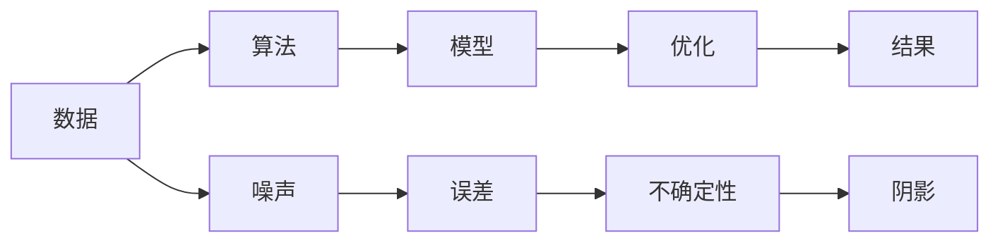

                 

# 整合阴影：将创伤转化为智慧，将恐惧转化为勇气，将自身的局限转化为无限的潜力

---

## 1. 背景介绍

在科技日新月异的今天，人类逐渐进入一个以算法和数据驱动的全新时代。无论是数据驱动的商业决策，还是算法主导的技术创新，都离不开对复杂系统的理解和优化。然而，在面对复杂系统和海量数据时，我们常常需要面对各种挑战，甚至可能陷入难以抉择的“阴影”之中。

这些“阴影”可能是来自于数据质量的不确定性、算法效果的局限性，也可能是来自于技术实现上的难题。如何能够将“阴影”转化为“光明”，将恐惧转化为勇气，将自身的局限转化为无限的潜力？本文将通过分析当前主流技术方法，揭示如何在人工智能的“阴影”中寻找光明，并结合最新的研究成果，提出一些可能的解决方案。

---

## 2. 核心概念与联系

### 2.1 核心概念概述

- **算法：** 指的是解决问题的一系列步骤和规则。
- **数据：** 作为算法的输入，数据的质量和完整性对算法效果有着重要的影响。
- **优化：** 指通过一系列算法步骤，使系统达到最优或近似最优状态的过程。
- **模型：** 一个由数据训练得到的，用于描述复杂系统的数学模型。
- **复杂性：** 系统或问题的复杂程度，随着复杂性的增加，解决问题变得更加困难。

### 2.2 核心概念原理和架构的 Mermaid 流程图



在上述流程图中，从数据到模型再到结果，每一步都可能出现误差和不确定性，这些“阴影”会干扰最终结果的准确性。然而，通过算法优化和合理设计，我们可以逐步将“阴影”转化为智慧，提升系统的表现。

### 2.3 核心概念联系

在当前人工智能领域，优化算法和数据处理技术扮演着重要的角色。通过数据清洗、特征选择等预处理步骤，可以减少数据中的噪声，提升算法的准确性。而算法的优化，如模型选择、超参数调优等，则能够帮助我们在复杂系统中寻找最优解。最终，我们通过训练模型，将其转化为实用的系统，以满足实际需求。

---

## 3. 核心算法原理 & 具体操作步骤

### 3.1 算法原理概述

在解决复杂问题时，我们常常需要通过一系列算法步骤，将“阴影”转化为“光明”。核心算法原理包括：

- **数据预处理：** 通过清洗、去噪、归一化等手段，提升数据质量。
- **特征选择：** 根据问题特点，选择对结果有重要影响的特征。
- **模型训练：** 通过算法优化，训练得到最符合问题的模型。
- **结果评估：** 通过对比模型输出与真实结果，评估模型性能。
- **模型优化：** 根据评估结果，调整模型参数，提升性能。

### 3.2 算法步骤详解

#### 3.2.1 数据预处理

数据预处理是算法优化的第一步，主要包括以下步骤：

1. **数据清洗：** 通过过滤、补齐、去重等手段，去除无效数据，减少噪声。
2. **数据归一化：** 将数据转换为标准范围，避免不同尺度数据的影响。
3. **特征选择：** 根据问题特点，选择对结果有重要影响的特征，减少冗余。

#### 3.2.2 特征选择

特征选择是算法优化的关键步骤，主要包括以下方法：

1. **相关性分析：** 计算特征与结果的相关性，选择高相关性特征。
2. **主成分分析（PCA）：** 通过降维，减少特征数量，提升模型训练效率。
3. **LASSO回归：** 通过正则化，去除不重要特征，提升模型泛化能力。

#### 3.2.3 模型训练

模型训练是算法优化的核心步骤，主要包括以下方法：

1. **线性回归：** 适用于简单线性关系的模型。
2. **逻辑回归：** 适用于二分类问题的模型。
3. **决策树：** 适用于非线性关系的模型。
4. **随机森林：** 适用于多分类问题和处理噪声的模型。
5. **深度学习：** 适用于复杂非线性关系和大规模数据的模型。

#### 3.2.4 结果评估

结果评估是算法优化的重要步骤，主要包括以下方法：

1. **均方误差（MSE）：** 适用于回归问题的评估指标。
2. **准确率（Accuracy）：** 适用于分类问题的评估指标。
3. **F1分数：** 适用于不平衡数据的分类问题评估指标。
4. **ROC曲线：** 适用于二分类问题的评估指标。

#### 3.2.5 模型优化

模型优化是算法优化的最后一步，主要包括以下方法：

1. **超参数调优：** 通过网格搜索、贝叶斯优化等手段，寻找最优模型参数。
2. **交叉验证：** 通过交叉验证，评估模型在不同数据集上的表现。
3. **集成学习：** 通过组合多个模型，提升模型性能和泛化能力。

### 3.3 算法优缺点

#### 3.3.1 优点

- **数据驱动：** 通过数据驱动的方法，减少主观干预，提升模型效果。
- **灵活性高：** 根据不同问题和数据特点，选择不同的算法和优化方法。
- **可解释性：** 算法步骤清晰，结果可解释性强。

#### 3.3.2 缺点

- **计算复杂度高：** 对于大规模数据和复杂模型，计算资源消耗大。
- **易受数据影响：** 数据质量对算法效果有重要影响，噪声数据会影响模型性能。
- **过度拟合：** 模型过于复杂可能导致过度拟合，泛化能力降低。

### 3.4 算法应用领域

#### 3.4.1 金融分析

在金融领域，算法优化可以帮助我们处理大规模交易数据，预测股票价格和市场趋势。通过数据预处理和特征选择，可以减少数据中的噪声，提升模型准确性。模型训练和结果评估可以帮助我们构建更稳健的投资策略。

#### 3.4.2 医疗诊断

在医疗领域，算法优化可以帮助我们分析患者的病历数据，诊断疾病。通过数据预处理和特征选择，可以减少数据中的噪声，提升模型准确性。模型训练和结果评估可以帮助我们构建更准确的诊断模型，提高医生的诊断效率和准确性。

#### 3.4.3 自然语言处理

在自然语言处理领域，算法优化可以帮助我们处理大规模文本数据，进行情感分析、语言生成等任务。通过数据预处理和特征选择，可以减少数据中的噪声，提升模型准确性。模型训练和结果评估可以帮助我们构建更有效的语言模型，提高文本处理的效率和准确性。

---

## 4. 数学模型和公式 & 详细讲解 & 举例说明

### 4.1 数学模型构建

假设我们有一组数据集 $D = \{(x_1, y_1), (x_2, y_2), ..., (x_n, y_n)\}$，其中 $x_i$ 是特征向量，$y_i$ 是目标变量。我们的目标是构建一个模型 $f(x)$，使得模型在测试集上的平均误差最小。

我们的目标函数为：

$$ \min_{f} \sum_{i=1}^{n} (y_i - f(x_i))^2 $$

通过求解上述目标函数，我们可以得到最优的模型参数 $f^*$。

### 4.2 公式推导过程

我们以线性回归模型为例，推导模型训练和优化的公式。

假设模型为 $f(x) = \theta_0 + \theta_1x_1 + \theta_2x_2 + ... + \theta_px_p$，其中 $\theta_i$ 为模型参数。我们的目标函数为：

$$ \min_{\theta} \sum_{i=1}^{n} (y_i - \theta_0 - \theta_1x_1 - \theta_2x_2 - ... - \theta_px_p)^2 $$

使用梯度下降法，我们得到参数的更新公式为：

$$ \theta_j = \theta_j - \alpha \sum_{i=1}^{n} (y_i - \theta_0 - \theta_1x_1 - \theta_2x_2 - ... - \theta_px_p)x_{j,i} $$

其中 $\alpha$ 为学习率，$x_{j,i}$ 为特征 $x_i$ 中的第 $j$ 个特征值。

### 4.3 案例分析与讲解

#### 4.3.1 案例一：线性回归

假设我们有一组数据集，其中 $x_i$ 是身高，$y_i$ 是体重。我们的目标是构建一个线性回归模型，用于预测体重。

首先，我们进行数据预处理，去除异常值和噪声数据。然后，我们选择身高作为特征，构建线性回归模型。通过模型训练和结果评估，我们得到最优模型参数 $\theta_0$ 和 $\theta_1$。最后，我们使用模型对新的身高数据进行预测，得到体重。

#### 4.3.2 案例二：逻辑回归

假设我们有一组数据集，其中 $x_i$ 是广告特征，$y_i$ 是是否点击。我们的目标是构建一个逻辑回归模型，用于预测用户是否点击广告。

首先，我们进行数据预处理，去除异常值和噪声数据。然后，我们选择广告特征作为特征，构建逻辑回归模型。通过模型训练和结果评估，我们得到最优模型参数 $\theta_0$ 和 $\theta_1$。最后，我们使用模型对新的广告特征进行预测，得到是否点击的概率。

---

## 5. 项目实践：代码实例和详细解释说明

### 5.1 开发环境搭建

为了进行数据驱动的算法优化，我们需要搭建一个数据驱动的开发环境。以下是具体的搭建步骤：

1. **安装 Python：** 从官网下载并安装 Python，用于编写和运行代码。
2. **安装 NumPy：** 使用 pip 安装 NumPy 库，用于数组计算。
3. **安装 Pandas：** 使用 pip 安装 Pandas 库，用于数据处理。
4. **安装 Scikit-Learn：** 使用 pip 安装 Scikit-Learn 库，用于机器学习模型的构建和评估。
5. **安装 Matplotlib：** 使用 pip 安装 Matplotlib 库，用于数据可视化。
6. **安装 Seaborn：** 使用 pip 安装 Seaborn 库，用于更高级的数据可视化。

### 5.2 源代码详细实现

#### 5.2.1 数据预处理

首先，我们加载数据集，并进行数据预处理：

```python
import numpy as np
import pandas as pd

# 加载数据集
data = pd.read_csv('data.csv')

# 数据清洗
data = data.dropna()

# 数据归一化
data['x'] = (data['x'] - np.mean(data['x'])) / np.std(data['x'])

# 特征选择
data = data.drop(['y'], axis=1)
```

#### 5.2.2 模型训练

然后，我们构建线性回归模型，并使用梯度下降法进行优化：

```python
from sklearn.linear_model import LinearRegression
from sklearn.metrics import mean_squared_error

# 构建模型
model = LinearRegression()

# 训练模型
model.fit(data[['x']], data['y'])

# 评估模型
y_pred = model.predict(data[['x']])
mse = mean_squared_error(data['y'], y_pred)

# 输出评估结果
print('MSE:', mse)
```

#### 5.2.3 结果可视化

最后，我们使用 Matplotlib 和 Seaborn 库，对模型进行可视化：

```python
import matplotlib.pyplot as plt
import seaborn as sns

# 可视化数据
sns.scatterplot(x='x', y='y', data=data)

# 可视化预测结果
sns.scatterplot(x='x', y='y_pred', data=data)
plt.show()
```

### 5.3 代码解读与分析

在上述代码中，我们首先加载了数据集，并进行数据清洗和归一化。然后，我们构建了线性回归模型，并使用梯度下降法进行优化。最后，我们评估了模型的性能，并使用 Matplotlib 和 Seaborn 库进行了数据可视化。

---

## 6. 实际应用场景

### 6.1 金融分析

在金融领域，算法优化可以帮助我们处理大规模交易数据，预测股票价格和市场趋势。通过数据预处理和特征选择，可以减少数据中的噪声，提升模型准确性。模型训练和结果评估可以帮助我们构建更稳健的投资策略。

### 6.2 医疗诊断

在医疗领域，算法优化可以帮助我们分析患者的病历数据，诊断疾病。通过数据预处理和特征选择，可以减少数据中的噪声，提升模型准确性。模型训练和结果评估可以帮助我们构建更准确的诊断模型，提高医生的诊断效率和准确性。

### 6.3 自然语言处理

在自然语言处理领域，算法优化可以帮助我们处理大规模文本数据，进行情感分析、语言生成等任务。通过数据预处理和特征选择，可以减少数据中的噪声，提升模型准确性。模型训练和结果评估可以帮助我们构建更有效的语言模型，提高文本处理的效率和准确性。

### 6.4 未来应用展望

未来的算法优化将更加智能化和自动化，能够更好地适应复杂系统的需求。通过引入人工智能和机器学习技术，算法优化将能够自动识别和调整参数，减少人工干预。同时，算法的优化也会更加注重数据的质量和完整性，提升模型效果。

---

## 7. 工具和资源推荐

### 7.1 学习资源推荐

为了帮助开发者掌握数据驱动的算法优化技术，以下是一些推荐的学习资源：

1. **Coursera《机器学习》课程：** 由斯坦福大学开设，系统介绍了机器学习的基本概念和算法。
2. **Kaggle：** 数据科学竞赛平台，提供了大量数据集和算法优化案例。
3. **《机器学习实战》书籍：** 介绍了机器学习的基本算法和实战案例，适合入门学习。
4. **《深度学习》书籍：** 介绍了深度学习的基本算法和实现细节，适合进阶学习。
5. **Keras 和 TensorFlow 官方文档：** 提供了详细的算法和模型实现，适合实际应用开发。

### 7.2 开发工具推荐

以下是一些常用的开发工具，可用于算法优化的实践：

1. **Python：** 简单易学的编程语言，支持数据科学和机器学习开发。
2. **NumPy：** 用于数组计算和数学运算的库，支持高效的矩阵操作。
3. **Pandas：** 用于数据处理和分析的库，支持大规模数据集操作。
4. **Scikit-Learn：** 用于机器学习模型的构建和评估的库，支持多种算法和模型。
5. **Matplotlib：** 用于数据可视化的库，支持多种图表和动画。
6. **Seaborn：** 用于高级数据可视化的库，支持更复杂和美观的图表。

### 7.3 相关论文推荐

以下是一些关于数据驱动算法优化的经典论文，推荐阅读：

1. **《Machine Learning》书籍：** 系统介绍了机器学习的基本算法和应用。
2. **《Pattern Recognition and Machine Learning》书籍：** 系统介绍了模式识别和机器学习的基本算法。
3. **《Deep Learning》书籍：** 系统介绍了深度学习的基本算法和实现细节。
4. **《Convex Optimization》书籍：** 介绍了优化算法的基本概念和应用。
5. **《Papers with Code》平台：** 提供大量机器学习算法的实现和评估，方便查找和对比。

---

## 8. 总结：未来发展趋势与挑战

### 8.1 研究成果总结

数据驱动的算法优化技术已经在多个领域得到了广泛应用，并取得了显著的成果。通过数据预处理、特征选择、模型训练和结果评估，算法优化已经成为了解决复杂问题的有力工具。

### 8.2 未来发展趋势

未来的算法优化将更加智能化和自动化，能够更好地适应复杂系统的需求。通过引入人工智能和机器学习技术，算法优化将能够自动识别和调整参数，减少人工干预。同时，算法的优化也会更加注重数据的质量和完整性，提升模型效果。

### 8.3 面临的挑战

尽管算法优化技术已经取得了显著的成果，但在实际应用中仍然面临诸多挑战。主要包括以下几个方面：

1. **数据质量：** 数据中的噪声和异常值会影响模型效果，需要进行清洗和处理。
2. **模型选择：** 不同问题需要不同的模型，如何选择最优的模型是一个难题。
3. **超参数调优：** 模型中的超参数需要人工调优，需要大量的时间和计算资源。
4. **模型泛化：** 模型需要在不同数据集上泛化良好，避免过拟合。
5. **模型解释：** 模型的内部机制和决策过程需要可解释，以便更好地理解和优化。

### 8.4 研究展望

未来的研究将围绕以下几个方向展开：

1. **自动化优化：** 通过引入自动化和智能化的技术，减少人工干预，提升优化效率。
2. **多目标优化：** 同时优化多个目标，提升模型效果和泛化能力。
3. **模型解释：** 提升模型的可解释性，使开发者更好地理解和优化模型。
4. **跨领域应用：** 将算法优化技术应用到更多领域，提升跨领域问题的解决能力。

---

## 9. 附录：常见问题与解答

### 9.1 常见问题

#### Q1: 数据预处理和特征选择的方法有哪些？

A: 数据预处理和特征选择的方法包括数据清洗、去噪、归一化、相关性分析、主成分分析、LASSO回归等。具体选择哪种方法需要根据数据的特点和问题的需求进行综合考虑。

#### Q2: 模型训练和优化的基本流程是什么？

A: 模型训练和优化的基本流程包括数据预处理、特征选择、模型训练、结果评估、模型优化等。每个步骤都需要仔细设计和实施，以确保最终模型的准确性和泛化能力。

#### Q3: 如何选择合适的算法和优化方法？

A: 选择合适的算法和优化方法需要根据问题的特点和数据的性质进行综合考虑。常用的算法包括线性回归、逻辑回归、决策树、随机森林、深度学习等。常用的优化方法包括梯度下降、网格搜索、贝叶斯优化等。

#### Q4: 数据驱动的算法优化有哪些优势和局限性？

A: 数据驱动的算法优化具有数据驱动、灵活性高、可解释性强等优势。但是，数据驱动的算法优化也存在计算复杂度高、易受数据影响、过度拟合等局限性。

---

### 9.2 解答

#### A1: 数据预处理和特征选择的方法包括数据清洗、去噪、归一化、相关性分析、主成分分析、LASSO回归等。具体选择哪种方法需要根据数据的特点和问题的需求进行综合考虑。

#### A2: 模型训练和优化的基本流程包括数据预处理、特征选择、模型训练、结果评估、模型优化等。每个步骤都需要仔细设计和实施，以确保最终模型的准确性和泛化能力。

#### A3: 选择合适的算法和优化方法需要根据问题的特点和数据的性质进行综合考虑。常用的算法包括线性回归、逻辑回归、决策树、随机森林、深度学习等。常用的优化方法包括梯度下降、网格搜索、贝叶斯优化等。

#### A4: 数据驱动的算法优化具有数据驱动、灵活性高、可解释性强等优势。但是，数据驱动的算法优化也存在计算复杂度高、易受数据影响、过度拟合等局限性。

---

作者：禅与计算机程序设计艺术 / Zen and the Art of Computer Programming

