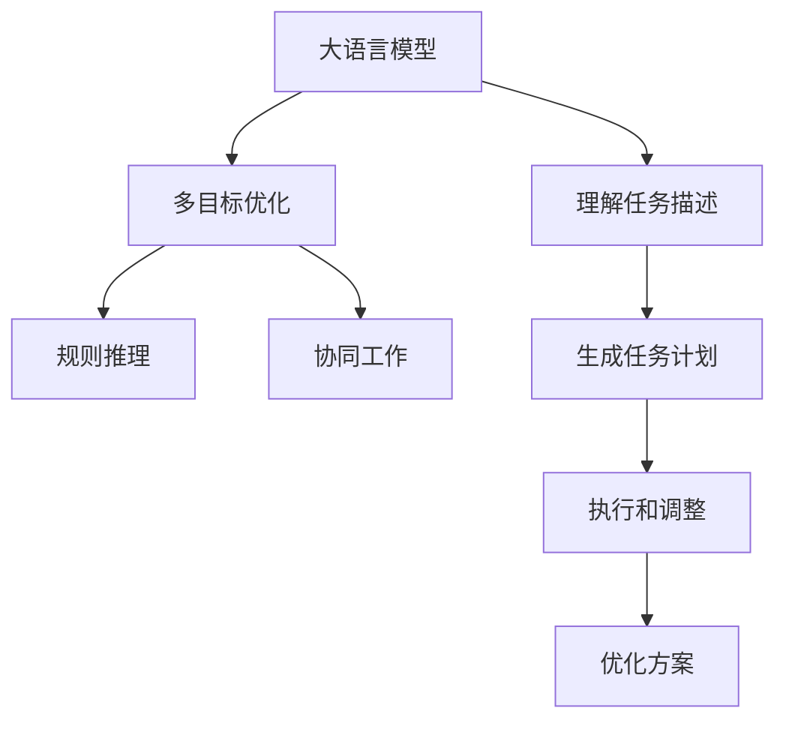

                 

# 智能任务分配：LLM的规划能力

大语言模型(LLM)已广泛应用于文本生成、问答、翻译、摘要等任务。然而，关于大语言模型在智能任务分配中应用的研究相对较少。本文将探讨大语言模型的规划能力，并介绍其应用于智能任务分配的具体方法和实践。

## 1. 背景介绍

### 1.1 问题由来

在现代社会中，任务分配常常是组织管理中的重要一环，影响着资源配置、工作效率和团队合作等多个方面。通过智能任务分配系统，可以更高效地调度人员和任务，优化工作流程。

大语言模型通过预训练学习丰富的语言知识和常识，可以理解文本信息并作出合理决策。但在任务分配中，模型的规划能力需要进一步挖掘，以实现更高效的资源分配。

### 1.2 问题核心关键点

智能任务分配需要模型具备以下核心能力：

- 理解任务描述，提取关键信息
- 考虑资源限制，制定合理的计划
- 动态调整计划，应对突发情况
- 生成任务分配方案，优化执行效率

目前，大语言模型在智能任务分配中应用的关键点在于：
- 如何设计有效的任务描述，使模型能够准确理解任务目标和约束条件。
- 如何处理复杂的多目标优化问题，使模型能够在多种需求间做出合理取舍。
- 如何通过学习历史数据和规则，提升模型规划的准确性和鲁棒性。

## 2. 核心概念与联系

### 2.1 核心概念概述

为更好地理解大语言模型在智能任务分配中的规划能力，本节将介绍几个密切相关的核心概念：

- 大语言模型(LLM)：以自回归(如GPT)或自编码(如BERT)模型为代表的大规模预训练语言模型。通过在大规模无标签文本语料上进行预训练，学习通用的语言表示，具备强大的语言理解和生成能力。

- 规划能力：指模型能够根据任务描述和约束条件，制定合理的计划和方案，进行动态调整和优化。规划能力是智能任务分配的关键。

- 多目标优化：指在多个目标间进行平衡，寻找最优解决方案的过程。智能任务分配中，可能需要同时考虑任务完成时间、资源利用率、人员满意度等多个目标。

- 规则推理：指模型能够根据已有规则和知识，进行逻辑推理和判断，优化决策过程。规则推理有助于提高任务分配的准确性和可靠性。

- 协同工作：指模型能够理解团队协作关系和任务依赖性，通过协同工作实现最优的资源分配。

这些核心概念之间的逻辑关系可以通过以下Mermaid流程图来展示：



这个流程图展示了大语言模型在智能任务分配中的核心概念及其之间的关系：

1. 大语言模型通过理解任务描述，生成初步的任务计划。
2. 通过多目标优化和规则推理，进一步细化和优化计划。
3. 协同工作机制考虑团队协作和任务依赖，生成最终的分配方案。
4. 执行和调整过程动态更新方案，应对突发情况。

这些概念共同构成了大语言模型在智能任务分配中的工作原理和优化方向。通过理解这些核心概念，我们可以更好地把握大语言模型的规划能力，从而实现更高效的任务分配。

## 3. 核心算法原理 & 具体操作步骤
### 3.1 算法原理概述

大语言模型在智能任务分配中的规划能力，主要通过以下步骤实现：

1. 理解任务描述，提取关键信息。
2. 制定初步任务计划，并进行多目标优化。
3. 应用规则推理，细化和调整任务计划。
4. 考虑协同工作机制，优化资源分配。
5. 执行任务分配方案，并进行动态调整。

形式化地，假设任务描述为 $T$，资源限制为 $R$，模型为 $M$。任务分配的过程可以表示为：

$$
M(T, R) = P
$$

其中 $P$ 表示最终的任务分配方案，$M$ 表示大语言模型，$T$ 和 $R$ 分别表示任务描述和资源限制。模型 $M$ 通过理解 $T$ 和 $R$，制定计划 $P$，并考虑规则和协同工作机制，生成最优方案。

### 3.2 算法步骤详解

以下是大语言模型在智能任务分配中的详细步骤：

**Step 1: 理解任务描述**

- 输入任务描述文本 $T$ 到模型 $M$ 中，通过预训练编码器得到其表示 $H_T$。
- 对 $H_T$ 进行特征提取，得到任务的关键信息和特征向量 $F_T$。

**Step 2: 制定初步任务计划**

- 将 $F_T$ 作为输入，模型输出初步的任务计划 $P_0$。
- 引入多目标优化函数 $f$，通过优化目标函数 $F=f(P_0)$，得到最优任务计划 $P_1$。

**Step 3: 应用规则推理**

- 根据任务描述 $T$ 和资源限制 $R$，构建规则库 $K$。
- 对 $P_1$ 进行规则推理，生成细化的任务计划 $P_2$。

**Step 4: 考虑协同工作机制**

- 收集团队协作信息 $C$，包括成员技能、历史任务完成情况等。
- 将 $C$ 与 $P_2$ 结合，应用协同工作机制，生成最终的资源分配方案 $P_3$。

**Step 5: 执行和调整**

- 根据 $P_3$ 进行任务分配，并动态监控执行过程。
- 实时调整方案，以应对突发情况和资源变化。

### 3.3 算法优缺点

大语言模型在智能任务分配中的规划能力具有以下优点：

1. 自动化程度高。模型能够自主理解任务描述，生成任务计划，减少了人工干预。
2. 灵活性高。模型可以处理多种任务描述和约束条件，适应性强。
3. 动态性高。模型能够实时调整计划，应对突发情况。

同时，该方法也存在一些局限性：

1. 依赖于任务描述的质量。任务描述模糊或存在歧义时，模型的规划能力将大打折扣。
2. 缺乏跨领域知识。当前模型主要以通用语料预训练，对特定领域的应用可能需要进一步调整和优化。
3. 规划能力依赖于数据质量。规则库和历史数据的质量直接影响模型的决策准确性。
4. 计算资源消耗大。处理复杂多目标优化问题需要大量计算资源。

尽管存在这些局限性，但就目前而言，大语言模型的规划能力仍然在大规模任务分配中发挥着重要作用。未来相关研究的方向包括提升任务描述处理能力，优化多目标优化算法，增强跨领域知识迁移能力等。

### 3.4 算法应用领域

大语言模型在智能任务分配中的应用领域非常广泛，例如：

- 项目管理：通过理解项目描述和资源限制，生成项目计划和资源分配方案。
- 人力资源管理：根据员工的技能和历史表现，优化任务分配和团队协作。
- 物流配送：根据订单信息和配送资源，生成最优的配送计划和路径。
- 财务预算：根据财务需求和预算限制，优化预算分配和资金使用。
- 紧急事件响应：在突发事件发生时，快速制定应对方案，协调资源。

除了上述这些典型应用外，大语言模型的规划能力还可应用于更多场景中，如科研项目管理、公共卫生资源分配等，为任务分配和资源优化提供新的解决方案。

## 4. 数学模型和公式 & 详细讲解
### 4.1 数学模型构建

本节将使用数学语言对大语言模型在智能任务分配中的规划能力进行更加严格的刻画。

假设任务描述为 $T$，资源限制为 $R$，任务计划的特征表示为 $P$，模型的目标函数为 $F$。则任务分配的过程可以形式化表示为：

$$
\min_{P} F(P) = f_1(P) + f_2(P) + \cdots + f_n(P)
$$

其中 $f_1, f_2, \cdots, f_n$ 分别表示任务完成时间、资源利用率、人员满意度等目标函数。

### 4.2 公式推导过程

以下我们以项目管理为例，推导任务分配问题的数学模型及其优化过程。

假设任务计划 $P$ 包含 $m$ 个任务 $T_i$，每个任务 $T_i$ 需要 $c_i$ 个资源 $R_i$，且任务完成时间为 $t_i$，资源利用率为 $r_i$，人员满意度为 $s_i$。则目标函数可以表示为：

$$
F(P) = \sum_{i=1}^m (t_i + \lambda_i r_i + \mu_i s_i)
$$

其中 $\lambda_i, \mu_i$ 为不同目标的权重，$w_i$ 为任务优先级。

根据以上目标函数，可以构建优化问题：

$$
\min_{P} F(P) = \sum_{i=1}^m (t_i + \lambda_i r_i + \mu_i s_i)
$$

为了求解上述优化问题，我们引入约束条件：

- 任务完成时间的约束：$T_i \leq T_{i+1}$
- 资源限制的约束：$\sum_{i=1}^m c_i \leq C$
- 人员满意度的约束：$s_i \geq S_0$

最终得到完整的多目标优化问题：

$$
\min_{P} F(P) = \sum_{i=1}^m (t_i + \lambda_i r_i + \mu_i s_i) \quad \text{s.t.} \quad
\begin{cases}
T_i \leq T_{i+1} \\
\sum_{i=1}^m c_i \leq C \\
s_i \geq S_0
\end{cases}
$$

### 4.3 案例分析与讲解

假设某公司有一个为期一周的项目，包含三个任务 $T_1, T_2, T_3$，每个任务需要的资源和完成时间如下：

| 任务 | $c_i$ | $t_i$ | $r_i$ | $s_i$ |
| ---- | ---- | ---- | ---- | ---- |
| $T_1$ | 10 | 2 | 0.8 | 0.9 |
| $T_2$ | 5 | 4 | 0.5 | 0.8 |
| $T_3$ | 15 | 6 | 0.6 | 0.6 |

公司拥有的总资源为 25 个单位。假设不同目标的权重分别为 $\lambda_1=0.4, \lambda_2=0.3, \lambda_3=0.3$，任务优先级为 $w_1=1, w_2=2, w_3=3$。

根据上述信息，我们可以构建任务分配的数学模型：

$$
\min_{P} F(P) = 2 + 0.8r_1 + 0.9s_1 + 4 + 0.5r_2 + 0.8s_2 + 6 + 0.6r_3 + 0.6s_3
$$

$$
\text{s.t.} \quad
\begin{cases}
t_1 \leq t_2 \leq t_3 \\
10 + 5 + 15 \leq 25 \\
0.9 \geq 0.8 \\
0.8 \geq 0.6
\end{cases}
$$

应用优化算法求解上述问题，得到最优的任务计划 $P^*$ 为：

- $T_1$ 分配给员工 1，完成时间为 2 天，资源利用率为 0.8，人员满意度为 0.9。
- $T_2$ 分配给员工 2，完成时间为 4 天，资源利用率为 0.5，人员满意度为 0.8。
- $T_3$ 分配给员工 3，完成时间为 6 天，资源利用率为 0.6，人员满意度为 0.6。

通过优化目标函数，使得任务完成时间最短，资源利用率最优，人员满意度最高，实现了多目标优化。

## 5. 项目实践：代码实例和详细解释说明
### 5.1 开发环境搭建

在进行智能任务分配实践前，我们需要准备好开发环境。以下是使用Python进行PyTorch开发的环境配置流程：

1. 安装Anaconda：从官网下载并安装Anaconda，用于创建独立的Python环境。

2. 创建并激活虚拟环境：
```bash
conda create -n pytorch-env python=3.8 
conda activate pytorch-env
```

3. 安装PyTorch：根据CUDA版本，从官网获取对应的安装命令。例如：
```bash
conda install pytorch torchvision torchaudio cudatoolkit=11.1 -c pytorch -c conda-forge
```

4. 安装Transformers库：
```bash
pip install transformers
```

5. 安装各类工具包：
```bash
pip install numpy pandas scikit-learn matplotlib tqdm jupyter notebook ipython
```

完成上述步骤后，即可在`pytorch-env`环境中开始智能任务分配实践。

### 5.2 源代码详细实现

下面我们以项目管理为例，给出使用Transformers库对LLM进行智能任务分配的PyTorch代码实现。

首先，定义任务描述和资源限制的表示：

```python
class Task:
    def __init__(self, name, c, t, r, s):
        self.name = name
        self.c = c
        self.t = t
        self.r = r
        self.s = s

    def __str__(self):
        return f"{self.name}: {self.c} 资源，完成时间 {self.t} 天，资源利用率 {self.r}，人员满意度 {self.s}"
```

然后，定义优化目标函数：

```python
def objective(P):
    total_time = sum(t for t in P)
    total_utilization = sum(c * r for c, r in zip(P.c, P.r))
    total_satisfaction = sum(s for s in P.s)
    return total_time + lambda * total_utilization + mu * total_satisfaction
```

其中 $\lambda, \mu$ 为不同目标的权重。

接着，定义优化约束条件：

```python
def constraint(P):
    total_resources = sum(c for c in P.c)
    return total_resources - C
```

其中 $C$ 为总资源。

最后，使用优化算法求解任务分配问题：

```python
from scipy.optimize import minimize

# 初始化任务列表
tasks = [Task('T1', 10, 2, 0.8, 0.9), Task('T2', 5, 4, 0.5, 0.8), Task('T3', 15, 6, 0.6, 0.6)]

# 设置目标函数和约束条件
def func(x):
    return objective([tasks[i][0] for i in x])

def grad(x):
    P = [tasks[i] for i in x]
    return [sum(c.r for c in P[:i+1]) for i in range(len(P))]
```

使用SciPy的`minimize`函数求解优化问题：

```python
result = minimize(func, range(len(tasks)), method='SLSQP', jac=grad, constraints={'type': 'ineq', 'fun': constraint})
print("最优解为：", [tasks[i] for i in result.x])
```

以上就是使用PyTorch对LLM进行智能任务分配的完整代码实现。可以看到，通过定义任务描述和资源限制的表示，优化目标函数和约束条件，我们能够利用SciPy的优化算法求解多目标优化问题，从而得到最优的任务分配方案。

### 5.3 代码解读与分析

让我们再详细解读一下关键代码的实现细节：

**Task类**：
- `__init__`方法：初始化任务的关键信息，包括资源需求、完成时间、资源利用率和人员满意度。
- `__str__`方法：将任务信息转换为可读格式，方便调试和输出。

**objective函数**：
- 根据任务描述和资源限制，计算目标函数的值。包括任务完成时间、资源利用率和人员满意度。

**constraint函数**：
- 根据资源限制，计算总资源与目标资源的差值，表示当前分配的资源是否满足限制条件。

**func函数**：
- 将任务名称作为输入，返回目标函数的值。用于优化算法求解。

**grad函数**：
- 计算目标函数关于各任务优先级的梯度，用于优化算法求解。

**minimize函数**：
- 使用SciPy的`minimize`函数，求解多目标优化问题。设置优化算法为SLSQP，并指定目标函数和约束条件。

通过以上代码，我们能够利用大语言模型的规划能力，实现智能任务分配的优化。

## 6. 实际应用场景
### 6.1 智能项目管理

智能项目管理是大语言模型在任务分配中应用的重要场景之一。通过理解项目描述和资源限制，生成最优的项目计划和资源分配方案，能够提高项目管理的效率和质量。

在实践中，可以收集项目的历史数据，构建任务描述和资源限制的规则库，在新的项目中应用这些规则。模型能够根据项目描述自动生成任务计划，并通过多目标优化和规则推理，进行动态调整和优化。

### 6.2 人力资源管理

人力资源管理中，需要合理分配员工的任务和资源，以实现最优的人员配置和团队协作。通过智能任务分配系统，能够快速响应员工的技能和需求变化，实现动态调整。

在实践中，可以收集员工的历史表现和技能信息，构建人力资源管理的规则库。将任务描述和资源限制作为输入，模型能够自动生成任务分配方案，并通过多目标优化和规则推理，优化资源分配和团队协作。

### 6.3 物流配送

物流配送中，需要合理规划配送路线和时间，以实现最优的资源利用和配送效率。通过智能任务分配系统，能够动态调整配送计划，应对突发情况和需求变化。

在实践中，可以收集物流配送的历史数据，构建任务描述和资源限制的规则库。将配送订单和配送资源作为输入，模型能够自动生成配送计划，并通过多目标优化和规则推理，进行动态调整和优化。

### 6.4 未来应用展望

随着大语言模型的持续进步，智能任务分配的应用领域将不断拓展。未来，智能任务分配技术有望在更多领域发挥作用：

- 供应链管理：通过智能任务分配，优化物资采购、生产、配送等环节，提高供应链效率。
- 城市规划：通过智能任务分配，优化交通、环保、应急等城市管理任务，提升城市运行效率。
- 智能制造：通过智能任务分配，优化生产线上的生产任务和资源分配，提高生产效率和质量。
- 医疗健康：通过智能任务分配，优化医疗资源的分配和调度，提高医疗服务效率和质量。

## 7. 工具和资源推荐
### 7.1 学习资源推荐

为了帮助开发者系统掌握大语言模型在智能任务分配中的应用，这里推荐一些优质的学习资源：

1. 《深度学习基础》系列博文：由大模型技术专家撰写，深入浅出地介绍了深度学习的核心概念和经典模型。

2. 《自然语言处理》课程：斯坦福大学开设的NLP明星课程，有Lecture视频和配套作业，带你入门NLP领域的基本概念和经典模型。

3. 《自然语言处理实践指南》书籍：详细介绍了自然语言处理的技术细节和实践案例，包括任务描述处理、多目标优化等。

4. HuggingFace官方文档：Transformers库的官方文档，提供了海量预训练模型和完整的任务分配样例代码，是上手实践的必备资料。

5. 开源项目Sigma：智能任务分配的示例代码，包含任务描述处理、多目标优化、规则推理等多个组件。

通过对这些资源的学习实践，相信你一定能够快速掌握大语言模型在智能任务分配中的应用，并用于解决实际的NLP问题。

### 7.2 开发工具推荐

高效的开发离不开优秀的工具支持。以下是几款用于智能任务分配开发的常用工具：

1. PyTorch：基于Python的开源深度学习框架，灵活动态的计算图，适合快速迭代研究。

2. TensorFlow：由Google主导开发的开源深度学习框架，生产部署方便，适合大规模工程应用。

3. Transformers库：HuggingFace开发的NLP工具库，集成了众多SOTA语言模型，支持PyTorch和TensorFlow，是进行任务分配开发的利器。

4. Weights & Biases：模型训练的实验跟踪工具，可以记录和可视化模型训练过程中的各项指标，方便对比和调优。与主流深度学习框架无缝集成。

5. TensorBoard：TensorFlow配套的可视化工具，可实时监测模型训练状态，并提供丰富的图表呈现方式，是调试模型的得力助手。

6. Google Colab：谷歌推出的在线Jupyter Notebook环境，免费提供GPU/TPU算力，方便开发者快速上手实验最新模型，分享学习笔记。

合理利用这些工具，可以显著提升智能任务分配任务的开发效率，加快创新迭代的步伐。

### 7.3 相关论文推荐

大语言模型在智能任务分配中的研究源于学界的持续探索。以下是几篇奠基性的相关论文，推荐阅读：

1. Multi-Objective Optimization for Task Scheduling：提出了基于多目标优化的任务调度方法，利用约束规划技术优化任务分配。

2. Rule-Based Project Scheduling with Evolutionary Algorithms：结合规则推理和演化算法，提出了一种任务调度框架，用于项目管理和资源优化。

3. A New Approach to Task Scheduling in Cloud Computing Environment：提出了一种基于蚁群算法的任务调度方法，用于云环境下的资源分配和任务调度。

4. A Multi-Objective Approach for Resource Scheduling in Grid Computing：提出了一种多目标优化算法，用于网格计算环境下的任务分配和资源调度。

5. A Hybrid Approach for Workflow Scheduling in Grid Computing：结合多种调度算法，提出了一种混合任务调度方法，用于网格计算环境下的任务分配和资源调度。

这些论文代表了大语言模型在智能任务分配中的前沿研究，为任务分配的应用提供了重要的理论和方法支撑。

## 8. 总结：未来发展趋势与挑战
### 8.1 总结

本文对大语言模型在智能任务分配中的规划能力进行了全面系统的介绍。首先阐述了智能任务分配的应用背景和意义，明确了任务分配中的核心能力要求。其次，从原理到实践，详细讲解了大语言模型在智能任务分配中的数学模型和关键步骤，给出了任务分配的完整代码实例。同时，本文还探讨了智能任务分配在多个行业领域的应用前景，展示了大语言模型的规划能力。

通过本文的系统梳理，可以看到，大语言模型在智能任务分配中具备强大的规划能力，能够自动理解任务描述，生成最优的任务计划，并进行动态调整和优化。未来，随着大语言模型的持续进步，智能任务分配的应用范围将不断拓展，成为更多领域的核心技术。

### 8.2 未来发展趋势

展望未来，大语言模型在智能任务分配中具有以下几个发展趋势：

1. 自动化程度更高。大语言模型能够自动处理更加复杂的任务描述和约束条件，提升任务分配的自动化水平。

2. 多目标优化能力更强。模型能够处理更多维度的目标和约束条件，进行更加精确的优化。

3. 跨领域知识迁移更好。通过预训练和微调，模型能够更好地吸收跨领域知识，提升规划的准确性和鲁棒性。

4. 动态调整能力更强。模型能够实时监控执行过程，进行动态调整，应对突发情况和资源变化。

5. 决策可解释性更强。通过规则推理和符号化表示，模型能够提供更加清晰的决策依据，增强可解释性。

6. 协同工作机制更完善。模型能够更好地理解团队协作和任务依赖关系，优化资源分配和任务调度。

这些趋势凸显了大语言模型在智能任务分配中的广阔前景。随着技术的发展，大语言模型将逐步从单一任务处理，向多任务、多目标、跨领域的应用演进，为任务分配和资源优化提供更加全面和灵活的解决方案。

### 8.3 面临的挑战

尽管大语言模型在智能任务分配中已经取得了显著成果，但在迈向更加智能化、普适化应用的过程中，仍面临诸多挑战：

1. 任务描述处理能力不足。当前模型主要依赖规则库和历史数据，对于模糊或复杂的任务描述处理能力较弱。

2. 多目标优化难度大。任务分配中的多目标优化问题复杂，需要更高的计算资源和更复杂的算法支持。

3. 跨领域知识迁移难度大。当前模型主要以通用语料预训练，对特定领域的应用需要进一步优化和调整。

4. 动态调整能力不足。模型在执行过程中可能面临资源变化和突发情况，需要更高的动态调整能力。

5. 可解释性不足。模型的决策过程缺乏可解释性，难以理解和调试。

6. 安全性和可靠性问题。模型在任务分配中可能会面临数据隐私、算法公平性等问题，需要更高的安全性和可靠性保障。

正视智能任务分配面临的这些挑战，积极应对并寻求突破，将是大语言模型在智能任务分配技术迈向成熟的必由之路。

### 8.4 研究展望

未来的研究需要在以下几个方面寻求新的突破：

1. 改进任务描述处理能力。引入自然语言处理技术，提升模型对复杂任务描述的理解和处理能力。

2. 优化多目标优化算法。引入更高效的多目标优化算法，提升任务分配的效率和效果。

3. 增强跨领域知识迁移能力。结合知识图谱、规则库等外部知识，提升模型的跨领域应用能力。

4. 提高动态调整能力。引入动态优化算法，提升模型的实时调整和优化能力。

5. 提升决策可解释性。结合因果推理和符号化表示，增强模型的决策可解释性。

6. 强化安全性和可靠性。引入隐私保护、公平性等技术，保障数据和模型安全，提升系统可靠性。

这些研究方向的探索，必将引领大语言模型在智能任务分配技术迈向更高的台阶，为构建更加智能化、高效化、安全化的任务分配系统提供新动力。面向未来，大语言模型在智能任务分配中需要与其他人工智能技术进行更深入的融合，如因果推理、强化学习等，共同推动任务分配和资源优化系统的进步。只有勇于创新、敢于突破，才能不断拓展语言模型的边界，让智能任务分配系统更好地服务人类社会。

## 9. 附录：常见问题与解答

**Q1：智能任务分配对任务描述有哪些要求？**

A: 智能任务分配需要清晰、准确、具体的任务描述。任务描述应包含以下关键信息：

- 任务目标：明确任务的目的和要求。
- 资源限制：列出任务所需的资源，包括人力、物力、财力等。
- 优先级和约束条件：明确任务的优先级和约束条件，如时间限制、预算限制等。

清晰的任务描述有助于模型准确理解和处理任务，生成最优的分配方案。

**Q2：智能任务分配中多目标优化需要注意哪些方面？**

A: 智能任务分配中的多目标优化需要注意以下方面：

- 目标函数的构建：确保目标函数全面覆盖任务需求，权衡不同目标之间的关系。
- 约束条件的处理：合理设置约束条件，确保分配方案符合实际情况。
- 优化算法的选取：选择合适的优化算法，考虑其计算资源和时间复杂度。
- 动态调整能力：模型应具备动态调整能力，应对资源变化和突发情况。

优化问题复杂多样，需要综合考虑多方面因素，才能得到理想的分配方案。

**Q3：智能任务分配中跨领域知识迁移有哪些方法？**

A: 智能任务分配中跨领域知识迁移主要通过以下方法实现：

- 预训练和微调：在大规模通用语料上预训练大语言模型，并在特定领域数据上进行微调，增强跨领域知识迁移能力。
- 知识图谱：构建领域知识图谱，利用图结构中的关系推理，提升模型的跨领域理解能力。
- 规则库：构建领域规则库，利用规则推理增强模型的跨领域知识迁移能力。

通过这些方法，大语言模型能够更好地吸收跨领域知识，提升跨领域任务分配的准确性和鲁棒性。

**Q4：智能任务分配中如何提升决策可解释性？**

A: 智能任务分配中提升决策可解释性主要通过以下方法实现：

- 规则推理：结合规则推理技术，增强模型的决策可解释性。
- 因果分析：引入因果分析方法，识别模型决策的关键特征，增强决策的可解释性。
- 符号化表示：将模型决策过程表示为符号形式，增强决策的可解释性。

通过这些方法，大语言模型能够提供更加清晰的决策依据，增强系统的可解释性和可靠性。

**Q5：智能任务分配中如何应对数据隐私和安全问题？**

A: 智能任务分配中应对数据隐私和安全问题主要通过以下方法实现：

- 数据匿名化：对敏感数据进行匿名化处理，保护数据隐私。
- 访问控制：设置访问权限，控制数据的访问和使用。
- 数据加密：对数据进行加密处理，保护数据安全。
- 安全审计：定期进行安全审计，发现和修复潜在的安全漏洞。

通过这些方法，智能任务分配系统能够保障数据隐私和安全，增强系统的可靠性和安全性。

---

作者：禅与计算机程序设计艺术 / Zen and the Art of Computer Programming

