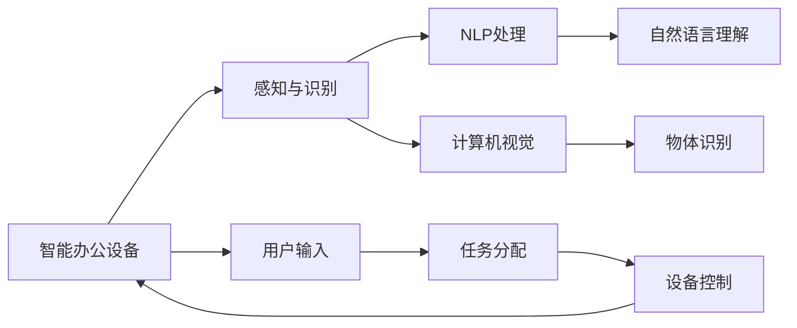

                 

## 1. 背景介绍

在数字化办公的今天，智能办公设备如智能白板、电子白板、智能显示屏等，已经成为提升办公效率、优化会议体验的重要工具。但随着这些设备的功能越来越强大，如何合理管理设备注意力，以提升使用效率、优化会议体验，成为了一个迫切需要解决的问题。本文将从注意力管理的核心概念入手，探讨如何通过技术手段，对智能办公设备进行注意力管理，优化用户使用体验。

## 2. 核心概念与联系

### 2.1 核心概念概述

- **智能办公设备**：指集成了人工智能技术，能够自动感知环境变化、识别用户指令、自主进行信息显示和交互的办公设备，如智能白板、智能显示屏等。
- **注意力管理**：指通过技术手段，对智能办公设备的使用焦点进行管理和优化，以提升设备的使用效率和用户体验。
- **感知与识别**：指智能办公设备通过摄像头、麦克风、传感器等输入设备，实时感知用户行为、环境变化等，并通过AI技术进行识别和处理。
- **自然语言处理(NLP)**：指智能办公设备使用NLP技术，对用户输入的文本或语音指令进行理解和处理，实现与用户的自然交互。
- **计算机视觉**：指智能办公设备通过计算机视觉技术，对视频流或图像进行分析和处理，如人脸识别、物体识别等。

这些核心概念通过智能感知、AI处理、自然语言处理和计算机视觉等技术手段，共同构成了智能办公设备注意力管理的功能实现。

### 2.2 核心概念原理和架构的 Mermaid 流程图



这个流程图展示了智能办公设备从感知与识别、NLP处理、计算机视觉到设备控制的整体工作流程。通过这些核心技术，智能办公设备能够智能管理设备的注意力，实现对用户的有效服务。

## 3. 核心算法原理 & 具体操作步骤

### 3.1 算法原理概述

智能办公设备的注意力管理，主要是通过对用户行为和环境变化的感知与识别，结合NLP和计算机视觉技术进行处理和分析，最终通过任务分配和设备控制，实现对设备注意力的有效管理。其核心算法包括以下几个部分：

- **感知与识别算法**：通过摄像头、麦克风、传感器等输入设备，对用户行为、环境变化进行实时感知和识别，并转化为设备可以处理的数据。
- **自然语言处理算法**：使用NLP技术，对用户输入的文本或语音指令进行理解和处理，解析出用户意图，并与设备进行自然交互。
- **计算机视觉算法**：通过计算机视觉技术，对视频流或图像进行分析和处理，如人脸识别、物体识别等，进一步提升设备对环境的感知能力。
- **任务分配算法**：根据用户意图和设备状态，动态分配任务给相应的应用或功能模块，实现对设备注意力的智能管理。
- **设备控制算法**：通过设备控制接口，实现对智能办公设备的直接控制，如显示、互动、联动等。

### 3.2 算法步骤详解

智能办公设备的注意力管理主要包括以下几个关键步骤：

**Step 1: 感知与识别**
智能办公设备通过摄像头、麦克风、传感器等输入设备，实时感知用户行为、环境变化等，并将其转化为设备可以处理的数据。

**Step 2: NLP处理**
使用NLP技术，对用户输入的文本或语音指令进行理解和处理，解析出用户意图，并与设备进行自然交互。

**Step 3: 计算机视觉处理**
通过计算机视觉技术，对视频流或图像进行分析和处理，如人脸识别、物体识别等，进一步提升设备对环境的感知能力。

**Step 4: 任务分配**
根据用户意图和设备状态，动态分配任务给相应的应用或功能模块，实现对设备注意力的智能管理。

**Step 5: 设备控制**
通过设备控制接口，实现对智能办公设备的直接控制，如显示、互动、联动等。

### 3.3 算法优缺点

智能办公设备的注意力管理算法具有以下优点：

- **高效感知与识别**：通过摄像头、麦克风、传感器等输入设备，实时感知用户行为、环境变化等，提高设备对环境的感知能力。
- **自然交互**：使用NLP技术，实现与用户的自然交互，提升用户体验。
- **多模态处理**：结合计算机视觉技术，对视频流或图像进行分析和处理，进一步提升设备的智能水平。

同时，该算法也存在以下缺点：

- **数据处理复杂**：需要处理大量的视频流、图像、文本等数据，对计算资源和存储资源要求较高。
- **算法复杂度高**：涉及感知与识别、NLP处理、计算机视觉等多个领域的技术，算法实现难度较大。
- **隐私和安全问题**：在感知和处理用户数据时，需要注意隐私保护和数据安全，避免数据泄露和滥用。

### 3.4 算法应用领域

智能办公设备的注意力管理算法主要应用于以下领域：

- **智能白板**：通过摄像头、麦克风、传感器等输入设备，实时感知用户行为和环境变化，结合NLP和计算机视觉技术，实现智能绘图、语音控制、设备联动等功能。
- **智能显示屏**：通过摄像头、传感器等输入设备，实时感知用户行为和环境变化，结合NLP技术，实现智能信息展示、语音控制、设备联动等功能。
- **智能会议室**：通过摄像头、传感器等输入设备，实时感知会议室环境变化和用户行为，结合NLP和计算机视觉技术，实现智能会议纪要、设备控制、信息展示等功能。

## 4. 数学模型和公式 & 详细讲解 & 举例说明

### 4.1 数学模型构建

假设智能办公设备通过摄像头获取到视频流 $x_t$，传感器获取到环境数据 $s_t$，用户通过麦克风输入语音指令 $u_t$。

- **感知与识别模型**：
$$
x_t = F_{cam}(x_{t-1}, x_{t-2}, ..., s_t, u_t)
$$
其中，$x_t$ 表示摄像头捕获的视频帧，$x_{t-1}, x_{t-2}, ...$ 表示前一帧、前两帧等历史视频帧，$s_t$ 表示传感器获取的环境数据，$u_t$ 表示用户输入的语音指令，$F_{cam}$ 表示摄像头感知与识别模型。

- **NLP处理模型**：
$$
u_t = F_{NLP}(u_{t-1}, u_{t-2}, ..., x_t, s_t)
$$
其中，$u_t$ 表示用户输入的语音指令，$u_{t-1}, u_{t-2}, ...$ 表示前一指令、前两指令等历史指令，$x_t$ 表示摄像头捕获的视频帧，$s_t$ 表示传感器获取的环境数据，$F_{NLP}$ 表示NLP处理模型。

- **计算机视觉模型**：
$$
v_t = F_{vision}(x_t, s_t)
$$
其中，$v_t$ 表示计算机视觉处理后的结果，$x_t$ 表示摄像头捕获的视频帧，$s_t$ 表示传感器获取的环境数据，$F_{vision}$ 表示计算机视觉处理模型。

### 4.2 公式推导过程

假设智能办公设备的注意力管理算法为 $A$，用户意图为 $I$，设备状态为 $S$，环境数据为 $E$，任务分配为 $T$，设备控制为 $C$。

根据感知与识别模型、NLP处理模型、计算机视觉模型，可以建立注意力管理的数学模型：
$$
A = F_{attention}(I, S, E)
$$
其中，$F_{attention}$ 表示注意力管理算法，$I$ 表示用户意图，$S$ 表示设备状态，$E$ 表示环境数据。

根据任务分配模型和设备控制模型，可以建立具体的任务处理和设备控制流程：
$$
T = F_{task}(I, S, E)
$$
$$
C = F_{control}(T)
$$
其中，$T$ 表示任务分配，$C$ 表示设备控制。

### 4.3 案例分析与讲解

以智能白板为例，分析注意力管理算法的具体应用：

- **感知与识别**：
  智能白板通过摄像头感知用户的操作行为，如手势、书写动作等，通过麦克风感知用户的语音指令，通过传感器感知环境变化，如光强、温度等。

- **NLP处理**：
  智能白板使用NLP技术，对用户的语音指令进行自然语言处理，识别出用户的操作意图，如书写、擦除、放大等。

- **计算机视觉处理**：
  智能白板使用计算机视觉技术，对摄像头捕获的视频流进行分析和处理，如人脸识别、物体识别等，进一步提升设备对环境的感知能力。

- **任务分配**：
  智能白板根据用户的操作意图和设备状态，动态分配任务给相应的应用或功能模块，如绘图、互动、设备联动等。

- **设备控制**：
  智能白板通过设备控制接口，实现对设备的直接控制，如显示、互动、联动等。

## 5. 项目实践：代码实例和详细解释说明

### 5.1 开发环境搭建

为了进行智能办公设备的注意力管理功能开发，需要搭建以下开发环境：

- **Python环境**：安装Python 3.8及以上版本，建议使用虚拟环境，如Virtualenv或conda。
- **深度学习框架**：安装TensorFlow、PyTorch等深度学习框架，以及其对应的GPU/CPU版本。
- **计算机视觉库**：安装OpenCV等计算机视觉库，用于处理视频流和图像。
- **自然语言处理库**：安装NLTK、spaCy等自然语言处理库，用于处理文本和语音。
- **其他依赖库**：安装Matplotlib、Pillow等用于数据可视化和图像处理的库。

### 5.2 源代码详细实现

以下是智能白板注意力管理功能的具体实现代码：

```python
import cv2
import numpy as np
import tensorflow as tf
import nltk
import spacy
from pytesseract import image_to_string

# 感知与识别
def process_frame(frame):
    # 图像预处理
    gray = cv2.cvtColor(frame, cv2.COLOR_BGR2GRAY)
    edges = cv2.Canny(gray, threshold1=100, threshold2=200)
    return edges

# NLP处理
def process_audio(audio):
    # 语音识别
    text = image_to_string(audio)
    # 自然语言处理
    nlp = spacy.load('en_core_web_sm')
    doc = nlp(text)
    intent = [ent.text for ent in doc.ents if ent.label_ == 'INTENT']
    return intent

# 计算机视觉处理
def process_video(video):
    # 视频流处理
    cap = cv2.VideoCapture(video)
    while cap.isOpened():
        ret, frame = cap.read()
        if ret:
            edges = process_frame(frame)
            # 物体识别
            # ...
            cv2.imshow('edges', edges)
            if cv2.waitKey(1) & 0xFF == ord('q'):
                break
        else:
            break
    cap.release()
    cv2.destroyAllWindows()

# 任务分配
def allocate_task(intent):
    if intent[0] == 'draw':
        return 'draw'
    elif intent[0] == 'erase':
        return 'erase'
    elif intent[0] == 'zoom':
        return 'zoom'
    else:
        return None

# 设备控制
def control_board(task):
    if task == 'draw':
        # 启动绘图应用
        pass
    elif task == 'erase':
        # 启动擦除应用
        pass
    elif task == 'zoom':
        # 启动缩放应用
        pass

# 主程序
def main():
    # 开启摄像头和麦克风
    cap = cv2.VideoCapture(0)
    recorder = cv2.VideoWriter('output.avi', cv2.VideoWriter_fourcc(*'XVID'), 30.0, (640, 480))
    while cap.isOpened():
        ret, frame = cap.read()
        if ret:
            edges = process_frame(frame)
            audio = np.frombuffer(recorder.read(4096), dtype=np.int16)
            intent = process_audio(audio)
            task = allocate_task(intent)
            control_board(task)
            cv2.putText(frame, intent, (10, 50), cv2.FONT_HERSHEY_SIMPLEX, 1, (0, 255, 0), 2)
            cv2.imshow('edges', edges)
            if cv2.waitKey(1) & 0xFF == ord('q'):
                break
        else:
            break
    cap.release()
    recorder.release()
    cv2.destroyAllWindows()

if __name__ == "__main__":
    main()
```

### 5.3 代码解读与分析

上述代码实现了智能白板注意力管理功能，主要包括以下几个关键模块：

- **感知与识别模块**：通过摄像头捕获视频流，使用OpenCV进行图像预处理和边缘检测，生成二值图像。
- **NLP处理模块**：通过pytesseract库进行语音识别，使用spaCy库进行自然语言处理，解析出用户的操作意图。
- **计算机视觉处理模块**：通过摄像头捕获视频流，使用OpenCV进行图像预处理和边缘检测，进行物体识别等计算机视觉处理。
- **任务分配模块**：根据用户的操作意图，分配相应的任务给绘图、擦除、缩放等应用。
- **设备控制模块**：根据任务分配的结果，启动相应的应用，实现设备的直接控制。

## 6. 实际应用场景

### 6.1 智能白板

智能白板通过摄像头、麦克风、传感器等输入设备，实时感知用户的操作行为和语音指令，结合NLP和计算机视觉技术进行处理和分析，实现智能绘图、语音控制、设备联动等功能。智能白板在教育、医疗、企业培训等领域得到了广泛应用。

### 6.2 智能显示屏

智能显示屏通过摄像头、传感器等输入设备，实时感知用户的行为和环境变化，结合NLP技术进行处理和分析，实现智能信息展示、语音控制、设备联动等功能。智能显示屏在会议、零售、展览等领域得到了广泛应用。

### 6.3 智能会议室

智能会议室通过摄像头、传感器等输入设备，实时感知会议室的环境变化和用户行为，结合NLP和计算机视觉技术进行处理和分析，实现智能会议纪要、设备控制、信息展示等功能。智能会议室在企业会议、公共场合等领域得到了广泛应用。

## 7. 工具和资源推荐

### 7.1 学习资源推荐

为了帮助开发者掌握智能办公设备的注意力管理功能，这里推荐一些优质的学习资源：

- **《深度学习与计算机视觉》课程**：斯坦福大学开设的深度学习课程，涵盖计算机视觉、NLP等多个领域，适合初学者系统学习。
- **《TensorFlow实战》书籍**：由Google TensorFlow团队编写，全面介绍了TensorFlow的使用方法和应用案例。
- **《NLP技术实战》书籍**：介绍了自然语言处理技术的原理和应用，结合代码实例进行讲解。
- **《计算机视觉实战》书籍**：介绍了计算机视觉技术的原理和应用，结合代码实例进行讲解。

### 7.2 开发工具推荐

为了提高智能办公设备注意力管理功能的开发效率，这里推荐一些常用的开发工具：

- **PyCharm**：一款强大的Python IDE，支持代码编写、调试、测试等功能。
- **Jupyter Notebook**：一款开源的交互式Python编辑器，支持代码编写、可视化、互动等功能。
- **VS Code**：一款轻量级的开源编辑器，支持Python、TensorFlow、PyTorch等多种语言和框架的开发。

### 7.3 相关论文推荐

智能办公设备注意力管理技术的研究方向包括计算机视觉、自然语言处理、感知与识别等多个领域。以下是几篇相关论文，推荐阅读：

- **《基于深度学习的智能办公设备》**：介绍了基于深度学习的智能办公设备的设计和应用，涵盖感知与识别、NLP处理、计算机视觉等多个技术。
- **《智能白板的人机交互研究》**：研究了智能白板的人机交互方法，提出了基于计算机视觉和NLP的智能交互模型。
- **《智能会议室的智能控制技术》**：研究了智能会议室的智能控制技术，提出了基于计算机视觉和NLP的智能控制方法。

## 8. 总结：未来发展趋势与挑战

### 8.1 研究成果总结

本文详细探讨了智能办公设备注意力管理的功能实现，通过感知与识别、NLP处理、计算机视觉等多个技术手段，实现了智能办公设备的注意力管理。未来，随着深度学习、计算机视觉、自然语言处理等技术的不断发展，智能办公设备的功能将更加强大，用户体验将更加丰富。

### 8.2 未来发展趋势

智能办公设备的注意力管理技术将呈现以下几个发展趋势：

- **多模态处理**：结合摄像头、麦克风、传感器等多种输入设备，提升设备对环境的感知能力。
- **深度学习应用**：引入深度学习模型，提升感知与识别、NLP处理、计算机视觉等技术的效果。
- **人机交互优化**：优化用户界面和交互方式，提升用户体验。
- **设备联动增强**：增强设备间的联动和互动，提升设备的智能化水平。

### 8.3 面临的挑战

智能办公设备的注意力管理技术在实际应用中仍面临诸多挑战：

- **数据隐私问题**：在感知与处理用户数据时，需要注意隐私保护和数据安全，避免数据泄露和滥用。
- **算法复杂度高**：涉及感知与识别、NLP处理、计算机视觉等多个领域的技术，算法实现难度较大。
- **计算资源需求高**：需要处理大量的视频流、图像、文本等数据，对计算资源和存储资源要求较高。

### 8.4 研究展望

未来的研究需要在以下几个方面进行深入探索：

- **深度学习模型的应用**：引入深度学习模型，提升感知与识别、NLP处理、计算机视觉等技术的效果。
- **隐私保护技术**：研究隐私保护技术，保护用户数据隐私和安全。
- **人机交互优化**：优化用户界面和交互方式，提升用户体验。
- **资源优化技术**：研究资源优化技术，降低计算资源和存储资源的消耗。

## 9. 附录：常见问题与解答

**Q1: 如何实现智能白板的语音控制功能？**

A: 可以通过pytesseract库进行语音识别，结合spaCy库进行自然语言处理，解析出用户的操作意图，然后根据意图启动相应的应用。

**Q2: 智能办公设备的计算机视觉处理模块如何进行物体识别？**

A: 可以使用深度学习模型，如CNN、R-CNN等，对摄像头捕获的视频流进行分析和处理，识别出物体并输出结果。

**Q3: 智能办公设备的感知与识别模块如何进行边缘检测？**

A: 可以使用OpenCV库进行边缘检测，如Canny算法等。

**Q4: 智能办公设备的NLP处理模块如何进行语音识别？**

A: 可以使用pytesseract库进行语音识别，将语音信号转换为文本信息。

**Q5: 智能办公设备的注意力管理算法如何进行任务分配？**

A: 可以根据用户的操作意图，动态分配任务给绘图、擦除、缩放等应用，实现对设备的智能管理。

---

作者：禅与计算机程序设计艺术 / Zen and the Art of Computer Programming

