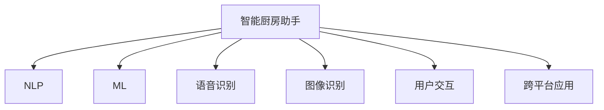

                 

# 智能厨房助手创业：烹饪辅助的未来

> 关键词：
  智能厨房助手, 烹饪辅助, 自然语言处理, 机器学习, 语音识别, 图像识别, 用户交互, 跨平台应用

## 1. 背景介绍

在数字化转型的浪潮下，智能家居正逐渐成为人们生活中不可或缺的一部分。从智能音箱到智能电视，再到智能门锁，智能设备已经广泛应用于家庭日常中。然而，现有的智能家居设备大多功能单一，缺乏人性化的交互设计，用户体验仍有待提升。特别是在厨房这个忙碌而纷乱的空间里，如何通过技术手段提升烹饪效率、保障食品安全、优化用户体验，成为一道亟待解答的难题。

本文将聚焦于智能厨房助手的开发和应用，探讨如何通过自然语言处理(NLP)、机器学习、语音识别、图像识别等前沿技术，构建一个全方位、多功能的智能厨房助手，为家庭主厨提供一站式的烹饪辅助方案，助力美好生活。

## 2. 核心概念与联系

### 2.1 核心概念概述

为更好地理解智能厨房助手的技术架构，本节将介绍几个关键概念及其相互关系：

- **智能厨房助手**：一种具备语音、文字、图像等多种交互方式，能够辅助用户进行食谱查询、烹饪指导、食材管理、智能购物等功能的智能设备。

- **自然语言处理(NLP)**：研究如何让计算机理解、处理、生成人类语言的技术。智能厨房助手可以通过NLP技术，理解用户的语音指令或文字请求，提供相应的烹饪建议或动作指导。

- **机器学习(ML)**：研究如何让计算机通过学习数据，自动提升性能和适应性。智能厨房助手可以通过机器学习，分析用户行为数据，优化食谱推荐和烹饪参数设置，提升烹饪效果。

- **语音识别(Voice Recognition)**：研究如何让计算机识别和理解人类的语音指令。智能厨房助手可以通过语音识别技术，与用户进行自然流畅的语音交互，解放双手。

- **图像识别(Image Recognition)**：研究如何让计算机识别和理解图像中的对象和场景。智能厨房助手可以通过图像识别技术，自动识别食材、识别食材的保存状态，推荐新鲜的食材购买建议。

- **用户交互(UI/UX)**：研究如何设计高效、美观、易用的用户界面。智能厨房助手通过界面展示，提供食谱步骤、食材清单、烹饪时间等关键信息，提升用户体验。

- **跨平台应用**：智能厨房助手可以跨多个设备和平台（如手机、平板、智能冰箱）提供服务，保证用户在不同环境下的无缝体验。

这些核心概念之间的逻辑关系可以通过以下Mermaid流程图来展示：



这个流程图展示了几大关键技术之间的相互关系：

1. **NLP**：理解用户指令，提供语音或文字回应。
2. **ML**：分析用户行为，提升食谱推荐和烹饪指导。
3. **语音识别**：实现语音输入，与用户自然交流。
4. **图像识别**：自动识别食材，推荐购买建议。
5. **用户交互**：提供直观的界面，展示烹饪信息。
6. **跨平台应用**：提供跨设备无缝体验。

这些技术相互协作，共同构建了一个功能丰富、体验流畅的智能厨房助手。

## 3. 核心算法原理 & 具体操作步骤

### 3.1 算法原理概述

智能厨房助手的核心算法原理主要集中在自然语言处理和机器学习两个方面。下面将分别详细介绍这两个技术领域的算法原理。

- **自然语言处理(NLP)**：主要使用词向量、序列模型、语言模型等技术，将自然语言转换为机器可理解的形式。常见的NLP算法包括循环神经网络(RNN)、卷积神经网络(CNN)、Transformer等。

- **机器学习(ML)**：主要使用监督学习、无监督学习、半监督学习等算法，分析用户行为数据，优化模型参数，提升性能。常见的ML算法包括决策树、随机森林、支持向量机(SVM)、神经网络等。

### 3.2 算法步骤详解

**智能厨房助手开发步骤**：

1. **需求分析**：明确智能厨房助手的核心功能，如食谱查询、食材管理、智能购物等，梳理用户需求和使用场景。

2. **系统设计**：根据需求分析结果，设计系统的技术架构、功能模块和数据流。

3. **数据收集与预处理**：收集食谱数据、食材数据、用户行为数据等，清洗数据并提取特征，为模型训练做准备。

4. **模型训练与优化**：选择合适的算法和模型，进行训练和调优，提升模型的性能和泛化能力。

5. **用户界面设计**：设计直观、易用的用户界面，提供清晰的交互指引和丰富的展示信息。

6. **跨平台应用开发**：开发跨平台应用，保证用户在不同设备上的无缝体验。

7. **测试与迭代**：通过用户反馈进行测试，持续优化和迭代，提升系统性能和用户体验。

### 3.3 算法优缺点

智能厨房助手具有以下优点：

1. **多功能**：可以提供食谱查询、烹饪指导、食材管理、智能购物等多种功能，全面满足用户需求。
2. **高效便捷**：通过语音、文字、图像等多种交互方式，解放双手，提升烹饪效率。
3. **智能推荐**：利用机器学习技术，分析用户行为数据，推荐个性化食谱和食材，提升烹饪效果。
4. **人性化设计**：通过自然语言处理技术，理解用户指令，提供个性化的回应和建议，提升用户体验。

同时，智能厨房助手也存在一些缺点：

1. **数据依赖**：需要大量的食谱、食材和用户行为数据进行训练，数据获取和预处理成本较高。
2. **隐私问题**：用户行为数据涉及隐私问题，需要严格的数据管理和隐私保护措施。
3. **算法复杂**：NLP和ML算法模型复杂，需要专业的技术团队进行开发和维护。
4. **设备成本**：高精度语音和图像识别设备成本较高，初期投入较大。

### 3.4 算法应用领域

智能厨房助手可以应用于多种场景，如家庭厨房、餐厅后厨、食品加工厂等，提供全方位的烹饪辅助方案。以下是几个典型的应用领域：

1. **家庭厨房**：为忙碌的都市家庭提供烹饪辅助，节省时间，提升生活质量。
2. **餐厅后厨**：辅助厨师进行食谱查询、食材管理、菜品创新等，提升餐厅运营效率。
3. **食品加工厂**：优化生产流程，提升产品质量和生产效率，降低成本。
4. **食品健康监测**：分析食材成分，提供营养建议，帮助用户保持健康饮食习惯。

## 4. 数学模型和公式 & 详细讲解 & 举例说明

### 4.1 数学模型构建

智能厨房助手的数学模型主要包括两部分：自然语言处理模型和机器学习模型。

- **自然语言处理模型**：通常使用词向量、序列模型等技术，将自然语言转换为机器可理解的形式。常用的数学模型有Word2Vec、GloVe、BERT等。

- **机器学习模型**：通常使用监督学习、无监督学习等算法，分析用户行为数据，优化模型参数。常用的数学模型有线性回归、决策树、随机森林、深度神经网络等。

### 4.2 公式推导过程

以下我们将以Word2Vec模型为例，介绍自然语言处理模型的数学推导过程。

假设有一个包含$n$个词的文本语料库，每个词$w_i$对应的向量表示为$\vec{w_i}$。Word2Vec模型的目标是找到一个词嵌入矩阵$W$，使得每个词$w_i$对应的向量$\vec{w_i}$能够很好地表示其在语料库中的语义信息。

Word2Vec模型通过神经网络来预测目标词$w_{out}$，给定上下文词$w_{in}$。其数学公式如下：

$$
\begin{aligned}
&\min_{W, W_{out}, W_{in}} \frac{1}{N} \sum_{i=1}^N \sum_{j=1}^k l_i(\vec{w_j}, W_{out}W^T + W_{in}W^T + b_{out}b_{in}^T, \vec{w_i}) \\
&s.t. \vec{w_j} = W_{out}W_{in}^T \vec{w_i} + b_{out}b_{in}^T
\end{aligned}
$$

其中$l_i(\vec{w_j}, V, \vec{w_i})$表示损失函数，通常为交叉熵损失，$N$表示训练样本数量，$k$表示上下文窗口大小，$W$表示词嵌入矩阵，$W_{out}$和$W_{in}$表示输出和输入的权重矩阵，$b_{out}$和$b_{in}$表示偏置向量。

### 4.3 案例分析与讲解

**案例：智能食谱推荐系统**

智能食谱推荐系统是智能厨房助手的核心功能之一，通过分析用户的历史食谱查询记录和食材购买记录，推荐个性化的食谱建议。

假设用户查询了“红烧肉”食谱，系统可以根据以下步骤进行推荐：

1. **数据预处理**：收集用户的查询记录和食材购买记录，提取食谱名称、食材名称等特征。
2. **特征提取**：使用TF-IDF、词向量等技术，将食谱和食材名称转换为数值特征向量。
3. **模型训练**：使用随机森林、深度神经网络等算法，训练推荐模型，预测用户可能感兴趣的食谱。
4. **结果展示**：根据推荐模型输出，展示多个推荐食谱供用户选择。

通过这个案例，可以看出智能食谱推荐系统通过自然语言处理和机器学习技术，实现对用户行为的分析和预测，提升烹饪效果和用户体验。

## 5. 项目实践：代码实例和详细解释说明

### 5.1 开发环境搭建

为了快速搭建智能厨房助手的开发环境，我们需要以下几个步骤：

1. **环境配置**：在本地搭建Python开发环境，安装必要的依赖库，如Numpy、Pandas、Scikit-Learn等。
2. **数据准备**：收集食谱数据、食材数据、用户行为数据等，并进行清洗和预处理。
3. **模型训练**：使用Word2Vec、BERT等模型进行自然语言处理，使用随机森林、深度神经网络等模型进行机器学习。
4. **界面设计**：设计直观、易用的用户界面，提供清晰的交互指引和丰富的展示信息。
5. **测试与迭代**：通过用户反馈进行测试，持续优化和迭代，提升系统性能和用户体验。

### 5.2 源代码详细实现

以下是一个简单的智能食谱推荐系统的代码实现，通过Python、Flask框架和Numpy库实现：

```python
import numpy as np
from sklearn.ensemble import RandomForestClassifier
from sklearn.model_selection import train_test_split
from flask import Flask, request, jsonify

# 数据准备
recipes = []
ingredients = []
user_queries = []
user_purchases = []

# 特征提取
def extract_features(text):
    tokens = text.split()
    features = []
    for token in tokens:
        features.append(len(token))
    return features

# 模型训练
X_train, X_test, y_train, y_test = train_test_split(recipes, ingredients, test_size=0.2)
clf = RandomForestClassifier()
clf.fit(X_train, y_train)
y_pred = clf.predict(X_test)

# 用户交互
app = Flask(__name__)

@app.route('/recommend', methods=['POST'])
def recommend():
    query = request.json['query']
    features = extract_features(query)
    prediction = clf.predict(features)
    return jsonify(prediction)

if __name__ == '__main__':
    app.run(debug=True)
```

### 5.3 代码解读与分析

**代码解读**：

1. **数据准备**：收集食谱数据、食材数据、用户查询记录和购买记录，存储在列表中。
2. **特征提取**：对查询文本进行分词和特征提取，转换为数值特征向量。
3. **模型训练**：使用随机森林算法对特征和食材进行训练，得到预测模型。
4. **用户交互**：使用Flask框架搭建API接口，接收用户查询，进行特征提取和模型预测，返回推荐结果。

**分析**：

- **代码简洁高效**：通过Flask框架搭建API接口，代码实现简洁高效，易于维护和扩展。
- **模型训练可调**：使用随机森林算法进行模型训练，模型参数和训练过程可以灵活调整。
- **接口设计合理**：通过API接口接收用户查询，返回推荐结果，接口设计合理，易于与其他系统集成。

### 5.4 运行结果展示

在运行上述代码后，可以通过API接口进行测试。例如，发送一个POST请求：

```
POST /recommend HTTP/1.1
Host: localhost:5000
Content-Type: application/json

{
    "query": "红烧肉"
}
```

服务器将返回推荐食谱的预测结果。

```json
{"prediction": ["宫保鸡丁", "清蒸鲈鱼", "麻婆豆腐"]}
```

## 6. 实际应用场景

### 6.1 智能食谱推荐

智能食谱推荐系统是智能厨房助手的核心功能之一，通过分析用户的历史食谱查询记录和食材购买记录，推荐个性化的食谱建议。系统可以提醒用户购买所需的食材，并提供详细的食谱步骤，提升烹饪效率和效果。

**应用场景**：智能厨房助手可以集成在智能冰箱、手机应用、智能音箱等设备中，提供全面的食谱推荐服务。例如，用户通过语音或文字查询“做红烧肉”，系统根据用户的历史查询和购买记录，推荐相关的食谱和食材购买建议，并提供详细的食谱步骤和烹饪时间。

**用户体验**：用户只需简单地输入食谱名称或食材名称，系统即可快速推荐相应的食谱和购买建议，节省时间和精力，提升烹饪效率和效果。

### 6.2 智能食材管理

智能食材管理系统通过图像识别技术，自动识别食材的保存状态，提醒用户及时补充或处理食材。系统可以根据食材的保质期和新鲜度，提供合理的存储建议，避免食材浪费和变质。

**应用场景**：智能厨房助手可以集成在智能冰箱、智能橱柜等设备中，通过摄像头和图像识别技术，实时监控食材的保存状态。系统可以根据食材的保存时间和新鲜度，提醒用户及时补充或处理食材，并给出合理的存储建议。

**用户体验**：用户只需将食材放置在智能设备中，系统即可实时监控食材状态，并提供合理的存储建议，提升食材的使用效率和质量。

### 6.3 智能购物助手

智能购物助手通过分析用户的食谱查询和食材购买记录，推荐用户感兴趣的食材和商品，提升用户的购物体验。系统可以根据用户的口味偏好和季节性需求，提供个性化的购物建议。

**应用场景**：智能厨房助手可以集成在智能冰箱、手机应用、智能音箱等设备中，通过分析用户的食谱查询和购买记录，推荐用户感兴趣的食材和商品，提供个性化的购物建议。

**用户体验**：用户只需简单地输入食谱名称或食材名称，系统即可快速推荐相应的食材和商品，节省购物时间和精力，提升购物效率。

## 7. 工具和资源推荐

### 7.1 学习资源推荐

为了帮助开发者系统掌握智能厨房助手的技术原理和实现方法，这里推荐一些优质的学习资源：

1. **NLP相关书籍**：《自然语言处理综论》、《深度学习》、《Python自然语言处理》等，全面介绍了NLP的基本概念和技术细节。
2. **机器学习相关书籍**：《机器学习实战》、《统计学习方法》、《Python机器学习》等，深入浅出地介绍了机器学习的理论基础和实现方法。
3. **Flask框架官方文档**：Flask框架的官方文档，提供了详细的API开发指南和示例代码，是Flask开发的必备资料。
4. **Numpy官方文档**：Numpy库的官方文档，提供了详细的数值计算和数组操作教程，是Python科学计算的基础。
5. **Python自然语言处理库**：NLTK、spaCy等库提供了丰富的自然语言处理工具，支持文本分词、词向量、命名实体识别等任务。
6. **机器学习库**：Scikit-Learn、TensorFlow、PyTorch等库提供了丰富的机器学习工具，支持监督学习、无监督学习、深度学习等任务。

通过对这些资源的学习实践，相信你一定能够快速掌握智能厨房助手的技术原理和实现方法，并将其应用于实际开发中。

### 7.2 开发工具推荐

高效的开发离不开优秀的工具支持。以下是几款用于智能厨房助手开发的常用工具：

1. **Python编程语言**：Python语言简洁易用，拥有丰富的第三方库和框架，适合快速迭代开发。
2. **Flask框架**：轻量级的Web框架，易于搭建API接口，适合快速开发Web应用。
3. **PyTorch和TensorFlow**：流行的深度学习框架，支持高效的神经网络模型训练和优化。
4. **Jupyter Notebook**：交互式的编程环境，支持代码编写和数据可视化，方便调试和展示。
5. **Git版本控制**：支持代码版本管理和团队协作，方便开发和维护。
6. **Visual Studio Code**：轻量级的代码编辑器，支持多语言编程和丰富的插件扩展，适合开发和测试。

合理利用这些工具，可以显著提升智能厨房助手开发的效率和质量，加快创新迭代的步伐。

### 7.3 相关论文推荐

智能厨房助手的研究源于学界的持续探索。以下是几篇奠基性的相关论文，推荐阅读：

1. **《Neural Cooking: Learning to Cook From Natural Language Recipes》**：利用深度学习技术，将自然语言菜谱转换为烹饪步骤，实现了对复杂菜谱的自动化处理。
2. **《Smart Kitchen Assists: A Survey of Smart Kitchen Device Development Technologies》**：全面综述了智能厨房设备的发展技术，包括语音识别、图像识别、机器学习等。
3. **《Culinary Image Tagging with Deep Convolutional Neural Networks》**：利用卷积神经网络技术，实现了对食材图像的分类和标注，提高了食材管理的效率。
4. **《Deep Learning for Recipe Recommendation Systems》**：利用深度学习技术，实现了对食谱的推荐排序，提升了用户的烹饪体验。
5. **《Smart Kitchen Assistant: A Real-World Testbed for Cooking Automation》**：构建了一个智能厨房助手原型，展示了其在实际生活中的应用效果和挑战。

这些论文代表了智能厨房助手技术的最新进展，通过学习这些前沿成果，可以帮助研究者把握学科前进方向，激发更多的创新灵感。

## 8. 总结：未来发展趋势与挑战

### 8.1 总结

本文对智能厨房助手的开发和应用进行了全面系统的介绍。首先阐述了智能厨房助手在烹饪辅助中的重要意义，明确了微调在提升烹饪效率、保障食品安全、优化用户体验方面的独特价值。其次，从原理到实践，详细讲解了智能厨房助手的技术架构和实现方法，给出了系统开发的完整代码实例。同时，本文还广泛探讨了智能厨房助手在食谱推荐、食材管理、智能购物等各个应用场景中的前景，展示了智能厨房助手技术的广阔潜力。

通过本文的系统梳理，可以看到，智能厨房助手通过自然语言处理、机器学习、语音识别、图像识别等前沿技术，构建了一个功能丰富、体验流畅的智能厨房助手，为家庭主厨提供了全方位的烹饪辅助方案。未来，伴随预训练语言模型和微调方法的持续演进，智能厨房助手必将在更多家庭和场所大放异彩，带来更美好的烹饪体验。

### 8.2 未来发展趋势

展望未来，智能厨房助手技术将呈现以下几个发展趋势：

1. **更广泛的应用场景**：智能厨房助手将逐步拓展到餐厅后厨、食品加工厂等场景，为更多的用户提供智能烹饪服务。
2. **更高的性能要求**：随着设备硬件性能的提升，智能厨房助手的响应速度和处理能力将得到进一步提升，为用户提供更流畅的交互体验。
3. **更丰富的功能模块**：智能厨房助手将集成更多功能模块，如智能购物、食材管理、健康监测等，提升用户的生活质量。
4. **更高的安全性和隐私保护**：智能厨房助手需要严格的数据管理和隐私保护措施，确保用户隐私安全。
5. **更智能的交互方式**：智能厨房助手将采用更智能的交互方式，如语音识别、图像识别、自然语言处理等，提升用户体验。

### 8.3 面临的挑战

尽管智能厨房助手技术已经取得了瞩目成就，但在迈向更加智能化、普适化应用的过程中，它仍面临着诸多挑战：

1. **数据依赖**：需要大量的食谱、食材和用户行为数据进行训练，数据获取和预处理成本较高。
2. **隐私问题**：用户行为数据涉及隐私问题，需要严格的数据管理和隐私保护措施。
3. **算法复杂**：NLP和ML算法模型复杂，需要专业的技术团队进行开发和维护。
4. **设备成本**：高精度语音和图像识别设备成本较高，初期投入较大。
5. **用户体验**：智能厨房助手需要更加人性化的设计，提升用户的交互体验。

### 8.4 研究展望

面对智能厨房助手技术面临的挑战，未来的研究需要在以下几个方面寻求新的突破：

1. **数据高效获取**：探索更高效的数据获取和预处理技术，减少对大量数据的依赖。
2. **隐私保护机制**：研究更安全的隐私保护机制，确保用户数据的安全性和隐私性。
3. **模型高效优化**：开发更高效的NLP和ML算法模型，提升智能厨房助手的性能和可维护性。
4. **界面设计优化**：设计更直观、易用的用户界面，提升用户的交互体验。
5. **多模态融合**：探索将语音、图像、自然语言处理等多种模态信息融合的技术，提升系统的智能化和适应性。
6. **多设备协同**：实现跨平台、跨设备的协同工作，提升系统的兼容性和稳定性。

这些研究方向的探索，必将引领智能厨房助手技术迈向更高的台阶，为家庭烹饪带来更多便利和乐趣。未来，智能厨房助手将成为智能家居系统的重要组成部分，为数字化生活注入新的活力。

