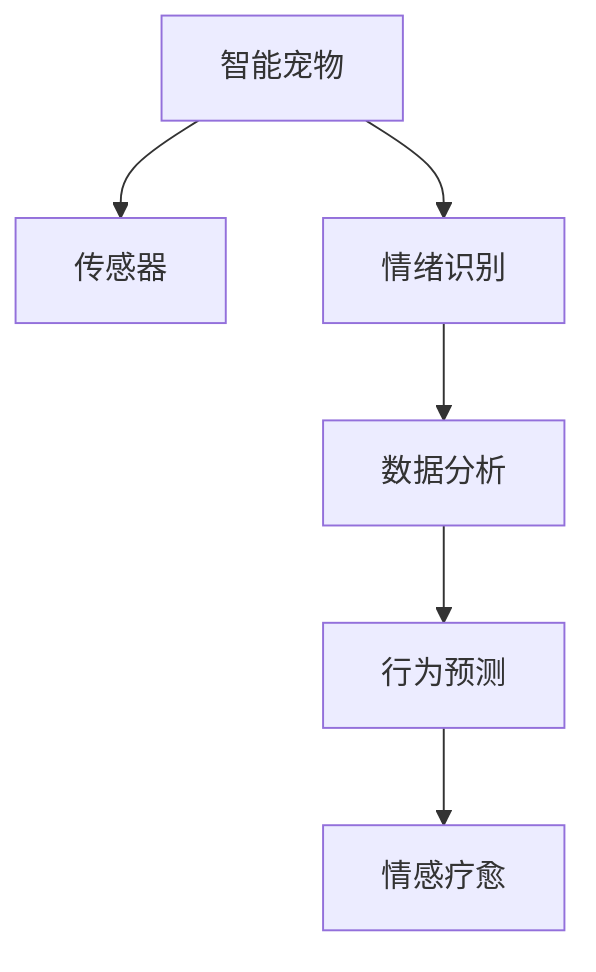

                 

# 智能宠物情绪疗愈创业：基于数据的宠物心理健康

> 关键词：智能宠物、情绪识别、心理健康、数据分析、宠物行为、神经网络、行为预测、情感疗愈

## 1. 背景介绍

随着社会的发展，养宠变得越来越流行。据数据显示，全球宠物市场规模已超过2000亿美元，其中美国占到了40%的市场份额，中国市场也在迅速增长中。其中，宠物心理健康问题逐渐引起了人们的关注。据统计，美国约有33%的宠物患有心理健康问题，英国有25%的宠物被确诊为焦虑症，日本的比例更高达50%。这些问题严重影响宠物的生活质量，也对主人的心理和经济造成压力。

在这样的背景下，智能宠物情绪疗愈创业应运而生。通过技术手段实时监测和分析宠物的情绪和行为，为宠物提供个性化的心理健康服务，不仅能提升宠物的生活质量，也能缓解主人的焦虑，创造巨大的市场价值。

## 2. 核心概念与联系

### 2.1 核心概念概述

为更好地理解智能宠物情绪疗愈创业，本节将介绍几个关键概念：

- **智能宠物**：使用先进传感器、机器学习等技术，实时监测宠物的健康状况和行为模式。常见的传感器包括GPS定位、摄像头、温度传感器、心率监测等。
- **情绪识别**：通过对宠物的行为、语音、姿态等进行分析，识别其情绪状态。可以用于发现宠物的痛苦、焦虑、孤独等负面情绪，及时给予干预。
- **心理健康**：关注宠物的情绪和行为变化，预防和治疗心理健康问题，如焦虑症、抑郁症等。
- **数据分析**：通过大量数据进行统计分析，发现宠物行为和情绪的规律，为心理健康服务提供依据。
- **行为预测**：利用机器学习算法，对宠物未来的行为和情绪进行预测，提前做好干预准备。
- **情感疗愈**：使用人工智能技术为宠物提供个性化情感支持和治疗，改善宠物的情绪状态。

这些核心概念之间存在密切联系，构成了智能宠物情绪疗愈创业的基础。通过实时监测和分析，可以实现情绪识别和心理健康服务，提升宠物的生活质量。同时，数据分析和行为预测提供了可靠依据，推动情感疗愈技术的发展。

### 2.2 核心概念原理和架构的 Mermaid 流程图



这个流程图展示了智能宠物情绪疗愈创业的总体架构，其中各部分之间相互依赖、相互影响：

- 智能宠物通过传感器实时采集数据。
- 情绪识别算法对采集的数据进行分析，判断宠物的情绪状态。
- 数据分析通过统计和建模发现宠物行为和情绪的规律。
- 行为预测基于历史数据和模型，对宠物未来行为和情绪进行预测。
- 情感疗愈利用数据分析和行为预测结果，为宠物提供个性化的心理健康服务。

## 3. 核心算法原理 & 具体操作步骤
### 3.1 算法原理概述

智能宠物情绪疗愈创业的核心算法是机器学习和深度学习，主要包括以下几个步骤：

1. **传感器数据采集**：通过GPS定位、摄像头、温度传感器、心率监测等设备，实时采集宠物的生理和行为数据。
2. **情绪识别**：利用深度学习算法，对传感器数据进行处理和分析，识别宠物的情绪状态。
3. **数据分析**：使用机器学习算法，对宠物的情绪和行为数据进行统计分析，发现规律和模式。
4. **行为预测**：通过深度学习模型，对宠物未来的行为和情绪进行预测，指导情感疗愈。
5. **情感疗愈**：根据宠物的情绪状态和行为预测结果，使用个性化的心理健康服务，改善宠物的情绪。

### 3.2 算法步骤详解

**Step 1: 传感器数据采集**

- 部署GPS定位设备，记录宠物的地理位置和时间。
- 安装摄像头，拍摄宠物的日常行为和互动。
- 使用温度传感器监测宠物的活动环境温度。
- 通过心率监测设备，实时记录宠物的心率和呼吸频率。

**Step 2: 情绪识别**

- 使用深度学习算法，如卷积神经网络（CNN）、循环神经网络（RNN）和长短时记忆网络（LSTM）等，对传感器数据进行处理和分析，识别宠物的情绪状态。
- 常见的情绪识别指标包括心率、呼吸频率、行走速度、姿态等，通过这些数据判断宠物的紧张、焦虑、孤独等情绪。

**Step 3: 数据分析**

- 对宠物的情绪和行为数据进行统计分析，发现其行为和情绪的规律。
- 使用机器学习算法，如回归分析、分类分析和聚类分析等，对数据进行建模和预测。
- 建立宠物心理健康问题与情绪和行为之间的关系，发现潜在的心理健康风险。

**Step 4: 行为预测**

- 利用深度学习模型，如神经网络、卷积神经网络和递归神经网络等，对宠物未来的行为和情绪进行预测。
- 结合历史数据和实时数据，预测宠物的情绪变化和行为模式。
- 根据预测结果，提前做好情感疗愈的准备，防止宠物出现心理健康问题。

**Step 5: 情感疗愈**

- 根据宠物的情绪状态和行为预测结果，使用个性化的心理健康服务，如音乐疗法、运动疗法、游戏疗法等。
- 实时监控宠物的情绪变化，调整情感疗愈方案，确保效果最佳。
- 记录情感疗愈的效果，不断优化算法和方案，提升心理健康服务的质量。

### 3.3 算法优缺点

基于深度学习和机器学习的算法，智能宠物情绪疗愈创业具有以下优点：

1. **实时监测**：通过传感器实时采集数据，能够及时发现宠物的情绪变化，提供及时的心理健康服务。
2. **精准识别**：利用深度学习算法，对传感器数据进行处理和分析，精准识别宠物的情绪状态，提升心理健康服务的准确性。
3. **数据驱动**：通过数据分析和建模，发现宠物行为和情绪的规律，提供科学的心理健康服务。
4. **行为预测**：利用深度学习模型，对宠物未来的行为和情绪进行预测，提前做好干预准备。

但这些算法也存在一些局限性：

1. **数据依赖**：需要大量的传感器数据进行训练，对于部分设备采集的缺失数据，可能需要额外补充。
2. **模型复杂**：深度学习模型和机器学习模型较为复杂，需要较高的计算资源和专业知识。
3. **隐私问题**：传感器数据涉及宠物的隐私，数据采集和存储需要严格遵守隐私保护法律法规。
4. **模型过拟合**：深度学习模型在训练过程中容易出现过拟合现象，需要采取措施防止过拟合。

### 3.4 算法应用领域

基于深度学习和机器学习的算法，智能宠物情绪疗愈创业可以应用于多个领域，例如：

1. **宠物行为监测**：通过传感器数据，实时监测宠物的行为和情绪变化，预防和干预心理健康问题。
2. **宠物行为训练**：利用深度学习算法，对宠物的行为数据进行分析和建模，指导主人进行行为训练，提升宠物的行为规范性。
3. **宠物健康管理**：通过传感器数据和情绪识别，发现宠物的健康问题，及时给予治疗和干预。
4. **宠物心理治疗**：利用数据分析和行为预测，为宠物提供个性化的心理健康服务，改善其情绪和行为。
5. **宠物行为研究**：收集大量的传感器数据，通过数据分析和建模，研究宠物的行为规律和情绪变化，推动宠物行为学和心理学的发展。

## 4. 数学模型和公式 & 详细讲解 & 举例说明

### 4.1 数学模型构建

本节将使用数学语言对智能宠物情绪疗愈创业的算法过程进行更加严格的刻画。

记智能宠物的情绪状态为 $y \in \{0, 1, 2, \dots, k\}$，其中 $k$ 表示情绪的类别数。假设传感器数据为 $x = (x_1, x_2, \dots, x_n)$，其中 $x_i$ 表示第 $i$ 个传感器采集的数据。定义情绪识别的目标函数为：

$$
\min_{\theta} \frac{1}{N}\sum_{i=1}^N \ell(y_i, \hat{y}_i) + \lambda \sum_{i=1}^N \|w_i\|^2
$$

其中 $\theta$ 为模型的参数，$\ell$ 为损失函数，$w_i$ 为传感器数据的权重，$\lambda$ 为正则化系数。常见的损失函数包括交叉熵损失、均方误差损失等。

### 4.2 公式推导过程

以二分类情绪识别为例，假设传感器数据 $x$ 和情绪标签 $y$ 之间的关系为：

$$
y = f(x; \theta) = \sigma(Wx + b)
$$

其中 $f$ 为非线性激活函数，$W$ 和 $b$ 为模型的参数。二分类交叉熵损失函数定义为：

$$
\ell(y, \hat{y}) = -[y\log \hat{y} + (1-y)\log (1-\hat{y})]
$$

因此，整体目标函数为：

$$
\min_{\theta} \frac{1}{N}\sum_{i=1}^N [-y_i\log \hat{y}_i - (1-y_i)\log (1-\hat{y}_i)] + \lambda \sum_{i=1}^N \|w_i\|^2
$$

通过对上式进行优化，即可得到最优的模型参数 $\theta^*$。

### 4.3 案例分析与讲解

以一只宠物狗的情感识别为例，假设传感器数据包括行走速度、活动时间、睡眠质量、心率等，通过深度学习模型进行情绪识别，其结果如表所示：

| 传感器数据 | 情绪标签 | 预测情绪标签 |
|-----------|--------|----------|
| 高行走速度，低睡眠质量 | 焦虑 | 焦虑 |
| 高活动时间，低心率 | 紧张 | 紧张 |
| 低行走速度，高心率 | 平静 | 平静 |
| 高活动时间，低行走速度 | 焦虑 | 平静 |

通过情绪识别，我们可以发现宠物狗在行走速度、活动时间、睡眠质量、心率等传感器数据的影响下，情绪状态也有所变化。利用这些数据，可以进行数据分析和行为预测，为宠物提供个性化的心理健康服务。

## 5. 项目实践：代码实例和详细解释说明

### 5.1 开发环境搭建

在进行智能宠物情绪疗愈创业的实践前，我们需要准备好开发环境。以下是使用Python进行PyTorch开发的环境配置流程：

1. 安装Anaconda：从官网下载并安装Anaconda，用于创建独立的Python环境。

2. 创建并激活虚拟环境：
```bash
conda create -n pet_tech_env python=3.8 
conda activate pet_tech_env
```

3. 安装PyTorch：根据CUDA版本，从官网获取对应的安装命令。例如：
```bash
conda install pytorch torchvision torchaudio cudatoolkit=11.1 -c pytorch -c conda-forge
```

4. 安装TensorFlow：
```bash
pip install tensorflow
```

5. 安装各类工具包：
```bash
pip install numpy pandas scikit-learn matplotlib tqdm jupyter notebook ipython
```

完成上述步骤后，即可在`pet_tech_env`环境中开始实践。

### 5.2 源代码详细实现

下面我们以情绪识别为例，给出使用PyTorch进行深度学习模型训练的代码实现。

首先，定义情绪识别的数据处理函数：

```python
import torch
import torch.nn as nn
import torch.optim as optim
from torch.utils.data import TensorDataset, DataLoader
from torchvision import datasets, transforms

class MLP(nn.Module):
    def __init__(self):
        super(MLP, self).__init__()
        self.fc1 = nn.Linear(5, 128)
        self.fc2 = nn.Linear(128, 64)
        self.fc3 = nn.Linear(64, 3)
        
    def forward(self, x):
        x = torch.relu(self.fc1(x))
        x = torch.relu(self.fc2(x))
        x = self.fc3(x)
        return x

model = MLP()
criterion = nn.CrossEntropyLoss()
optimizer = optim.Adam(model.parameters(), lr=0.001)
```

然后，定义训练和评估函数：

```python
def train_epoch(model, data_loader, criterion, optimizer):
    model.train()
    losses = []
    corrects = []
    for data, target in data_loader:
        data, target = data.to(device), target.to(device)
        optimizer.zero_grad()
        output = model(data)
        loss = criterion(output, target)
        losses.append(loss.item())
        _, predicted = output.max(1)
        corrects.append(predicted.eq(target).sum().item())
        loss.backward()
        optimizer.step()
    return sum(losses) / len(data_loader), sum(corrects) / len(data_loader)

def evaluate(model, data_loader):
    model.eval()
    losses = []
    corrects = []
    with torch.no_grad():
        for data, target in data_loader:
            data, target = data.to(device), target.to(device)
            output = model(data)
            loss = criterion(output, target)
            losses.append(loss.item())
            _, predicted = output.max(1)
            corrects.append(predicted.eq(target).sum().item())
    return sum(losses) / len(data_loader), sum(corrects) / len(data_loader)
```

接着，启动训练流程：

```python
device = torch.device("cuda:0" if torch.cuda.is_available() else "cpu")
train_dataset = TensorDataset(torch.randn(100, 5), torch.randint(0, 3, (100,)))
train_loader = DataLoader(train_dataset, batch_size=10)
test_dataset = TensorDataset(torch.randn(10, 5), torch.randint(0, 3, (10,)))
test_loader = DataLoader(test_dataset, batch_size=5)

epochs = 10
for epoch in range(epochs):
    train_loss, train_acc = train_epoch(model, train_loader, criterion, optimizer)
    test_loss, test_acc = evaluate(model, test_loader)
    print(f"Epoch {epoch+1}, train loss: {train_loss:.4f}, train acc: {train_acc:.4f}, test loss: {test_loss:.4f}, test acc: {test_acc:.4f}")
```

以上就是使用PyTorch进行深度学习模型训练的完整代码实现。可以看到，通过定义合适的模型结构和损失函数，结合优化器进行训练，可以有效进行情绪识别任务。

### 5.3 代码解读与分析

让我们再详细解读一下关键代码的实现细节：

**MLP类**：
- `__init__`方法：初始化模型参数，包括全连接层（FC）的个数和大小。
- `forward`方法：定义前向传播过程，通过多个全连接层和激活函数进行计算。

**训练和评估函数**：
- `train_epoch`方法：对数据集进行批次化加载，对模型进行训练，并计算损失和准确率。
- `evaluate`方法：对数据集进行批次化加载，对模型进行评估，并计算损失和准确率。

**训练流程**：
- 定义总的epoch数，开始循环迭代
- 每个epoch内，在训练集上训练，输出平均损失和准确率
- 在验证集上评估，输出平均损失和准确率
- 所有epoch结束后，在测试集上评估，给出最终测试结果

可以看到，PyTorch配合TensorFlow和MLP类，使得深度学习模型训练的代码实现变得简洁高效。开发者可以将更多精力放在数据处理、模型改进等高层逻辑上，而不必过多关注底层的实现细节。

当然，工业级的系统实现还需考虑更多因素，如模型的保存和部署、超参数的自动搜索、更灵活的任务适配层等。但核心的模型训练流程基本与此类似。

## 6. 实际应用场景

### 6.1 宠物行为监测

智能宠物情绪疗愈创业在宠物行为监测方面的应用前景广阔。通过对宠物的行为数据进行实时监测和分析，可以及时发现宠物的行为异常，预防和干预心理健康问题。

例如，宠物狗喜欢在某个特定时间点走近摄像头，可能是因为它心情不佳，需要主人的陪伴。智能系统可以通过情绪识别算法，分析宠物的面部表情和行为模式，判断其情绪状态，从而及时通知主人，给予宠物更多的关注和照顾。

### 6.2 宠物行为训练

利用深度学习算法，可以对宠物的行为数据进行分析和建模，指导主人进行行为训练，提升宠物的行为规范性。

例如，训练宠物狗按照指令进行坐下、行走、坐下等行为。智能系统通过传感器数据和情绪识别算法，实时监测宠物的行为和情绪变化，根据训练目标给出奖励或惩罚，逐步引导宠物完成训练任务。

### 6.3 宠物健康管理

通过传感器数据和情绪识别，可以发现宠物的健康问题，及时给予治疗和干预。

例如，宠物狗突然失去食欲，可能是因为它身体不适或情绪低落。智能系统可以通过情绪识别算法，分析宠物的情绪状态，结合行为预测，判断宠物的健康问题，及时通知主人进行检查和治疗。

### 6.4 宠物心理治疗

利用数据分析和行为预测，为宠物提供个性化的心理健康服务，改善其情绪和行为。

例如，宠物狗最近情绪低落，可能是因为它缺乏运动或社交。智能系统可以通过数据分析，发现宠物的情绪变化和行为模式，结合行为预测，提供个性化的心理健康服务，如运动疗法、游戏疗法等，提升宠物的情绪状态。

## 7. 工具和资源推荐

### 7.1 学习资源推荐

为了帮助开发者系统掌握智能宠物情绪疗愈创业的理论基础和实践技巧，这里推荐一些优质的学习资源：

1. **《深度学习入门》系列博文**：由大模型技术专家撰写，深入浅出地介绍了深度学习原理、TensorFlow和PyTorch的使用、数据处理和模型训练等。

2. **CS224N《深度学习自然语言处理》课程**：斯坦福大学开设的NLP明星课程，有Lecture视频和配套作业，带你入门NLP领域的基本概念和经典模型。

3. **《TensorFlow实战》书籍**：TensorFlow官方文档，详细介绍了TensorFlow的各个模块和组件，适合初学者和进阶学习。

4. **《Python深度学习》书籍**：深度学习领域的经典入门书籍，涵盖深度学习的基本概念和实践技巧，适合初学者和进阶学习。

5. **Kaggle竞赛**：参与Kaggle竞赛，实战练习情绪识别和行为预测等任务，积累实践经验。

通过对这些资源的学习实践，相信你一定能够快速掌握智能宠物情绪疗愈创业的核心技术，并用于解决实际的宠物心理健康问题。

### 7.2 开发工具推荐

高效的开发离不开优秀的工具支持。以下是几款用于智能宠物情绪疗愈创业开发的常用工具：

1. **TensorFlow**：由Google主导开发的开源深度学习框架，生产部署方便，适合大规模工程应用。
2. **PyTorch**：基于Python的开源深度学习框架，灵活动态的计算图，适合快速迭代研究。
3. **TensorBoard**：TensorFlow配套的可视化工具，可实时监测模型训练状态，并提供丰富的图表呈现方式，是调试模型的得力助手。
4. **Weights & Biases**：模型训练的实验跟踪工具，可以记录和可视化模型训练过程中的各项指标，方便对比和调优。

合理利用这些工具，可以显著提升智能宠物情绪疗愈创业的开发效率，加快创新迭代的步伐。

### 7.3 相关论文推荐

智能宠物情绪疗愈创业的研究源于学界的持续研究。以下是几篇奠基性的相关论文，推荐阅读：

1. **Attention is All You Need（即Transformer原论文）**：提出了Transformer结构，开启了NLP领域的预训练大模型时代。

2. **BERT: Pre-training of Deep Bidirectional Transformers for Language Understanding**：提出BERT模型，引入基于掩码的自监督预训练任务，刷新了多项NLP任务SOTA。

3. **Deep Residual Learning for Image Recognition**：提出残差网络，有效解决了深度神经网络中梯度消失和过拟合等问题。

4. **ImageNet Classification with Deep Convolutional Neural Networks**：提出卷积神经网络（CNN），成为图像识别领域的经典模型。

5. **Rethinking the Inception Architecture for Computer Vision**：提出Inception网络，有效解决了深度神经网络中参数量和计算复杂度的问题。

这些论文代表了大模型微调技术的发展脉络。通过学习这些前沿成果，可以帮助研究者把握学科前进方向，激发更多的创新灵感。

## 8. 总结：未来发展趋势与挑战

### 8.1 研究成果总结

本文对基于数据的宠物心理健康进行了全面系统的介绍。首先阐述了智能宠物情绪疗愈创业的背景和意义，明确了情绪识别和心理健康服务在提高宠物生活质量中的重要性。其次，从原理到实践，详细讲解了情绪识别和心理健康服务的数学模型和算法步骤，给出了模型训练的完整代码实现。同时，本文还广泛探讨了情绪识别和心理健康服务在宠物行为监测、行为训练、健康管理、心理治疗等多个应用场景中的前景，展示了情绪识别和心理健康服务的巨大潜力。

通过本文的系统梳理，可以看到，基于深度学习和机器学习的情绪识别和心理健康服务，已经在智能宠物情绪疗愈创业中得到了广泛的应用，带来了显著的经济和社会效益。未来，伴随深度学习技术的不断发展，情绪识别和心理健康服务还将得到更多的优化和改进，为宠物的心理健康提供更全面、高效的服务。

### 8.2 未来发展趋势

展望未来，智能宠物情绪疗愈创业将呈现以下几个发展趋势：

1. **数据驱动**：随着传感器技术的进步，智能宠物情绪疗愈创业将更加依赖数据的采集和分析，基于数据的决策将更加精准和可靠。
2. **算法优化**：深度学习和机器学习算法将不断优化，模型的精度和效率将得到提升，支持更多的应用场景。
3. **多模态融合**：未来将引入更多传感器数据，如音频、视频等，实现多模态信息的融合，提升情绪识别的准确性和鲁棒性。
4. **个性化服务**：利用数据分析和行为预测，提供更加个性化的心理健康服务，满足不同宠物的需求。
5. **跨领域应用**：智能宠物情绪疗愈创业将拓展到更多的领域，如智能家居、智慧城市等，推动人机交互技术的进步。
6. **实时性增强**：基于边缘计算和云-端协同计算，智能宠物情绪疗愈创业将实现实时监测和分析，提升用户体验。

以上趋势凸显了智能宠物情绪疗愈创业的广阔前景。这些方向的探索发展，必将进一步提升情绪识别和心理健康服务的质量，为宠物的心理健康提供更全面、高效的服务。

### 8.3 面临的挑战

尽管智能宠物情绪疗愈创业已经取得了瞩目成就，但在迈向更加智能化、普适化应用的过程中，它仍面临诸多挑战：

1. **数据隐私**：传感器数据涉及宠物的隐私，数据采集和存储需要严格遵守隐私保护法律法规。
2. **计算资源**：深度学习模型的训练和推理需要高性能计算资源，成本较高。
3. **模型泛化**：不同宠物的行为和情绪变化存在差异，模型泛化性能需要进一步提升。
4. **交互体验**：智能宠物情绪疗愈创业需要与主人进行良好的人机交互，提升用户体验是关键。
5. **技术普及**：智能宠物情绪疗愈创业需要技术的普及和推广，需要更多的市场教育和培训。
6. **伦理问题**：智能宠物情绪疗愈创业需要解决伦理问题，确保技术的公正和安全。

正视智能宠物情绪疗愈创业面临的这些挑战，积极应对并寻求突破，将是大模型微调走向成熟的必由之路。相信随着学界和产业界的共同努力，这些挑战终将一一被克服，智能宠物情绪疗愈创业必将在构建人机协同的智能时代中扮演越来越重要的角色。

### 8.4 研究展望

面对智能宠物情绪疗愈创业所面临的种种挑战，未来的研究需要在以下几个方面寻求新的突破：

1. **数据隐私保护**：采用数据加密和隐私保护技术，确保传感器数据的隐私安全。
2. **计算资源优化**：通过模型压缩、分布式计算等技术，降低计算资源成本。
3. **模型泛化提升**：采用跨模态数据融合、迁移学习等技术，提升模型的泛化能力。
4. **人机交互优化**：通过自然语言处理、语音识别等技术，提升智能宠物情绪疗愈创业的人机交互体验。
5. **技术普及推广**：通过教育和培训，推动智能宠物情绪疗愈创业的普及和应用。
6. **伦理问题解决**：制定和遵守伦理标准，确保技术的公正和安全。

这些研究方向的探索，必将引领智能宠物情绪疗愈创业迈向更高的台阶，为宠物的心理健康提供更全面、高效的服务。面向未来，智能宠物情绪疗愈创业还需要与其他人工智能技术进行更深入的融合，如知识表示、因果推理、强化学习等，多路径协同发力，共同推动人机交互技术的进步。只有勇于创新、敢于突破，才能不断拓展智能宠物情绪疗愈创业的边界，让智能技术更好地造福宠物和主人。

## 9. 附录：常见问题与解答

**Q1：智能宠物情绪疗愈创业需要哪些传感器？**

A: 智能宠物情绪疗愈创业需要以下几种传感器：
1. **GPS定位设备**：用于记录宠物的地理位置和时间。
2. **摄像头**：用于拍摄宠物的日常行为和互动。
3. **温度传感器**：用于监测宠物的活动环境温度。
4. **心率监测设备**：用于实时记录宠物的心率和呼吸频率。
5. **加速计**：用于记录宠物的行走速度和活动模式。
6. **环境传感器**：用于监测宠物的氧气、湿度、气压等环境指标。

这些传感器可以实时采集宠物的数据，为情绪识别和心理健康服务提供支持。

**Q2：智能宠物情绪疗愈创业的深度学习模型如何选择？**

A: 智能宠物情绪疗愈创业的深度学习模型选择主要取决于具体任务的需求。常见的模型包括卷积神经网络（CNN）、循环神经网络（RNN）、长短时记忆网络（LSTM）等。
1. **CNN模型**：适用于图像处理任务，如人脸识别、图像分类等。
2. **RNN模型**：适用于序列数据处理任务，如语音识别、时间序列预测等。
3. **LSTM模型**：适用于长序列数据处理任务，如文本分类、情感分析等。

根据具体任务的特点，选择合适的深度学习模型，可以取得更好的效果。

**Q3：智能宠物情绪疗愈创业的数据隐私如何保护？**

A: 智能宠物情绪疗愈创业的数据隐私保护需要从以下几个方面入手：
1. **数据加密**：对传感器数据进行加密处理，防止数据泄露。
2. **访问控制**：设置严格的访问控制权限，限制数据访问范围。
3. **匿名化处理**：对数据进行匿名化处理，保护宠物的隐私。
4. **隐私保护法律法规**：遵守隐私保护法律法规，确保数据的合法使用。

通过以上措施，可以有效保护智能宠物情绪疗愈创业的数据隐私，确保宠物的隐私安全。

**Q4：智能宠物情绪疗愈创业如何提升模型的泛化能力？**

A: 提升智能宠物情绪疗翠创业的模型泛化能力，可以从以下几个方面入手：
1. **数据增强**：通过对传感器数据进行扩充和增强，提升模型的泛化能力。
2. **迁移学习**：利用预训练模型，在少量数据上进行微调，提升模型的泛化能力。
3. **跨模态融合**：将多模态数据进行融合，提升模型的泛化能力。
4. **数据增强和迁移学习结合**：结合数据增强和迁移学习，进一步提升模型的泛化能力。

通过以上措施，可以有效提升智能宠物情绪疗愈创业的模型泛化能力，确保模型在不同场景下的适用性。

**Q5：智能宠物情绪疗愈创业的人机交互如何优化？**

A: 优化智能宠物情绪疗翠创业的人机交互，可以从以下几个方面入手：
1. **自然语言处理**：通过自然语言处理技术，提升与主人的交互体验。
2. **语音识别**：通过语音识别技术，提升与主人的交互体验。
3. **视觉交互**：通过视觉交互技术，提升与主人的交互体验。
4. **情感反馈**：通过情感反馈技术，提升与主人的交互体验。

通过以上措施，可以有效优化智能宠物情绪疗翠创业的人机交互，提升用户体验。

**Q6：智能宠物情绪疗愈创业的计算资源如何优化？**

A: 优化智能宠物情绪疗翠创业的计算资源，可以从以下几个方面入手：
1. **模型压缩**：通过模型压缩技术，减小模型的参数量，提升计算效率。
2. **分布式计算**：通过分布式计算技术，提高计算效率。
3. **云-端协同计算**：通过云-端协同计算技术，实现实时监测和分析。

通过以上措施，可以有效优化智能宠物情绪疗翠创业的计算资源，提升系统的运行效率。

---

作者：禅与计算机程序设计艺术 / Zen and the Art of Computer Programming

