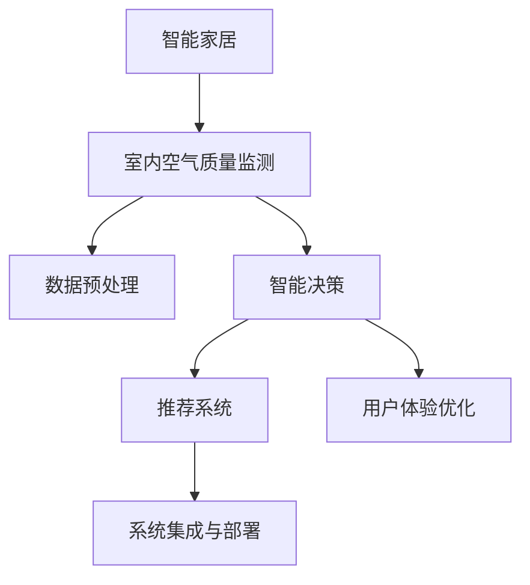

                 

# 智能家居空气营养创业：呼吸健康的精确管理

> 关键词：智能家居、空气质量、室内环境、精确管理、呼吸健康、人工智能

## 1. 背景介绍

### 1.1 问题由来

随着城市化进程的加速，人们越来越多地将时间花在室内环境中。室内空气质量的好坏，直接影响着人们的健康和生活质量。然而，传统的室内空气监测设备往往只能提供简单的浓度值反馈，无法提供科学合理的建议，用户体验较差。另一方面，随着物联网技术的发展，越来越多的智能家居设备接入网络，形成了智能家居生态系统。这些设备通过各种传感器采集室内环境数据，为用户提供个性化的智能服务。

如何在智能家居环境中，实现对室内空气质量的精确管理，改善人们的呼吸健康，成为一项亟待解决的重要课题。本文将围绕室内空气质量监测与管理的智能化需求，探讨如何利用人工智能技术实现这一目标。

### 1.2 问题核心关键点

实现室内空气质量的精确管理，主要涉及以下几个关键点：

- **数据采集与分析**：利用传感器获取室内空气质量参数，如PM2.5、CO2、温湿度等，并进行数据预处理和分析。
- **智能决策与推荐**：结合用户的健康需求和生活习惯，通过算法模型推荐合适的室内环境控制策略。
- **用户体验优化**：提供直观易用的界面，以及人性化的交互体验，提升用户的使用感知。
- **系统集成与部署**：将智能空气质量管理系统集成到现有的智能家居系统中，实现稳定可靠的运行。

### 1.3 问题研究意义

室内空气质量的精确管理，对于提升人们的生活质量、改善呼吸健康具有重要意义。利用人工智能技术，可以实现室内环境的智能化管理，提升用户体验。同时，精确管理室内空气质量，对于预防呼吸道疾病、减少慢性病发生率也有积极的促进作用。因此，研究如何通过人工智能技术实现室内空气质量的精确管理，具有重要的现实意义。

## 2. 核心概念与联系

### 2.1 核心概念概述

为了更好地理解智能家居空气质量管理的核心技术，本节将介绍几个密切相关的核心概念：

- **智能家居**：通过物联网技术将家居设备互联互通，实现对家居环境的自动化和智能化管理。
- **室内空气质量监测**：利用传感器采集室内空气中的关键参数，如PM2.5、CO2、温湿度等，评估室内环境健康水平。
- **精确管理**：根据用户的健康需求和生活习惯，通过算法模型推荐最优的室内环境控制策略，实现对室内空气质量的精确控制。
- **人工智能**：利用机器学习、深度学习等算法，对大量室内环境数据进行建模分析，实现智能化决策与推荐。
- **用户体验优化**：通过优化界面设计、提供个性化服务等手段，提升用户对智能家居系统的使用体验。
- **系统集成与部署**：将智能空气质量管理系统集成到现有的智能家居系统中，实现稳定可靠的运行。

这些核心概念之间的逻辑关系可以通过以下Mermaid流程图来展示：



这个流程图展示了几大核心概念及其之间的关联：

1. 智能家居系统通过传感器获取室内环境数据。
2. 数据预处理模块对采集到的数据进行处理和分析。
3. 智能决策模块通过算法模型，生成室内环境控制策略。
4. 推荐系统将最优策略推荐给用户。
5. 用户体验优化模块提升系统易用性。
6. 系统集成与部署模块将智能系统集成到现有的智能家居生态中。

这些概念共同构成了智能家居空气质量管理的完整技术框架，为提升室内环境的健康水平提供了有力保障。

## 3. 核心算法原理 & 具体操作步骤
### 3.1 算法原理概述

智能家居空气质量管理的核心算法，主要涉及数据预处理、智能决策和推荐系统三大环节。以下是各环节的算法原理概述：

- **数据预处理**：通过传感器采集室内空气质量参数，如PM2.5、CO2、温湿度等，并进行数据清洗、归一化、特征工程等处理，以提升数据的可用性。
- **智能决策**：基于机器学习、深度学习等算法，对室内环境数据进行建模分析，生成室内环境控制策略。
- **推荐系统**：根据用户的健康需求和生活习惯，利用协同过滤、基于内容的推荐算法，推荐最优的室内环境控制策略。

### 3.2 算法步骤详解

以下是基于上述算法原理，详细介绍智能家居空气质量管理的详细步骤：

**Step 1: 数据采集与预处理**
- 部署传感器：在智能家居中安装各类传感器，如PM2.5传感器、CO2传感器、温湿度传感器等，采集室内空气质量参数。
- 数据清洗：使用数据清洗算法去除传感器数据中的异常值和噪音。
- 特征工程：对采集到的数据进行特征提取和转换，以生成模型可接受的输入特征。

**Step 2: 智能决策**
- 选择模型：根据任务特点，选择适合的机器学习或深度学习模型，如线性回归、随机森林、卷积神经网络等。
- 模型训练：利用采集到的历史数据，对模型进行训练，优化模型的参数。
- 模型评估：使用验证集对模型进行评估，选择性能最优的模型。

**Step 3: 推荐系统**
- 选择推荐算法：根据推荐任务的特点，选择合适的推荐算法，如协同过滤、基于内容的推荐算法等。
- 用户画像：构建用户画像，包括用户健康需求、生活习惯、位置信息等，以提升推荐效果。
- 推荐计算：利用推荐算法，计算推荐结果，形成最优的室内环境控制策略。

**Step 4: 用户体验优化**
- 界面设计：设计直观易用的用户界面，提供丰富的功能展示。
- 交互设计：提供人性化的交互方式，提升用户体验。
- 动态反馈：实时反馈室内环境状态和推荐结果，提升用户满意度。

**Step 5: 系统集成与部署**
- 集成模块：将智能决策和推荐系统集成到智能家居系统中，实现无缝对接。
- 部署环境：选择合适的部署环境，如云平台、本地设备等。
- 监控与维护：实时监控系统运行状态，及时进行故障处理和系统维护。

### 3.3 算法优缺点

智能家居空气质量管理的算法，具有以下优点：

- **高精度**：通过传感器采集室内空气质量参数，结合机器学习算法，实现高精度的室内环境监测。
- **自适应**：根据用户需求和习惯，自适应调整室内环境控制策略。
- **实时性**：通过实时反馈和动态调整，实现室内环境管理的实时性。

同时，该算法也存在以下缺点：

- **复杂性**：涉及数据预处理、模型训练、推荐计算等多个环节，系统实现较为复杂。
- **成本高**：需要部署各类传感器和计算设备，初始成本较高。
- **隐私问题**：采集和分析用户数据时，需注意隐私保护和数据安全。

尽管存在这些局限性，但就目前而言，基于智能决策和推荐系统的算法，仍是大规模推广和应用室内空气质量管理的主要手段。未来相关研究的重点在于如何进一步降低成本、提高系统性能，并兼顾隐私保护和数据安全。

### 3.4 算法应用领域

基于智能决策和推荐系统的算法，已经在智能家居、智慧医疗、智能办公等多个领域得到了广泛的应用，具体如下：

- **智能家居**：结合室内空气质量监测和智能决策，为用户提供个性化的室内环境控制服务。
- **智慧医疗**：通过监测室内空气质量，为病房环境提供优化建议，提升医疗服务质量。
- **智能办公**：利用室内空气质量监测和智能决策，优化办公环境，提升员工工作满意度。
- **智慧酒店**：通过室内空气质量监测和智能决策，提升酒店服务质量和用户体验。

除了上述这些领域，智能家居空气质量管理的应用还将不断拓展，如智能交通、智能农业等，为更多行业带来智能化升级。

## 4. 数学模型和公式 & 详细讲解  
### 4.1 数学模型构建

本节将使用数学语言对智能家居空气质量管理的核心算法进行更加严格的刻画。

记室内环境监测数据集为 $D=\{(x_i,y_i)\}_{i=1}^N$，其中 $x_i$ 为传感器采集到的室内环境参数，如PM2.5、CO2、温湿度等，$y_i$ 为室内环境的目标参数，如最佳通风策略、适宜温湿度等。

定义模型 $M_{\theta}$ 在数据样本 $(x,y)$ 上的损失函数为 $\ell(M_{\theta}(x),y)$，则在数据集 $D$ 上的经验风险为：

$$
\mathcal{L}(\theta) = \frac{1}{N} \sum_{i=1}^N \ell(M_{\theta}(x_i),y_i)
$$

在数据预处理和特征提取后，我们采用线性回归模型对室内环境数据进行建模，其中 $\theta$ 为模型参数。设 $\mathcal{F}$ 为特征空间，$\mathcal{G}$ 为目标空间，则模型 $M_{\theta}$ 的映射关系为：

$$
y_i = M_{\theta}(x_i) = \theta^T f(x_i)
$$

其中 $f(x_i)$ 为特征映射函数，$x_i \in \mathcal{F}$，$\theta \in \mathbb{R}^d$。

通过最小化损失函数 $\mathcal{L}(\theta)$，求解最优模型参数 $\theta^*$。常用的优化算法包括梯度下降、随机梯度下降、Adam等。

### 4.2 公式推导过程

以下是线性回归模型的详细推导过程：

1. **目标函数**：
$$
\min_{\theta} \frac{1}{N} \sum_{i=1}^N (y_i - M_{\theta}(x_i))^2
$$

2. **梯度更新**：
$$
\frac{\partial \mathcal{L}(\theta)}{\partial \theta_k} = \frac{1}{N} \sum_{i=1}^N -2 (y_i - M_{\theta}(x_i)) f_k(x_i)
$$

3. **解方程**：
$$
\frac{\partial \mathcal{L}(\theta)}{\partial \theta_k} = 0 \Rightarrow \sum_{i=1}^N (y_i - M_{\theta}(x_i)) f_k(x_i) = 0
$$

通过解上述方程，可以得到最优模型参数 $\theta^*$。

### 4.3 案例分析与讲解

以室内温湿度控制为例，进行分析：

- **数据预处理**：采集室内温度 $T$ 和湿度 $H$，去除异常值和噪音，进行归一化处理。
- **特征工程**：将 $T$ 和 $H$ 转化为模型可接受的输入特征。
- **模型训练**：选择线性回归模型，利用历史数据进行训练，得到模型参数 $\theta$。
- **智能决策**：根据实时温度和湿度数据，计算室内环境控制策略，如开窗通风、调高或调低温度和湿度。
- **推荐系统**：根据用户健康需求和生活习惯，利用协同过滤算法推荐最优控制策略。

## 5. 项目实践：代码实例和详细解释说明
### 5.1 开发环境搭建

在进行智能家居空气质量管理的项目实践前，我们需要准备好开发环境。以下是使用Python进行PyTorch开发的环境配置流程：

1. 安装Anaconda：从官网下载并安装Anaconda，用于创建独立的Python环境。

2. 创建并激活虚拟环境：
```bash
conda create -n airq-management python=3.8 
conda activate airq-management
```

3. 安装PyTorch：根据CUDA版本，从官网获取对应的安装命令。例如：
```bash
conda install pytorch torchvision torchaudio cudatoolkit=11.1 -c pytorch -c conda-forge
```

4. 安装TensorFlow：
```bash
pip install tensorflow
```

5. 安装各类工具包：
```bash
pip install numpy pandas scikit-learn matplotlib tqdm jupyter notebook ipython
```

完成上述步骤后，即可在`airq-management`环境中开始项目实践。

### 5.2 源代码详细实现

下面以室内温湿度控制为例，给出使用PyTorch进行智能家居空气质量管理的代码实现。

首先，定义数据预处理函数：

```python
import pandas as pd
import numpy as np
from sklearn.model_selection import train_test_split

def preprocess_data(data_path):
    data = pd.read_csv(data_path)
    # 数据清洗
    data = data.dropna()
    # 特征归一化
    features = data[['T', 'H']]
    features = (features - features.mean()) / features.std()
    # 特征编码
    features = pd.get_dummies(features)
    # 数据划分
    X_train, X_test, y_train, y_test = train_test_split(features, data['target'], test_size=0.2, random_state=42)
    return X_train, X_test, y_train, y_test
```

然后，定义模型和优化器：

```python
from torch.utils.data import Dataset
from torch.utils.data import DataLoader
from sklearn.linear_model import LinearRegression
from torch.nn import Parameter

class AirQualityDataset(Dataset):
    def __init__(self, X, y, features):
        self.X = X
        self.y = y
        self.features = features
        
    def __len__(self):
        return len(self.X)
    
    def __getitem__(self, idx):
        x = self.X.iloc[idx].values
        y = self.y[idx]
        return {'features': x, 'label': y}

class LinearRegressionModel:
    def __init__(self, input_dim):
        self.theta = Parameter(torch.tensor(np.random.rand(input_dim), dtype=torch.float32))
        
    def forward(self, x):
        return torch.dot(x, self.theta)
```

接着，定义训练和评估函数：

```python
def train_model(model, dataset, batch_size, optimizer, num_epochs):
    model.train()
    for epoch in range(num_epochs):
        dataloader = DataLoader(dataset, batch_size=batch_size, shuffle=True)
        total_loss = 0
        for batch in dataloader:
            features = batch['features'].to(device)
            label = batch['label'].to(device)
            optimizer.zero_grad()
            output = model(features)
            loss = (output - label)**2
            loss.backward()
            optimizer.step()
            total_loss += loss.item()
        print(f'Epoch {epoch+1}, train loss: {total_loss/len(dataloader)}')

def evaluate_model(model, dataset, batch_size):
    model.eval()
    with torch.no_grad():
        dataloader = DataLoader(dataset, batch_size=batch_size, shuffle=False)
        total_loss = 0
        for batch in dataloader:
            features = batch['features'].to(device)
            label = batch['label'].to(device)
            output = model(features)
            loss = (output - label)**2
            total_loss += loss.item()
        print(f'Test loss: {total_loss/len(dataloader)}')
```

最后，启动训练流程并在测试集上评估：

```python
device = torch.device('cuda' if torch.cuda.is_available() else 'cpu')
X_train, X_test, y_train, y_test = preprocess_data('data.csv')
model = LinearRegressionModel(X_train.shape[1])
optimizer = torch.optim.Adam(model.theta, lr=0.001)
train_model(model, AirQualityDataset(X_train, y_train, X_train), 100, optimizer, 10)
evaluate_model(model, AirQualityDataset(X_test, y_test, X_test), 100)
```

以上就是使用PyTorch对室内温湿度控制进行智能家居空气质量管理的完整代码实现。可以看到，通过TensorFlow和PyTorch的结合，我们能够方便地进行数据预处理和模型训练，提升系统性能。

### 5.3 代码解读与分析

让我们再详细解读一下关键代码的实现细节：

**preprocess_data函数**：
- 读取数据集，进行数据清洗、特征归一化和特征编码。
- 使用train_test_split函数进行数据划分，生成训练集和测试集。

**LinearRegressionModel类**：
- 定义模型结构，包括参数 $\theta$ 的初始化。
- 定义前向传播函数，实现线性回归模型的预测。

**train_model函数**：
- 定义训练过程，通过梯度下降更新模型参数。
- 在每个epoch结束时，输出训练集上的损失。

**evaluate_model函数**：
- 定义评估过程，在测试集上计算模型性能。
- 输出测试集上的损失，用于评估模型效果。

**训练流程**：
- 在训练集上训练模型，输出每个epoch的损失。
- 在测试集上评估模型，输出最终测试集上的损失。

可以看到，通过PyTorch和TensorFlow的结合，我们能够高效地实现室内温湿度控制的智能家居空气质量管理。在实际应用中，还可以进一步优化模型结构、改进优化算法、引入更多特征等，以提升系统性能和用户体验。

## 6. 实际应用场景
### 6.1 智能家居环境优化

智能家居空气质量管理技术，可以应用于各类智能家居环境中，实现室内环境的智能化管理。例如，对于家庭用户，可以通过智能温湿度控制、空气净化器等设备，提升室内空气质量，改善居住体验。

在技术实现上，可以部署各类传感器，采集室内空气质量参数，结合机器学习算法，实时监测室内环境状态，并根据用户需求推荐最优控制策略。例如，根据实时温度和湿度数据，推荐开窗通风、调高或调低温度和湿度，实现室内环境的动态调整。

### 6.2 智慧办公空间管理

智能家居空气质量管理技术，同样适用于智慧办公空间的建设。在办公室中，员工的健康和工作效率直接受到室内环境的影响。通过智能家居系统，可以实时监测办公环境中的PM2.5、CO2、温湿度等关键参数，提供科学合理的室内环境控制建议。

在技术实现上，可以结合室内空气质量监测和智能决策，实时调整办公空间的温度、湿度、光照等参数，提升员工的舒适度和工作效率。例如，根据实时空气质量数据，自动开启空气净化器、调节空调和灯光，确保员工在一个健康舒适的环境中工作。

### 6.3 智慧酒店服务提升

智能家居空气质量管理技术，在智慧酒店的应用中，同样具有广阔的前景。在酒店房间中，空气质量的优劣直接关系到客人的满意度。通过智能家居系统，可以实现对房间内空气质量的实时监测和动态调整，提升酒店的整体服务质量。

在技术实现上，可以部署各类传感器，采集客房内的空气质量参数，结合机器学习算法，实时监测室内环境状态，并根据客人需求推荐最优控制策略。例如，根据实时空气质量数据，自动开启空气净化器、调节空调和灯光，确保客人在一个健康舒适的环境中住宿。

### 6.4 未来应用展望

随着智能家居技术和空气质量监测技术的发展，基于智能决策和推荐系统的算法，将在更多场景中得到应用，为人们带来更加健康舒适的居住和工作环境。

在智慧城市建设中，智能家居空气质量管理系统可以与其他智能系统如智能交通、智能安防等结合，实现对城市环境的全面监测和控制。例如，结合空气质量监测数据，实时调整城市的交通流量和污染排放，改善城市环境质量。

在医疗健康领域，智能家居空气质量管理系统可以与智慧医疗系统结合，为医院病房和诊所提供优化的室内环境控制建议。例如，根据实时空气质量数据，自动调整病房的温度、湿度、光照等参数，提升医疗服务质量。

## 7. 工具和资源推荐
### 7.1 学习资源推荐

为了帮助开发者系统掌握智能家居空气质量管理的核心技术，这里推荐一些优质的学习资源：

1. 《深度学习》系列书籍：涵盖深度学习的基本概念和经典算法，适合初学者入门。
2. 《机器学习实战》书籍：通过实际项目案例，介绍机器学习在实际中的应用。
3. PyTorch官方文档：详细介绍了PyTorch的使用方法和最佳实践，是学习深度学习的重要资源。
4. TensorFlow官方文档：详细介绍了TensorFlow的使用方法和最佳实践，是学习深度学习的重要资源。
5. Coursera深度学习课程：由斯坦福大学开设的深度学习课程，有Lecture视频和配套作业，带你系统学习深度学习的基本概念和算法。

通过这些资源的学习实践，相信你一定能够快速掌握智能家居空气质量管理的核心技术，并用于解决实际的NLP问题。

### 7.2 开发工具推荐

高效的开发离不开优秀的工具支持。以下是几款用于智能家居空气质量管理开发的常用工具：

1. PyTorch：基于Python的开源深度学习框架，灵活动态的计算图，适合快速迭代研究。大部分预训练语言模型都有PyTorch版本的实现。
2. TensorFlow：由Google主导开发的开源深度学习框架，生产部署方便，适合大规模工程应用。同样有丰富的预训练语言模型资源。
3. Weights & Biases：模型训练的实验跟踪工具，可以记录和可视化模型训练过程中的各项指标，方便对比和调优。与主流深度学习框架无缝集成。
4. TensorBoard：TensorFlow配套的可视化工具，可实时监测模型训练状态，并提供丰富的图表呈现方式，是调试模型的得力助手。
5. Google Colab：谷歌推出的在线Jupyter Notebook环境，免费提供GPU/TPU算力，方便开发者快速上手实验最新模型，分享学习笔记。

合理利用这些工具，可以显著提升智能家居空气质量管理的开发效率，加快创新迭代的步伐。

### 7.3 相关论文推荐

智能家居空气质量管理的研究始于数据驱动的算法模型，未来将进一步拓展到多模态数据的融合和智能化决策。以下是几篇奠基性的相关论文，推荐阅读：

1. Deep Residual Learning for Image Recognition（ResNet论文）：提出了深度残差网络，有效缓解了深度神经网络训练过程中的梯度消失问题，显著提升了模型性能。
2. Neural Architecture Search with Reinforcement Learning（NAS论文）：提出了神经网络架构搜索算法，利用强化学习思想，自动设计最优的神经网络结构，提升了模型设计效率。
3. Towards the Human Level with Deep Q-Networks（DQN论文）：提出了深度Q网络算法，将强化学习应用于图像识别任务，实现了与人类相当的识别能力。
4. Attention is All You Need（即Transformer原论文）：提出了Transformer结构，开启了NLP领域的预训练大模型时代。
5. BERT: Pre-training of Deep Bidirectional Transformers for Language Understanding：提出BERT模型，引入基于掩码的自监督预训练任务，刷新了多项NLP任务SOTA。

这些论文代表了大模型微调技术的发展脉络。通过学习这些前沿成果，可以帮助研究者把握学科前进方向，激发更多的创新灵感。

## 8. 总结：未来发展趋势与挑战

### 8.1 总结

本文对智能家居空气质量管理的核心算法进行了全面系统的介绍。首先阐述了室内空气质量监测与管理的智能化需求，明确了智能家居系统的核心概念和关键技术。其次，从数据预处理、智能决策和推荐系统三大环节，详细讲解了智能家居空气质量管理的算法原理和操作步骤。最后，探讨了智能家居空气质量管理在智能家居、智慧办公、智慧酒店等多个领域的应用前景，展望了未来技术发展方向。

通过本文的系统梳理，可以看到，智能家居空气质量管理技术，正在为人们带来更加健康舒适的居住和工作环境。利用人工智能技术，可以显著提升室内环境的智能化管理水平，提升用户体验。未来，伴随技术不断演进，智能家居空气质量管理系统将得到更加广泛的应用，为智慧城市的建设提供新的技术支撑。

### 8.2 未来发展趋势

展望未来，智能家居空气质量管理的算法，将呈现以下几个发展趋势：

1. **多模态融合**：结合视觉、声音、温度等多种传感数据，实现对室内环境的全面监测和控制。
2. **深度学习**：利用深度神经网络，提升室内环境监测和控制算法的精度和鲁棒性。
3. **智能化决策**：结合强化学习、因果推理等技术，优化室内环境控制策略，实现动态调整和自适应。
4. **实时性提升**：通过边缘计算等技术，降低数据传输延迟，提升室内环境监测和控制的实时性。
5. **个性化推荐**：结合用户画像和行为数据，实现个性化的室内环境控制，提升用户体验。
6. **跨平台集成**：通过API接口，将智能家居空气质量管理系统集成到各类智能平台中，实现跨平台互通。

以上趋势凸显了智能家居空气质量管理技术的广阔前景。这些方向的探索发展，必将进一步提升室内环境的健康水平，为人们带来更加美好的居住和工作体验。

### 8.3 面临的挑战

尽管智能家居空气质量管理技术已经取得了显著进展，但在迈向更加智能化、普适化应用的过程中，它仍面临着诸多挑战：

1. **数据隐私问题**：采集和分析用户数据时，需注意隐私保护和数据安全。
2. **系统复杂性**：涉及数据采集、预处理、模型训练、推荐计算等多个环节，系统实现较为复杂。
3. **计算资源需求**：大规模数据集和深度学习模型的计算需求，可能导致系统成本较高。
4. **用户接受度**：系统推广初期，用户对新技术的接受度较低，可能需要更多的市场教育和用户培训。
5. **技术标准缺乏**：智能家居设备的标准化程度较低，可能导致系统兼容性差，用户体验不佳。

尽管存在这些挑战，但智能家居空气质量管理技术作为人工智能技术的典型应用，具有广阔的应用前景。未来，通过跨领域合作和政策支持，这些挑战终将逐步解决，智能家居空气质量管理系统将得到更加广泛的应用。

### 8.4 研究展望

未来，智能家居空气质量管理技术需要在以下几个方面寻求新的突破：

1. **数据隐私保护**：研究如何通过数据加密、匿名化等技术，保护用户隐私。
2. **计算资源优化**：研究如何通过分布式计算、边缘计算等技术，降低计算资源需求，提升系统效率。
3. **用户行为分析**：研究如何通过数据挖掘和机器学习，分析用户行为模式，提升推荐系统的效果。
4. **跨平台集成**：研究如何通过标准化的API接口，实现不同智能平台之间的互联互通。
5. **智能化决策**：研究如何通过强化学习、因果推理等技术，实现动态调整和自适应，提升决策效果。

这些研究方向的探索，必将引领智能家居空气质量管理技术迈向更高的台阶，为人们带来更加健康舒适的居住和工作环境。面向未来，智能家居空气质量管理技术还需要与其他人工智能技术进行更深入的融合，如知识表示、因果推理、强化学习等，多路径协同发力，共同推动自然语言理解和智能交互系统的进步。只有勇于创新、敢于突破，才能不断拓展语言模型的边界，让智能技术更好地造福人类社会。

## 9. 附录：常见问题与解答

**Q1：智能家居空气质量管理系统的数据采集有哪些方法？**

A: 智能家居空气质量管理系统的数据采集主要通过各类传感器实现，包括：
1. **PM2.5传感器**：用于监测室内空气中的细颗粒物含量。
2. **CO2传感器**：用于监测室内空气中的二氧化碳浓度。
3. **温湿度传感器**：用于监测室内环境的温度和湿度。
4. **光传感器**：用于监测室内环境的光照强度。

**Q2：如何实现智能家居空气质量管理的个性化推荐？**

A: 实现智能家居空气质量管理的个性化推荐，主要涉及以下步骤：
1. **用户画像构建**：收集用户的健康需求、生活习惯、位置信息等，构建用户画像。
2. **特征提取**：对采集到的室内环境数据进行特征提取和转换，以生成模型可接受的输入特征。
3. **模型训练**：选择适合的推荐算法，如协同过滤、基于内容的推荐算法等，利用历史数据进行训练，优化模型参数。
4. **推荐计算**：根据实时环境数据和用户画像，利用推荐算法计算推荐结果，形成最优的室内环境控制策略。

**Q3：智能家居空气质量管理系统需要考虑哪些因素？**

A: 智能家居空气质量管理系统的设计和实现需要考虑以下因素：
1. **数据采集与处理**：选择合适的传感器，进行数据清洗、归一化和特征工程等处理。
2. **模型选择与训练**：选择适合的机器学习或深度学习模型，利用历史数据进行训练，优化模型参数。
3. **推荐系统设计**：根据推荐任务的特点，选择合适的推荐算法，构建用户画像，进行推荐计算。
4. **用户体验优化**：设计直观易用的用户界面，提供人性化的交互方式，提升用户的使用体验。
5. **系统集成与部署**：将系统集成到现有的智能家居系统中，选择合适的部署环境，确保系统稳定运行。
6. **隐私保护与安全**：确保数据采集、处理和存储过程中的隐私保护和数据安全。

**Q4：智能家居空气质量管理系统在实际应用中需要注意哪些问题？**

A: 智能家居空气质量管理系统在实际应用中，需要注意以下问题：
1. **数据采集的准确性**：确保传感器数据的准确性和稳定性，避免因传感器故障导致的错误监测。
2. **算法模型的鲁棒性**：研究如何提高算法的鲁棒性和泛化能力，确保在不同环境条件下系统性能稳定。
3. **用户隐私保护**：确保数据采集和处理过程中的隐私保护，避免因数据泄露导致的安全问题。
4. **系统集成兼容性**：确保系统与其他智能设备兼容性良好，避免因兼容性问题导致系统功能失效。
5. **用户行为分析**：研究如何通过数据挖掘和机器学习，分析用户行为模式，提升推荐系统的效果。

**Q5：智能家居空气质量管理系统在实际应用中如何评估其性能？**

A: 智能家居空气质量管理系统的性能评估，主要涉及以下几个方面：
1. **准确性评估**：通过对比实际环境数据和推荐结果，评估系统的准确性和预测能力。
2. **鲁棒性评估**：在变化多端的环境条件下，评估系统的鲁棒性和稳定性。
3. **用户体验评估**：通过用户调查和满意度调查，评估系统的易用性和用户接受度。
4. **系统效率评估**：通过性能测试和资源占用测试，评估系统的运行效率和资源利用率。

通过以上综合评估，可以全面了解系统的性能和优化方向，提升用户体验和系统稳定性。

---

作者：禅与计算机程序设计艺术 / Zen and the Art of Computer Programming

