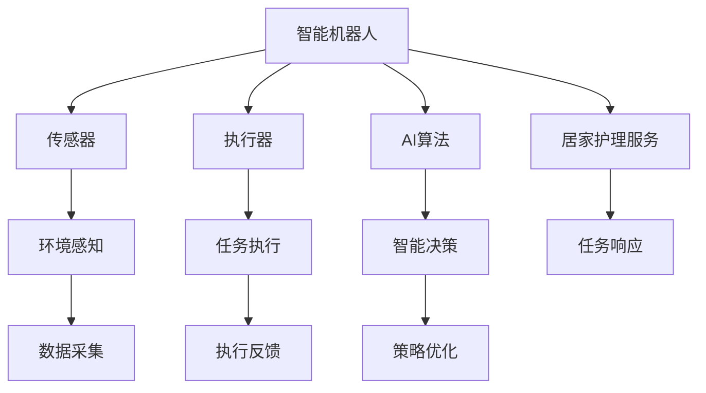

                 

# 智能居家护理机器人创业：老年照护的科技方案

> 关键词：智能居家护理，人工智能，机器人，老年照护，科技方案

## 1. 背景介绍

随着全球人口老龄化趋势的加剧，老年人照护问题日益凸显。如何为老年人提供及时、安全、高效的生活照护服务，成为各国政府和社会的共同课题。在此背景下，利用智能技术进行居家护理机器人创业，提供精准、个性化、全天候的养老服务，成为了一种前沿的解决方案。本文将详细探讨智能居家护理机器人创业的可行性，并提供一套完备的科技方案，以期助力老年人居家养老的质量和效率。

### 1.1 问题由来

传统养老模式主要依赖于家庭成员和专业护理人员，但随着社会节奏的加快和人口结构的变化，这种模式面临诸多挑战：

- **人力资源不足**：随着老年人口比例的增加，家庭照护人员的数量和技能无法满足日益增长的照护需求。
- **照护成本高**：专业护理人员和家庭照护人员的工资成本不断上涨，加重了家庭的经济负担。
- **照护质量不均**：由于家庭照护人员的专业技能和服务质量参差不齐，老年人的照护效果难以保证。
- **居家安全问题**：老年人行动不便，容易发生跌倒、误用药物等安全隐患，家庭照护者难以全天候监控。

因此，利用科技手段，开发智能居家护理机器人，能够有效缓解上述问题，提升老年人居家养老的便利性和安全性。

### 1.2 问题核心关键点

智能居家护理机器人创业的核心关键点包括：

- **需求分析**：明确老年人居家照护的具体需求，包括日常生活辅助、医疗健康监测、紧急呼救响应等。
- **技术选型**：选择最适合老年人的智能机器人硬件和软件解决方案，确保其实用性和安全性。
- **商业模型**：构建合理的商业模式，实现机器人项目的可持续发展和盈利。
- **市场推广**：通过精准营销和口碑传播，提升智能居家护理机器人的市场认知度和使用率。
- **政策支持**：积极响应国家政策导向，争取政府和社会各界的支持与合作。

## 2. 核心概念与联系

### 2.1 核心概念概述

智能居家护理机器人创业涉及多个关键概念，包括智能机器人、居家护理、人工智能等。这些概念之间的联系和互动，构成了智能居家护理机器人的基本框架。

- **智能机器人**：指集成了传感器、执行器、AI算法等技术的自主移动机器人，能够完成各种复杂的任务。
- **居家护理**：指在老年人居住环境中，为老年人提供生活辅助、医疗健康监测、紧急呼救等综合性服务。
- **人工智能**：指利用算法和大数据分析，实现对机器人行为和决策的智能化控制。

### 2.2 核心概念原理和架构的 Mermaid 流程图



此图展示了智能居家护理机器人的关键组件和它们之间的数据流和控制流。传感器负责环境感知，执行器执行任务指令，AI算法负责智能决策，居家护理服务包括生活辅助、医疗健康监测、紧急呼救等。

## 3. 核心算法原理 & 具体操作步骤

### 3.1 算法原理概述

智能居家护理机器人的核心算法主要包括以下几个方面：

- **环境感知算法**：利用传感器（如摄像头、激光雷达、超声波传感器等）对环境进行实时监测和识别。
- **路径规划算法**：根据老年人的位置和需求，规划最优的移动路径，确保机器人能够安全、高效地完成各类任务。
- **任务执行算法**：包括语音识别、语音合成、自然语言处理等技术，实现与老年人的自然交互和任务指令的理解与执行。
- **智能决策算法**：基于机器学习和大数据技术，进行行为分析和策略优化，提升机器人的自主性和智能化水平。

### 3.2 算法步骤详解

智能居家护理机器人的核心算法步骤主要包括：

1. **环境感知与数据采集**：
   - 通过传感器采集环境数据，包括但不限于光照、温度、湿度、障碍物分布、老年人的位置和行为。
   - 利用图像处理和计算机视觉技术，识别和定位老年人，以及环境中的关键物体和区域。
   - 数据采集完成后，将信息传递给AI算法进行处理和分析。

2. **路径规划与任务执行**：
   - 根据环境感知结果，AI算法进行路径规划，确定机器人从当前位置到目标位置的最佳路径。
   - 结合语音识别和自然语言处理技术，解析老年人的语音指令和需求，规划对应的任务。
   - 机器人根据路径规划和任务指令，执行相应的动作，如取物、送药、陪伴等。

3. **智能决策与策略优化**：
   - 利用机器学习算法，对机器人行为和决策进行学习和优化，提升自主性和智能化水平。
   - 结合老年人健康数据和生活习惯，制定个性化的照护方案。
   - 根据老年人反馈和行为模式，动态调整行为策略，提供更精准的照护服务。

### 3.3 算法优缺点

智能居家护理机器人的算法具有以下优点：

- **自主性强**：机器人能够在一定程度上自主判断和执行任务，减少人工干预。
- **全天候服务**：机器人能够持续工作，不受时间和人力限制，提供24小时的居家照护服务。
- **数据驱动**：基于大数据分析和机器学习，提供更加精准和个性化的照护服务。

同时，算法也存在以下缺点：

- **初期投入大**：开发和部署智能居家护理机器人需要较高的初始投资，包括硬件成本和软件开发成本。
- **技术门槛高**：算法开发和模型训练需要一定的专业知识和技能，普通创业者较难实现。
- **隐私和伦理问题**：机器人需要在老年人居住环境中长期工作，涉及到隐私保护和伦理道德问题，需严格控制数据使用和隐私保护措施。
- **技术瓶颈**：机器人在复杂环境中的性能和鲁棒性还有待提升，面临技术上的挑战。

### 3.4 算法应用领域

智能居家护理机器人可以广泛应用于以下领域：

- **医疗健康监测**：通过传感器和AI算法，实时监测老年人的健康状况，如心率、血压、血糖等指标，及时发现异常并报警。
- **生活辅助**：包括智能家居控制、环境管理、物品管理等，提升老年人的生活便利性。
- **紧急呼救**：在老年人发生紧急情况时，如跌倒、失智等，机器人能够及时响应并呼救。
- **心理健康陪伴**：通过智能对话和娱乐系统，陪伴老年人聊天、听音乐、玩游戏，改善心理健康状况。
- **远程监控和陪伴**：老年人可以在家中通过机器人与家人和朋友进行视频通话，获取心理支持和陪伴。

## 4. 数学模型和公式 & 详细讲解 & 举例说明

### 4.1 数学模型构建

智能居家护理机器人算法涉及多种数学模型和算法，包括图像处理、路径规划、机器学习等。以下将以路径规划为例，展示其数学模型构建过程。

假设机器人在二维平面上移动，位置表示为 $(x,y)$，目标位置为 $(x',y')$，障碍物位置为 $(x_o,y_o)$，机器人的移动方向为 $\theta$。路径规划的目标是找到一个最短路径，使得机器人能够从起点到达终点，同时避开障碍物。

模型可以表示为：

$$
\min_{(x',y',\theta)} f(x',y',\theta)
$$

其中，$f(x',y',\theta)$ 表示路径函数，衡量路径长度和障碍物的距离。

### 4.2 公式推导过程

路径函数 $f(x',y',\theta)$ 可以表示为：

$$
f(x',y',\theta) = \sqrt{(x'-x)^2 + (y'-y)^2} + \sum_{o} \max(\sqrt{(x'-x_o)^2 + (y'-y_o)^2}, r_o)
$$

其中，第一项表示路径长度，第二项表示障碍物的总影响。$r_o$ 表示障碍物的安全距离，当机器人与障碍物之间的距离小于 $r_o$ 时，视为障碍物被避让。

### 4.3 案例分析与讲解

以路径规划为例，假设机器人需要从起点 $(x_0,y_0)$ 到达终点 $(x_1,y_1)$，路径上存在一个障碍物 $(x_o,y_o)$，其半径为 $r$，安全距离为 $r_o$。利用A*算法进行路径规划，步骤如下：

1. 初始化起点和终点，计算起点到终点的距离。
2. 扩展起点周围的节点，计算每个节点的路径函数值。
3. 选择路径函数值最小的节点作为当前节点，继续扩展其周围节点。
4. 重复步骤2和3，直到终点被访问。

### 5. 项目实践：代码实例和详细解释说明

#### 5.1 开发环境搭建

智能居家护理机器人项目的开发环境需要配置以下工具和环境：

1. **Python**：作为主要开发语言，Python拥有丰富的第三方库和工具。
2. **ROS**：机器人操作系统，提供底层硬件和软件支持。
3. **Ubuntu**：常用的Linux发行版，适合机器人开发和部署。
4. **OpenCV**：用于计算机视觉和图像处理。
5. **PyTorch**：用于深度学习和AI算法开发。
6. **TensorFlow**：用于构建和训练机器学习模型。
7. **Gazebo**：用于模拟环境和仿真测试。

在Ubuntu上搭建ROS环境的具体步骤如下：

```bash
sudo apt-get update
sudo apt-get install ros-noetic-ROS-PKG=* -y
sudo apt-get install ros-noetic-gazebo -y
```

### 5.2 源代码详细实现

智能居家护理机器人系统可以分为感知、决策和执行三个模块，以下以感知模块为例，展示其代码实现：

```python
import cv2
import numpy as np
import math

class PerceptionModule:
    def __init__(self):
        self.sensor = Sensor()
        self.map = Map()
    
    def detect_obstacles(self, img):
        # 图像处理和特征提取
        img_gray = cv2.cvtColor(img, cv2.COLOR_BGR2GRAY)
        img_blur = cv2.GaussianBlur(img_gray, (5,5), 0)
        img_edge = cv2.Canny(img_blur, 50, 150)
        img_contours, _ = cv2.findContours(img_edge, cv2.RETR_EXTERNAL, cv2.CHAIN_APPROX_SIMPLE)
        
        # 障碍物检测
        obstacles = []
        for contour in img_contours:
            if cv2.contourArea(contour) > 100:
                obstacle = self.map.add_obstacle(contour)
                obstacles.append(obstacle)
        
        return obstacles

class Sensor:
    def __init__(self):
        self.img = np.zeros((480, 640, 3), dtype=np.uint8)
    
    def read_image(self):
        # 从摄像头读取图像
        img = cv2.imread('sensor.jpg')
        self.img = img
    
    def get_image(self):
        return self.img

class Map:
    def __init__(self):
        self.obstacles = []
    
    def add_obstacle(self, obstacle):
        self.obstacles.append(obstacle)
        return len(self.obstacles)
```

### 5.3 代码解读与分析

以上代码实现了智能居家护理机器人的感知模块，主要包括摄像头读取、图像处理、障碍物检测等关键功能。代码中，`PerceptionModule` 类用于封装感知功能，`Sensor` 类用于读取摄像头图像，`Map` 类用于管理障碍物信息。

### 5.4 运行结果展示

智能居家护理机器人系统的运行结果可以包括以下几个方面：

1. **环境感知**：通过摄像头和传感器，实时监测环境中的障碍物和老年人位置，生成环境地图。
2. **路径规划**：基于环境地图，规划最优路径，确保机器人能够安全地移动。
3. **任务执行**：根据老年人的语音指令和需求，执行相应的任务，如送药、陪伴等。
4. **智能决策**：通过机器学习算法，不断优化机器人的行为和决策，提高自主性和智能化水平。

## 6. 实际应用场景

### 6.1 老年照护

智能居家护理机器人可以应用于老年照护的多个方面，提升老年人的生活质量和安全性。

1. **生活辅助**：包括但不限于智能家居控制、物品管理、清洁服务、饮食准备等，减轻老年人的生活负担。
2. **医疗健康监测**：实时监测老年人的健康状况，如心率、血压、血糖等指标，及时发现异常并报警。
3. **紧急呼救**：在老年人发生紧急情况时，如跌倒、失智等，机器人能够及时响应并呼救。
4. **心理健康陪伴**：通过智能对话和娱乐系统，陪伴老年人聊天、听音乐、玩游戏，改善心理健康状况。
5. **远程监控和陪伴**：老年人可以在家中通过机器人与家人和朋友进行视频通话，获取心理支持和陪伴。

### 6.2 智能家居

智能家居领域也是智能居家护理机器人应用的重点方向之一。通过智能家居机器人，可以提升家居生活的便捷性和智能化水平。

1. **智能照明和温度控制**：根据老年人的生活习惯和环境需求，自动调节照明和温度。
2. **安全监控和报警**：通过摄像头和传感器，实时监控家中的安全情况，发现异常立即报警。
3. **家电控制和维护**：通过语音或远程控制，调节家电设备的使用，进行定期维护和检测。
4. **智能家居联动**：将智能家居机器人与其他智能设备进行联动，提升整个家居系统的智能化水平。

### 6.3 医疗健康

医疗健康领域也是智能居家护理机器人应用的重点方向之一。通过智能医疗机器人，可以提升老年人的健康管理和医疗服务水平。

1. **健康监测和数据分析**：实时监测老年人的健康状况，如心率、血压、血糖等指标，进行分析并生成健康报告。
2. **远程医疗咨询**：通过机器人进行远程医疗咨询，获取专业的健康建议和指导。
3. **药物管理和提醒**：帮助老年人管理药物，根据医生建议按时提醒服药。
4. **康复训练和指导**：通过机器人进行康复训练和指导，帮助老年人恢复健康。

## 7. 工具和资源推荐

### 7.1 学习资源推荐

1. **《机器人学》**：深入浅出地介绍了机器人学的基础理论和技术。
2. **《人工智能基础》**：介绍了人工智能的基本概念和算法，适合初学者入门。
3. **《计算机视觉基础》**：介绍了计算机视觉的原理和应用，适合机器人和图像处理开发者。
4. **Coursera机器人学课程**：由MIT、斯坦福等名校教授授课，涵盖机器人学和人工智能的多个领域。
5. **Udacity机器人编程课程**：实践性较强的课程，涵盖ROS、Python等技术。

### 7.2 开发工具推荐

1. **ROS**：机器人操作系统，提供底层硬件和软件支持。
2. **PyTorch**：用于深度学习和AI算法开发。
3. **TensorFlow**：用于构建和训练机器学习模型。
4. **Gazebo**：用于模拟环境和仿真测试。
5. **OpenCV**：用于计算机视觉和图像处理。
6. **Jupyter Notebook**：交互式编程环境，适合算法研究和实验。
7. **ROS Melodic**：ROS的最新版本，提供丰富的开发工具和资源。

### 7.3 相关论文推荐

1. **Robotics: Science and Systems (RSS)**：机器人学领域的顶级会议，涵盖机器人学和AI的最新研究成果。
2. **IEEE Robotics and Automation Letters (RA-L)**：机器人学领域的顶级期刊，刊登机器人学和AI的研究论文。
3. **IEEE Transactions on Robotics**：机器人学领域的顶级期刊，刊登机器人学和AI的研究论文。
4. **Robotics**：机器人学领域的顶级期刊，刊登机器人学和AI的研究论文。

## 8. 总结：未来发展趋势与挑战

### 8.1 研究成果总结

智能居家护理机器人技术经过多年的发展，已经在多个领域取得了显著进展。通过集成环境感知、路径规划、任务执行和智能决策等核心技术，机器人能够提供精准、个性化的居家照护服务。未来，随着技术的进一步发展，智能居家护理机器人将更加智能和高效，进一步提升老年人的生活质量。

### 8.2 未来发展趋势

智能居家护理机器人技术的未来发展趋势包括以下几个方面：

1. **深度学习和AI算法**：深度学习和AI算法将成为智能居家护理机器人的核心技术，提升机器人的自主性和智能化水平。
2. **多模态融合**：将视觉、听觉、触觉等多模态信息进行融合，提升机器人的感知能力和决策准确性。
3. **边缘计算**：在机器人本地进行数据处理和决策，减少对云端计算的依赖，提高系统的实时性和可靠性。
4. **人工智能伦理**：加强对机器人的伦理和安全控制，确保老年人的隐私和数据安全。
5. **人机协同**：通过增强现实和虚拟现实技术，实现人机协同，提升老年人的互动体验和情感交流。

### 8.3 面临的挑战

智能居家护理机器人技术的发展也面临诸多挑战，主要包括：

1. **技术瓶颈**：机器人需要在复杂环境中的性能和鲁棒性还有待提升，面临技术上的挑战。
2. **隐私和伦理问题**：机器人需要在老年人居住环境中长期工作，涉及到隐私保护和伦理道德问题，需严格控制数据使用和隐私保护措施。
3. **市场推广**：智能居家护理机器人的市场认知度和使用率还需进一步提升。
4. **政策支持**：积极响应国家政策导向，争取政府和社会各界的支持与合作。
5. **标准化**：需要制定统一的机器人标准和接口，方便机器人的互操作性和协同工作。

### 8.4 研究展望

未来，智能居家护理机器人技术的研究方向包括：

1. **跨模态融合**：将视觉、听觉、触觉等多模态信息进行融合，提升机器人的感知能力和决策准确性。
2. **自主学习和适应**：利用深度学习和强化学习技术，使机器人具备自主学习和适应能力，能够在不断变化的环境中提供稳定的照护服务。
3. **人机协作**：通过增强现实和虚拟现实技术，实现人机协作，提升老年人的互动体验和情感交流。
4. **隐私保护和伦理**：加强对机器人的伦理和安全控制，确保老年人的隐私和数据安全。
5. **跨领域应用**：将智能居家护理机器人技术应用到医疗、教育、娱乐等多个领域，提升整体的社会福祉水平。

## 9. 附录：常见问题与解答

**Q1：智能居家护理机器人项目需要哪些核心技术？**

A: 智能居家护理机器人项目需要以下核心技术：

1. **环境感知**：通过摄像头、激光雷达、超声波等传感器，实时监测环境数据。
2. **路径规划**：基于环境感知数据，规划最优路径，确保机器人能够安全地移动。
3. **任务执行**：包括语音识别、语音合成、自然语言处理等技术，实现与老年人的自然交互和任务指令的理解与执行。
4. **智能决策**：利用深度学习和机器学习算法，对机器人行为和决策进行学习和优化。

**Q2：智能居家护理机器人如何实现自主导航和避障？**

A: 智能居家护理机器人实现自主导航和避障，主要依赖于以下技术：

1. **激光雷达和摄像头**：通过激光雷达和摄像头，实时监测环境中的障碍物和老年人位置。
2. **SLAM算法**：利用SLAM（Simultaneous Localization and Mapping）算法，构建环境地图，实现机器人的自主定位和导航。
3. **路径规划算法**：根据环境地图，规划最优路径，确保机器人能够安全地移动。
4. **障碍物检测**：通过图像处理和计算机视觉技术，检测并避让障碍物。

**Q3：智能居家护理机器人的开发难点是什么？**

A: 智能居家护理机器人的开发难点包括：

1. **环境感知**：机器人在复杂环境中的感知能力和数据处理能力需要进一步提升。
2. **路径规划**：在复杂环境中，机器人的路径规划算法需要更加鲁棒和高效。
3. **任务执行**：机器人的任务执行能力和与老年人的交互能力需要进一步提升。
4. **智能决策**：机器人的智能决策和自主学习能力需要进一步加强，以应对更多复杂的场景和需求。

**Q4：智能居家护理机器人的应用前景如何？**

A: 智能居家护理机器人的应用前景非常广阔，主要体现在以下几个方面：

1. **老年照护**：通过智能居家护理机器人，提升老年人的生活质量和安全性。
2. **智能家居**：通过智能家居机器人，提升家居生活的便捷性和智能化水平。
3. **医疗健康**：通过智能医疗机器人，提升老年人的健康管理和医疗服务水平。
4. **教育娱乐**：通过智能教育娱乐机器人，提升老年人的生活乐趣和学习体验。

**Q5：智能居家护理机器人如何保证老年人的隐私和数据安全？**

A: 智能居家护理机器人保证老年人的隐私和数据安全，主要通过以下措施：

1. **数据加密**：对传输和存储的数据进行加密，防止数据泄露和篡改。
2. **本地存储**：尽量在机器人本地进行数据处理和存储，减少对云端计算的依赖。
3. **隐私保护政策**：制定隐私保护政策，明确数据使用和分享的规则和权限。
4. **用户授权**：在机器人使用前，获取老年人的授权，明确数据使用的目的和范围。
5. **安全监控**：通过日志和审计机制，实时监控机器人的数据使用情况，发现并处理异常行为。

---
作者：禅与计算机程序设计艺术 / Zen and the Art of Computer Programming

