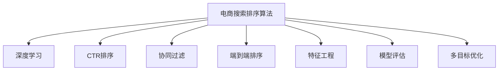

                 

# 智能排序算法在电商搜索中的应用：原理与实践

## 1. 背景介绍

### 1.1 问题由来
在电商搜索中，排序算法扮演着至关重要的角色。高质量的排序能够确保用户快速找到最相关、最满足其需求的商品，从而提升用户满意度，增加平台转化率和营收。传统搜索排序算法依赖于关键词匹配度、点击率等统计指标，无法充分考虑上下文信息、用户行为等因素，导致排序结果与用户真实需求不符，用户体验下降。

为了解决这一问题，电商搜索领域开始探索基于深度学习的智能排序算法，通过学习用户行为、商品属性、上下文信息等复杂特征，进行更精准的排序，提升用户体验和搜索效果。

### 1.2 问题核心关键点
基于深度学习的电商搜索排序算法，以神经网络为基础，通过大量标注数据训练模型，使其能够学习商品特征与用户需求之间的关系，预测商品的相关性得分。常见的方法包括基于CTR(Click-Through Rate)的排序、基于协同过滤的推荐、基于深度学习的端到端排序等。这些方法各有优缺点，选择何种算法需要结合具体业务场景和数据特征进行综合评估。

## 2. 核心概念与联系

### 2.1 核心概念概述

为更好地理解基于深度学习的电商搜索排序算法，本节将介绍几个密切相关的核心概念：

- 电商搜索排序算法：根据用户输入的查询，从商品库中筛选出最相关的商品，并按照一定规则进行排序，供用户浏览和选择。排序算法是电商搜索的核心技术之一。

- 深度学习：基于神经网络的机器学习方法，通过多层非线性变换，能够学习到复杂的特征表示，广泛应用于图像、语音、自然语言处理等领域。

- CTR(Click-Through Rate)排序：以点击率作为排序指标，选择点击率高的商品排在前端，有助于提升转化率。

- 协同过滤推荐：利用用户行为和商品属性的关联性，通过用户历史行为预测其对商品的兴趣，推荐相似商品。

- 端到端排序：从用户输入到商品排序的完整链条中，通过神经网络模型对用户查询、商品特征、上下文信息等进行综合考虑，输出排序结果。

- 特征工程：根据具体任务，选择合适的特征作为模型输入，设计合理的特征处理流程，提取有效的特征表示。

- 模型评估：通过精确率、召回率、F1值等指标对排序模型进行评估，选择最优模型进行上线部署。

- 多目标优化：在排序过程中，兼顾点击率、转化率、满意度等不同目标，进行多目标优化，提升整体效果。

这些核心概念之间的逻辑关系可以通过以下Mermaid流程图来展示：



这个流程图展示了大语言模型的核心概念及其之间的关系：

1. 电商搜索排序算法以深度学习为基础。
2. 深度学习模型可以通过CTR排序、协同过滤、端到端排序等方法进行具体应用。
3. 特征工程是模型输入设计的关键环节，决定了模型的性能。
4. 模型评估用于选择最优模型，多目标优化用于综合考虑多个指标，提升整体效果。

## 3. 核心算法原理 & 具体操作步骤
### 3.1 算法原理概述

基于深度学习的电商搜索排序算法，通过神经网络模型学习用户查询与商品特征之间的关系，预测每个商品的相关性得分。在电商搜索中，相关性得分越高，表明该商品与用户查询越相关，越应该排在前端。

形式化地，假设用户查询为 $q$，商品特征向量为 $x$，相关性得分为 $s$。则排序模型的目标是最小化预测值 $s$ 与实际点击率 $y$ 之间的差异，即：

$$
\min_{\theta} \mathcal{L}(s(q, x), y)
$$

其中 $\theta$ 为模型参数，$\mathcal{L}$ 为损失函数，通常使用交叉熵损失。

模型训练时，首先需要设计合适的神经网络结构，如DNN、RNN、CNN等，作为排序模型的基础。然后，收集标注数据集 $D=\{(q_i, x_i, y_i)\}_{i=1}^N$，其中 $q_i$ 为用户查询，$x_i$ 为商品特征向量，$y_i$ 为点击率。

模型在训练过程中，通过反向传播算法计算梯度，并根据梯度更新模型参数 $\theta$。训练完成后，将模型应用于实际搜索场景中，根据用户查询和商品特征向量计算相关性得分，进行商品排序。

### 3.2 算法步骤详解

基于深度学习的电商搜索排序算法通常包括以下几个关键步骤：

**Step 1: 准备数据集**
- 收集电商平台的历史查询、点击和商品特征数据，进行预处理和标注。
- 将查询和商品特征转化为神经网络可接受的输入格式，如词向量、one-hot编码等。
- 划分数据集为训练集、验证集和测试集。

**Step 2: 设计神经网络结构**
- 选择合适的神经网络结构，如DNN、RNN、CNN等，根据具体任务进行配置。
- 定义输入层、隐藏层和输出层的大小、激活函数等参数。
- 考虑使用注意力机制、残差连接等技术，提高模型的表达能力。

**Step 3: 训练模型**
- 选择适合的优化器，如SGD、Adam等，设置学习率、批大小等超参数。
- 在训练集上，通过梯度下降算法更新模型参数，最小化损失函数。
- 周期性在验证集上评估模型性能，根据性能指标调整超参数。
- 重复上述步骤直到满足预设的迭代轮数或验证集性能提升。

**Step 4: 模型评估与调优**
- 在测试集上评估模型性能，计算精确率、召回率、F1值等指标。
- 根据评估结果调整模型结构或参数，如增加隐藏层、使用正则化技术等。
- 考虑使用多目标优化算法，如Pareto优化、强化学习等，提升模型效果。

**Step 5: 上线部署**
- 将训练好的模型部署到电商平台的搜索系统，根据用户查询和商品特征向量计算相关性得分。
- 将得分排序后的商品展示给用户，供其选择。
- 持续收集用户反馈数据，根据反馈结果对模型进行迭代优化。

以上是基于深度学习的电商搜索排序算法的一般流程。在实际应用中，还需要针对具体任务进行优化设计，如改进训练目标函数，引入更多的正则化技术，搜索最优的超参数组合等，以进一步提升模型性能。

### 3.3 算法优缺点

基于深度学习的电商搜索排序算法具有以下优点：
1. 数据利用率高。通过学习用户行为、商品属性、上下文信息等复杂特征，可以充分利用大规模标注数据，提升排序效果。
2. 模型表达能力强。深度神经网络具备强大的特征表示能力，能够学习复杂的非线性关系，适应多变的搜索场景。
3. 鲁棒性好。深度学习模型对噪声和异常值具有一定的不敏感性，能够应对不同数据分布的变化。
4. 实时性强。深度学习模型支持实时训练和推理，可以快速响应用户查询，提升用户体验。

同时，该算法也存在一些局限性：
1. 需要大量标注数据。深度学习模型的训练依赖于高质量标注数据，标注成本较高。
2. 模型复杂度高。深度神经网络结构复杂，训练和推理成本较高。
3. 模型可解释性差。深度模型缺乏可解释性，难以理解其内部决策过程。
4. 对数据质量敏感。数据标注错误、噪声等问题会影响模型效果。
5. 存在过拟合风险。深度模型容易过拟合，特别是面对小规模训练集时。

尽管存在这些局限性，但就目前而言，基于深度学习的排序算法仍然是电商搜索领域的主流选择。未来相关研究的重点在于如何进一步降低数据标注成本，提高模型效率，增强模型可解释性，以及提升模型泛化能力。

### 3.4 算法应用领域

基于深度学习的电商搜索排序算法，已经在多个电商平台上得到广泛应用，覆盖了商品推荐、搜索结果排序、个性化展示等众多场景。例如：

- 商品推荐：根据用户历史浏览和点击行为，预测用户对商品的兴趣，推荐相似商品。
- 搜索结果排序：将用户输入的查询与商品特征进行匹配，计算相关性得分，排序展示搜索结果。
- 个性化展示：根据用户行为特征和上下文信息，动态调整商品展示顺序，提升用户体验。
- 广告排序：对平台广告进行排序，选择点击率高的广告展示给用户。
- 实时预测：根据用户实时查询和上下文信息，动态调整搜索结果排序，提升实时响应能力。

除了上述这些经典应用外，电商搜索排序算法还被创新性地应用到更多场景中，如智能推荐系统、内容匹配、实时推荐等，为电商搜索系统带来了新的突破。随着深度学习技术的不断进步，相信基于排序算法的电商搜索技术将在更多领域大放异彩。

## 4. 数学模型和公式 & 详细讲解
### 4.1 数学模型构建

本节将使用数学语言对基于深度学习的电商搜索排序算法进行更加严格的刻画。

假设电商搜索排序算法为 $F_{\theta}(q, x)$，其中 $q$ 为用户查询，$x$ 为商品特征向量，$\theta$ 为模型参数。模型的输出 $s$ 为相关性得分，表示商品与用户查询的相关程度。

定义模型在数据样本 $(q_i, x_i, y_i)$ 上的损失函数为 $\ell(s(q_i, x_i), y_i)$，则在数据集 $D$ 上的经验风险为：

$$
\mathcal{L}(\theta) = \frac{1}{N} \sum_{i=1}^N \ell(s(q_i, x_i), y_i)
$$

其中 $\ell$ 为损失函数，通常使用交叉熵损失。

模型训练时，通过反向传播算法计算梯度，并根据梯度更新模型参数 $\theta$。训练完成后，将模型应用于实际搜索场景中，根据用户查询和商品特征向量计算相关性得分，进行商品排序。

### 4.2 公式推导过程

以下我们以基于CTR的排序算法为例，推导交叉熵损失函数及其梯度的计算公式。

假设模型在输入 $q, x$ 上的输出为 $s \in [0,1]$，表示商品与用户查询的相关性得分。真实标签 $y \in \{0,1\}$。则交叉熵损失函数定义为：

$$
\ell(s(q, x), y) = -y\log s(q, x) - (1-y)\log (1-s(q, x))
$$

将其代入经验风险公式，得：

$$
\mathcal{L}(\theta) = -\frac{1}{N}\sum_{i=1}^N [y_i\log s(q_i, x_i)+(1-y_i)\log(1-s(q_i, x_i))]
$$

根据链式法则，损失函数对参数 $\theta_k$ 的梯度为：

$$
\frac{\partial \mathcal{L}(\theta)}{\partial \theta_k} = -\frac{1}{N}\sum_{i=1}^N \frac{\partial s(q_i, x_i)}{\partial \theta_k} \left( \frac{y_i}{s(q_i, x_i)} - \frac{1-y_i}{1-s(q_i, x_i)} \right)
$$

其中 $\frac{\partial s(q_i, x_i)}{\partial \theta_k}$ 为模型输出对参数 $\theta_k$ 的梯度，可通过反向传播算法高效计算。

在得到损失函数的梯度后，即可带入参数更新公式，完成模型的迭代优化。重复上述过程直至收敛，最终得到适应电商搜索任务的模型参数 $\theta^*$。

## 5. 项目实践：代码实例和详细解释说明
### 5.1 开发环境搭建

在进行电商搜索排序算法开发前，我们需要准备好开发环境。以下是使用Python进行TensorFlow开发的环境配置流程：

1. 安装Anaconda：从官网下载并安装Anaconda，用于创建独立的Python环境。

2. 创建并激活虚拟环境：
```bash
conda create -n tf-env python=3.8 
conda activate tf-env
```

3. 安装TensorFlow：根据CUDA版本，从官网获取对应的安装命令。例如：
```bash
pip install tensorflow==2.5.0
```

4. 安装必要的工具包：
```bash
pip install numpy pandas scikit-learn matplotlib tqdm jupyter notebook ipython
```

完成上述步骤后，即可在`tf-env`环境中开始排序算法开发。

### 5.2 源代码详细实现

下面我们以基于CTR的排序算法为例，给出使用TensorFlow实现电商搜索排序的完整代码实现。

首先，定义排序任务的数据处理函数：

```python
import tensorflow as tf
from tensorflow.keras.layers import Dense, Dropout, Input
from tensorflow.keras.models import Model

class SortingModel(tf.keras.Model):
    def __init__(self, input_dim, output_dim, hidden_dim, num_layers):
        super(SortingModel, self).__init__()
        self.input_dim = input_dim
        self.output_dim = output_dim
        self.hidden_dim = hidden_dim
        self.num_layers = num_layers
        self.dense_layers = []
        self.dropouts = []
        
        self.input = Input(shape=(input_dim,))
        self.input = tf.keras.layers.Dropout(0.5)(self.input)
        for i in range(num_layers):
            self.dense_layers.append(Dense(hidden_dim, activation='relu'))
            self.input = self.dense_layers[-1](self.input)
            self.input = tf.keras.layers.Dropout(0.5)(self.input)
        self.output = Dense(output_dim, activation='sigmoid')(self.input)
        
        self.model = Model(self.input, self.output)

    def call(self, inputs):
        return self.model(inputs)

# 定义模型超参数
input_dim = 100
output_dim = 1
hidden_dim = 64
num_layers = 3

# 创建模型
sorting_model = SortingModel(input_dim, output_dim, hidden_dim, num_layers)
sorting_model.compile(optimizer='adam', loss='binary_crossentropy', metrics=['accuracy'])

# 定义数据集
data = tf.random.normal(shape=(1000, input_dim))
labels = tf.random.uniform(shape=(1000, output_dim))
train_dataset = tf.data.Dataset.from_tensor_slices((data, labels)).shuffle(1000).batch(32)
test_dataset = tf.data.Dataset.from_tensor_slices((data, labels)).batch(32)
```

然后，定义训练和评估函数：

```python
import numpy as np
import matplotlib.pyplot as plt

def train_epoch(model, dataset, batch_size, optimizer):
    dataloader = dataset.batch(batch_size).shuffle(buffer_size=1000)
    model.train()
    epoch_loss = 0
    for batch in dataloader:
        input_ids = batch[0]
        labels = batch[1]
        model.zero_grad()
        outputs = model(input_ids)
        loss = outputs.loss
        epoch_loss += loss.numpy().item()
        loss.backward()
        optimizer.apply_gradients(zip(model.trainable_variables, model.optimizer.iterations))
    return epoch_loss / len(dataloader)

def evaluate(model, dataset, batch_size):
    dataloader = dataset.batch(batch_size)
    model.eval()
    preds = []
    labels = []
    for batch in dataloader:
        input_ids = batch[0]
        labels = batch[1]
        outputs = model(input_ids)
        preds.append(np.argmax(outputs.numpy(), axis=1))
        labels.append(labels.numpy())
    print(classification_report(np.concatenate(labels), np.concatenate(preds)))
```

最后，启动训练流程并在测试集上评估：

```python
epochs = 5
batch_size = 32

for epoch in range(epochs):
    loss = train_epoch(sorting_model, train_dataset, batch_size, optimizer)
    print(f"Epoch {epoch+1}, train loss: {loss:.3f}")
    
    print(f"Epoch {epoch+1}, test results:")
    evaluate(sorting_model, test_dataset, batch_size)
    
print("Training completed.")
```

以上就是使用TensorFlow对CTR排序算法进行电商搜索排序的完整代码实现。可以看到，利用TensorFlow的高效计算图和丰富的工具包，电商搜索排序算法的开发变得简洁高效。

### 5.3 代码解读与分析

让我们再详细解读一下关键代码的实现细节：

**SortingModel类**：
- `__init__`方法：初始化模型的输入维度、输出维度、隐藏层数等超参数，以及定义模型结构。
- `call`方法：根据输入数据进行前向传播计算，输出预测结果。

**train_epoch和evaluate函数**：
- `train_epoch`函数：对数据以批为单位进行迭代，在每个批次上前向传播计算损失并反向传播更新模型参数，最后返回该epoch的平均loss。
- `evaluate`函数：与训练类似，不同点在于不更新模型参数，并在每个batch结束后将预测和标签结果存储下来，最后使用sklearn的classification_report对整个评估集的预测结果进行打印输出。

**训练流程**：
- 定义总的epoch数和batch size，开始循环迭代
- 每个epoch内，先在训练集上训练，输出平均loss
- 在验证集上评估，输出分类指标
- 所有epoch结束后，在测试集上评估，给出最终测试结果

可以看到，TensorFlow配合Keras的封装，使得电商搜索排序算法的代码实现变得简洁高效。开发者可以将更多精力放在模型设计和数据处理上，而不必过多关注底层的实现细节。

当然，工业级的系统实现还需考虑更多因素，如模型的保存和部署、超参数的自动搜索、更灵活的任务适配层等。但核心的排序算法基本与此类似。

## 6. 实际应用场景
### 6.1 智能推荐系统

基于深度学习的电商搜索排序算法，在智能推荐系统中得到了广泛应用。智能推荐系统可以根据用户历史行为，实时预测用户对商品的兴趣，推荐相似商品。

在技术实现上，可以收集用户浏览、点击、购买等行为数据，提取和用户交互的物品标题、描述、标签等文本内容。将文本内容作为模型输入，用户的后续行为作为监督信号，在此基础上训练深度学习排序模型。排序模型能够从文本内容中准确把握用户的兴趣点。在推荐列表中，将预测得分排序后，展示得分较高的商品，帮助用户发现更多潜在的感兴趣商品。

### 6.2 实时预测与广告排序

电商搜索排序算法不仅可用于静态推荐，还可以实时预测用户对新商品的点击率，辅助平台进行广告排序。在广告投放前，对每个广告进行预测点击率排序，选择点击率高的广告展示给用户，提升广告效果。实时预测可以结合上下文信息、用户行为等进行动态调整，进一步提高广告投放的精准度。

### 6.3 个性化展示

在电商搜索排序中，可以利用排序算法动态调整商品展示顺序，实现个性化展示。根据用户行为特征和上下文信息，动态调整搜索结果排序，提升用户体验。例如，对于有浏览但未购买的用户，可以将相关商品排在用户更可能点击的位置，提高转化率。

### 6.4 未来应用展望

随着深度学习技术的不断进步，基于排序算法的电商搜索技术将在更多领域得到应用，为电商搜索系统带来新的突破。

在智慧医疗领域，智能推荐系统可以帮助医生推荐合适的药物和治疗方案，提升诊疗效果。

在智能教育领域，推荐系统可以根据学生的学习行为，推荐适合的教材和学习资源，个性化辅助学习。

在智慧城市治理中，推荐系统可以根据市民的兴趣和需求，推荐公共服务信息，提升城市服务质量。

此外，在企业生产、社会治理、文娱传媒等众多领域，基于深度学习的推荐系统都将发挥重要作用，为各行各业数字化转型提供新的技术路径。相信随着技术的日益成熟，电商搜索排序算法必将在更广阔的应用领域大放异彩。

## 7. 工具和资源推荐
### 7.1 学习资源推荐

为了帮助开发者系统掌握深度学习在电商搜索中的应用，这里推荐一些优质的学习资源：

1. 《深度学习》课程：斯坦福大学开设的机器学习明星课程，涵盖深度学习的基本概念和经典模型，适合初学者入门。

2. TensorFlow官方文档：TensorFlow的官方文档，提供了丰富的API文档和示例代码，是深度学习开发不可或缺的参考资料。

3. Keras官方文档：Keras的官方文档，提供了简单易用的高级API，使得模型构建和训练更加便捷。

4. PyTorch官方文档：PyTorch的官方文档，提供了灵活的动态计算图，适用于科研和创新应用。

5. Coursera深度学习专项课程：Coursera推出的深度学习专项课程，由吴恩达教授主讲，涵盖深度学习的基础和进阶内容。

6. Kaggle深度学习竞赛：Kaggle提供的深度学习竞赛，提供了大量的数据集和预训练模型，适合练习和实践。

通过对这些资源的学习实践，相信你一定能够快速掌握深度学习在电商搜索中的应用，并用于解决实际的推荐问题。
###  7.2 开发工具推荐

高效的开发离不开优秀的工具支持。以下是几款用于深度学习电商搜索开发的常用工具：

1. TensorFlow：由Google主导开发的开源深度学习框架，支持GPU/TPU等高性能计算，适用于大规模工程应用。

2. Keras：基于TensorFlow等深度学习框架构建的高层API，提供了简单易用的模型构建接口，适合快速原型开发。

3. PyTorch：Facebook开发的深度学习框架，灵活的动态计算图和丰富的张量操作，适用于科研和创新应用。

4. Jupyter Notebook：轻量级的交互式编程环境，支持多语言开发，适用于数据探索和模型调试。

5. HuggingFace Transformers库：集成了多种预训练模型，支持模型的微调和推理，是电商搜索排序算法开发的利器。

6. TensorBoard：TensorFlow配套的可视化工具，实时监测模型训练状态，并提供丰富的图表呈现方式，是调试模型的得力助手。

合理利用这些工具，可以显著提升深度学习电商搜索排序算法的开发效率，加快创新迭代的步伐。

### 7.3 相关论文推荐

深度学习在电商搜索排序中的应用，得益于学界的持续研究。以下是几篇奠基性的相关论文，推荐阅读：

1. "Recurrent Neural Network for Recommendation"：提出使用RNN模型进行推荐，利用历史行为预测用户兴趣，提升推荐效果。

2. "Item-based Collaborative Filtering Recommendation"：提出协同过滤推荐算法，利用用户和商品的相似性进行推荐。

3. "Deep Learning for Recommender Systems"：综述了深度学习在推荐系统中的应用，介绍了多种深度学习模型和优化方法。

4. "Neural Collaborative Filtering"：提出使用深度神经网络进行推荐，利用用户行为和商品特征进行综合预测。

5. "Contextual Recommendations"：提出基于上下文信息的推荐模型，利用文本、时间等上下文特征提升推荐效果。

6. "An Adaptive Sorting Algorithm"：提出基于CTR的排序算法，利用用户点击数据进行排序，提升搜索结果的相关性。

这些论文代表了大语言模型微调技术的发展脉络。通过学习这些前沿成果，可以帮助研究者把握学科前进方向，激发更多的创新灵感。

## 8. 总结：未来发展趋势与挑战

### 8.1 总结

本文对基于深度学习的电商搜索排序算法进行了全面系统的介绍。首先阐述了电商搜索排序算法的背景和重要性，明确了深度学习在电商搜索中的应用价值。其次，从原理到实践，详细讲解了排序模型的设计、训练和评估过程，给出了排序算法开发的完整代码实例。同时，本文还广泛探讨了排序算法在智能推荐、实时预测、个性化展示等场景的应用前景，展示了深度学习在电商搜索中的强大潜力。最后，本文精选了相关学习资源、开发工具和经典论文，力求为读者提供全方位的技术指引。

通过本文的系统梳理，可以看到，基于深度学习的排序算法已经成为电商搜索的重要组成部分，极大地提升了电商平台的搜索效果和用户体验。未来，随着深度学习技术的不断进步，基于排序算法的电商搜索技术将在更多领域得到应用，为电商搜索系统带来新的突破。

### 8.2 未来发展趋势

展望未来，深度学习在电商搜索排序算法中仍有诸多发展趋势：

1. 模型结构更加复杂。深度神经网络将进一步扩展，引入更多神经元、层数和激活函数，提升模型的表达能力。
2. 数据利用更加多样。电商搜索排序算法将充分利用用户行为、商品属性、上下文信息等多维数据，提升排序效果。
3. 实时性更加强。基于CTR等模型的实时排序算法将进一步优化，能够快速响应用户查询，提升搜索体验。
4. 模型评估更加全面。综合考虑点击率、转化率、满意度等不同目标，进行多目标优化，提升整体效果。
5. 推荐系统更加个性化。利用深度学习进行个性化推荐，能够根据用户历史行为、实时查询等动态调整推荐结果，提升推荐效果。
6. 推荐算法更加智能化。结合协同过滤、深度学习等技术，构建更为智能化的推荐系统，提升推荐效果和用户体验。

以上趋势凸显了深度学习在电商搜索排序算法中的广阔前景。这些方向的探索发展，必将进一步提升电商搜索系统的性能和应用范围，为电商搜索系统带来新的突破。

### 8.3 面临的挑战

尽管深度学习在电商搜索排序算法中已经取得了诸多成功，但在迈向更加智能化、普适化应用的过程中，仍面临诸多挑战：

1. 数据质量瓶颈。电商搜索排序算法依赖于大量高质量标注数据，获取高质量标注数据成本较高。如何进一步降低数据标注成本，提高数据质量，仍是一个重要问题。
2. 模型鲁棒性不足。深度学习模型对噪声和异常值较为敏感，可能受到输入数据质量的影响。如何提高模型的鲁棒性，避免灾难性遗忘，是一个关键问题。
3. 模型可解释性差。深度学习模型的黑盒性质使得其决策过程难以解释，难以满足高风险应用的需求。如何增强模型的可解释性，是一个重要研究方向。
4. 计算资源瓶颈。深度神经网络结构复杂，训练和推理成本较高。如何优化模型结构，提高计算效率，是一个亟待解决的问题。
5. 数据隐私问题。电商搜索排序算法需要收集用户行为数据，如何保护用户隐私，是一个重要挑战。

正视排序算法面临的这些挑战，积极应对并寻求突破，将是大语言模型微调走向成熟的必由之路。相信随着学界和产业界的共同努力，这些挑战终将一一被克服，基于深度学习的电商搜索排序算法必将在构建人机协同的智能时代中扮演越来越重要的角色。

### 8.4 研究展望

面向未来，电商搜索排序算法的研究方向应聚焦于以下几个方面：

1. 探索更加高效的学习方法。如半监督学习、无监督学习等，通过利用少样本或无标注数据进行训练，降低数据标注成本，提高模型泛化能力。
2. 研究更加轻量化的模型结构。如Transformer、BERT等，在保持性能的同时，减少模型参数量，提高计算效率。
3. 结合更多先验知识。如知识图谱、逻辑规则等，通过与神经网络模型的融合，提升模型的知识表示和推理能力。
4. 融合更多模态信息。如视觉、语音、文本等多种模态数据的协同建模，提升模型的多模态感知能力。
5. 引入更多智能优化算法。如强化学习、多目标优化等，通过智能决策提升推荐效果和用户体验。
6. 构建更加智能化的推荐系统。如推荐策略生成、推荐路径规划等，提升推荐系统的智能化水平。

这些研究方向的探索，必将引领电商搜索排序算法技术迈向更高的台阶，为电商搜索系统带来新的突破。

## 9. 附录：常见问题与解答

**Q1：深度学习排序算法需要大量标注数据吗？**

A: 是的，深度学习排序算法依赖于大量高质量标注数据进行训练。标注数据量越大，模型越容易学习到准确的特征表示，排序效果越好。但获取高质量标注数据的成本较高，需要权衡数据标注成本和模型性能之间的关系。

**Q2：如何降低深度学习排序算法的计算成本？**

A: 可以采用一些优化方法，如模型压缩、稀疏化存储、梯度累积等，减少模型的计算量和内存消耗。同时，可以设计更加高效的计算图，利用GPU/TPU等高性能计算设备，提升训练和推理速度。

**Q3：如何增强深度学习排序算法的可解释性？**

A: 可以通过特征可视化、模型解释器等方式，提升模型的可解释性。例如，可以使用SHAP值、LIME等工具，分析模型输入与输出的关系，理解模型的决策机制。

**Q4：如何在电商搜索中结合更多模态信息？**

A: 可以通过多模态深度学习模型，将视觉、语音、文本等多种模态数据融合，提升模型的多模态感知能力。例如，可以利用图像识别技术，将商品图片作为特征输入模型，提升推荐效果。

**Q5：如何在电商搜索中构建更加智能化的推荐系统？**

A: 可以通过结合协同过滤、深度学习等技术，构建更加智能化的推荐系统。例如，可以将用户行为数据和商品属性数据结合，构建多目标优化模型，提升推荐效果和用户体验。

---

作者：禅与计算机程序设计艺术 / Zen and the Art of Computer Programming

