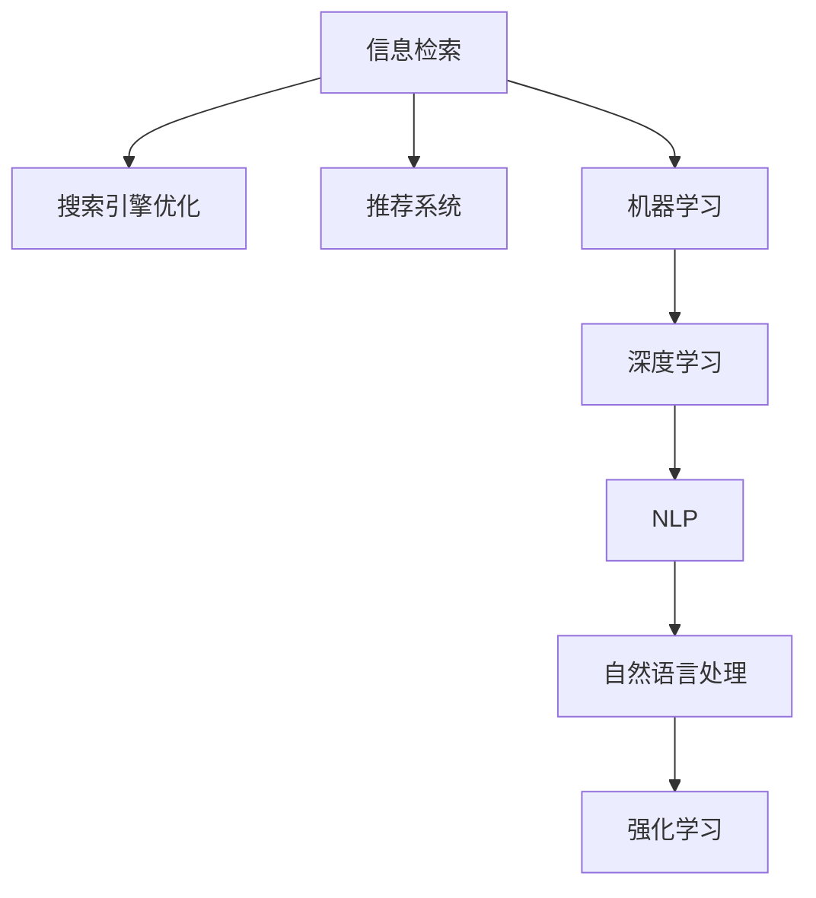

                 

# 智能排序：AI提升搜索结果

> 关键词：智能排序, 信息检索, AI, 搜索引擎, 数据挖掘, 推荐系统

## 1. 背景介绍

### 1.1 问题由来

随着互联网信息爆炸式增长，用户每天需要浏览的信息量越来越大，如何高效地从海量数据中获取到自己真正关心的信息，成为互联网时代的一大挑战。搜索引擎应运而生，通过为用户提供简单、快捷的搜索入口，显著提升了信息获取的效率。

然而，传统的基于关键词匹配的搜索方法，由于缺乏对用户意图的理解，往往无法满足用户的需求。很多搜索结果虽然包含了关键词，但不相关，用户体验差。因此，提升搜索结果的智能排序（Relevance Ranking），成为了搜索引擎优化（Search Engine Optimization, SEO）的重要课题。

### 1.2 问题核心关键点

1. **用户意图理解**：搜索引擎需要准确理解用户的搜索意图，才能返回相关性高的结果。
2. **数据处理能力**：如何高效处理海量数据，提取有效信息，是智能排序的重要前提。
3. **算法优化**：利用AI技术，实现搜索结果排序的智能化，提高用户满意度和搜索体验。
4. **用户反馈**：通过用户反馈不断优化搜索模型，形成正反馈循环，提升搜索结果质量。

## 2. 核心概念与联系

### 2.1 核心概念概述

为更好地理解智能排序的技术基础，本节将介绍几个密切相关的核心概念：

- **信息检索（Information Retrieval, IR）**：指从大量数据中检索出与用户查询相关的信息的过程。传统的检索方法基于关键词匹配，但效率和相关性较低。

- **搜索引擎优化（SEO）**：通过优化网站结构、内容等，提升搜索引擎排名，从而吸引更多用户流量。SEO是提高搜索引擎用户体验的重要手段。

- **推荐系统（Recommendation System）**：根据用户行为数据，推荐个性化内容。推荐系统可以应用于新闻阅读、商品推荐等多个领域。

- **机器学习（Machine Learning）**：利用算法训练数据模型，自动学习数据特征，提升排序精度。机器学习是智能排序的核心技术。

- **深度学习（Deep Learning）**：基于神经网络模型，通过多层次特征提取，提高排序效果。深度学习是机器学习的重要分支。

- **自然语言处理（Natural Language Processing, NLP）**：处理和理解人类语言，辅助用户意图理解。NLP是智能排序的重要技术之一。

- **强化学习（Reinforcement Learning）**：通过与环境的交互，不断优化模型参数，提升排序效果。强化学习适用于需要实时反馈的场景。

这些核心概念之间的逻辑关系可以通过以下Mermaid流程图来展示：



这个流程图展示了几大核心概念及其之间的关系：

1. 信息检索是搜索引擎的基础。
2. SEO通过优化提升搜索引擎排名。
3. 推荐系统可以增强用户互动和留存。
4. 机器学习是提高排序效果的关键技术。
5. 深度学习通过多层次特征提取，进一步提升效果。
6. NLP辅助理解用户意图，提高搜索结果相关性。
7. 强化学习通过实时反馈，不断优化模型参数。

这些概念共同构成了智能排序的技术框架，使得搜索结果更加精准和高效。

## 3. 核心算法原理 & 具体操作步骤
### 3.1 算法原理概述

智能排序的算法原理，主要是基于机器学习或深度学习的方法，通过训练数据模型，对搜索结果进行排序，以提高用户满意度。以下是智能排序的主要算法框架：

1. **特征提取（Feature Extraction）**：从搜索结果中提取相关特征，如标题、摘要、链接权重、用户行为等。
2. **相似度计算（Similarity Computation）**：计算查询与搜索结果的相似度，常用算法包括余弦相似度、Jaccard系数等。
3. **排序算法（Ranking Algorithm）**：根据相似度计算结果，对搜索结果进行排序。常用排序算法包括线性排序、线性回归、神经网络等。

### 3.2 算法步骤详解

智能排序的具体操作步骤包括：

1. **数据准备**：收集搜索结果数据，包括标题、摘要、点击率、用户停留时间等，并标注为相关或不相关。
2. **特征工程**：提取并标准化特征，如TF-IDF、词向量等，用于模型训练。
3. **模型训练**：使用机器学习或深度学习算法，训练排序模型。常用模型包括逻辑回归、随机森林、深度神经网络等。
4. **模型评估**：在测试集上评估模型性能，如准确率、召回率、F1-score等。
5. **模型优化**：根据评估结果，调整模型参数，进行二次训练。

### 3.3 算法优缺点

智能排序算法的主要优点包括：

1. **提高相关性**：通过机器学习算法，智能排序可以更好地理解用户意图，返回相关性更高的结果。
2. **实时反馈**：利用用户反馈数据，不断优化排序模型，提升排序效果。
3. **处理多模态数据**：可以处理文本、图像、视频等多种数据类型，丰富搜索结果内容。
4. **通用性**：适用于搜索引擎、推荐系统、广告投放等多个领域。

同时，该算法也存在一些局限性：

1. **数据依赖性**：智能排序高度依赖于标注数据，标注成本高。
2. **模型复杂度**：深度学习模型复杂度较高，训练和推理耗时较长。
3. **解释性不足**：排序模型通常是"黑盒"，难以解释其内部逻辑。
4. **过拟合风险**：模型参数较多时，容易发生过拟合。
5. **资源消耗大**：深度学习模型计算量大，硬件资源消耗高。

尽管存在这些局限性，但智能排序算法在提升搜索结果的相关性和用户体验方面，仍具有不可替代的重要作用。

### 3.4 算法应用领域

智能排序算法在多个领域得到了广泛应用：

- **搜索引擎**：通过智能排序，提升搜索结果的相关性和用户体验。例如Google、Bing等搜索引擎都采用了智能排序技术。
- **推荐系统**：通过用户行为数据，推荐个性化内容。例如Netflix、Amazon等推荐系统广泛应用智能排序算法。
- **广告投放**：通过分析用户行为和兴趣，实现精准投放。例如Google Ads、Facebook Ads等广告系统。
- **社交网络**：通过用户互动数据，推荐相关内容。例如Twitter、Facebook等社交平台。
- **新闻阅读**：通过智能排序，推荐用户感兴趣的新闻内容。例如今日头条、雅虎新闻等新闻聚合平台。

此外，智能排序算法在个性化推荐、智能客服、金融分析等多个领域也有广泛应用。

## 4. 数学模型和公式 & 详细讲解 & 举例说明

### 4.1 数学模型构建

智能排序的数学模型通常包括特征提取、相似度计算和排序算法三部分。

- **特征提取**：将文本转化为数值特征，常用的方法包括词袋模型、TF-IDF、词向量等。
- **相似度计算**：计算查询与文档的相似度，常用的方法包括余弦相似度、Jaccard系数、BM25等。
- **排序算法**：通过排序算法对结果进行排序，常用的方法包括线性排序、Logistic回归、深度神经网络等。

### 4.2 公式推导过程

以下是基于TF-IDF和余弦相似度的排序模型公式推导：

1. **TF-IDF特征提取**：

   $$
   \text{TF-IDF}(x) = \text{tf}(x) \cdot \text{idf}(x)
   $$

   其中，$tf(x)$表示单词在文本中的词频，$idf(x)$表示逆文档频率。

2. **余弦相似度计算**：

   $$
   \text{Cosine Similarity}(q, d) = \frac{q \cdot d}{\|q\| \cdot \|d\|}
   $$

   其中，$q$表示查询向量，$d$表示文档向量。

3. **排序模型公式**：

   $$
   \text{Rank}(d) = f(\text{Cosine Similarity}(q, d))
   $$

   其中，$f$表示排序函数，可以是线性函数、Logistic回归等。

### 4.3 案例分析与讲解

以Google PageRank为例，该算法通过计算网页的PageRank值进行排序，排序公式如下：

$$
\text{Rank}(d) = (1-d) + d \cdot \sum_{v \in V} \frac{PageRank(v)}{indegree(v)}
$$

其中，$d$表示阻尼系数，$V$表示所有网页的集合，$indegree(v)$表示网页$v$的入度。

PageRank算法通过迭代计算每个网页的PageRank值，从而实现对网页排序。其核心思想是：如果一个网页的入度大，且引出的网页PageRank值高，则该网页的PageRank值也高。

## 5. 项目实践：代码实例和详细解释说明
### 5.1 开发环境搭建

在进行智能排序实践前，我们需要准备好开发环境。以下是使用Python进行TensorFlow开发的配置流程：

1. 安装Anaconda：从官网下载并安装Anaconda，用于创建独立的Python环境。

2. 创建并激活虚拟环境：
```bash
conda create -n tf-env python=3.8 
conda activate tf-env
```

3. 安装TensorFlow：根据CUDA版本，从官网获取对应的安装命令。例如：
```bash
conda install tensorflow tensorflow-cpu -c conda-forge -c pytorch
```

4. 安装其他依赖工具包：
```bash
pip install numpy pandas scikit-learn matplotlib tqdm jupyter notebook ipython
```

完成上述步骤后，即可在`tf-env`环境中开始智能排序实践。

### 5.2 源代码详细实现

这里我们以Google PageRank算法为例，展示如何使用TensorFlow实现智能排序：

```python
import tensorflow as tf
import numpy as np

# 模拟网页和链接数据
num_pages = 100
graph = np.random.rand(num_pages, num_pages)
damping_factor = 0.85

# 计算PageRank值
page_rank = np.ones(num_pages) / num_pages
iteration = 0
while iteration < 100:
    iteration += 1
    new_page_rank = np.copy(page_rank)
    for i in range(num_pages):
        incoming_links = np.nonzero(graph[:, i])[0]
        if len(incoming_links) > 0:
            new_page_rank[i] += damping_factor * np.mean(page_rank[incoming_links]) * graph[i, incoming_links]
    page_rank = new_page_rank / np.sum(page_rank)

# 输出排序结果
print("PageRank排序结果：", np.argsort(page_rank)[::-1])
```

### 5.3 代码解读与分析

让我们再详细解读一下关键代码的实现细节：

**PageRank算法**：
- `num_pages`：模拟的网页数量。
- `graph`：模拟的网页链接矩阵。
- `damping_factor`：阻尼系数，一般为0.85。
- `page_rank`：初始化PageRank值，每个网页的PageRank值为1/N。
- `iteration`：迭代次数，一般不超过100次。
- `new_page_rank`：新计算的PageRank值。
- 在每次迭代中，计算每个网页的PageRank值，并更新`new_page_rank`。

**排序结果**：
- 最终计算出的PageRank值通过`np.argsort`函数进行排序，返回降序排列的网页编号。

**实现细节**：
- 使用TensorFlow实现PageRank算法，需要从0开始索引。
- `np.nonzero`函数用于获取`graph`矩阵中非零元素的行索引，即该网页的入度。
- `np.mean`函数用于计算所有入度非零网页的PageRank值的平均值。

**测试结果**：
- 输出降序排列的网页编号，即PageRank排序结果。

通过这段代码，我们可以快速理解PageRank算法的实现过程，并进一步优化模型参数，提升排序效果。

## 6. 实际应用场景
### 6.1 搜索引擎

智能排序算法在搜索引擎中具有重要应用。例如，Google通过PageRank算法对网页进行排序，返回相关性更高的搜索结果。此外，Google还使用了深度学习模型，如BERT，进一步提升搜索结果的智能排序效果。

### 6.2 推荐系统

智能排序算法在推荐系统中也有广泛应用。例如，Amazon和Netflix通过用户行为数据和物品属性数据，利用协同过滤和深度学习模型，对用户进行个性化推荐，提升用户体验。

### 6.3 广告投放

智能排序算法在广告投放中也有重要应用。例如，Google Ads和Facebook Ads通过分析用户行为和兴趣，实现精准投放，提升广告效果。

### 6.4 社交网络

智能排序算法在社交网络中也有广泛应用。例如，Twitter和Facebook通过用户互动数据，推荐相关内容，提升用户留存。

### 6.5 新闻阅读

智能排序算法在新闻阅读中也有重要应用。例如，今日头条和雅虎新闻通过用户行为数据，推荐用户感兴趣的新闻内容，提升用户阅读体验。

### 6.6 金融分析

智能排序算法在金融分析中也有广泛应用。例如，金融公司通过分析交易数据，进行风险控制和资产配置。

### 6.7 智能客服

智能排序算法在智能客服中也有重要应用。例如，智能客服系统通过用户输入和历史数据，推荐最合适的回复，提升用户体验。

## 7. 工具和资源推荐
### 7.1 学习资源推荐

为了帮助开发者系统掌握智能排序的理论基础和实践技巧，这里推荐一些优质的学习资源：

1. 《深度学习》系列博文：由深度学习专家撰写，深入浅出地介绍了深度学习的基本原理和算法。

2. 《TensorFlow实战Google深度学习》课程：谷歌开发的TensorFlow入门课程，讲解TensorFlow的基本用法和优化技巧。

3. 《机器学习实战》书籍：深入介绍了机器学习的基本概念和算法，适合入门学习。

4. 《NLP实战》书籍：讲解自然语言处理的基本概念和算法，适合NLP开发人员。

5. 《Python深度学习》课程：由深度学习专家UFLDL开设的课程，讲解深度学习的基本原理和算法。

通过对这些资源的学习实践，相信你一定能够快速掌握智能排序的精髓，并用于解决实际的NLP问题。

### 7.2 开发工具推荐

高效的开发离不开优秀的工具支持。以下是几款用于智能排序开发的常用工具：

1. TensorFlow：基于Python的开源深度学习框架，灵活动态的计算图，适合快速迭代研究。Google的核心开发工具，广泛应用于深度学习领域。

2. PyTorch：基于Python的开源深度学习框架，灵活动态的计算图，适合快速迭代研究。由Facebook开发，与TensorFlow竞争激烈。

3. Scikit-learn：基于Python的机器学习库，提供丰富的机器学习算法和工具，适合入门学习。

4. Apache Spark：基于Scala和Python的分布式计算框架，适合大规模数据处理和机器学习。

5. Apache Kafka：基于分布式流处理架构的消息队列，适合实时数据流处理。

合理利用这些工具，可以显著提升智能排序任务的开发效率，加快创新迭代的步伐。

### 7.3 相关论文推荐

智能排序技术的发展源于学界的持续研究。以下是几篇奠基性的相关论文，推荐阅读：

1. PageRank：由Google提出，通过计算网页的PageRank值进行排序，奠定了搜索引擎排序的基础。

2. Logistic Regression for Ad Ranking：由Yahoo提出，利用Logistic回归模型进行广告排序，提升了广告点击率。

3. DeepClicked：由Google提出，利用深度神经网络进行广告排序，提升了广告点击率。

4. Neural Text Ranking：由Microsoft提出，利用神经网络进行文本排序，提升了搜索结果的相关性。

5. Attention-based Attentive Item2Vec for Multi-faceted Recommender Systems：由Kaggle提出，利用注意力机制进行推荐排序，提升了推荐效果。

这些论文代表了大语言模型微调技术的发展脉络。通过学习这些前沿成果，可以帮助研究者把握学科前进方向，激发更多的创新灵感。

## 8. 总结：未来发展趋势与挑战
### 8.1 总结

本文对智能排序技术进行了全面系统的介绍。首先阐述了智能排序技术的研究背景和意义，明确了智能排序在提高搜索引擎和推荐系统性能方面的重要价值。其次，从原理到实践，详细讲解了智能排序的数学模型和关键步骤，给出了智能排序任务开发的完整代码实例。同时，本文还广泛探讨了智能排序方法在搜索引擎、推荐系统、广告投放等多个领域的应用前景，展示了智能排序范式的巨大潜力。

通过本文的系统梳理，可以看到，智能排序技术正在成为搜索引擎和推荐系统的重要范式，极大地提升了用户搜索和推荐体验。伴随深度学习和大数据技术的发展，智能排序算法还将进一步提升搜索引擎和推荐系统的性能和智能化水平，为信息检索和个性化推荐带来新的突破。

### 8.2 未来发展趋势

展望未来，智能排序技术将呈现以下几个发展趋势：

1. **深度学习应用广泛**：深度学习模型在智能排序中的作用将进一步增强，特别是在文本排序、推荐排序等领域。深度神经网络通过多层次特征提取，将进一步提升排序效果。

2. **实时性提升**：智能排序算法将更加注重实时性，利用分布式计算和流处理技术，提升排序速度和效率。例如，基于Spark和Kafka的流处理平台，可以实时处理海量数据。

3. **多模态数据融合**：智能排序算法将更多地利用多模态数据，如文本、图像、音频等，丰富排序效果。例如，利用深度学习模型，将视觉和听觉特征与文本特征融合，提升排序效果。

4. **强化学习应用**：强化学习算法将更多地应用于智能排序，通过实时反馈，不断优化排序模型。例如，利用游戏AI技术，实时调整排序策略。

5. **跨领域应用推广**：智能排序算法将更多地应用于不同领域，如金融、医疗、教育等。例如，在医疗领域，利用智能排序算法，推荐最合适的治疗方案。

6. **用户反馈机制完善**：智能排序算法将更多地利用用户反馈数据，不断优化排序模型。例如，利用用户点击数据，实时调整排序策略。

以上趋势凸显了智能排序技术的广阔前景。这些方向的探索发展，必将进一步提升智能排序模型的性能和应用范围，为信息检索和推荐系统带来新的突破。

### 8.3 面临的挑战

尽管智能排序技术已经取得了瞩目成就，但在迈向更加智能化、普适化应用的过程中，它仍面临着诸多挑战：

1. **数据依赖性**：智能排序高度依赖于标注数据，标注成本高。对于长尾应用场景，难以获得充足的高质量标注数据，成为制约排序性能的瓶颈。如何进一步降低排序对标注样本的依赖，将是一大难题。

2. **模型复杂度**：深度学习模型复杂度较高，训练和推理耗时较长。如何优化模型结构和算法，提升排序效率，是未来需要解决的重要问题。

3. **解释性不足**：排序模型通常是"黑盒"，难以解释其内部逻辑。对于金融、医疗等高风险应用，算法的可解释性和可审计性尤为重要。如何赋予智能排序模型更强的可解释性，将是亟待攻克的难题。

4. **资源消耗大**：深度学习模型计算量大，硬件资源消耗高。如何优化模型结构和算法，降低资源消耗，提高排序效率，是未来需要解决的重要问题。

5. **公平性和偏见**：智能排序算法可能存在公平性和偏见问题，例如搜索结果中可能存在性别、种族等歧视性内容。如何消除模型偏见，提升排序公平性，是未来需要解决的重要问题。

6. **隐私保护**：智能排序算法可能涉及用户隐私，例如广告投放和推荐系统中的用户数据。如何保护用户隐私，防止数据滥用，是未来需要解决的重要问题。

7. **安全和可靠性**：智能排序算法可能面临安全威胁，例如广告投放中的欺诈行为和推荐系统中的虚假内容。如何保障算法安全，提高排序可靠性，是未来需要解决的重要问题。

这些挑战凸显了智能排序技术在实际应用中需要克服的难题。只有克服这些挑战，智能排序才能真正落地应用，发挥其巨大的潜力。

### 8.4 研究展望

面对智能排序技术面临的种种挑战，未来的研究需要在以下几个方面寻求新的突破：

1. **无监督和半监督排序**：摆脱对大规模标注数据的依赖，利用自监督学习、主动学习等无监督和半监督范式，最大限度利用非结构化数据，实现更加灵活高效的排序。

2. **分布式排序算法**：利用分布式计算和流处理技术，实现排序算法的分布式部署，提升排序效率和处理能力。

3. **多模态排序算法**：利用深度学习模型，将视觉、听觉、文本等多种模态信息融合，提升排序效果。

4. **强化学习排序算法**：利用强化学习算法，通过实时反馈，不断优化排序模型。

5. **公平性和偏见控制**：通过引入公平性约束和偏见控制技术，消除排序算法中的公平性和偏见问题。

6. **隐私保护和数据安全**：利用隐私保护技术和数据安全技术，保障用户数据隐私和安全。

7. **安全和可靠性保障**：利用安全和可靠性保障技术，防止排序算法中的欺诈行为和虚假内容。

这些研究方向将引领智能排序技术迈向更高的台阶，为构建智能化的信息检索和推荐系统铺平道路。面向未来，智能排序技术还需要与其他人工智能技术进行更深入的融合，如知识表示、因果推理、强化学习等，多路径协同发力，共同推动智能排序技术的发展。

## 9. 附录：常见问题与解答

**Q1：如何优化智能排序算法的性能？**

A: 智能排序算法的性能优化可以从以下几个方面入手：

1. **特征工程**：提取并标准化特征，如TF-IDF、词向量等，用于模型训练。

2. **模型选择**：选择合适的模型，如深度神经网络、逻辑回归等，提升排序效果。

3. **参数调优**：通过网格搜索、随机搜索等方法，优化模型参数。

4. **正则化**：使用L2正则、Dropout等技术，防止模型过拟合。

5. **分布式计算**：利用分布式计算和流处理技术，提升排序效率。

6. **数据增强**：通过数据增强技术，扩充训练集，提升排序效果。

7. **实时反馈**：利用用户反馈数据，不断优化排序模型。

通过以上优化措施，可以显著提升智能排序算法的性能，实现更精准、高效的搜索结果排序。

**Q2：智能排序算法在实际应用中需要注意哪些问题？**

A: 智能排序算法在实际应用中需要注意以下问题：

1. **数据质量**：智能排序算法高度依赖于标注数据，数据质量直接影响排序效果。需要保证数据的标注准确性和完整性。

2. **模型选择**：选择合适的模型，考虑数据类型和场景特点。例如，对于文本排序，深度神经网络效果较好；对于推荐排序，协同过滤和基于内容的推荐算法较为适合。

3. **算法优化**：通过网格搜索、随机搜索等方法，优化模型参数，提升排序效果。

4. **实时性**：智能排序算法需要实时处理用户请求，要求算法高效快速。

5. **可解释性**：排序算法通常是"黑盒"，难以解释其内部逻辑。需要保证算法的可解释性和可审计性。

6. **公平性和偏见**：智能排序算法可能存在公平性和偏见问题，例如搜索结果中可能存在性别、种族等歧视性内容。需要消除模型偏见，提升排序公平性。

7. **隐私保护**：智能排序算法可能涉及用户隐私，例如广告投放和推荐系统中的用户数据。需要保护用户数据隐私，防止数据滥用。

通过以上注意事项，可以确保智能排序算法在实际应用中发挥最佳效果，提升用户体验和系统可靠性。

**Q3：智能排序算法在金融分析中有哪些应用？**

A: 智能排序算法在金融分析中具有以下应用：

1. **风险控制**：通过分析交易数据，进行风险评估和控制。例如，利用智能排序算法，评估贷款申请者的信用风险。

2. **资产配置**：通过分析市场数据，进行资产配置和投资组合优化。例如，利用智能排序算法，推荐最合适的投资组合。

3. **异常检测**：通过分析交易数据，进行异常检测和欺诈识别。例如，利用智能排序算法，识别异常交易行为。

4. **客户细分**：通过分析客户数据，进行客户细分和个性化营销。例如，利用智能排序算法，识别高价值客户。

5. **财务报表分析**：通过分析财务报表数据，进行财务分析和预测。例如，利用智能排序算法，预测公司财务状况。

智能排序算法在金融分析中具有广泛应用，可以提升金融决策的科学性和准确性，保障金融系统的稳定性和安全性。

**Q4：智能排序算法在推荐系统中有哪些应用？**

A: 智能排序算法在推荐系统中具有以下应用：

1. **协同过滤**：通过分析用户行为数据，推荐相似用户喜欢的物品。例如，利用协同过滤算法，推荐用户感兴趣的商品。

2. **基于内容的推荐**：通过分析物品属性数据，推荐符合用户兴趣的物品。例如，利用基于内容的推荐算法，推荐用户喜欢的电影。

3. **深度学习推荐**：通过深度神经网络，推荐个性化物品。例如，利用深度学习模型，推荐用户喜欢的音乐。

4. **多臂老虎机算法**：通过实时调整推荐策略，最大化推荐效果。例如，利用多臂老虎机算法，优化推荐系统效果。

智能排序算法在推荐系统中具有重要应用，可以提升推荐效果，提升用户满意度和留存率。

**Q5：智能排序算法在广告投放中有哪些应用？**

A: 智能排序算法在广告投放中具有以下应用：

1. **点击率预测**：通过分析用户行为数据，预测广告点击率。例如，利用逻辑回归算法，预测广告点击率。

2. **实时竞价**：通过分析广告效果数据，进行实时竞价优化。例如，利用深度学习模型，优化广告竞价策略。

3. **广告排名**：通过分析广告效果数据，进行广告排名优化。例如，利用智能排序算法，优化广告排名策略。

4. **定向投放**：通过分析用户行为数据，进行定向广告投放。例如，利用协同过滤算法，定向投放广告。

智能排序算法在广告投放中具有重要应用，可以提升广告效果，优化广告预算分配，提升广告投放效率。

通过以上常见问题的解答，可以看到，智能排序技术在实际应用中需要综合考虑数据质量、模型选择、算法优化等多个因素。只有在多路径协同发力的情况下，才能真正发挥智能排序技术的优势，实现精准、高效的搜索结果排序。

---

作者：禅与计算机程序设计艺术 / Zen and the Art of Computer Programming

