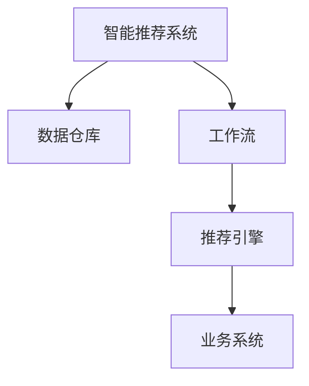

                 

# 智能推荐系统在工作流中的集成

## 1. 背景介绍

### 1.1 问题由来
智能推荐系统(RRSS, Recommender System)是一种信息过滤技术，旨在根据用户的历史行为、偏好和兴趣，推荐最相关的产品、内容或服务。它广泛应用于电商、媒体、社交网络、金融等行业，显著提升了用户体验和运营效率。例如，亚马逊通过推荐系统为用户推荐个性化商品，提升购买转化率和客单价；Netflix利用推荐系统推送用户喜欢的影视剧，增加用户粘性；微信新闻推送个性化文章，增强用户停留时间。

但传统的推荐系统多以独立模块的形式嵌入到应用中，往往只能处理短期的用户行为，难以形成连贯的画像，且推荐效果很大程度上依赖于数据质量。如何构建更加灵活、智能的推荐系统，成为当前研究者及从业者亟需解决的问题。

### 1.2 问题核心关键点
随着人工智能技术的发展，基于人工智能的推荐系统正在成为新的趋势。其中，基于神经网络的推荐模型，能够处理高维稀疏数据，捕捉用户历史行为之间的复杂关联，学习到更加多样化的推荐策略，实现智能推荐。但同时，如何将智能推荐系统更好地集成到业务流程中，使其能持续地、动态地为用户提供个性化服务，仍然是一个关键问题。

**本节重点探讨：**如何将智能推荐系统集成到工作流中，通过系统化、自动化、实时化的方式，提升推荐系统的精准度和用户满意度。

## 2. 核心概念与联系

### 2.1 核心概念概述

为更好地理解智能推荐系统在工作流中的应用，本节将介绍几个密切相关的核心概念：

- **智能推荐系统(Recommender System, RRSS)**：根据用户历史行为和属性，为用户推荐感兴趣的物品。推荐系统可以基于协同过滤、矩阵分解、深度学习等多种技术。
- **工作流(Workflow)**：由一系列可执行的任务、活动、操作、规则等组成的有序流程，用于实现特定业务目标。工作流在企业信息化建设中得到了广泛应用，涵盖办公、生产、研发等多个领域。
- **推荐引擎(Recommendation Engine)**：作为推荐系统的核心组件，负责接收用户查询请求，生成推荐结果，输出到应用展示。推荐引擎可以是基于规则的、基于记忆的或基于算法的。
- **数据仓库(Data Warehouse)**：用于集中存储和管理业务数据，支持历史数据分析和实时查询。数据仓库在推荐系统中承担着数据存储和查询的重要角色。
- **业务系统(Business System)**：承载推荐系统的业务应用平台，提供与用户交互的界面，实现业务逻辑和推荐引擎的集成。

这些核心概念之间的逻辑关系可以通过以下Mermaid流程图来展示：



这个流程图展示了大语言模型的核心概念及其之间的关系：

1. 智能推荐系统通过数据仓库获取用户行为数据和物品特征数据。
2. 通过推荐引擎对数据进行处理，学习用户和物品的隐含特征，并生成推荐结果。
3. 业务系统集成推荐引擎，将推荐结果嵌入到具体应用场景中，实现个性化推荐。
4. 工作流系统对推荐过程进行监控和调度，确保推荐服务稳定可靠。

## 3. 核心算法原理 & 具体操作步骤
### 3.1 算法原理概述

智能推荐系统的工作原理可简要概括为：通过收集和分析用户行为数据，学习用户偏好，预测用户可能感兴趣的新物品，并及时反馈给用户。核心算法包括协同过滤、矩阵分解、深度学习等。

协同过滤（Collaborative Filtering, CF）是一种基于用户和物品相似度的推荐算法。通过分析用户和物品的历史评分数据，计算用户和物品的相似度，并推测用户对新物品的评分，从而推荐相关物品。协同过滤算法分为基于用户的CF和基于物品的CF两种类型。

矩阵分解（Matrix Factorization, MF）是一种基于矩阵的推荐算法。通过将用户-物品评分矩阵分解为用户特征矩阵和物品特征矩阵，通过奇异值分解（SVD）或基于梯度的优化方法，学习用户和物品的隐含特征，从而生成推荐结果。

深度学习（Deep Learning, DL）是一种基于神经网络的推荐算法。通过多层神经网络对用户行为数据和物品特征数据进行建模，捕捉数据中的非线性关系，从而提高推荐系统的泛化能力和准确性。深度学习推荐算法主要包括基于循环神经网络（RNN）的推荐模型和基于卷积神经网络（CNN）的推荐模型。

### 3.2 算法步骤详解

基于上述三种核心算法的智能推荐系统，通常包括以下几个关键步骤：

**Step 1: 数据预处理**

1. 数据采集：从业务系统采集用户行为数据和物品特征数据，存储到数据仓库中。
2. 数据清洗：对数据进行去重、去噪、缺失值处理，确保数据质量。
3. 数据归一化：将数据进行归一化处理，避免不同特征之间数值差异过大，影响推荐结果。

**Step 2: 特征工程**

1. 特征提取：从用户行为数据和物品特征数据中提取有效的特征，如用户ID、物品ID、评分、点击时间、浏览时间等。
2. 特征选择：通过特征选择算法，筛选出最具有区分力的特征，提升模型的泛化能力。
3. 特征增强：对特征进行增强，如对时间特征进行滑动窗口处理，增加数据的时序性。

**Step 3: 模型训练**

1. 模型选择：选择合适的推荐算法，如协同过滤、矩阵分解、深度学习等。
2. 模型参数设置：设置模型超参数，如学习率、正则化参数、网络结构等。
3. 模型训练：利用数据仓库中的历史数据，对推荐模型进行训练，最小化预测误差。

**Step 4: 推荐引擎优化**

1. 嵌入优化：对模型进行优化，提升模型的实时性和准确性。如引入缓存技术，对模型进行压缩和剪枝，减少计算量和内存占用。
2. 并行优化：通过并行计算，提升模型的处理速度，支持大规模用户请求。如引入分布式计算框架，如Hadoop、Spark等。
3. 实时优化：通过实时数据处理技术，保证推荐结果的时效性和及时性。如引入流处理框架，如Storm、Flink等。

**Step 5: 工作流集成**

1. 接口设计：定义API接口，实现推荐引擎与业务系统的集成。
2. 任务调度：利用工作流系统，实现推荐任务的调度和管理。如使用流程编排工具，如Jenkins、Kubernetes等。
3. 监控告警：对推荐过程进行实时监控，设置告警阈值，确保系统稳定运行。如引入监控工具，如Prometheus、Grafana等。

**Step 6: 业务集成**

1. 应用嵌入：将推荐引擎嵌入到具体应用中，实现个性化推荐功能。如在电商网站中，嵌入商品推荐模块。
2. 交互优化：优化推荐交互方式，提升用户体验。如通过A/B测试，评估推荐结果的点击率、转化率等指标。
3. 反馈收集：收集用户反馈信息，持续优化推荐策略。如通过用户满意度调查，改进推荐算法和模型。

### 3.3 算法优缺点

基于上述三种核心算法的智能推荐系统，具有以下优点：

1. 推荐精准度高：通过深度学习和矩阵分解算法，能够捕捉用户历史行为之间的复杂关联，推荐效果更加精准。
2. 鲁棒性强：协同过滤算法具有较好的鲁棒性，能够处理高维稀疏数据，避免因数据缺失导致的推荐失效。
3. 可扩展性好：通过并行优化和分布式计算，推荐引擎能够处理大规模用户请求，具有良好的可扩展性。
4. 实时性高：通过实时数据处理技术，推荐引擎能够快速响应用户请求，提升用户体验。

但同时，这些算法也存在以下局限性：

1. 数据需求大：协同过滤和深度学习算法需要大量高质量的历史数据，数据采集和存储成本较高。
2. 冷启动问题：推荐算法对新用户和新物品的推荐效果较差，需要进行相应的冷启动优化。
3. 推荐单调性：推荐算法容易陷入推荐模式，产生单调性，推荐结果过于单一。
4. 模型复杂度高：深度学习算法的模型结构复杂，训练和推理时间较长。
5. 系统维护难度大：智能推荐系统涉及多个模块和组件，系统维护和管理难度较大。

## 4. 数学模型和公式 & 详细讲解 & 举例说明

### 4.1 数学模型构建

本节将使用数学语言对智能推荐系统的工作原理进行更加严格的刻画。

设推荐系统有 $N$ 个用户，$M$ 个物品，$U \times M$ 的评分矩阵 $R$。用户对物品的评分表示为 $R_{ui}$，其中 $u$ 为用户ID，$i$ 为物品ID，$R_{ui} \in [1,5]$ 表示用户对物品的评分，$R_{ui} = 0$ 表示用户未评分该物品。

定义用户特征向量 $\boldsymbol{x}_u$ 和物品特征向量 $\boldsymbol{y}_i$，其中 $x_{uj}$ 为第 $u$ 用户对第 $j$ 特征的评分，$y_{ij}$ 为第 $i$ 物品对第 $j$ 特征的评分。

假设推荐模型为 $\boldsymbol{\theta}$ 参数化的线性函数 $f(\boldsymbol{x}_u, \boldsymbol{y}_i, \boldsymbol{\theta})$。则推荐模型定义为：

$$
f(\boldsymbol{x}_u, \boldsymbol{y}_i, \boldsymbol{\theta}) = \boldsymbol{\theta}^T \cdot (\boldsymbol{x}_u \otimes \boldsymbol{y}_i)
$$

其中 $\otimes$ 为 Kronecker 乘积。

根据上述定义，推荐模型对用户 $u$ 物品 $i$ 的推荐评分可以表示为：

$$
\hat{R}_{ui} = f(\boldsymbol{x}_u, \boldsymbol{y}_i, \boldsymbol{\theta})
$$

### 4.2 公式推导过程

以下我们以协同过滤和矩阵分解算法为例，推导推荐模型的损失函数及其优化方法。

**协同过滤算法**：假设协同过滤算法采用用户-物品矩阵分解（User-Item Matrix Factorization, UIMF）的方式，将评分矩阵 $R$ 分解为两个低秩矩阵 $X$ 和 $Y$，其中 $X$ 表示用户特征矩阵，$Y$ 表示物品特征矩阵。推荐模型的优化目标是最小化预测误差：

$$
\min_{X,Y} \sum_{ui} (R_{ui} - \boldsymbol{x}_u^T \boldsymbol{y}_i)^2
$$

其中 $R_{ui} - \boldsymbol{x}_u^T \boldsymbol{y}_i$ 表示预测评分与真实评分的差异。

**矩阵分解算法**：假设矩阵分解算法采用奇异值分解（SVD）的方式，将评分矩阵 $R$ 分解为三个矩阵 $U, \Sigma, V^T$，其中 $U$ 和 $V$ 表示用户特征矩阵和物品特征矩阵，$\Sigma$ 表示奇异值矩阵。推荐模型的优化目标是最小化预测误差：

$$
\min_{U,V,\Sigma} \sum_{ui} (R_{ui} - U_uV_i^T\Sigma)^2
$$

其中 $R_{ui} - U_uV_i^T\Sigma$ 表示预测评分与真实评分的差异。

对上述优化问题，可以使用梯度下降算法求解，得到最优参数 $\boldsymbol{\theta}$。

### 4.3 案例分析与讲解

以电商网站的推荐系统为例，对协同过滤和矩阵分解算法进行案例分析。

**协同过滤算法**：电商网站收集了用户的浏览、购买、评分等行为数据，将用户和物品分别表示为特征向量，构建评分矩阵 $R$。使用协同过滤算法，对用户和物品特征向量进行矩阵分解，学习出用户特征矩阵 $X$ 和物品特征矩阵 $Y$，然后计算用户 $u$ 物品 $i$ 的推荐评分 $\hat{R}_{ui} = \boldsymbol{x}_u^T \boldsymbol{y}_i$。

**矩阵分解算法**：电商网站同样收集了用户的浏览、购买、评分等行为数据，构建评分矩阵 $R$。使用矩阵分解算法，将评分矩阵 $R$ 分解为三个矩阵 $U, \Sigma, V^T$，然后计算用户 $u$ 物品 $i$ 的推荐评分 $\hat{R}_{ui} = U_uV_i^T\Sigma$。

在得到推荐评分后，电商网站根据评分对物品进行排序，推荐给用户。同时，电商网站还使用并行计算和缓存技术，提高推荐引擎的实时性和处理能力。

## 5. 项目实践：代码实例和详细解释说明

### 5.1 开发环境搭建

在进行智能推荐系统开发前，我们需要准备好开发环境。以下是使用Python进行TensorFlow开发的环境配置流程：

1. 安装Anaconda：从官网下载并安装Anaconda，用于创建独立的Python环境。

2. 创建并激活虚拟环境：
```bash
conda create -n tf-env python=3.8 
conda activate tf-env
```

3. 安装TensorFlow：根据CUDA版本，从官网获取对应的安装命令。例如：
```bash
conda install tensorflow tensorflow-gpu -c conda-forge -c pypi
```

4. 安装其他必要工具包：
```bash
pip install pandas numpy matplotlib sklearn tensorflow-estimator tf-estimator
```

完成上述步骤后，即可在`tf-env`环境中开始智能推荐系统开发。

### 5.2 源代码详细实现

以下是一个简单的智能推荐系统代码实现，使用TensorFlow和Keras框架。

```python
import tensorflow as tf
from tensorflow.keras.layers import Input, Dense, Embedding, Concatenate, Dot, Reshape
from tensorflow.keras.models import Model

# 定义模型输入
user_input = Input(shape=(N_features,))
item_input = Input(shape=(M_features,))

# 定义用户和物品的特征嵌入层
user_embedding = Embedding(N_users, D_users, input_length=U_length)(user_input)
item_embedding = Embedding(N_items, D_items, input_length=I_length)(item_input)

# 定义用户和物品的特征向量和
user_vector = Dense(D_users, activation='relu')(user_embedding)
item_vector = Dense(D_items, activation='relu')(item_embedding)

# 定义用户和物品的特征向量的点积
vector_dot = Dot(axes=[2, 2])([user_vector, item_vector])

# 定义用户和物品的特征向量的拼接
vector_concat = Concatenate()([user_vector, item_vector, vector_dot])

# 定义推荐评分模型
recommendation = Dense(1, activation='relu')(vector_concat)

# 定义推荐模型
model = Model(inputs=[user_input, item_input], outputs=[recommendation])

# 编译模型
model.compile(optimizer='adam', loss='mse', metrics=['mae'])

# 训练模型
model.fit(x=[train_user, train_item], y=train_score, epochs=100, batch_size=128, validation_split=0.2)

# 预测评分
predicted_score = model.predict([test_user, test_item])
```

### 5.3 代码解读与分析

让我们再详细解读一下关键代码的实现细节：

**用户和物品输入层**：
- `Input`层用于定义模型的输入，接收用户和物品的特征向量。

**特征嵌入层**：
- `Embedding`层用于将用户和物品的特征向量转换为密集向量，表示用户和物品的隐含特征。

**特征向量和**：
- `Dense`层用于将用户和物品的特征向量进行线性变换，得到用户和物品的特征向量。

**用户和物品的点积**：
- `Dot`层用于计算用户和物品特征向量的点积，表示用户和物品之间的相似度。

**用户和物品的特征向量的拼接**：
- `Concatenate`层用于将用户和物品的特征向量以及点积拼接，形成更高维度的特征向量。

**推荐评分模型**：
- `Dense`层用于将拼接后的特征向量进行线性变换，得到推荐评分。

**推荐模型**：
- `Model`层用于定义推荐模型，接收用户和物品的特征向量作为输入，输出推荐评分。

**模型编译**：
- `compile`方法用于编译模型，设置优化器、损失函数、评估指标等。

**模型训练**：
- `fit`方法用于训练模型，接收训练数据和标签，进行模型参数的优化。

**预测评分**：
- `predict`方法用于对测试数据进行评分预测。

**推荐结果**：
- 根据预测评分，对物品进行排序，推荐给用户。

可以看到，TensorFlow和Keras框架使得智能推荐系统的代码实现变得简洁高效。开发者可以将更多精力放在数据处理、模型改进等高层逻辑上，而不必过多关注底层的实现细节。

## 6. 实际应用场景

### 6.1 电商平台推荐

电商平台的推荐系统能够根据用户浏览、购买、评分等行为，为用户推荐个性化商品。例如，亚马逊根据用户的历史浏览记录，推荐可能感兴趣的商品，增加购买转化率和客单价。京东利用推荐系统，为每一位用户推荐最合适的商品，提升用户体验和运营效率。

在技术实现上，电商平台可以采集用户行为数据，构建评分矩阵 $R$，使用协同过滤或矩阵分解算法，对评分矩阵进行分解，学习用户和物品的特征向量，得到推荐评分。电商平台还可以通过A/B测试，评估推荐结果的点击率、转化率等指标，持续优化推荐算法。

### 6.2 新闻推荐系统

新闻推荐系统能够根据用户阅读行为，为用户推荐相关文章和内容。例如，今日头条根据用户对不同文章的点击、收藏、分享等行为，推荐相关主题和作者，增加用户粘性和阅读时间。网易新闻利用推荐系统，为用户推荐个性化文章，提高用户停留时间和推荐准确性。

在技术实现上，新闻推荐系统可以采集用户行为数据，构建评分矩阵 $R$，使用协同过滤或矩阵分解算法，对评分矩阵进行分解，学习用户和物品的特征向量，得到推荐评分。新闻推荐系统还可以通过A/B测试，评估推荐结果的用户满意度，持续优化推荐算法。

### 6.3 音乐推荐系统

音乐推荐系统能够根据用户听歌行为，为用户推荐个性化歌曲和专辑。例如，网易云音乐根据用户对不同歌曲的播放、收藏、评论等行为，推荐相关歌曲和专辑，提升用户粘性和满意度。QQ音乐利用推荐系统，为用户推荐个性化歌曲，增加用户活跃度和推荐准确性。

在技术实现上，音乐推荐系统可以采集用户行为数据，构建评分矩阵 $R$，使用协同过滤或矩阵分解算法，对评分矩阵进行分解，学习用户和物品的特征向量，得到推荐评分。音乐推荐系统还可以通过A/B测试，评估推荐结果的播放率、收藏率等指标，持续优化推荐算法。

### 6.4 未来应用展望

随着智能推荐系统技术的不断发展，基于智能推荐系统的应用场景将更加多样和深入。例如：

1. **个性化视频推荐**：视频网站可以根据用户观看行为，为用户推荐个性化视频。例如，YouTube利用推荐系统，为用户推荐相关视频，增加用户观看时间和平台粘性。
2. **智能广告推荐**：广告平台可以根据用户浏览行为，为用户推荐相关广告。例如，Google AdWords利用推荐系统，为用户推荐相关广告，增加广告投放的转化率和点击率。
3. **社交网络推荐**：社交网络可以根据用户互动行为，为用户推荐相关好友和内容。例如，Facebook利用推荐系统，为用户推荐相关好友和内容，增加用户互动和平台粘性。

随着推荐系统技术的不断进步，相信智能推荐系统将在更多领域得到应用，为各行各业带来新的商业价值。

## 7. 工具和资源推荐

### 7.1 学习资源推荐

为了帮助开发者系统掌握智能推荐系统的工作原理和实践技巧，这里推荐一些优质的学习资源：

1. 《推荐系统实战》系列博文：由大模型技术专家撰写，深入浅出地介绍了推荐系统的理论基础和实践技巧。
2 《深度学习与推荐系统》课程：斯坦福大学开设的深度学习课程，涵盖推荐系统的经典算法和前沿技术。
3 《Recommender Systems: Algorithms and Applications》书籍：详细介绍了推荐系统的算法和应用场景，适合深入学习。
4 《Apache Spark for Recommendation Systems》书籍：介绍了使用Spark进行推荐系统开发的实战技巧，适合工程实践。
5 《Coursera Recommendation Systems Specialization》课程：涵盖推荐系统的多个模块，从推荐算法到工程实践，全面学习。

通过对这些资源的学习实践，相信你一定能够快速掌握智能推荐系统的工作原理和实践技巧，并用于解决实际的业务问题。

### 7.2 开发工具推荐

高效的开发离不开优秀的工具支持。以下是几款用于智能推荐系统开发的常用工具：

1. TensorFlow：基于Python的开源深度学习框架，灵活动态的计算图，适合深度学习推荐算法开发。
2. PyTorch：基于Python的开源深度学习框架，动态图，灵活易于使用，适合研究和实验。
3. Keras：基于Python的开源深度学习框架，提供高层次的API，适合快速原型开发。
4. TensorFlow Estimator：TensorFlow的高级API，提供了更方便的模型构建和管理功能。
5. Spark：Apache开发的分布式计算框架，适合大规模数据处理和推荐系统开发。

合理利用这些工具，可以显著提升智能推荐系统的开发效率，加快创新迭代的步伐。

### 7.3 相关论文推荐

智能推荐系统的发展源于学界的持续研究。以下是几篇奠基性的相关论文，推荐阅读：

1. 《Collaborative Filtering for Implicit Feedback Datasets》：介绍协同过滤算法的经典方法。
2 《Matrix Factorization Techniques for Recommender Systems》：介绍矩阵分解算法的经典方法。
3 《Deep Collaborative Filtering》：介绍深度学习算法在推荐系统中的应用。
4 《Federated Matrix Factorization for Recommendation Systems》：介绍联邦学习在推荐系统中的应用。
5 《Adversarial Training for Recommender Systems》：介绍对抗训练在推荐系统中的应用。

这些论文代表了大模型推荐系统的发展脉络。通过学习这些前沿成果，可以帮助研究者把握学科前进方向，激发更多的创新灵感。

## 8. 总结：未来发展趋势与挑战

### 8.1 总结

本文对基于智能推荐系统的项目实践进行了全面系统的介绍。首先阐述了智能推荐系统的工作原理和关键技术，明确了推荐系统在业务流程中的核心作用。其次，从原理到实践，详细讲解了协同过滤、矩阵分解、深度学习等推荐算法的数学模型和实现流程，给出了具体的代码实现实例。同时，本文还广泛探讨了智能推荐系统在电商、新闻、音乐等多个行业领域的应用场景，展示了推荐系统技术的广阔前景。此外，本文精选了智能推荐系统的各类学习资源，力求为读者提供全方位的技术指引。

通过本文的系统梳理，可以看到，基于智能推荐系统的技术正在成为各行业数字化转型的重要工具。推荐系统通过数据驱动，实现精准的个性化推荐，大幅提升了用户体验和运营效率。未来，随着推荐系统技术的不断发展，基于智能推荐系统的应用场景将更加多样和深入，为各行各业带来新的商业价值。

### 8.2 未来发展趋势

展望未来，智能推荐系统的发展趋势主要包括以下几个方面：

1. **自动化推荐**：推荐系统将实现更智能化的自动化推荐，通过学习用户行为、物品属性和场景变化，自动生成推荐策略，无需人工干预。自动化推荐技术有望大幅提升推荐系统的精准度和效率。
2. **跨平台推荐**：推荐系统将实现跨平台、跨应用的协同推荐，整合不同应用场景的数据，为用户提供更全面、连贯的推荐服务。跨平台推荐技术有望打破数据孤岛，实现更泛化的推荐效果。
3. **实时推荐**：推荐系统将实现实时推荐，通过流处理技术，实时捕捉用户行为变化，动态调整推荐策略。实时推荐技术有望提升推荐系统的时效性和响应速度。
4. **个性化推荐**：推荐系统将实现更个性化的推荐，通过学习用户行为、物品属性和用户画像，生成更加精准的推荐结果。个性化推荐技术有望提升推荐系统的用户体验和用户粘性。
5. **推荐多样性**：推荐系统将实现更多样化的推荐，通过引入推荐样本多样性约束，提升推荐结果的多样性和新颖性，避免推荐结果过于单一。多样性推荐技术有望提升推荐系统的推荐效果和用户满意度。
6. **推荐可解释性**：推荐系统将实现更可解释的推荐，通过引入推荐过程的解释机制，让用户理解推荐系统的决策逻辑，增强系统的可信性和透明度。推荐可解释性技术有望提升推荐系统的用户体验和用户信任。

这些发展趋势凸显了智能推荐系统技术的广阔前景。这些方向的探索发展，必将引领智能推荐系统技术迈向更高的台阶，为各行业带来新的商业价值。

### 8.3 面临的挑战

尽管智能推荐系统技术已经取得了显著进展，但在迈向更加智能化、普适化应用的过程中，它仍面临诸多挑战：

1. **数据质量瓶颈**：推荐系统依赖高质量的数据，数据的缺失、噪声和偏差会影响推荐效果。如何提升数据质量，优化数据采集和清洗流程，仍是一个关键问题。
2. **推荐模型复杂**：推荐系统模型复杂度高，训练和推理时间较长，需要高效的模型压缩和加速技术。如何优化模型结构，提升系统的实时性和处理能力，仍是一个挑战。
3. **冷启动问题**：推荐系统对新用户和新物品的推荐效果较差，需要进行冷启动优化。如何提升推荐系统的初期性能，缩短冷启动时间，仍是一个问题。
4. **推荐单调性**：推荐系统容易陷入推荐模式，产生单调性，推荐结果过于单一。如何引入推荐多样性和新颖性，提升推荐结果的多样性和新颖性，仍是一个挑战。
5. **系统维护难度大**：推荐系统涉及多个模块和组件，系统维护和管理难度较大。如何实现系统的模块化和自动化，提升系统的维护和扩展能力，仍是一个挑战。
6. **推荐偏见**：推荐系统容易学习到用户行为和物品属性的偏见，产生歧视性推荐。如何消除推荐偏见，提升系统的公平性和公正性，仍是一个挑战。

这些挑战凸显了智能推荐系统技术的发展难点。需要持续的技术创新和多方协同，才能克服这些挑战，实现智能推荐系统的普适化和智能化。

### 8.4 研究展望

面向未来，智能推荐系统的研究将从以下几个方面继续推进：

1. **多模态推荐**：引入多模态数据，如视觉、语音、地理位置等，提升推荐系统的全面性和连贯性。多模态推荐技术有望实现更精准的推荐效果。
2. **推荐算法融合**：将多种推荐算法融合，提升推荐系统的泛化能力和鲁棒性。算法融合推荐技术有望实现更可靠的推荐效果。
3. **推荐系统集成**：将推荐系统与其他系统集成，如知识图谱、决策系统等，提升推荐系统的决策质量和应用效果。系统集成推荐技术有望实现更高效的推荐结果。
4. **推荐模型压缩**：通过模型压缩技术，提升推荐系统的实时性和处理能力。推荐模型压缩技术有望实现更高效的推荐结果。
5. **推荐系统演化**：通过推荐系统的持续学习，实现系统的动态演化和适应性提升。推荐系统演化技术有望实现更智能化的推荐效果。
6. **推荐系统伦理**：通过推荐系统的伦理设计，确保推荐系统的公平性、公正性和安全性。推荐系统伦理技术有望实现更可信的推荐结果。

这些研究方向将推动智能推荐系统技术迈向更高的台阶，为各行业带来新的商业价值。未来，智能推荐系统将实现更智能化的推荐效果，成为各行业数字化转型的重要工具。

## 9. 附录：常见问题与解答

**Q1: 智能推荐系统如何实现实时推荐？**

A: 实时推荐系统通过流处理技术，实现对用户行为数据的实时采集和处理，动态调整推荐策略。可以使用如Apache Kafka、Apache Storm等流处理框架，将用户行为数据实时写入数据流，通过流处理引擎进行实时处理和推荐。同时，可以通过引入缓存技术，提高推荐引擎的处理速度和实时性。

**Q2: 推荐系统的冷启动问题如何解决？**

A: 冷启动问题可以通过以下几种方式解决：
1. 基于物品的CF：利用物品属性和用户历史行为，对新用户和新物品进行推荐。例如，电商网站可以基于物品的标签和描述，对新用户进行推荐。
2. 基于内容的CF：利用物品特征和新用户的历史行为，对新物品进行推荐。例如，视频网站可以基于视频标签和用户历史观看记录，对新视频进行推荐。
3. 基于混合的CF：结合物品CF和用户CF，对新用户和新物品进行推荐。例如，新闻网站可以基于用户阅读记录和物品主题标签，对新用户和新文章进行推荐。
4. 基于协同的CF：利用用户-物品的评分矩阵，对新用户和新物品进行推荐。例如，社交网络可以基于用户好友和物品评分矩阵，对新用户和新内容进行推荐。

**Q3: 推荐系统的推荐单调性如何解决？**

A: 推荐单调性可以通过以下几种方式解决：
1. 引入多样性约束：在推荐算法中引入多样性约束，限制推荐结果的数量和相似度。例如，电商网站可以引入多样性约束，限制推荐结果的数量和相似度，增加推荐结果的多样性。
2. 引入新颖性约束：在推荐算法中引入新颖性约束，限制推荐结果的年龄和热度。例如，音乐平台可以引入新颖性约束，限制推荐结果的年龄和热度，增加推荐结果的新颖性。
3. 引入协同过滤：在推荐算法中引入协同过滤，利用用户-物品评分矩阵，提升推荐结果的多样性。例如，社交网络可以引入协同过滤，利用用户-物品评分矩阵，提升推荐结果的多样性。
4. 引入深度学习：在推荐算法中引入深度学习，提升推荐结果的多样性和新颖性。例如，电商网站可以引入深度学习，提升推荐结果的多样性和新颖性。

**Q4: 推荐系统的推荐可解释性如何实现？**

A: 推荐系统的推荐可解释性可以通过以下几种方式实现：
1. 引入规则约束：在推荐算法中引入规则约束，增加推荐过程的透明度和可解释性。例如，电商网站可以引入规则约束，限制推荐结果的年龄和热度，增加推荐过程的透明度和可解释性。
2. 引入特征分析：在推荐算法中引入特征分析，解释推荐结果的生成原因。例如，新闻网站可以引入特征分析，解释推荐结果的生成原因，增加推荐过程的透明度和可解释性。
3. 引入可视化工具：在推荐算法中引入可视化工具，展示推荐过程和推荐结果。例如，视频平台可以引入可视化工具，展示推荐过程和推荐结果，增加推荐过程的透明度和可解释性。
4. 引入解释机制：在推荐算法中引入解释机制，解释推荐结果的生成原因。例如，社交网络可以引入解释机制，解释推荐结果的生成原因，增加推荐过程的透明度和可解释性。

这些方法有助于提升推荐系统的可解释性和可信性，让用户更好地理解推荐过程和推荐结果。

**Q5: 推荐系统的数据质量如何保证？**

A: 推荐系统的数据质量可以通过以下几种方式保证：
1. 数据采集：通过合理的数据采集策略，确保数据的多样性和全面性。例如，电商网站可以采集用户浏览、购买、评分等行为数据，确保数据的多样性和全面性。
2. 数据清洗：对数据进行去重、去噪、缺失值处理，确保数据的质量。例如，新闻网站可以对用户阅读记录进行清洗，去除重复和缺失数据。
3. 数据增强：通过数据增强技术，提升数据的多样性和全面性。例如，音乐平台可以对用户听歌记录进行增强，引入新的音乐类型和播放方式。
4. 数据验证：通过数据验证技术，检查数据的质量和完整性。例如，视频平台可以对用户观看记录进行验证，确保数据的质量和完整性。
5. 数据融合：通过数据融合技术，整合不同数据源的数据，提升数据的多样性和全面性。例如，社交网络可以整合用户好友和物品标签数据，提升数据的多样性和全面性。

通过以上措施，可以有效提升推荐系统的数据质量，确保推荐效果的精准性和可靠性。

**Q6: 推荐系统的推荐结果如何评估？**

A: 推荐系统的推荐结果可以通过以下几种方式评估：
1. 用户满意度：通过用户满意度调查，评估推荐结果的用户体验和满意度。例如，电商网站可以通过用户满意度调查，评估推荐结果的用户体验和满意度。
2. 点击率：通过点击率指标，评估推荐结果的用户行为和互动。例如，新闻网站可以通过点击率指标，评估推荐结果的用户行为和互动。
3. 转化率：通过转化率指标，评估推荐结果的用户购买和转化。例如，电商网站可以通过转化率指标，评估推荐结果的用户购买和转化。
4. 相关性：通过相关性指标，评估推荐结果的准确性和相关性。例如，视频平台可以通过相关性指标，评估推荐结果的准确性和相关性。
5. 多样性：通过多样性指标，评估推荐结果的多样性和新颖性。例如，音乐平台可以通过多样性指标，评估推荐结果的多样性和新颖性。

通过以上指标，可以有效评估推荐系统的推荐效果，持续优化推荐算法和模型。

**Q7: 推荐系统的推荐系统集成有哪些方式？**

A: 推荐系统的推荐系统集成可以通过以下几种方式实现：
1. API接口集成：通过定义API接口，实现推荐系统与其他系统之间的集成。例如，电商网站可以通过API接口，实现推荐系统与购物车系统的集成。
2. 数据共享集成：通过数据共享，实现推荐系统与其他系统之间的集成。例如，视频平台可以通过数据共享，实现推荐系统与视频平台系统的集成。
3. 流程编排集成：通过流程编排工具，实现推荐系统与其他系统之间的集成。例如，金融平台可以通过流程编排工具，实现推荐系统与金融系统的集成。
4. 协同推荐集成：通过协同推荐，实现推荐系统与其他系统之间的集成。例如，社交网络可以通过协同推荐，实现推荐系统与好友推荐系统的集成。
5. 知识图谱集成：通过知识图谱，实现推荐系统与其他系统之间的集成。例如，电商网站可以通过知识图谱，实现推荐系统与商品信息系统的集成。

通过以上方式，可以实现推荐系统与其他系统之间的集成，提升推荐系统的应用效果和业务价值。

**Q8: 推荐系统的推荐系统演化有哪些方式？**

A: 推荐系统的推荐系统演化可以通过以下几种方式实现：
1. 持续学习：通过持续学习机制，实现推荐系统的动态演化和适应性提升。例如，电商网站可以通过持续学习，实现推荐系统的动态演化和适应性提升。
2. 知识图谱：通过知识图谱，实现推荐系统的动态演化和适应性提升。例如，金融平台可以通过知识图谱，实现推荐系统的动态演化和适应性提升。
3. 混合推荐：通过混合推荐技术，提升推荐系统的泛化能力和鲁棒性。例如，视频平台可以通过混合推荐技术，提升推荐系统的泛化能力和鲁棒性。
4. 多模态推荐：通过多模态推荐技术，提升推荐系统的全面性和连贯性。例如，社交网络可以通过多模态推荐技术，提升推荐系统的全面性和连贯性。
5. 实时推荐：通过实时推荐技术，提升推荐系统的时效性和响应速度。例如，新闻网站可以通过实时推荐技术，提升推荐系统的时效性和响应速度。

通过以上方式，可以有效提升推荐系统的动态演化和适应性，确保推荐系统的持续优化和性能提升。

