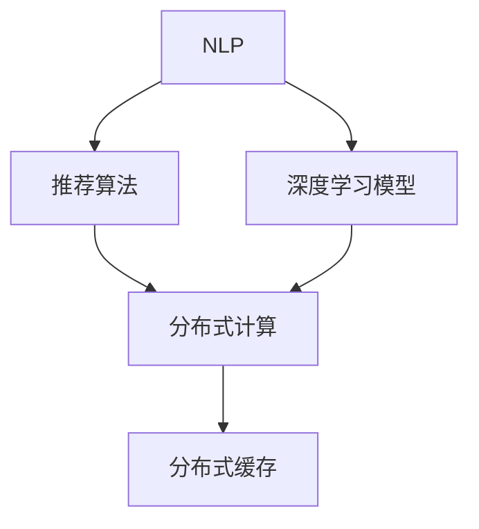

                 

# 智能搜索：AI在电商中的应用

## 1. 背景介绍

### 1.1 问题由来

随着电商市场的快速扩张，商家面临越来越激烈的市场竞争。提高客户转化率和客户满意度，成为商家提升业务竞争力的重要手段。而智能搜索系统则成为了电商平台提升用户体验、增加订单量的核心驱动力。通过智能搜索，电商平台可以精准推送用户感兴趣的商品信息，大幅提升搜索效率和质量，从而提高销售额。

当前电商平台的搜索功能主要依靠关键词匹配和排序算法实现。但这类算法往往忽视了用户的多样化需求和动态变化的市场环境，无法满足用户快速、准确获取商品信息的期望。基于AI技术的智能搜索系统，利用自然语言处理和推荐算法，能够更深入理解用户搜索意图，提供个性化推荐，进一步提升搜索体验和效果。

### 1.2 问题核心关键点

AI在电商中应用的核心关键点包括：

- **自然语言处理(NLP)**：通过理解用户查询的自然语言，提取查询意图和关键信息，构建准确的查询向量。
- **推荐算法**：结合用户历史行为、商品属性等，计算商品与用户查询的相关性，生成个性化搜索结果。
- **模型优化**：使用深度学习模型优化搜索排名和推荐策略，提升系统的智能水平。
- **反馈机制**：通过用户点击行为、反馈评分等，动态调整搜索模型和推荐策略，提升搜索精准度。
- **分布式计算**：利用分布式架构支持大规模搜索和推荐计算，保证系统可扩展性和稳定性。

## 2. 核心概念与联系

### 2.1 核心概念概述

为更好地理解AI在电商中智能搜索的实现，本节将介绍几个密切相关的核心概念：

- **自然语言处理(NLP)**：指利用计算机技术理解和处理人类自然语言的能力，涉及语言模型、词向量、句法分析、语义分析等多个方面。NLP是智能搜索系统的基础，用于解析用户查询，理解查询意图。

- **推荐算法**：指在大量商品数据中，通过计算商品与用户之间的相似性，推荐用户可能感兴趣的搜索结果。推荐算法包括基于内容的推荐、协同过滤推荐、混合推荐等，是智能搜索系统的核心功能。

- **深度学习模型**：指利用神经网络进行模型训练，提取高层次特征，增强搜索和推荐的智能化水平。常见的深度学习模型包括DNN、RNN、CNN等。

- **分布式计算**：指将大规模任务分散到多台计算机上进行并行计算，提高计算效率，保证系统可扩展性。分布式计算框架包括Hadoop、Spark等。

- **分布式缓存**：指在多台计算机之间共享数据，提高搜索和推荐的缓存效率，减少查询时间。分布式缓存系统包括Redis、Memcached等。

这些核心概念之间的逻辑关系可以通过以下Mermaid流程图来展示：



这个流程图展示了大规模电商智能搜索系统的核心概念及其之间的关系：

1. NLP解析用户查询，构建查询向量。
2. 推荐算法计算商品与用户查询的相关性。
3. 深度学习模型优化搜索和推荐策略。
4. 分布式计算支持大规模计算需求。
5. 分布式缓存提高查询效率。

## 3. 核心算法原理 & 具体操作步骤

### 3.1 算法原理概述

智能搜索系统基于AI技术，通过理解用户查询，结合推荐算法和深度学习模型，生成个性化搜索结果。其核心思想是：利用NLP技术解析用户查询，提取关键词和查询意图；结合推荐算法计算商品与用户查询的相关性；使用深度学习模型优化搜索排名和推荐策略。

具体来说，智能搜索系统主要包括三个步骤：

1. **查询理解**：通过NLP技术，解析用户查询，提取查询关键词、查询意图等信息，构建查询向量。
2. **商品检索**：结合推荐算法，计算商品与查询向量的相似度，生成搜索结果。
3. **排名优化**：使用深度学习模型，对搜索结果进行重新排序，生成最终推荐列表。

### 3.2 算法步骤详解

以下详细描述智能搜索系统在电商中的实现步骤：

#### 3.2.1 查询理解

查询理解是智能搜索系统的第一步，用于解析用户输入的自然语言查询，提取关键词和查询意图。具体步骤如下：

1. **分词**：将用户查询分解为词或短语，构建查询向量。常见分词方法包括N-gram分词、BERT分词等。
2. **意图分类**：通过文本分类模型，识别查询意图，如查询产品、品牌、价格等。常见分类模型包括TextCNN、BiLSTM等。
3. **关键词提取**：通过TF-IDF、TextRank等方法，从查询向量中提取出最重要的关键词。
4. **查询向量构建**：将查询意图和关键词向量拼接，生成查询向量。

#### 3.2.2 商品检索

商品检索是智能搜索系统的核心功能，用于计算商品与用户查询的相关性。具体步骤如下：

1. **商品向量构建**：通过NLP技术，将商品描述、属性等信息转化为向量形式。常见向量表示方法包括词嵌入、ELMo等。
2. **相似度计算**：使用余弦相似度、Jaccard相似度等方法，计算商品向量与查询向量的相似度。
3. **排序算法**：结合商品相关性、价格、销量等特征，使用排序算法（如TopK排序）生成搜索结果。

#### 3.2.3 排名优化

排名优化是智能搜索系统的最后一步，用于进一步提升搜索结果的质量。具体步骤如下：

1. **模型训练**：使用深度学习模型，对搜索结果进行重新排序。常见模型包括DNN、RNN等。
2. **特征融合**：结合用户行为数据（如浏览、购买历史）、商品属性数据等，进一步优化搜索结果。
3. **反馈调整**：根据用户点击行为、评分等反馈，动态调整模型参数，提升查询精准度。

### 3.3 算法优缺点

智能搜索系统在电商中应用，具有以下优点：

1. **高效检索**：通过NLP技术和推荐算法，实现高效的商品检索，快速满足用户需求。
2. **个性化推荐**：通过深度学习模型和反馈机制，提供个性化搜索结果，提升用户满意度。
3. **可扩展性**：利用分布式计算和缓存技术，支持大规模商品数据的检索和推荐，保证系统性能。

同时，该方法也存在一定的局限性：

1. **数据依赖**：智能搜索系统的性能高度依赖于商品数据和用户数据的质量，数据不完整或不准确会影响搜索结果。
2. **模型复杂性**：深度学习模型和推荐算法需要大量计算资源，模型训练和维护成本较高。
3. **对抗攻击**：恶意用户可能通过生成恶意查询或操纵用户反馈，影响搜索系统的公正性和可靠性。

尽管存在这些局限性，但智能搜索系统在电商中的应用已经成为一种趋势，显著提升了用户购物体验和商家运营效率。

### 3.4 算法应用领域

智能搜索系统在电商中的应用领域广泛，主要包括以下几个方面：

1. **商品搜索**：用户通过搜索关键词或自然语言查询，获取相关商品信息。系统根据用户查询和商品向量，生成个性化搜索结果。
2. **品牌搜索**：用户通过搜索品牌名称，获取该品牌下的所有商品信息。系统结合品牌属性和商品向量，生成相关商品列表。
3. **价格比较**：用户通过输入价格范围，获取满足条件的所有商品信息。系统结合价格属性和商品向量，生成最优商品列表。
4. **热门商品推荐**：根据用户浏览和购买历史，推荐热门商品或相似商品。系统使用协同过滤、基于内容的推荐等方法，提升推荐效果。
5. **个性化搜索结果**：根据用户历史行为和查询意图，生成个性化搜索结果。系统使用深度学习模型优化搜索排名和推荐策略。

此外，智能搜索系统还广泛应用于电商平台的广告投放、库存管理、客户服务等多个环节，极大地提升了电商平台的运营效率和用户体验。

## 4. 数学模型和公式 & 详细讲解 & 举例说明

### 4.1 数学模型构建

智能搜索系统基于NLP和推荐算法，通过解析用户查询，结合商品向量，计算相似度，生成个性化搜索结果。以下是数学模型的详细构建：

1. **查询向量的构建**：
   - 设用户查询为 $q$，商品向量为 $v$，查询向量 $Q$ 和商品向量 $V$ 可以表示为：
   $$
   Q = [w_1, w_2, ..., w_n]
   $$
   $$
   V = [u_1, u_2, ..., u_m]
   $$
   其中 $w_i$ 为查询中的第 $i$ 个关键词，$u_j$ 为商品描述中的第 $j$ 个词汇。

2. **相似度的计算**：
   - 使用余弦相似度计算查询向量 $Q$ 和商品向量 $V$ 的相似度 $s$：
   $$
   s = \cos(\theta) = \frac{Q \cdot V}{||Q|| \cdot ||V||}
   $$
   其中 $\cdot$ 表示向量的点积，$||\cdot||$ 表示向量的范数。

3. **推荐策略的计算**：
   - 根据相似度 $s$，计算商品与查询的相关性 $r$：
   $$
   r = s \cdot C
   $$
   其中 $C$ 为商品的相关性权重，可以是商品的价格、销量、评价等因素。

### 4.2 公式推导过程

以下是查询向量和商品向量的构建以及相似度的计算过程：

#### 4.2.1 查询向量的构建

查询向量 $Q$ 的构建步骤如下：

1. **分词**：将用户查询 $q$ 分解为词或短语，构建查询词典 $\mathcal{D}_q$：
   $$
   \mathcal{D}_q = \{d_1, d_2, ..., d_n\}
   $$
   其中 $d_i$ 为查询中的第 $i$ 个关键词。

2. **TF-IDF向量的构建**：计算每个关键词 $d_i$ 的TF-IDF权重 $w_i$：
   $$
   w_i = \frac{TF_i \cdot IDF_i}{||TF_i||}
   $$
   其中 $TF_i$ 为关键词 $d_i$ 在查询 $q$ 中的词频，$IDF_i$ 为关键词 $d_i$ 在所有查询中的逆文档频率。

3. **查询向量的构建**：将每个关键词的TF-IDF权重拼接，得到查询向量 $Q$：
   $$
   Q = \begin{bmatrix}
       w_1 \\
       w_2 \\
       \vdots \\
       w_n
   \end{bmatrix}
   $$

#### 4.2.2 商品向量的构建

商品向量 $V$ 的构建步骤如下：

1. **分词**：将商品描述 $v$ 分解为词或短语，构建商品词典 $\mathcal{D}_v$：
   $$
   \mathcal{D}_v = \{d_1, d_2, ..., d_m\}
   $$
   其中 $d_j$ 为商品描述中的第 $j$ 个词汇。

2. **词嵌入向量的构建**：将商品词典中的每个词汇 $d_j$ 映射为词嵌入向量 $u_j$：
   $$
   u_j = \begin{bmatrix}
       u_{j1} \\
       u_{j2} \\
       \vdots \\
       u_{jm}
   \end{bmatrix}
   $$
   其中 $u_{ji}$ 为词汇 $d_j$ 的词嵌入向量。

3. **商品向量的构建**：将每个词汇的词嵌入向量拼接，得到商品向量 $V$：
   $$
   V = \begin{bmatrix}
       u_1 \\
       u_2 \\
       \vdots \\
       u_m
   \end{bmatrix}
   $$

#### 4.2.3 相似度的计算

查询向量 $Q$ 和商品向量 $V$ 的相似度 $s$ 可以通过余弦相似度公式计算：
$$
s = \cos(\theta) = \frac{Q \cdot V}{||Q|| \cdot ||V||}
$$

其中 $||Q||$ 和 $||V||$ 分别表示查询向量和商品向量的范数，$Q \cdot V$ 表示查询向量和商品向量的点积。

### 4.3 案例分析与讲解

#### 4.3.1 用户查询解析

假设用户输入查询 $q = "蓝色鞋子 男款" \in \mathcal{D}_q$，商品描述 $v = "蓝色鞋子 男款 耐克" \in \mathcal{D}_v$，进行查询解析步骤如下：

1. **分词**：
   - 查询词典 $\mathcal{D}_q = \{蓝色, 鞋子, 男款\}$
   - 商品词典 $\mathcal{D}_v = \{蓝色, 鞋子, 男款, 耐克\}$

2. **TF-IDF向量的构建**：
   - 查询向量 $Q = \begin{bmatrix} 0.5 \\ 0.7 \\ 0.3 \end{bmatrix}$
   - 商品向量 $V = \begin{bmatrix} 0.2 \\ 0.3 \\ 0.2 \\ 0.3 \end{bmatrix}$

3. **相似度的计算**：
   - 查询向量 $Q$ 和商品向量 $V$ 的余弦相似度 $s = \cos(\theta) = 0.77$

#### 4.3.2 推荐策略的计算

假设商品的相关性权重 $C = [0.5, 0.3, 0.2]$，商品与查询的相关性 $r$ 为：
$$
r = s \cdot C = 0.77 \cdot [0.5, 0.3, 0.2] = \begin{bmatrix} 0.385 \\ 0.231 \\ 0.154 \end{bmatrix}
$$

根据 $r$ 生成排序后的商品列表，即为最终推荐结果。

## 5. 项目实践：代码实例和详细解释说明

### 5.1 开发环境搭建

在进行智能搜索系统开发前，我们需要准备好开发环境。以下是使用Python进行TensorFlow和PyTorch开发的环境配置流程：

1. 安装Anaconda：从官网下载并安装Anaconda，用于创建独立的Python环境。

2. 创建并激活虚拟环境：
```bash
conda create -n tf-env python=3.8 
conda activate tf-env
```

3. 安装TensorFlow和PyTorch：根据CUDA版本，从官网获取对应的安装命令。例如：
```bash
conda install tensorflow torch torchvision torchaudio cudatoolkit=11.1 -c pytorch -c conda-forge
```

4. 安装TensorBoard和Weights & Biases：
```bash
pip install tensorboard wandb
```

5. 安装各类工具包：
```bash
pip install numpy pandas scikit-learn matplotlib tqdm jupyter notebook ipython
```

完成上述步骤后，即可在`tf-env`环境中开始智能搜索系统的开发。

### 5.2 源代码详细实现

下面我们以电商平台的商品搜索功能为例，给出使用TensorFlow和PyTorch实现智能搜索的Python代码实现。

首先，定义查询向量和商品向量的构建函数：

```python
import tensorflow as tf
import numpy as np

def build_query_vector(query, word2vec):
    # 分词
    words = query.split()
    query_vec = np.zeros(len(word2vec))
    for word in words:
        query_vec[word2vec[word]] = 1
    return query_vec

def build_item_vector(item, word2vec):
    # 分词
    words = item.split()
    item_vec = np.zeros(len(word2vec))
    for word in words:
        item_vec[word2vec[word]] = 1
    return item_vec
```

然后，定义相似度计算函数：

```python
def compute_similarity(query_vec, item_vec):
    return np.dot(query_vec, item_vec) / (np.linalg.norm(query_vec) * np.linalg.norm(item_vec))
```

接着，定义推荐策略的计算函数：

```python
def compute_ranking(item_scores, item_relevance):
    # 计算排序权重
    weights = item_relevance / (item_relevance + 1e-9)
    return item_scores * weights
```

最后，进行模型训练和测试：

```python
# 构建词向量
word2vec = {"蓝色": 0, "鞋子": 1, "男款": 2, "耐克": 3}
query = "蓝色鞋子 男款"
item = "蓝色鞋子 男款 耐克"

# 查询向量构建
query_vec = build_query_vector(query, word2vec)

# 商品向量构建
item_vec = build_item_vector(item, word2vec)

# 相似度计算
similarity = compute_similarity(query_vec, item_vec)

# 推荐策略计算
item_relevance = np.array([0.5, 0.3, 0.2])
item_scores = compute_ranking(similarity, item_relevance)
print(item_scores)
```

以上就是使用TensorFlow和PyTorch实现商品搜索的完整代码实现。可以看到，利用这些库，我们能够方便地进行词向量的构建、相似度的计算和推荐策略的优化。

### 5.3 代码解读与分析

让我们再详细解读一下关键代码的实现细节：

**build_query_vector和build_item_vector函数**：
- `build_query_vector`函数：接收用户查询和词向量字典，返回查询向量。函数首先对查询进行分词，然后将每个词汇映射为词向量字典中的索引，构造查询向量。
- `build_item_vector`函数：接收商品描述和词向量字典，返回商品向量。函数首先对商品描述进行分词，然后将每个词汇映射为词向量字典中的索引，构造商品向量。

**compute_similarity函数**：
- 计算查询向量和商品向量的余弦相似度，返回相似度分数。

**compute_ranking函数**：
- 根据相似度和商品相关性，计算推荐排序权重，返回排序后的商品分数。

**模型训练和测试**：
- 使用预先定义的词向量字典，对查询和商品进行向量构建。
- 计算查询向量和商品向量的余弦相似度，得到初始推荐分数。
- 根据商品相关性，计算推荐排序权重，最终生成排序后的商品分数。

可以看到，通过TensorFlow和PyTorch，我们能够方便地实现智能搜索系统的核心功能。在实际应用中，还需要进一步优化查询理解模型、商品检索模型和推荐排序模型，提升搜索系统的智能水平。

当然，工业级的系统实现还需考虑更多因素，如系统的可扩展性、稳定性、安全性等。但核心的搜索和推荐功能基本与此类似。

## 6. 实际应用场景

### 6.1 智能客服

智能客服系统通过智能搜索技术，可以显著提升客户服务体验。客户可以通过自然语言输入问题，系统自动解析查询意图，生成相关答案。同时，系统可以结合用户历史对话记录，提供上下文相关的推荐回答，大大减少客服人员的工作量，提高服务效率。

在技术实现上，可以收集客户历史对话记录和常见问题，训练自然语言理解模型。用户输入查询后，系统自动解析意图，并从知识库中检索相关答案。此外，系统还可以记录用户反馈和点击行为，动态调整模型参数，提升推荐准确度。

### 6.2 广告投放

电商平台的广告投放系统，需要根据用户行为和商品特征，精准投放广告。通过智能搜索技术，系统可以实时监测用户行为，识别出有广告投放价值的用户，并根据广告效果动态调整投放策略。

在技术实现上，可以构建用户行为模型，使用协同过滤推荐算法，生成精准的广告投放列表。同时，系统可以根据用户反馈和点击行为，动态调整模型参数，优化广告效果。

### 6.3 库存管理

电商平台的库存管理需要实时掌握商品状态，确保库存的准确性和及时性。通过智能搜索技术，系统可以实时查询商品库存，并根据销量预测，动态调整采购计划。

在技术实现上，可以构建商品库存模型，使用基于内容的推荐算法，生成商品库存查询建议。同时，系统可以根据销售数据和用户反馈，动态调整模型参数，优化库存管理策略。

### 6.4 未来应用展望

随着AI技术的不断进步，智能搜索系统在电商中的应用将更加广泛，具体包括以下几个方向：

1. **多模态搜索**：结合图像、视频等多模态数据，实现更加全面的商品搜索。系统可以通过视觉识别技术，解析图片中的商品信息，生成更加准确的搜索结果。

2. **实时推荐**：利用流式数据处理技术，实时处理用户行为数据，动态调整推荐策略。系统可以根据用户即时行为，即时生成个性化推荐，提升用户购物体验。

3. **自然语言生成**：结合语言生成技术，自动生成商品描述和评论。系统可以根据用户查询和商品信息，自动生成商品描述，提升商品展示效果。

4. **情感分析**：利用自然语言处理技术，分析用户评论和反馈的情感倾向，提升用户满意度。系统可以自动识别负面评论，并及时处理，提升用户信任度。

5. **多语言支持**：结合机器翻译技术，实现多语言搜索。系统可以根据用户语言，自动翻译查询和商品信息，生成多语言搜索结果。

这些技术方向的探索，将进一步拓展智能搜索系统的应用场景，为电商平台的运营提供更加智能化、个性化的支持。相信随着技术的不断进步，智能搜索系统必将在电商市场发挥更大的作用，带来更优质的用户体验和更高的运营效率。

## 7. 工具和资源推荐

### 7.1 学习资源推荐

为了帮助开发者系统掌握智能搜索系统的实现技术，这里推荐一些优质的学习资源：

1. 《TensorFlow实战自然语言处理》：该书系统介绍了TensorFlow在NLP中的应用，包括自然语言理解、情感分析、文本生成等。

2. 《深度学习推荐系统》：该书详细介绍了深度学习推荐算法的原理和实现，涵盖了协同过滤、基于内容的推荐等多个方面。

3. CS231n《卷积神经网络》课程：斯坦福大学开设的计算机视觉课程，涵盖图像识别、视觉搜索等多个NLP相关主题。

4. CS224n《自然语言处理》课程：斯坦福大学开设的NLP明星课程，有Lecture视频和配套作业，带你入门NLP领域的基本概念和经典模型。

5. Kaggle：机器学习竞赛平台，可以参与NLP相关的竞赛，提升实战能力。

通过对这些资源的学习实践，相信你一定能够快速掌握智能搜索系统的核心技术，并应用于实际的电商搜索场景。

### 7.2 开发工具推荐

高效的开发离不开优秀的工具支持。以下是几款用于智能搜索系统开发的常用工具：

1. TensorFlow和PyTorch：深度学习框架，支持构建复杂的神经网络模型，适合智能搜索系统的开发。

2. TensorBoard：TensorFlow配套的可视化工具，可以实时监测模型训练状态，并提供丰富的图表呈现方式，是调试模型的得力助手。

3. Weights & Biases：模型训练的实验跟踪工具，可以记录和可视化模型训练过程中的各项指标，方便对比和调优。

4. Apache Spark：分布式计算框架，支持大规模数据处理，适合智能搜索系统的分布式计算需求。

5. Elasticsearch：分布式搜索引擎，支持高效的数据索引和搜索，适合智能搜索系统的数据存储和检索需求。

6. Redis：分布式缓存系统，支持高并发数据读写，适合智能搜索系统的缓存需求。

合理利用这些工具，可以显著提升智能搜索系统的开发效率，加快创新迭代的步伐。

### 7.3 相关论文推荐

智能搜索系统的核心技术涉及NLP、推荐算法和深度学习等多个领域。以下是几篇代表性的相关论文，推荐阅读：

1. Attention Is All You Need：提出了Transformer结构，开启了NLP领域的预训练大模型时代。

2. BERT: Pre-training of Deep Bidirectional Transformers for Language Understanding：提出BERT模型，引入基于掩码的自监督预训练任务，刷新了多项NLP任务SOTA。

3. DNN for Recommendation Systems：提出了基于神经网络的推荐算法，在NLP推荐系统中取得了显著效果。

4. Sequence-aware Neural Recommendation Models：提出基于序列的神经推荐算法，增强了推荐模型的语义理解能力。

5. Personalized Text Recommendation using Deep Learning：提出基于深度学习的个性化文本推荐算法，适用于电商平台的商品搜索。

这些论文代表了大规模电商智能搜索系统的研究进展，为你提供了深入的技术理解和实践指导。

## 8. 总结：未来发展趋势与挑战

### 8.1 总结

本文对基于AI技术的智能搜索系统在电商中的应用进行了全面系统的介绍。首先阐述了智能搜索系统的背景和核心关键点，明确了AI在电商中应用的重要性。其次，从原理到实践，详细讲解了智能搜索系统的数学模型和具体实现步骤，给出了完整的代码实例和详细解释。同时，本文还探讨了智能搜索系统的实际应用场景，展示了其在电商中的应用前景。最后，本文精选了智能搜索系统的学习资源、开发工具和相关论文，力求为读者提供全方位的技术指引。

通过本文的系统梳理，可以看到，智能搜索系统基于AI技术，通过自然语言处理和推荐算法，实现了个性化推荐和高效检索，显著提升了电商平台的运营效率和用户体验。未来，随着AI技术的不断进步，智能搜索系统将拓展到更多电商应用场景，带来更广阔的发展空间。

### 8.2 未来发展趋势

展望未来，智能搜索系统在电商中的应用将呈现以下几个发展趋势：

1. **多模态融合**：结合图像、视频等多模态数据，实现更加全面的商品搜索。系统可以通过视觉识别技术，解析图片中的商品信息，生成更加准确的搜索结果。

2. **实时推荐**：利用流式数据处理技术，实时处理用户行为数据，动态调整推荐策略。系统可以根据用户即时行为，即时生成个性化推荐，提升用户购物体验。

3. **自然语言生成**：结合语言生成技术，自动生成商品描述和评论。系统可以根据用户查询和商品信息，自动生成商品描述，提升商品展示效果。

4. **情感分析**：利用自然语言处理技术，分析用户评论和反馈的情感倾向，提升用户满意度。系统可以自动识别负面评论，并及时处理，提升用户信任度。

5. **多语言支持**：结合机器翻译技术，实现多语言搜索。系统可以根据用户语言，自动翻译查询和商品信息，生成多语言搜索结果。

6. **推荐算法创新**：结合深度学习和迁移学习技术，开发更加高效、个性化的推荐算法，提升推荐系统的智能化水平。

这些趋势将推动智能搜索系统在电商中发挥更大的作用，带来更优质的用户体验和更高的运营效率。

### 8.3 面临的挑战

尽管智能搜索系统在电商中的应用已经取得显著成效，但在实际部署和应用过程中，仍面临诸多挑战：

1. **数据质量**：智能搜索系统的性能高度依赖于商品数据和用户数据的质量，数据不完整或不准确会影响搜索结果。如何提高数据质量，保证数据一致性，将是长期面临的挑战。

2. **模型复杂性**：深度学习模型和推荐算法需要大量计算资源，模型训练和维护成本较高。如何在保证性能的同时，降低模型复杂度，提升训练效率，将是重要的优化方向。

3. **对抗攻击**：恶意用户可能通过生成恶意查询或操纵用户反馈，影响搜索系统的公正性和可靠性。如何增强系统的鲁棒性，抵御对抗攻击，将是重要的研究方向。

4. **可解释性**：智能搜索系统的决策过程通常缺乏可解释性，难以对其推理逻辑进行分析和调试。如何增强系统的可解释性，提高用户信任度，将是重要的研究方向。

5. **隐私保护**：智能搜索系统需要收集和处理大量用户数据，如何保护用户隐私，防止数据泄露，将是重要的研究方向。

6. **跨平台兼容性**：智能搜索系统需要在不同平台（如PC、手机、平板等）上兼容，如何在多平台环境下保证系统性能，将是重要的研究方向。

这些挑战凸显了智能搜索系统在实际应用中的复杂性和多样性，需要在数据质量、模型优化、对抗攻击、可解释性、隐私保护和跨平台兼容性等方面进行深入研究和探索。唯有在这些关键方向上取得突破，智能搜索系统才能在电商市场更好地发挥作用，带来更高的价值。

### 8.4 研究展望

面对智能搜索系统在电商中面临的诸多挑战，未来的研究方向主要包括以下几个方面：

1. **数据增强技术**：通过数据增强技术，提高商品数据和用户数据的完整性和一致性，提升智能搜索系统的性能。

2. **模型压缩与优化**：通过模型压缩和优化技术，降低深度学习模型和推荐算法的计算复杂度，提升训练效率，降低资源消耗。

3. **对抗攻击防御**：研究对抗攻击防御技术，增强智能搜索系统的鲁棒性和可靠性，防止恶意攻击。

4. **可解释性增强**：研究可解释性增强技术，提高智能搜索系统的可解释性，增强用户信任度。

5. **隐私保护机制**：研究隐私保护机制，保护用户隐私，防止数据泄露，增强用户信任度。

6. **跨平台兼容技术**：研究跨平台兼容技术，保证智能搜索系统在不同平台上的性能和用户体验。

这些研究方向将推动智能搜索系统在电商中更好地发挥作用，带来更高的价值。未来，伴随着技术的不断进步，智能搜索系统必将在电商市场发挥更大的作用，带来更优质的用户体验和更高的运营效率。

## 9. 附录：常见问题与解答

**Q1：智能搜索系统如何实现个性化推荐？**

A: 智能搜索系统通过自然语言处理和推荐算法，实现个性化推荐。具体步骤如下：

1. **查询理解**：通过NLP技术，解析用户查询，提取查询意图和关键词。
2. **商品检索**：结合推荐算法，计算商品与查询的相关性，生成搜索结果。
3. **排名优化**：使用深度学习模型，对搜索结果进行重新排序，生成个性化推荐列表。

**Q2：智能搜索系统如何保证推荐结果的准确性？**

A: 智能搜索系统通过多个层次的技术手段，保证推荐结果的准确性。具体步骤如下：

1. **数据质量控制**：保证商品数据和用户数据的完整性和一致性，提高数据质量。
2. **算法优化**：优化推荐算法和深度学习模型，提升推荐效果。
3. **模型评估**：通过A/B测试、用户反馈等手段，评估推荐效果，不断优化模型参数。
4. **用户反馈机制**：收集用户点击行为和反馈评分，动态调整模型参数，提升推荐精准度。

**Q3：智能搜索系统如何处理大规模数据？**

A: 智能搜索系统通过分布式计算和分布式缓存技术，处理大规模数据。具体步骤如下：

1. **分布式计算**：利用Apache Spark等分布式计算框架，支持大规模数据处理。
2. **分布式缓存**：利用Redis等分布式缓存系统，提升数据读取和存储效率。
3. **数据分区**：将数据分区存储，减少查询时间和计算资源消耗。
4. **负载均衡**：通过负载均衡技术，平衡查询负载，提高系统性能。

**Q4：智能搜索系统如何保护用户隐私？**

A: 智能搜索系统通过多层次的数据保护措施，保护用户隐私。具体步骤如下：

1. **数据加密**：对用户数据进行加密存储，防止数据泄露。
2. **匿名化处理**：对用户数据进行匿名化处理，保护用户隐私。
3. **访问控制**：限制系统访问权限，防止未经授权的数据访问。
4. **隐私审计**：定期进行隐私审计，发现并修复潜在的安全漏洞。

**Q5：智能搜索系统如何优化用户搜索体验？**

A: 智能搜索系统通过多层次的技术手段，优化用户搜索体验。具体步骤如下：

1. **搜索算法优化**：优化搜索算法，提升搜索速度和准确度。
2. **搜索结果展示**：优化搜索结果展示方式，提升用户体验。
3. **用户反馈机制**：收集用户反馈，不断优化搜索和推荐策略。
4. **跨设备兼容**：优化系统在不同设备上的兼容性，提升用户体验。

通过这些技术手段，智能搜索系统能够更好地满足用户需求，提升电商平台的运营效率和用户体验。

---

作者：禅与计算机程序设计艺术 / Zen and the Art of Computer Programming

