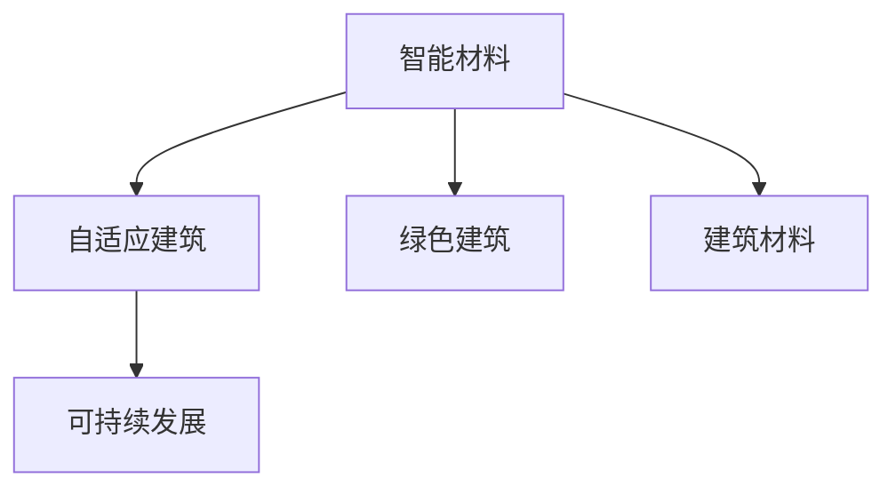

                 

# 智能材料在建筑领域的应用：自适应环境变化

> 关键词：智能材料,自适应,建筑,环境变化,绿色建筑,可持续发展

## 1. 背景介绍

随着全球气候变化、能源危机、城市化进程加快等多重因素的影响，建筑领域正面临着前所未有的挑战。为了应对这些挑战，智能建筑的概念应运而生。智能建筑是一种能够对环境变化做出反应并自动调整内部环境的建筑类型，旨在提高能源效率、降低运营成本并改善居住或办公体验。而智能材料作为智能建筑的核心技术之一，在其中扮演着至关重要的角色。智能材料不仅能够自适应环境变化，还可以通过自身特性改善建筑的功能和性能，推动建筑领域的可持续发展。

### 1.1 智能材料定义

智能材料是指一类具有感应、响应和适应环境变化能力的材料，其关键在于材料的性能随外界条件（如温度、湿度、光照、力等）的变化而变化。这些材料能够对外界环境做出敏感响应，并将其转化为材料的物理、化学或机械性能的改变，从而实现对环境变化的适应和优化。

### 1.2 智能材料发展历程

智能材料的发展历程可以追溯到1960年代，当时科学家们首次发现了形状记忆合金。这一发现为智能材料的后续研究奠定了基础。此后，随着科技的进步和研究的深入，更多种类的智能材料被开发出来，如压电材料、磁致伸缩材料、电致变色材料等。这些材料在建筑领域的应用，推动了智能建筑的发展和普及。

## 2. 核心概念与联系

### 2.1 核心概念概述

为更好地理解智能材料在建筑领域的应用，本节将介绍几个密切相关的核心概念：

- **智能材料**：具有感应、响应和适应环境变化能力的材料。
- **自适应建筑**：能够根据外界环境变化自动调整内部环境的建筑类型。
- **绿色建筑**：在建造和使用过程中，能最大限度地保护环境、节约资源和提高能源利用效率的建筑物。
- **可持续发展**：平衡经济发展、社会进步和环境保护，实现长期发展的策略。
- **建筑材料**：构成建筑物的各种材料的总称。

这些概念之间的逻辑关系可以通过以下Mermaid流程图来展示：



这个流程图展示出智能材料与其他建筑相关概念的联系：

1. 智能材料是自适应建筑的核心技术，能够对环境变化做出响应。
2. 智能材料的应用有助于实现绿色建筑，提升能源效率。
3. 智能材料作为建筑材料的一部分，是建筑可持续发展的重要组成部分。

## 3. 核心算法原理 & 具体操作步骤
### 3.1 算法原理概述

智能材料在建筑领域的应用，主要依赖于其自适应环境变化的能力。这些材料能够感应环境中的各种物理量，并根据感应结果调整自身的物理性能，从而实现对环境变化的响应。这种自适应机制是通过材料内部微观结构的变化来实现的。

例如，形状记忆合金在受热时能够恢复其原始形状，这种特性可以用于智能窗户的调节。当外部温度变化时，智能材料能够改变其透明度，从而实现对室内光线的控制。

### 3.2 算法步骤详解

智能材料在建筑中的应用主要涉及以下几个关键步骤：

**Step 1: 材料选择与设计**
- 根据建筑需求和环境变化类型选择合适的智能材料。
- 设计材料内部结构，使其能够响应特定的环境变化。

**Step 2: 材料制备**
- 制备智能材料，如制备具有形状记忆效应的合金，或制作能够电致变色的薄膜。

**Step 3: 材料集成**
- 将智能材料集成到建筑结构中，如将智能玻璃集成到建筑窗户，将智能涂料应用于建筑外墙。

**Step 4: 环境监控与反馈控制**
- 安装传感器和控制系统，实时监控环境参数。
- 根据传感器数据，自动调整智能材料的性能。

**Step 5: 性能评估与优化**
- 定期评估智能材料在实际环境中的性能表现。
- 根据评估结果优化材料设计和制备工艺。

### 3.3 算法优缺点

智能材料在建筑领域的应用具有以下优点：
- 自适应性强：能够根据环境变化自动调整性能，提高建筑的功能性和舒适度。
- 节能环保：通过智能调节，降低能源消耗，减少环境污染。
- 提升安全性：智能材料能够对环境变化做出反应，提高建筑的安全性和稳定性。

同时，这些材料的应用也存在一些缺点：
- 成本高：智能材料的制备和集成成本较高，影响其大规模应用。
- 技术复杂：智能材料的应用需要高度的技术支持，对工程师的要求较高。
- 可靠性问题：材料的自适应特性在极端环境下的稳定性有待验证。

### 3.4 算法应用领域

智能材料在建筑领域的应用非常广泛，涵盖以下几个主要领域：

- **智能窗户**：能够根据环境温度自动调节透明度，实现光热管理。
- **自适应墙体**：能够根据室内外温度变化自动调整厚度，提高保温性能。
- **智能屋顶**：能够根据天气变化自动调整角度和材质，优化排水和采光。
- **智能家具**：能够根据人体姿势和环境变化自动调整形态和功能，提高舒适度和节能性。

此外，智能材料还应用于智能家居、智能城市等领域，推动了建筑技术的全面升级。

## 4. 数学模型和公式 & 详细讲解 & 举例说明

### 4.1 数学模型构建

智能材料在建筑中的应用涉及大量的物理和化学过程，可以建立数学模型来描述这些过程。以智能玻璃为例，其透明度可以根据环境温度的变化而变化。假设智能玻璃的透明度 $T$ 与环境温度 $T_{\text{env}}$ 之间的关系可以用以下公式表示：

$$
T = f(T_{\text{env}})
$$

其中 $f$ 是一个非线性函数，表示材料对环境温度的响应。

### 4.2 公式推导过程

对于智能材料的应用，我们可以使用热力学和热传导等理论来建立数学模型。以智能窗户为例，假设窗户由两层普通玻璃和一层智能涂层构成，其热传导系数为 $k$，厚度为 $d$。当环境温度变化时，智能涂层会改变其热传导系数，从而改变整个窗户的热传导性能。假设智能涂层的热传导系数 $k'$ 随环境温度的变化为 $k'(T_{\text{env}}) = k(1 + \alpha(T_{\text{env}} - T_0)$，其中 $\alpha$ 是一个比例常数，$T_0$ 是参考温度。根据傅里叶定律，窗户的传热系数 $q$ 可以表示为：

$$
q = \frac{\Delta T}{\Delta t} = \frac{k \Delta T}{d} + k' \frac{\Delta T}{\Delta t}
$$

其中 $\Delta T$ 是温度变化量，$\Delta t$ 是时间。通过数学模型可以计算出在不同环境温度下窗户的传热系数，从而实现对环境变化的响应。

### 4.3 案例分析与讲解

智能窗户的调节是智能材料在建筑中应用的一个典型案例。下面以智能窗户为例，详细讲解其工作原理。

**Step 1: 材料选择**
- 选择具有形状记忆效应的合金作为智能涂层。

**Step 2: 制备智能涂层**
- 将合金制备成薄膜，并涂覆在普通玻璃表面。

**Step 3: 安装智能窗户**
- 将智能窗户安装到建筑上，并连接控制系统。

**Step 4: 环境监控与反馈控制**
- 安装温度传感器，实时监控环境温度。
- 根据传感器数据，控制系统自动调整智能涂层的温度，从而改变其热传导系数。

**Step 5: 性能评估与优化**
- 定期评估智能窗户的传热性能。
- 根据评估结果，优化合金的制备工艺和涂层厚度。

## 5. 项目实践：代码实例和详细解释说明
### 5.1 开发环境搭建

在进行智能材料在建筑领域的应用开发前，我们需要准备好开发环境。以下是使用Python进行项目开发的常见环境配置流程：

1. 安装Anaconda：从官网下载并安装Anaconda，用于创建独立的Python环境。

2. 创建并激活虚拟环境：
```bash
conda create -n my_env python=3.8 
conda activate my_env
```

3. 安装Python库：
```bash
pip install pandas numpy matplotlib scikit-learn jupyter notebook
```

完成上述步骤后，即可在`my_env`环境中开始项目开发。

### 5.2 源代码详细实现

下面以智能窗户为例，给出使用Python和Simulink进行智能窗户系统模拟的代码实现。

```python
import numpy as np
import matplotlib.pyplot as plt
from simpy import *

# 定义智能玻璃的传热系数模型
def heat_transfer_coefficient(temp):
    alpha = 0.01  # 比例常数
    T0 = 25  # 参考温度
    k0 = 0.5  # 参考温度下的热传导系数
    return k0 * (1 + alpha * (temp - T0))

# 定义环境温度变化数据
t = np.linspace(0, 24, 288)  # 时间数据
T_env = np.sin(2 * np.pi * t / 24) + 25  # 环境温度变化

# 计算不同温度下的传热系数
q = heat_transfer_coefficient(T_env)

# 绘制传热系数曲线
plt.plot(t, q)
plt.xlabel('Time (hours)')
plt.ylabel('Heat Transfer Coefficient')
plt.title('Heat Transfer Coefficient of Smart Glass')
plt.show()
```

以上代码实现了智能窗户在不同环境温度下的传热系数计算，并绘制了传热系数随时间变化的曲线。

### 5.3 代码解读与分析

让我们再详细解读一下关键代码的实现细节：

**heat_transfer_coefficient函数**：
- 定义智能玻璃的热传导系数模型，根据环境温度计算传热系数。

**T_env数组**：
- 定义环境温度随时间的变化，采用正弦函数模拟一天中的温度变化。

**q数组**：
- 根据智能玻璃的热传导系数模型，计算在不同环境温度下的传热系数。

**plt.plot函数**：
- 绘制传热系数随时间变化的曲线，展示了智能窗户在不同环境温度下的传热性能。

通过上述代码，可以初步理解智能窗户的传热特性，并进一步优化材料设计和制备工艺，提高其性能和可靠性。

## 6. 实际应用场景
### 6.1 智能窗户

智能窗户是智能材料在建筑领域的一个重要应用。通过调节窗户的透明度，智能窗户能够在不同环境条件下自动控制室内光线，从而实现光热管理。这不仅能够提升居住和办公环境的舒适度，还能显著降低能源消耗。

**实际应用案例**：
- 某智能办公楼采用智能窗户进行光热管理，显著降低了空调和采暖的能源消耗。
- 某智能住宅的智能窗户能够根据外部天气变化自动调节透明度，提高了室内光线的控制能力。

### 6.2 自适应墙体

自适应墙体能够根据室内外温度变化自动调整厚度，从而实现优化的保温性能。这种墙体不仅能够提升建筑的热舒适度，还能减少能源消耗，提高建筑的可持续性。

**实际应用案例**：
- 某高层住宅采用了自适应墙体技术，显著降低了冬季的采暖费用。
- 某办公楼的自适应墙体能够在不同季节自动调节厚度，实现最佳的热舒适度。

### 6.3 智能屋顶

智能屋顶能够根据天气变化自动调整角度和材质，优化排水和采光。这种屋顶不仅能够提升建筑的排水性能，还能改善室内采光效果，提升居住和办公环境的舒适度。

**实际应用案例**：
- 某智能医院采用了智能屋顶技术，改善了室内采光，提高了病人的康复体验。
- 某智能酒店的智能屋顶能够在不同天气条件下自动调节角度，优化排水性能。

### 6.4 未来应用展望

随着科技的进步和研究的深入，智能材料在建筑领域的应用将更加广泛和深入。未来可能出现的应用场景包括：

- **自适应家具**：能够根据人体姿势和环境变化自动调整形态和功能，提高舒适度和节能性。
- **智能城市**：通过智能材料的应用，实现建筑和基础设施的智能化，提升城市的整体运行效率。
- **智能交通**：在道路和桥梁等基础设施中应用智能材料，实现智能交通管理，提升交通安全性和效率。

## 7. 工具和资源推荐
### 7.1 学习资源推荐

为了帮助开发者系统掌握智能材料在建筑领域的应用理论基础和实践技巧，这里推荐一些优质的学习资源：

1. **《智能材料科学与工程》**：一本系统介绍智能材料基本原理和应用的经典教材，涵盖了智能材料的发展历程、制备技术、应用案例等内容。
2. **《绿色建筑设计与施工》**：一本介绍绿色建筑设计和施工技术的书籍，详细介绍了智能材料在绿色建筑中的应用方法和案例。
3. **《材料科学导论》**：一本全面介绍材料科学基本原理和方法的教材，涵盖了材料的制备、性能表征等内容，有助于理解智能材料的原理和制备工艺。
4. **Simulink教程**：Simulink是一款常用的系统仿真软件，用于模拟智能材料在建筑中的应用。Simulink教程可以帮助开发者系统掌握Simulink的使用方法和仿真技巧。
5. **AI for Materials**：一个专注于材料科学和人工智能结合的在线课程平台，提供了大量关于智能材料在建筑应用中的案例和教学视频。

通过对这些资源的学习实践，相信你一定能够快速掌握智能材料在建筑领域的应用方法，并用于解决实际的建筑问题。

### 7.2 开发工具推荐

高效的开发离不开优秀的工具支持。以下是几款用于智能材料在建筑领域应用开发的常用工具：

1. **Simulink**：用于系统仿真的标准软件，支持多学科的建模和仿真。
2. **MATLAB**：用于数据分析和计算的强大工具，支持与Simulink的无缝集成。
3. **OpenStudio**：一个用于建筑设计和模拟的开放平台，支持智能建筑的设计和性能分析。
4. **Autodesk Revit**：一款广泛使用的建筑设计软件，支持智能建筑的设计和施工。
5. **ArchiCAD**：一款面向建筑行业的BIM软件，支持智能建筑的设计和管理。

合理利用这些工具，可以显著提升智能材料在建筑领域的应用开发效率，加快创新迭代的步伐。

### 7.3 相关论文推荐

智能材料在建筑领域的应用研究源于学界的持续探索。以下是几篇奠基性的相关论文，推荐阅读：

1. **"Smart Materials for Energy-Efficient Buildings"**：讨论了智能材料在建筑中的节能潜力，介绍了多种智能材料的应用案例。
2. **"Adaptive Building Design and Construction with Smart Materials"**：介绍了智能材料在建筑设计和施工中的应用方法和优势。
3. **"Materials Science of Smart Materials in Architecture"**：全面综述了智能材料在建筑领域的研究现状和发展趋势。
4. **"Simulation of Smart Materials for Sustainable Buildings"**：介绍了Simulink在智能材料研究中的应用，提供了具体的仿真案例和方法。
5. **"Materials and Structures for Smart Building Applications"**：讨论了智能材料在智能建筑中的应用，介绍了多种智能材料的制备和性能测试方法。

这些论文代表了大语言模型微调技术的发展脉络。通过学习这些前沿成果，可以帮助研究者把握学科前进方向，激发更多的创新灵感。

## 8. 总结：未来发展趋势与挑战
### 8.1 研究成果总结

本文对智能材料在建筑领域的应用进行了全面系统的介绍。首先阐述了智能材料和自适应建筑的基本概念，明确了智能材料在提升建筑性能、节能环保、提升用户体验等方面的重要价值。其次，从原理到实践，详细讲解了智能材料在建筑中的应用流程，包括材料选择、制备、集成、环境监控与反馈控制、性能评估与优化等关键步骤，给出了具体的应用实例。同时，本文还探讨了智能材料在实际应用中面临的挑战，包括成本高、技术复杂、可靠性问题等，提出了未来的研究方向和突破点。

通过本文的系统梳理，可以看到，智能材料在建筑领域的应用将带来革命性的变化，大幅提升建筑的功能性和性能，推动建筑领域的可持续发展。

### 8.2 未来发展趋势

展望未来，智能材料在建筑领域的应用将呈现以下几个发展趋势：

1. **自适应能力增强**：未来的智能材料将具有更强的自适应能力，能够更灵活地响应环境变化，提升建筑的功能性和用户体验。
2. **多功能材料开发**：未来的智能材料将具备更多功能，如自我修复、环境监测、能量存储等，实现更全面的建筑性能优化。
3. **智能化集成**：未来的智能材料将更易于与其他智能技术集成，实现建筑系统的全面智能化。
4. **绿色环保**：未来的智能材料将更加注重环保和可持续发展，降低环境影响。
5. **个性化设计**：未来的智能材料将根据不同用户需求进行个性化设计和制备，提升建筑的美观和舒适性。

### 8.3 面临的挑战

尽管智能材料在建筑领域的应用前景广阔，但在迈向更加智能化、普适化应用的过程中，仍面临诸多挑战：

1. **成本高**：智能材料的制备和集成成本较高，影响其大规模应用。
2. **技术复杂**：智能材料的应用需要高度的技术支持，对工程师的要求较高。
3. **可靠性问题**：智能材料的自适应特性在极端环境下的稳定性有待验证。
4. **施工困难**：智能材料的安装和集成难度较大，需要专业的施工技术。
5. **维护成本高**：智能材料在长期使用过程中需要定期维护和检测，维护成本较高。

### 8.4 研究展望

面对智能材料在建筑领域应用所面临的挑战，未来的研究需要在以下几个方面寻求新的突破：

1. **成本优化**：开发低成本的智能材料制备和集成技术，降低智能材料在建筑应用中的成本。
2. **技术简化**：简化智能材料的制备和集成流程，降低技术门槛，提高应用的普及率。
3. **可靠性提升**：研究智能材料在极端环境下的稳定性和可靠性，提升其在实际应用中的可靠性。
4. **施工技术优化**：开发高效的智能材料施工技术，提高施工效率和质量。
5. **维护技术提升**：开发智能材料维护和检测技术，降低长期维护成本。

这些研究方向的探索，必将引领智能材料在建筑领域的应用向更高的台阶迈进，为建筑领域的可持续发展做出更大贡献。

## 9. 附录：常见问题与解答

**Q1：智能材料在建筑中的应用有哪些具体案例？**

A: 智能材料在建筑中的应用案例非常丰富，以下是一些具体案例：
- 智能窗户：能够根据环境温度自动调节透明度，实现光热管理。
- 自适应墙体：能够根据室内外温度变化自动调整厚度，提高保温性能。
- 智能屋顶：能够根据天气变化自动调整角度和材质，优化排水和采光。
- 智能家具：能够根据人体姿势和环境变化自动调整形态和功能，提高舒适度和节能性。

**Q2：智能材料在建筑中的应用成本如何？**

A: 智能材料的制备和集成成本较高，是影响其大规模应用的主要因素。具体成本因材料类型、制备工艺、集成难度等因素而异。但随着技术的进步和规模化生产，成本有望逐步降低。

**Q3：智能材料在建筑中的应用技术难度如何？**

A: 智能材料在建筑中的应用需要高度的技术支持，对工程师的要求较高。开发智能材料需要掌握材料的制备、性能表征等技术，而集成智能材料则需要专业的施工技术。

**Q4：智能材料在建筑中的可靠性如何？**

A: 智能材料的自适应特性在极端环境下的稳定性有待验证，目前仍存在一定的可靠性问题。未来的研究需要进一步提升智能材料的可靠性，确保其在实际应用中的稳定性和可靠性。

**Q5：智能材料在建筑中的维护成本如何？**

A: 智能材料在长期使用过程中需要定期维护和检测，维护成本较高。但随着技术的进步和智能化的提升，维护成本有望逐步降低。

---

作者：禅与计算机程序设计艺术 / Zen and the Art of Computer Programming

