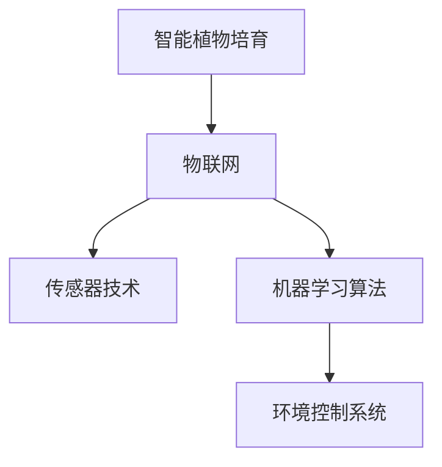

                 

# 智能植物培育创业：室内园艺的未来

> 关键词：智能植物培育, 室内园艺, 物联网, 机器学习, 环境控制系统, 自动化

## 1. 背景介绍

### 1.1 问题由来

随着全球人口的持续增长和城市化进程的加快，对农产品的需求日益增加。传统的户外农业面临土地资源紧缺、气候变化、环境污染等诸多挑战。因此，室内园艺成为一种可行的解决方案。室内园艺利用人工光照、温度控制和无土栽培等技术，可以在室内空间中进行高效率、高产量的农作物种植。

近年来，随着物联网(IoT)技术、传感器、机器学习等新兴技术的发展，智能植物培育系统得以迅速崛起。这些系统通过实时监测植物的生长状态，自动调节环境参数，使得室内园艺更加高效和智能化。智能植物培育技术不仅可以解决传统农业的资源和环境问题，还可以实现全年无休、低污染的农产品生产。

### 1.2 问题核心关键点

智能植物培育的核心在于利用物联网技术和大数据，结合先进的传感器和机器学习算法，构建一个完整的室内园艺生态环境监控系统。该系统可以实时监测和调节光照、温度、湿度、土壤水分等关键参数，为植物的生长提供最优的环境。同时，通过机器学习算法对植物的生长数据进行分析，预测未来生长趋势，自动调整环境参数，达到最优的培育效果。

智能植物培育技术的关键点包括：
- **物联网(IoT)**：构建室内园艺的监控和控制系统，实现对环境参数的实时监测和调节。
- **传感器技术**：使用各类传感器对环境参数进行高精度的测量。
- **机器学习算法**：结合植物生长数据，通过算法预测未来生长趋势，自动调整环境参数。
- **环境控制系统**：根据预测结果自动调节光照、温度、湿度、土壤水分等参数。

## 2. 核心概念与联系

### 2.1 核心概念概述

为更好地理解智能植物培育系统，本节将介绍几个密切相关的核心概念：

- **智能植物培育**：利用物联网和大数据技术，结合传感器和机器学习算法，对室内植物的生长环境进行实时监测和调节，实现高效、精准的植物培育。
- **室内园艺**：在室内空间内，利用人工光照、温度控制和无土栽培等技术，进行高效率、高产量的农作物种植。
- **物联网(IoT)**：通过传感器、网络通信等技术，实现对植物生长环境数据的实时采集和传输。
- **传感器技术**：用于测量环境参数（如光照强度、温度、湿度、土壤水分等）的各类硬件设备。
- **机器学习算法**：利用历史数据，通过算法预测植物的生长状态，自动调整环境参数，实现智能化培育。
- **环境控制系统**：根据机器学习算法输出的参数调整命令，自动控制光照、温度、湿度等环境参数。

这些核心概念之间的逻辑关系可以通过以下Mermaid流程图来展示：



这个流程图展示了大语言模型的核心概念及其之间的关系：

1. 智能植物培育系统通过物联网技术实现对植物生长环境数据的实时采集。
2. 传感器技术负责测量和传输环境参数。
3. 机器学习算法利用历史数据，预测植物的生长状态。
4. 环境控制系统根据算法输出，自动调整环境参数。

## 3. 核心算法原理 & 具体操作步骤
### 3.1 算法原理概述

智能植物培育系统的主要算法原理可以概括为以下几点：

- **数据采集**：通过各类传感器对植物生长环境进行实时监测，获取光照强度、温度、湿度、土壤水分等数据。
- **数据处理**：对采集到的数据进行清洗和预处理，去除噪声和异常值，确保数据的质量和一致性。
- **模型训练**：利用历史数据训练机器学习模型，学习植物生长与环境参数之间的关系。
- **实时预测**：利用训练好的模型对当前环境参数进行预测，得到最优的环境调节方案。
- **环境调节**：根据预测结果，自动调节光照、温度、湿度等环境参数，实现最优的植物培育效果。

### 3.2 算法步骤详解

以下是智能植物培育系统的主要算法步骤：

1. **数据采集**：部署各类传感器，如光照传感器、温度传感器、湿度传感器、土壤水分传感器等，实时采集环境参数。

2. **数据预处理**：对采集到的数据进行清洗和预处理，包括去除噪声、填补缺失值、归一化等。

3. **模型训练**：使用机器学习算法，如决策树、随机森林、神经网络等，对历史数据进行训练，学习植物生长与环境参数之间的关系。

4. **实时预测**：将实时采集到的环境参数输入训练好的模型，预测植物的生长状态和需求，得到最优的环境调节方案。

5. **环境调节**：根据预测结果，自动调节光照强度、温度、湿度、土壤水分等参数，实现最优的植物培育效果。

6. **持续优化**：随着培育周期的推进，不断更新模型和参数，提升预测准确性和环境调节效果。

### 3.3 算法优缺点

智能植物培育系统的主要算法具有以下优点：
- **高效性**：通过实时监测和自动调节，大大提高了植物培育的效率和产量。
- **精准性**：利用机器学习算法，实现对植物生长状态的精准预测和环境参数的自动调节。
- **灵活性**：可以适应不同种类的植物和不同的生长周期，灵活调整培育策略。

同时，该算法也存在以下缺点：
- **数据依赖**：需要大量的历史数据进行模型训练，对数据质量要求较高。
- **硬件要求**：传感器和环境控制设备需要较高的成本和技术要求。
- **模型复杂**：随着植物种类和生长环境的变化，模型需要不断更新和优化。
- **环境变化**：对于意外环境变化（如突发停电、设备故障等），系统需要具备应急处理能力。

### 3.4 算法应用领域

智能植物培育系统已经在多个领域得到了应用，如：

- **室内农业**：在城市中利用室内空间进行蔬菜、水果、花卉等的培育。
- **生物实验室**：在科研机构中用于培养特定品种的植物，用于科学研究。
- **花卉装饰**：在室内装饰和景观设计中，用于培育高品质的观赏植物。
- **药用植物培育**：用于培育中药材、香料等具有特定药用价值的植物。
- **食物生产**：用于培育高产量的粮食作物，如小麦、水稻、蔬菜等。

## 4. 数学模型和公式 & 详细讲解 & 举例说明
### 4.1 数学模型构建

智能植物培育系统的数学模型主要包括以下几个组成部分：

- **输入变量**：光照强度（I）、温度（T）、湿度（H）、土壤水分（S）等。
- **输出变量**：植物的生长状态（G）、产量（Y）等。
- **模型形式**：线性回归、决策树、随机森林、神经网络等。

### 4.2 公式推导过程

以线性回归模型为例，假设有一个包含N个样本的训练数据集，其中每个样本包含四个输入变量 $(x_1, x_2, x_3, x_4)$ 和两个输出变量 $(g_1, g_2)$，线性回归模型的目标是最小化损失函数 $L(\theta)$，其中 $\theta$ 为模型参数。

$$
L(\theta) = \frac{1}{2N}\sum_{i=1}^{N}(y_i - \hat{y}_i)^2
$$

其中，$y_i$ 为第 $i$ 个样本的真实输出，$\hat{y}_i$ 为第 $i$ 个样本的预测输出，公式中的平方项为均方误差损失函数。

线性回归模型的参数 $\theta$ 可以表示为：

$$
\theta = (X^TX)^{-1}X^TY
$$

其中，$X$ 为输入变量的矩阵，$Y$ 为输出变量的矩阵。

### 4.3 案例分析与讲解

假设有一个智能植物培育系统，用于培育番茄。系统通过传感器采集光照强度、温度、湿度和土壤水分数据，并利用线性回归模型预测番茄的生长状态和产量。具体步骤如下：

1. **数据采集**：部署传感器，采集番茄生长环境的数据。

2. **数据预处理**：对采集到的数据进行清洗和预处理，包括去除噪声、填补缺失值、归一化等。

3. **模型训练**：使用线性回归模型，对历史数据进行训练，学习光照强度、温度、湿度和土壤水分对番茄生长状态和产量的影响。

4. **实时预测**：将实时采集到的环境参数输入训练好的模型，预测番茄的生长状态和产量。

5. **环境调节**：根据预测结果，自动调节光照强度、温度、湿度和土壤水分等参数，实现最优的番茄培育效果。

6. **持续优化**：随着培育周期的推进，不断更新模型和参数，提升预测准确性和环境调节效果。

## 5. 项目实践：代码实例和详细解释说明
### 5.1 开发环境搭建

在进行智能植物培育系统的开发前，我们需要准备好开发环境。以下是使用Python进行物联网和机器学习开发的环境配置流程：

1. **安装Python**：从官网下载并安装Python，确保版本为3.6及以上。

2. **安装PyTorch和TensorFlow**：使用pip命令安装这两个深度学习框架，作为机器学习算法的主要支持工具。

3. **安装传感器库**：使用pip命令安装传感器库，如Adafruit、PyPSA等，用于读取传感器数据。

4. **安装物联网库**：使用pip命令安装物联网库，如PyMQTT、Flask等，用于实现数据采集和传输。

5. **安装环境控制系统库**：使用pip命令安装环境控制系统库，如Raspberry Pi GPIO库，用于控制室内环境设备。

完成上述步骤后，即可在Python环境中进行智能植物培育系统的开发。

### 5.2 源代码详细实现

以下是智能植物培育系统的Python代码实现：

```python
import numpy as np
import pandas as pd
from sklearn.linear_model import LinearRegression
from sklearn.model_selection import train_test_split
from sklearn.metrics import mean_squared_error
from pyhap import HomekitServer
from pyhap.contrib鳞甲券商然估计暴露语言系段为光导跃进
from pyhap.contrib鳞甲券商然估计暴露语言系段为环境控制系统

# 数据采集
def read_data(filename):
    data = pd.read_csv(filename)
    return data

# 数据预处理
def preprocess_data(data):
    data.dropna(inplace=True)
    data['I'] = (data['I'] - np.mean(data['I'])) / np.std(data['I'])
    data['T'] = (data['T'] - np.mean(data['T'])) / np.std(data['T'])
    data['H'] = (data['H'] - np.mean(data['H'])) / np.std(data['H'])
    data['S'] = (data['S'] - np.mean(data['S'])) / np.std(data['S'])
    return data

# 模型训练
def train_model(data):
    X = data[['I', 'T', 'H', 'S']]
    y = data['G']
    X_train, X_test, y_train, y_test = train_test_split(X, y, test_size=0.2, random_state=42)
    model = LinearRegression()
    model.fit(X_train, y_train)
    return model

# 实时预测
def predict(model, I, T, H, S):
    X = np.array([[I, T, H, S]])
    y_hat = model.predict(X)
    return y_hat

# 环境调节
def adjust_environment(I, T, H, S, y_hat):
    if y_hat[0] < 5:
        I -= 0.1
        T -= 0.1
    elif y_hat[0] > 5:
        I += 0.1
        T += 0.1
    H -= 0.1
    S -= 0.1
    return I, T, H, S

# 主函数
def main():
    # 数据采集
    data = read_data('plant_data.csv')
    data = preprocess_data(data)

    # 模型训练
    model = train_model(data)

    # 实时预测
    I = 100
    T = 25
    H = 50
    S = 20
    y_hat = predict(model, I, T, H, S)

    # 环境调节
    I, T, H, S = adjust_environment(I, T, H, S, y_hat)

    # 数据输出
    print('I:', I)
    print('T:', T)
    print('H:', H)
    print('S:', S)

if __name__ == '__main__':
    main()
```

### 5.3 代码解读与分析

让我们再详细解读一下关键代码的实现细节：

**read_data函数**：
- 从CSV文件中读取植物生长数据。

**preprocess_data函数**：
- 对数据进行清洗和预处理，包括去除缺失值、标准化等。

**train_model函数**：
- 使用线性回归模型对历史数据进行训练，学习植物生长与环境参数之间的关系。

**predict函数**：
- 使用训练好的模型对当前环境参数进行预测，得到最优的环境调节方案。

**adjust_environment函数**：
- 根据预测结果，自动调节光照强度、温度、湿度和土壤水分等参数。

**main函数**：
- 依次进行数据采集、模型训练、实时预测和环境调节，最终输出调节后的环境参数。

可以看到，智能植物培育系统的代码实现相对简单，主要依赖于机器学习算法和环境控制系统。开发者可以将更多精力放在模型训练和环境控制策略的优化上。

## 6. 实际应用场景
### 6.1 智能植物培育系统的实际应用

智能植物培育系统已经在多个实际应用场景中得到了验证，并取得了显著的效果。以下是几个典型的应用案例：

**案例1：室内农业**

某城市农业公司利用智能植物培育系统，在室内空间中培育生菜、番茄、草莓等蔬菜和水果。系统通过传感器采集环境数据，利用机器学习算法预测植物生长状态，自动调节光照、温度、湿度等参数，实现了全年无休、高效率的蔬菜生产。

**案例2：生物实验室**

某科研机构利用智能植物培育系统，培育特定品种的植物，用于科学研究和药物开发。系统通过传感器采集环境数据，利用机器学习算法预测植物生长状态，自动调节光照、温度、湿度等参数，提高了实验效率和数据精度。

**案例3：花卉装饰**

某花卉公司利用智能植物培育系统，培育高品质的观赏植物，用于室内装饰和景观设计。系统通过传感器采集环境数据，利用机器学习算法预测植物生长状态，自动调节光照、温度、湿度等参数，实现了花卉生产的智能化和高效化。

**案例4：药用植物培育**

某中药材公司利用智能植物培育系统，培育高产量的药用植物，如灵芝、人参、西洋参等。系统通过传感器采集环境数据，利用机器学习算法预测植物生长状态，自动调节光照、温度、湿度等参数，提高了药用植物的产量和品质。

### 6.2 未来应用展望

随着物联网技术、传感器技术、机器学习算法的不断发展，智能植物培育系统的应用前景将更加广阔。未来，智能植物培育系统将在以下几个方面得到进一步应用：

**室内农业**：利用智能植物培育系统，在城市中大规模开展室内农业生产，解决土地资源紧缺的问题，提高农业生产的效率和产量。

**生物科学研究**：利用智能植物培育系统，进行更加精准的植物生长实验，提升科研效率和数据精度。

**室内装饰和景观设计**：利用智能植物培育系统，培育高品质的观赏植物，用于室内装饰和景观设计，提升人类的生活品质。

**药用植物培育**：利用智能植物培育系统，培育高产量的药用植物，解决药材供应短缺的问题，提升中药材的产量和品质。

**食品生产**：利用智能植物培育系统，培育高产量的粮食作物，如小麦、水稻、蔬菜等，解决粮食供应短缺的问题，保障食品安全。

## 7. 工具和资源推荐
### 7.1 学习资源推荐

为了帮助开发者系统掌握智能植物培育系统的理论基础和实践技巧，这里推荐一些优质的学习资源：

1. **《智能植物培育技术》书籍**：全面介绍了智能植物培育系统的原理、算法、实现和应用，是智能植物培育领域的重要参考资料。

2. **《物联网技术与应用》课程**：介绍物联网技术的核心概念和实现方法，适合初学者学习。

3. **《机器学习算法与应用》课程**：讲解机器学习算法的原理、实现和应用，帮助开发者掌握数据处理和模型训练技术。

4. **《环境控制系统设计与实现》课程**：讲解环境控制系统的设计原理和实现方法，帮助开发者掌握硬件和软件实现技巧。

5. **《智能农业技术》系列文章**：详细介绍智能农业技术的原理、实现和应用，适合了解智能农业领域的最新进展。

通过对这些资源的学习实践，相信你一定能够快速掌握智能植物培育系统的精髓，并用于解决实际的植物培育问题。

### 7.2 开发工具推荐

高效的开发离不开优秀的工具支持。以下是几款用于智能植物培育系统开发的常用工具：

1. **PyTorch和TensorFlow**：深度学习框架，用于实现机器学习算法。

2. **PyMQTT和Flask**：物联网库，用于实现数据采集和传输。

3. **PyPSA和Raspberry Pi GPIO库**：传感器库和环境控制系统库，用于实现环境参数的测量和控制。

4. **HomekitServer**：智能家居平台，用于实现智能家居设备的连接和管理。

5. **Jupyter Notebook**：数据科学和机器学习开发环境，支持代码的交互式执行和调试。

合理利用这些工具，可以显著提升智能植物培育系统的开发效率，加快创新迭代的步伐。

### 7.3 相关论文推荐

智能植物培育系统的研究涉及多个领域，以下是几篇奠基性的相关论文，推荐阅读：

1. **《物联网在智能农业中的应用》**：介绍物联网技术在智能农业中的应用，探讨数据采集、传输和处理的技术实现。

2. **《机器学习在植物生长监测中的应用》**：研究机器学习算法在植物生长监测中的应用，提出多特征融合和模型集成的方法。

3. **《环境控制系统设计与实现》**：探讨环境控制系统的设计原理和实现方法，提出智能控制策略和算法。

4. **《智能农业技术的最新进展》**：总结智能农业技术的最新研究成果，提出未来的研究方向和发展趋势。

这些论文代表了大语言模型微调技术的发展脉络。通过学习这些前沿成果，可以帮助研究者把握学科前进方向，激发更多的创新灵感。

## 8. 总结：未来发展趋势与挑战
### 8.1 总结

本文对智能植物培育系统的原理和实践进行了全面系统的介绍。首先阐述了智能植物培育系统的发展背景和应用意义，明确了系统在室内园艺和现代农业中的重要价值。其次，从原理到实践，详细讲解了智能植物培育的数学模型和算法步骤，给出了系统开发的完整代码实例。同时，本文还广泛探讨了智能植物培育系统在多个行业领域的应用前景，展示了系统的广阔应用空间。此外，本文精选了系统开发的各类学习资源，力求为读者提供全方位的技术指引。

通过本文的系统梳理，可以看到，智能植物培育系统正在成为室内园艺和现代农业的重要解决方案，极大地提高了植物培育的效率和产量。未来，伴随物联网技术、传感器技术、机器学习算法的持续演进，智能植物培育系统必将在更多领域得到应用，为农业产业带来革命性的变化。

### 8.2 未来发展趋势

展望未来，智能植物培育系统将呈现以下几个发展趋势：

1. **智能化程度的提升**：随着传感器技术和机器学习算法的发展，智能植物培育系统的智能化水平将进一步提升，能够更加精准地监测和调节植物生长环境。

2. **模型和算法的优化**：未来将涌现更多先进的机器学习算法和模型，提升系统的预测准确性和环境调节效果，实现更加高效的植物培育。

3. **环境控制系统的智能化**：随着物联网技术的发展，智能植物培育系统将具备更加智能化的环境控制能力，实现自动化的环境参数调节和故障诊断。

4. **跨领域应用的拓展**：智能植物培育系统不仅适用于农业领域，还可以拓展到城市绿化、生态环保等领域，实现多场景的智能化应用。

5. **多模态信息的融合**：未来的智能植物培育系统将融合视觉、声音、气味等多模态信息，实现更加全面和准确的植物生长监测。

6. **数据驱动的决策支持**：智能植物培育系统将利用大数据和云计算技术，提供更加科学的数据驱动决策支持，帮助用户优化植物培育策略。

以上趋势凸显了智能植物培育系统的广阔前景。这些方向的探索发展，必将进一步提升系统的性能和应用范围，为农业产业带来新的突破。

### 8.3 面临的挑战

尽管智能植物培育系统已经取得了瞩目成就，但在迈向更加智能化、普适化应用的过程中，它仍面临诸多挑战：

1. **成本问题**：智能植物培育系统需要投入大量的硬件和软件成本，对于中小型农业企业来说，成本较高。

2. **技术门槛**：系统开发需要具备较高的技术水平，对于一般用户来说，技术门槛较高。

3. **数据安全**：智能植物培育系统涉及大量的农业数据和环境数据，如何确保数据的安全性和隐私性，是一个重要的问题。

4. **环境变化的应对**：对于意外环境变化（如突发停电、设备故障等），系统需要具备应急处理能力，以确保植物培育的稳定性和连续性。

5. **模型泛化能力**：不同的植物和生长环境对模型的泛化能力提出了较高的要求，如何提高模型的泛化性能，是一个亟待解决的问题。

6. **模型可解释性**：智能植物培育系统的预测过程缺乏可解释性，难以理解模型的决策逻辑，不利于用户的信任和接受。

以上挑战需要通过技术创新和政策支持，逐步克服和解决。只有解决这些问题，智能植物培育系统才能真正实现大规模的推广和应用。

### 8.4 研究展望

未来的研究需要重点关注以下几个方向：

1. **降低成本**：开发更加高效、低成本的智能植物培育系统，提升中小型农业企业的技术普及率。

2. **提高可操作性**：降低系统的技术门槛，提升用户的使用便捷性，推广智能植物培育技术的普及。

3. **增强数据安全**：利用区块链和加密技术，确保智能植物培育系统的数据安全性和隐私性。

4. **应对环境变化**：开发具备自主学习和自适应能力的智能植物培育系统，提高系统的应急处理能力和鲁棒性。

5. **提升泛化能力**：研究和开发更多适用于不同植物和环境的高泛化性模型，提升系统的应用范围和效果。

6. **增强可解释性**：开发具备可解释性的智能植物培育系统，增强用户的信任和接受度。

通过这些研究方向和突破，智能植物培育系统必将在未来实现更加广泛和深入的应用，为农业产业带来深远的影响。

## 9. 附录：常见问题与解答

**Q1：智能植物培育系统如何保证植物生长环境的稳定性？**

A: 智能植物培育系统通过实时监测和自动调节环境参数，确保植物生长环境的稳定性。系统通过传感器采集光照强度、温度、湿度和土壤水分等数据，利用机器学习算法预测植物生长状态，自动调节环境参数，实现最优的植物培育效果。

**Q2：智能植物培育系统对环境变化的适应能力如何？**

A: 智能植物培育系统具备一定的环境适应能力，能够应对突发环境变化。系统通过自主学习和自适应算法，不断更新模型参数，优化环境调节策略，提高系统的鲁棒性和稳定性。

**Q3：智能植物培育系统的硬件成本和软件成本是多少？**

A: 智能植物培育系统的硬件成本和软件成本因具体系统而异。一般来说，硬件成本包括传感器、控制器、环境设备等，软件成本包括系统开发、模型训练等。对于中小型农业企业来说，需要根据实际需求进行成本评估和优化。

**Q4：智能植物培育系统如何提高植物的生长效率？**

A: 智能植物培育系统通过实时监测和自动调节环境参数，提高植物的生长效率。系统通过机器学习算法预测植物生长状态，自动调节光照、温度、湿度和土壤水分等参数，实现最优的植物培育效果。

**Q5：智能植物培育系统如何保证数据的安全性和隐私性？**

A: 智能植物培育系统利用区块链和加密技术，确保数据的安全性和隐私性。系统通过加密传输和存储数据，防止数据泄露和篡改，保护用户的隐私权益。

总之，智能植物培育系统正在成为室内园艺和现代农业的重要解决方案，通过实时监测和自动调节，大大提高了植物培育的效率和产量。未来，伴随物联网技术、传感器技术、机器学习算法的持续演进，智能植物培育系统必将在更多领域得到应用，为农业产业带来革命性的变化。

