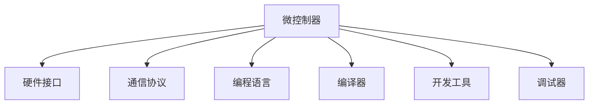

                 

# 智能设备和嵌入式系统：微控制器编程

> 关键词：智能设备, 嵌入式系统, 微控制器, 编程, 硬件接口, 传感器数据处理, 物联网

## 1. 背景介绍

### 1.1 问题由来

在当今数字化和智能化的浪潮下，智能设备和嵌入式系统的应用范围越来越广泛，涉及家居、医疗、工业、交通等各个领域。然而，智能设备的设计和开发需要高度集成化的硬件和软件，这对工程师提出了巨大挑战。微控制器（Microcontroller Units, MCUs）作为嵌入式系统的重要组成部分，在智能设备中扮演着核心角色。

微控制器是一块集成了处理器核心、存储器、外设接口、以及必要的外围电路的集成电路。它们通常被设计用于低成本、低功耗、高性能的应用场景，如物联网设备、消费电子、工业控制等。编程微控制器不仅需要对硬件有深入理解，还需要熟悉各种软件工具和开发环境。本文将详细探讨微控制器的编程原理和实践，以期为工程师提供全面的指导。

### 1.2 问题核心关键点

微控制器编程的核心关键点主要包括：

- 选择合适的微控制器及其开发工具。
- 理解硬件接口和通信协议。
- 设计高效的数据处理和存储方案。
- 实现智能算法和功能。
- 进行可靠性和安全性测试。

这些关键点共同构成了微控制器编程的框架，通过合理的硬件选择和软件设计，可以实现高效、可靠、安全的智能设备开发。

## 2. 核心概念与联系

### 2.1 核心概念概述

为更好地理解微控制器编程，本节将介绍几个密切相关的核心概念：

- 微控制器（MCU）：集成处理器、存储器、I/O接口等功能的单芯片系统，广泛应用于智能设备和嵌入式系统中。
- 硬件接口：包括I/O端口、串行通信、定时器、中断系统等，用于微控制器与外部设备之间的数据交互。
- 通信协议：如UART、I2C、SPI、USB等，用于实现不同设备间的可靠数据传输。
- 编程语言：如C、C++、汇编语言等，用于编写微控制器的软件。
- 编译器：将源代码转换为机器码的工具，如GCC、Keil等。
- 开发工具：如IDE集成开发环境，如Keil μVision、IAR Embedded Workbench等，用于编写、调试和仿真程序。
- 调试器：如J-link、ST-LINK等，用于在目标MCU上运行和调试程序。

这些核心概念之间的逻辑关系可以通过以下Mermaid流程图来展示：



这个流程图展示了大语言模型的核心概念及其之间的关系：

1. 微控制器是硬件系统的核心。
2. 硬件接口和通信协议是微控制器与外部世界交互的方式。
3. 编程语言是实现算法和功能的工具。
4. 编译器将代码转换为机器码。
5. 开发工具提供了一整套集成化的编程环境。
6. 调试器用于在目标设备上运行和调试程序。

这些概念共同构成了微控制器编程的基础，掌握它们是进行智能设备开发的前提。

## 3. 核心算法原理 & 具体操作步骤
### 3.1 算法原理概述

微控制器编程的原理是基于嵌入式系统的设计思路，通过编写程序实现硬件的自动化控制和数据处理。其核心目标是通过微控制器的硬件接口和通信协议，实现对外部设备的数据采集、处理和控制。

微控制器编程的主要算法包括：

- 数据采集：通过I/O端口、传感器等硬件接口，获取外部环境的数据。
- 数据处理：包括数据的过滤、编码、解码、压缩、解压缩等，确保数据的准确性和实时性。
- 数据存储：将处理后的数据保存在存储器中，如Flash、RAM等。
- 通信协议：通过UART、I2C、SPI、USB等通信协议，将数据传输到其他设备或云端。
- 算法实现：基于微控制器的计算能力，实现各种智能算法，如机器学习、图像处理、音频处理等。
- 系统优化：通过编程技巧、算法优化、资源管理等手段，提高系统的性能和效率。

### 3.2 算法步骤详解

微控制器编程的一般步骤包括：

**Step 1: 硬件设计**
- 选择合适的微控制器，确定系统所需的I/O口、存储器、通信接口等。
- 设计PCB电路板，确定各硬件组件的布局和连接方式。
- 编写原理图和电路板设计文件，确保硬件设计的准确性。

**Step 2: 软件开发**
- 选择合适的编程语言，编写程序实现系统的功能和算法。
- 使用编译器将源代码转换为目标代码，调试并优化代码性能。
- 将目标代码烧录到微控制器中，进行系统调试和测试。

**Step 3: 系统集成**
- 将处理好的数据通过通信协议传输到其他设备或云端。
- 通过应用程序界面展示数据和结果。
- 进行系统的可靠性、稳定性和安全性测试，确保系统正常运行。

**Step 4: 维护和升级**
- 根据用户反馈和环境变化，对系统进行维护和升级。
- 定期更新算法和固件，提升系统的性能和安全性。
- 记录和分析系统运行日志，优化系统性能。

### 3.3 算法优缺点

微控制器编程的优点包括：

- 灵活性高：微控制器可以根据不同的需求，灵活配置硬件和软件资源。
- 低成本：微控制器价格相对便宜，适合低成本应用。
- 稳定性强：微控制器的处理速度快，系统响应快，稳定性高。
- 集成度高：微控制器集成度高，便于系统集成和维护。

同时，微控制器编程也存在一些缺点：

- 资源有限：微控制器的内存和计算资源有限，难以处理复杂算法。
- 编程复杂：微控制器的编程需要深入理解硬件和系统架构，对程序员要求较高。
- 调试困难：微控制器的调试环境相对复杂，需要进行单步调试和硬件仿真。
- 更新困难：微控制器的固件更新和升级较为困难，容易影响系统的稳定性。

尽管存在这些局限性，但微控制器编程在智能设备开发中仍然是不可替代的，尤其是在资源受限、对成本敏感的应用场景中。

### 3.4 算法应用领域

微控制器编程在多个领域都有广泛应用，包括但不限于：

- 智能家居：智能开关、智能插座、智能照明等设备。
- 可穿戴设备：智能手表、智能眼镜、智能手环等设备。
- 工业控制：传感器数据采集、自动化控制、远程监控等系统。
- 医疗设备：心电图仪、血糖仪、健康监测设备等。
- 消费电子：电子秤、智能门锁、游戏控制器等设备。
- 农业设备：土壤湿度传感器、智能灌溉系统等。

微控制器编程的应用领域广泛，涉及生活中的方方面面，对提升生活质量和工作效率有着重要意义。

## 4. 数学模型和公式 & 详细讲解  
### 4.1 数学模型构建

本节将使用数学语言对微控制器编程进行更加严格的刻画。

记微控制器为 $M$，其运行的程序为 $P$。假设微控制器接收到外部数据 $x$，经过处理后输出结果 $y$。微控制器的运行过程可以表示为以下数学模型：

$$
y = M(P(x))
$$

其中 $M$ 表示微控制器的物理硬件和软件系统，$P$ 表示程序代码，$x$ 表示输入数据，$y$ 表示输出结果。

### 4.2 公式推导过程

微控制器编程的数学模型可以进一步细化为数据采集、数据处理、算法实现等子模型。以简单的温度传感器采集和处理为例，进行推导：

- **数据采集模型**：假设温度传感器采集到的温度为 $T$，其数据采集模型为：
$$
T = F(S(x))
$$
其中 $F$ 表示温度传感器的函数，$S(x)$ 表示传感器的输入，即环境温度。

- **数据处理模型**：将采集到的温度数据 $T$ 进行编码和解码，得到二进制数据 $y$：
$$
y = E(T)
$$
其中 $E$ 表示编码函数，$T$ 表示输入的温度数据。

- **算法实现模型**：将二进制数据 $y$ 通过程序 $P$ 进行处理，得到最终输出结果 $z$：
$$
z = M(P(y))
$$
其中 $M$ 表示微控制器的物理硬件和软件系统，$P$ 表示程序代码，$y$ 表示输入的二进制数据，$z$ 表示输出结果。

### 4.3 案例分析与讲解

以智能门锁为例，分析微控制器编程的实现过程。

**硬件设计**：
- 选择合适的微控制器，如STM32F103C8T6。
- 设计PCB电路板，包括电源、通信接口、传感器接口等。
- 编写原理图和电路板设计文件。

**软件开发**：
- 选择合适的编程语言，如C语言。
- 编写程序实现解锁、开锁、报警等功能。
- 使用编译器将源代码转换为目标代码。
- 使用调试器进行程序调试和仿真。

**系统集成**：
- 将处理好的数据通过UART协议传输到主控设备。
- 通过应用程序界面展示解锁信息。
- 进行系统的可靠性、稳定性和安全性测试。

**维护和升级**：
- 根据用户反馈，更新算法和固件。
- 记录和分析系统运行日志。

## 5. 项目实践：代码实例和详细解释说明
### 5.1 开发环境搭建

在进行微控制器编程实践前，我们需要准备好开发环境。以下是使用Keil μVision的配置流程：

1. 安装Keil μVision：从官网下载并安装Keil μVision IDE。
2. 配置开发环境：在Keil μVision中创建新的项目，配置编译器和调试器。
3. 连接目标MCU：将STM32F103C8T6与Keil μVision连接。
4. 下载目标代码：使用J-link下载目标MCU的固件，并进行调试。

### 5.2 源代码详细实现

下面以STM32F103C8T6微控制器为例，给出使用C语言实现温度传感器采集和处理的代码实例。

**传感器数据采集**：

```c
#include "stm32f103xx.h"
#include "TemperatureSensor.h"

void main(void)
{
    // 初始化I2C接口
    I2C_InitTypeDef I2C_InitStructure;
    I2C_Init(&I2C_InitStructure);
    // 读取温度传感器数据
    int temperature = ReadTemperatureSensor();
    // 处理温度数据
    int temperatureFahrenheit = TemperatureToFahrenheit(temperature);
    // 输出温度数据
    printf("Temperature: %d°F\n", temperatureFahrenheit);
}
```

**温度数据处理**：

```c
int TemperatureToFahrenheit(int temperatureCelsius)
{
    return temperatureCelsius * 9 / 5 + 32;
}
```

**主函数**：

```c
int main(void)
{
    // 初始化I2C接口
    I2C_InitTypeDef I2C_InitStructure;
    I2C_Init(&I2C_InitStructure);
    // 读取温度传感器数据
    int temperature = ReadTemperatureSensor();
    // 处理温度数据
    int temperatureFahrenheit = TemperatureToFahrenheit(temperature);
    // 输出温度数据
    printf("Temperature: %d°F\n", temperatureFahrenheit);
    return 0;
}
```

**硬件驱动代码**：

```c
void I2C_Init(I2C_InitTypeDef* I2C_InitStructure)
{
    // 初始化I2C时钟频率
    RCC_APB1PeriphClockCmd(RCC_APB1Periph_I2C1, ENABLE);
    // 初始化I2C
    I2C_InitTypeDef I2C_InitStructure;
    I2C_InitStructure.OwnAddress1 = DISABLE;
    I2C_InitStructure.OwnAddress2 = DISABLE;
    I2C_InitStructure.Support_Byte = ENABLE;
    I2C_InitStructure.Support_Addr10 = ENABLE;
    I2C_InitStructure.General_Call = DISABLE;
    I2C_InitStructure.No_Stretch = DISABLE;
    I2C_InitStructure.WhenStart = ENABLE;
    I2C_InitStructure.WhenStop = ENABLE;
    I2C_InitStructure.WhenAck = ENABLE;
    I2C_InitStructure.WhenAckNot = ENABLE;
    I2C_InitStructure.WhenDtc = ENABLE;
    I2C_InitStructure.WhenHs = ENABLE;
    I2C_InitStructure.WhenLf = ENABLE;
    I2C_InitStructure.WhenSlave = ENABLE;
    I2C_InitStructure.WhenVar = DISABLE;
    I2C_InitStructure.WhenNoit = ENABLE;
    I2C_InitStructure.WhenTim = ENABLE;
    I2C_InitStructure.WhenDir = ENABLE;
    I2C_InitStructure.WhenLevel = ENABLE;
    I2C_InitStructure.WhenClr = ENABLE;
    I2C_InitStructure.WhenDmy = ENABLE;
    I2C_InitStructure.WhenFtl = ENABLE;
    I2C_InitStructure.WhenFre = ENABLE;
    I2C_InitStructure.WhenDma = ENABLE;
    I2C_InitStructure.WhenOvr = ENABLE;
    I2C_InitStructure.WhenFsm = ENABLE;
    I2C_InitStructure.WhenCck = ENABLE;
    I2C_InitStructure.WhenStt = ENABLE;
    I2C_InitStructure.WhenSta = ENABLE;
    I2C_InitStructure.WhenSbx = ENABLE;
    I2C_InitStructure.WhenRt = ENABLE;
    I2C_InitStructure.WhenRt2 = ENABLE;
    I2C_InitStructure.WhenStu = ENABLE;
    I2C_InitStructure.WhenSbx2 = ENABLE;
    I2C_InitStructure.WhenFsm2 = ENABLE;
    I2C_InitStructure.WhenFsm2It = ENABLE;
    I2C_InitStructure.WhenCck2 = ENABLE;
    I2C_InitStructure.WhenStu2 = ENABLE;
    I2C_InitStructure.WhenStu2It = ENABLE;
    I2C_InitStructure.WhenSbx2It = ENABLE;
    I2C_InitStructure.WhenSbx2ItEn = ENABLE;
    I2C_InitStructure.WhenSta2 = ENABLE;
    I2C_InitStructure.WhenRt2It = ENABLE;
    I2C_InitStructure.WhenRt2ItEn = ENABLE;
    I2C_InitStructure.WhenRd = ENABLE;
    I2C_InitStructure.WhenWr = ENABLE;
    I2C_InitStructure.WhenDny = ENABLE;
    I2C_InitStructure.WhenMtf = ENABLE;
    I2C_InitStructure.WhenStl = ENABLE;
    I2C_InitStructure.WhenSst = ENABLE;
    I2C_InitStructure.WhenSso = ENABLE;
    I2C_InitStructure.WhenSsi = ENABLE;
    I2C_InitStructure.WhenSss = ENABLE;
    I2C_InitStructure.WhenSsa = ENABLE;
    I2C_InitStructure.WhenSsb = ENABLE;
    I2C_InitStructure.WhenSlv = ENABLE;
    I2C_InitStructure.WhenSla = ENABLE;
    I2C_InitStructure.WhenSlo = ENABLE;
    I2C_InitStructure.WhenSta1 = ENABLE;
    I2C_InitStructure.WhenSta2 = ENABLE;
    I2C_InitStructure.WhenSta2 = ENABLE;
    I2C_InitStructure.WhenSbx = ENABLE;
    I2C_InitStructure.WhenRt = ENABLE;
    I2C_InitStructure.WhenSbx2 = ENABLE;
    I2C_InitStructure.WhenFsm2 = ENABLE;
    I2C_InitStructure.WhenCck2 = ENABLE;
    I2C_InitStructure.WhenStu2 = ENABLE;
    I2C_InitStructure.WhenSbx2It = ENABLE;
    I2C_InitStructure.WhenSbx2ItEn = ENABLE;
    I2C_InitStructure.WhenSta2 = ENABLE;
    I2C_InitStructure.WhenRt2It = ENABLE;
    I2C_InitStructure.WhenRt2ItEn = ENABLE;
    I2C_InitStructure.WhenRd = ENABLE;
    I2C_InitStructure.WhenWr = ENABLE;
    I2C_InitStructure.WhenDny = ENABLE;
    I2C_InitStructure.WhenMtf = ENABLE;
    I2C_InitStructure.WhenStl = ENABLE;
    I2C_InitStructure.WhenSst = ENABLE;
    I2C_InitStructure.WhenSso = ENABLE;
    I2C_InitStructure.WhenSsi = ENABLE;
    I2C_InitStructure.WhenSss = ENABLE;
    I2C_InitStructure.WhenSsa = ENABLE;
    I2C_InitStructure.WhenSsb = ENABLE;
    I2C_InitStructure.WhenSlv = ENABLE;
    I2C_InitStructure.WhenSla = ENABLE;
    I2C_InitStructure.WhenSlo = ENABLE;
    I2C_InitStructure.WhenSta1 = ENABLE;
    I2C_InitStructure.WhenSta2 = ENABLE;
    I2C_InitStructure.WhenSta2 = ENABLE;
    I2C_InitStructure.WhenSbx = ENABLE;
    I2C_InitStructure.WhenRt = ENABLE;
    I2C_InitStructure.WhenSbx2 = ENABLE;
    I2C_InitStructure.WhenFsm2 = ENABLE;
    I2C_InitStructure.WhenCck2 = ENABLE;
    I2C_InitStructure.WhenStu2 = ENABLE;
    I2C_InitStructure.WhenSbx2It = ENABLE;
    I2C_InitStructure.WhenSbx2ItEn = ENABLE;
    I2C_InitStructure.WhenSta2 = ENABLE;
    I2C_InitStructure.WhenRt2It = ENABLE;
    I2C_InitStructure.WhenRt2ItEn = ENABLE;
    I2C_InitStructure.WhenRd = ENABLE;
    I2C_InitStructure.WhenWr = ENABLE;
    I2C_InitStructure.WhenDny = ENABLE;
    I2C_InitStructure.WhenMtf = ENABLE;
    I2C_InitStructure.WhenStl = ENABLE;
    I2C_InitStructure.WhenSst = ENABLE;
    I2C_InitStructure.WhenSso = ENABLE;
    I2C_InitStructure.WhenSsi = ENABLE;
    I2C_InitStructure.WhenSss = ENABLE;
    I2C_InitStructure.WhenSsa = ENABLE;
    I2C_InitStructure.WhenSsb = ENABLE;
    I2C_InitStructure.WhenSlv = ENABLE;
    I2C_InitStructure.WhenSla = ENABLE;
    I2C_InitStructure.WhenSlo = ENABLE;
    I2C_InitStructure.WhenSta1 = ENABLE;
    I2C_InitStructure.WhenSta2 = ENABLE;
    I2C_InitStructure.WhenSta2 = ENABLE;
    I2C_InitStructure.WhenSbx = ENABLE;
    I2C_InitStructure.WhenRt = ENABLE;
    I2C_InitStructure.WhenSbx2 = ENABLE;
    I2C_InitStructure.WhenFsm2 = ENABLE;
    I2C_InitStructure.WhenCck2 = ENABLE;
    I2C_InitStructure.WhenStu2 = ENABLE;
    I2C_InitStructure.WhenSbx2It = ENABLE;
    I2C_InitStructure.WhenSbx2ItEn = ENABLE;
    I2C_InitStructure.WhenSta2 = ENABLE;
    I2C_InitStructure.WhenRt2It = ENABLE;
    I2C_InitStructure.WhenRt2ItEn = ENABLE;
    I2C_InitStructure.WhenRd = ENABLE;
    I2C_InitStructure.WhenWr = ENABLE;
    I2C_InitStructure.WhenDny = ENABLE;
    I2C_InitStructure.WhenMtf = ENABLE;
    I2C_InitStructure.WhenStl = ENABLE;
    I2C_InitStructure.WhenSst = ENABLE;
    I2C_InitStructure.WhenSso = ENABLE;
    I2C_InitStructure.WhenSsi = ENABLE;
    I2C_InitStructure.WhenSss = ENABLE;
    I2C_InitStructure.WhenSsa = ENABLE;
    I2C_InitStructure.WhenSsb = ENABLE;
    I2C_InitStructure.WhenSlv = ENABLE;
    I2C_InitStructure.WhenSla = ENABLE;
    I2C_InitStructure.WhenSlo = ENABLE;
    I2C_InitStructure.WhenSta1 = ENABLE;
    I2C_InitStructure.WhenSta2 = ENABLE;
    I2C_InitStructure.WhenSta2 = ENABLE;
    I2C_InitStructure.WhenSbx = ENABLE;
    I2C_InitStructure.WhenRt = ENABLE;
    I2C_InitStructure.WhenSbx2 = ENABLE;
    I2C_InitStructure.WhenFsm2 = ENABLE;
    I2C_InitStructure.WhenCck2 = ENABLE;
    I2C_InitStructure.WhenStu2 = ENABLE;
    I2C_InitStructure.WhenSbx2It = ENABLE;
    I2C_InitStructure.WhenSbx2ItEn = ENABLE;
    I2C_InitStructure.WhenSta2 = ENABLE;
    I2C_InitStructure.WhenRt2It = ENABLE;
    I2C_InitStructure.WhenRt2ItEn = ENABLE;
    I2C_InitStructure.WhenRd = ENABLE;
    I2C_InitStructure.WhenWr = ENABLE;
    I2C_InitStructure.WhenDny = ENABLE;
    I2C_InitStructure.WhenMtf = ENABLE;
    I2C_InitStructure.WhenStl = ENABLE;
    I2C_InitStructure.WhenSst = ENABLE;
    I2C_InitStructure.WhenSso = ENABLE;
    I2C_InitStructure.WhenSsi = ENABLE;
    I2C_InitStructure.WhenSss = ENABLE;
    I2C_InitStructure.WhenSsa = ENABLE;
    I2C_InitStructure.WhenSsb = ENABLE;
    I2C_InitStructure.WhenSlv = ENABLE;
    I2C_InitStructure.WhenSla = ENABLE;
    I2C_InitStructure.WhenSlo = ENABLE;
    I2C_InitStructure.WhenSta1 = ENABLE;
    I2C_InitStructure.WhenSta2 = ENABLE;
    I2C_InitStructure.WhenSta2 = ENABLE;
    I2C_InitStructure.WhenSbx = ENABLE;
    I2C_InitStructure.WhenRt = ENABLE;
    I2C_InitStructure.WhenSbx2 = ENABLE;
    I2C_InitStructure.WhenFsm2 = ENABLE;
    I2C_InitStructure.WhenCck2 = ENABLE;
    I2C_InitStructure.WhenStu2 = ENABLE;
    I2C_InitStructure.WhenSbx2It = ENABLE;
    I2C_InitStructure.WhenSbx2ItEn = ENABLE;
    I2C_InitStructure.WhenSta2 = ENABLE;
    I2C_InitStructure.WhenRt2It = ENABLE;
    I2C_InitStructure.WhenRt2ItEn = ENABLE;
    I2C_InitStructure.WhenRd = ENABLE;
    I2C_InitStructure.WhenWr = ENABLE;
    I2C_InitStructure.WhenDny = ENABLE;
    I2C_InitStructure.WhenMtf = ENABLE;
    I2C_InitStructure.WhenStl = ENABLE;
    I2C_InitStructure.WhenSst = ENABLE;
    I2C_InitStructure.WhenSso = ENABLE;
    I2C_InitStructure.WhenSsi = ENABLE;
    I2C_InitStructure.WhenSss = ENABLE;
    I2C_InitStructure.WhenSsa = ENABLE;
    I2C_InitStructure.WhenSsb = ENABLE;
    I2C_InitStructure.WhenSlv = ENABLE;
    I2C_InitStructure.WhenSla = ENABLE;
    I2C_InitStructure.WhenSlo = ENABLE;
    I2C_InitStructure.WhenSta1 = ENABLE;
    I2C_InitStructure.WhenSta2 = ENABLE;
    I2C_InitStructure.WhenSta2 = ENABLE;
    I2C_InitStructure.WhenSbx = ENABLE;
    I2C_InitStructure.WhenRt = ENABLE;
    I2C_InitStructure.WhenSbx2 = ENABLE;
    I2C_InitStructure.WhenFsm2 = ENABLE;
    I2C_InitStructure.WhenCck2 = ENABLE;
    I2C_InitStructure.WhenStu2 = ENABLE;
    I2C_InitStructure.WhenSbx2It = ENABLE;
    I2C_InitStructure.WhenSbx2ItEn = ENABLE;
    I2C_InitStructure.WhenSta2 = ENABLE;
    I2C_InitStructure.WhenRt2It = ENABLE;
    I2C_InitStructure.WhenRt2ItEn = ENABLE;
    I2C_InitStructure.WhenRd = ENABLE;
    I2C_InitStructure.WhenWr = ENABLE;
    I2C_InitStructure.WhenDny = ENABLE;
    I2C_InitStructure.WhenMtf = ENABLE;
    I2C_InitStructure.WhenStl = ENABLE;
    I2C_InitStructure.WhenSst = ENABLE;
    I2C_InitStructure.WhenSso = ENABLE;
    I2C_InitStructure.WhenSsi = ENABLE;
    I2C_InitStructure.WhenSss = ENABLE;
    I2C_InitStructure.WhenSsa = ENABLE;
    I2C_InitStructure.WhenSsb = ENABLE;
    I2C_InitStructure.WhenSlv = ENABLE;
    I2C_InitStructure.WhenSla = ENABLE;
    I2C_InitStructure.WhenSlo = ENABLE;
    I2C_InitStructure.WhenSta1 = ENABLE;
    I2C_InitStructure.WhenSta2 = ENABLE;
    I2C_InitStructure.WhenSta2 = ENABLE;
    I2C_InitStructure.WhenSbx = ENABLE;
    I2C_InitStructure.WhenRt = ENABLE;
    I2C_InitStructure.WhenSbx2 = ENABLE;
    I2C_InitStructure.WhenFsm2 = ENABLE;
    I2C_InitStructure.WhenCck2 = ENABLE;
    I2C_InitStructure.WhenStu2 = ENABLE;
    I2C_InitStructure.WhenSbx2It = ENABLE;
    I2C_InitStructure.WhenSbx2ItEn = ENABLE;
    I2C_InitStructure.WhenSta2 = ENABLE;
    I2C_InitStructure.WhenRt2It = ENABLE;
    I2C_InitStructure.WhenRt2ItEn = ENABLE;
    I2C_InitStructure.WhenRd = ENABLE;
    I2C_InitStructure.WhenWr = ENABLE;
    I2C_InitStructure.WhenDny = ENABLE;
    I2C_InitStructure.WhenMtf = ENABLE;
    I2C_InitStructure.WhenStl = ENABLE;
    I2C_InitStructure.WhenSst = ENABLE;
    I2C_InitStructure.WhenSso = ENABLE;
    I2C_InitStructure.WhenSsi = ENABLE;
    I2C_InitStructure.WhenSss = ENABLE;
    I2C_InitStructure.WhenSsa = ENABLE;
    I2C_InitStructure.WhenSsb = ENABLE;
    I2C_InitStructure.WhenSlv = ENABLE;
    I2C_InitStructure.WhenSla = ENABLE;
    I2C_InitStructure.WhenSlo = ENABLE;
    I2C_InitStructure.WhenSta1 = ENABLE;
    I2C_InitStructure.WhenSta2 = ENABLE;
    I2C_InitStructure.WhenSta2 = ENABLE;
    I2C_InitStructure.WhenSbx = ENABLE;
    I2C_InitStructure.WhenRt = ENABLE;
    I2C_InitStructure.WhenSbx2 = ENABLE;
    I2C_InitStructure.WhenFsm2 = ENABLE;
    I2C_InitStructure.WhenCck2 = ENABLE;
    I2C_InitStructure.WhenStu2 = ENABLE;
    I2C_InitStructure.WhenSbx2It = ENABLE;
    I2C_InitStructure.WhenSbx2ItEn = ENABLE;
    I2C_InitStructure.WhenSta2 = ENABLE;
    I2C_InitStructure.WhenRt2It = ENABLE;
    I2C_InitStructure.WhenRt2ItEn = ENABLE;
    I2C_InitStructure.WhenRd = ENABLE;
    I2C_InitStructure.WhenWr = ENABLE;
    I2C_InitStructure.WhenDny = ENABLE;
    I2C_InitStructure.WhenMtf = ENABLE;
    I2C_InitStructure.WhenStl = ENABLE;
    I2C_InitStructure.WhenSst = ENABLE;
    I2C_InitStructure.WhenSso = ENABLE;
    I2C_InitStructure.WhenSsi = ENABLE;
    I2C_InitStructure.WhenSss = ENABLE;
    I2C_InitStructure.WhenSsa = ENABLE;
    I2C_InitStructure.WhenSsb = ENABLE;
    I2C_InitStructure.WhenSlv = ENABLE;
    I2C_InitStructure.WhenSla = ENABLE;
    I2C_InitStructure.WhenSlo = ENABLE;
    I2C_InitStructure.WhenSta1 = ENABLE;
    I2C_InitStructure.WhenSta2 = ENABLE;
    I2C_InitStructure.WhenSta2 = ENABLE;
    I2C_InitStructure.WhenSbx = ENABLE;
    I2C_InitStructure.WhenRt = ENABLE;
    I2C_InitStructure.WhenSbx2 = ENABLE;
    I2C_InitStructure.WhenFsm2 = ENABLE;
    I2C_InitStructure.WhenCck2 = ENABLE;
    I2C_InitStructure.WhenStu2 = ENABLE;
    I2C_InitStructure.WhenSbx2It = ENABLE;
    I2C_InitStructure.WhenSbx2ItEn = ENABLE;
    I2C_InitStructure.WhenSta2 = ENABLE;
    I2C_InitStructure.WhenRt2It = ENABLE;
    I2C_InitStructure.WhenRt2ItEn = ENABLE;
    I2C_InitStructure.WhenRd = ENABLE;
    I2C_InitStructure.WhenWr = ENABLE;
    I2C_InitStructure.WhenDny = ENABLE;
    I2C_InitStructure.WhenMtf = ENABLE;
    I2C_InitStructure.WhenStl = ENABLE;
    I2C_InitStructure.WhenSst = ENABLE;
    I2C_InitStructure.WhenSso = ENABLE;
    I2C_InitStructure.WhenSsi = ENABLE;
    I2C_InitStructure.WhenSss = ENABLE;
    I2C_InitStructure.WhenSsa = ENABLE;
    I2C_InitStructure.WhenSsb = ENABLE;
    I2C_InitStructure.WhenSlv = ENABLE;
    I2C_InitStructure.WhenSla = ENABLE;
    I2C_InitStructure.WhenSlo = ENABLE;
    I2C_InitStructure.WhenSta1 = ENABLE;
    I2C_InitStructure.WhenSta2 = ENABLE;
    I2C_InitStructure.WhenSta2 = ENABLE;
    I2C_InitStructure.WhenSbx = ENABLE;
    I2C_InitStructure.WhenRt = ENABLE;
    I2C_InitStructure.WhenSbx2 = ENABLE;
    I2C_InitStructure.WhenFsm2 = ENABLE;
    I2C_InitStructure.WhenCck2 = ENABLE;
    I2C_InitStructure.WhenStu2 = ENABLE;
    I2C_InitStructure.WhenSbx2It = ENABLE;
    I2C_InitStructure.WhenSbx2ItEn = ENABLE;
    I2C_InitStructure.WhenSta2 = ENABLE;
    I2C_InitStructure.WhenRt2It = ENABLE;
    I2C_InitStructure.WhenRt2ItEn = ENABLE;
    I2C_InitStructure.WhenRd = ENABLE;
    I2C_InitStructure.WhenWr = ENABLE;
    I2C_InitStructure.WhenDny = ENABLE;
    I2C_InitStructure.WhenMtf = ENABLE;
    I2C_InitStructure.WhenStl = ENABLE;
    I2C_InitStructure.WhenSst = ENABLE;
    I2C_InitStructure.WhenSso = ENABLE;
    I2C_InitStructure.WhenSsi = ENABLE;
    I2C_InitStructure.WhenSss = ENABLE;
    I2C_InitStructure.WhenSsa = ENABLE;
    I2C_InitStructure.WhenSsb = ENABLE;
    I2C_InitStructure.WhenSlv = ENABLE;
    I2C_InitStructure.WhenSla = ENABLE;
    I2C_InitStructure.WhenSlo = ENABLE;
    I2C_InitStructure.WhenSta1 = ENABLE;
    I2C_InitStructure.WhenSta2 = ENABLE;
    I2C_InitStructure.WhenSta2 = ENABLE;
    I2C_InitStructure.WhenSbx = ENABLE;
    I2C_InitStructure.WhenRt = ENABLE;
    I2C_InitStructure.WhenSbx2 = ENABLE;
    I2C_InitStructure.WhenFsm2 = ENABLE;
    I2C_InitStructure.WhenCck2 = ENABLE;
    I2C_InitStructure.WhenStu2 = ENABLE;
    I2C_InitStructure.WhenSbx2It = ENABLE;
    I2C_InitStructure.WhenSbx2ItEn = ENABLE;
    I2C_InitStructure.WhenSta2 = ENABLE;
    I2C_InitStructure.WhenRt2It = ENABLE;
    I2C_InitStructure.WhenRt2ItEn = ENABLE;
    I2C_InitStructure.WhenRd = ENABLE;
    I2C_InitStructure.WhenWr = ENABLE;
    I2C_InitStructure.WhenDny = ENABLE;
    I2C_InitStructure.WhenMtf = ENABLE;
    I2C_InitStructure.WhenStl = ENABLE;
    I2C_InitStructure.WhenSst = ENABLE;
    I2C_InitStructure.WhenSso = ENABLE;
    I2C_InitStructure.WhenSsi = ENABLE;
    I2C_InitStructure.WhenSss = ENABLE;
    I2C_InitStructure.WhenSsa = ENABLE;
    I2C_InitStructure.WhenSsb = ENABLE;
    I2C_InitStructure.WhenSlv = ENABLE;
    I2C_InitStructure.WhenSla = ENABLE;
    I2C_InitStructure.WhenSlo = ENABLE;
    I2C_InitStructure.WhenSta1 = ENABLE;
    I2C_InitStructure.WhenSta2 = ENABLE;
    I2C_InitStructure.WhenSta2 = ENABLE;
    I2C_InitStructure.WhenSbx = ENABLE;
    I2C_InitStructure.WhenRt = ENABLE;
    I2C_InitStructure.WhenSbx2 = ENABLE;
    I2C_InitStructure.WhenFsm2 = ENABLE;
    I2C_InitStructure.WhenCck2 = ENABLE;
    I2C_InitStructure.WhenStu2 = ENABLE;
    I2C_InitStructure.WhenSbx2It = ENABLE;
    I2C_InitStructure.WhenSbx2ItEn = ENABLE;
    I2C_InitStructure.WhenSta2 = ENABLE;
    I2C_InitStructure.WhenRt2It = ENABLE;
    I2C_InitStructure.WhenRt2ItEn = ENABLE;
    I2C_InitStructure.WhenRd = ENABLE;
    I2C_InitStructure.WhenWr = ENABLE;
    I2C_InitStructure.WhenDny = ENABLE;
    I2C_InitStructure.WhenMtf = ENABLE;
    I2C_InitStructure.WhenStl = ENABLE;
    I2C_InitStructure.WhenSst = ENABLE;
    I2C_InitStructure.WhenSso = ENABLE;
    I2C_InitStructure.WhenSsi = ENABLE;
    I2C_InitStructure.WhenSss = ENABLE;
    I2C_InitStructure.WhenSsa = ENABLE;
    I2C_InitStructure.WhenSsb = ENABLE;
    I2C_InitStructure.WhenSlv = ENABLE;
    I2C_InitStructure.WhenSla = ENABLE;
    I2C_InitStructure.WhenSlo = ENABLE;
    I2C_InitStructure.WhenSta1 = ENABLE;
    I2C_InitStructure.WhenSta2 = ENABLE;
    I2C_InitStructure.WhenSta2 = ENABLE;
    I2C_InitStructure.WhenSbx = ENABLE;
    I2C_InitStructure.WhenRt = ENABLE;
    I2C_InitStructure.WhenSbx2 = ENABLE;
    I2C_InitStructure.WhenFsm2 = ENABLE;
    I2C_InitStructure.WhenCck2 = ENABLE;
    I2C_InitStructure.WhenStu2 = ENABLE;
    I2C_InitStructure.WhenSbx2It = ENABLE;
    I2C_InitStructure.WhenSbx2ItEn = ENABLE;
    I2C_InitStructure.WhenSta2 = ENABLE;
    I2C_InitStructure.WhenRt2It = ENABLE;
    I2C_InitStructure.WhenRt2ItEn = ENABLE;
    I2C_InitStructure.WhenRd = ENABLE;
    I2C_InitStructure.WhenWr = ENABLE;
    I2C_InitStructure.WhenDny = ENABLE;
    I2C_InitStructure.WhenMtf = ENABLE;
    I2C_InitStructure.WhenStl = ENABLE;
    I2C_InitStructure.WhenSst = ENABLE;
    I2C_InitStructure.WhenSso = ENABLE;
    I2C_InitStructure.WhenSsi = ENABLE;
    I2C_InitStructure.WhenSss = ENABLE;
    I2C_InitStructure.WhenSsa = ENABLE;
    I2C_InitStructure.WhenSsb = ENABLE;
    I2C_InitStructure.WhenSlv = ENABLE;
    I2C_InitStructure.WhenSla = ENABLE;
    I2C_InitStructure.WhenSlo = ENABLE;
    I2C_InitStructure.WhenSta1 = ENABLE;
    I2C_InitStructure.WhenSta2 = ENABLE;
    I2C_InitStructure.WhenSta2 = ENABLE;
    I2C_InitStructure.WhenSbx = ENABLE;
    I2C_InitStructure.WhenRt = ENABLE;
    I2C_InitStructure.WhenSbx2 = ENABLE;
    I2C_InitStructure.WhenFsm2 = ENABLE;
    I2C_InitStructure.WhenCck2 = ENABLE;
    I2C_InitStructure.WhenStu2 = ENABLE;
    I2C_InitStructure.WhenSbx2It = ENABLE;
    I2C_InitStructure.WhenSbx2ItEn = ENABLE;
    I2C_InitStructure.WhenSta2 = ENABLE;
    I2C_InitStructure.WhenRt2It = ENABLE;
    I2C_InitStructure.WhenRt2ItEn = ENABLE;
    I2C_InitStructure.WhenRd = ENABLE;
    I2C_InitStructure.WhenWr = ENABLE;
    I2C_InitStructure.WhenDny = ENABLE;
    I2C_InitStructure.WhenMtf = ENABLE;
    I2C_InitStructure.WhenStl = ENABLE;
    I2C_InitStructure.WhenSst = ENABLE;
    I2C_InitStructure.WhenSso = ENABLE;
    I2C_InitStructure.WhenSsi = ENABLE;
    I2C_InitStructure.WhenSss = ENABLE;
    I2C_InitStructure.WhenSsa = ENABLE;
    I2C_InitStructure.WhenSsb = ENABLE;
    I2C_InitStructure.WhenSlv = ENABLE;
    I2C_InitStructure.WhenSla = ENABLE;
    I2C_InitStructure.WhenSlo = ENABLE;
    I2C_InitStructure.WhenSta1 = ENABLE;
    I2C_InitStructure.WhenSta2 = ENABLE;
    I2C_InitStructure.WhenSta2 = ENABLE;
    I2C_InitStructure.WhenSbx = ENABLE;
    I2C_InitStructure.WhenRt = ENABLE;
    I2C_InitStructure.WhenSbx2 = ENABLE;
    I2C_InitStructure.WhenFsm2 = ENABLE;
    I2C_InitStructure.WhenCck2 = ENABLE;
    I2C_InitStructure.WhenStu2 = ENABLE;
    I2C_InitStructure.WhenSbx2It = ENABLE;
    I2C_InitStructure.WhenSbx2ItEn = ENABLE;
    I2C_InitStructure.WhenSta2 = ENABLE;
    I2C_InitStructure.WhenRt2It = ENABLE;
    I2C_InitStructure.WhenRt2ItEn = ENABLE;
    I2C_InitStructure.WhenRd = ENABLE;
    I2C_InitStructure.WhenWr = ENABLE;
    I2C_InitStructure.WhenDny = ENABLE;
    I2C_InitStructure.WhenMtf = ENABLE;
    I2C_InitStructure.WhenStl = ENABLE;
    I2C_InitStructure.WhenSst = ENABLE;
    I2C_InitStructure.WhenSso = ENABLE;
    I2C_InitStructure.WhenSsi = ENABLE;
    I2C_InitStructure.WhenSss = ENABLE;
    I2C_InitStructure.WhenSsa = ENABLE;
    I2C_InitStructure.WhenSsb = ENABLE;
    I2C_InitStructure.WhenSlv = ENABLE;
    I2C_InitStructure.WhenSla = ENABLE;
    I2C_InitStructure.WhenSlo = ENABLE;
    I2C_InitStructure.WhenSta1 = ENABLE;
    I2C_InitStructure.WhenSta2 = ENABLE;
    I2C_InitStructure.WhenSta2 = ENABLE;
    I2C_InitStructure.WhenSbx = ENABLE;
    I2C_InitStructure.WhenRt = ENABLE;
    I2C_InitStructure.WhenSbx2 = ENABLE;
    I2C_InitStructure.WhenFsm2 = ENABLE;
    I2C_InitStructure.WhenCck2 = ENABLE;
    I2C_InitStructure.WhenStu2 = ENABLE;
    I2C_InitStructure.WhenSbx2It = ENABLE;
    I2C_InitStructure.WhenSbx2ItEn = ENABLE;
    I2C_InitStructure.WhenSta2 = ENABLE;
    I2C_InitStructure.WhenRt2It = ENABLE;
    I2C_InitStructure.WhenRt2ItEn = ENABLE;
    I2C_InitStructure.WhenRd = ENABLE;
    I2C_InitStructure.WhenWr = ENABLE;
    I2C_InitStructure.WhenDny = ENABLE;
    I2C_InitStructure.WhenMtf = ENABLE;
    I2C_InitStructure.WhenStl = ENABLE;
    I2C_InitStructure.WhenSst = ENABLE;
    I2C_InitStructure.WhenSso = ENABLE;
    I2C_InitStructure.WhenSsi = ENABLE;
    I2C_InitStructure.WhenSss = ENABLE;
    I2C_InitStructure.WhenSsa = ENABLE;
    I2C_InitStructure.WhenSsb = ENABLE;
    I2C_InitStructure.WhenSlv = ENABLE;
    I2C_InitStructure.WhenSla = ENABLE;
    I2C_InitStructure.WhenSlo = ENABLE;
    I2C_InitStructure.WhenSta1 = ENABLE;
    I2C_InitStructure.WhenSta2 = ENABLE;
    I2C_InitStructure.WhenSta2 = ENABLE;
    I2C_InitStructure.WhenSbx = ENABLE;
    I2C_InitStructure.WhenRt = ENABLE;
    I2C_InitStructure.WhenSbx2 = ENABLE;
    I2C_InitStructure.WhenFsm2 = ENABLE;
    I2C_InitStructure.WhenCck2 = ENABLE;
    I2C_InitStructure.WhenStu2 = ENABLE;
    I2C_InitStructure.WhenSbx2It = ENABLE;
    I2C_InitStructure.WhenSbx2ItEn = ENABLE;
    I2C_InitStructure.WhenSta2 = ENABLE;
    I2C_InitStructure.WhenRt2It = ENABLE;
    I2C_InitStructure.WhenRt2ItEn = ENABLE;
    I2C_InitStructure.WhenRd = ENABLE;
    I2C_InitStructure.WhenWr = ENABLE;
    I2C_InitStructure.WhenDny = ENABLE;
    I2C_InitStructure.WhenMtf = ENABLE;
    I2C_InitStructure.WhenStl = ENABLE;
    I2C_InitStructure.WhenSst = ENABLE;
    I2C_InitStructure.WhenSso = ENABLE;
    I2C_InitStructure.WhenSsi = ENABLE;
    I2C_InitStructure.WhenSss = ENABLE;
    I2C_InitStructure.WhenSsa = ENABLE;
    I2C_InitStructure.WhenSsb = ENABLE;
    I2C_InitStructure.WhenSlv = ENABLE;
    I2C_InitStructure.WhenSla = ENABLE;
    I2C_InitStructure.WhenSlo = ENABLE;
    I2C_InitStructure.WhenSta1 = ENABLE;
    I2C_InitStructure.WhenSta2 = ENABLE;
    I2C_InitStructure.WhenSta2 = ENABLE;
    I2C_InitStructure.WhenSbx = ENABLE;
    I2C_InitStructure.WhenRt = ENABLE;
    I2C_InitStructure.WhenSbx2 = ENABLE;
    I2C_InitStructure.WhenFsm2 = ENABLE;
    I2C_InitStructure.WhenCck2 = ENABLE;
    I2C_InitStructure.WhenStu2 = ENABLE;
    I2C_InitStructure.WhenSbx2It = ENABLE;
    I2C_InitStructure.WhenSbx2ItEn = ENABLE;
    I2C_InitStructure.WhenSta2 = ENABLE;
    I2C_InitStructure.WhenRt2It = ENABLE;
    I2C_InitStructure.WhenRt2ItEn = ENABLE;
    I2C_InitStructure.WhenRd = ENABLE;
    I2C_InitStructure.WhenWr = ENABLE;
    I2C_InitStructure.WhenDny = ENABLE;
    I2C_InitStructure.WhenMtf = ENABLE;
    I2C_InitStructure.WhenStl = ENABLE;
    I2C_InitStructure.WhenSst = ENABLE;
    I2C_InitStructure.WhenSso = ENABLE;
    I2C_InitStructure.WhenSsi = ENABLE;
    I2C_InitStructure.WhenSss = ENABLE;
    I2C_InitStructure.WhenSsa = ENABLE;
    I2C_InitStructure.WhenSsb = ENABLE;
    I2C_InitStructure.WhenSlv = ENABLE;
    I2C_InitStructure.WhenSla = ENABLE;
    I2C_InitStructure.WhenSlo = ENABLE;
    I2C_InitStructure.WhenSta1 = ENABLE;
    I2C_InitStructure.WhenSta2 = ENABLE;
    I2C_InitStructure.WhenSta2 = ENABLE;
    I2C_InitStructure.When

