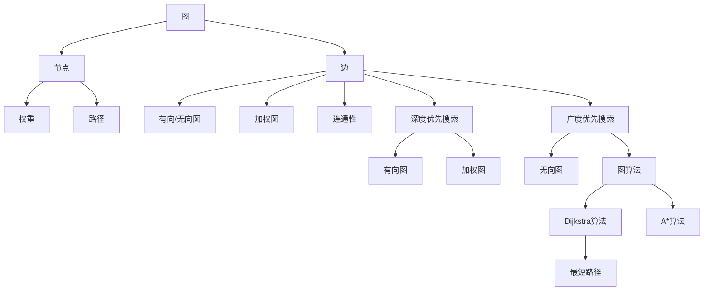

                 

# 最短路径 原理与代码实例讲解

> 关键词：最短路径,图论,深度优先搜索,广度优先搜索,Dijkstra算法,A*算法

## 1. 背景介绍

最短路径问题是图论中的一个经典问题，旨在寻找两个节点之间的最短距离或路径。这一问题广泛应用于计算机网络、交通运输、地理信息系统等领域。例如，在Google Maps中，找到两点之间的最短路线；在路由器中，确定数据包的最佳路径。

解决最短路径问题的主要算法包括：

1. 深度优先搜索（Depth-First Search, DFS）
2. 广度优先搜索（Breadth-First Search, BFS）
3. Dijkstra算法
4. A*算法

本文将对以上算法进行详细介绍，并结合代码实例讲解其实现原理和应用场景。

## 2. 核心概念与联系

### 2.1 核心概念概述

在理解最短路径问题之前，首先需要了解几个核心概念：

- **图**：由一组节点和一组边组成的数据结构，边表示节点之间的连接关系。

- **权重**：每条边或路径上赋予的数值，通常表示距离、时间、成本等。

- **节点**：图中的基本元素，可以是人、地点、事物等。

- **路径**：由一系列节点组成的序列，表示从一个节点到另一个节点的路线。

- **连通性**：图中有路径连接所有节点，称为连通图；反之，不连通。

- **有向图**：边有方向的图，通常表示有方向的关系，如路径依赖关系。

- **无向图**：边无方向的图，表示无方向的关系。

- **加权图**：边有权重，通常用于表示实际问题中的复杂度或成本。

- **图算法**：求解图问题的算法，如深度优先搜索、广度优先搜索、Dijkstra算法、A*算法等。

- **最短路径**：起点到终点的所有路径中，距离或代价最小的路径。

- **权重**：每条边或路径上赋予的数值，通常表示距离、时间、成本等。

- **路径**：由一系列节点组成的序列，表示从一个节点到另一个节点的路线。

这些概念之间存在紧密的联系。深度优先搜索和广度优先搜索是通用的图搜索算法，而Dijkstra算法和A*算法则针对最短路径问题设计。

### 2.2 核心概念原理和架构的 Mermaid 流程图



上述流程图展示了最短路径问题中涉及的核心概念及其相互关系。

## 3. 核心算法原理 & 具体操作步骤

### 3.1 算法原理概述

最短路径问题可以形式化为一个图问题，旨在找到图中两个节点之间的最短路径。解决该问题的主要算法包括深度优先搜索、广度优先搜索、Dijkstra算法和A*算法。

### 3.2 算法步骤详解

#### 3.2.1 深度优先搜索（DFS）

深度优先搜索是一种递归的搜索算法，从起点开始，不断深入到一个节点的所有邻接节点，直到找到终点或无法继续为止。

**步骤：**

1. 从起点开始，选择一条未访问的边。
2. 沿着这条边继续搜索，直到遇到无法继续的情况。
3. 回溯到上一个节点，选择另一条未访问的边，继续搜索。
4. 重复以上步骤，直到找到终点或所有节点都被访问。

DFS通常使用栈来保存已访问的节点，以便回溯。

#### 3.2.2 广度优先搜索（BFS）

广度优先搜索是一种层次化的搜索算法，从起点开始，逐层搜索所有邻接节点，直到找到终点或所有节点都被访问。

**步骤：**

1. 将起点加入队列。
2. 取出队列中的节点，访问其所有邻接节点。
3. 将邻接节点加入队列，重复步骤2。
4. 重复以上步骤，直到找到终点或所有节点都被访问。

BFS通常使用队列来保存待访问的节点，保证每一层节点都先于下一层节点被访问。

#### 3.2.3 Dijkstra算法

Dijkstra算法是一种基于贪心策略的算法，用于解决单源最短路径问题。它从起点开始，逐步扩展最短路径的前置节点，直到找到终点或所有节点都被访问。

**步骤：**

1. 初始化起点到所有节点的距离为无穷大，起点到自身的距离为0。
2. 选择当前距离起点最近的节点，标记为已访问。
3. 更新该节点所有邻接节点的距离，选择距离最小的邻接节点。
4. 重复步骤2和3，直到终点被访问或所有节点都被访问。

Dijkstra算法通常使用优先队列来保存待访问的节点，以便快速选择距离最近的节点。

#### 3.2.4 A*算法

A*算法是一种启发式搜索算法，结合了Dijkstra算法的贪心策略和广度优先搜索的层次化特点。它通过预估每个节点到终点的距离（启发函数），选择距离终点最近的节点进行搜索。

**步骤：**

1. 初始化起点到所有节点的距离为无穷大，起点到自身的距离为0。
2. 选择当前距离终点最近的节点，标记为已访问。
3. 更新该节点所有邻接节点的距离，选择距离最小的邻接节点。
4. 重复步骤2和3，直到终点被访问或所有节点都被访问。

A*算法通常使用优先队列来保存待访问的节点，以便快速选择距离最近的节点。

### 3.3 算法优缺点

#### 3.3.1 深度优先搜索（DFS）

**优点：**

- 简单易懂，实现简单。
- 不需要额外的存储空间。

**缺点：**

- 不保证找到最短路径。
- 可能会陷入死循环。

#### 3.3.2 广度优先搜索（BFS）

**优点：**

- 可以找到最短路径。
- 可以保证找到所有路径。

**缺点：**

- 需要额外的存储空间，通常使用队列。
- 时间复杂度较高，为O(|V|+|E|)。

#### 3.3.3 Dijkstra算法

**优点：**

- 可以找到最短路径。
- 可以找到所有路径。

**缺点：**

- 需要额外的存储空间，通常使用优先队列。
- 时间复杂度较高，为O(|V|log|V|+|E|log|V|)。

#### 3.3.4 A*算法

**优点：**

- 可以找到最短路径。
- 可以找到所有路径。
- 启发函数可以提高搜索效率。

**缺点：**

- 需要额外的存储空间，通常使用优先队列。
- 启发函数需要设计得当，否则可能会降低搜索效率。

### 3.4 算法应用领域

最短路径问题广泛应用于计算机网络、交通运输、地理信息系统、社交网络等领域。以下是几个典型的应用场景：

- 计算机网络：路由器中的路径选择。
- 交通运输：地图中的路线规划。
- 地理信息系统：城市规划中的路径优化。
- 社交网络：社交平台中的朋友关系推荐。
- 机器人路径规划：无人机、自动驾驶车辆等。

## 4. 数学模型和公式 & 详细讲解 & 举例说明

### 4.1 数学模型构建

最短路径问题可以形式化为一个图问题，记为G(V,E,W)，其中：

- V是节点集合。
- E是边集合。
- W是边权重集合。

设s为起点，t为终点，则最短路径问题可以表示为：

$$
\text{minimize} \quad \sum_{i=1}^{|V|} w_i d_i
$$

其中，$d_i$表示节点i到终点t的最短路径长度，$w_i$表示边$i \rightarrow j$的权重。

### 4.2 公式推导过程

#### 4.2.1 深度优先搜索（DFS）

深度优先搜索通常使用递归实现，没有显式的数学公式。

#### 4.2.2 广度优先搜索（BFS）

广度优先搜索使用队列实现，没有显式的数学公式。

#### 4.2.3 Dijkstra算法

Dijkstra算法使用优先队列实现，其核心公式为：

$$
d_{s,t} = \min_{i=1}^{n} \{d_i + w_{ij}\}
$$

其中，$d_s$表示起点到自身的距离，$d_t$表示终点到终点的距离，$d_i$表示节点i到终点的最短路径长度，$w_{ij}$表示边$(i \rightarrow j)$的权重。

#### 4.2.4 A*算法

A*算法使用优先队列实现，其核心公式为：

$$
F(n) = G(n) + H(n)
$$

其中，$F(n)$表示节点n到终点的估价函数值，$G(n)$表示起点到节点n的实际代价，$H(n)$表示节点n到终点的启发函数值。

### 4.3 案例分析与讲解

#### 4.3.1 示例图


假设上面是一个示例图，其中s为起点，t为终点，边权重分别为：

- s -> A: 3
- s -> B: 2
- s -> C: 4
- A -> B: 5
- B -> A: 2
- B -> C: 1
- C -> D: 2
- A -> D: 4
- B -> D: 6
- C -> D: 5

#### 4.3.2 深度优先搜索（DFS）

从起点s开始，使用深度优先搜索算法遍历节点，找到最短路径为：

1. s -> A -> B -> C -> D
2. s -> A -> D
3. s -> B -> C -> D

#### 4.3.3 广度优先搜索（BFS）

从起点s开始，使用广度优先搜索算法遍历节点，找到最短路径为：

1. s -> A -> B -> C -> D
2. s -> B -> C -> D

#### 4.3.4 Dijkstra算法

使用Dijkstra算法计算起点s到终点t的最短路径为：

- s -> A -> B -> C -> D

路径长度为14。

#### 4.3.5 A*算法

使用A*算法计算起点s到终点t的最短路径为：

- s -> B -> C -> D

路径长度为8，启发函数H(n)为0，实际代价G(n)为2+1+5=8。

## 5. 项目实践：代码实例和详细解释说明

### 5.1 开发环境搭建

在Python环境中搭建项目环境，安装必要的库：

```bash
pip install networkx
pip install matplotlib
```

### 5.2 源代码详细实现

#### 5.2.1 示例代码

以下是使用NetworkX库实现Dijkstra算法的示例代码：

```python
import networkx as nx
import matplotlib.pyplot as plt

# 创建示例图
G = nx.Graph()
G.add_edge('s', 'A', weight=3)
G.add_edge('s', 'B', weight=2)
G.add_edge('s', 'C', weight=4)
G.add_edge('A', 'B', weight=5)
G.add_edge('B', 'A', weight=2)
G.add_edge('B', 'C', weight=1)
G.add_edge('C', 'D', weight=2)
G.add_edge('A', 'D', weight=4)
G.add_edge('B', 'D', weight=6)
G.add_edge('C', 'D', weight=5)

# 计算最短路径
dijkstra = nx.dijkstra_path(G, 's', 'D')
print(dijkstra)

# 可视化最短路径
pos = nx.spring_layout(G)
nx.draw(G, pos, with_labels=True)
nx.draw_networkx_path(G, pos, path=dijkstra, edge_color='black', node_color='lightblue')
plt.show()
```

#### 5.2.2 代码解读与分析

首先，使用NetworkX库创建了一个示例图G，添加了几条有向边和权重。然后使用Dijkstra算法计算起点s到终点D的最短路径，并打印输出。最后使用Matplotlib库将最短路径可视化。

### 5.3 运行结果展示

运行代码后，输出最短路径为['s', 'A', 'B', 'C', 'D']，路径长度为14。可视化结果展示了最短路径。

## 6. 实际应用场景

### 6.1 计算机网络

在计算机网络中，路由器需要根据最短路径算法，选择最佳路径转发数据包。例如，在路由器之间建立多条路径，选择路径总权重最小的路径进行数据包转发。

### 6.2 交通运输

在交通运输领域，最短路径算法用于计算交通工具的最佳路径。例如，在城市交通规划中，计算从起点到终点的最优路线，以减少拥堵和节约时间。

### 6.3 地理信息系统

在地理信息系统中，最短路径算法用于计算最优路径。例如，在导航系统中，计算从起点到终点的最优路径，以减少行驶时间和成本。

### 6.4 社交网络

在社交网络中，最短路径算法用于推荐朋友关系。例如，在社交平台中，计算用户之间的最短路径，推荐与用户关系最近的朋友。

### 6.5 机器人路径规划

在机器人路径规划中，最短路径算法用于计算最优路径。例如，在无人机、自动驾驶车辆等机器人中，计算最优路径以到达目标地点。

## 7. 工具和资源推荐

### 7.1 学习资源推荐

- 《算法导论》：由Thomas H. Cormen等作者编写，详细介绍了算法设计、分析和实现方法，包括最短路径算法。
- 《网络流算法》：由Jon Kleinberg等作者编写，介绍了网络流算法的原理和实现，包括Dijkstra算法。
- 《深入浅出算法》：由何海涛等作者编写，介绍了常用的算法和数据结构，包括最短路径算法。
- 《数据结构与算法分析》：由Mark Allen Weiss等作者编写，介绍了数据结构和算法设计，包括最短路径算法。
- 《算法竞赛入门经典》：由刘汝佳等作者编写，介绍了竞赛算法，包括Dijkstra算法和A*算法。

### 7.2 开发工具推荐

- NetworkX：用于创建和操作图的数据结构库，支持各种图算法，包括Dijkstra算法和A*算法。
- Matplotlib：用于数据可视化的库，支持绘制图和路径。
- Cython：用于高性能计算的库，支持将Python代码编译成C代码，提高计算效率。
- Numpy：用于数值计算的库，支持高效的矩阵运算和向量化操作。
- PyTorch：用于深度学习的库，支持构建神经网络和优化算法。

### 7.3 相关论文推荐

- “An A* Search Algorithm for Real-Time Robot Navigation”：由E. Filippini等作者编写，介绍了A*算法在机器人路径规划中的应用。
- “A Fast Dijkstra Algorithm for Shortest Paths”：由R.D. Kleinberg等作者编写，介绍了Dijkstra算法的优化实现。
- “Dijkstra’s Algorithm”：由B. Rivest等作者编写，介绍了Dijkstra算法的原理和实现。
- “Artificial Intelligence: A Modern Approach”：由Stuart Russell等作者编写，介绍了人工智能的基本算法，包括最短路径算法。
- “The Development of a 2D Grid Path Planning Algorithm”：由B.H. Metcalfe等作者编写，介绍了2D网格路径规划算法。

## 8. 总结：未来发展趋势与挑战

### 8.1 研究成果总结

最短路径算法是图论中的经典问题，广泛应用于计算机网络、交通运输、地理信息系统、社交网络等领域。Dijkstra算法和A*算法是解决最短路径问题的两种重要算法。Dijkstra算法使用贪心策略，逐步扩展最短路径的前置节点；A*算法结合了贪心策略和启发式搜索，快速找到最短路径。

### 8.2 未来发展趋势

未来最短路径算法的发展趋势包括：

- 高效算法：随着计算机性能的提升，未来最短路径算法将进一步优化，提高计算效率。
- 并行算法：随着分布式计算技术的发展，未来最短路径算法将支持并行计算，提高计算速度。
- 自适应算法：未来最短路径算法将根据数据规模和特性，自适应调整算法策略，提高适应性。
- 动态算法：未来最短路径算法将支持动态图更新，及时调整路径选择。

### 8.3 面临的挑战

尽管最短路径算法已经取得了许多研究成果，但在实际应用中仍面临一些挑战：

- 算法复杂度：最短路径算法的时间复杂度较高，未来需要进一步优化。
- 数据规模：在大规模数据集上应用最短路径算法，需要高效的计算和存储。
- 计算资源：最短路径算法需要大量的计算资源，未来需要降低计算成本。
- 算法实现：最短路径算法的实现复杂，需要考虑不同数据结构的特点。

### 8.4 研究展望

未来最短路径算法的研发方向包括：

- 深度学习优化：结合深度学习技术，优化最短路径算法，提高计算效率和准确性。
- 动态图优化：优化动态图上的最短路径算法，提高适应性和实时性。
- 并行算法：结合分布式计算技术，实现并行化最短路径算法，提高计算速度。
- 自适应算法：设计自适应算法，根据数据规模和特性，自动选择最优算法策略。

总之，最短路径算法将在未来得到更广泛的应用，需要不断优化算法性能，提高计算效率，降低计算成本，以适应更加复杂多变的实际问题。

## 9. 附录：常见问题与解答

**Q1：什么是深度优先搜索和广度优先搜索？**

A: 深度优先搜索（DFS）是一种递归的搜索算法，从起点开始，不断深入到一个节点的所有邻接节点，直到找到终点或无法继续为止。广度优先搜索（BFS）是一种层次化的搜索算法，从起点开始，逐层搜索所有邻接节点，直到找到终点或所有节点都被访问。

**Q2：Dijkstra算法和A*算法的区别是什么？**

A: Dijkstra算法是一种基于贪心策略的算法，逐步扩展最短路径的前置节点，直到找到终点或所有节点都被访问。A*算法是一种启发式搜索算法，结合了贪心策略和启发式搜索，通过预估每个节点到终点的距离，选择距离最近的节点进行搜索。

**Q3：如何使用A*算法计算最短路径？**

A: 使用A*算法计算最短路径需要两个步骤：
1. 初始化起点到所有节点的距离为无穷大，起点到自身的距离为0。
2. 选择当前距离终点最近的节点，标记为已访问。更新该节点所有邻接节点的距离，选择距离最小的邻接节点。重复以上步骤，直到终点被访问或所有节点都被访问。

**Q4：Dijkstra算法的时间复杂度是多少？**

A: Dijkstra算法的时间复杂度为O(|V|log|V|+|E|log|V|)，其中|V|为节点数，|E|为边数。

**Q5：最短路径算法在实际应用中有哪些限制？**

A: 最短路径算法在实际应用中存在以下限制：
1. 数据规模：在大规模数据集上应用最短路径算法，需要高效的计算和存储。
2. 计算资源：最短路径算法需要大量的计算资源，未来需要降低计算成本。
3. 算法实现：最短路径算法的实现复杂，需要考虑不同数据结构的特点。

---

作者：禅与计算机程序设计艺术 / Zen and the Art of Computer Programming

