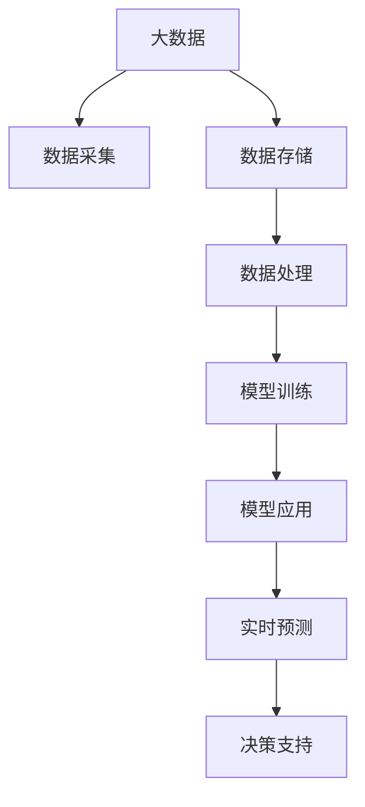

                 

# 未来发展中的大数据与AI技术应用

> 关键词：大数据,人工智能,深度学习,机器学习,深度学习框架,数据处理,模型优化,实际应用,未来展望

## 1. 背景介绍

### 1.1 问题由来
随着信息技术的飞速发展，数据已经成为各行各业的重要资产。数据可以揭示现象背后的规律，指导企业决策，优化运营管理，驱动创新发展。然而，由于数据规模的爆炸式增长，传统的存储和处理手段已经无法满足需求。大数据技术应运而生，通过分布式计算、流式处理、数据挖掘等技术手段，高效、准确地处理和分析海量数据，为各行各业提供了强有力的支持。

与此同时，人工智能（AI）技术，特别是深度学习、机器学习等领域，在识别、推理、决策等高级认知任务上取得了重大突破。大数据与AI技术的融合，为产业带来了新的发展机遇。本文将深入探讨大数据与AI技术的现状、核心原理与应用前景，展望未来发展趋势。

### 1.2 问题核心关键点
大数据与AI技术的融合，本质上是通过对海量数据的高效处理和深度学习模型的智能分析，实现对复杂问题的解答和预测。其中关键点包括：

- 数据预处理：对原始数据进行清洗、归一化、特征工程等操作，以便后续分析和模型训练。
- 模型训练：使用深度学习框架对数据集进行训练，通过反向传播算法优化模型参数，使其能够准确地预测和分类。
- 模型应用：将训练好的模型部署到实际场景中，进行实时预测和决策支持。

这些关键点相辅相成，共同构建了大数据与AI技术的生态系统，使得其在各领域的应用成为可能。

## 2. 核心概念与联系

### 2.1 核心概念概述

为了更好地理解大数据与AI技术的融合，我们首先介绍几个核心概念：

- 大数据（Big Data）：指规模巨大、类型多样的数据集，通常超过传统数据库的存储与处理能力。大数据技术包括数据采集、存储、处理和分析等全流程的解决方案。
- 人工智能（AI）：通过机器学习、深度学习等算法，使计算机具备人类智能的某些能力，如视觉识别、语音识别、自然语言处理等。
- 深度学习（Deep Learning）：一种特殊的机器学习方法，通过多层神经网络模拟人脑的结构和功能，进行特征提取和模式识别。
- 数据处理（Data Processing）：对原始数据进行清洗、筛选、转换等操作，以便后续分析和建模。
- 模型训练（Model Training）：使用深度学习框架对数据集进行训练，优化模型参数，提升模型的预测能力。
- 模型应用（Model Application）：将训练好的模型部署到实际场景中，进行实时预测和决策支持。

这些核心概念之间存在紧密的联系，共同构成了大数据与AI技术的应用框架。通过理解这些概念，我们可以更好地把握大数据与AI技术的本质和应用方向。

### 2.2 核心概念原理和架构的 Mermaid 流程图



## 3. 核心算法原理 & 具体操作步骤

### 3.1 算法原理概述

大数据与AI技术的融合，主要体现在以下几个方面：

- 数据预处理：对原始数据进行清洗、归一化、特征工程等操作，以便后续分析和模型训练。
- 模型训练：使用深度学习框架对数据集进行训练，通过反向传播算法优化模型参数，使其能够准确地预测和分类。
- 模型应用：将训练好的模型部署到实际场景中，进行实时预测和决策支持。

### 3.2 算法步骤详解

#### 3.2.1 数据预处理
数据预处理是数据科学中至关重要的一步。其目的是对原始数据进行清洗、筛选、转换等操作，以便后续分析和建模。数据预处理的主要步骤包括：

1. 数据清洗：去除数据中的噪声、错误和不完整信息，确保数据的准确性和可靠性。
2. 数据归一化：将数据按照统一标准进行归一化处理，使其具备可比性。
3. 特征工程：通过数据转换、特征提取等方法，将原始数据转换为模型能够处理的特征向量。

#### 3.2.2 模型训练
模型训练是深度学习中最重要的环节。其目的是通过反向传播算法优化模型参数，使其能够准确地预测和分类。模型训练的主要步骤包括：

1. 数据划分：将数据集划分为训练集、验证集和测试集，用于模型的训练、调参和评估。
2. 模型选择：选择合适的深度学习框架和模型结构，进行模型搭建和训练。
3. 反向传播：通过反向传播算法计算梯度，更新模型参数，使其误差最小化。

#### 3.2.3 模型应用
模型应用是将训练好的模型部署到实际场景中，进行实时预测和决策支持。模型应用的主要步骤包括：

1. 模型部署：将训练好的模型部署到服务器或云端，确保其能够在实际环境中运行。
2. 实时预测：对新数据进行实时预测，输出结果供决策支持使用。
3. 模型优化：根据实际应用中的表现，对模型进行优化调整，提升预测精度和响应速度。

### 3.3 算法优缺点

大数据与AI技术的融合，具有以下优点：

1. 数据驱动：通过海量数据的高效处理和深度学习模型的智能分析，实现对复杂问题的解答和预测。
2. 实时预测：能够实时处理和预测数据，快速响应实际需求。
3. 高效处理：通过分布式计算和流式处理技术，实现对海量数据的处理和分析。
4. 智能决策：基于深度学习模型的智能分析，实现更精准的决策支持。

同时，这种融合也存在一些缺点：

1. 数据隐私：海量数据的处理和分析可能涉及到用户隐私问题，需要采取措施保护用户数据。
2. 模型复杂：深度学习模型的结构复杂，训练过程耗时较长，对计算资源要求较高。
3. 结果可解释性：深度学习模型的决策过程往往难以解释，缺乏透明性。
4. 鲁棒性不足：深度学习模型在面对噪声数据或异常情况时，容易发生错误。

### 3.4 算法应用领域

大数据与AI技术的融合，已经在众多领域得到了广泛应用，具体包括：

1. 金融：通过大数据与AI技术的融合，金融机构能够实时监控市场变化，预测风险，优化投资决策。
2. 医疗：通过大数据与AI技术的融合，医疗机构能够实时分析患者数据，辅助诊断和治疗，提高医疗服务质量。
3. 零售：通过大数据与AI技术的融合，零售企业能够实时分析消费数据，优化库存管理和产品推荐，提升用户体验。
4. 智能制造：通过大数据与AI技术的融合，制造业能够实时监控生产过程，优化生产计划和质量控制，提高生产效率。
5. 交通：通过大数据与AI技术的融合，交通管理部门能够实时分析交通数据，优化交通管理，减少拥堵和事故。

## 4. 数学模型和公式 & 详细讲解

### 4.1 数学模型构建

在深度学习中，常见的数学模型包括线性回归、逻辑回归、卷积神经网络（CNN）、循环神经网络（RNN）、深度神经网络（DNN）等。

以线性回归为例，其数学模型为：

$$
y = \beta_0 + \beta_1x_1 + \beta_2x_2 + ... + \beta_nx_n + \epsilon
$$

其中，$y$ 为目标变量，$\beta_0$ 为截距，$\beta_1, \beta_2, ..., \beta_n$ 为回归系数，$x_1, x_2, ..., x_n$ 为自变量，$\epsilon$ 为误差项。

### 4.2 公式推导过程

以深度神经网络（DNN）为例，其数学模型为：

$$
y = \sigma(z)
$$

其中，$z$ 为输入向量，$y$ 为输出向量，$\sigma$ 为激活函数。

在深度神经网络中，输入向量$z$ 经过多个隐层神经元的逐层计算，得到最终的输出向量$y$。每个隐层神经元计算过程如下：

$$
z = W\cdot a_{(l-1)} + b
$$

其中，$W$ 为权重矩阵，$a_{(l-1)}$ 为前一层的输出向量，$b$ 为偏置项，$l$ 为当前层数。

### 4.3 案例分析与讲解

以图像识别为例，其数据预处理、模型训练和模型应用过程如下：

1. 数据预处理：将原始图像进行归一化、灰度化和裁剪等操作，得到标准化的图像数据。
2. 模型训练：使用卷积神经网络（CNN）对图像数据进行训练，优化模型参数，使其能够准确地识别图像类别。
3. 模型应用：将训练好的模型部署到实际场景中，对新的图像数据进行实时识别，输出识别结果。

## 5. 项目实践：代码实例和详细解释说明

### 5.1 开发环境搭建

在进行大数据与AI技术的项目实践时，需要搭建相应的开发环境。以下是使用Python进行TensorFlow开发的环境配置流程：

1. 安装Anaconda：从官网下载并安装Anaconda，用于创建独立的Python环境。
2. 创建并激活虚拟环境：
```bash
conda create -n tf-env python=3.8 
conda activate tf-env
```
3. 安装TensorFlow：根据CUDA版本，从官网获取对应的安装命令。例如：
```bash
conda install tensorflow -c tf
```
4. 安装各类工具包：
```bash
pip install numpy pandas scikit-learn matplotlib tqdm jupyter notebook ipython
```
完成上述步骤后，即可在`tf-env`环境中开始项目实践。

### 5.2 源代码详细实现

以下是使用TensorFlow进行图像识别项目开发的PyTorch代码实现。

首先，定义数据处理函数：

```python
import numpy as np
import cv2
from sklearn.model_selection import train_test_split
from tensorflow.keras.preprocessing.image import ImageDataGenerator

def preprocess_data(data_path, img_size=(224, 224), batch_size=32):
    train_data = []
    labels = []

    # 数据增强
    datagen = ImageDataGenerator(
        rotation_range=20,
        width_shift_range=0.2,
        height_shift_range=0.2,
        shear_range=0.2,
        zoom_range=0.2,
        horizontal_flip=True,
        vertical_flip=True,
        fill_mode='nearest')

    # 加载训练数据
    for img, label in datagen.flow_from_directory(
            data_path, 
            target_size=img_size, 
            batch_size=batch_size, 
            class_mode='categorical',
            shuffle=True):
        train_data.append(img)
        labels.append(label)

    # 转换为numpy数组
    train_data = np.array(train_data)
    labels = np.array(labels)

    return train_data, labels
```

然后，定义模型和优化器：

```python
import tensorflow as tf
from tensorflow.keras.models import Sequential
from tensorflow.keras.layers import Conv2D, MaxPooling2D, Flatten, Dense

model = Sequential()
model.add(Conv2D(32, (3, 3), activation='relu', input_shape=(224, 224, 3)))
model.add(MaxPooling2D((2, 2)))
model.add(Conv2D(64, (3, 3), activation='relu'))
model.add(MaxPooling2D((2, 2)))
model.add(Conv2D(128, (3, 3), activation='relu'))
model.add(MaxPooling2D((2, 2)))
model.add(Flatten())
model.add(Dense(64, activation='relu'))
model.add(Dense(10, activation='softmax'))

optimizer = tf.keras.optimizers.Adam(learning_rate=0.001)
```

接着，定义训练和评估函数：

```python
def train_model(model, train_data, train_labels, validation_data, validation_labels, epochs=10, batch_size=32):
    model.compile(optimizer=optimizer, loss='categorical_crossentropy', metrics=['accuracy'])
    history = model.fit(train_data, train_labels, 
                        validation_data=validation_data, 
                        validation_labels=validation_labels, 
                        epochs=epochs, 
                        batch_size=batch_size)

    return history

def evaluate_model(model, test_data, test_labels):
    loss, accuracy = model.evaluate(test_data, test_labels)
    print(f'Test loss: {loss:.4f}')
    print(f'Test accuracy: {accuracy:.4f}')
```

最后，启动训练流程并在测试集上评估：

```python
# 加载数据
train_data, train_labels = preprocess_data('train', batch_size=32)
validation_data, validation_labels = preprocess_data('validation', batch_size=32)
test_data, test_labels = preprocess_data('test', batch_size=32)

# 训练模型
history = train_model(model, train_data, train_labels, validation_data, validation_labels)

# 评估模型
evaluate_model(model, test_data, test_labels)
```

以上就是使用TensorFlow进行图像识别项目开发的完整代码实现。可以看到，TensorFlow提供了丰富的API，使得模型搭建和训练过程变得简洁高效。开发者可以将更多精力放在数据处理、模型改进等高层逻辑上，而不必过多关注底层的实现细节。

### 5.3 代码解读与分析

让我们再详细解读一下关键代码的实现细节：

**preprocess_data函数**：
- 加载数据集，进行数据增强，得到增强后的训练数据。
- 加载测试数据，直接用于评估模型性能。

**train_model函数**：
- 定义模型架构，包括卷积层、池化层、全连接层等。
- 定义优化器，使用Adam优化器进行参数更新。
- 编译模型，设置损失函数和评估指标。
- 训练模型，使用训练数据和验证数据进行多轮训练。
- 返回训练历史，用于评估模型性能。

**evaluate_model函数**：
- 加载测试数据和测试标签，进行模型评估。
- 输出测试损失和精度，评估模型性能。

## 6. 实际应用场景

### 6.1 智能制造

在大数据与AI技术的驱动下，智能制造成为制造业转型升级的重要方向。通过实时采集和分析生产数据，智能制造系统能够优化生产计划，提高生产效率，降低生产成本。

具体而言，智能制造系统可以实时监控生产线上的各项参数，如温度、湿度、速度等，通过大数据分析，优化生产计划和工艺流程。同时，智能制造系统还可以通过预测性维护，减少设备故障，延长设备寿命。

### 6.2 智慧城市

智慧城市是大数据与AI技术的典型应用场景。通过实时采集和分析城市数据，智慧城市系统能够优化城市管理，提高城市运行效率，提升居民生活质量。

具体而言，智慧城市系统可以通过实时监控交通流量，优化交通信号控制，减少拥堵和事故。同时，智慧城市系统还可以通过数据分析，优化城市资源配置，如能源、水资源等，提升城市运行效率。

### 6.3 金融风控

金融风控是大数据与AI技术的重要应用之一。通过实时监控金融市场数据，金融机构能够及时发现风险，降低损失。

具体而言，金融风控系统可以通过大数据分析，识别异常交易行为，防范金融风险。同时，金融风控系统还可以通过机器学习模型，预测市场趋势，优化投资决策，提高投资收益。

### 6.4 未来应用展望

随着大数据与AI技术的不断进步，未来将在更多领域得到应用，为传统行业带来变革性影响。

在智慧农业领域，通过大数据与AI技术的融合，农业系统能够实时监控土壤、气象、作物等数据，优化种植方案，提高产量和质量。

在智慧物流领域，通过大数据与AI技术的融合，物流系统能够实时监控货物运输状态，优化运输路线和方式，提高物流效率。

在智慧教育领域，通过大数据与AI技术的融合，教育系统能够实时监控学生学习状态，优化教学方案，提高教育质量。

除此之外，大数据与AI技术还将在更多领域得到应用，为经济社会发展注入新的动力。相信随着技术的日益成熟，大数据与AI技术必将在构建人机协同的智能时代中扮演越来越重要的角色。

## 7. 工具和资源推荐

### 7.1 学习资源推荐

为了帮助开发者系统掌握大数据与AI技术的理论基础和实践技巧，这里推荐一些优质的学习资源：

1. 《大数据技术与应用》系列博文：由大数据专家撰写，深入浅出地介绍了大数据的原理、技术和应用。

2. 《深度学习理论与实践》课程：斯坦福大学开设的深度学习明星课程，有Lecture视频和配套作业，带你入门深度学习的基本概念和经典模型。

3. 《TensorFlow深度学习》书籍：TensorFlow的官方文档，全面介绍了如何使用TensorFlow进行深度学习开发，包括大数据与AI技术的融合。

4. Coursera《大数据与机器学习》课程：涵盖大数据与AI技术的全流程解决方案，包括数据采集、存储、处理和分析等环节。

5. Kaggle：数据科学竞赛平台，汇集了海量数据集和算法模型，是进行大数据与AI技术实践的绝佳场所。

通过对这些资源的学习实践，相信你一定能够快速掌握大数据与AI技术的精髓，并用于解决实际的业务问题。

### 7.2 开发工具推荐

高效的开发离不开优秀的工具支持。以下是几款用于大数据与AI技术开发的工具：

1. TensorFlow：由Google主导开发的开源深度学习框架，生产部署方便，适合大规模工程应用。

2. PyTorch：基于Python的开源深度学习框架，灵活动态的计算图，适合快速迭代研究。

3. Hadoop：Apache开源的分布式数据处理框架，支持海量数据的存储和处理。

4. Spark：Apache开源的大数据处理引擎，支持分布式计算和流式处理。

5. Jupyter Notebook：交互式的Python开发环境，支持实时代码执行和结果展示。

合理利用这些工具，可以显著提升大数据与AI技术开发的效率，加快创新迭代的步伐。

### 7.3 相关论文推荐

大数据与AI技术的融合，源于学界的持续研究。以下是几篇奠基性的相关论文，推荐阅读：

1. "Big Data: A Revolution That Will Transform How We Live, Work, and Think"（《大数据：将如何改变我们的生活、工作和思维》）：由著名数据科学家Viktor Mayer-Schönberger撰写，全面介绍了大数据的原理和应用。

2. "Deep Learning"（《深度学习》）：由深度学习领域权威Ian Goodfellow、Yoshua Bengio、Aaron Courville合著，全面介绍了深度学习的原理和应用。

3. "Big Data Mining and Statistical Learning"（《大数据挖掘与统计学习》）：由著名数据科学家Peter Flach撰写，介绍了大数据与统计学习的结合。

4. "TensorFlow: A System for Large-Scale Machine Learning"（《TensorFlow：大规模机器学习的系统》）：TensorFlow的官方论文，介绍了TensorFlow的架构和应用。

5. "Scalable Machine Learning with Spark"（《基于Spark的机器学习》）：由著名机器学习专家D Ratner等撰写，介绍了Spark在大数据与AI技术中的应用。

这些论文代表了大数据与AI技术的最新进展，通过学习这些前沿成果，可以帮助研究者把握学科前进方向，激发更多的创新灵感。

## 8. 总结：未来发展趋势与挑战

### 8.1 总结

本文对大数据与AI技术的现状、核心原理与应用前景进行了全面系统的介绍。首先阐述了大数据与AI技术的融合背景和意义，明确了大数据与AI技术的核心原理和应用方向。其次，从原理到实践，详细讲解了大数据与AI技术的数学模型和关键步骤，给出了大数据与AI技术的项目实践代码实现。同时，本文还广泛探讨了大数据与AI技术在智能制造、智慧城市、金融风控等多个领域的应用前景，展示了大数据与AI技术的广阔前景。

通过本文的系统梳理，可以看到，大数据与AI技术的融合，正在深刻改变各行各业的生产方式和业务模式，带来前所未有的发展机遇。大数据与AI技术的不断进步，将使得人类在各个领域都能实现更加智能化、普适化、高效化的应用。

### 8.2 未来发展趋势

展望未来，大数据与AI技术将呈现以下几个发展趋势：

1. 技术融合深化：大数据与AI技术的深度融合，将带来更多创新应用，如深度学习与区块链的结合，实现智能合约与数据隐私保护。

2. 数据安全强化：数据隐私和安全问题将成为大数据与AI技术发展的关键问题，需要通过加密技术、联邦学习等手段，保护用户数据隐私。

3. 实时性提升：大数据与AI技术的融合，将使得实时处理和预测成为可能，为智能应用提供更强有力的支持。

4. 跨领域应用扩展：大数据与AI技术的融合，将推动更多跨领域应用的诞生，如智能医疗、智能教育等，为人类生活带来更多便利。

5. 自动化与智能决策增强：通过大数据与AI技术的融合，自动决策系统将变得更加智能，能够更好地辅助人类决策，提高决策效率和准确性。

6. 边缘计算兴起：边缘计算将使得大数据与AI技术的应用更加灵活，提升数据处理效率和响应速度。

以上趋势凸显了大数据与AI技术的广阔前景。这些方向的探索发展，将进一步推动大数据与AI技术的成熟，带来更多创新应用，提升社会生产效率和居民生活质量。

### 8.3 面临的挑战

尽管大数据与AI技术已经取得了瞩目成就，但在迈向更加智能化、普适化应用的过程中，它仍面临着诸多挑战：

1. 数据隐私：海量数据的处理和分析可能涉及到用户隐私问题，需要采取措施保护用户数据。
2. 计算资源：大数据与AI技术需要强大的计算资源支持，大规模分布式计算和流式处理仍面临技术瓶颈。
3. 结果可解释性：深度学习模型的决策过程往往难以解释，缺乏透明性。
4. 鲁棒性不足：深度学习模型在面对噪声数据或异常情况时，容易发生错误。
5. 数据质量：大数据质量参差不齐，数据清洗和特征工程仍需大量人工参与。

### 8.4 研究展望

面对大数据与AI技术所面临的挑战，未来的研究需要在以下几个方面寻求新的突破：

1. 数据隐私保护：研究加密技术、联邦学习等手段，保护用户数据隐私。
2. 模型可解释性：研究可解释性方法，如决策树、LIME等，提高模型的透明性。
3. 数据质量提升：研究自动化数据清洗和特征工程方法，提高数据质量。
4. 计算资源优化：研究分布式计算和流式处理技术，优化计算资源。
5. 实时性增强：研究实时处理和预测技术，提升数据处理效率和响应速度。

这些研究方向将推动大数据与AI技术的进一步成熟，使得其在更多领域得到应用，提升人类社会的生产效率和居民生活质量。总之，大数据与AI技术的融合是大势所趋，未来必将在构建人机协同的智能时代中扮演越来越重要的角色。

## 9. 附录：常见问题与解答

**Q1：大数据与AI技术的融合是否适用于所有行业？**

A: 大数据与AI技术的融合，已经在众多领域得到了广泛应用，如金融、医疗、零售、制造等。但其适用范围仍需根据具体行业特点进行评估。对于数据量较小、数据质量较差、行业特性明显的行业，大数据与AI技术的融合效果可能不佳。

**Q2：在实际应用中，如何确保大数据与AI技术的准确性？**

A: 大数据与AI技术的准确性取决于数据的质量和模型训练的效果。为确保其准确性，应采取以下措施：

1. 数据清洗：去除数据中的噪声、错误和不完整信息，确保数据的准确性和可靠性。
2. 数据增强：通过数据增强技术，丰富数据集，提升模型的泛化能力。
3. 模型调参：通过模型调参，优化模型参数，提升模型的预测精度。
4. 模型评估：通过模型评估，验证模型的准确性和鲁棒性，及时发现并修正模型问题。

**Q3：在实际应用中，如何确保大数据与AI技术的可解释性？**

A: 为确保大数据与AI技术的可解释性，应采取以下措施：

1. 简化模型：使用简单的模型结构，减少复杂度，提高模型的可解释性。
2. 可解释性技术：研究可解释性方法，如LIME、SHAP等，提升模型的透明性。
3. 数据可视化：通过数据可视化，直观展示模型的决策过程，提高模型的可解释性。
4. 人工干预：通过人工干预，优化模型决策过程，提升模型的透明性。

**Q4：在实际应用中，如何确保大数据与AI技术的鲁棒性？**

A: 为确保大数据与AI技术的鲁棒性，应采取以下措施：

1. 数据增强：通过数据增强技术，丰富数据集，提升模型的泛化能力。
2. 模型调参：通过模型调参，优化模型参数，提升模型的鲁棒性。
3. 对抗训练：通过对抗训练技术，提高模型的鲁棒性，避免模型过拟合。
4. 多模型集成：通过多模型集成，提升模型的鲁棒性，减少单一模型的不稳定性。

这些措施可以确保大数据与AI技术在实际应用中的准确性、可解释性和鲁棒性，提升其在各领域的应用效果。

---

作者：禅与计算机程序设计艺术 / Zen and the Art of Computer Programming

