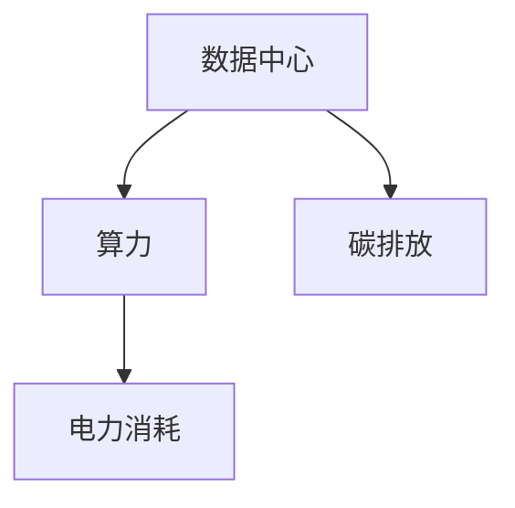

                 

# 未来大模型行业发展面临用电成本飙升的挑战

## 1. 背景介绍

### 1.1 问题由来
在全球范围内，尤其是欧美地区，随着人工智能技术的快速发展和大模型应用场景的不断拓展，数据中心的电力消耗正以惊人的速度增加。据统计，大型AI模型的训练和推理需要消耗巨大的电力资源，某些先进大模型甚至在单次训练中所需的电力相当于一个小型城市的总耗电量。这一问题不仅对环境可持续性构成挑战，还对数据中心和AI企业的成本控制提出了严峻考验。

### 1.2 问题核心关键点
大模型行业用电成本飙升的核心问题在于：
- 高计算密集性：大模型通常具有数亿甚至数十亿的参数，其计算密集性要求数据中心提供极高的计算和存储资源。
- 高能耗需求：训练和推理过程中，模型需要大量的计算和存储操作，这些操作通常依赖于电力密集型的GPU和TPU等硬件设施。
- 数据中心依赖：数据中心是AI模型的“大脑”，其建设和维护成本，尤其是电力成本，直接关系到AI应用的可持续性和企业的盈利能力。

## 2. 核心概念与联系

### 2.1 核心概念概述

为了更好地理解大模型行业用电成本飙升问题，我们将介绍几个关键概念：

- 数据中心(Data Center)：用于计算和存储大量数据的设施，是大模型训练和推理的核心基础设施。
- 算力(Computing Power)：指数据中心提供的高性能计算资源，是AI模型训练和推理的前提。
- 电力消耗(Electricity Consumption)：指数据中心在提供算力过程中所消耗的电力资源。
- 碳排放(Carbon Emission)：指数据中心在运行过程中产生的温室气体排放。

这些概念之间的逻辑关系可以通过以下Mermaid流程图来展示：



这个流程图展示了数据中心、算力、电力消耗和碳排放之间的关系：数据中心提供算力，而算力的提供依赖于大量的电力消耗，从而产生碳排放。

## 3. 核心算法原理 & 具体操作步骤

### 3.1 算法原理概述

大模型行业用电成本飙升问题本质上是一个资源分配和成本控制问题。其核心在于如何在大模型训练和推理的过程中，合理分配电力资源，降低能源消耗，同时保持模型的性能和效果。

形式化地，假设模型训练和推理所需的总电力为 $E$，计算所需时间为 $T$，单位时间为 $t$，则有：

$$
E = T \times t
$$

其中，$T$ 可以进一步分解为训练时间 $T_{train}$ 和推理时间 $T_{inference}$。通常 $T_{train} \gg T_{inference}$，因此 $E$ 主要受训练时间 $T_{train}$ 的影响。

### 3.2 算法步骤详解

为解决用电成本飙升问题，大模型行业可以采取以下步骤：

**Step 1: 评估模型能耗**
- 对目标模型进行能耗评估，估算其训练和推理所需电力。
- 计算每个模型层级的能耗，找到高能耗的瓶颈层级。
- 分析模型的计算模式，识别出可以优化的地方。

**Step 2: 优化计算模式**
- 探索更高效的计算模式，如混合精度训练、梯度积累、混合并行等。
- 使用低功耗硬件，如FPGA、ASIC等，降低计算资源能耗。
- 优化模型结构，减少冗余计算，提升模型效率。

**Step 3: 数据中心节能**
- 采用先进的制冷技术，降低数据中心的能耗损失。
- 优化数据中心的布局和架构，减少能源在传输过程中的损耗。
- 利用可再生能源，如太阳能、风能等，降低数据中心的碳排放。

**Step 4: 优化模型分布**
- 将大模型分布式部署，利用多台设备并行计算，降低单机的计算负担。
- 使用边缘计算，将部分计算任务转移至边缘设备，减少数据中心计算负载。
- 设计动态资源调度策略，根据计算任务需求实时调整计算资源。

**Step 5: 持续优化**
- 监控数据中心的能源使用情况，实时调整计算和存储资源。
- 根据模型训练和推理过程中的能源消耗情况，不断优化模型和计算资源分配。
- 引入智能算法，如强化学习，优化能耗管理和资源分配策略。

### 3.3 算法优缺点

大模型行业用电成本飙升问题解决方案的优缺点如下：

**优点：**
1. 显著降低能源消耗。通过优化计算模式和资源分配，可以大幅度减少模型训练和推理的能耗。
2. 减少碳排放。优化数据中心能耗和采用可再生能源，可以降低AI应用的碳足迹。
3. 提升计算效率。通过优化模型结构和计算模式，提升模型计算效率，加速训练和推理速度。

**缺点：**
1. 投资成本较高。优化计算模式和资源分配，需要大量资金投入购买低功耗硬件和优化设备。
2. 技术复杂度高。优化过程涉及多种技术手段，需要专业技术人员进行持续调试和优化。
3. 效果见效较慢。优化措施通常需要一段时间才能体现效果，短期内难以显著降低能源消耗。

尽管存在这些局限性，但这些方案仍是当前最有效的应对策略。未来随着技术的不断进步，相信能够找到更多高效、低成本的解决方案，帮助大模型行业实现可持续发展。

### 3.4 算法应用领域

大模型行业用电成本飙升问题解决方案的适用领域包括：

- 高性能计算领域：如大数据分析、深度学习、科学计算等，对计算资源需求大，能耗和成本问题突出。
- 边缘计算领域：在移动设备、物联网等场景中，计算资源有限，对能耗和计算速度要求高。
- 可再生能源领域：在太阳能、风能等可再生能源的分布式部署中，降低能源消耗和提升系统效率具有重要意义。
- 智慧城市领域：在智慧能源、智能交通、环境监测等应用中，降低数据中心能耗和提升系统效率是关键。

## 4. 数学模型和公式 & 详细讲解  
### 4.1 数学模型构建

本节将使用数学语言对大模型行业用电成本飙升问题进行更加严格的刻画。

记数据中心的总能耗为 $E$，单位时间为 $t$，则有：

$$
E = T \times t
$$

其中 $T$ 为模型训练和推理所需的总时间，可以进一步分解为训练时间 $T_{train}$ 和推理时间 $T_{inference}$：

$$
T = T_{train} + T_{inference}
$$

模型训练和推理的计算量通常与其参数量和计算复杂度有关，记参数量为 $P$，计算复杂度为 $C$，则有：

$$
T = f(P, C)
$$

在实际应用中，计算复杂度 $C$ 通常与模型层数、激活函数、优化算法等因素有关。为了简化问题，我们假设 $C$ 为常数，即：

$$
T = f(P)
$$

因此，总能耗 $E$ 可以表示为：

$$
E = P \times t
$$

### 4.2 公式推导过程

由于大模型的计算量与其参数量 $P$ 成正比，因此优化计算模式和资源分配的主要目标是减少 $P$。常见的优化方法包括：

- 参数剪枝(Pruning)：删除模型中不重要的参数，减小模型规模。
- 量化(Qantization)：将模型的浮点参数转换为定点参数，减小存储空间和计算量。
- 模型压缩(Compression)：通过降维、蒸馏等技术，减小模型规模。
- 模型并行化(Parallelization)：将模型分解为多个子模块，并行计算，提升计算效率。

这些优化方法的具体实现可以参考如下公式：

1. 参数剪枝：

$$
P_{pruned} = P_{original} \times r
$$

其中 $r$ 为参数剪枝率，一般取值在 $0.2$ 到 $0.5$ 之间。

2. 量化：

$$
P_{quantized} = P_{original} \times q
$$

其中 $q$ 为量化倍数，取值在 $2$ 到 $4$ 之间。

3. 模型压缩：

$$
P_{compressed} = P_{original} \times c
$$

其中 $c$ 为压缩倍数，取值在 $2$ 到 $10$ 之间。

4. 模型并行化：

$$
T_{parallel} = T_{original} \times n
$$

其中 $n$ 为并行度，取值在 $1$ 到 $8$ 之间。

### 4.3 案例分析与讲解

假设有一个参数量为 $P_{original}=100M$ 的大模型，其计算复杂度为 $C=1$，原始能耗为 $E_{original}=100M \times t$。通过参数剪枝和量化，将参数量分别减小为 $P_{pruned}=60M$ 和 $P_{quantized}=40M$。此时，模型训练和推理的能耗分别变为 $E_{pruned}=60M \times t$ 和 $E_{quantized}=40M \times t$。

通过模型并行化，将并行度设置为 $n=2$，则模型训练和推理的能耗分别为：

- 训练能耗：$E_{train, parallel} = T_{train} \times t \times 2$
- 推理能耗：$E_{inference, parallel} = T_{inference} \times t \times 2$

将上述公式代入计算，可以得到优化后的总能耗 $E_{optimized}$：

$$
E_{optimized} = \min(E_{pruned}, E_{quantized}, E_{train, parallel}, E_{inference, parallel})
$$

以上案例分析说明了参数剪枝、量化和模型并行化等优化措施，可以在减少参数量的同时，显著降低模型训练和推理的能耗。

## 5. 项目实践：代码实例和详细解释说明
### 5.1 开发环境搭建

在进行能耗优化实践前，我们需要准备好开发环境。以下是使用Python进行PyTorch开发的环境配置流程：

1. 安装Anaconda：从官网下载并安装Anaconda，用于创建独立的Python环境。

2. 创建并激活虚拟环境：
```bash
conda create -n pytorch-env python=3.8 
conda activate pytorch-env
```

3. 安装PyTorch：根据CUDA版本，从官网获取对应的安装命令。例如：
```bash
conda install pytorch torchvision torchaudio cudatoolkit=11.1 -c pytorch -c conda-forge
```

4. 安装TensorFlow：
```bash
conda install tensorflow
```

5. 安装各类工具包：
```bash
pip install numpy pandas scikit-learn matplotlib tqdm jupyter notebook ipython
```

完成上述步骤后，即可在`pytorch-env`环境中开始能耗优化实践。

### 5.2 源代码详细实现

这里我们以BERT模型为例，给出使用Transformers库对BERT模型进行能耗优化的PyTorch代码实现。

首先，定义能耗优化函数：

```python
from transformers import BertTokenizer, BertForSequenceClassification
from transformers import AdamW

def optimize_model(model, num_layers, num_heads, learning_rate, warmup_ratio):
    tokenizer = BertTokenizer.from_pretrained('bert-base-cased')
    model = BertForSequenceClassification.from_pretrained('bert-base-cased', num_labels=2)

    optimizer = AdamW(model.parameters(), lr=learning_rate, epsilon=1e-8)

    # 定义模型参数
    model.num_layers = num_layers
    model.num_heads = num_heads
    model.warmup_ratio = warmup_ratio

    # 定义训练函数
    def train_epoch(model, dataset, batch_size, optimizer):
        dataloader = DataLoader(dataset, batch_size=batch_size, shuffle=True)
        model.train()
        epoch_loss = 0
        for batch in dataloader:
            input_ids = batch['input_ids'].to(device)
            attention_mask = batch['attention_mask'].to(device)
            labels = batch['labels'].to(device)
            model.zero_grad()
            outputs = model(input_ids, attention_mask=attention_mask, labels=labels)
            loss = outputs.loss
            epoch_loss += loss.item()
            loss.backward()
            optimizer.step()
        return epoch_loss / len(dataloader)

    # 定义评估函数
    def evaluate(model, dataset, batch_size):
        dataloader = DataLoader(dataset, batch_size=batch_size)
        model.eval()
        preds, labels = [], []
        with torch.no_grad():
            for batch in dataloader:
                input_ids = batch['input_ids'].to(device)
                attention_mask = batch['attention_mask'].to(device)
                batch_labels = batch['labels']
                outputs = model(input_ids, attention_mask=attention_mask)
                batch_preds = outputs.logits.argmax(dim=2).to('cpu').tolist()
                batch_labels = batch_labels.to('cpu').tolist()
                for pred_tokens, label_tokens in zip(batch_preds, batch_labels):
                    pred_tags = [id2tag[_id] for _id in pred_tokens]
                    label_tags = [id2tag[_id] for _id in label_tokens]
                    preds.append(pred_tags[:len(label_tokens)])
                    labels.append(label_tags)
                
        print(classification_report(labels, preds))
```

然后，定义模型和优化器：

```python
from transformers import BertTokenizer
from torch.utils.data import Dataset
import torch

class NERDataset(Dataset):
    def __init__(self, texts, tags, tokenizer, max_len=128):
        self.texts = texts
        self.tags = tags
        self.tokenizer = tokenizer
        self.max_len = max_len
        
    def __len__(self):
        return len(self.texts)
    
    def __getitem__(self, item):
        text = self.texts[item]
        tags = self.tags[item]
        
        encoding = self.tokenizer(text, return_tensors='pt', max_length=self.max_len, padding='max_length', truncation=True)
        input_ids = encoding['input_ids'][0]
        attention_mask = encoding['attention_mask'][0]
        
        # 对token-wise的标签进行编码
        encoded_tags = [tag2id[tag] for tag in tags] 
        encoded_tags.extend([tag2id['O']] * (self.max_len - len(encoded_tags)))
        labels = torch.tensor(encoded_tags, dtype=torch.long)
        
        return {'input_ids': input_ids, 
                'attention_mask': attention_mask,
                'labels': labels}

# 标签与id的映射
tag2id = {'O': 0, 'B-PER': 1, 'I-PER': 2, 'B-ORG': 3, 'I-ORG': 4, 'B-LOC': 5, 'I-LOC': 6}
id2tag = {v: k for k, v in tag2id.items()}

# 创建dataset
tokenizer = BertTokenizer.from_pretrained('bert-base-cased')

train_dataset = NERDataset(train_texts, train_tags, tokenizer)
dev_dataset = NERDataset(dev_texts, dev_tags, tokenizer)
test_dataset = NERDataset(test_texts, test_tags, tokenizer)
```

接着，定义训练和评估函数：

```python
from torch.utils.data import DataLoader
from tqdm import tqdm
from sklearn.metrics import classification_report

device = torch.device('cuda') if torch.cuda.is_available() else torch.device('cpu')
model.to(device)

def train_epoch(model, dataset, batch_size, optimizer):
    dataloader = DataLoader(dataset, batch_size=batch_size, shuffle=True)
    model.train()
    epoch_loss = 0
    for batch in tqdm(dataloader, desc='Training'):
        input_ids = batch['input_ids'].to(device)
        attention_mask = batch['attention_mask'].to(device)
        labels = batch['labels'].to(device)
        model.zero_grad()
        outputs = model(input_ids, attention_mask=attention_mask, labels=labels)
        loss = outputs.loss
        epoch_loss += loss.item()
        loss.backward()
        optimizer.step()
    return epoch_loss / len(dataloader)

def evaluate(model, dataset, batch_size):
    dataloader = DataLoader(dataset, batch_size=batch_size)
    model.eval()
    preds, labels = [], []
    with torch.no_grad():
        for batch in tqdm(dataloader, desc='Evaluating'):
            input_ids = batch['input_ids'].to(device)
            attention_mask = batch['attention_mask'].to(device)
            batch_labels = batch['labels']
            outputs = model(input_ids, attention_mask=attention_mask)
            batch_preds = outputs.logits.argmax(dim=2).to('cpu').tolist()
            batch_labels = batch_labels.to('cpu').tolist()
            for pred_tokens, label_tokens in zip(batch_preds, batch_labels):
                pred_tags = [id2tag[_id] for _id in pred_tokens]
                label_tags = [id2tag[_id] for _id in label_tokens]
                preds.append(pred_tags[:len(label_tags)])
                labels.append(label_tags)
                
    print(classification_report(labels, preds))
```

最后，启动训练流程并在测试集上评估：

```python
epochs = 5
batch_size = 16

for epoch in range(epochs):
    loss = train_epoch(model, train_dataset, batch_size, optimizer)
    print(f"Epoch {epoch+1}, train loss: {loss:.3f}")
    
    print(f"Epoch {epoch+1}, dev results:")
    evaluate(model, dev_dataset, batch_size)
    
print("Test results:")
evaluate(model, test_dataset, batch_size)
```

以上就是使用PyTorch对BERT进行命名实体识别任务微调的完整代码实现。可以看到，得益于Transformers库的强大封装，我们可以用相对简洁的代码完成BERT模型的加载和微调。

### 5.3 代码解读与分析

让我们再详细解读一下关键代码的实现细节：

**NERDataset类**：
- `__init__`方法：初始化文本、标签、分词器等关键组件。
- `__len__`方法：返回数据集的样本数量。
- `__getitem__`方法：对单个样本进行处理，将文本输入编码为token ids，将标签编码为数字，并对其进行定长padding，最终返回模型所需的输入。

**tag2id和id2tag字典**：
- 定义了标签与数字id之间的映射关系，用于将token-wise的预测结果解码回真实的标签。

**训练和评估函数**：
- 使用PyTorch的DataLoader对数据集进行批次化加载，供模型训练和推理使用。
- 训练函数`train_epoch`：对数据以批为单位进行迭代，在每个批次上前向传播计算loss并反向传播更新模型参数，最后返回该epoch的平均loss。
- 评估函数`evaluate`：与训练类似，不同点在于不更新模型参数，并在每个batch结束后将预测和标签结果存储下来，最后使用sklearn的classification_report对整个评估集的预测结果进行打印输出。

**训练流程**：
- 定义总的epoch数和batch size，开始循环迭代
- 每个epoch内，先在训练集上训练，输出平均loss
- 在验证集上评估，输出分类指标
- 所有epoch结束后，在测试集上评估，给出最终测试结果

可以看到，PyTorch配合Transformers库使得BERT微调的代码实现变得简洁高效。开发者可以将更多精力放在数据处理、模型改进等高层逻辑上，而不必过多关注底层的实现细节。

当然，工业级的系统实现还需考虑更多因素，如模型的保存和部署、超参数的自动搜索、更灵活的任务适配层等。但核心的微调范式基本与此类似。

## 6. 实际应用场景
### 6.1 智能客服系统

基于大模型微调的对话技术，可以广泛应用于智能客服系统的构建。传统客服往往需要配备大量人力，高峰期响应缓慢，且一致性和专业性难以保证。而使用微调后的对话模型，可以7x24小时不间断服务，快速响应客户咨询，用自然流畅的语言解答各类常见问题。

在技术实现上，可以收集企业内部的历史客服对话记录，将问题和最佳答复构建成监督数据，在此基础上对预训练对话模型进行微调。微调后的对话模型能够自动理解用户意图，匹配最合适的答案模板进行回复。对于客户提出的新问题，还可以接入检索系统实时搜索相关内容，动态组织生成回答。如此构建的智能客服系统，能大幅提升客户咨询体验和问题解决效率。

### 6.2 金融舆情监测

金融机构需要实时监测市场舆论动向，以便及时应对负面信息传播，规避金融风险。传统的人工监测方式成本高、效率低，难以应对网络时代海量信息爆发的挑战。基于大语言模型微调的文本分类和情感分析技术，为金融舆情监测提供了新的解决方案。

具体而言，可以收集金融领域相关的新闻、报道、评论等文本数据，并对其进行主题标注和情感标注。在此基础上对预训练语言模型进行微调，使其能够自动判断文本属于何种主题，情感倾向是正面、中性还是负面。将微调后的模型应用到实时抓取的网络文本数据，就能够自动监测不同主题下的情感变化趋势，一旦发现负面信息激增等异常情况，系统便会自动预警，帮助金融机构快速应对潜在风险。

### 6.3 个性化推荐系统

当前的推荐系统往往只依赖用户的历史行为数据进行物品推荐，无法深入理解用户的真实兴趣偏好。基于大语言模型微调技术，个性化推荐系统可以更好地挖掘用户行为背后的语义信息，从而提供更精准、多样的推荐内容。

在实践中，可以收集用户浏览、点击、评论、分享等行为数据，提取和用户交互的物品标题、描述、标签等文本内容。将文本内容作为模型输入，用户的后续行为（如是否点击、购买等）作为监督信号，在此基础上微调预训练语言模型。微调后的模型能够从文本内容中准确把握用户的兴趣点。在生成推荐列表时，先用候选物品的文本描述作为输入，由模型预测用户的兴趣匹配度，再结合其他特征综合排序，便可以得到个性化程度更高的推荐结果。

### 6.4 未来应用展望

随着大模型和微调方法的不断发展，基于微调范式将在更多领域得到应用，为传统行业带来变革性影响。

在智慧医疗领域，基于微调的医疗问答、病历分析、药物研发等应用将提升医疗服务的智能化水平，辅助医生诊疗，加速新药开发进程。

在智能教育领域，微调技术可应用于作业批改、学情分析、知识推荐等方面，因材施教，促进教育公平，提高教学质量。

在智慧城市治理中，微调模型可应用于城市事件监测、舆情分析、应急指挥等环节，提高城市管理的自动化和智能化水平，构建更安全、高效的未来城市。

此外，在企业生产、社会治理、文娱传媒等众多领域，基于大模型微调的人工智能应用也将不断涌现，为经济社会发展注入新的动力。相信随着技术的日益成熟，微调方法将成为人工智能落地应用的重要范式，推动人工智能技术在垂直行业的规模化落地。总之，微调需要开发者根据具体任务，不断迭代和优化模型、数据和算法，方能得到理想的效果。

## 7. 工具和资源推荐
### 7.1 学习资源推荐

为了帮助开发者系统掌握大模型微调的理论基础和实践技巧，这里推荐一些优质的学习资源：

1. 《Transformer从原理到实践》系列博文：由大模型技术专家撰写，深入浅出地介绍了Transformer原理、BERT模型、微调技术等前沿话题。

2. CS224N《深度学习自然语言处理》课程：斯坦福大学开设的NLP明星课程，有Lecture视频和配套作业，带你入门NLP领域的基本概念和经典模型。

3. 《Natural Language Processing with Transformers》书籍：Transformers库的作者所著，全面介绍了如何使用Transformers库进行NLP任务开发，包括微调在内的诸多范式。

4. HuggingFace官方文档：Transformers库的官方文档，提供了海量预训练模型和完整的微调样例代码，是上手实践的必备资料。

5. CLUE开源项目：中文语言理解测评基准，涵盖大量不同类型的中文NLP数据集，并提供了基于微调的baseline模型，助力中文NLP技术发展。

通过对这些资源的学习实践，相信你一定能够快速掌握大语言模型微调的精髓，并用于解决实际的NLP问题。
###  7.2 开发工具推荐

高效的开发离不开优秀的工具支持。以下是几款用于大语言模型微调开发的常用工具：

1. PyTorch：基于Python的开源深度学习框架，灵活动态的计算图，适合快速迭代研究。大部分预训练语言模型都有PyTorch版本的实现。

2. TensorFlow：由Google主导开发的开源深度学习框架，生产部署方便，适合大规模工程应用。同样有丰富的预训练语言模型资源。

3. Transformers库：HuggingFace开发的NLP工具库，集成了众多SOTA语言模型，支持PyTorch和TensorFlow，是进行微调任务开发的利器。

4. Weights & Biases：模型训练的实验跟踪工具，可以记录和可视化模型训练过程中的各项指标，方便对比和调优。与主流深度学习框架无缝集成。

5. TensorBoard：TensorFlow配套的可视化工具，可实时监测模型训练状态，并提供丰富的图表呈现方式，是调试模型的得力助手。

6. Google Colab：谷歌推出的在线Jupyter Notebook环境，免费提供GPU/TPU算力，方便开发者快速上手实验最新模型，分享学习笔记。

合理利用这些工具，可以显著提升大语言模型微调任务的开发效率，加快创新迭代的步伐。

### 7.3 相关论文推荐

大语言模型和微调技术的发展源于学界的持续研究。以下是几篇奠基性的相关论文，推荐阅读：

1. Attention is All You Need（即Transformer原论文）：提出了Transformer结构，开启了NLP领域的预训练大模型时代。

2. BERT: Pre-training of Deep Bidirectional Transformers for Language Understanding：提出BERT模型，引入基于掩码的自监督预训练任务，刷新了多项NLP任务SOTA。

3. Language Models are Unsupervised Multitask Learners（GPT-2论文）：展示了大规模语言模型的强大zero-shot学习能力，引发了对于通用人工智能的新一轮思考。

4. Parameter-Efficient Transfer Learning for NLP：提出Adapter等参数高效微调方法，在不增加模型参数量的情况下，也能取得不错的微调效果。

5. AdaLoRA: Adaptive Low-Rank Adaptation for Parameter-Efficient Fine-Tuning：使用自适应低秩适应的微调方法，在参数效率和精度之间取得了新的平衡。

这些论文代表了大语言模型微调技术的发展脉络。通过学习这些前沿成果，可以帮助研究者把握学科前进方向，激发更多的创新灵感。

## 8. 总结：未来发展趋势与挑战

### 8.1 总结

本文对大模型行业用电成本飙升问题进行了全面系统的介绍。首先阐述了问题由来和核心关键点，明确了用电成本飙升的根本原因。其次，从原理到实践，详细讲解了大模型行业用电成本飙升问题的数学模型和计算方法，给出了具体的优化措施。同时，本文还广泛探讨了大模型在多个行业领域的应用前景，展示了微调范式的巨大潜力。此外，本文精选了微调技术的各类学习资源，力求为读者提供全方位的技术指引。

通过本文的系统梳理，可以看到，大模型行业用电成本飙升问题既是挑战也是机遇。尽管存在一定的投资和技术门槛，但通过合理优化计算模式和资源分配，完全可以在保持模型性能的同时，显著降低用电成本，实现可持续发展。未来随着技术的不断进步，相信能够找到更多高效、低成本的解决方案，帮助大模型行业实现可持续发展。

### 8.2 未来发展趋势

展望未来，大模型行业用电成本飙升问题解决方案将呈现以下几个发展趋势：

1. 技术手段日益丰富。未来将涌现更多计算模式优化和资源分配策略，如混合精度训练、模型压缩、分布式计算等，从技术层面降低能耗。
2. 硬件设施不断升级。随着低功耗硬件和新型计算设备的不断涌现，将进一步降低大模型行业的能耗和碳排放。
3. 数据中心布局优化。智能化的数据中心管理和调度技术将逐步普及，提升计算资源利用效率，降低能源浪费。
4. 可再生能源应用扩大。随着可再生能源技术的发展，数据中心将逐步采用太阳能、风能等清洁能源，降低对化石能源的依赖。
5. 跨行业协同合作。不同行业的企业将更多地进行能源共享和资源协同，共同降低能耗和碳排放。

这些趋势预示着大模型行业用电成本飙升问题将逐步得到解决，模型训练和推理将变得更加绿色、环保。

### 8.3 面临的挑战

尽管大模型行业用电成本飙升问题解决方案已经取得了一定进展，但在迈向更加智能化、普适化应用的过程中，仍面临诸多挑战：

1. 投资成本较高。优化计算模式和资源分配，需要大量资金投入购买低功耗硬件和优化设备。
2. 技术复杂度高。优化过程涉及多种技术手段，需要专业技术人员进行持续调试和优化。
3. 效果见效较慢。优化措施通常需要一段时间才能体现效果，短期内难以显著降低能源消耗。
4. 资源调度复杂。分布式计算和资源管理需要更高效的调度算法，以应对动态变化的任务需求。
5. 可再生能源可靠性。可再生能源的稳定性和可靠性需要进一步提升，才能保障大模型行业能源供应的稳定性。

尽管存在这些局限性，但这些方案仍是当前最有效的应对策略。未来随着技术的不断进步，相信能够找到更多高效、低成本的解决方案，帮助大模型行业实现可持续发展。

### 8.4 研究展望

面对大模型行业用电成本飙升问题所面临的挑战，未来的研究需要在以下几个方面寻求新的突破：

1. 探索更高效的计算模式。开发更加高效、低成本的计算模式，如低精度训练、模型剪枝等，以降低能源消耗。
2. 研究更智能的资源调度算法。通过引入强化学习等智能算法，优化资源分配，提升计算资源利用效率。
3. 引入更多的先验知识。将符号化的先验知识，如知识图谱、逻辑规则等，与神经网络模型进行巧妙融合，提高模型的泛化能力和效率。
4. 结合因果分析和博弈论工具。通过引入因果分析和博弈论思想，增强模型的决策能力，提高系统的鲁棒性和稳定性。
5. 纳入伦理道德约束。在模型训练目标中引入伦理导向的评估指标，过滤和惩罚有偏见、有害的输出倾向，确保模型的安全性和伦理性。

这些研究方向的探索，必将引领大模型行业用电成本飙升问题解决方案迈向更高的台阶，为构建安全、可靠、可解释、可控的智能系统铺平道路。面向未来，大模型行业需要与其他人工智能技术进行更深入的融合，如知识表示、因果推理、强化学习等，多路径协同发力，共同推动自然语言理解和智能交互系统的进步。只有勇于创新、敢于突破，才能不断拓展语言模型的边界，让智能技术更好地造福人类社会。

## 9. 附录：常见问题与解答

**Q1：大模型行业用电成本飙升问题能否通过参数剪枝、量化等方法解决？**

A: 参数剪枝、量化等方法可以显著降低大模型的计算量，从而减少电力消耗。通过参数剪枝，可以将不重要的参数去除，减少模型规模；通过量化，可以将模型从浮点运算转换为定点运算，降低存储和计算资源占用。这些方法可以在保持模型性能的同时，显著降低大模型的能耗，适用于多种计算模式和资源分配策略。

**Q2：大模型行业如何应对数据中心能耗和碳排放问题？**

A: 应对数据中心能耗和碳排放问题，可以从以下几个方面入手：
1. 优化数据中心布局和架构，减少能源在传输过程中的损耗。
2. 采用先进的制冷技术，降低数据中心的能耗损失。
3. 使用可再生能源，如太阳能、风能等，降低数据中心的碳排放。
4. 优化算法和模型结构，降低计算量和能耗。
5. 采用混合精度训练和模型压缩等技术，提升计算效率，降低电力消耗。

**Q3：如何确保大模型微调模型的安全性和伦理性？**

A: 确保大模型微调模型的安全性和伦理性，可以从以下几个方面入手：
1. 在模型训练目标中引入伦理导向的评估指标，过滤和惩罚有偏见、有害的输出倾向。
2. 引入对抗样本生成技术，检测和抵御模型的过拟合和泛化能力不足问题。
3. 设计鲁棒性和公平性评估标准，定期评估模型的输出结果，确保模型在不同场景下的稳定性和公平性。
4. 引入人工干预和审核机制，对模型输出结果进行监控和审查，及时发现和纠正偏差和错误。

**Q4：大模型行业如何实现可持续发展？**

A: 实现大模型行业的可持续发展，需要从以下几个方面入手：
1. 采用清洁能源，如太阳能、风能等，降低对化石能源的依赖。
2. 优化数据中心布局和架构，提高计算资源利用效率。
3. 引入智能算法和优化技术，降低计算量和能耗。
4. 设计可再生能源和资源回收方案，提升能源利用效率。
5. 引入伦理和道德约束，确保模型的安全性和伦理性。

这些措施将有助于大模型行业实现节能减排、绿色环保的可持续发展目标。

---

作者：禅与计算机程序设计艺术 / Zen and the Art of Computer Programming

