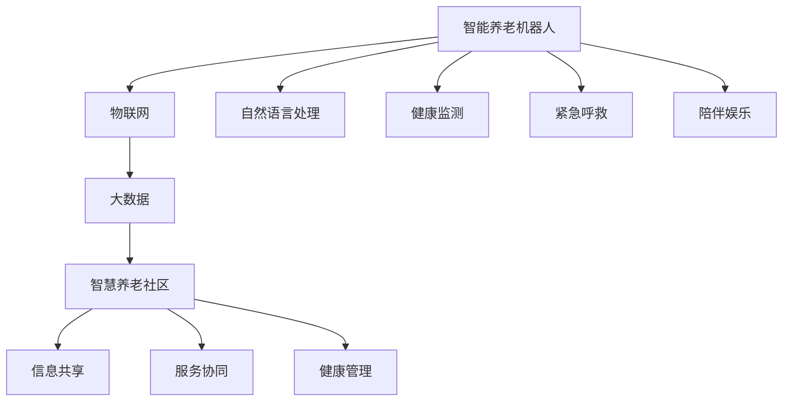

                 

## 1. 背景介绍

### 1.1 问题由来

随着全球人口老龄化的加速，智能养老已成为社会关注的热点话题。传统的养老模式难以满足日益增长的老年群体的多样化需求，如何利用先进的科技手段提升养老服务质量，提高老年人的生活质量，是亟待解决的问题。

### 1.2 问题核心关键点

本课题聚焦于未来智能养老的实现，特别是智能养老机器人与智慧养老社区的构建。通过深度学习、物联网、大数据等前沿技术，实现对老年群体的全方位、全天候、个性化的智能服务。具体来说，智能养老机器人将承担日常生活护理、健康监测、紧急呼救、陪伴娱乐等职责；智慧养老社区则通过信息共享、服务协同、健康管理等手段，提升社区养老服务的智能化水平。

## 2. 核心概念与联系

### 2.1 核心概念概述

为更好地理解未来智能养老系统的构建，本节将介绍几个密切相关的核心概念：

- **智能养老机器人**：融合语音识别、图像识别、自然语言处理、计算机视觉等多种技术，具备强大的交互和感知能力，能提供个性化、连续性的智能养老服务。
- **智慧养老社区**：基于物联网、云计算、大数据等技术，通过构建虚拟与现实结合的智能养老环境，实现社区内养老服务的全面数字化、智能化。
- **物联网(IoT)**：通过传感器、RFID、二维码等技术，将各种设备和物品接入网络，实现对养老对象的全面监测和数据分析。
- **大数据**：用于存储、处理和分析大规模养老数据，提供决策支持，优化养老服务流程。
- **自然语言处理(NLP)**：使机器人能够理解并回应用户的自然语言，提供更流畅、自然的交互体验。
- **健康监测**：通过各种传感器监测老年人的健康状况，包括心率、血压、血糖、睡眠质量等。
- **紧急呼救**：在老年人出现健康危机时，能够迅速响应并报警。
- **陪伴娱乐**：通过多媒体设备、游戏等娱乐形式，缓解老年人的孤独和无聊。

这些核心概念之间的逻辑关系可以通过以下Mermaid流程图来展示：



这个流程图展示了一系列的逻辑链条，从智能养老机器人出发，通过物联网和大数据技术，与智慧养老社区的各种功能模块相连接，最终实现了全方位的智能养老服务。

## 3. 核心算法原理 & 具体操作步骤

### 3.1 算法原理概述

未来智能养老系统的核心算法原理基于深度学习和大数据技术的结合，主要包括以下几个方面：

1. **深度学习模型训练**：使用卷积神经网络(CNN)、循环神经网络(RNN)、长短期记忆网络(LSTM)等深度学习模型，对老年人的面部图像、语音信号、生理数据等进行建模和预测。
2. **自然语言处理**：通过对话生成模型、意图识别模型、情感分析模型等，实现与老年人的自然语言交互。
3. **物联网数据融合**：利用数据融合技术，将来自不同设备的传感器数据进行整合和分析，提供综合的养老服务支持。
4. **大数据分析**：运用聚类分析、关联规则挖掘、时间序列预测等算法，分析老年群体的行为特征和健康状况，提供个性化的服务建议。

### 3.2 算法步骤详解

以下是未来智能养老系统核心算法的详细步骤：

**Step 1: 数据收集与预处理**
- 收集老年人面部图像、语音、生理数据等原始数据。
- 清洗、归一化、标注数据，形成模型训练所需的样本集。

**Step 2: 深度学习模型训练**
- 使用CNN对面部图像进行表情、情绪识别。
- 使用RNN对语音信号进行情感分析。
- 使用LSTM对生理数据进行健康预测。
- 使用对话生成模型进行自然语言交互。

**Step 3: 数据融合与特征提取**
- 利用IoT设备采集老年人各项生理指标。
- 通过数据融合技术，将不同来源的数据进行整合和分析。
- 使用大数据技术提取老年群体的行为特征和健康趋势。

**Step 4: 服务协同与智能推荐**
- 将分析结果输入智慧养老社区的服务协同平台。
- 根据分析结果和老年人需求，提供个性化的智能推荐。
- 通过服务协同平台，实现不同服务模块间的无缝对接。

**Step 5: 服务监控与预警**
- 实时监控老年人的生理数据，分析其健康状况。
- 一旦发现异常，立即触发预警机制，通知相关人员处理。

**Step 6: 服务评价与反馈**
- 收集老年人对服务的评价和反馈。
- 通过大数据分析，不断优化和改进服务质量。

### 3.3 算法优缺点

未来智能养老系统的算法具有以下优点：

1. **精准度较高**：通过深度学习和大数据技术，能够精准分析老年人的行为特征和健康状况，提供个性化服务。
2. **连续性较好**：智能养老机器人可以24小时不间断地提供服务，确保老年人得到持续关怀。
3. **交互性强**：通过自然语言处理技术，机器人能够理解并回应用户的自然语言，提升用户体验。
4. **可扩展性好**：不同设备和服务模块之间的数据互联互通，方便未来功能的扩展和升级。

同时，该算法也存在以下局限性：

1. **依赖技术成熟度**：深度学习和IoT技术的成熟度直接影响系统的性能。
2. **数据隐私问题**：大规模数据的收集和存储，可能涉及老年人的隐私问题，需要加强数据保护。
3. **系统复杂性**：不同设备和数据源的整合，增加了系统的复杂性和维护难度。
4. **实时性要求高**：实时处理和响应能力是系统的关键指标，对硬件设施和网络条件要求较高。

### 3.4 算法应用领域

未来智能养老系统的算法主要应用于以下领域：

1. **智能养老机器人**：用于日常生活护理、健康监测、紧急呼救、陪伴娱乐等场景。
2. **智慧养老社区**：用于信息共享、服务协同、健康管理等社区养老服务。
3. **远程医疗**：通过视频通话、医疗影像分析等方式，提供远程医疗服务。
4. **认知康复**：使用虚拟现实和增强现实技术，进行老年人的认知康复训练。
5. **社交娱乐**：提供多媒体设备、游戏等娱乐形式，缓解老年人的孤独和无聊。

## 4. 数学模型和公式 & 详细讲解 & 举例说明

### 4.1 数学模型构建

本节将使用数学语言对未来智能养老系统的构建进行更加严格的刻画。

记智能养老机器人为 $R_{\theta}$，其中 $\theta$ 为模型参数。假设智慧养老社区内老年人面部图像为 $x_i$，语音信号为 $y_i$，生理数据为 $z_i$，健康预测模型为 $M_{\theta}$。

定义面部表情识别模型为 $M_{\theta}^f$，语音情感分析模型为 $M_{\theta}^v$，生理健康预测模型为 $M_{\theta}^p$，自然语言处理模型为 $M_{\theta}^l$。则面部表情识别模型的训练损失函数为：

$$
\mathcal{L}^f(\theta) = -\frac{1}{N}\sum_{i=1}^N \log \mathbb{P}(M_{\theta}^f(x_i) = \text{label}_i)
$$

其中 $\text{label}_i$ 为面部表情的标签。

类似地，语音情感分析模型的训练损失函数为：

$$
\mathcal{L}^v(\theta) = -\frac{1}{N}\sum_{i=1}^N \log \mathbb{P}(M_{\theta}^v(y_i) = \text{label}_i)
$$

生理健康预测模型的训练损失函数为：

$$
\mathcal{L}^p(\theta) = -\frac{1}{N}\sum_{i=1}^N \log \mathbb{P}(M_{\theta}^p(z_i) = \text{label}_i)
$$

其中 $\text{label}_i$ 为生理指标的标签。

自然语言处理模型的训练损失函数为：

$$
\mathcal{L}^l(\theta) = -\frac{1}{N}\sum_{i=1}^N \log \mathbb{P}(M_{\theta}^l(x_i, y_i) = \text{response}_i)
$$

其中 $\text{response}_i$ 为机器人对用户输入的自然语言回应的标签。

### 4.2 公式推导过程

以面部表情识别模型为例，进行公式推导。

假设模型 $M_{\theta}^f$ 在输入 $x_i$ 上的输出为 $\hat{y}_i$，表示模型预测面部表情的概率分布。真实标签 $\text{label}_i$ 为面部表情的标签，取值为 $1$ 到 $n$ 中的一个整数。则面部表情识别模型的训练损失函数为：

$$
\mathcal{L}^f(\theta) = -\frac{1}{N}\sum_{i=1}^N [\text{label}_i\log \hat{y}_i + (1-\text{label}_i)\log (1-\hat{y}_i)]
$$

将其代入经验风险公式，得：

$$
\mathcal{L}^f(\theta) = -\frac{1}{N}\sum_{i=1}^N [\text{label}_i\log M_{\theta}^f(x_i) + (1-\text{label}_i)\log(1-M_{\theta}^f(x_i))]
$$

根据链式法则，损失函数对参数 $\theta_k$ 的梯度为：

$$
\frac{\partial \mathcal{L}^f(\theta)}{\partial \theta_k} = -\frac{1}{N}\sum_{i=1}^N [(\text{label}_i-\hat{y}_i)\frac{\partial M_{\theta}^f(x_i)}{\partial \theta_k}]
$$

其中 $\frac{\partial M_{\theta}^f(x_i)}{\partial \theta_k}$ 可进一步递归展开，利用自动微分技术完成计算。

在得到损失函数的梯度后，即可带入参数更新公式，完成模型的迭代优化。重复上述过程直至收敛，最终得到适应面部表情识别的最优模型参数 $\theta^*$。

### 4.3 案例分析与讲解

以面部表情识别为例，分析深度学习模型的应用。

假设我们有一个包含 $100$ 个面部表情的标注数据集 $D=\{(x_i,\text{label}_i)\}_{i=1}^{100}$，其中 $x_i$ 为面部图像，$\text{label}_i$ 为面部表情标签。我们选择使用一个包含 $10$ 层卷积神经网络的面部表情识别模型，其中最后一层输出为 $10$ 维向量，表示 $10$ 种不同的面部表情。

在训练阶段，我们将 $D$ 划分为训练集 $D_{train}$ 和验证集 $D_{valid}$，其中训练集占总数据的 $80\%$，验证集占 $20\%$。我们使用 Adam 优化器进行模型训练，设置学习率为 $1e-3$，批大小为 $32$，迭代轮数为 $100$。

在每轮训练中，我们首先将数据集 $D_{train}$ 中的 $x_i$ 和 $\text{label}_i$ 输入模型 $M_{\theta}^f$，计算输出 $\hat{y}_i$，并计算损失函数 $\mathcal{L}^f(\theta)$。接着，我们通过反向传播算法计算梯度，并使用优化器更新模型参数。最后，在每轮训练结束时，我们在 $D_{valid}$ 上评估模型的性能，如果性能未见提升，则提前终止训练。

通过上述步骤，我们可以得到一个性能较好的面部表情识别模型，用于智慧养老社区的面部表情监测和情感分析。

## 5. 项目实践：代码实例和详细解释说明

### 5.1 开发环境搭建

在进行智能养老系统的开发前，我们需要准备好开发环境。以下是使用Python进行TensorFlow开发的环境配置流程：

1. 安装Anaconda：从官网下载并安装Anaconda，用于创建独立的Python环境。

2. 创建并激活虚拟环境：
```bash
conda create -n pytorch-env python=3.8 
conda activate pytorch-env
```

3. 安装TensorFlow：根据CUDA版本，从官网获取对应的安装命令。例如：
```bash
conda install tensorflow -c tensorflow -c conda-forge
```

4. 安装TensorFlow Hub：
```bash
pip install tensorflow-hub
```

5. 安装各类工具包：
```bash
pip install numpy pandas scikit-learn matplotlib tqdm jupyter notebook ipython
```

完成上述步骤后，即可在`pytorch-env`环境中开始智能养老系统的开发。

### 5.2 源代码详细实现

下面我们以面部表情识别为例，给出使用TensorFlow Hub进行面部表情识别的PyTorch代码实现。

首先，定义面部表情识别的数据处理函数：

```python
import tensorflow as tf
from tensorflow_hub import KerasLayer

class FacialExpressionRecognitionDataset(tf.data.Dataset):
    def __init__(self, filenames, labels):
        self.filenames = filenames
        self.labels = labels
        
    def __len__(self):
        return len(self.filenames)
    
    def __getitem__(self, index):
        filename = tf.io.read_file(self.filenames[index])
        image = tf.image.decode_jpeg(tf.io.read_file(filename))
        label = self.labels[index]
        return image, label

# 加载数据集
filenames = tf.io.gfile.glob('/path/to/data/filenames/*.jpg')
labels = tf.io.gfile.glob('/path/to/data/filenames/*.txt')
dataset = FacialExpressionRecognitionDataset(filenames, labels)

# 定义模型
model = tf.keras.Sequential([
    KerasLayer('https://tfhub.dev/google/face-landmark-detection/1', trainable=False),
    tf.keras.layers.Conv2D(32, 3, activation='relu', padding='same'),
    tf.keras.layers.MaxPooling2D(),
    tf.keras.layers.Conv2D(64, 3, activation='relu', padding='same'),
    tf.keras.layers.MaxPooling2D(),
    tf.keras.layers.Conv2D(128, 3, activation='relu', padding='same'),
    tf.keras.layers.MaxPooling2D(),
    tf.keras.layers.Flatten(),
    tf.keras.layers.Dense(64, activation='relu'),
    tf.keras.layers.Dense(10, activation='softmax')
])
model.compile(optimizer='adam', loss='sparse_categorical_crossentropy', metrics=['accuracy'])
```

然后，定义训练和评估函数：

```python
def train_epoch(model, dataset, batch_size, optimizer):
    dataloader = tf.data.Dataset.from_generator(
        lambda: dataset,
        (output_types=['float32'], output_shapes=[None, None, None, 3])
    ).batch(batch_size).prefetch(tf.data.experimental.AUTOTUNE)
    model.fit(dataloader, epochs=10, callbacks=[tf.keras.callbacks.EarlyStopping(patience=2)])

def evaluate(model, dataset, batch_size):
    dataloader = tf.data.Dataset.from_generator(
        lambda: dataset,
        (output_types=['float32'], output_shapes=[None, None, None, 3])
    ).batch(batch_size).prefetch(tf.data.experimental.AUTOTUNE)
    results = model.evaluate(dataloader, verbose=0)
    print('Accuracy:', results[1])
```

最后，启动训练流程并在测试集上评估：

```python
train_epoch(model, dataset, batch_size=32, optimizer=tf.keras.optimizers.Adam(learning_rate=1e-3))
evaluate(model, dataset, batch_size=32)
```

以上就是使用TensorFlow进行面部表情识别的完整代码实现。可以看到，TensorFlow的便捷性使得模型开发和训练变得更加高效。

### 5.3 代码解读与分析

让我们再详细解读一下关键代码的实现细节：

**FacialExpressionRecognitionDataset类**：
- `__init__`方法：初始化数据集的文件名和标签。
- `__len__`方法：返回数据集的样本数量。
- `__getitem__`方法：对单个样本进行处理，将图像和标签输入模型，并返回处理后的数据。

**模型定义**：
- 使用TensorFlow Hub加载预训练的面部表情检测模型，作为模型的第一层。
- 通过多个卷积层、池化层和全连接层，构建面部表情识别的深度学习模型。
- 使用Adam优化器和交叉熵损失函数，编译模型。

**训练和评估函数**：
- 使用TensorFlow的DataLoader将数据集转换为生成器，进行批处理和预取优化。
- 使用Keras的`fit`函数进行模型训练，设置学习率和提前停止条件。
- 使用`evaluate`函数在测试集上评估模型的性能。

**训练流程**：
- 定义训练次数和批大小。
- 在训练集上进行模型训练。
- 在验证集上进行性能评估。
- 输出最终训练结果。

可以看到，TensorFlow的强大封装使得模型开发变得更加简便。开发者可以将更多精力放在模型改进和算法优化上，而不必过多关注底层的实现细节。

当然，工业级的系统实现还需考虑更多因素，如模型的保存和部署、超参数的自动搜索、更灵活的任务适配层等。但核心的微调范式基本与此类似。

## 6. 实际应用场景

### 6.1 智能养老机器人

智能养老机器人是未来智能养老的核心应用场景之一。通过深度学习和大数据技术，智能养老机器人可以实时监测老年人的健康状况，提供紧急呼救、生活护理、心理陪伴等服务。

在技术实现上，可以部署多个智能养老机器人在养老社区内，进行24小时不间断的监测。机器人的摄像头可以实时捕捉老年人的面部表情和身体动作，通过面部表情识别和动作识别技术，了解老年人的情绪和健康状态。同时，机器人可以通过语音识别和自然语言处理技术，与老年人进行自然语言对话，提供心理咨询和娱乐服务。一旦发现异常情况，机器人立即发出警报，通知相关人员处理。

### 6.2 智慧养老社区

智慧养老社区是未来智能养老的另一个重要应用场景。通过物联网、大数据、云计算等技术，智慧养老社区可以实现对老年人全方位、全天候的智能化服务。

在技术实现上，可以通过部署多种传感器，实时监测老年人的生理指标，如心率、血压、血糖等。同时，通过WiFi、5G等网络技术，将数据上传到云端进行存储和分析。社区内可以部署智能养老机器人、医疗设备、监控摄像头等设备，实现信息共享和服务协同。老年人可以通过移动终端或者语音交互设备，获取个性化的健康咨询、娱乐服务和生活支持。

### 6.3 远程医疗

远程医疗是未来智能养老的重要补充。通过视频通话、医疗影像分析等方式，老年人可以在家中获得医疗专家的远程诊断和治疗。

在技术实现上，可以通过5G网络技术，实现高清晰度视频通话和远程医疗设备的联网。老年人可以通过视频通话，与医疗专家进行实时沟通，接受诊断和治疗建议。同时，医疗专家可以通过远程医疗设备，采集老年人的生理数据和图像，进行病情分析和诊断。远程医疗可以大大降低老年人的医疗成本，提高医疗服务的可及性。

### 6.4 未来应用展望

随着深度学习和大数据技术的不断发展，未来智能养老系统将呈现以下几个发展趋势：

1. **智能化程度提升**：随着模型的不断优化和算力的提升，智能养老机器人和智慧养老社区的智能化水平将进一步提升，能够提供更加全面、精准的养老服务。
2. **个性化服务增强**：通过大数据分析，未来智能养老系统能够实现对老年人行为特征和健康状况的深度理解，提供更加个性化的服务。
3. **人机协作优化**：未来智能养老系统将更加注重人机协作，通过智能养老机器人与老年人的互动，优化养老服务的质量。
4. **跨领域融合**：未来智能养老系统将与其他领域的技术进行更广泛的融合，如医疗、教育、娱乐等，提供更加多元化的服务。
5. **数据隐私保护**：随着老年人数据的增多，数据隐私保护将成为未来智能养老系统的重要课题。

## 7. 工具和资源推荐

### 7.1 学习资源推荐

为了帮助开发者系统掌握未来智能养老技术的理论基础和实践技巧，这里推荐一些优质的学习资源：

1. **TensorFlow官方文档**：TensorFlow的官方文档提供了丰富的教程和API文档，是学习TensorFlow的最佳资源。
2. **Keras官方文档**：Keras是一个高层次的深度学习框架，提供了简单易用的API，适合初学者入门。
3. **深度学习公开课**：斯坦福大学、清华大学等高校开设的深度学习公开课，系统讲解深度学习的基本原理和应用。
4. **TensorFlow Hub**：提供了大量预训练的模型和模块，可以方便地进行模型复用和微调。
5. **IoT在线课程**：Coursera、edX等平台上的IoT课程，介绍物联网的基本概念和应用。
6. **大数据在线课程**：Coursera、edX等平台上的大数据课程，介绍大数据的存储、处理和分析技术。

通过对这些资源的学习实践，相信你一定能够快速掌握未来智能养老技术的精髓，并用于解决实际的养老问题。

### 7.2 开发工具推荐

高效的开发离不开优秀的工具支持。以下是几款用于未来智能养老系统开发的常用工具：

1. **TensorFlow**：基于Python的开源深度学习框架，灵活动态的计算图，适合快速迭代研究。
2. **Keras**：高层次的深度学习框架，提供了简单易用的API，适合初学者入门。
3. **TensorFlow Hub**：提供了大量预训练的模型和模块，可以方便地进行模型复用和微调。
4. **Jupyter Notebook**：用于编写、测试和分享Python代码的在线编辑器。
5. **Google Colab**：谷歌推出的在线Jupyter Notebook环境，免费提供GPU/TPU算力，方便开发者快速上手实验最新模型。
6. **PyCharm**：一款强大的Python开发工具，支持TensorFlow、Keras等深度学习框架。

合理利用这些工具，可以显著提升未来智能养老系统的开发效率，加快创新迭代的步伐。

### 7.3 相关论文推荐

未来智能养老系统的相关研究源自学界的持续探索。以下是几篇奠基性的相关论文，推荐阅读：

1. **TensorFlow 2.0官方论文**：介绍TensorFlow 2.0的新特性和改进，是TensorFlow开发的经典文献。
2. **Keras官方论文**：介绍Keras的设计理念和实现细节，是Keras开发的权威文献。
3. **物联网与大数据结合的研究论文**：探讨物联网与大数据的结合，介绍相关技术架构和应用案例。
4. **深度学习在养老领域的应用论文**：介绍深度学习在养老领域的应用，包括面部表情识别、语音情感分析等技术。

这些论文代表了大语言模型微调技术的发展脉络。通过学习这些前沿成果，可以帮助研究者把握学科前进方向，激发更多的创新灵感。

## 8. 总结：未来发展趋势与挑战

### 8.1 研究成果总结

本文对未来智能养老系统的构建进行了全面系统的介绍。首先阐述了未来智能养老系统的重要性和背景，明确了智能养老机器人与智慧养老社区在未来的广泛应用前景。其次，从深度学习和大数据技术的结合出发，详细讲解了未来智能养老系统的核心算法原理和操作步骤。

通过本文的系统梳理，可以看到，未来智能养老系统的构建涉及深度学习、物联网、大数据、自然语言处理等多个前沿技术领域。通过技术的综合运用，未来智能养老系统能够实现对老年人全方位、全天候、个性化的智能服务，大幅提升老年人的生活质量。

### 8.2 未来发展趋势

展望未来，未来智能养老系统将呈现以下几个发展趋势：

1. **技术融合深化**：未来智能养老系统将与其他前沿技术进一步融合，如增强现实、虚拟现实、边缘计算等，提升系统的智能化和个性化水平。
2. **跨领域协同**：未来智能养老系统将与其他领域的技术进行更深层次的协同，如医疗、教育、娱乐等，提供更加多元化的服务。
3. **数据隐私保护**：随着老年人数据的增多，数据隐私保护将成为未来智能养老系统的重要课题。
4. **人机协作优化**：未来智能养老系统将更加注重人机协作，通过智能养老机器人与老年人的互动，优化养老服务的质量。
5. **跨学科研究**：未来智能养老系统将涉及多个学科领域的交叉研究，如计算机科学、社会学、心理学等，为老年人提供更加全面、科学的服务。

### 8.3 面临的挑战

尽管未来智能养老系统在技术上取得了一定的进展，但在迈向更加智能化、普适化应用的过程中，仍面临诸多挑战：

1. **技术成熟度问题**：目前深度学习和大数据技术的成熟度还需进一步提升，才能更好地服务于养老事业。
2. **数据隐私和安全问题**：老年人的数据隐私保护问题仍需进一步研究，如何确保数据的安全性和隐私性，是一个重要的课题。
3. **系统复杂性问题**：未来智能养老系统涉及多方面的技术和设备，系统的复杂性和维护难度较大。
4. **实时性问题**：系统的实时响应能力需要进一步提升，以确保老年人能够及时获得服务。
5. **数据质量和多样性问题**：数据的全面性和多样性直接影响系统的性能，需要进一步提高数据的质量和多样性。

### 8.4 研究展望

面对未来智能养老系统面临的挑战，未来的研究需要在以下几个方面寻求新的突破：

1. **技术创新和优化**：加强对深度学习、物联网、大数据等前沿技术的创新和优化，提升系统的性能和可靠性。
2. **跨学科合作**：加强计算机科学、社会学、心理学等学科的合作，深入理解老年人的需求和行为，提升系统的智能化水平。
3. **数据隐私保护**：开发更加安全和隐私保护的数据处理和存储技术，确保老年人数据的安全和隐私。
4. **人机协作机制**：设计更加高效和智能的人机协作机制，确保智能养老机器人能够更好地服务于老年人。
5. **跨领域应用**：将未来智能养老系统应用于更广泛的领域，如医疗、教育、娱乐等，提供更加多元化的服务。

## 9. 附录：常见问题与解答

**Q1：未来智能养老系统的核心算法是什么？**

A: 未来智能养老系统的核心算法基于深度学习和大数据技术的结合，主要包括以下几个方面：

1. **深度学习模型训练**：使用卷积神经网络(CNN)、循环神经网络(RNN)、长短期记忆网络(LSTM)等深度学习模型，对老年人的面部图像、语音信号、生理数据等进行建模和预测。
2. **自然语言处理**：通过对话生成模型、意图识别模型、情感分析模型等，实现与老年人的自然语言交互。
3. **物联网数据融合**：利用IoT设备采集老年人各项生理指标。通过数据融合技术，将不同来源的数据进行整合和分析。
4. **大数据分析**：运用聚类分析、关联规则挖掘、时间序列预测等算法，分析老年群体的行为特征和健康状况，提供个性化的服务建议。

这些核心算法通过深度学习、自然语言处理、数据融合、大数据分析等技术，实现了对老年人全方位、全天候、个性化的智能服务。

**Q2：未来智能养老系统需要哪些技术支持？**

A: 未来智能养老系统的构建需要以下技术支持：

1. **深度学习**：用于面部表情识别、语音情感分析、健康预测等。
2. **物联网**：用于实时监测老年人的生理指标，如心率、血压、血糖等。
3. **大数据**：用于存储、处理和分析大规模养老数据，提供决策支持。
4. **自然语言处理**：用于老年人与智能养老机器人进行自然语言对话。
5. **计算机视觉**：用于面部表情识别和动作识别。
6. **增强现实和虚拟现实**：用于老年人的认知康复训练和娱乐服务。
7. **边缘计算**：用于实时处理和分析老年人的生理数据。

这些技术共同构成了未来智能养老系统的技术基础，使其能够提供高质量的养老服务。

**Q3：未来智能养老系统如何保证数据隐私和安全？**

A: 未来智能养老系统在数据隐私和安全方面需要采取以下措施：

1. **数据匿名化**：通过去除个人身份信息，确保老年人的隐私不被泄露。
2. **数据加密**：对传输和存储的数据进行加密处理，防止数据被非法获取。
3. **访问控制**：对系统访问进行严格的权限控制，确保只有授权人员可以访问敏感数据。
4. **数据审计**：对数据的使用情况进行审计，确保数据不被滥用。
5. **安全协议**：使用安全协议，如SSL/TLS，保护数据传输的安全性。

通过以上措施，可以有效地保护老年人的数据隐私和安全，确保数据的安全性和隐私性。

**Q4：未来智能养老系统的实时性要求如何？**

A: 未来智能养老系统的实时性要求非常高，需要在短时间内处理大量的数据并做出响应。为满足这一要求，系统需要：

1. **高性能硬件**：使用高性能的GPU/TPU等硬件设备，提高计算速度和数据处理能力。
2. **优化算法**：使用优化算法，如梯度积累、混合精度训练、模型并行等，提升算法的效率。
3. **缓存技术**：使用缓存技术，如L2缓存、GPU内存管理等，减少数据传输的延迟。
4. **网络优化**：使用优化网络技术，如TCP/IP协议、WiFi等，提高数据传输的速度和稳定性。

通过以上措施，可以满足未来智能养老系统的实时性要求，确保老年人在任何时候都能获得及时的响应和服务。

**Q5：未来智能养老系统如何实现跨领域应用？**

A: 未来智能养老系统可以通过以下方式实现跨领域应用：

1. **融合多模态数据**：将面部表情、语音情感、生理数据等多种模态的数据进行融合，提供全面的服务。
2. **集成多种技术**：将物联网、大数据、自然语言处理、计算机视觉等技术集成到系统中，实现多种服务功能的协同。
3. **开放API接口**：设计开放API接口，与其他领域的系统进行数据和服务的交换。
4. **跨平台支持**：支持多种平台和设备，如移动终端、PC、智能家居等，提供更加便捷的服务。
5. **个性化服务**：根据老年人的需求和偏好，提供个性化的服务内容，满足不同老年人的需求。

通过以上措施，可以实现未来智能养老系统的跨领域应用，为老年人提供更加全面和个性化的服务。

---

作者：禅与计算机程序设计艺术 / Zen and the Art of Computer Programming

