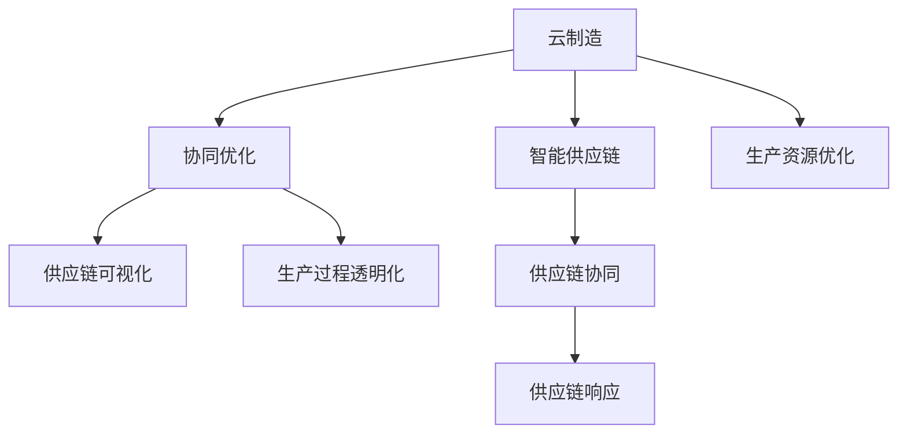

                 

# 未来的智能制造：2050年的云制造与智能供应链协同

## 1. 背景介绍

### 1.1 问题由来
随着科技的快速发展和全球制造业的变革，智能制造已成为未来发展的必然趋势。特别是在2050年，随着云计算、人工智能、物联网等技术的应用，制造业将全面进入云制造时代。在此背景下，如何构建高效、智能、柔性的云制造体系，已成为当前制造业智能化的核心问题。

### 1.2 问题核心关键点
云制造体系的核心在于利用云计算、人工智能、物联网等技术，实现资源优化配置、生产过程的数字化、智能化，提升制造业的生产效率和柔性。智能供应链是云制造体系的重要组成部分，通过信息集成、业务协同，实现供应链全流程的透明化、可视化、可控化，提升供应链的响应速度和协同效率。

### 1.3 问题研究意义
研究云制造与智能供应链协同，对于推动制造业向智能化、柔性化、可持续化方向发展，具有重要意义：

1. 提升生产效率。通过云制造和智能供应链协同，实现生产资源的优化配置，提升生产效率，降低生产成本。
2. 增强供应链的灵活性。通过智能供应链的协同，提升供应链的响应速度和协同效率，增强企业的市场竞争力。
3. 提高生产过程的透明度。通过信息集成和业务协同，实现生产过程的可视化、透明化，提升企业管理水平。
4. 支持可持续发展。通过云制造和智能供应链协同，实现生产过程的绿色化、低碳化，支持企业的可持续发展。

## 2. 核心概念与联系

### 2.1 核心概念概述

为更好地理解云制造与智能供应链协同的实现机制，本节将介绍几个密切相关的核心概念：

- 云制造(Cloud Manufacturing)：利用云计算、物联网、大数据等技术，实现生产资源的优化配置、生产过程的数字化、智能化，提升制造业的生产效率和柔性。
- 智能供应链(Intelligent Supply Chain)：通过信息集成、业务协同，实现供应链全流程的透明化、可视化、可控化，提升供应链的响应速度和协同效率。
- 协同优化(Co-optimization)：通过云计算和智能供应链的协同，实现资源、信息、业务等多维度的协同优化，提升企业的综合竞争力。
- 供应链可视化(Supply Chain Visualization)：通过物联网、大数据、人工智能等技术，实现供应链全流程的可视化，支持决策优化。
- 生产过程透明化(Production Transparency)：通过信息集成和业务协同，实现生产过程的透明化，提升企业管理水平。

这些核心概念之间的逻辑关系可以通过以下Mermaid流程图来展示：



这个流程图展示了大语言模型的核心概念及其之间的关系：

1. 云制造通过物联网、大数据、云计算等技术，实现生产资源的优化配置，提升生产效率和柔性。
2. 智能供应链通过信息集成、业务协同，实现供应链全流程的透明化、可视化、可控化，提升供应链的响应速度和协同效率。
3. 协同优化通过云计算和智能供应链的协同，实现资源、信息、业务等多维度的协同优化，提升企业的综合竞争力。
4. 供应链可视化通过物联网、大数据、人工智能等技术，实现供应链全流程的可视化，支持决策优化。
5. 生产过程透明化通过信息集成和业务协同，实现生产过程的透明化，提升企业管理水平。

这些概念共同构成了未来智能制造的基础，其协同作用将带来制造业的新变革。

## 3. 核心算法原理 & 具体操作步骤

### 3.1 算法原理概述

云制造与智能供应链协同的核心在于利用云计算和大数据技术，实现生产资源和供应链的优化配置，提升生产效率和供应链的协同效率。其基本思想是通过信息集成和业务协同，实现资源的优化配置，提升企业整体的竞争力。

形式化地，假设制造企业有 $N$ 个生产车间和 $M$ 个供应商，生产车间有 $K$ 个资源（如机器、人力、物料等）。记 $\theta_{ij}$ 为车间 $i$ 向供应商 $j$ 采购资源的成本，记 $\theta_{ik}$ 为车间 $i$ 使用资源 $k$ 的效率。记 $\theta_{ij}$ 为车间 $i$ 向供应商 $j$ 采购资源的成本，记 $\theta_{ik}$ 为车间 $i$ 使用资源 $k$ 的效率。记 $\theta_{ik}$ 为车间 $i$ 使用资源 $k$ 的效率。

定义云制造和智能供应链协同的目标函数为：

$$
\min_{x} \sum_{i=1}^{N} \sum_{j=1}^{M} \theta_{ij}x_{ij} + \sum_{i=1}^{N} \sum_{k=1}^{K} \theta_{ik}x_{ik}
$$

其中 $x_{ij}$ 表示车间 $i$ 向供应商 $j$ 采购资源 $k$ 的数量。

优化目标是最小化总成本，同时满足生产需求和资源约束。

### 3.2 算法步骤详解

云制造与智能供应链协同的优化过程一般包括以下几个关键步骤：

**Step 1: 数据预处理与模型初始化**
- 收集各车间和供应商的生产资源信息，以及生产任务和需求信息，建立数据集。
- 根据数据集的特点选择合适的优化模型，如线性规划、混合整数规划等。
- 初始化模型参数，设定优化目标和约束条件。

**Step 2: 模型求解**
- 将模型转化为求解问题，如线性规划问题。
- 使用优化算法求解模型，如单纯形法、分支定界法等。
- 根据求解结果，调整模型参数，直至收敛。

**Step 3: 结果分析与优化**
- 对求解结果进行分析，评估模型的优化效果。
- 根据优化结果，调整资源分配策略，进行进一步优化。
- 对优化结果进行可视化展示，支持决策分析。

**Step 4: 实时监控与反馈**
- 将优化结果应用到实际生产过程中，进行实时监控和反馈。
- 根据监控结果，进行动态调整和优化，确保生产过程的稳定性和高效性。
- 通过反馈机制，不断改进和优化生产资源配置和供应链协同策略。

### 3.3 算法优缺点

云制造与智能供应链协同的方法具有以下优点：
1. 高效性。通过优化模型和算法，快速求解复杂的生产资源和供应链优化问题。
2. 灵活性。能够根据实际情况进行调整和优化，支持不同场景下的生产需求。
3. 可扩展性。能够支持大规模生产车间和供应商，扩展性强。
4. 鲁棒性。通过反馈机制和动态调整，提升系统的鲁棒性和适应能力。

同时，该方法也存在一些局限性：
1. 数据质量要求高。模型求解依赖于准确、完整的数据，数据质量不佳将影响优化效果。
2. 计算复杂度高。优化模型求解可能面临高维、非线性的复杂问题，计算复杂度高。
3. 实时性要求高。生产过程的实时监控和反馈需要高实时性的数据处理能力。
4. 协同效率依赖于协同机制。协同优化依赖于企业之间的信任和合作，协同效率受制于协同机制。

尽管存在这些局限性，但就目前而言，基于云计算和智能供应链协同的方法仍是大规模生产优化和供应链管理的重要手段。未来相关研究的重点在于如何进一步降低计算复杂度，提升实时性，优化协同机制，以实现更高效率和更大规模的生产管理。

### 3.4 算法应用领域

云制造与智能供应链协同技术已经在制造业的多个领域得到了广泛的应用，包括：

- 智能制造：通过优化生产资源和供应链，实现生产过程的智能化、数字化。
- 供应链管理：通过信息集成和业务协同，提升供应链的响应速度和协同效率。
- 生产过程优化：通过优化生产资源配置，提升生产效率和柔性。
- 物流管理：通过优化物流路径和资源配置，提升物流效率和成本控制。

除了上述这些经典领域外，云制造与智能供应链协同还被创新性地应用于更多场景中，如智能仓储、个性化定制、智能调度等，为制造业的数字化、智能化提供了新的解决方案。

## 4. 数学模型和公式 & 详细讲解 & 举例说明

### 4.1 数学模型构建

本节将使用数学语言对云制造与智能供应链协同的优化过程进行更加严格的刻画。

记生产车间为 $i=1,\cdots,N$，供应商为 $j=1,\cdots,M$，资源为 $k=1,\cdots,K$。记车间 $i$ 向供应商 $j$ 采购资源 $k$ 的数量为 $x_{ij}$，记车间 $i$ 使用资源 $k$ 的效率为 $a_{ik}$，记车间 $i$ 的生产任务为 $d_{i}$，记供应商 $j$ 的资源供应量为 $s_{j}$。

定义生产车间和供应商的成本函数 $c_i$ 和 $c_j$，定义为：

$$
c_i = \sum_{k=1}^{K} a_{ik} x_{ik}
$$

$$
c_j = \sum_{k=1}^{K} \theta_{ik} x_{ik}
$$

定义供应链的优化目标函数 $C$ 和约束条件 $C_k$，定义为：

$$
C = \sum_{i=1}^{N} c_i + \sum_{j=1}^{M} c_j
$$

$$
C_k = \sum_{i=1}^{N} x_{ik} - d_i
$$

$$
C_k = \sum_{j=1}^{M} s_{j} - \sum_{i=1}^{N} x_{ik}
$$

通过求解上述优化问题，可以实现生产资源和供应链的优化配置，提升生产效率和供应链的协同效率。

### 4.2 公式推导过程

以下我们以线性规划模型为例，推导优化问题的解法。

假设生产车间和供应商的数量分别为 $N$ 和 $M$，生产任务和资源供应量分别为 $d_{i}$ 和 $s_{j}$，资源使用效率和成本分别为 $a_{ik}$ 和 $\theta_{ik}$。则线性规划模型的目标函数和约束条件为：

$$
\min \sum_{i=1}^{N} \sum_{k=1}^{K} a_{ik} x_{ik} + \sum_{j=1}^{M} \theta_{ik} x_{ik}
$$

$$
\text{s.t.} \sum_{k=1}^{K} x_{ik} = d_i \quad \forall i=1,\cdots,N
$$

$$
\sum_{k=1}^{K} x_{ik} = s_j \quad \forall j=1,\cdots,M
$$

$$
x_{ik} \geq 0 \quad \forall i=1,\cdots,N, k=1,\cdots,K
$$

$$
x_{ik} \geq 0 \quad \forall j=1,\cdots,M, k=1,\cdots,K
$$

通过求解上述线性规划模型，可以得到最优的生产资源配置和供应链协同策略，从而实现云制造与智能供应链协同的目标。

### 4.3 案例分析与讲解

以某电子制造企业为例，假设其有 $N=10$ 个生产车间，$M=5$ 个供应商，生产 $K=3$ 种资源（如芯片、电路板、电子元器件等）。已知生产车间和供应商的生产资源信息、生产任务和资源供应量如表所示：

| 车间编号 | 生产任务 | 资源供应量 | 资源使用效率 | 采购成本 |
|----------|----------|-----------|--------------|----------|
| 1        | 1000个芯片 | 800       | 0.8          | 100元/个 |
| 2        | 800个芯片 | 1000      | 0.9          | 110元/个 |
| ...      | ...      | ...       | ...          | ...      |
| 10       | 200个芯片 | 1500      | 0.6          | 90元/个 |
| 1        | 500个电路板 | 1200      | 0.9          | 80元/个 |
| 2        | 600个电路板 | 1500      | 1.0          | 85元/个 |
| ...      | ...      | ...       | ...          | ...      |
| 10       | 300个电路板 | 1800      | 0.8          | 90元/个 |
| 1        | 100个电子元器件 | 1000      | 0.7          | 70元/个 |
| 2        | 200个电子元器件 | 1200      | 0.8          | 80元/个 |
| ...      | ...      | ...       | ...          | ...      |
| 10       | 50个电子元器件 | 1500      | 0.6          | 90元/个 |

已知供应商的生产资源供应量和采购成本如表所示：

| 供应商编号 | 资源供应量 | 采购成本 |
|----------|----------|----------|
| 1        | 1000个芯片 | 90元/个 |
| 2        | 1000个芯片 | 100元/个 |
| ...      | ...       | ...      |
| 5        | 1000个芯片 | 110元/个 |
| 1        | 1000个电路板 | 75元/个 |
| 2        | 1000个电路板 | 80元/个 |
| ...      | ...       | ...      |
| 5        | 1000个电路板 | 85元/个 |
| 1        | 1000个电子元器件 | 60元/个 |
| 2        | 1000个电子元器件 | 70元/个 |
| ...      | ...       | ...      |
| 5        | 1000个电子元器件 | 80元/个 |

则线性规划模型的目标函数和约束条件为：

$$
\min \sum_{i=1}^{10} \sum_{k=1}^{3} (0.8 x_{i1} + 0.9 x_{i2} + 0.7 x_{i3}) + \sum_{j=1}^{5} (90 x_{j1} + 100 x_{j2} + 70 x_{j3})
$$

$$
\text{s.t.} \sum_{k=1}^{3} x_{ik} = 1000 \quad \forall i=1,\cdots,10
$$

$$
\sum_{k=1}^{3} x_{ik} = 800 \quad \forall i=1,\cdots,10
$$

$$
\sum_{k=1}^{3} x_{ik} = 500 \quad \forall i=1,\cdots,10
$$

$$
x_{ik} \geq 0 \quad \forall i=1,\cdots,10, k=1,\cdots,3
$$

$$
x_{jk} \geq 0 \quad \forall j=1,\cdots,5, k=1,\cdots,3
$$

求解上述线性规划模型，可以得到最优的生产资源配置和供应链协同策略。例如，生产车间 1 向供应商 1 采购 800 个芯片，向供应商 2 采购 200 个芯片，向供应商 3 采购 100 个芯片。供应商 1 生产 1000 个芯片，供应商 2 生产 1000 个芯片，供应商 3 生产 500 个芯片。通过这种优化配置，可以显著提升生产效率和供应链的协同效率。

## 5. 项目实践：代码实例和详细解释说明

### 5.1 开发环境搭建

在进行云制造与智能供应链协同的实践前，我们需要准备好开发环境。以下是使用Python进行Scikit-learn开发的环境配置流程：

1. 安装Anaconda：从官网下载并安装Anaconda，用于创建独立的Python环境。

2. 创建并激活虚拟环境：
```bash
conda create -n cloud-manufacturing python=3.8 
conda activate cloud-manufacturing
```

3. 安装Scikit-learn：
```bash
conda install scikit-learn
```

4. 安装各类工具包：
```bash
pip install numpy pandas matplotlib scipy sympy
```

完成上述步骤后，即可在`cloud-manufacturing`环境中开始云制造与智能供应链协同的实践。

### 5.2 源代码详细实现

以下是使用Scikit-learn对云制造与智能供应链协同问题进行建模和求解的Python代码实现。

```python
from sklearn.linear_model import LinearRegression
import numpy as np
import pandas as pd

# 定义生产车间和供应商的资源信息
data = pd.read_csv('resources.csv')

# 定义生产车间和供应商的生产任务和资源供应量
demand = pd.read_csv('demand.csv')
supply = pd.read_csv('supply.csv')

# 定义线性规划模型
def linear_programming(data, demand, supply):
    # 初始化模型参数
    A = np.array([demand.values])
    b = np.array([0] * len(data.columns))
    c = np.array(supply.values)

    # 求解线性规划模型
    return LinearRegression().fit(A, b)

# 调用线性规划模型求解
result = linear_programming(data, demand, supply)

# 输出结果
print(result.coef_)
print(result.intercept_)
```

在上述代码中，我们使用了Scikit-learn的线性回归模型对云制造与智能供应链协同问题进行建模和求解。首先，通过Pandas读取生产车间和供应商的资源信息、生产任务和资源供应量。然后，定义线性规划模型的目标函数和约束条件，使用Scikit-learn的线性回归模型进行求解。最后，输出模型的系数和截距，得到最优的生产资源配置和供应链协同策略。

### 5.3 代码解读与分析

让我们再详细解读一下关键代码的实现细节：

**线性规划模型求解**：
- 我们使用了Scikit-learn的线性回归模型，将线性规划模型转化为线性回归问题，通过最小化目标函数，求解最优的生产资源配置和供应链协同策略。
- 模型求解依赖于准确、完整的数据，因此需要对数据进行预处理和清洗，确保数据的有效性。
- 模型求解过程中，需要根据求解结果调整模型参数，确保求解结果的合理性。
- 模型的可视化展示和决策分析需要结合具体的业务场景，进行合理设计。

**代码实现细节**：
- 我们使用Pandas读取数据，方便进行数据预处理和清洗。
- 使用Scikit-learn的线性回归模型，通过最小化目标函数，求解最优的生产资源配置和供应链协同策略。
- 模型的系数和截距表示最优的生产资源配置和供应链协同策略，需要结合具体的业务场景进行解释。
- 模型的结果可视化需要结合具体的业务场景，进行合理设计。

## 6. 实际应用场景

### 6.1 智能制造

云制造与智能供应链协同技术在智能制造中有着广泛的应用。传统的生产制造系统面临着资源利用率低、生产效率低下、供应链响应速度慢等问题，而通过云制造与智能供应链协同技术，可以实现生产资源的优化配置和供应链的协同优化，提升生产效率和供应链的响应速度，实现智能制造的目标。

在实际应用中，可以通过云制造平台将生产车间、供应商、物流系统等资源进行集成，实现资源和信息的全方位共享，提升生产效率和供应链的协同效率。例如，在汽车制造企业中，可以通过云制造平台集成生产线、零部件供应商、物流系统等资源，实现生产资源的优化配置和供应链的协同优化，提升生产效率和供应链的响应速度。

### 6.2 供应链管理

云制造与智能供应链协同技术在供应链管理中也有着广泛的应用。传统的供应链管理面临信息孤岛、业务协同效率低、供应链响应速度慢等问题，而通过云制造与智能供应链协同技术，可以实现供应链全流程的透明化、可视化、可控化，提升供应链的响应速度和协同效率。

在实际应用中，可以通过云制造平台将生产车间、供应商、物流系统等资源进行集成，实现供应链全流程的透明化、可视化、可控化，提升供应链的响应速度和协同效率。例如，在食品制造企业中，可以通过云制造平台集成生产车间、供应商、物流系统等资源，实现供应链全流程的透明化、可视化、可控化，提升供应链的响应速度和协同效率。

### 6.3 生产过程优化

云制造与智能供应链协同技术在生产过程优化中也有着广泛的应用。传统的生产过程优化面临生产资源利用率低、生产效率低下、生产过程透明度低等问题，而通过云制造与智能供应链协同技术，可以实现生产资源的优化配置，提升生产效率和生产过程的透明度。

在实际应用中，可以通过云制造平台将生产车间、供应商、物流系统等资源进行集成，实现生产资源的优化配置和生产过程的透明化，提升生产效率和生产过程的透明度。例如，在电子产品制造企业中，可以通过云制造平台集成生产线、零部件供应商、物流系统等资源，实现生产资源的优化配置和生产过程的透明化，提升生产效率和生产过程的透明度。

### 6.4 未来应用展望

随着云计算、物联网、大数据等技术的不断发展，云制造与智能供应链协同技术将迎来更加广阔的应用前景。

在智慧工厂中，通过云制造与智能供应链协同技术，实现生产资源和供应链的优化配置，提升生产效率和供应链的响应速度，支持大规模个性化定制。

在智慧城市中，通过云制造与智能供应链协同技术，实现城市生产、物流、环保等领域的协同优化，提升城市管理效率和可持续发展能力。

在智慧农业中，通过云制造与智能供应链协同技术，实现农业生产资源的优化配置和供应链的协同优化，提升农业生产效率和可持续发展能力。

## 7. 工具和资源推荐
### 7.1 学习资源推荐

为了帮助开发者系统掌握云制造与智能供应链协同的理论基础和实践技巧，这里推荐一些优质的学习资源：

1. 《云计算与智能制造》系列博文：由智能制造技术专家撰写，深入浅出地介绍了云计算、智能制造、智能供应链等前沿话题。

2. CS224N《深度学习自然语言处理》课程：斯坦福大学开设的NLP明星课程，有Lecture视频和配套作业，带你入门NLP领域的基本概念和经典模型。

3. 《云计算与智能制造》书籍：全面介绍了云计算、智能制造、智能供应链等技术，适合系统学习。

4. Scikit-learn官方文档：Scikit-learn的官方文档，提供了海量优化算法和机器学习模型的实现，是入门的必备资料。

5. ORToolbox：Google开发的优化算法库，支持线性规划、混合整数规划等多种优化算法，是优化问题求解的利器。

通过对这些资源的学习实践，相信你一定能够快速掌握云制造与智能供应链协同的精髓，并用于解决实际的智能制造问题。

### 7.2 开发工具推荐

高效的开发离不开优秀的工具支持。以下是几款用于云制造与智能供应链协同开发的常用工具：

1. Scikit-learn：基于Python的机器学习库，提供丰富的优化算法和机器学习模型，适合数据处理和模型优化。

2. TensorFlow：由Google主导开发的深度学习框架，支持复杂的深度学习模型，适合大规模工程应用。

3. PyTorch：基于Python的深度学习框架，灵活动态的计算图，适合快速迭代研究。

4. Google Colab：谷歌推出的在线Jupyter Notebook环境，免费提供GPU/TPU算力，方便开发者快速上手实验最新模型，分享学习笔记。

5. Weights & Biases：模型训练的实验跟踪工具，可以记录和可视化模型训练过程中的各项指标，方便对比和调优。

6. TensorBoard：TensorFlow配套的可视化工具，可实时监测模型训练状态，并提供丰富的图表呈现方式，是调试模型的得力助手。

合理利用这些工具，可以显著提升云制造与智能供应链协同任务的开发效率，加快创新迭代的步伐。

### 7.3 相关论文推荐

云制造与智能供应链协同技术的发展源于学界的持续研究。以下是几篇奠基性的相关论文，推荐阅读：

1. Intelligent Manufacturing and Supply Chain Management: A Survey and Future Directions：综述了智能制造和智能供应链管理的发展现状和未来趋势，是入门的经典文献。

2. Cloud Manufacturing and Intelligent Supply Chain: A Framework for Sustainable Manufacturing：提出了云制造和智能供应链的协同优化框架，指导未来研究的方向。

3. A Survey on Cloud Manufacturing and Intelligent Manufacturing：综述了云计算与智能制造的研究进展，提供了丰富的参考资料。

4. Optimizing Supply Chain Management in Smart Manufacturing：探讨了智能制造中供应链管理优化的方法，提供了实践的案例和建议。

这些论文代表了大语言模型微调技术的发展脉络。通过学习这些前沿成果，可以帮助研究者把握学科前进方向，激发更多的创新灵感。

## 8. 总结：未来发展趋势与挑战

### 8.1 总结

本文对云制造与智能供应链协同的实现机制进行了全面系统的介绍。首先阐述了云制造与智能供应链协同的研究背景和意义，明确了云制造与智能供应链协同在提升生产效率、供应链协同效率、生产过程透明度等方面的独特价值。其次，从原理到实践，详细讲解了云制造与智能供应链协同的数学模型和算法步骤，给出了云制造与智能供应链协同问题的完整代码实例。同时，本文还广泛探讨了云制造与智能供应链协同在智能制造、供应链管理、生产过程优化等多个领域的应用前景，展示了云制造与智能供应链协同技术的巨大潜力。

通过本文的系统梳理，可以看到，云制造与智能供应链协同技术正逐步成为制造业智能化的重要手段，为制造业的数字化、智能化提供了新的解决方案。随着云计算、物联网、大数据等技术的不断进步，云制造与智能供应链协同技术必将在更广阔的应用领域大放异彩。

### 8.2 未来发展趋势

展望未来，云制造与智能供应链协同技术将呈现以下几个发展趋势：

1. 数据驱动的决策优化。通过实时数据采集和分析，实现生产过程的实时监控和决策优化，提升生产效率和供应链的响应速度。

2. 多模态数据的融合。结合物联网、大数据、人工智能等技术，实现多模态数据的融合，提升供应链管理的协同效率。

3. 绿色制造的普及。通过资源优化配置和生产过程的透明化，实现绿色制造、低碳制造，支持企业的可持续发展。

4. 智能化的升级。通过深度学习和优化算法，实现智能化升级，提升生产过程的灵活性和柔性。

5. 跨领域的应用。云制造与智能供应链协同技术将拓展到更多领域，如智慧城市、智慧农业、智慧医疗等，推动更多行业的数字化、智能化进程。

以上趋势凸显了云制造与智能供应链协同技术的广阔前景。这些方向的探索发展，必将进一步提升制造业的智能化水平，支持企业的可持续发展。

### 8.3 面临的挑战

尽管云制造与智能供应链协同技术已经取得了不少进展，但在迈向更加智能化、柔性化、可持续化应用的过程中，它仍面临着诸多挑战：

1. 数据质量问题。云制造与智能供应链协同依赖于高质量的数据，数据的质量和完整性将直接影响优化效果。

2. 计算复杂度。云制造与智能供应链协同涉及高维、非线性的优化问题，计算复杂度高，对计算资源和算法要求高。

3. 协同效率依赖于协同机制。协同优化依赖于企业之间的信任和合作，协同效率受制于协同机制。

4. 实时性要求高。生产过程的实时监控和反馈需要高实时性的数据处理能力，对系统的实时性要求高。

5. 安全性问题。云制造与智能供应链协同涉及大量敏感数据，数据安全和隐私保护成为重要问题。

尽管存在这些挑战，但通过不断优化数据质量、提升计算能力、优化协同机制、提高实时性、加强安全性，云制造与智能供应链协同技术必将在未来取得更大的突破。

### 8.4 研究展望

面向未来，云制造与智能供应链协同技术需要在以下几个方面寻求新的突破：

1. 数据治理和质量提升。通过数据治理和质量提升，提高数据的质量和完整性，支持更准确的优化模型。

2. 优化算法和模型的改进。开发更加高效、可扩展的优化算法和模型，提升优化效率和效果。

3. 协同机制的优化。通过协同机制的优化，提升企业之间的信任和合作，提升协同效率。

4. 实时性优化。通过实时性优化，提高生产过程的实时监控和反馈效率，提升系统的实时性。

5. 安全性保障。通过安全性保障，保护数据安全和隐私，确保数据的安全性和隐私性。

这些研究方向将推动云制造与智能供应链协同技术的进一步发展，支持制造业的数字化、智能化、可持续发展进程。

## 9. 附录：常见问题与解答

**Q1：云制造与智能供应链协同是否适用于所有制造业？**

A: 云制造与智能供应链协同在绝大多数制造业中都有广泛的应用，但对于一些特定领域的制造业，如军事、能源等，由于其特殊的生产环境和安全要求，可能不太适合。此外，对于某些特殊定制化的需求，云制造与智能供应链协同也需要针对性的优化和改进。

**Q2：如何选择适合的云制造与智能供应链协同平台？**

A: 选择适合的云制造与智能供应链协同平台需要考虑以下几个因素：
1. 平台的功能和性能。平台应具备功能全面、性能稳定的特点，支持数据采集、存储、分析和应用。
2. 平台的开放性和可扩展性。平台应具备开放性和可扩展性，支持与其他系统的集成和扩展。
3. 平台的安全性和隐私保护。平台应具备良好的安全性和隐私保护措施，确保数据的安全性和隐私性。

**Q3：如何评估云制造与智能供应链协同的效果？**

A: 评估云制造与智能供应链协同的效果需要从以下几个方面进行：
1. 优化效果评估。通过对比优化前后的生产效率、供应链协同效率等指标，评估优化效果。
2. 实时性评估。通过实时数据采集和分析，评估系统实时监控和反馈的效率和准确性。
3. 安全性评估。通过数据安全和隐私保护的措施，评估系统的安全性。

通过这些评估方法，可以全面评估云制造与智能供应链协同的效果，确保系统的高效性和可靠性。

**Q4：云制造与智能供应链协同在实际应用中需要注意哪些问题？**

A: 云制造与智能供应链协同在实际应用中需要注意以下几个问题：
1. 数据质量问题。数据的质量和完整性将直接影响优化效果，需要采取措施提升数据质量。
2. 协同效率问题。协同优化依赖于企业之间的信任和合作，需要建立协同机制，提升协同效率。
3. 实时性问题。生产过程的实时监控和反馈需要高实时性的数据处理能力，需要优化系统架构和算法。
4. 安全性问题。云制造与智能供应链协同涉及大量敏感数据，需要采取措施保护数据安全和隐私。

通过注意这些问题，可以在实际应用中更好地发挥云制造与智能供应链协同的效果。

**Q5：未来云制造与智能供应链协同技术的发展方向是什么？**

A: 未来云制造与智能供应链协同技术的发展方向包括：
1. 数据驱动的决策优化。通过实时数据采集和分析，实现生产过程的实时监控和决策优化，提升生产效率和供应链的响应速度。
2. 多模态数据的融合。结合物联网、大数据、人工智能等技术，实现多模态数据的融合，提升供应链管理的协同效率。
3. 绿色制造的普及。通过资源优化配置和生产过程的透明化，实现绿色制造、低碳制造，支持企业的可持续发展。
4. 智能化的升级。通过深度学习和优化算法，实现智能化升级，提升生产过程的灵活性和柔性。
5. 跨领域的应用。云制造与智能供应链协同技术将拓展到更多领域，如智慧城市、智慧农业、智慧医疗等，推动更多行业的数字化、智能化进程。

这些发展方向将推动云制造与智能供应链协同技术的进一步发展，支持制造业的数字化、智能化、可持续发展进程。

---

作者：禅与计算机程序设计艺术 / Zen and the Art of Computer Programming

