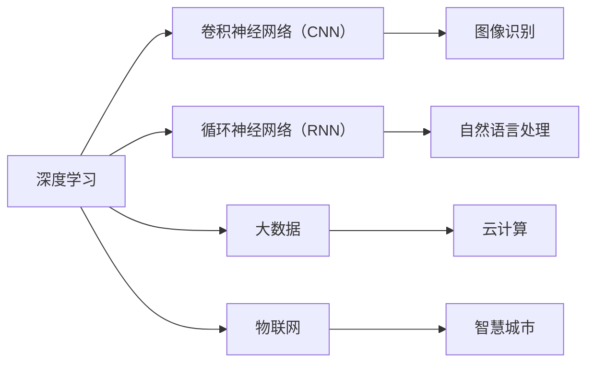

                 

# 李开复：AI 2.0 时代的意义

在AI 2.0时代，人工智能（AI）正从传统的机器学习范式向更先进的深度学习范式转变。这场变革将对技术、产业和社会产生深远影响。本文将深入探讨AI 2.0时代的意义，分析其在技术架构、算法创新、应用场景和社会影响方面的变革，并展望未来的发展趋势与挑战。

## 1. 背景介绍

### 1.1 技术背景

AI 2.0时代的核心技术是深度学习，特别是基于卷积神经网络（CNN）和循环神经网络（RNN）等架构的模型。这些模型在图像识别、自然语言处理、语音识别等领域取得了巨大成功。同时，AI 2.0时代也见证了深度学习与大数据、云计算、物联网等技术的深度融合。

### 1.2 应用背景

AI 2.0时代，AI技术已经在多个领域得到广泛应用，包括医疗、金融、教育、交通、智能制造等。这些应用不仅提升了效率，还创造了新的商业模式。例如，AI在医疗领域的应用提高了诊断准确性，在金融领域的应用提高了风险评估能力，在教育领域的应用提高了个性化教学水平。

### 1.3 社会背景

AI 2.0时代，AI技术正在深刻改变我们的生活方式。从智能家居到无人驾驶，从智慧城市到虚拟现实，AI正逐步融入各个方面，提升生活品质，释放人类潜力。

## 2. 核心概念与联系

### 2.1 核心概念概述

- **深度学习**：一种基于多层神经网络的学习方法，通过模拟人脑神经元间的连接关系，自动学习输入数据的特征。
- **卷积神经网络（CNN）**：一种专门用于处理具有网格结构数据的深度学习模型，广泛应用于图像识别、语音识别等领域。
- **循环神经网络（RNN）**：一种能够处理序列数据的深度学习模型，广泛应用于自然语言处理、时间序列预测等领域。
- **AI 2.0**：指深度学习和大数据技术融合，使AI技术在多个领域取得突破，进入更智能、更广泛应用的新时代。

### 2.2 核心概念原理和架构的 Mermaid 流程图



### 2.3 核心概念之间的联系

深度学习通过神经网络模拟人脑的工作方式，能够从数据中学习出复杂模式，广泛应用于图像识别、自然语言处理等领域。卷积神经网络是深度学习中处理图像数据的一种常见架构，循环神经网络则是处理序列数据的一种重要模型。大数据、云计算、物联网等技术为深度学习提供了算力支持，智慧城市则是深度学习技术在实际应用中的典型场景。

## 3. 核心算法原理 & 具体操作步骤

### 3.1 算法原理概述

深度学习的核心是多层神经网络，通过反向传播算法优化模型参数，使得模型能够准确预测目标变量。CNN通过卷积层、池化层等操作提取图像特征，广泛应用于图像分类、目标检测等任务。RNN通过循环层处理序列数据，广泛应用于自然语言处理、时间序列预测等任务。

### 3.2 算法步骤详解

#### 3.2.1 数据预处理

- 数据清洗：去除噪声数据，处理缺失值。
- 数据标准化：对数据进行归一化处理，保证模型训练的稳定性。
- 数据增强：通过旋转、裁剪、缩放等操作，增加数据多样性，提升模型鲁棒性。

#### 3.2.2 模型训练

- 搭建模型：选择合适的神经网络架构，定义损失函数和优化器。
- 数据加载：将数据分批加载到GPU中，进行前向传播和反向传播。
- 模型优化：使用梯度下降等优化算法，不断更新模型参数，直到损失函数收敛。

#### 3.2.3 模型评估

- 划分训练集、验证集、测试集。
- 在验证集上进行模型评估，调整超参数。
- 在测试集上进行最终评估，输出模型精度和召回率等指标。

### 3.3 算法优缺点

#### 3.3.1 优点

- **高效性**：深度学习能够自动学习数据特征，无需手动设计特征工程，提升模型训练效率。
- **泛化能力**：深度学习模型能够处理复杂模式，提升模型的泛化能力。
- **应用广泛**：深度学习广泛应用于图像识别、自然语言处理、语音识别等领域。

#### 3.3.2 缺点

- **计算资源需求高**：深度学习模型需要大量的计算资源进行训练，对硬件要求较高。
- **过拟合问题**：深度学习模型容易发生过拟合，需要采用正则化、dropout等方法缓解。
- **可解释性差**：深度学习模型通常被视为"黑盒"，难以解释其决策过程。

### 3.4 算法应用领域

AI 2.0时代的深度学习模型已经广泛应用于多个领域，包括：

- **医疗**：通过图像识别、自然语言处理等技术，提高疾病诊断准确性。
- **金融**：通过时间序列预测、风险评估等技术，提升风险管理能力。
- **教育**：通过个性化推荐、智能辅导等技术，提供个性化教育服务。
- **交通**：通过智能驾驶、交通监控等技术，提升交通管理水平。
- **智能制造**：通过工业物联网、机器人等技术，提升生产效率和质量。

## 4. 数学模型和公式 & 详细讲解 & 举例说明

### 4.1 数学模型构建

深度学习模型的数学模型通常包括输入层、隐藏层、输出层等组成部分。以CNN为例，其模型结构如下：

$$
\text{CNN} = \text{Convolution Layer} \rightarrow \text{ReLU Layer} \rightarrow \text{Pooling Layer} \rightarrow \text{Fully Connected Layer} \rightarrow \text{Output Layer}
$$

### 4.2 公式推导过程

#### 4.2.1 卷积层

卷积层通过卷积核提取输入数据的特征，公式如下：

$$
\text{Convolution Layer} = \text{Conv}(\text{Input}, \text{Kernel})
$$

其中，$\text{Input}$ 为输入数据，$\text{Kernel}$ 为卷积核，$\text{Conv}$ 为卷积操作。

#### 4.2.2 池化层

池化层通过下采样操作减少特征图的大小，公式如下：

$$
\text{Pooling Layer} = \text{Pooling}(\text{Feature Map})
$$

其中，$\text{Feature Map}$ 为特征图，$\text{Pooling}$ 为池化操作。

#### 4.2.3 全连接层

全连接层通过线性变换将特征图映射到输出空间，公式如下：

$$
\text{Fully Connected Layer} = \text{Linear}(\text{Feature Map})
$$

其中，$\text{Linear}$ 为线性变换操作。

### 4.3 案例分析与讲解

以图像分类任务为例，使用CNN模型进行图像分类。步骤如下：

1. 数据预处理：将图像数据标准化，并进行数据增强。
2. 搭建模型：定义卷积层、池化层、全连接层等组件。
3. 模型训练：使用梯度下降等优化算法训练模型。
4. 模型评估：在测试集上评估模型性能，输出分类精度。

## 5. 项目实践：代码实例和详细解释说明

### 5.1 开发环境搭建

1. 安装Anaconda：从官网下载并安装Anaconda，用于创建独立的Python环境。
2. 创建并激活虚拟环境：
```bash
conda create -n pytorch-env python=3.8 
conda activate pytorch-env
```
3. 安装PyTorch：根据CUDA版本，从官网获取对应的安装命令。例如：
```bash
conda install pytorch torchvision torchaudio cudatoolkit=11.1 -c pytorch -c conda-forge
```
4. 安装TensorFlow：
```bash
conda install tensorflow -c conda-forge
```
5. 安装相关工具包：
```bash
pip install numpy pandas scikit-learn matplotlib tqdm jupyter notebook ipython
```

完成上述步骤后，即可在`pytorch-env`环境中开始项目实践。

### 5.2 源代码详细实现

以下是一个使用PyTorch搭建并训练CNN模型的示例代码：

```python
import torch
import torch.nn as nn
import torch.optim as optim
import torchvision.transforms as transforms
import torchvision.datasets as datasets

class CNNModel(nn.Module):
    def __init__(self):
        super(CNNModel, self).__init__()
        self.conv1 = nn.Conv2d(3, 32, kernel_size=3, padding=1)
        self.conv2 = nn.Conv2d(32, 64, kernel_size=3, padding=1)
        self.pool = nn.MaxPool2d(kernel_size=2, stride=2)
        self.fc1 = nn.Linear(64 * 7 * 7, 512)
        self.fc2 = nn.Linear(512, 10)

    def forward(self, x):
        x = self.conv1(x)
        x = nn.ReLU()(x)
        x = self.pool(x)
        x = self.conv2(x)
        x = nn.ReLU()(x)
        x = self.pool(x)
        x = x.view(-1, 64 * 7 * 7)
        x = self.fc1(x)
        x = nn.ReLU()(x)
        x = self.fc2(x)
        return x

model = CNNModel()

# 定义优化器、损失函数和超参数
optimizer = optim.SGD(model.parameters(), lr=0.001, momentum=0.9)
criterion = nn.CrossEntropyLoss()

# 加载数据集
train_dataset = datasets.CIFAR10(root='./data', train=True, download=True, transform=transforms.ToTensor())
test_dataset = datasets.CIFAR10(root='./data', train=False, download=True, transform=transforms.ToTensor())

# 定义数据加载器
train_loader = torch.utils.data.DataLoader(train_dataset, batch_size=64, shuffle=True)
test_loader = torch.utils.data.DataLoader(test_dataset, batch_size=64, shuffle=False)

# 训练模型
for epoch in range(10):
    model.train()
    for data, target in train_loader:
        optimizer.zero_grad()
        output = model(data)
        loss = criterion(output, target)
        loss.backward()
        optimizer.step()
    model.eval()
    with torch.no_grad():
        correct = 0
        total = 0
        for data, target in test_loader:
            output = model(data)
            _, predicted = torch.max(output.data, 1)
            total += target.size(0)
            correct += (predicted == target).sum().item()
        accuracy = 100. * correct / total
        print('Epoch %d, Accuracy: %.2f %%' % (epoch + 1, accuracy))
```

### 5.3 代码解读与分析

**CNNModel类**：
- `__init__`方法：定义卷积层、池化层和全连接层等组件。
- `forward`方法：实现模型的前向传播过程。

**优化器、损失函数和超参数**：
- 使用随机梯度下降（SGD）优化器。
- 定义交叉熵损失函数。
- 设置学习率为0.001，动量为0.9。

**数据集加载器**：
- 使用CIFAR-10数据集。
- 定义批大小为64。
- 使用随机打乱和标准化等预处理操作。

**训练模型**：
- 在每个epoch内，对训练集进行前向传播和反向传播。
- 在验证集上评估模型性能，输出精度。

## 6. 实际应用场景

### 6.1 医疗影像诊断

AI 2.0时代的深度学习模型在医疗影像诊断中表现出色。通过图像分类和语义分割等技术，模型可以自动识别病变区域，辅助医生诊断。例如，使用CNN模型进行肺部CT扫描图像分类，帮助医生快速发现肺癌等疾病。

### 6.2 金融风险评估

AI 2.0时代的深度学习模型在金融领域也得到了广泛应用。通过时间序列预测和自然语言处理等技术，模型可以分析客户行为，评估信用风险，预测市场趋势。例如，使用RNN模型进行信用评分，提升银行信贷审批效率。

### 6.3 智能客服

AI 2.0时代的深度学习模型在智能客服中表现优异。通过自然语言理解和生成技术，模型可以自动回答客户咨询，提高服务效率。例如，使用RNN模型进行聊天机器人训练，回答客户常见问题，提升客户满意度。

### 6.4 未来应用展望

未来，AI 2.0时代的深度学习模型将在更多领域得到应用。例如：

- **自动驾驶**：通过感知、决策等技术，实现无人驾驶。
- **智能家居**：通过语音识别、环境感知等技术，实现智能家居控制。
- **智慧农业**：通过图像识别、物联网等技术，提升农业生产效率。
- **智慧城市**：通过智能监控、交通管理等技术，提升城市管理水平。

## 7. 工具和资源推荐

### 7.1 学习资源推荐

1. **《深度学习》书籍**：Ian Goodfellow等人所著，介绍了深度学习的原理和实践，是学习深度学习的经典书籍。
2. **CS231n《卷积神经网络》课程**：斯坦福大学开设的深度学习课程，讲解了CNN的原理和应用，是学习图像识别的必读课程。
3. **DeepLearning.ai深度学习专项课程**：由Andrew Ng等人开设，系统介绍了深度学习的理论和实践，适合初学者学习。

### 7.2 开发工具推荐

1. **PyTorch**：基于Python的开源深度学习框架，提供了强大的张量计算能力和灵活的模型构建功能。
2. **TensorFlow**：由Google主导的深度学习框架，提供了丰富的模型和工具，适合大规模工程应用。
3. **Keras**：基于Python的高层深度学习框架，提供了简洁易用的API，适合快速原型开发。

### 7.3 相关论文推荐

1. **ImageNet大规模视觉识别竞赛**：L. Fei-Fei等人提出，使用CNN模型在图像识别任务上取得了突破性进展。
2. **RNN网络与深度学习**：Y. Bengio等人提出，使用RNN模型在自然语言处理任务上取得了巨大成功。
3. **AlphaGo的胜利**：D. Silver等人提出，使用深度强化学习模型在围棋比赛中击败人类冠军。

## 8. 总结：未来发展趋势与挑战

### 8.1 研究成果总结

AI 2.0时代的深度学习技术在多个领域取得了重大突破，提升了模型的精度和鲁棒性。通过卷积神经网络和循环神经网络等架构，模型能够自动学习复杂模式，提升了模型的泛化能力。通过大数据和云计算等技术，模型能够高效训练和部署。

### 8.2 未来发展趋势

未来，AI 2.0时代的深度学习技术将呈现出以下几个发展趋势：

- **模型规模持续增大**：深度学习模型将继续增长，参数量将达到数十亿级别。
- **模型架构更加复杂**：未来将出现更加复杂的网络架构，如注意力机制、自注意力机制等。
- **多模态融合**：深度学习模型将融合视觉、语音、文本等多种模态数据，提升模型表现。
- **自监督学习**：深度学习模型将更多依赖自监督学习，减少对标注数据的依赖。
- **可解释性增强**：深度学习模型将更加注重可解释性，提升模型的透明度和可信度。

### 8.3 面临的挑战

尽管AI 2.0时代的深度学习技术取得了巨大成功，但仍然面临以下几个挑战：

- **计算资源需求高**：深度学习模型需要大量的计算资源进行训练，对硬件要求较高。
- **模型复杂度高**：深度学习模型架构复杂，训练和推理速度较慢。
- **过拟合问题**：深度学习模型容易发生过拟合，需要采用正则化、dropout等方法缓解。
- **可解释性差**：深度学习模型通常被视为"黑盒"，难以解释其决策过程。
- **数据隐私问题**：深度学习模型需要大量的数据进行训练，如何保护用户隐私是一个重要问题。

### 8.4 研究展望

未来，深度学习技术需要在以下几个方面取得突破：

- **模型压缩与优化**：开发更加高效的模型压缩与优化技术，提升模型的计算效率。
- **自监督学习**：研究更加高效的自监督学习算法，减少对标注数据的依赖。
- **可解释性增强**：研究更加可解释的深度学习模型，提升模型的透明度和可信度。
- **多模态融合**：研究更加高效的跨模态融合技术，提升模型的泛化能力。
- **隐私保护**：研究更加高效的隐私保护技术，确保数据安全。

## 9. 附录：常见问题与解答

**Q1：深度学习模型的训练时间过长，如何解决？**

A: 可以通过以下几个方法解决训练时间过长的问题：
- 使用GPU或TPU等硬件加速。
- 使用分布式训练技术，提升训练速度。
- 使用模型压缩与优化技术，减小模型尺寸。

**Q2：深度学习模型容易发生过拟合，如何解决？**

A: 可以通过以下几个方法缓解过拟合问题：
- 使用正则化技术，如L2正则、dropout等。
- 增加数据多样性，进行数据增强。
- 使用对抗样本训练，提升模型鲁棒性。

**Q3：深度学习模型的可解释性差，如何解决？**

A: 可以通过以下几个方法增强模型的可解释性：
- 使用可解释性技术，如LIME、SHAP等。
- 使用可视化工具，帮助理解模型的决策过程。
- 设计更透明的模型架构。

**Q4：深度学习模型的计算资源需求高，如何解决？**

A: 可以通过以下几个方法优化计算资源需求：
- 使用模型压缩与优化技术，减小模型尺寸。
- 使用分布式训练技术，提升训练速度。
- 使用硬件加速技术，如GPU、TPU等。

**Q5：深度学习模型的数据隐私问题，如何解决？**

A: 可以通过以下几个方法保护数据隐私：
- 使用差分隐私技术，保护用户隐私。
- 使用联邦学习技术，保护数据安全。
- 使用加密技术，保护数据传输安全。

以上是AI 2.0时代深度学习技术的全面总结，包括其核心概念、算法原理、操作步骤、实际应用场景、未来展望、工具资源推荐、总结、挑战与研究展望，以及常见问题的解答。希望本文能够帮助读者全面理解AI 2.0时代深度学习技术的意义和价值。

作者：禅与计算机程序设计艺术 / Zen and the Art of Computer Programming

