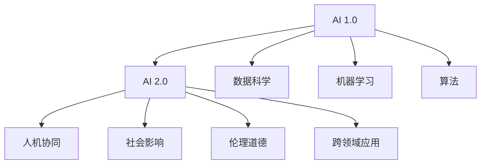

                 

# 李开复：AI 2.0 时代的未来

## 1. 背景介绍

### 1.1 问题由来

在过去的几十年中，人工智能（AI）领域经历了飞速的发展。从简单的规则引擎到复杂的深度学习模型，AI 的应用领域日益广泛，从图像识别、语音识别到自然语言处理（NLP）、自动驾驶等，AI 在各行各业中发挥着越来越重要的作用。

在AI 1.0时代，我们主要关注的是数据科学、机器学习算法等技术层面的问题。但随着技术的进步和应用场景的扩大，我们逐渐认识到，仅仅依靠技术已经不够了。我们需要更加关注AI的社会影响、伦理问题、人机交互等更高层次的问题。因此，AI 2.0时代悄然来临。

### 1.2 问题核心关键点

AI 2.0时代的核心关键点包括以下几个方面：

1. **人机协同**：AI 2.0时代更加注重人机协同，强调AI与人类的合作。通过AI辅助人类进行决策，而不是简单地取代人类。

2. **社会影响**：AI 2.0时代，AI技术的应用将更加广泛，对社会的影响也会更加深远。我们需要更加关注AI对就业、隐私、伦理等方面的影响。

3. **伦理道德**：AI 2.0时代，伦理道德将成为AI发展的重要考量因素。我们需要建立一套完善的伦理道德框架，确保AI的发展符合人类的价值观。

4. **跨领域应用**：AI 2.0时代，AI技术将跨越多个领域，如医疗、教育、金融、制造业等，带来颠覆性的变化。

5. **持续创新**：AI 2.0时代，AI技术的不断创新将推动社会进步，解决更多的现实问题。

## 2. 核心概念与联系

### 2.1 核心概念概述

在AI 2.0时代，有几个核心概念需要理解：

1. **AI 2.0**：AI 2.0是指超越AI 1.0的技术和应用。AI 2.0不仅仅关注机器学习和算法，更关注人机协同、社会影响、伦理道德等方面。

2. **人机协同**：人机协同是指AI与人类在任务执行、决策制定等方面的合作。AI可以作为辅助工具，提供信息和建议，最终决策权仍然掌握在人类手中。

3. **社会影响**：AI技术的应用将对就业、隐私、伦理等方面产生深远影响。我们需要关注AI对社会的正面和负面影响，确保AI技术的健康发展。

4. **伦理道德**：伦理道德是AI技术发展的重要考量因素。我们需要建立一套完善的伦理道德框架，确保AI技术的发展符合人类的价值观。

5. **跨领域应用**：AI技术将跨越多个领域，如医疗、教育、金融、制造业等，带来颠覆性的变化。AI技术在这些领域的落地应用，将提升效率、改善服务质量，创造新的商业机会。

### 2.2 核心概念原理和架构的 Mermaid 流程图



这个流程图展示了AI 1.0和AI 2.0之间的关系，以及AI 2.0时代的核心概念和它们之间的联系。

## 3. 核心算法原理 & 具体操作步骤

### 3.1 算法原理概述

AI 2.0时代的核心算法原理包括以下几个方面：

1. **机器学习**：机器学习是AI 2.0的基础。通过数据训练模型，使模型能够自动学习规律，做出预测或决策。

2. **深度学习**：深度学习是机器学习的一种，通过构建多层神经网络，实现对复杂数据的处理。

3. **强化学习**：强化学习是一种通过试错来优化决策的算法。在AI 2.0时代，强化学习将广泛应用于智能机器人、自动驾驶等领域。

4. **自然语言处理（NLP）**：NLP是AI 2.0的重要应用领域之一。通过AI技术，使机器能够理解、生成、翻译自然语言。

5. **计算机视觉**：计算机视觉是AI 2.0的另一个重要应用领域。通过AI技术，使机器能够识别、分析、处理图像和视频数据。

### 3.2 算法步骤详解

AI 2.0时代的算法步骤包括以下几个方面：

1. **数据准备**：收集、清洗、标注数据，准备用于训练和测试模型的数据集。

2. **模型训练**：选择合适的模型和算法，使用训练数据对模型进行训练。

3. **模型评估**：使用测试数据对训练好的模型进行评估，调整模型参数，优化模型性能。

4. **模型部署**：将训练好的模型部署到实际应用中，进行实时推理和预测。

5. **模型监控**：对部署中的模型进行监控，收集运行数据，发现并修复问题。

### 3.3 算法优缺点

AI 2.0时代的算法优缺点包括以下几个方面：

优点：

1. **高效性**：AI 2.0算法能够高效处理大量数据，快速做出预测和决策。

2. **准确性**：AI 2.0算法在数据充足的情况下，能够实现较高的准确性和可靠性。

3. **灵活性**：AI 2.0算法可以根据不同的应用场景进行灵活调整，适应不同的需求。

缺点：

1. **数据依赖**：AI 2.0算法对数据的质量和数量要求较高，数据不足或标注错误可能导致模型性能下降。

2. **黑箱问题**：AI 2.0算法通常是"黑箱"系统，难以解释其内部工作机制和决策逻辑。

3. **伦理风险**：AI 2.0算法可能存在伦理风险，如歧视、偏见等，需要进行严格监管。

### 3.4 算法应用领域

AI 2.0算法在多个领域都有广泛应用，包括但不限于以下几个方面：

1. **医疗**：AI 2.0算法可以用于医学影像分析、疾病预测、个性化医疗等领域，提升医疗服务的质量和效率。

2. **金融**：AI 2.0算法可以用于风险评估、欺诈检测、智能投顾等领域，提升金融服务的智能化水平。

3. **教育**：AI 2.0算法可以用于个性化学习、智能辅导、智能评估等领域，提升教育服务的个性化和质量。

4. **制造**：AI 2.0算法可以用于智能制造、质量检测、设备维护等领域，提升制造业的自动化和智能化水平。

5. **交通**：AI 2.0算法可以用于自动驾驶、智能交通管理、车联网等领域，提升交通安全和效率。

6. **零售**：AI 2.0算法可以用于客户推荐、库存管理、供应链优化等领域，提升零售业的智能化水平。

## 4. 数学模型和公式 & 详细讲解 & 举例说明

### 4.1 数学模型构建

在AI 2.0时代，我们通常使用以下数学模型：

1. **线性回归模型**：用于预测连续型变量的值，公式为 $y = wx + b$，其中 $w$ 为权重，$b$ 为截距。

2. **逻辑回归模型**：用于预测离散型变量的值，公式为 $p = \frac{1}{1+\exp(-z)}$，其中 $z = wx + b$，$p$ 为预测值。

3. **决策树模型**：用于分类和回归任务，通过构建决策树，实现对数据的分层处理。

4. **支持向量机（SVM）**：用于分类和回归任务，通过构建超平面，实现对数据的高维映射。

5. **随机森林模型**：用于分类和回归任务，通过构建多个决策树，实现对数据的随机采样和集成学习。

### 4.2 公式推导过程

以逻辑回归模型为例，推导其公式如下：

$$
\begin{aligned}
& p(y=1|x;w,b) = \sigma(w^T x + b) \\
& \sigma(x) = \frac{1}{1+\exp(-x)} \\
& \mathcal{L}(\theta) = -\frac{1}{N} \sum_{i=1}^N [y_i \log p(y=1|x_i;w,b) + (1-y_i) \log(1-p(y=1|x_i;w,b))]
\end{aligned}
$$

其中，$p(y=1|x;w,b)$ 表示给定输入 $x$ 下，预测输出为 $y=1$ 的概率，$\sigma(x)$ 为sigmoid函数，$\mathcal{L}(\theta)$ 为交叉熵损失函数。

### 4.3 案例分析与讲解

以医疗影像分析为例，分析AI 2.0算法的使用过程：

1. **数据准备**：收集医院病人的CT、MRI等医学影像数据，标注影像中是否存在肿瘤等病变。

2. **模型训练**：使用神经网络模型，对医学影像进行特征提取，训练模型进行病变检测和分类。

3. **模型评估**：使用测试数据集对训练好的模型进行评估，调整模型参数，优化模型性能。

4. **模型部署**：将训练好的模型部署到医院影像系统中，实时对病人影像进行病变检测和分类。

5. **模型监控**：对部署中的模型进行监控，收集运行数据，发现并修复问题。

## 5. 项目实践：代码实例和详细解释说明

### 5.1 开发环境搭建

在AI 2.0项目中，我们通常使用Python作为编程语言，使用TensorFlow、PyTorch等深度学习框架进行模型训练和推理。以下是开发环境搭建的步骤：

1. **安装Python**：选择Python 3.x版本，从官网下载并安装。

2. **安装TensorFlow和PyTorch**：从官网下载并安装TensorFlow和PyTorch，并配置好依赖。

3. **安装Pandas、NumPy等数据处理库**：使用pip安装Pandas、NumPy等数据处理库，用于数据清洗和预处理。

4. **安装Matplotlib、Scikit-learn等可视化库**：使用pip安装Matplotlib、Scikit-learn等可视化库，用于绘制图表和模型评估。

### 5.2 源代码详细实现

以下是一个简单的医疗影像分析项目的源代码实现：

```python
import tensorflow as tf
from tensorflow.keras import layers

# 定义模型
model = tf.keras.Sequential([
    layers.Conv2D(32, (3, 3), activation='relu', input_shape=(64, 64, 3)),
    layers.MaxPooling2D((2, 2)),
    layers.Conv2D(64, (3, 3), activation='relu'),
    layers.MaxPooling2D((2, 2)),
    layers.Conv2D(128, (3, 3), activation='relu'),
    layers.MaxPooling2D((2, 2)),
    layers.Flatten(),
    layers.Dense(128, activation='relu'),
    layers.Dense(1, activation='sigmoid')
])

# 编译模型
model.compile(optimizer='adam', loss='binary_crossentropy', metrics=['accuracy'])

# 加载数据
train_data = tf.keras.preprocessing.image.ImageDataGenerator().flow_from_directory('train', target_size=(64, 64), batch_size=32, class_mode='binary')
test_data = tf.keras.preprocessing.image.ImageDataGenerator().flow_from_directory('test', target_size=(64, 64), batch_size=32, class_mode='binary')

# 训练模型
model.fit(train_data, epochs=10, validation_data=test_data)

# 评估模型
model.evaluate(test_data)
```

### 5.3 代码解读与分析

以上代码实现了一个简单的医疗影像分析项目，主要分为以下几个步骤：

1. **模型定义**：使用TensorFlow定义了一个简单的卷积神经网络（CNN）模型，用于对医疗影像进行分类。

2. **模型编译**：使用TensorFlow的Keras API编译模型，设置优化器、损失函数和评估指标。

3. **数据加载**：使用TensorFlow的ImageDataGenerator对训练和测试数据进行预处理和加载，确保数据的一致性和高效性。

4. **模型训练**：使用训练数据对模型进行训练，设置迭代轮数和验证集。

5. **模型评估**：使用测试数据对训练好的模型进行评估，输出模型的精度和损失。

## 6. 实际应用场景

### 6.1 智能医疗系统

AI 2.0技术在智能医疗系统中具有广泛的应用，可以用于疾病预测、个性化医疗、智能诊断等领域。通过AI 2.0技术，可以大大提升医疗服务的智能化水平，改善患者体验。

以疾病预测为例，AI 2.0算法可以分析病人的病历、基因数据、影像数据等，预测患者是否会患有某种疾病，并给出预防和治疗建议。这样可以提前发现病情，避免疾病的进一步恶化。

### 6.2 智能教育系统

AI 2.0技术在智能教育系统中也具有广泛的应用，可以用于个性化学习、智能辅导、智能评估等领域。通过AI 2.0技术，可以提升教育服务的个性化和质量，让每个学生都能获得适合自己的教育。

以智能辅导为例，AI 2.0算法可以根据学生的学习情况和知识点掌握情况，自动推荐合适的学习资源和学习路径，提供个性化的辅导和支持。

### 6.3 智能交通系统

AI 2.0技术在智能交通系统中也具有广泛的应用，可以用于自动驾驶、智能交通管理、车联网等领域。通过AI 2.0技术，可以提升交通系统的智能化水平，改善交通效率和安全性。

以自动驾驶为例，AI 2.0算法可以分析传感器的数据，实时做出驾驶决策，避免交通事故的发生。

## 7. 工具和资源推荐

### 7.1 学习资源推荐

以下是一些推荐的AI 2.0学习资源：

1. **Coursera《机器学习》课程**：由斯坦福大学教授Andrew Ng讲授，涵盖机器学习的基本概念和算法。

2. **DeepLearning.ai《深度学习专项课程》**：由Coursera和深度学习专家Andrew Ng合作开发，涵盖深度学习的基本概念和实践。

3. **Udacity《AI 2.0》课程**：涵盖AI 2.0的基本概念和应用，包括人机协同、社会影响、伦理道德等方面。

4. **Google AI博客**：Google AI团队定期发布最新研究成果和应用案例，涵盖AI领域的各个方面。

5. **MIT Technology Review**：麻省理工科技评论，涵盖AI领域的最新进展和技术趋势。

### 7.2 开发工具推荐

以下是一些推荐的AI 2.0开发工具：

1. **TensorFlow**：由Google开发的深度学习框架，支持分布式计算和GPU加速。

2. **PyTorch**：由Facebook开发的深度学习框架，支持动态计算图和GPU加速。

3. **Keras**：一个高层次的深度学习API，可以运行在TensorFlow、Theano和CNTK等后端。

4. **Jupyter Notebook**：一个开源的Web界面，支持Python代码的编写和运行，适合数据科学和机器学习开发。

5. **AWS SageMaker**：亚马逊推出的AI开发平台，支持模型训练、部署和监控，适用于大规模应用场景。

### 7.3 相关论文推荐

以下是一些推荐的AI 2.0相关论文：

1. **Attention is All You Need**：NIPS 2017，提出Transformer模型，使NLP任务的效果大幅提升。

2. **BERT: Pre-training of Deep Bidirectional Transformers for Language Understanding**：ACL 2018，提出BERT模型，大幅提升NLP任务的精度。

3. **GPT-3: Language Models are Unsupervised Multitask Learners**：NIPS 2020，提出GPT-3模型，具有强大的zero-shot学习能力。

4. **AlphaGo Zero: Mastering the Game of Go without Human Knowledge**：Nature 2017，提出AlphaGo Zero，实现无监督学习和自我对弈。

5. **Meta-Learning as Transfer Learning**：ICML 2020，提出元学习，使模型能够高效适应新任务。

## 8. 总结：未来发展趋势与挑战

### 8.1 研究成果总结

AI 2.0时代已经取得了诸多研究成果，包括：

1. **Transformer模型**：使NLP任务的效果大幅提升，成为NLP领域的标准。

2. **BERT模型**：大幅提升NLP任务的精度，成为预训练语言模型的代表。

3. **GPT-3模型**：具有强大的zero-shot学习能力，实现大规模语言模型的突破。

4. **AlphaGo Zero**：实现无监督学习和自我对弈，为AI研究带来新的思路。

5. **元学习**：使模型能够高效适应新任务，提升AI的迁移学习能力。

### 8.2 未来发展趋势

AI 2.0时代的未来发展趋势包括以下几个方面：

1. **人机协同**：AI与人类在任务执行、决策制定等方面的合作将更加紧密。

2. **社会影响**：AI技术的应用将更加广泛，对就业、隐私、伦理等方面产生深远影响。

3. **伦理道德**：AI技术的伦理道德问题将更加受到关注，需要建立完善的伦理道德框架。

4. **跨领域应用**：AI技术将跨越多个领域，带来颠覆性的变化。

5. **持续创新**：AI技术的不断创新将推动社会进步，解决更多的现实问题。

### 8.3 面临的挑战

AI 2.0时代面临的挑战包括以下几个方面：

1. **数据依赖**：AI算法对数据的质量和数量要求较高，数据不足或标注错误可能导致模型性能下降。

2. **伦理风险**：AI算法可能存在伦理风险，如歧视、偏见等，需要进行严格监管。

3. **计算资源**：AI算法对计算资源要求较高，需要高性能的GPU和TPU设备。

4. **模型解释性**：AI算法通常是"黑箱"系统，难以解释其内部工作机制和决策逻辑。

5. **安全性和隐私**：AI算法可能存在安全性和隐私问题，需要进行严格的数据保护和隐私保护。

### 8.4 研究展望

AI 2.0时代的研究展望包括以下几个方面：

1. **人机协同**：研究如何更好地实现人机协同，提升AI的辅助决策能力。

2. **社会影响**：研究AI技术对社会的影响，提出相应的应对措施。

3. **伦理道德**：研究AI技术的伦理道德问题，建立完善的伦理道德框架。

4. **跨领域应用**：研究AI技术在不同领域的应用，推动各行各业的智能化转型。

5. **持续创新**：持续推动AI技术的创新，解决更多的现实问题，提升人类生活质量。

## 9. 附录：常见问题与解答

**Q1：AI 2.0和AI 1.0的区别是什么？**

A: AI 2.0和AI 1.0的区别主要在于应用的深度和广度。AI 1.0主要关注机器学习和算法，而AI 2.0更加注重人机协同、社会影响、伦理道德等方面，应用领域更加广泛。

**Q2：AI 2.0有哪些主要应用领域？**

A: AI 2.0的主要应用领域包括医疗、金融、教育、制造、交通、零售等。AI 2.0技术在这些领域的应用，可以提升效率、改善服务质量，创造新的商业机会。

**Q3：AI 2.0的发展趋势是什么？**

A: AI 2.0的发展趋势主要集中在人机协同、社会影响、伦理道德、跨领域应用和持续创新等方面。这些方向的研究将推动AI技术的进步，解决更多的现实问题，提升人类生活质量。

**Q4：AI 2.0面临的挑战是什么？**

A: AI 2.0面临的挑战包括数据依赖、伦理风险、计算资源、模型解释性和安全性和隐私问题等。解决这些问题需要学术界和工业界的共同努力，建立完善的伦理道德框架，优化算法和技术，保障数据安全。

**Q5：如何应对AI 2.0的挑战？**

A: 应对AI 2.0的挑战需要采取以下措施：

1. 提高数据质量：采用数据增强、对抗样本等方法，提高数据质量和标注样本数量。

2. 严格伦理监管：建立完善的伦理道德框架，确保AI技术的健康发展。

3. 优化算法和技术：开发更高效、更可解释的AI算法和技术，提升模型的性能和可靠性。

4. 保障数据安全：采用数据脱敏、加密等方法，保障数据安全和隐私保护。

5. 多学科协同：结合社会学、伦理学、法律学等学科知识，综合考虑AI技术的应用和影响。

综上所述，AI 2.0时代的到来，为人工智能技术带来了更加广阔的发展空间，但也带来了新的挑战和问题。只有通过多方合作，共同努力，才能推动AI技术的健康发展，实现人机协同、社会影响、伦理道德等方面的目标。

