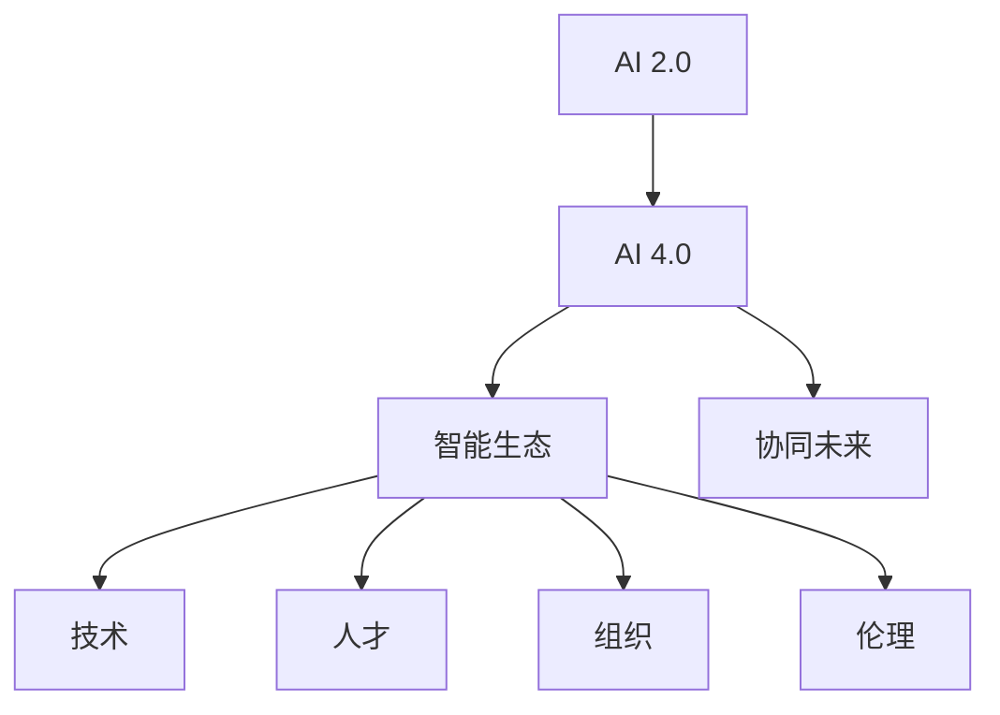

                 

# 李开复：AI 2.0 时代的生态

> 关键词：人工智能(AI)、AI 2.0、智能生态、AI 4.0、人类与AI协同

## 1. 背景介绍

### 1.1 问题由来
自工业革命以来，科技一直是人类社会发展的重要驱动力。从蒸汽机到电力，从电子计算机到互联网，每一次技术变革都极大地改写了世界的面貌。然而，人工智能（AI）的出现，特别是AI 2.0时代的到来，可能比以往任何一次变革都更加深远和复杂。AI 2.0不仅仅是一次技术突破，更是一个深刻影响人类生产、生活、社会的生态系统转型。本文将探讨AI 2.0时代的生态系统，以及人类与AI的协同未来。

### 1.2 问题核心关键点
AI 2.0时代的核心关键点包括：
1. **AI与人类协同**：AI不仅是一种技术工具，更是一种生态系统，需要与人类社会协同发展。
2. **AI 4.0理念**：AI 2.0基础上，AI 4.0强调AI与人类社会的一体化，融合更多社会、经济、文化因素。
3. **生态系统构建**：AI 2.0时代的生态系统包括技术、人才、组织、伦理等多个维度，需要全面构建。
4. **未来展望**：AI 2.0将如何影响各行各业，为人类带来什么样的未来？

## 2. 核心概念与联系

### 2.1 核心概念概述

为更好地理解AI 2.0时代的生态系统，本节将介绍几个关键概念：

- **AI 2.0**：第二代人工智能，基于深度学习和数据驱动，具备强大的自我学习和优化能力。
- **AI 4.0**：第三代人工智能，融合AI与人类社会，涵盖技术、经济、社会、伦理等多个层面，致力于构建人类与AI的深度协同生态。
- **智能生态系统**：包括技术、人才、组织、伦理等多个维度，AI与人类社会共存的复杂生态。
- **协同未来**：AI与人类协同共生的未来社会，强调技术与人类和谐发展。

这些概念之间的关系可以通过以下Mermaid流程图来展示：



这个流程图展示出AI 2.0和AI 4.0的关系以及智能生态系统构建的关键要素。

## 3. 核心算法原理 & 具体操作步骤
### 3.1 算法原理概述

AI 2.0时代的核心算法原理主要基于深度学习和神经网络。其基本思想是通过大量数据和复杂的模型结构，让机器从数据中学习并提取规律，从而实现自主学习和优化。AI 4.0进一步融合了社会、经济、文化等多方面的因素，通过多学科交叉和跨领域融合，构建更加全面和完善的AI生态。

AI 2.0和AI 4.0的区别在于，AI 2.0更多关注技术层面，而AI 4.0则强调技术与社会的深度融合。AI 4.0不仅是一种技术工具，更是一种推动社会进步和人类发展的生态系统。

### 3.2 算法步骤详解

AI 2.0和AI 4.0的实现步骤大致相同，包括数据收集、模型训练、模型优化和模型应用等环节。

**Step 1: 数据收集**
- 收集领域相关的大量数据，包括文本、图像、视频、语音等。
- 确保数据质量和多样性，覆盖不同场景和案例。

**Step 2: 模型训练**
- 选择合适的深度学习模型，如卷积神经网络(CNN)、循环神经网络(RNN)、Transformer等。
- 使用大规模并行计算资源进行模型训练，优化模型参数。

**Step 3: 模型优化**
- 使用正则化、Dropout等技术防止过拟合。
- 采用集成学习、迁移学习等方法提升模型泛化能力。

**Step 4: 模型应用**
- 将训练好的模型应用于实际问题中，进行推理和预测。
- 定期更新模型参数，适应数据分布变化。

AI 4.0的实现步骤在此基础上，还加入了多学科融合、社会伦理考量等元素。

### 3.3 算法优缺点

AI 2.0和AI 4.0的算法优点包括：
1. 强大的自主学习能力。通过大量数据训练，AI模型能够自动提取规律，具备高效的信息处理能力。
2. 广泛的应用场景。AI 2.0和AI 4.0技术可以应用于医疗、金融、教育、交通等多个领域，解决复杂问题。
3. 提升效率和准确性。AI模型能够处理海量数据，减少人为操作，提高效率和准确性。

同时，这些算法也存在一些局限性：
1. 依赖高质量数据。数据质量直接影响模型性能，数据采集和标注成本较高。
2. 黑箱问题。深度学习模型的决策过程难以解释，缺乏透明性。
3. 伦理和安全问题。AI可能产生偏见和歧视，对隐私和安全带来挑战。
4. 对人类就业的影响。AI可能替代部分人类工作，引发就业和社会问题。

### 3.4 算法应用领域

AI 2.0和AI 4.0在多个领域中得到了广泛应用，包括但不限于：

- **医疗健康**：AI在医疗影像诊断、个性化治疗、药物研发等方面发挥了重要作用，提升了医疗效率和效果。
- **金融服务**：AI在金融风险控制、欺诈检测、投资分析等方面取得了显著成果，提高了金融服务质量。
- **教育培训**：AI在智能辅导、个性化推荐、自动化评估等方面优化了教育体验，提升了教育质量。
- **交通出行**：AI在自动驾驶、交通管理、路径优化等方面提高了出行效率，减少了事故风险。
- **制造业**：AI在智能制造、质量检测、供应链优化等方面提高了生产效率，降低了成本。

## 4. 数学模型和公式 & 详细讲解 & 举例说明

### 4.1 数学模型构建

AI 2.0和AI 4.0的数学模型主要基于深度学习框架，如TensorFlow、PyTorch等。以神经网络为例，其基本模型结构包括输入层、隐藏层和输出层。隐藏层的神经元通过激活函数（如ReLU、Sigmoid等）进行非线性变换，从而实现复杂的模式识别和分类任务。

### 4.2 公式推导过程

以卷积神经网络（CNN）为例，其基本公式为：

$$ y = W^TX + b $$

其中 $y$ 为输出向量，$X$ 为输入数据，$W$ 为权重矩阵，$b$ 为偏置向量。

### 4.3 案例分析与讲解

假设我们希望使用CNN对图像进行分类，模型输入为 $x = [x_1, x_2, ..., x_n]$，输出为 $y = [y_1, y_2, ..., y_m]$。在训练过程中，我们通过反向传播算法更新模型参数，最小化损失函数：

$$ L = \frac{1}{N}\sum_{i=1}^N \sum_{j=1}^m ||y_j - y_i||^2 $$

其中 $N$ 为训练样本数量，$||.||$ 为欧几里得范数。

## 5. 项目实践：代码实例和详细解释说明

### 5.1 开发环境搭建

在进行AI 2.0和AI 4.0的实践前，我们需要准备好开发环境。以下是使用Python进行TensorFlow和PyTorch开发的环境配置流程：

1. 安装Anaconda：从官网下载并安装Anaconda，用于创建独立的Python环境。

2. 创建并激活虚拟环境：
```bash
conda create -n ai-env python=3.8 
conda activate ai-env
```

3. 安装TensorFlow和PyTorch：根据CUDA版本，从官网获取对应的安装命令。例如：
```bash
conda install tensorflow tensorflow-gpu=2.6
pip install torch torchvision torchaudio
```

4. 安装各类工具包：
```bash
pip install numpy pandas scikit-learn matplotlib tqdm jupyter notebook ipython
```

完成上述步骤后，即可在`ai-env`环境中开始实践。

### 5.2 源代码详细实现

这里以图像分类为例，使用卷积神经网络（CNN）进行模型训练。

```python
import tensorflow as tf
from tensorflow.keras import layers
import numpy as np
import matplotlib.pyplot as plt

# 加载数据集
(x_train, y_train), (x_test, y_test) = tf.keras.datasets.mnist.load_data()

# 数据预处理
x_train = x_train.reshape(-1, 28, 28, 1).astype('float32') / 255.0
x_test = x_test.reshape(-1, 28, 28, 1).astype('float32') / 255.0

# 构建模型
model = tf.keras.Sequential([
    layers.Conv2D(32, 3, activation='relu', input_shape=(28, 28, 1)),
    layers.MaxPooling2D(pool_size=(2, 2)),
    layers.Flatten(),
    layers.Dense(10, activation='softmax')
])

# 编译模型
model.compile(optimizer='adam',
              loss='sparse_categorical_crossentropy',
              metrics=['accuracy'])

# 训练模型
history = model.fit(x_train, y_train, epochs=5, validation_data=(x_test, y_test))

# 评估模型
test_loss, test_acc = model.evaluate(x_test, y_test)
print('Test accuracy:', test_acc)

# 可视化训练过程
plt.plot(history.history['accuracy'], label='accuracy')
plt.plot(history.history['val_accuracy'], label='val_accuracy')
plt.xlabel('Epoch')
plt.ylabel('Accuracy')
plt.legend()
plt.show()
```

以上就是使用TensorFlow进行CNN模型训练的完整代码实现。可以看到，TensorFlow提供了便捷的高级API，使得模型构建和训练过程变得简单高效。

### 5.3 代码解读与分析

让我们再详细解读一下关键代码的实现细节：

**数据预处理**：
- 将图像数据从二维数组转换为三维张量，并归一化到0-1之间。

**模型构建**：
- 使用Sequential模型构建卷积神经网络，包括卷积层、池化层和全连接层。

**模型编译**：
- 使用Adam优化器，交叉熵损失函数，准确率作为评估指标。

**模型训练和评估**：
- 使用fit方法进行模型训练，并在测试集上进行评估，输出准确率。
- 可视化训练过程，展示模型在每个epoch的准确率变化。

## 6. 实际应用场景

### 6.1 智能客服系统

AI 2.0和AI 4.0技术可以应用于智能客服系统的构建。传统的客服系统依赖人工操作，效率低下，容易出错。使用AI技术，可以将大量的常见问题解答自动化，提高服务效率，减少人工干预。

**智能客服流程**：
1. 收集客户咨询记录，使用自然语言处理技术进行文本清洗和分词。
2. 使用预训练的语言模型进行语义理解和意图识别。
3. 根据客户意图，生成相应的回复或转接人工客服。

### 6.2 金融风险控制

在金融领域，AI 2.0和AI 4.0可以用于风险控制和欺诈检测。通过分析大量的交易数据，AI模型可以识别出异常交易行为，提前预警风险。

**金融风险控制流程**：
1. 收集历史交易数据，标注异常交易行为。
2. 使用深度学习模型进行训练，构建风险评估模型。
3. 实时监测交易数据，使用训练好的模型进行风险评估。

### 6.3 智能制造

AI 2.0和AI 4.0技术可以优化制造流程，提高生产效率和质量。通过传感器数据和机器视觉技术，AI模型可以实时监测设备状态，预测故障，优化生产调度。

**智能制造流程**：
1. 收集设备传感器数据和图像数据。
2. 使用深度学习模型进行训练，构建设备状态监测模型。
3. 实时监测设备状态，预测故障并进行维护。

### 6.4 未来应用展望

AI 2.0和AI 4.0的应用前景广阔，未来将进一步渗透到更多行业。以下是几个可能的未来应用方向：

1. **自动驾驶**：AI技术将进一步推动自动驾驶的发展，提升交通安全和效率。
2. **智慧城市**：AI技术将优化城市管理，提高公共服务效率，改善市民生活质量。
3. **个性化医疗**：AI技术将优化医疗诊断和治疗方案，提升医疗服务质量。
4. **教育个性化**：AI技术将优化个性化学习体验，提升教育效果。
5. **虚拟助手**：AI技术将构建更智能的虚拟助手，提供个性化的服务体验。

## 7. 工具和资源推荐

### 7.1 学习资源推荐

为了帮助开发者系统掌握AI 2.0和AI 4.0的理论基础和实践技巧，这里推荐一些优质的学习资源：

1. 《深度学习》系列书籍：由深度学习领域的专家编写，涵盖深度学习的基本概念、算法和应用。
2. Coursera《深度学习专项课程》：由深度学习领域的顶尖高校开设的课程，系统讲解深度学习的理论和实践。
3. 《AI 2.0: The Next Step in Artificial Intelligence》书籍：深入探讨AI 2.0和AI 4.0的理论和应用。
4. TensorFlow官方文档：TensorFlow的官方文档，提供全面的API和示例代码，适合学习和实践。
5. PyTorch官方文档：PyTorch的官方文档，提供详细的API和示例代码，适合学习和实践。

通过对这些资源的学习实践，相信你一定能够快速掌握AI 2.0和AI 4.0的精髓，并用于解决实际的AI问题。

### 7.2 开发工具推荐

高效的开发离不开优秀的工具支持。以下是几款用于AI 2.0和AI 4.0开发的常用工具：

1. Jupyter Notebook：交互式的开发环境，支持多种编程语言，适合研究和实验。
2. TensorBoard：TensorFlow配套的可视化工具，实时监测模型训练状态，提供丰富的图表和日志记录。
3. Weights & Biases：模型训练的实验跟踪工具，记录和可视化模型训练过程中的各项指标。
4. Google Colab：谷歌推出的在线Jupyter Notebook环境，免费提供GPU算力，适合学习和实验。
5. Visual Studio Code：强大的IDE，支持多种编程语言，适合开发和调试。

合理利用这些工具，可以显著提升AI 2.0和AI 4.0任务的开发效率，加快创新迭代的步伐。

### 7.3 相关论文推荐

AI 2.0和AI 4.0的发展源于学界的持续研究。以下是几篇奠基性的相关论文，推荐阅读：

1. AlphaGo论文：DeepMind发表的AlphaGo论文，展示了AI在复杂棋类游戏中的突破性进展。
2. GANs论文：Ian Goodfellow等人发表的GAN论文，展示了生成对抗网络在图像生成和样式转换方面的强大能力。
3. Transformer论文：Google发表的Transformer论文，展示了Transformer在自然语言处理任务中的出色表现。
4. GPT-3论文：OpenAI发表的GPT-3论文，展示了大规模语言模型的强大零样本学习能力。
5. YOLO论文：Joseph Redmon等人发表的YOLO论文，展示了目标检测中的端到端深度学习框架。

这些论文代表了大规模AI技术的演进，为未来的研究指明了方向。

## 8. 总结：未来发展趋势与挑战

### 8.1 研究成果总结

AI 2.0和AI 4.0技术已经在多个领域取得了显著成果，未来有望进一步推动各行业的数字化转型。然而，AI技术的发展也面临着诸多挑战：

1. 数据质量问题。AI模型依赖大量高质量数据，数据采集和标注成本较高。
2. 模型可解释性。深度学习模型的决策过程难以解释，缺乏透明性。
3. 伦理和安全问题。AI模型可能产生偏见和歧视，对隐私和安全带来挑战。
4. 社会影响。AI技术可能替代部分人类工作，引发就业和社会问题。

### 8.2 未来发展趋势

AI 2.0和AI 4.0的未来发展趋势包括：

1. **多模态融合**：AI模型将融合视觉、语音、文本等多模态数据，实现更全面的信息理解和生成。
2. **跨领域应用**：AI技术将跨越行业边界，应用于更多领域，如农业、能源等。
3. **人机协同**：AI与人类社会将实现深度融合，构建智能生态系统。
4. **伦理和社会治理**：AI技术将注重伦理和社会治理，保障技术的安全和公平。

### 8.3 面临的挑战

AI 2.0和AI 4.0的发展还面临以下挑战：

1. **技术瓶颈**：深度学习模型的计算复杂度高，需要高性能硬件支持。
2. **伦理和安全**：AI技术可能产生偏见和歧视，对隐私和安全带来挑战。
3. **社会接受度**：AI技术可能引发就业和社会问题，需要多方协调解决。

### 8.4 研究展望

未来的AI研究需要在以下几个方面寻求新的突破：

1. **数据质量提升**：优化数据采集和标注方法，降低数据成本。
2. **模型可解释性**：开发更可解释的模型架构和技术，提高透明度。
3. **伦理和社会治理**：制定AI伦理规范，保障技术的安全和公平。
4. **人机协同**：构建智能生态系统，实现人机深度协同。

## 9. 附录：常见问题与解答

**Q1：AI 2.0和AI 4.0有什么区别？**

A: AI 2.0和AI 4.0的主要区别在于，AI 2.0更多关注技术层面，而AI 4.0则强调技术与社会的深度融合。AI 4.0不仅是一种技术工具，更是一种推动社会进步和人类发展的生态系统。

**Q2：AI 2.0和AI 4.0在开发过程中需要注意哪些问题？**

A: 开发AI 2.0和AI 4.0需要关注以下几个问题：
1. 数据质量问题：确保数据的多样性和高质量。
2. 模型可解释性：开发更可解释的模型架构和技术。
3. 伦理和安全问题：制定AI伦理规范，保障技术的安全和公平。

**Q3：AI 2.0和AI 4.0的应用前景如何？**

A: AI 2.0和AI 4.0的应用前景广阔，未来将进一步渗透到更多行业。以下是几个可能的未来应用方向：
1. 自动驾驶：提升交通安全和效率。
2. 智慧城市：优化城市管理，提高公共服务效率。
3. 个性化医疗：优化医疗诊断和治疗方案。
4. 教育个性化：优化个性化学习体验，提升教育效果。

**Q4：AI 2.0和AI 4.0的发展面临哪些挑战？**

A: AI 2.0和AI 4.0的发展面临以下挑战：
1. 技术瓶颈：深度学习模型的计算复杂度高，需要高性能硬件支持。
2. 伦理和安全：AI技术可能产生偏见和歧视，对隐私和安全带来挑战。
3. 社会接受度：AI技术可能引发就业和社会问题，需要多方协调解决。

---

作者：禅与计算机程序设计艺术 / Zen and the Art of Computer Programming

