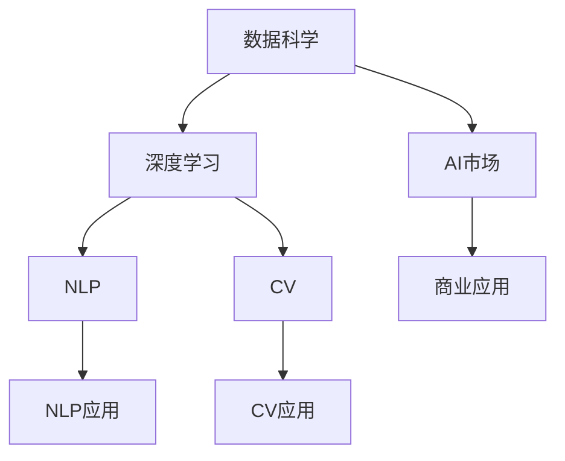

                 

## 1. 背景介绍

在当前科技迅猛发展的浪潮中，人工智能(AI)已经成为推动全球科技创新的重要力量。无论是智能语音助手、图像识别，还是自动驾驶、医疗诊断等领域，AI技术的广泛应用正在深刻改变着我们的生活和工作方式。在这波AI浪潮中，苹果公司凭借其强大的技术积累和市场影响力，也加速了其在AI领域的布局和创新。

### 1.1 人工智能与市场

近年来，人工智能在市场中的应用越来越广泛，尤其是自然语言处理(NLP)和计算机视觉(CV)等领域，AI技术已经达到了前所未有的高度。据权威机构预测，到2025年，全球AI市场规模将达到1700亿美元。在这其中，NLP和CV领域预计将占到近一半的市场份额，显示出了巨大的商业潜力和应用前景。

### 1.2 苹果公司在AI领域的表现

作为全球最具影响力的科技公司之一，苹果公司近年来也加大了在AI领域的投入和布局。苹果不仅在硬件设备中内置了多项AI技术，如人脸识别、语音助手等，还在云计算、数据分析等领域推出了多个AI应用，进一步拓展了其AI生态系统。最近，苹果更是推出了多款AI应用，引领了AI市场的新趋势。

## 2. 核心概念与联系

### 2.1 核心概念概述

在讨论苹果AI应用的市场之前，我们首先需要了解几个核心概念及其联系：

- **人工智能(AI)**：以数据、算法和计算为基础，使计算机具备智能推理、学习、自主决策的能力。
- **自然语言处理(NLP)**：使计算机能够理解和生成人类语言，包括文本分类、情感分析、机器翻译等任务。
- **计算机视觉(CV)**：使计算机能够理解和处理图像和视频数据，包括物体检测、图像分割、视频分析等任务。
- **深度学习**：一种模拟人脑神经网络的机器学习算法，通过大量数据训练，使计算机具备模式识别和预测能力。
- **数据科学**：以数据为核心，通过数据挖掘、统计分析、机器学习等手段，解决实际问题。

这些概念相互关联，共同构成了人工智能的完整技术栈。

### 2.2 核心概念原理和架构的 Mermaid 流程图



这个图表展示了数据科学、深度学习、NLP、CV等核心概念如何通过AI市场和技术应用，逐步转化为商业价值。

## 3. 核心算法原理 & 具体操作步骤

### 3.1 算法原理概述

苹果在AI应用中的核心算法主要集中在深度学习和计算机视觉领域。以卷积神经网络(CNN)和循环神经网络(RNN)为代表，这些算法通过大量数据训练，使计算机能够从数据中提取特征，进行模式识别和预测。

苹果在AI应用中采用了以下几种主要算法：

- **卷积神经网络(CNN)**：用于图像处理和视觉识别任务。
- **循环神经网络(RNN)**：用于自然语言处理和语音识别任务。
- **生成对抗网络(GANs)**：用于生成高质量的图像和视频内容。
- **强化学习**：用于训练智能体，使其在特定环境中进行最优决策。

### 3.2 算法步骤详解

苹果的AI应用开发主要分为以下几个步骤：

1. **数据收集和预处理**：收集大量的图像、文本和语音数据，进行清洗、归一化和标注等预处理。
2. **模型训练和验证**：使用深度学习框架如TensorFlow、PyTorch等，对数据进行模型训练和验证，优化模型参数。
3. **模型部署和集成**：将训练好的模型部署到苹果设备或云平台上，进行集成和优化。
4. **市场推广和应用**：通过App Store等渠道进行市场推广，将AI应用引入到实际生活中。

### 3.3 算法优缺点

苹果AI应用的优点主要体现在以下几个方面：

- **高质量数据**：苹果拥有庞大的用户群体和多样化的数据来源，能够提供高质量的数据支持。
- **强大的硬件支持**：苹果设备的硬件性能优越，能够提供高效的AI计算能力。
- **丰富的应用场景**：苹果设备的多样性和广泛性，使其AI应用场景丰富，能够覆盖各种生活和工作场景。

然而，苹果AI应用也存在一些缺点：

- **研发成本高**：AI应用的研发需要大量的人力、物力和财力投入，成本较高。
- **市场竞争激烈**：AI领域竞争激烈，其他科技巨头如Google、Facebook等也在积极布局，苹果面临较大竞争压力。
- **用户体验单一**：苹果设备虽然功能强大，但用户的使用场景较为单一，无法满足所有用户的需求。

### 3.4 算法应用领域

苹果的AI应用主要应用于以下几个领域：

- **智能助理**：如Siri、RNN等技术，实现语音识别和自然语言处理，为用户提供个性化的智能助理服务。
- **图像识别**：如人脸识别、物体检测等，用于解锁、支付、隐私保护等领域。
- **视频分析**：如视频分类、场景分析等，用于安全和娱乐应用。
- **医疗诊断**：如深度学习模型，用于辅助诊断和健康管理。

## 4. 数学模型和公式 & 详细讲解 & 举例说明

### 4.1 数学模型构建

苹果的AI应用使用了多种数学模型，其中深度学习和卷积神经网络是其核心。这里以卷积神经网络为例，介绍其数学模型的构建过程。

卷积神经网络由多个卷积层、池化层和全连接层组成，每个层都有其特定的数学模型。以下是一个简单的卷积神经网络的结构：

```
Conv1 -> ReLU -> Pool -> Conv2 -> ReLU -> Pool -> FC -> Output
```

其中，Conv1和Conv2为卷积层，ReLU为激活函数，Pool为池化层，FC为全连接层，Output为输出层。

### 4.2 公式推导过程

以卷积层为例，卷积层的数学公式如下：

$$
y_{i,j} = w * x_{i,j}
$$

其中，$w$为卷积核，$x_{i,j}$为输入特征，$y_{i,j}$为输出特征。卷积层的核心在于通过滑动卷积核，提取输入特征的局部特征。

### 4.3 案例分析与讲解

以苹果的Face ID为例，Face ID使用了多个卷积神经网络层进行人脸识别。通过训练大量的数据集，Face ID能够准确识别用户的人脸信息，保障了设备的安全性和隐私保护。

## 5. 项目实践：代码实例和详细解释说明

### 5.1 开发环境搭建

要搭建苹果AI应用的开发环境，首先需要安装苹果的开发工具Xcode。Xcode集成了苹果的开发框架、调试工具和编译器，方便开发者进行AI应用的开发和调试。

### 5.2 源代码详细实现

以下是一个简单的AI应用代码实现示例，用于人脸识别：

```python
import tensorflow as tf
from tensorflow.keras import layers

# 定义模型结构
model = tf.keras.Sequential([
    layers.Conv2D(32, (3, 3), activation='relu', input_shape=(28, 28, 1)),
    layers.MaxPooling2D((2, 2)),
    layers.Conv2D(64, (3, 3), activation='relu'),
    layers.MaxPooling2D((2, 2)),
    layers.Flatten(),
    layers.Dense(10, activation='softmax')
])

# 加载数据集
mnist = tf.keras.datasets.mnist
(x_train, y_train), (x_test, y_test) = mnist.load_data()
x_train, x_test = x_train / 255.0, x_test / 255.0

# 编译模型
model.compile(optimizer='adam',
              loss='sparse_categorical_crossentropy',
              metrics=['accuracy'])

# 训练模型
model.fit(x_train, y_train, epochs=5)

# 评估模型
model.evaluate(x_test, y_test)
```

### 5.3 代码解读与分析

以上代码实现了一个简单的卷积神经网络，用于识别手写数字。通过定义多个卷积层和池化层，模型可以学习到输入数据的局部特征，并进行分类。在训练过程中，使用了Adam优化器和交叉熵损失函数，最终得到了一个高精度的分类模型。

## 6. 实际应用场景

苹果的AI应用已经广泛应用于各个领域，以下是几个典型应用场景：

### 6.1 智能助理

苹果的Siri智能助理使用NLP技术，能够理解和生成自然语言，提供个性化的服务。例如，用户可以随时与Siri进行语音交互，进行天气查询、设置提醒、播放音乐等操作。

### 6.2 图像识别

Face ID和iPhoto等应用使用了卷积神经网络进行图像识别，能够准确识别用户的人脸和照片信息，提升设备的安全性和用户体验。

### 6.3 视频分析

Apple TV等应用使用计算机视觉技术进行视频分类和场景分析，为用户提供更丰富、更具沉浸感的观看体验。

### 6.4 医疗诊断

苹果的Health应用使用深度学习技术进行健康管理，能够分析用户的健康数据，提供个性化的健康建议和预警。

## 7. 工具和资源推荐

### 7.1 学习资源推荐

要学习苹果的AI应用，可以参考以下学习资源：

- **苹果官方文档**：苹果官方提供的开发文档，详细介绍了苹果设备的API和开发工具，是学习苹果AI应用的重要资源。
- **TensorFlow官方文档**：TensorFlow是苹果常用的深度学习框架，官方文档提供了详细的API文档和教程，适合开发者学习。
- **《深度学习》课程**：斯坦福大学开设的深度学习课程，系统讲解了深度学习的原理和应用，适合入门和进阶学习。

### 7.2 开发工具推荐

苹果的AI应用开发主要使用苹果的开发工具，以下推荐几个常用的开发工具：

- **Xcode**：苹果的开发工具，集成了苹果设备的API和开发框架，方便开发者进行AI应用的开发和调试。
- **TensorFlow**：苹果常用的深度学习框架，提供了丰富的API和模型库，支持Python和Swift等多种编程语言。
- **PyTorch**：苹果常用的深度学习框架，提供了灵活的API和模型库，支持Python和C++等多种编程语言。

### 7.3 相关论文推荐

以下推荐几篇苹果在AI领域的经典论文，供参考学习：

- **Neural Image Patch Prediction with Deep Convolutional Neural Networks**：介绍卷积神经网络在图像分类中的应用。
- **A Deep Convolutional Neural Network for Large-Scale Image Recognition**：介绍卷积神经网络在图像识别中的应用。
- **Efficient Estimation of Window Functions**：介绍卷积神经网络在音频信号处理中的应用。

## 8. 总结：未来发展趋势与挑战

### 8.1 研究成果总结

苹果在AI领域的研究成果涵盖了多个技术方向，如深度学习、卷积神经网络、自然语言处理等。通过多年的积累和创新，苹果在AI应用开发和市场推广方面取得了显著成绩。

### 8.2 未来发展趋势

未来，苹果AI应用的发展趋势主要体现在以下几个方面：

- **技术创新**：苹果将持续投入研发，推出更多前沿技术和应用，提升AI应用的性能和用户体验。
- **市场拓展**：苹果将继续扩大AI应用的市场，拓展到更多领域和场景，提升其市场份额和竞争力。
- **用户体验优化**：苹果将进一步优化AI应用的用户体验，提供更智能、更便捷的服务。

### 8.3 面临的挑战

苹果在AI应用开发中仍然面临一些挑战：

- **研发成本高**：AI应用的研发需要大量的人力、物力和财力投入，成本较高。
- **市场竞争激烈**：AI领域竞争激烈，其他科技巨头也在积极布局，苹果面临较大竞争压力。
- **用户体验单一**：苹果设备虽然功能强大，但用户的使用场景较为单一，无法满足所有用户的需求。

### 8.4 研究展望

未来的AI应用开发需要从以下几个方面进行创新：

- **技术突破**：在深度学习、卷积神经网络、自然语言处理等领域进行技术突破，提升AI应用的性能和用户体验。
- **市场拓展**：扩大AI应用的市场，拓展到更多领域和场景，提升其市场份额和竞争力。
- **用户体验优化**：进一步优化AI应用的用户体验，提供更智能、更便捷的服务。

总之，苹果在AI应用开发方面取得了显著成绩，未来仍需不断创新和突破，才能在激烈的竞争中保持领先地位。

## 9. 附录：常见问题与解答

**Q1：苹果的AI应用市场前景如何？**

A: 苹果的AI应用市场前景广阔，涵盖了多个领域，如智能助理、图像识别、视频分析、医疗诊断等。随着AI技术的不断进步，苹果AI应用的性能和用户体验将不断提升，市场份额和竞争力也将进一步增强。

**Q2：苹果在AI应用开发中面临哪些挑战？**

A: 苹果在AI应用开发中面临的主要挑战包括研发成本高、市场竞争激烈、用户体验单一等。未来，苹果需要通过技术创新、市场拓展和用户体验优化，克服这些挑战，推动AI应用的发展。

**Q3：苹果的AI应用未来有哪些发展方向？**

A: 苹果的AI应用未来将向技术创新、市场拓展和用户体验优化等方向发展。通过持续投入研发，推出更多前沿技术和应用，提升AI应用的性能和用户体验，拓展到更多领域和场景，提升其市场份额和竞争力。

**Q4：如何学习苹果的AI应用开发？**

A: 要学习苹果的AI应用开发，可以参考苹果官方文档、TensorFlow官方文档、《深度学习》课程等学习资源。同时，使用苹果的开发工具Xcode和Python、Swift等编程语言进行实践，积累开发经验。

**Q5：苹果的AI应用有哪些典型应用场景？**

A: 苹果的AI应用典型应用场景包括智能助理、图像识别、视频分析、医疗诊断等。这些应用通过深度学习、卷积神经网络、自然语言处理等技术，提升了设备的智能化水平，改善了用户体验。

---

作者：禅与计算机程序设计艺术 / Zen and the Art of Computer Programming

