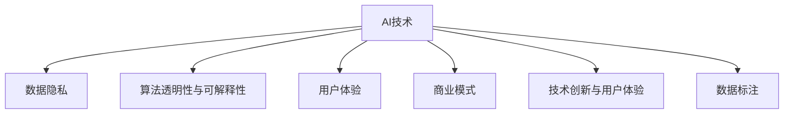

                 

# 李开复：苹果发布AI应用的挑战

## 1. 背景介绍

### 1.1 问题由来
近年来，人工智能(AI)技术在各行各业的应用愈发广泛，从医疗到教育，从金融到交通，无不体现出AI技术的强大影响力。然而，随着技术的不断演进，AI应用在实际落地过程中也面临诸多挑战，尤其是对于科技巨头如苹果公司来说，如何将AI技术与产品有效结合，既保持技术领先，又能获得商业成功，是一个值得深思的问题。

### 1.2 问题核心关键点
本文将从AI应用的技术挑战、商业模式、用户体验等多个角度，探讨苹果公司在发布AI应用时所面临的挑战。这些挑战主要包括：如何处理数据隐私、如何保证AI算法的透明性与可解释性、如何平衡技术创新与用户体验、如何构建可持续的商业模式等。

## 2. 核心概念与联系

### 2.1 核心概念概述

为更好地理解苹果在发布AI应用时所面临的挑战，本节将介绍几个关键概念：

- **AI技术**：指通过计算机模拟人类智能，解决复杂问题的技术。包括机器学习、深度学习、计算机视觉、自然语言处理等多个子领域。

- **数据隐私**：指个人或机构数据的保密性和安全性，尤其在AI应用中，数据的收集、存储和处理都需要严格遵守隐私法规。

- **算法透明性与可解释性**：指AI算法的决策过程可以被用户理解，避免“黑箱”决策，提升用户的信任感。

- **用户体验**：指用户在使用AI应用时的感受和体验，包括易用性、效率、满意度等多个方面。

- **商业模式**：指AI应用在市场中的盈利模式，包括直接收费、订阅模式、广告收入等。

- **技术创新与用户体验**：在追求技术进步的同时，如何设计用户友好的界面和交互方式，提升用户的整体体验。

- **数据标注**：指将原始数据转化为适合AI模型训练的格式的过程，需要大量的人工工作。

这些概念共同构成了苹果发布AI应用时所面临的复杂挑战，通过理解这些概念，可以更好地把握AI技术在产品中的应用方向和优化策略。

### 2.2 核心概念原理和架构的 Mermaid 流程图



## 3. 核心算法原理 & 具体操作步骤

### 3.1 算法原理概述

苹果在发布AI应用时，核心算法主要集中在以下几个方面：

- **机器学习**：通过分析大量数据，使AI模型能够自动识别和分类数据。
- **深度学习**：使用神经网络模型，处理大规模非结构化数据，如图像、语音等。
- **计算机视觉**：通过图像处理和识别技术，实现图像分类、目标检测等功能。
- **自然语言处理(NLP)**：使AI系统能够理解、处理和生成人类语言。

这些算法需要大量数据进行训练，并在实际应用中不断优化，以提升模型的准确性和效率。

### 3.2 算法步骤详解

苹果在发布AI应用时，通常遵循以下步骤：

1. **数据收集**：通过各种渠道收集用户数据，包括线上行为、设备使用情况等。
2. **数据预处理**：对收集到的数据进行清洗、标注，确保数据质量和一致性。
3. **模型训练**：使用深度学习等算法，对标注数据进行模型训练，优化算法参数。
4. **模型部署**：将训练好的模型集成到应用中，实现实时预测或分析。
5. **模型优化**：根据用户反馈和实际应用情况，不断调整和优化模型，提升性能。

### 3.3 算法优缺点

**优点**：
- 利用AI技术，可以大幅提升产品功能和用户体验。
- 通过深度学习等先进算法，能够处理复杂任务，实现高效自动化。
- 通过模型训练和优化，不断提升产品性能和竞争力。

**缺点**：
- 需要大量高质量的数据，数据收集和标注成本高。
- AI算法复杂，模型的解释性和透明性较差，用户难以理解和信任。
- 模型部署和优化需要强大的技术团队和计算资源。
- 隐私和安全问题突出，数据泄露和滥用风险高。

### 3.4 算法应用领域

苹果的AI应用主要集中在以下几个领域：

- **智能助理**：如Siri等，通过自然语言处理和机器学习，实现语音识别和智能对话。
- **推荐系统**：如App Store推荐，通过用户行为数据和深度学习算法，实现个性化推荐。
- **图像识别**：如Face ID，通过计算机视觉技术，实现人脸识别和解锁。
- **智能医疗**：通过AI算法分析医疗数据，辅助诊断和治疗。
- **增强现实(AR)**：如ARKit，通过深度学习和计算机视觉技术，实现真实世界的增强。

## 4. 数学模型和公式 & 详细讲解 & 举例说明

### 4.1 数学模型构建

苹果在AI应用中常用的数学模型包括：

- **线性回归模型**：用于预测连续变量，如推荐系统的评分预测。
- **决策树和随机森林**：用于分类和回归任务，如用户行为预测。
- **卷积神经网络(CNN)**：用于图像识别任务，如图像分类、目标检测。
- **循环神经网络(RNN)**：用于处理序列数据，如自然语言处理中的文本分类和情感分析。

### 4.2 公式推导过程

以卷积神经网络为例，推导其基本结构：

$$
y = W \cdot x + b
$$

其中，$x$ 为输入特征向量，$W$ 为权重矩阵，$b$ 为偏置向量，$y$ 为输出向量。

通过卷积层、池化层等组件的堆叠，可以实现对大规模图像数据的有效处理和特征提取。

### 4.3 案例分析与讲解

以Siri的语音识别为例，分析其背后的算法原理：

1. **语音信号预处理**：将语音信号转换为频谱图，并做归一化处理。
2. **特征提取**：通过Mel频率倒谱系数(MFCC)等技术，提取语音特征。
3. **声学模型训练**：使用深度学习算法，如循环神经网络(RNN)，对标注数据进行模型训练。
4. **语言模型训练**：使用自然语言处理技术，对文本数据进行语言模型训练。
5. **联合训练**：将声学模型和语言模型联合训练，实现语音识别的全流程。

## 5. 项目实践：代码实例和详细解释说明

### 5.1 开发环境搭建

苹果通常使用Python、Swift等编程语言进行AI应用的开发，需要安装相应的开发环境和工具。

### 5.2 源代码详细实现

以Siri语音识别为例，提供详细的代码实现。

```python
# 假设使用PyTorch进行语音识别模型的实现

import torch
import torch.nn as nn
import torch.optim as optim

# 定义卷积层
class ConvLayer(nn.Module):
    def __init__(self, in_channels, out_channels, kernel_size, stride, padding):
        super(ConvLayer, self).__init__()
        self.conv = nn.Conv2d(in_channels, out_channels, kernel_size, stride, padding)
        self.relu = nn.ReLU()

    def forward(self, x):
        return self.relu(self.conv(x))

# 定义池化层
class MaxPoolLayer(nn.Module):
    def __init__(self, kernel_size, stride, padding):
        super(MaxPoolLayer, self).__init__()
        self.pool = nn.MaxPool2d(kernel_size, stride, padding)

    def forward(self, x):
        return self.pool(x)

# 定义全连接层
class FullyConnectedLayer(nn.Module):
    def __init__(self, input_size, output_size):
        super(FullyConnectedLayer, self).__init__()
        self.fc = nn.Linear(input_size, output_size)

    def forward(self, x):
        return self.fc(x)

# 定义模型结构
class CNNModel(nn.Module):
    def __init__(self, in_channels, out_channels, kernel_size, stride, padding):
        super(CNNModel, self).__init__()
        self.conv1 = ConvLayer(in_channels, out_channels, kernel_size, stride, padding)
        self.pool1 = MaxPoolLayer(kernel_size, stride, padding)
        self.conv2 = ConvLayer(out_channels, out_channels, kernel_size, stride, padding)
        self.pool2 = MaxPoolLayer(kernel_size, stride, padding)
        self.fc1 = FullyConnectedLayer(7 * 7 * 32, 128)
        self.fc2 = FullyConnectedLayer(128, 2)

    def forward(self, x):
        x = self.conv1(x)
        x = self.pool1(x)
        x = self.conv2(x)
        x = self.pool2(x)
        x = x.view(-1, 7 * 7 * 32)
        x = self.fc1(x)
        x = self.fc2(x)
        return x

# 训练模型
model = CNNModel(in_channels=1, out_channels=32, kernel_size=3, stride=1, padding=1)
criterion = nn.CrossEntropyLoss()
optimizer = optim.SGD(model.parameters(), lr=0.001, momentum=0.9)

# 训练函数
def train_model(model, train_data, test_data, epochs):
    for epoch in range(epochs):
        model.train()
        for data, target in train_data:
            optimizer.zero_grad()
            output = model(data)
            loss = criterion(output, target)
            loss.backward()
            optimizer.step()
        model.eval()
        test_loss = 0
        correct = 0
        with torch.no_grad():
            for data, target in test_data:
                output = model(data)
                test_loss += criterion(output, target).item()
                pred = output.argmax(dim=1, keepdim=True)
                correct += pred.eq(target.view_as(pred)).sum().item()
        test_loss /= len(test_data)
        print('Epoch %d: Loss: %.4f, Accuracy: %.2f%%' % (epoch+1, test_loss, 100 * correct / len(test_data)))

# 测试数据集
train_data = ...
test_data = ...
epochs = 10
train_model(model, train_data, test_data, epochs)
```

### 5.3 代码解读与分析

代码中，我们定义了卷积层、池化层和全连接层，构建了一个简单的卷积神经网络模型。通过交叉熵损失函数和随机梯度下降优化器，对模型进行训练和优化。

### 5.4 运行结果展示

训练结束后，可以通过测试集验证模型的准确率，并通过可视化工具展示模型的预测结果。

## 6. 实际应用场景

### 6.1 智能助理

Siri作为苹果的智能助理，通过语音识别、自然语言处理等技术，实现了与用户的自然对话和命令执行。用户可以语音搜索信息、发送短信、设置提醒等，大大提升了操作便利性和交互效率。

### 6.2 推荐系统

Apple App Store通过深度学习算法，分析用户行为数据，实现个性化应用推荐。用户可以根据历史使用数据，获得个性化推荐的应用和游戏，提升用户体验和满意度。

### 6.3 图像识别

Face ID通过计算机视觉技术，实现了人脸识别和解锁功能。用户只需对准摄像头，即可快速解锁手机或电脑，提升了设备使用的便利性和安全性。

### 6.4 智能医疗

Apple Health通过AI算法，分析用户的生活习惯和健康数据，提供健康建议和疾病预警。用户可以根据健康数据，调整生活习惯，预防疾病，提升健康水平。

### 6.5 增强现实

ARKit通过深度学习和计算机视觉技术，实现了真实世界的增强。用户可以通过摄像头，叠加虚拟物体和信息，提升交互体验和娱乐效果。

## 7. 工具和资源推荐

### 7.1 学习资源推荐

为了帮助开发者掌握AI应用的开发，以下是推荐的资源：

- **《深度学习》**：由Ian Goodfellow、Yoshua Bengio、Aaron Courville等知名学者联合撰写，深入浅出地介绍了深度学习的基本原理和应用。
- **Coursera《机器学习》**：由斯坦福大学教授Andrew Ng讲授，覆盖了机器学习的基本概念和算法，适合初学者入门。
- **PyTorch官方文档**：提供了详细的API文档和案例代码，帮助开发者快速上手。
- **Kaggle**：数据科学竞赛平台，提供了大量公开数据集和竞赛项目，适合练习和测试AI模型。

### 7.2 开发工具推荐

为了提升AI应用的开发效率，以下是推荐的工具：

- **PyTorch**：Python深度学习框架，支持GPU加速，适合进行复杂模型的训练和推理。
- **TensorFlow**：Google开发的深度学习框架，支持分布式计算，适合大规模模型训练。
- **Keras**：高层次API，简化了深度学习的开发流程，适合快速原型开发。
- **Jupyter Notebook**：交互式编程环境，适合进行数据探索和模型调试。

### 7.3 相关论文推荐

为了深入理解AI应用的理论和实践，以下是推荐的论文：

- **《深度学习》**：Ian Goodfellow、Yoshua Bengio、Aaron Courville著，全面介绍了深度学习的原理和应用。
- **《自然语言处理综述》**：Yoav Artzi、Michael Collins、Rafael Pister著，介绍了自然语言处理的基本概念和算法。
- **《计算机视觉：模型、学习与推理》**：Simon J. D. Prince著，介绍了计算机视觉的基本概念和技术。

## 8. 总结：未来发展趋势与挑战

### 8.1 总结

本文从技术挑战、商业模式、用户体验等多个角度，深入探讨了苹果在发布AI应用时所面临的复杂问题。通过详细的案例分析和代码实现，展示了苹果在AI技术应用中的探索和实践。

### 8.2 未来发展趋势

展望未来，苹果在AI应用开发中可能面临以下趋势：

- **技术进步**：深度学习等先进算法的不断演进，将提升AI应用的功能和性能。
- **数据共享**：在保障隐私和安全的前提下，更多数据共享将推动AI应用的创新和发展。
- **用户体验**：更加智能、个性化的用户体验，将提升用户对AI应用的接受度和满意度。
- **跨平台集成**：AI应用将更多地集成到苹果生态系统中，实现跨平台无缝切换和协作。

### 8.3 面临的挑战

尽管AI技术在苹果产品中得到了广泛应用，但在实际落地过程中，仍面临诸多挑战：

- **数据隐私**：如何在保障用户隐私的同时，收集和利用数据，是一个复杂的难题。
- **算法透明性**：如何提高AI算法的透明性和可解释性，提升用户信任感，是一个亟待解决的问题。
- **用户体验**：如何在追求技术创新时，提升用户体验，避免过度复杂和繁琐的操作。
- **技术成本**：AI应用的开发和部署需要大量的计算资源和技术支持，如何降低成本，提高效率，是一个现实问题。
- **市场竞争**：如何在激烈的市场竞争中，保持技术领先和商业成功，是一个持续的挑战。

### 8.4 研究展望

为了应对这些挑战，未来需要在以下几个方面进行深入研究：

- **隐私保护技术**：研究数据加密、匿名化等隐私保护技术，保障用户数据安全。
- **算法透明性工具**：开发可解释性工具，帮助用户理解AI算法的决策过程，提升信任感。
- **用户界面设计**：研究用户界面设计方法，提升用户体验，实现技术与艺术的完美结合。
- **成本控制方法**：研究低成本高效能的AI模型和算法，降低技术开发和部署成本。
- **跨平台集成技术**：研究跨平台集成技术，实现不同设备间的无缝协作和数据共享。

只有不断创新、勇于突破，才能更好地应对未来AI应用开发中的各种挑战，实现技术进步和商业成功。

## 9. 附录：常见问题与解答

**Q1：苹果的AI应用开发有哪些技术挑战？**

A: 苹果在开发AI应用时，面临的主要技术挑战包括：
1. 数据隐私问题：如何在保障用户隐私的同时，收集和利用数据。
2. 算法透明性问题：如何提高AI算法的透明性和可解释性，提升用户信任感。
3. 用户体验问题：如何在追求技术创新时，提升用户体验，避免过度复杂和繁琐的操作。
4. 技术成本问题：AI应用的开发和部署需要大量的计算资源和技术支持，如何降低成本，提高效率。

**Q2：苹果在发布AI应用时，如何平衡技术创新与用户体验？**

A: 苹果在发布AI应用时，主要通过以下几个方面平衡技术创新与用户体验：
1. 数据驱动的设计：通过分析用户数据，了解用户需求和行为，指导产品设计和功能实现。
2. 用户反馈机制：建立用户反馈机制，及时收集用户意见和建议，优化产品功能。
3. 简洁易用的界面：通过简洁明了的用户界面，提升用户体验，避免过度复杂的操作。
4. 持续迭代优化：通过迭代开发和持续优化，不断提升产品性能和用户体验。

**Q3：苹果的AI应用开发需要哪些技术栈？**

A: 苹果的AI应用开发主要涉及以下技术栈：
1. 编程语言：Python、Swift等。
2. 深度学习框架：PyTorch、TensorFlow等。
3 数据处理工具：Pandas、NumPy等。
4 数据可视化工具：Matplotlib、Seaborn等。
5 开发环境：Jupyter Notebook、Google Colab等。

**Q4：苹果的AI应用开发有哪些工具和资源推荐？**

A: 苹果的AI应用开发推荐以下工具和资源：
1 学习资源：《深度学习》、Coursera《机器学习》、PyTorch官方文档、Kaggle等。
2 开发工具：PyTorch、TensorFlow、Keras、Jupyter Notebook等。
3 相关论文：《深度学习》、《自然语言处理综述》、《计算机视觉：模型、学习与推理》等。

**Q5：苹果的AI应用开发有哪些成功案例？**

A: 苹果的AI应用开发成功案例包括：
1 智能助理：Siri，通过语音识别、自然语言处理等技术，实现与用户的自然对话和命令执行。
2 推荐系统：Apple App Store，通过深度学习算法，分析用户行为数据，实现个性化应用推荐。
3 图像识别：Face ID，通过计算机视觉技术，实现人脸识别和解锁功能。
4 智能医疗：Apple Health，通过AI算法，分析用户的生活习惯和健康数据，提供健康建议和疾病预警。
5 增强现实：ARKit，通过深度学习和计算机视觉技术，实现真实世界的增强。

---

作者：禅与计算机程序设计艺术 / Zen and the Art of Computer Programming

