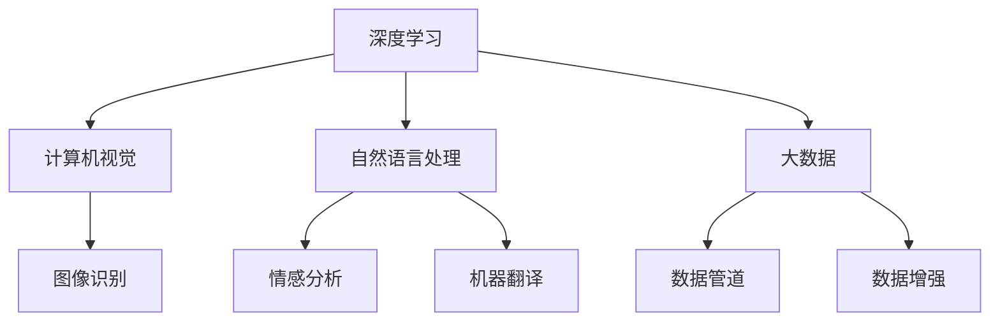

                 

# 李飞飞与AI大数据的未来

> 关键词：人工智能, 大数据, 李飞飞, AI应用, 未来趋势

## 1. 背景介绍

### 1.1 问题由来

李飞飞，深度学习领域的领军人物，斯坦福大学教授，Google AI首席科学家，推动了深度学习在计算机视觉、自然语言处理等领域的突破性进展。作为计算机图灵奖的获得者，李飞飞的工作不仅在学术界产生了深远影响，还深刻改变了人工智能和数据科学的发展方向。

近年来，随着人工智能技术的不断进步，大数据在AI领域的作用愈发重要。数据不仅是模型训练的基础，更是创新突破的源泉。如何有效利用和处理海量数据，使之成为AI技术的助推器，成为了AI领域研究的重要课题。李飞飞及其团队在这一领域进行了广泛研究，推动了AI技术在实际应用中的深入发展。

### 1.2 问题核心关键点

人工智能和大数据技术的紧密结合，是推动AI未来发展的关键。在这一过程中，李飞飞及其团队的研究工作具有以下几个核心关键点：

1. **数据驱动的AI模型**：利用大数据训练深度学习模型，使得模型能够学习到更加丰富的特征，提升预测和决策能力。
2. **数据增强与标注**：通过对数据进行增强和标注，提高模型的泛化能力，减少过拟合。
3. **数据隐私与安全**：在处理敏感数据时，确保数据隐私和安全，防止数据滥用。
4. **数据管道化与自动化**：建立数据管道，实现数据的自动化收集、清洗、处理，提高数据处理的效率。
5. **数据多样性**：利用多种数据源，提升模型的鲁棒性和适用性。

这些关键点共同构成了李飞飞及其团队在AI和大数据领域的研究框架，奠定了其在AI领域的重要地位。

## 2. 核心概念与联系

### 2.1 核心概念概述

为了更好地理解李飞飞及其团队在AI和大数据领域的工作，本节将介绍几个密切相关的核心概念：

- **深度学习**：一种基于神经网络的机器学习算法，通过多层非线性变换，学习数据的复杂特征表示。
- **计算机视觉**：利用计算机技术对图像和视频进行分析、理解，实现图像识别、目标检测、图像生成等任务。
- **自然语言处理**：通过计算机技术对文本进行处理，实现文本分类、情感分析、机器翻译等任务。
- **大数据**：指海量的、多源的、异构的数据集合，涉及多种数据类型和结构。
- **数据管道**：用于自动化数据收集、清洗、处理和存储的流程，确保数据的质量和一致性。
- **数据增强**：通过对原始数据进行变换，增加数据多样性，提高模型的泛化能力。

这些核心概念之间的逻辑关系可以通过以下Mermaid流程图来展示：



这个流程图展示了大数据、深度学习、计算机视觉和自然语言处理等核心概念之间的联系和互动关系。

## 3. 核心算法原理 & 具体操作步骤

### 3.1 算法原理概述

基于深度学习的AI模型，其核心算法原理可以归纳为以下几个步骤：

1. **数据收集与预处理**：从不同数据源收集数据，并对数据进行清洗、归一化等预处理。
2. **特征提取与编码**：通过卷积神经网络、循环神经网络等深度学习模型，提取和编码数据的特征。
3. **模型训练与优化**：使用反向传播算法，通过优化器更新模型参数，最小化损失函数。
4. **模型评估与验证**：在验证集上评估模型的性能，防止过拟合。
5. **模型应用与部署**：将模型部署到实际应用中，进行推理和预测。

这些步骤共同构成了深度学习模型的训练和应用流程，使得模型能够在大数据驱动下，不断提升性能。

### 3.2 算法步骤详解

以下详细解释深度学习模型的核心算法步骤：

1. **数据收集与预处理**：
   - 数据收集：从不同数据源（如互联网、传感器等）收集数据。
   - 数据预处理：清洗数据，去除噪声和异常值，归一化数据，进行特征选择和提取。

2. **特征提取与编码**：
   - 卷积神经网络（CNN）：通过卷积操作提取图像特征。
   - 循环神经网络（RNN）：通过时间序列操作提取文本特征。
   - 自编码器（AE）：通过降维和重构，提取数据的低维表示。
   - 生成对抗网络（GAN）：通过生成器和判别器，生成高质量的数据样本。

3. **模型训练与优化**：
   - 反向传播算法：计算损失函数对模型参数的梯度，更新模型参数。
   - 优化器：如SGD、Adam、Adagrad等，选择合适的优化器，调整学习率。
   - 损失函数：如交叉熵、均方误差、KL散度等，选择合适的损失函数。

4. **模型评估与验证**：
   - 训练集与验证集划分：将数据集分为训练集和验证集，用于训练和评估。
   - 交叉验证：通过多次划分，评估模型的泛化能力。
   - 性能指标：如准确率、召回率、F1-score等，评估模型的性能。

5. **模型应用与部署**：
   - 模型推理：将模型部署到生产环境中，进行推理和预测。
   - 模型优化：通过调参、数据增强等方法，优化模型的性能。
   - 模型监控：实时监控模型的性能，及时发现和解决问题。

### 3.3 算法优缺点

深度学习模型的优点包括：

1. **强大的特征提取能力**：能够自动学习数据的复杂特征表示，提高模型的泛化能力。
2. **高效的数据处理**：利用GPU等硬件加速，实现高效的数据处理。
3. **易于扩展**：可以通过增加数据和模型规模，提升模型的性能。
4. **多模态融合**：能够处理多种数据类型，实现多模态数据的融合。

深度学习模型的缺点包括：

1. **数据需求大**：需要大量的标注数据，获取和标注数据的成本较高。
2. **模型复杂**：模型参数众多，训练过程耗时较长。
3. **泛化能力差**：容易过拟合，需要额外的数据增强和正则化技术。
4. **模型解释性差**：模型的决策过程难以解释，缺乏可解释性。

### 3.4 算法应用领域

深度学习模型已经在计算机视觉、自然语言处理、医疗影像分析等多个领域得到了广泛应用，推动了这些领域的技术突破。

- **计算机视觉**：图像分类、目标检测、图像生成、人脸识别等任务。
- **自然语言处理**：文本分类、情感分析、机器翻译、对话系统等任务。
- **医疗影像分析**：医学影像分类、病变检测、病理分析等任务。
- **智能推荐**：个性化推荐、广告推荐、内容推荐等任务。
- **自动驾驶**：环境感知、路径规划、决策控制等任务。

这些应用场景展示了深度学习模型在实际应用中的巨大潜力，推动了各行业的数字化转型升级。

## 4. 数学模型和公式 & 详细讲解

### 4.1 数学模型构建

深度学习模型的数学模型可以归纳为以下几个主要组成部分：

- **输入层**：表示原始数据，如图像、文本等。
- **隐藏层**：通过非线性变换，提取数据的特征表示。
- **输出层**：根据任务需求，输出预测结果，如分类、回归、生成等。

以二分类任务为例，假设输入层为 $x$，隐藏层为 $h$，输出层为 $y$，则深度学习模型的数学模型可以表示为：

$$
y = f(h) = \sigma(W^Tx + b)
$$

其中 $W$ 为权重矩阵，$b$ 为偏置项，$\sigma$ 为激活函数。

### 4.2 公式推导过程

以下详细推导深度学习模型的关键公式：

1. **交叉熵损失函数**：用于二分类任务，计算预测值与真实标签之间的差异。

   $$
   L = -\frac{1}{N} \sum_{i=1}^N (y_i\log \hat{y_i} + (1-y_i)\log (1-\hat{y_i}))
   $$

   其中 $y_i$ 为真实标签，$\hat{y_i}$ 为预测值。

2. **反向传播算法**：计算损失函数对模型参数的梯度，更新模型参数。

   $$
   \frac{\partial L}{\partial w_{ij}} = \frac{\partial L}{\partial z_i} \frac{\partial z_i}{\partial w_{ij}} = \frac{\partial L}{\partial z_i} \frac{\partial \sigma(z_i)}{\partial w_{ij}} \frac{\partial w_{ij}}{\partial z_i}
   $$

   其中 $\sigma(z_i)$ 为激活函数，$w_{ij}$ 为权重矩阵元素。

3. **Adam优化器**：一种常用的优化算法，结合梯度的一阶矩估计和二阶矩估计，自适应调整学习率。

   $$
   m_t = \beta_1 m_{t-1} + (1-\beta_1)g_t
   $$

   $$
   v_t = \beta_2 v_{t-1} + (1-\beta_2)g_t^2
   $$

   $$
   \hat{m}_t = \frac{m_t}{1-\beta_1^t}
   $$

   $$
   \hat{v}_t = \frac{v_t}{1-\beta_2^t}
   $$

   $$
   \theta_{t+1} = \theta_t - \eta \frac{\hat{m}_t}{\sqrt{\hat{v}_t}+\epsilon}
   $$

   其中 $g_t$ 为梯度，$\eta$ 为学习率，$\beta_1$ 和 $\beta_2$ 为指数衰减系数，$\epsilon$ 为数值稳定项。

### 4.3 案例分析与讲解

以计算机视觉中的图像分类任务为例，详细分析深度学习模型的应用过程。

1. **数据准备**：
   - 收集大量图像数据，并进行预处理。
   - 将图像数据划分为训练集和验证集。

2. **模型搭建**：
   - 使用卷积神经网络（CNN）搭建模型，包括卷积层、池化层、全连接层等。
   - 设置模型的超参数，如学习率、批大小、迭代轮数等。

3. **模型训练**：
   - 在训练集上使用反向传播算法和Adam优化器训练模型。
   - 通过交叉验证评估模型性能，防止过拟合。

4. **模型应用**：
   - 将模型部署到实际应用中，进行图像分类预测。
   - 实时监控模型性能，优化模型参数。

## 5. 项目实践：代码实例和详细解释说明

### 5.1 开发环境搭建

在进行深度学习项目开发前，需要先搭建好开发环境。以下是使用Python进行深度学习项目开发的环境配置流程：

1. 安装Anaconda：从官网下载并安装Anaconda，用于创建独立的Python环境。

2. 创建并激活虚拟环境：
```bash
conda create -n pytorch-env python=3.8 
conda activate pytorch-env
```

3. 安装PyTorch：根据CUDA版本，从官网获取对应的安装命令。例如：
```bash
conda install pytorch torchvision torchaudio cudatoolkit=11.1 -c pytorch -c conda-forge
```

4. 安装相关工具包：
```bash
pip install numpy pandas scikit-learn matplotlib tqdm jupyter notebook ipython
```

完成上述步骤后，即可在`pytorch-env`环境中开始项目开发。

### 5.2 源代码详细实现

下面以图像分类任务为例，给出使用PyTorch进行深度学习项目开发的代码实现。

```python
import torch
import torch.nn as nn
import torch.optim as optim
from torchvision import datasets, transforms

# 定义模型
class CNN(nn.Module):
    def __init__(self):
        super(CNN, self).__init__()
        self.conv1 = nn.Conv2d(3, 64, kernel_size=3, stride=1, padding=1)
        self.pool = nn.MaxPool2d(kernel_size=2, stride=2)
        self.fc1 = nn.Linear(64*7*7, 256)
        self.fc2 = nn.Linear(256, 10)

    def forward(self, x):
        x = self.pool(nn.ReLU(self.conv1(x)))
        x = x.view(-1, 64*7*7)
        x = nn.ReLU(self.fc1(x))
        x = self.fc2(x)
        return x

# 加载数据集
transform = transforms.Compose([
    transforms.Resize((224, 224)),
    transforms.ToTensor(),
    transforms.Normalize(mean=[0.485, 0.456, 0.406], std=[0.229, 0.224, 0.225])
])

train_dataset = datasets.CIFAR10(root='./data', train=True, download=True, transform=transform)
test_dataset = datasets.CIFAR10(root='./data', train=False, download=True, transform=transform)

# 数据加载器
train_loader = torch.utils.data.DataLoader(train_dataset, batch_size=64, shuffle=True)
test_loader = torch.utils.data.DataLoader(test_dataset, batch_size=64, shuffle=False)

# 模型实例化和参数初始化
model = CNN()
optimizer = optim.Adam(model.parameters(), lr=0.001)
criterion = nn.CrossEntropyLoss()

# 训练模型
device = torch.device('cuda' if torch.cuda.is_available() else 'cpu')
model.to(device)

for epoch in range(10):
    model.train()
    for i, (inputs, labels) in enumerate(train_loader):
        inputs, labels = inputs.to(device), labels.to(device)
        optimizer.zero_grad()
        outputs = model(inputs)
        loss = criterion(outputs, labels)
        loss.backward()
        optimizer.step()
        if (i+1) % 100 == 0:
            print('Epoch [%d/%d], Step [%d/%d], Loss: %.4f' %
                  (epoch+1, 10, i+1, len(train_loader), loss.item()))

# 模型评估
model.eval()
with torch.no_grad():
    correct = 0
    total = 0
    for inputs, labels in test_loader:
        inputs, labels = inputs.to(device), labels.to(device)
        outputs = model(inputs)
        _, predicted = torch.max(outputs.data, 1)
        total += labels.size(0)
        correct += (predicted == labels).sum().item()

    print('Accuracy of the network on the 10000 test images: %d %%' % (
        100 * correct / total))
```

### 5.3 代码解读与分析

这里我们详细解读一下关键代码的实现细节：

1. **模型定义**：
   - 定义了一个简单的卷积神经网络模型 `CNN`，包括卷积层、池化层、全连接层等。
   - 使用 `nn.Module` 作为模型的基类，实现了 `__init__` 和 `forward` 方法，分别用于初始化和前向计算。

2. **数据加载器**：
   - 使用 `torchvision` 库加载 CIFAR-10 数据集，并进行数据预处理。
   - 将数据集划分为训练集和测试集，并使用 `DataLoader` 创建数据加载器。

3. **模型实例化和参数初始化**：
   - 实例化模型 `CNN`，并使用 `Adam` 优化器初始化模型参数。
   - 定义交叉熵损失函数，用于评估模型性能。

4. **模型训练**：
   - 在训练集上使用反向传播算法和 Adam 优化器训练模型。
   - 通过打印训练过程中的损失值，监控模型的训练进度。

5. **模型评估**：
   - 在测试集上评估模型的性能，计算准确率。
   - 使用 `with torch.no_grad()` 关闭模型参数的梯度更新，避免计算不必要的梯度。

## 6. 实际应用场景

### 6.1 智能推荐系统

基于深度学习的智能推荐系统已经成为电商、媒体、社交等领域的重要应用。李飞飞及其团队在这一领域进行了广泛研究，推动了推荐系统的创新发展。

具体而言，可以利用深度学习模型学习用户行为特征和物品属性特征，构建用户-物品交互矩阵，预测用户对物品的兴趣。通过引入数据增强技术，提高模型的泛化能力，提升推荐系统的精准度和多样性。

### 6.2 医疗影像分析

医疗影像分析是深度学习的重要应用场景之一，李飞飞及其团队在这一领域取得了显著成果。通过深度学习模型对医学影像进行分类、分割和标注，辅助医生进行疾病诊断和治疗决策。

例如，利用卷积神经网络对医学影像进行分类，如乳腺癌、肺癌等，可以提高诊断的准确性和效率。同时，通过生成对抗网络等技术，可以生成高质量的医学影像，用于辅助训练和验证。

### 6.3 自动驾驶

自动驾驶技术是深度学习的重要应用方向之一，李飞飞及其团队在这一领域的研究也颇具影响力。通过深度学习模型对环境进行感知、路径规划和决策控制，实现自动驾驶车辆的智能化。

例如，利用卷积神经网络对图像和激光雷达数据进行融合，提取路标、车辆、行人等环境信息，进行目标检测和路径规划。同时，通过强化学习等技术，优化驾驶策略，提升自动驾驶系统的稳定性和安全性。

### 6.4 未来应用展望

随着深度学习技术的不断进步，AI和大数据在更多领域的应用将得到拓展，带来新的突破。

1. **自然语言生成**：利用深度学习模型生成自然语言文本，如对话系统、文本摘要、文本生成等。
2. **多模态学习**：将视觉、听觉、文本等多种模态数据进行融合，实现跨模态的智能交互和推理。
3. **联邦学习**：在保护数据隐私的前提下，利用分布式数据训练深度学习模型，提升模型的泛化能力。
4. **自动化机器学习**：通过自动化算法搜索和模型调参，提高深度学习模型的训练效率。

这些应用场景展示了AI和大数据技术的巨大潜力，推动了各行业的数字化转型升级。

## 7. 工具和资源推荐

### 7.1 学习资源推荐

为了帮助开发者系统掌握深度学习和数据科学的知识，这里推荐一些优质的学习资源：

1. **《深度学习》（Ian Goodfellow、Yoshua Bengio、Aaron Courville 著）**：深度学习领域的经典教材，涵盖了深度学习的理论基础和实践技巧。
2. **《TensorFlow官方文档》**：TensorFlow 的官方文档，提供了完整的深度学习模型和工具的使用指南。
3. **Kaggle竞赛平台**：Kaggle 提供了大量数据集和比赛，可以帮助开发者实践深度学习模型。
4. **Coursera深度学习课程**：由深度学习领域的知名专家开设的在线课程，涵盖深度学习的基础和高级知识。
5. **GitHub深度学习项目**：GitHub 上有大量深度学习项目的源代码，可以帮助开发者学习最佳实践。

通过对这些资源的学习实践，相信你一定能够快速掌握深度学习和大数据技术，并用于解决实际的NLP问题。

### 7.2 开发工具推荐

高效的开发离不开优秀的工具支持。以下是几款用于深度学习和数据科学开发的常用工具：

1. **PyTorch**：基于 Python 的开源深度学习框架，灵活动态的计算图，适合快速迭代研究。
2. **TensorFlow**：由 Google 主导开发的开源深度学习框架，生产部署方便，适合大规模工程应用。
3. **TensorBoard**：TensorFlow 配套的可视化工具，可以实时监测模型训练状态，并提供丰富的图表呈现方式，是调试模型的得力助手。
4. **Weights & Biases**：模型训练的实验跟踪工具，可以记录和可视化模型训练过程中的各项指标，方便对比和调优。
5. **Jupyter Notebook**：交互式编程环境，适合进行数据处理、模型训练和实验调试。

合理利用这些工具，可以显著提升深度学习和大数据项目的开发效率，加快创新迭代的步伐。

### 7.3 相关论文推荐

深度学习和大数据技术的发展源于学界的持续研究。以下是几篇奠基性的相关论文，推荐阅读：

1. **AlexNet**：ImageNet大规模视觉识别竞赛中的冠军模型，标志着深度学习在计算机视觉领域的突破。
2. **Inception**：Google提出的深度神经网络结构，显著提高了模型性能和训练效率。
3. **ResNet**：微软提出的深度残差网络，解决了深度网络退化的问题，显著提升了模型深度。
4. **GAN**：深度学习中的生成对抗网络，能够生成高质量的数据样本，应用于图像生成、数据增强等领域。
5. **BERT**：Google提出的预训练语言模型，通过自监督学习任务提升了模型的语言理解能力。

这些论文代表了大数据和深度学习技术的演变脉络，通过学习这些前沿成果，可以帮助研究者把握学科前进方向，激发更多的创新灵感。

## 8. 总结：未来发展趋势与挑战

### 8.1 总结

本文对深度学习和大数据技术的发展进行了全面系统的介绍。首先阐述了深度学习和大数据技术的研究背景和意义，明确了在AI领域的应用方向。其次，从原理到实践，详细讲解了深度学习模型的核心算法步骤和实现细节，给出了深度学习项目开发的完整代码实例。同时，本文还广泛探讨了深度学习在智能推荐、医疗影像分析、自动驾驶等领域的实际应用，展示了深度学习和大数据技术的巨大潜力。此外，本文精选了深度学习和数据科学的相关资源，力求为读者提供全方位的技术指引。

通过本文的系统梳理，可以看到，深度学习和大数据技术在AI领域的应用前景广阔，推动了各行业的数字化转型升级。未来，伴随深度学习和大数据技术的持续演进，AI技术必将在更多领域得到深入应用，深刻影响人类的生产生活方式。

### 8.2 未来发展趋势

深度学习和大数据技术的发展前景广阔，未来的发展趋势包括：

1. **模型规模不断增大**：随着算力成本的下降和数据规模的扩张，深度学习模型的参数量将继续增长，模型性能将进一步提升。
2. **跨模态学习**：将视觉、听觉、文本等多种模态数据进行融合，实现跨模态的智能交互和推理。
3. **联邦学习**：在保护数据隐私的前提下，利用分布式数据训练深度学习模型，提升模型的泛化能力。
4. **自动化机器学习**：通过自动化算法搜索和模型调参，提高深度学习模型的训练效率。
5. **多任务学习**：同时训练多个相关任务，共享模型参数，提高模型的泛化能力。
6. **自适应学习**：根据数据分布和任务需求，动态调整模型参数，提升模型的适应性和鲁棒性。

这些趋势凸显了深度学习和大数据技术的巨大潜力，推动了AI技术在更多领域的应用。

### 8.3 面临的挑战

尽管深度学习和大数据技术已经取得了瞩目成就，但在迈向更加智能化、普适化应用的过程中，仍然面临诸多挑战：

1. **数据质量问题**：数据标注成本高、数据质量不稳定，数据不足或过拟合的问题仍需解决。
2. **模型可解释性差**：深度学习模型的决策过程难以解释，缺乏可解释性。
3. **模型鲁棒性不足**：模型面对域外数据时，泛化性能往往大打折扣。
4. **计算资源需求高**：深度学习模型训练和推理需要大量的计算资源，难以在普通设备上运行。
5. **数据隐私与安全**：处理敏感数据时，需要确保数据隐私和安全，防止数据滥用。

这些挑战需要深度学习和大数据技术的研究者不断探索和改进，才能推动技术进一步发展。

### 8.4 研究展望

未来，深度学习和大数据技术的研究方向将更加多样化和深入，主要体现在以下几个方面：

1. **数据增强与生成**：通过数据增强和生成对抗网络等技术，提高数据的多样性和数量。
2. **自监督学习**：利用无标签数据进行自监督学习，提升模型的泛化能力。
3. **多任务与跨模态学习**：同时训练多个相关任务，共享模型参数，提高模型的泛化能力。
4. **自适应学习**：根据数据分布和任务需求，动态调整模型参数，提升模型的适应性和鲁棒性。
5. **联邦学习**：在保护数据隐私的前提下，利用分布式数据训练深度学习模型，提升模型的泛化能力。
6. **自动化机器学习**：通过自动化算法搜索和模型调参，提高深度学习模型的训练效率。

这些研究方向将推动深度学习和大数据技术的进一步发展，为AI技术的实际应用提供更加高效、稳定和安全的解决方案。

## 9. 附录：常见问题与解答

**Q1：深度学习模型如何进行模型裁剪和量化加速？**

A: 模型裁剪和量化加速是深度学习模型部署中常用的优化技术，可以显著提高模型的推理效率。

1. **模型裁剪**：去除不必要的层和参数，减小模型尺寸，加快推理速度。可以通过冻结部分层，只训练顶层参数来实现。
2. **量化加速**：将浮点模型转为定点模型，压缩存储空间，提高计算效率。可以使用量化技术，将模型参数和计算过程转化为定点运算。

这些技术可以在保证模型性能的同时，优化模型结构和推理速度，提高深度学习模型的部署效率。

**Q2：如何处理深度学习模型的过拟合问题？**

A: 深度学习模型的过拟合问题可以通过以下方法解决：

1. **数据增强**：通过回译、近义替换等方式扩充训练集，增加数据多样性。
2. **正则化**：使用 L2 正则、Dropout 等方法，防止模型过度适应训练数据。
3. **早停**：在验证集上监控模型性能，一旦性能不再提升，及时停止训练。
4. **模型集成**：通过集成多个模型，综合不同模型的输出，提升模型的泛化能力。
5. **学习率调参**：通过调整学习率，避免模型训练过快或过慢。

这些方法可以综合使用，根据具体任务和数据特点进行灵活调整。只有在数据、模型、训练、推理等各环节进行全面优化，才能最大限度地发挥深度学习模型的威力。

**Q3：如何优化深度学习模型的训练效率？**

A: 深度学习模型的训练效率可以通过以下方法优化：

1. **分布式训练**：利用多台计算机或 GPU 进行分布式训练，提升训练速度。
2. **混合精度训练**：使用混合精度（如半精度浮点数）训练，提高计算效率。
3. **GPU 加速**：利用 GPU 进行加速训练，提升训练速度。
4. **数据预处理**：在训练前对数据进行预处理，减少训练过程中的数据加载和处理时间。
5. **模型并行**：使用模型并行技术，如数据并行、模型并行等，提升模型训练的并行度。

这些技术可以在保证模型性能的同时，优化模型训练的效率，加快深度学习模型的训练速度。

**Q4：如何在保证深度学习模型性能的同时，优化模型推理效率？**

A: 深度学习模型的推理效率可以通过以下方法优化：

1. **模型裁剪**：去除不必要的层和参数，减小模型尺寸，加快推理速度。可以通过冻结部分层，只训练顶层参数来实现。
2. **量化加速**：将浮点模型转为定点模型，压缩存储空间，提高计算效率。可以使用量化技术，将模型参数和计算过程转化为定点运算。
3. **模型并行**：使用模型并行技术，如数据并行、模型并行等，提升模型推理的并行度。
4. **GPU 加速**：利用 GPU 进行加速推理，提升推理速度。
5. **剪枝技术**：使用剪枝技术，去除冗余的连接和参数，减小模型大小，提升推理速度。

这些技术可以在保证模型性能的同时，优化模型推理的效率，提高深度学习模型的部署效率。

---

作者：禅与计算机程序设计艺术 / Zen and the Art of Computer Programming

