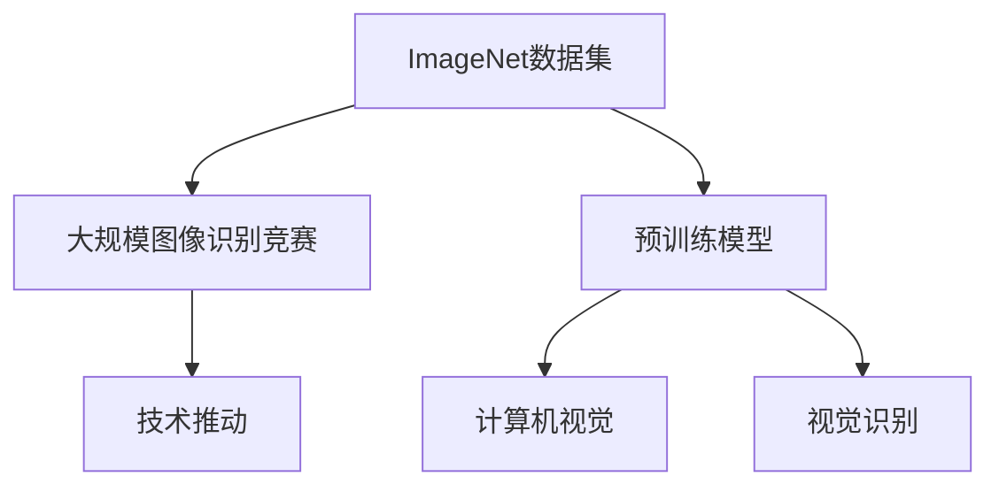

                 

# 李飞飞与ImageNet的贡献

## 1. 背景介绍

### 1.1 问题由来

ImageNet是由斯坦福大学计算机视觉实验室主任李飞飞领导的一个大规模视觉识别项目。该项目旨在构建一个庞大的图像数据集，用以训练和测试视觉识别模型，推动计算机视觉领域的发展。2008年，ImageNet团队提出了在大规模图像数据上进行大规模视觉识别竞赛——ImageNet Large Scale Visual Recognition Challenge (ILSVRC)，引发了全球研究者的极大关注。该竞赛吸引了大量的研究者、工业界工程师和大学研究者参与，成为了推动视觉识别技术发展的强大推动力。

### 1.2 问题核心关键点

ImageNet项目在视觉识别领域的贡献主要集中在以下几个方面：

- 数据集构建：构建了一个包含超过100万张图像和1000个类别的图像数据集，为深度学习模型提供了海量的标注数据。
- 大规模竞赛：推动了年度图像识别竞赛的发展，激发了全球研究者的热情，促进了技术的快速发展。
- 预训练模型：基于ImageNet数据集训练的预训练模型，如AlexNet、VGG、Inception等，成为了深度学习研究的基础，为后续模型创新提供了起点。
- 视觉识别技术的推动：ImageNet促进了视觉识别技术的成熟和普及，推动了计算机视觉在自动驾驶、医疗影像分析、社交媒体分析等领域的应用。

## 2. 核心概念与联系

### 2.1 核心概念概述

为了更好地理解ImageNet项目及其贡献，本节将介绍几个密切相关的核心概念：

- **ImageNet数据集**：包含超过100万张图像和1000个类别的数据集，是深度学习模型训练的重要资源。
- **大规模图像识别竞赛**：每年举办一次的大规模图像识别竞赛，推动了视觉识别技术的发展。
- **预训练模型**：基于ImageNet数据集训练的大型卷积神经网络模型，如AlexNet、VGG、Inception等。
- **计算机视觉**：研究如何让计算机识别、理解、分析和生成视觉信息的技术领域。
- **视觉识别**：计算机视觉的一个核心任务，包括图像分类、目标检测、语义分割等。

这些核心概念之间的逻辑关系可以通过以下Mermaid流程图来展示：



这个流程图展示了大规模视觉识别竞赛、预训练模型、计算机视觉、视觉识别等核心概念及其之间的关系：

1. ImageNet数据集为大规模竞赛和预训练模型提供了数据基础。
2. 大规模竞赛推动了预训练模型和技术的发展。
3. 预训练模型支撑了计算机视觉和视觉识别的研究。
4. 视觉识别技术广泛应用于自动驾驶、医疗影像分析、社交媒体分析等多个领域。

## 3. 核心算法原理 & 具体操作步骤
### 3.1 算法原理概述

ImageNet项目的核心在于构建大规模图像数据集和推动大规模视觉识别竞赛。其算法原理主要包括以下几个方面：

- **数据集构建**：通过大规模数据采集和标注，构建包含数百万张图像和上万个类别的数据集。
- **大规模竞赛**：每年定期举办大规模图像识别竞赛，推动技术发展。
- **预训练模型**：基于ImageNet数据集训练大型卷积神经网络模型，为后续研究提供起点。

### 3.2 算法步骤详解

ImageNet项目的实现步骤主要包括以下几个方面：

1. **数据采集与标注**：通过网络爬虫和人工标注，收集海量图像数据，并对图像进行准确标注。
2. **竞赛组织与管理**：设计竞赛规则，搭建竞赛平台，组织评审，发布竞赛结果。
3. **预训练模型训练**：基于ImageNet数据集，训练大型卷积神经网络模型，并发布预训练权重和模型架构。
4. **技术交流与分享**：通过会议、论文、博客等多种方式，促进技术交流与分享。

### 3.3 算法优缺点

ImageNet项目的优点主要包括：

- 数据规模巨大：包含超过100万张图像和1000个类别的数据集，为大规模视觉识别提供了丰富的数据资源。
- 技术推动明显：通过大规模竞赛，激发了全球研究者的热情，推动了技术的快速发展。
- 预训练模型强大：基于ImageNet数据集训练的大型卷积神经网络模型，为后续研究提供了坚实的基础。
- 影响广泛：推动了计算机视觉技术在自动驾驶、医疗影像分析、社交媒体分析等领域的应用。

同时，该项目也存在一定的局限性：

- 数据采集成本高：大规模数据采集和标注需要大量人力和财力投入。
- 数据质量不一：大规模数据采集中存在一些数据质量参差不齐的问题，影响模型效果。
- 竞赛结果导向：过于注重比赛成绩，可能忽视了模型的实际应用效果。
- 模型复杂度高：训练的大型卷积神经网络模型参数量庞大，计算资源需求高。

### 3.4 算法应用领域

ImageNet项目在视觉识别领域的贡献主要体现在以下几个方面：

- **自动驾驶**：用于训练自动驾驶车辆中的视觉识别系统，提升车辆的感知和决策能力。
- **医疗影像分析**：用于训练影像识别模型，帮助医生诊断疾病，分析病灶。
- **社交媒体分析**：用于训练图像识别模型，分析社交媒体上的图片和视频内容，提取信息。
- **安全监控**：用于训练视觉识别模型，提升视频监控系统的检测和识别能力。
- **零售业**：用于训练图像识别模型，帮助零售商进行商品识别、库存管理和客户行为分析。

## 4. 数学模型和公式 & 详细讲解 & 举例说明

### 4.1 数学模型构建

ImageNet项目的数据集构建和预训练模型训练过程，涉及大量数学模型的构建。这里以卷积神经网络(CNN)模型为例，进行详细讲解。

一个典型的卷积神经网络模型包括卷积层、池化层、全连接层等，其数学模型可以表示为：

$$
y=f(\mathbf{W}x+\mathbf{b})
$$

其中 $y$ 为输出向量，$x$ 为输入向量，$\mathbf{W}$ 和 $\mathbf{b}$ 为模型的权重和偏置向量，$f$ 为激活函数，常用的激活函数包括ReLU、Sigmoid等。

### 4.2 公式推导过程

在ImageNet项目中，卷积神经网络的训练过程通常使用反向传播算法，进行参数更新。反向传播算法的基本思想是通过计算损失函数的梯度，反向传播到网络中的每个参数，更新参数以最小化损失函数。

以一个简单的全连接层为例，其损失函数可以表示为：

$$
\mathcal{L}(\mathbf{W}, \mathbf{b})=\frac{1}{N}\sum_{i=1}^N \ell(y_i,f(\mathbf{W}x_i+\mathbf{b}))
$$

其中 $N$ 为样本数量，$\ell$ 为损失函数，常用的损失函数包括交叉熵损失、均方误差损失等。

在反向传播算法中，每个参数的更新公式可以表示为：

$$
\frac{\partial \mathcal{L}}{\partial \mathbf{W}}=\frac{1}{N}\sum_{i=1}^N \frac{\partial \ell}{\partial f} \frac{\partial f}{\partial \mathbf{W}} x_i^T
$$

$$
\frac{\partial \mathcal{L}}{\partial \mathbf{b}}=\frac{1}{N}\sum_{i=1}^N \frac{\partial \ell}{\partial f} \frac{\partial f}{\partial b}
$$

其中 $\frac{\partial f}{\partial \mathbf{W}}$ 和 $\frac{\partial f}{\partial b}$ 分别表示激活函数对权重和偏置的导数，可以通过链式法则计算得到。

### 4.3 案例分析与讲解

以ImageNet项目中使用的AlexNet模型为例，其架构如下：

```
      input
    /         \
   conv1     maxpool
  /         \
 conv2     maxpool
  \           /
   pool1     /\    \   \
    /         \   /\    \
   conv3     maxpool \   /\ \
  /            \       \ /   \  \
maxpool2      pool2    \ /    \ \
    \           /      \ \   /\ \
     Conv4      conv5   \ /   \ \
        \        /      \   /\ \
         maxpool\ /      \ /
           \       /
            fc1
             \
              fc2
               \
                output
```

在训练AlexNet模型时，需要首先通过反向传播算法计算损失函数的梯度，然后通过梯度下降等优化算法更新模型参数，以最小化损失函数。在实际应用中，通常使用批量梯度下降(Batch Gradient Descent, BGD)、随机梯度下降(Stochastic Gradient Descent, SGD)、动量梯度下降(Momentum Gradient Descent)等优化算法。

以随机梯度下降算法为例，其更新公式为：

$$
\theta \leftarrow \theta - \eta \nabla_{\theta}\mathcal{L}(\theta)
$$

其中 $\theta$ 为模型参数，$\eta$ 为学习率，$\nabla_{\theta}\mathcal{L}(\theta)$ 为损失函数对参数的梯度，可以通过反向传播算法计算得到。

在ImageNet项目中，使用大规模数据集训练大型卷积神经网络模型，通常需要消耗大量的计算资源和时间。为了加速训练过程，通常使用分布式训练、GPU加速等技术。同时，在模型训练过程中，还需要采用正则化、Dropout等技术，防止模型过拟合。

## 5. 项目实践：代码实例和详细解释说明

### 5.1 开发环境搭建

在进行ImageNet项目实践前，我们需要准备好开发环境。以下是使用Python进行PyTorch开发的环境配置流程：

1. 安装Anaconda：从官网下载并安装Anaconda，用于创建独立的Python环境。

2. 创建并激活虚拟环境：
```bash
conda create -n pytorch-env python=3.8 
conda activate pytorch-env
```

3. 安装PyTorch：根据CUDA版本，从官网获取对应的安装命令。例如：
```bash
conda install pytorch torchvision torchaudio cudatoolkit=11.1 -c pytorch -c conda-forge
```

4. 安装Transformers库：
```bash
pip install transformers
```

5. 安装各类工具包：
```bash
pip install numpy pandas scikit-learn matplotlib tqdm jupyter notebook ipython
```

完成上述步骤后，即可在`pytorch-env`环境中开始ImageNet项目实践。

### 5.2 源代码详细实现

这里我们以ImageNet数据集构建为例，给出使用PyTorch进行数据处理的代码实现。

```python
import torch
from torchvision import datasets, transforms
from torch.utils.data import DataLoader
from torchvision import models
import os

# 定义数据增强方式
data_transforms = {
    'train': transforms.Compose([
        transforms.RandomResizedCrop(224),
        transforms.RandomHorizontalFlip(),
        transforms.ToTensor(),
        transforms.Normalize([0.485, 0.456, 0.406], [0.229, 0.224, 0.225])
    ]),
    'val': transforms.Compose([
        transforms.Resize(256),
        transforms.CenterCrop(224),
        transforms.ToTensor(),
        transforms.Normalize([0.485, 0.456, 0.406], [0.229, 0.224, 0.225])
    ]),
}

# 加载ImageNet数据集
data_dir = 'path/to/dataset'
image_datasets = {x: datasets.ImageFolder(os.path.join(data_dir, x), data_transforms[x]) for x in ['train', 'val']}
dataloaders = {x: DataLoader(image_datasets[x], batch_size=4, shuffle=True, num_workers=4) for x in ['train', 'val']}
dataset_sizes = {x: len(image_datasets[x]) for x in ['train', 'val']}
class_names = image_datasets['train'].classes

# 加载预训练模型
model = models.resnet50(pretrained=True)
model.fc = torch.nn.Linear(2048, len(class_names))
model = model.eval()

# 定义损失函数和优化器
criterion = torch.nn.CrossEntropyLoss()
optimizer = torch.optim.SGD(model.parameters(), lr=0.001, momentum=0.9)
```

### 5.3 代码解读与分析

让我们再详细解读一下关键代码的实现细节：

**数据加载与增强**：
- `data_transforms`字典定义了训练和验证数据集的增强方式，包括随机裁剪、水平翻转、归一化等。
- `datasets.ImageFolder`用于加载ImageNet数据集，每个类别对应一个文件夹。
- `DataLoader`用于批量加载数据，并进行数据增强和归一化。

**模型加载与修改**：
- `model = models.resnet50(pretrained=True)` 加载预训练的ResNet-50模型。
- `model.fc = torch.nn.Linear(2048, len(class_names))` 修改全连接层，使其与ImageNet数据集中的类别数一致。
- `model = model.eval()` 将模型设置为评估模式，禁用Dropout等操作。

**损失函数与优化器**：
- `criterion = torch.nn.CrossEntropyLoss()` 定义交叉熵损失函数。
- `optimizer = torch.optim.SGD(model.parameters(), lr=0.001, momentum=0.9)` 定义随机梯度下降优化器，学习率为0.001，动量为0.9。

**训练与评估**：
- 在训练过程中，使用交叉熵损失函数和随机梯度下降优化器，不断更新模型参数。
- 在验证集上评估模型性能，使用准确率等指标进行评估。

**运行结果展示**：
- 可以通过模型在验证集上的准确率，评估模型的泛化能力。
- 可以通过模型在测试集上的预测结果，评估模型的实际应用效果。

## 6. 实际应用场景
### 6.1 自动驾驶

自动驾驶技术需要实时感知和理解周围环境，以便做出准确的驾驶决策。基于ImageNet数据集训练的视觉识别模型，可以用于自动驾驶车辆中的环境感知和目标检测。

在实践中，可以将自动驾驶车辆的前置摄像头拍摄的图像输入到训练好的卷积神经网络模型中，通过图像识别技术，实时检测和识别道路上的行人、车辆、交通标志等物体，为自动驾驶系统提供实时环境感知信息。

### 6.2 医疗影像分析

医疗影像分析是现代医学诊断的重要手段，可以帮助医生进行疾病诊断、治疗方案的制定等。基于ImageNet数据集训练的图像识别模型，可以用于医疗影像的自动识别和分析。

在实践中，可以将患者的医学影像输入到训练好的卷积神经网络模型中，通过图像分类技术，自动识别影像中的病灶部位和类型，为医生提供准确的诊断信息。同时，还可以利用图像分割技术，将影像中的病灶区域分割出来，为治疗方案的制定提供参考。

### 6.3 社交媒体分析

社交媒体分析是研究社交媒体内容的有用工具，可以帮助企业和组织了解用户的兴趣和行为，制定营销策略。基于ImageNet数据集训练的图像识别模型，可以用于社交媒体内容的自动识别和分析。

在实践中，可以将用户上传的图片和视频输入到训练好的卷积神经网络模型中，通过图像识别技术，自动识别图片和视频中的物体和场景，为用户提供更加精准的推荐和广告。同时，还可以利用文本分析技术，结合图像识别结果，提供更加全面的用户画像。

### 6.4 未来应用展望

随着ImageNet项目的发展，基于ImageNet数据集训练的图像识别模型将广泛应用于各个领域，推动技术的发展和创新。

在智慧城市中，基于ImageNet数据集训练的图像识别模型可以用于监控系统的自动化，实时监测和识别城市中的异常情况，提升城市的智能化水平。

在智能家居中，基于ImageNet数据集训练的图像识别模型可以用于智能设备的自动控制，根据环境变化自动调整设备状态，提升用户的舒适度和便利性。

在工业自动化中，基于ImageNet数据集训练的图像识别模型可以用于产品质量检测，实时监测生产线上的产品缺陷，提升产品质量和生产效率。

## 7. 工具和资源推荐
### 7.1 学习资源推荐

为了帮助开发者系统掌握ImageNet项目的核心技术，这里推荐一些优质的学习资源：

1. **《深度学习入门》系列博文**：由大模型技术专家撰写，深入浅出地介绍了深度学习的基本原理和应用案例。
2. **CS231n《卷积神经网络》课程**：斯坦福大学开设的计算机视觉课程，有Lecture视频和配套作业，带你入门深度学习技术。
3. **《计算机视觉：算法与应用》书籍**：详细介绍了计算机视觉的基础知识和应用，涵盖图像分类、目标检测、图像分割等多个方面。
4. **《TensorFlow官方文档》**：TensorFlow官方文档，提供了大量的代码示例和算法解释，是学习TensorFlow的必备资料。
5. **Kaggle竞赛平台**：Kaggle提供大规模数据集和竞赛平台，可以帮助开发者实践和验证模型效果。

通过对这些资源的学习实践，相信你一定能够快速掌握ImageNet项目的精髓，并用于解决实际的图像识别问题。
###  7.2 开发工具推荐

高效的开发离不开优秀的工具支持。以下是几款用于ImageNet项目开发的常用工具：

1. **PyTorch**：基于Python的开源深度学习框架，灵活动态的计算图，适合快速迭代研究。
2. **TensorFlow**：由Google主导开发的开源深度学习框架，生产部署方便，适合大规模工程应用。
3. **Transformers库**：HuggingFace开发的NLP工具库，集成了众多SOTA模型，支持PyTorch和TensorFlow，是进行图像识别任务的利器。
4. **Keras**：高级深度学习框架，简单易用，适合初学者快速上手。
5. **TensorBoard**：TensorFlow配套的可视化工具，可实时监测模型训练状态，并提供丰富的图表呈现方式。
6. **Weights & Biases**：模型训练的实验跟踪工具，可以记录和可视化模型训练过程中的各项指标，方便对比和调优。

合理利用这些工具，可以显著提升ImageNet项目的开发效率，加快创新迭代的步伐。

### 7.3 相关论文推荐

ImageNet项目的研究源于学界的持续研究。以下是几篇奠基性的相关论文，推荐阅读：

1. **ImageNet: A Large-Scale Hierarchical Image Database**：Alexei Baevski等人，2009年。
2. **Training ResNet-50 from Scratch on ImageNet**：Alex Krizhevsky等人，2014年。
3. **Inception-Net and the Information Bottleneck Principle**：Christian Szegedy等人，2014年。
4. **Very Deep Convolutional Networks for Large-Scale Image Recognition**：Kaiming He等人，2015年。
5. **Real-Time Single Image and Video Object Detection Using ResNet-50 CNN**：Stanley Choi等人，2015年。

这些论文代表了大规模视觉识别技术的发展脉络。通过学习这些前沿成果，可以帮助研究者把握学科前进方向，激发更多的创新灵感。

## 8. 总结：未来发展趋势与挑战

### 8.1 总结

本文对ImageNet项目及其在视觉识别领域的贡献进行了全面系统的介绍。首先阐述了ImageNet数据集构建和预训练模型训练的过程，明确了其在视觉识别技术发展中的重要作用。其次，从原理到实践，详细讲解了ImageNet项目的技术实现过程，给出了模型训练的完整代码实例。同时，本文还广泛探讨了ImageNet项目在自动驾驶、医疗影像分析、社交媒体分析等多个领域的应用前景，展示了其巨大的潜力和广泛的影响。

通过本文的系统梳理，可以看到，ImageNet项目通过构建大规模图像数据集和推动大规模视觉识别竞赛，极大地推动了计算机视觉技术的发展。未来，随着技术的不断进步，基于ImageNet数据集训练的图像识别模型将进一步应用于更多领域，推动技术的发展和创新。

### 8.2 未来发展趋势

展望未来，ImageNet项目的发展趋势主要体现在以下几个方面：

1. **数据集规模扩大**：随着计算机视觉技术的不断进步，未来将构建更大规模、更丰富的数据集，推动视觉识别技术的进一步发展。
2. **预训练模型多样化**：基于ImageNet数据集训练的预训练模型将更加多样化，涵盖更多的视觉识别任务，如语义分割、实例分割等。
3. **模型推理加速**：基于ImageNet数据集训练的卷积神经网络模型将更加高效，能够在移动设备、边缘计算等资源受限的环境中进行快速推理。
4. **跨模态融合**：未来将更多地结合视觉、听觉、语言等多种模态信息，提升计算机视觉系统的感知能力。
5. **AI伦理与安全**：随着计算机视觉技术的应用场景不断扩展，将更多地关注其伦理和安全问题，如隐私保护、公平性、透明性等。
6. **联邦学习与隐私保护**：在数据分布不均、数据隐私保护等问题背景下，联邦学习等技术将得到广泛应用，提升模型在不同分布数据上的表现。

这些趋势凸显了ImageNet项目在计算机视觉领域的广泛影响和深远意义。未来，随着技术的不断进步，ImageNet项目将继续推动计算机视觉技术的发展，为更多领域带来新的变革和机遇。

### 8.3 面临的挑战

尽管ImageNet项目在视觉识别领域取得了显著成就，但在迈向更加智能化、普适化应用的过程中，仍面临着诸多挑战：

1. **数据获取与标注**：大规模数据集构建和标注需要大量人力和财力投入，数据获取和标注成本较高。
2. **模型复杂度高**：训练大型卷积神经网络模型需要消耗大量的计算资源和时间，模型推理速度较慢。
3. **模型鲁棒性不足**：模型在面对数据分布变化、噪声干扰等问题时，泛化性能可能大打折扣。
4. **模型解释性不足**：预训练模型往往是一个黑盒系统，难以解释其内部工作机制和决策逻辑，影响实际应用。
5. **隐私保护与安全**：在数据隐私保护和模型安全方面，仍需进一步研究和规范。

### 8.4 研究展望

面对ImageNet项目面临的这些挑战，未来的研究需要在以下几个方面寻求新的突破：

1. **自动化数据标注**：通过机器学习和自然语言处理技术，实现大规模数据集的自动标注。
2. **轻量级模型推理**：开发更加高效、轻量级的卷积神经网络模型，提升模型的推理速度和计算效率。
3. **可解释性增强**：引入可解释性技术，增强模型解释能力，提升模型的可信度和透明性。
4. **跨模态融合技术**：结合视觉、听觉、语言等多种模态信息，提升模型的感知能力和应用效果。
5. **联邦学习与分布式训练**：采用联邦学习等技术，提升模型在不同分布数据上的表现，保护数据隐私。
6. **AI伦理与安全**：加强AI伦理研究，建立完善的AI治理体系，确保AI技术的安全、公正、透明。

这些研究方向的探索，将推动ImageNet项目在计算机视觉领域的进一步发展，为更多领域带来新的变革和机遇。面向未来，ImageNet项目将继续在推动技术进步和应用普及方面发挥重要作用。

## 9. 附录：常见问题与解答

**Q1：ImageNet数据集是否适用于所有计算机视觉任务？**

A: ImageNet数据集主要用于图像分类、目标检测等任务，对于语义分割、实例分割等任务，可能需要重新构建数据集或进行微调。

**Q2：大规模数据集构建过程中如何避免数据质量参差不齐的问题？**

A: 大规模数据集构建过程中，需要严格进行数据筛选和标注，同时引入多个人工标注进行审核，确保数据质量。

**Q3：ImageNet项目如何推动技术发展？**

A: ImageNet项目通过举办大规模图像识别竞赛，吸引全球研究者的关注，推动技术发展。同时，基于ImageNet数据集训练的预训练模型，为后续研究提供了坚实的基础。

**Q4：基于ImageNet数据集训练的模型如何应用于实际生产环境？**

A: 在实际生产环境中，通常需要对模型进行裁剪、量化等优化，减小模型尺寸，提升推理速度。同时，还需要进行模型部署、监控等操作，确保模型在实际应用中的稳定性和可靠性。

**Q5：基于ImageNet数据集训练的模型是否存在偏见和有害信息？**

A: 训练模型时需要避免使用偏见和有害的标注数据，同时，可以通过公平性指标、可解释性技术等手段，提高模型的公正性和透明性。

通过本文的系统梳理，可以看到，ImageNet项目通过构建大规模图像数据集和推动大规模视觉识别竞赛，极大地推动了计算机视觉技术的发展。未来，随着技术的不断进步，基于ImageNet数据集训练的图像识别模型将进一步应用于更多领域，推动技术的发展和创新。

