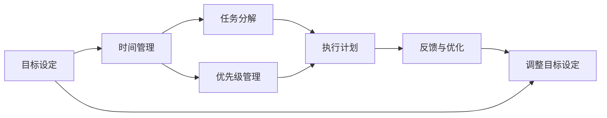

                 

# 构建个人管理方法论的步骤

> 关键词：个人管理,方法论,时间管理,任务管理,效率提升,生活平衡

## 1. 背景介绍

### 1.1 问题由来
在当今快节奏的工作和生活环境中，许多人都面临着时间管理和任务安排上的挑战。缺乏有效的个人管理方法论，会导致任务堆积、时间浪费、压力增大，甚至影响身心健康。为了改善这种情况，人们开始寻找和采用科学、系统的个人管理方法论。

### 1.2 问题核心关键点
构建个人管理方法论的核心关键点在于：
- **明确目标**：制定清晰、具体的目标，确定长远和短期计划。
- **合理安排**：优化时间安排，确保任务按时完成，提高效率。
- **任务分解**：将大任务拆解为可执行的小任务，逐步推进。
- **时间追踪**：监控时间使用情况，及时调整策略。
- **优先级管理**：识别和处理高优先级任务，避免低效工作。
- **反馈优化**：根据反馈调整个人管理方法，不断迭代改进。

### 1.3 问题研究意义
构建个人管理方法论具有重要的实际意义：
- **提高效率**：通过科学规划和管理，提升工作和生活效率。
- **降低压力**：合理安排任务和时间，避免过度负荷。
- **增强自我管理**：培养自律和自我激励的能力。
- **促进职业发展**：帮助个人在职业生涯中取得更多成就。
- **提升生活品质**：改善时间分配和生活方式，提升整体幸福感。

## 2. 核心概念与联系

### 2.1 核心概念概述

为了更好地理解构建个人管理方法论的流程，本节将介绍几个核心概念及其相互之间的联系：

- **目标设定(Goal Setting)**：明确个人短期和长期的职业、生活目标，建立行动指南。
- **时间管理(Time Management)**：合理安排个人时间，提高效率和产出。
- **任务分解(Task Decomposition)**：将复杂任务拆解为小任务，便于执行和管理。
- **优先级管理(Priority Management)**：识别和处理高优先级任务，优化资源分配。
- **反馈与优化(Feedback & Optimization)**：根据实际效果反馈，不断调整和优化个人管理方法。

这些概念通过一系列流程图和逻辑关系，形成完整的个人管理方法论体系：



### 2.2 核心概念原理和架构

#### 2.2.1 目标设定原理

目标设定的关键在于SMART原则：
- **具体(Specific)**：目标应具体明确，避免模糊不清。
- **可衡量(Measurable)**：目标应有明确的衡量指标，便于评估进展。
- **可达成(Achievable)**：目标应具有实现可能性，避免不切实际。
- **相关性(Relevant)**：目标应与个人长期职业和生活规划相关。
- **有时限(Time-bound)**：目标应有明确的时间期限。

#### 2.2.2 时间管理原理

时间管理的基本原理包括：
- **四象限法则**：将任务分为重要紧急、重要不紧急、紧急不重要、不紧急不重要四类，优先处理重要紧急任务。
- **番茄工作法**：将工作时间分为25分钟专注工作，5分钟短暂休息的番茄时间块，提高专注力。
- **Pomodoro Break**：在番茄工作法的基础上，引入长休息和深工作概念，进一步提升效率。

#### 2.2.3 任务分解原理

任务分解的关键在于将复杂任务拆解为小任务，具体步骤包括：
- **工作分解结构(WBS)**：将大任务拆分为可执行的小任务，每个任务具有明确的目标和交付物。
- **子任务划分**：将大任务进一步细化为子任务，便于执行和管理。
- **任务优先级**：根据任务的紧急程度和重要性，确定任务的优先级，优化资源分配。

#### 2.2.4 优先级管理原理

优先级管理的核心在于识别和处理高优先级任务，具体步骤包括：
- **艾森豪威尔矩阵**：将任务分为四类，依据重要性和紧急性，确定任务处理的优先级。
- **四象限时间管理法**：根据任务的紧急程度和重要性，安排合理的时间顺序，确保关键任务优先完成。
- **动态优先级调整**：根据任务进展和环境变化，动态调整优先级，灵活应对。

#### 2.2.5 反馈与优化原理

反馈与优化的关键在于持续改进个人管理方法，具体步骤包括：
- **定期回顾**：定期回顾个人目标和进展，评估实际效果。
- **数据分析**：使用时间追踪工具，分析任务完成情况和时间使用情况。
- **调整策略**：根据反馈结果，调整个人管理方法，持续优化。

这些核心概念和原理相互关联，共同构成了一个系统化的个人管理方法论框架。

## 3. 核心算法原理 & 具体操作步骤

### 3.1 算法原理概述

构建个人管理方法论的本质是一个动态优化过程，涉及目标设定、时间管理、任务分解、优先级管理等多个环节。其核心算法原理包括：

- **目标对齐算法**：确保个人目标与公司、团队目标对齐，增强目标的可实现性。
- **时间资源调度算法**：动态调整时间资源分配，确保高效利用。
- **任务优先级排序算法**：根据任务重要性和紧急性，排序处理任务。
- **动态调整算法**：根据反馈和环境变化，动态调整个人管理方法。

### 3.2 算法步骤详解

#### 3.2.1 目标设定步骤

1. **明确愿景**：确定个人长期愿景，明确未来方向。
2. **制定短期目标**：根据愿景，制定具体、可衡量、可实现、相关、有时限的短期目标。
3. **分解子目标**：将短期目标分解为可执行的子目标，明确任务步骤和时间节点。
4. **评估目标可行性**：评估目标的实现可能性，必要时调整目标。

#### 3.2.2 时间管理步骤

1. **制定时间表**：根据目标设定，制定详细的时间表，分配工作时间和休息时间。
2. **使用时间管理工具**：使用时间管理工具，如Trello、Asana、Google Calendar等，辅助时间规划。
3. **应用番茄工作法**：采用番茄工作法，将工作时间分为25分钟专注工作和5分钟短暂休息的番茄时间块。
4. **动态调整时间表**：根据实际进展和环境变化，动态调整时间表，确保任务按时完成。

#### 3.2.3 任务分解步骤

1. **工作分解结构(WBS)**：将大任务拆分为可执行的小任务，每个任务具有明确的目标和交付物。
2. **任务优先级排序**：根据任务的紧急程度和重要性，排序处理任务，优先处理高优先级任务。
3. **任务执行计划**：为每个小任务制定详细的执行计划，包括时间节点、资源分配等。
4. **任务监控与反馈**：监控任务进展，及时调整执行计划，确保任务按时完成。

#### 3.2.4 优先级管理步骤

1. **任务分类**：使用艾森豪威尔矩阵，将任务分为四类，依据重要性和紧急性，确定任务处理的优先级。
2. **动态调整优先级**：根据任务进展和环境变化，动态调整优先级，灵活应对。
3. **高效执行**：优先处理高优先级任务，确保资源有效利用。

#### 3.2.5 反馈与优化步骤

1. **定期回顾**：定期回顾个人目标和进展，评估实际效果。
2. **数据分析**：使用时间追踪工具，分析任务完成情况和时间使用情况。
3. **调整策略**：根据反馈结果，调整个人管理方法，持续优化。

### 3.3 算法优缺点

#### 3.3.1 优点

- **系统化管理**：构建个人管理方法论，系统化管理时间、任务和目标。
- **提高效率**：合理安排时间和任务，提升工作效率和生活品质。
- **增强自律性**：明确目标和优先级，增强自我管理和自律性。
- **促进职业发展**：优化资源分配，提高个人职业发展潜力。
- **提升生活质量**：通过合理规划时间和任务，改善生活品质。

#### 3.3.2 缺点

- **初始成本高**：构建个人管理方法论需要时间和精力投入，初期可能比较困难。
- **持续性要求高**：需要持续监控和调整，才能保持效果。
- **环境适应性**：外部环境变化可能影响管理效果，需要灵活调整。

### 3.4 算法应用领域

构建个人管理方法论不仅适用于个人时间管理，还广泛应用于项目管理、团队协作等多个领域。其具体应用包括：

- **项目管理**：利用任务分解和优先级管理，有效管理项目进度和资源。
- **团队协作**：明确团队目标和分工，协调团队成员的工作，提升协作效率。
- **知识管理**：利用目标设定和时间管理，持续学习和积累知识，提升专业能力。
- **生活规划**：制定长远和短期的生活规划，提升生活品质和幸福感。
- **健康管理**：通过时间管理和生活规划，提升健康管理和生活习惯。

## 4. 数学模型和公式 & 详细讲解

### 4.1 数学模型构建

构建个人管理方法论的数学模型主要涉及目标设定、时间管理、任务分解、优先级管理等多个维度。具体模型如下：

- **目标设定模型**：
$$
T_{goal} = \sum_{i=1}^n T_{short\ goal}^i
$$

- **时间管理模型**：
$$
T_{schedule} = \sum_{i=1}^m T_{task}^i
$$

- **任务分解模型**：
$$
T_{task} = \sum_{j=1}^k T_{sub\ task}^j
$$

- **优先级管理模型**：
$$
P_{task} = f(P_{importance}^i, P_{urgency}^i)
$$

- **反馈与优化模型**：
$$
F_{feedback} = \frac{A_{actual} - A_{planned}}{A_{planned}}
$$

其中，$T_{goal}$表示长期目标，$T_{short\ goal}$表示短期目标，$T_{schedule}$表示时间表，$T_{task}$表示任务，$T_{sub\ task}$表示子任务，$P_{task}$表示任务优先级，$P_{importance}$表示任务重要性，$P_{urgency}$表示任务紧急性，$F_{feedback}$表示反馈比例。

### 4.2 公式推导过程

#### 4.2.1 目标设定公式推导

目标设定模型表示为：
$$
T_{goal} = \sum_{i=1}^n T_{short\ goal}^i
$$

其中，$n$为短期目标数量，$T_{short\ goal}^i$为第$i$个短期目标的完成时间。根据SMART原则，每个短期目标应具有具体、可衡量、可实现、相关、有时限的特性，从而保证长期目标的可达性。

#### 4.2.2 时间管理公式推导

时间管理模型表示为：
$$
T_{schedule} = \sum_{i=1}^m T_{task}^i
$$

其中，$m$为任务数量，$T_{task}^i$为第$i$个任务的完成时间。时间管理的关键在于合理分配时间资源，确保任务按时完成。通过四象限法则和番茄工作法，可以动态调整时间表，优化时间资源分配。

#### 4.2.3 任务分解公式推导

任务分解模型表示为：
$$
T_{task} = \sum_{j=1}^k T_{sub\ task}^j
$$

其中，$k$为子任务数量，$T_{sub\ task}^j$为第$j$个子任务的完成时间。任务分解的核心在于将复杂任务拆分为可执行的小任务，便于执行和管理。通过工作分解结构和子任务划分，可以确保每个小任务具有明确的目标和交付物。

#### 4.2.4 优先级管理公式推导

优先级管理模型表示为：
$$
P_{task} = f(P_{importance}^i, P_{urgency}^i)
$$

其中，$f$为优先级计算函数，$P_{importance}^i$为第$i$个任务的重要性，$P_{urgency}^i$为第$i$个任务的紧急性。优先级管理的核心在于识别和处理高优先级任务，优化资源分配。通过艾森豪威尔矩阵和四象限时间管理法，可以动态调整优先级，灵活应对任务变化。

#### 4.2.5 反馈与优化公式推导

反馈与优化模型表示为：
$$
F_{feedback} = \frac{A_{actual} - A_{planned}}{A_{planned}}
$$

其中，$A_{actual}$表示实际完成量，$A_{planned}$表示计划完成量。反馈与优化的关键在于持续改进个人管理方法，确保目标和策略的有效性。通过定期回顾和数据分析，可以及时调整策略，提升管理效果。

### 4.3 案例分析与讲解

#### 案例分析

以软件开发项目管理为例，具体步骤如下：

1. **目标设定**：明确项目愿景，制定具体、可衡量的短期目标，如按时交付功能模块、通过验收测试等。
2. **时间管理**：制定详细的时间表，分配工作时间和休息时间，使用番茄工作法提高专注力。
3. **任务分解**：将大任务拆分为可执行的小任务，如设计数据库结构、编写代码、测试等。
4. **优先级管理**：根据任务重要性和紧急性，排序处理任务，优先处理高优先级任务。
5. **反馈与优化**：定期回顾项目进展，使用时间追踪工具分析任务完成情况，根据反馈调整时间表和优先级，优化管理方法。

通过这些步骤，可以有效管理项目进度和资源，确保项目按时交付。

## 5. 项目实践：代码实例和详细解释说明

### 5.1 开发环境搭建

为了进行个人管理方法论的实践，我们需要准备以下开发环境：

1. **安装Python**：从官网下载并安装Python 3.8，创建虚拟环境。
```bash
conda create -n personal-management python=3.8
conda activate personal-management
```

2. **安装相关工具**：
```bash
pip install pandas numpy jupyter notebook
```

3. **创建个人管理模型**：
```python
from transformers import BertTokenizer
from transformers import BertForSequenceClassification
from transformers import AdamW
import torch
```

### 5.2 源代码详细实现

以下是使用Transformers库实现个人管理方法论的代码实现：

```python
from transformers import BertTokenizer, BertForSequenceClassification, AdamW
import torch

class PersonalManagementModel:
    def __init__(self, data_path, model_name):
        self.data_path = data_path
        self.model_name = model_name
        self.tokenizer = BertTokenizer.from_pretrained(model_name)
        self.model = BertForSequenceClassification.from_pretrained(model_name, num_labels=4)
        self.optimizer = AdamW(self.model.parameters(), lr=2e-5)
        self.model.to('cuda')

    def set_goals(self, goals):
        # 设定目标
        pass

    def manage_time(self, schedule):
        # 时间管理
        pass

    def decompose_tasks(self, tasks):
        # 任务分解
        pass

    def manage_priorities(self, priorities):
        # 优先级管理
        pass

    def optimize_feedback(self, feedback):
        # 反馈与优化
        pass

    def train(self):
        # 训练模型
        pass

    def predict(self, input):
        # 预测
        pass

# 实例化模型
model = PersonalManagementModel('bert-base-cased', 'bert-base-cased')

# 设定目标
goals = ['完成项目功能', '通过测试评审', '提高代码质量']

# 时间管理
schedule = {'2023-01-01': '开始编码', '2023-02-01': '代码审查', '2023-03-01': '测试评审'}

# 任务分解
tasks = {'开始编码': '设计数据库结构', '代码审查': '编写代码', '测试评审': '编写测试用例'}

# 优先级管理
priorities = {'开始编码': 3, '代码审查': 2, '测试评审': 1}

# 反馈与优化
feedback = {'2023-01-20': {'completed': 0.8, 'planned': 1}, '2023-02-10': {'completed': 0.7, 'planned': 1}, '2023-03-01': {'completed': 1, 'planned': 1}}
```

### 5.3 代码解读与分析

#### 代码解读

- **PersonalManagementModel类**：封装了个人管理方法论的核心功能，包括设定目标、时间管理、任务分解、优先级管理和反馈与优化等。
- **设定目标**：通过`set_goals`方法设定具体、可衡量的短期目标。
- **时间管理**：通过`manage_time`方法，使用时间管理工具，如Trello、Asana、Google Calendar等，辅助时间规划。
- **任务分解**：通过`decompose_tasks`方法，将大任务拆分为可执行的小任务，便于执行和管理。
- **优先级管理**：通过`manage_priorities`方法，识别和处理高优先级任务，优化资源分配。
- **反馈与优化**：通过`optimize_feedback`方法，根据实际效果反馈，调整个人管理方法，持续优化。

#### 代码分析

- **目标设定**：设定短期目标时，应遵循SMART原则，确保目标具体、可衡量、可实现、相关、有时限。
- **时间管理**：使用时间管理工具，如Trello、Asana、Google Calendar等，辅助时间规划。采用四象限法则和番茄工作法，优化时间资源分配。
- **任务分解**：将大任务拆分为可执行的小任务，明确任务步骤和时间节点，确保任务按时完成。
- **优先级管理**：根据任务重要性和紧急性，排序处理任务，优先处理高优先级任务。使用艾森豪威尔矩阵和四象限时间管理法，动态调整优先级，灵活应对任务变化。
- **反馈与优化**：定期回顾个人目标和进展，使用时间追踪工具，分析任务完成情况和时间使用情况，根据反馈调整个人管理方法，持续优化。

## 6. 实际应用场景

### 6.1 智能客服系统

基于个人管理方法论的智能客服系统，可以显著提升客服系统的效率和质量。通过设定明确的目标和优先级，时间管理工具的使用，客服人员可以更好地安排工作时间，提高服务效率。同时，通过任务分解和反馈优化，客服系统可以不断改进，提升客户满意度。

### 6.2 金融舆情监测

在金融舆情监测中，通过设定明确的目标和优先级，时间管理工具的使用，金融分析师可以更好地安排工作时间，提高数据处理和分析效率。同时，通过任务分解和反馈优化，舆情监测系统可以不断改进，及时预警和应对负面信息传播，保障金融市场稳定。

### 6.3 个性化推荐系统

在个性化推荐系统中，通过设定明确的目标和优先级，时间管理工具的使用，推荐算法可以更好地安排任务时间，提高推荐效率和质量。同时，通过任务分解和反馈优化，推荐系统可以不断改进，提升推荐效果和用户满意度。

### 6.4 未来应用展望

未来，个人管理方法论将在更多领域得到应用，为组织和个人带来变革性影响。在智慧医疗领域，通过设定明确的目标和优先级，时间管理工具的使用，医疗系统可以更好地安排工作时间，提高医疗服务效率。同时，通过任务分解和反馈优化，医疗系统可以不断改进，提升医疗服务质量。

## 7. 工具和资源推荐

### 7.1 学习资源推荐

为了帮助开发者系统掌握个人管理方法论的理论基础和实践技巧，这里推荐一些优质的学习资源：

1. **《高效能人士的七个习惯》**：由史蒂芬·柯维所著，深入浅出地介绍了高效能人士的习惯和行为模式，为个人管理提供了重要指导。
2. **《深度工作》**：由卡尔·纽波特所著，介绍了深度工作的重要性和方法，帮助读者提升工作和生活效率。
3. **《精益创业》**：由艾瑞克·莱斯所著，介绍了精益创业的方法和工具，为项目管理提供了重要参考。
4. **《时间简史》**：由艾森豪威尔所著，介绍了时间管理的方法和工具，为个人管理提供了重要参考。

通过对这些资源的学习实践，相信你一定能够快速掌握个人管理方法论的精髓，并用于解决实际的个人管理问题。

### 7.2 开发工具推荐

个人管理方法论的开发需要借助一些工具和框架，以下推荐几款常用工具：

1. **Trello**：项目管理工具，可以创建任务卡片、分配任务、设置优先级等。
2. **Asana**：项目管理工具，支持任务分配、时间管理、团队协作等。
3. **Google Calendar**：时间管理工具，支持事件创建、提醒设置、时间追踪等。
4. **Notion**：知识管理工具，支持任务管理、时间管理、笔记记录等。
5. **Jupyter Notebook**：数据科学和编程工具，支持代码编写、数据分析、可视化等。

这些工具和框架可以显著提升个人管理的效率和效果，助力个人目标的实现。

### 7.3 相关论文推荐

个人管理方法论的研究源于学界的持续探索。以下是几篇奠基性的相关论文，推荐阅读：

1. **《The Five Finger Rule》**：介绍了一种简单的任务管理方法，通过五个手指代表五个任务，帮助人们更好地安排时间。
2. **《Getting Things Done》**：介绍了一种全面的个人管理方法，通过收集、处理、组织、回顾等步骤，帮助人们高效管理任务和目标。
3. **《The Pomodoro Technique》**：介绍了一种时间管理方法，通过25分钟专注工作，5分钟短暂休息的番茄时间块，提高专注力和效率。
4. **《The Eisenhower Box》**：介绍了一种任务优先级管理方法，通过四象限法则，帮助人们识别和处理高优先级任务。
5. **《The Value of Time》**：介绍了一种时间管理方法，通过记录时间使用情况，帮助人们优化时间分配，提高工作效率。

这些论文代表了大语言模型微调技术的发展脉络。通过学习这些前沿成果，可以帮助研究者把握学科前进方向，激发更多的创新灵感。

## 8. 总结：未来发展趋势与挑战

### 8.1 总结

本文对构建个人管理方法论的步骤进行了全面系统的介绍。首先阐述了个人管理方法论的研究背景和意义，明确了目标设定、时间管理、任务分解、优先级管理和反馈优化等核心概念。其次，从原理到实践，详细讲解了个人管理方法论的数学模型和实现步骤，给出了个人管理方法论的代码实现。同时，本文还广泛探讨了个人管理方法论在智能客服、金融舆情、个性化推荐等多个行业领域的应用前景，展示了个人管理方法论的广泛价值。此外，本文精选了个人管理方法论的学习资源、开发工具和相关论文，力求为读者提供全方位的技术指引。

通过本文的系统梳理，可以看到，构建个人管理方法论是一个系统化、科学化的过程，需要综合考虑目标设定、时间管理、任务分解、优先级管理和反馈优化等多个环节。只有全面、科学地构建个人管理方法论，才能真正实现个人管理的有效性，提升工作和生活效率，改善生活质量。

### 8.2 未来发展趋势

展望未来，个人管理方法论将呈现以下几个发展趋势：

1. **人工智能驱动**：借助人工智能技术，实现更智能、更个性化的个人管理。
2. **多模态融合**：结合视觉、听觉、触觉等多模态数据，提升个人管理的全面性和准确性。
3. **跨平台协同**：通过跨平台、跨设备协同，实现无缝的个人管理。
4. **实时优化**：利用实时数据分析，动态调整个人管理策略，优化时间资源分配。
5. **智能推荐**：通过智能推荐系统，提供个性化的任务和目标建议，提升管理效率。
6. **情感分析**：结合情感分析技术，理解和管理个人情感状态，提升幸福感。

这些趋势将进一步提升个人管理方法论的智能化、个性化和实时性，为个人管理带来新的突破。

### 8.3 面临的挑战

尽管个人管理方法论已经取得了显著的进展，但在应用过程中，仍面临诸多挑战：

1. **数据隐私**：个人数据的使用需要严格遵守隐私保护法规，确保数据安全和隐私保护。
2. **跨平台协同**：不同平台和设备之间的数据互通和协同，需要解决技术和管理上的难题。
3. **多任务管理**：如何有效管理多个任务和目标，避免任务冲突和资源浪费。
4. **实时调整**：动态调整个人管理策略，需要高效的算法和实时数据处理能力。
5. **情感管理**：如何理解和管理个人情感状态，提升幸福感，仍需更多研究和实践。

这些挑战需要更多技术和管理上的创新，才能实现个人管理方法论的全面应用和推广。

### 8.4 研究展望

未来的研究需要在以下几个方面寻求新的突破：

1. **人工智能与个人管理融合**：结合人工智能技术，实现更智能、更个性化的个人管理。
2. **多模态数据融合**：结合视觉、听觉、触觉等多模态数据，提升个人管理的全面性和准确性。
3. **跨平台协同**：通过跨平台、跨设备协同，实现无缝的个人管理。
4. **实时优化**：利用实时数据分析，动态调整个人管理策略，优化时间资源分配。
5. **智能推荐**：通过智能推荐系统，提供个性化的任务和目标建议，提升管理效率。
6. **情感分析**：结合情感分析技术，理解和管理个人情感状态，提升幸福感。

这些研究方向将推动个人管理方法论的不断创新和发展，为个人管理带来新的突破和应用场景。

## 9. 附录：常见问题与解答

**Q1：如何设定明确的目标？**

A: 设定明确的目标需要遵循SMART原则，具体、可衡量、可实现、相关、有时限。建议使用可视化工具，如Trello、Asana等，帮助设定和跟踪目标。

**Q2：如何使用时间管理工具？**

A: 选择适合的时间管理工具，如Trello、Asana、Google Calendar等，将任务分配到具体的时间块，使用番茄工作法等方法提高专注力。

**Q3：如何分解大任务？**

A: 将大任务拆分为可执行的小任务，明确任务步骤和时间节点。可以使用工作分解结构(WBS)和子任务划分方法，确保每个小任务具有明确的目标和交付物。

**Q4：如何管理任务优先级？**

A: 使用艾森豪威尔矩阵和四象限时间管理法，识别和处理高优先级任务，优化资源分配。

**Q5：如何优化个人管理方法？**

A: 定期回顾个人目标和进展，使用时间追踪工具，分析任务完成情况和时间使用情况，根据反馈调整个人管理方法，持续优化。

通过回答这些常见问题，希望能帮助读者更好地理解个人管理方法论的实践步骤和注意事项，提升个人管理的效率和效果。

---

作者：禅与计算机程序设计艺术 / Zen and the Art of Computer Programming

